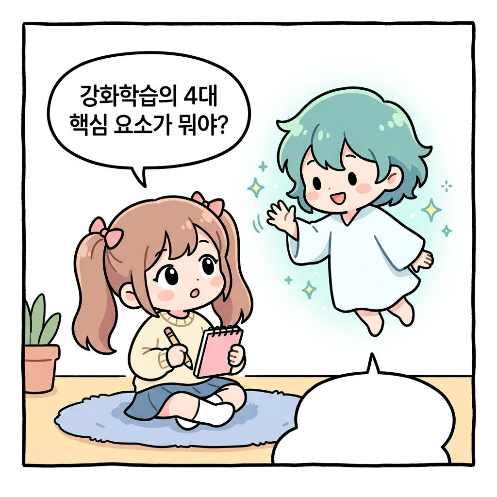
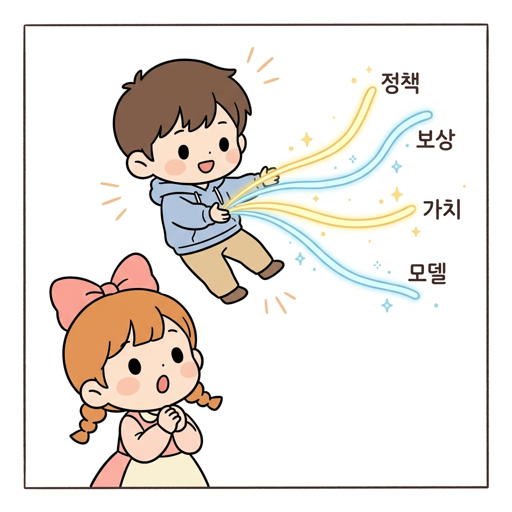
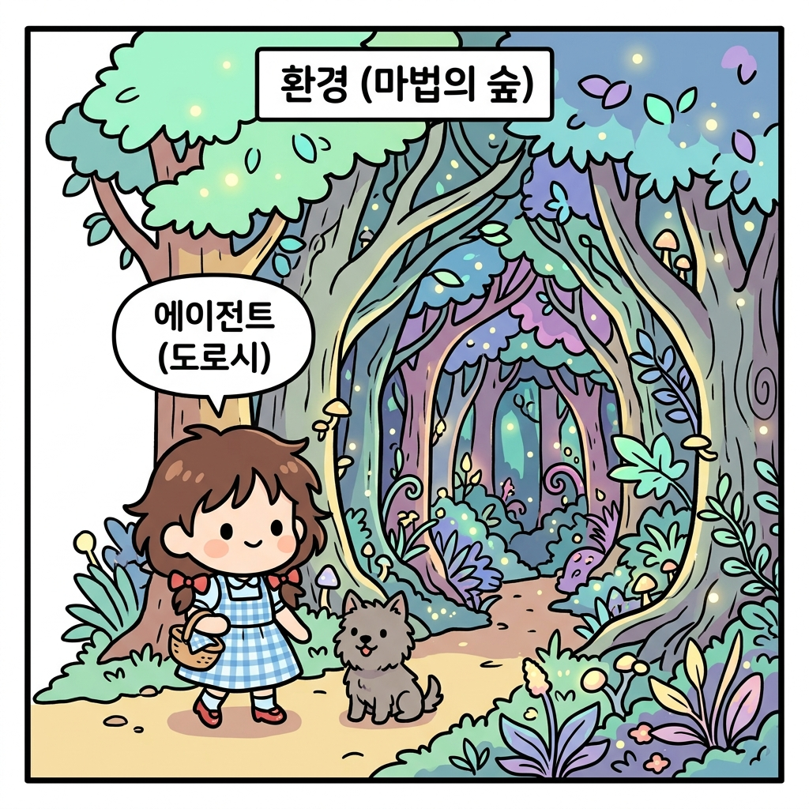
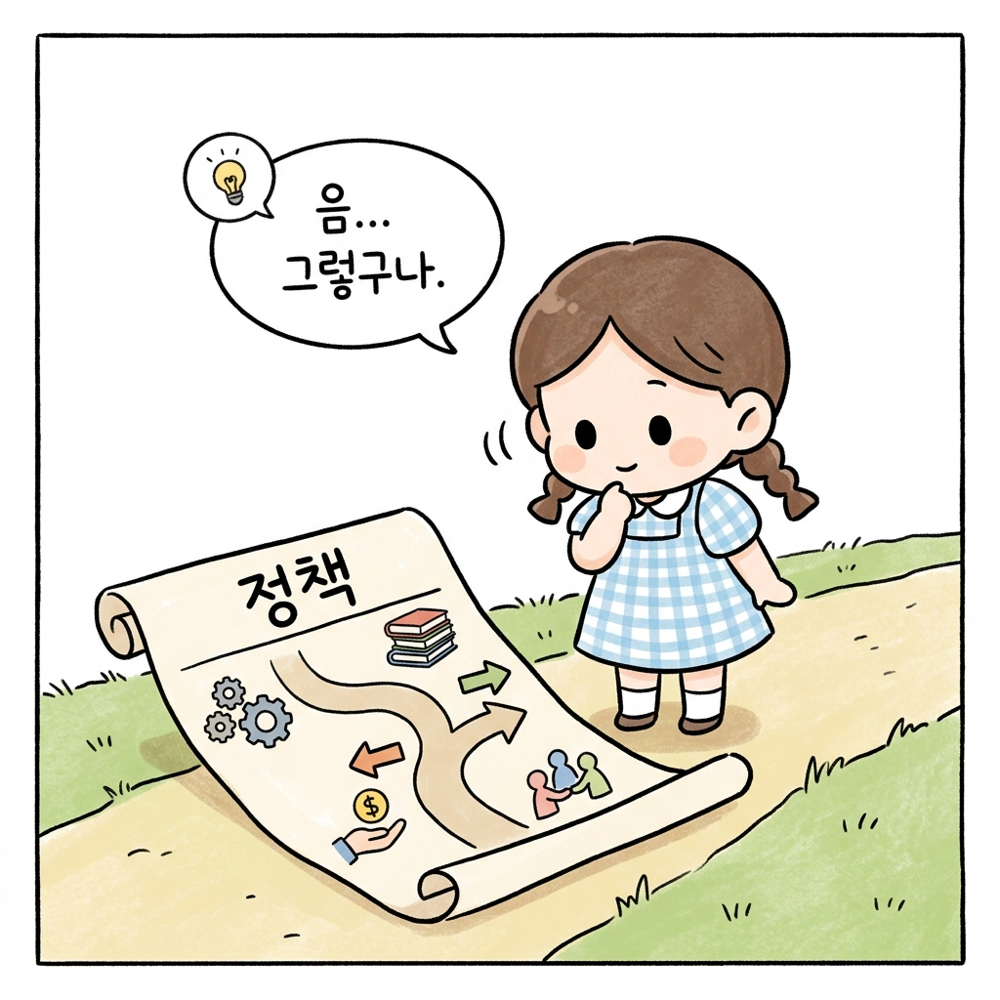
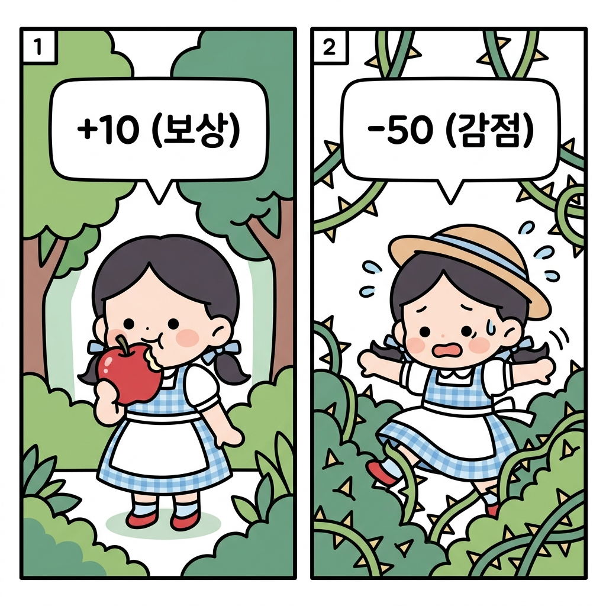
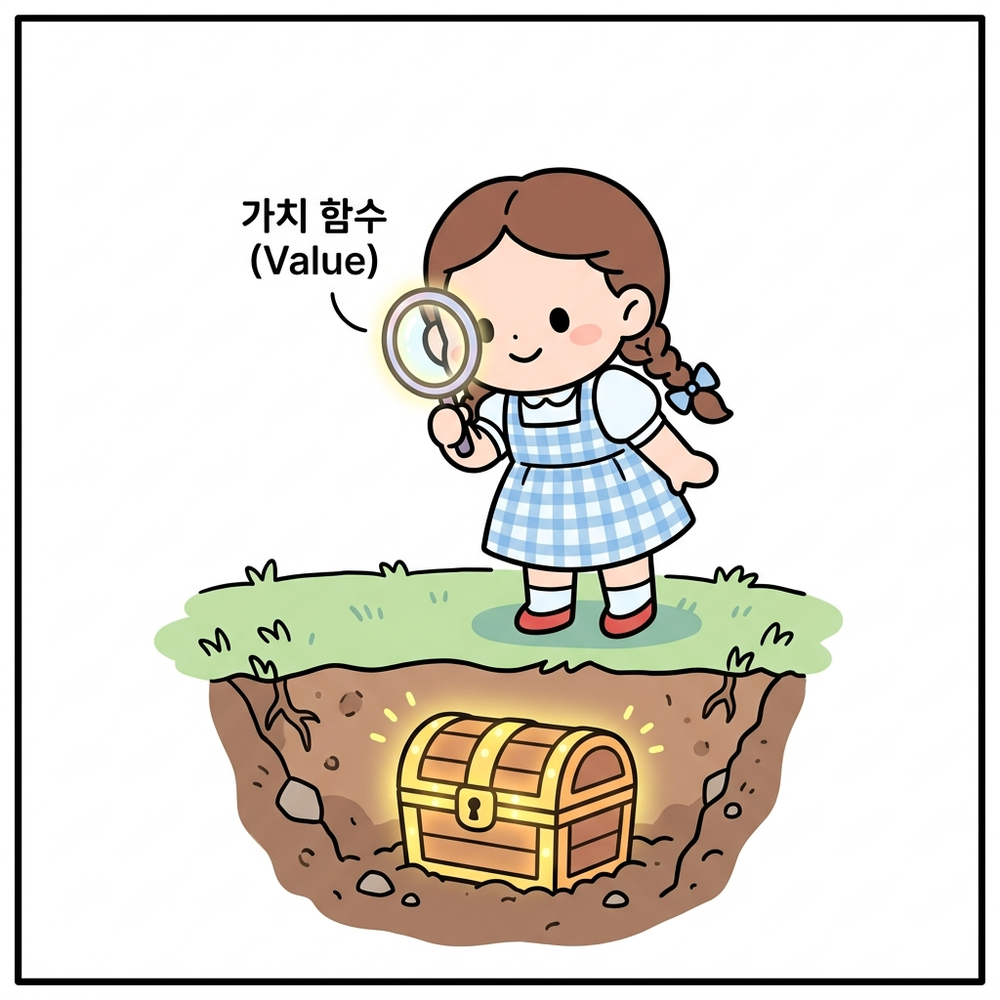
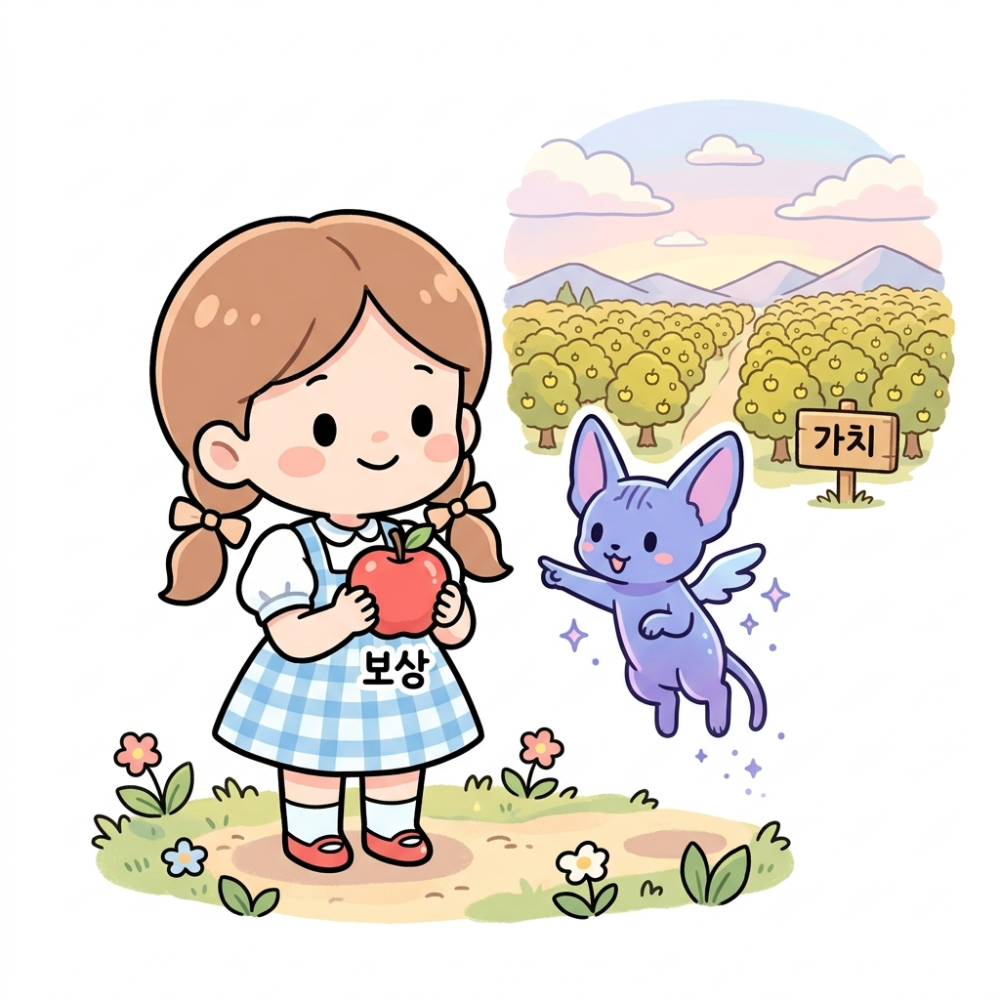
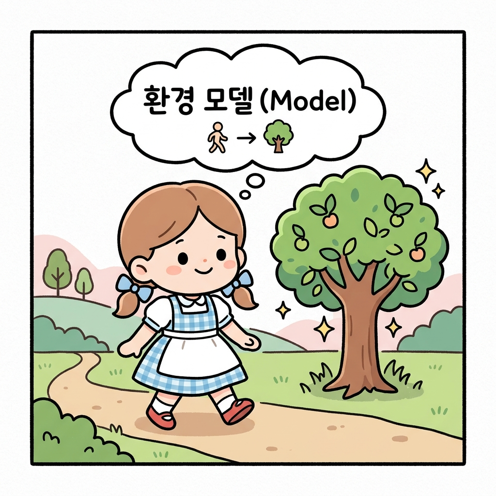
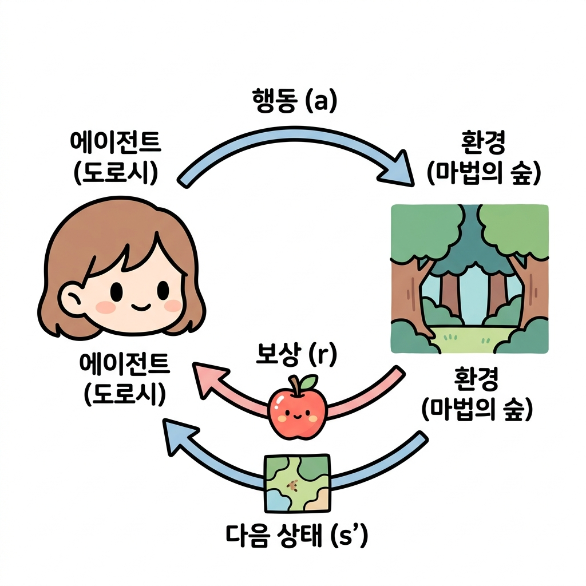

# 01.4 강화학습의 4대 핵심 요소

> **강화학습의 상호작용**은 에이전트와 환경이라는 두 기둥을 바탕으로 돌아가며, 이를 조절하는 핵심 설계 요소인 **정책(*π*)**, **보상(*r*)**, **가치 함수(*v*, *q*)**, **환경 모델(Model)**의 4대 구성 요소를 통해 최적의 학습 경로를 공식화합니다.

"지니! 그렇다면 이 강화학습 마법을 부릴 때 꼭 알아야 하는 기본 마법 재료들은 어떤 것들이 있어?"

도로시가 연필을 쥐고 기록할 준비를 하며 물었습니다. 토토도 나침반 주위를 빙글빙글 돌며 호기심 어린 눈빛을 보냈습니다.

**그림 1-4-a** 수첩을 들고 강화학습의 4대 핵심 요소가 무엇인지 지니에게 묻는 도로시

지니는 허공에 반짝이는 네 갈래의 마법 실선을 늘어놓으며 설명했습니다.

**그림 1-4-b** 지니가 손끝으로 정책, 보상, 가치, 모델의 4가지 핵심 기둥(실선)을 띄우는 장면

"강화학습 마법을 구성하는 가장 기본적이고도 핵심적인 재료는 **4대 구성 요소**란다. 

여기에 우리의 모험가(에이전트)와 탐험 무대(환경)가 결합되어 거대한 마법 굴레가 돌아가게 되지."

---

## 01.4.1 에이전트와 환경: 상호작용의 두 기둥

4대 요소를 배우기 전에, 마법이 일어나는 두 대상을 명확히 정의해야 합니다.

* **에이전트Agent (도로시와 토토)**:
  * 학습을 하고 결정을 내리는 주체입니다. 현재 자신의 위치와 상황을 파악하여 어떻게 행동할지 고민하는 똑똑한 모험가입니다.
* **환경Environment (마법의 숲)**:
  * 에이전트를 둘러싼 세상 전체입니다. 도로시가 동서남북 중 한 곳으로 발걸음을 옮기면, 그 발걸음을 받아들이고 도로시에게 새로운 풍경(다음 상태)을 보여주며 잘했는지 못했는지 피드백(보상)을 줍니다.

**그림 1-4-c** 마법의 숲(환경)이라는 거대한 무대에 에이전트로서 첫 발걸음을 딛는 도로시와 토토

---

## 01.4.2 강화학습을 지탱하는 4대 기둥

지니가 손가락을 튕기자, 네 가지 마법의 단어가 공중에 차례대로 빛나기 시작했습니다.

### 🧭 1. 정책 (Policy, *π*)
* **정의**: 에이전트가 어떤 상태에서 어떤 행동을 취할지 결정하는 행동 가이드북(지도)입니다.
* **도로시의 비유**: "갈림길을 만났을 때, 사과 수첩 지도를 보고 오른쪽으로 갈지 왼쪽으로 갈지 결정하는 화살표 규칙"입니다. 
* **수학적 기호**: 그리스 문자 파이(*π*)로 표기하며, 상태 *s*에서 행동 *a*를 할 확률인 *π*(*a*|*s*)로 표현됩니다. 최적의 지도를 찾아내는 것이 **강화학습의 최종 목표**입니다.

**그림 1-4-d** 상태에 따라 갈 길을 결정해 주는 지도 역할을 하는 정책(*π*)

### 🍎 2. 보상 (Reward, *r*)
* **정의**: 에이전트가 어떤 행동을 했을 때 환경이 즉각적으로 돌려주는 칭찬이나 꾸중(상벌)입니다.
* **도로시의 비유**: "길가다 따먹는 달콤한 빨간 사과(`+10`)와 깊은 가시나무 웅덩이에 빠지는 따끔함(`-50`)"입니다.
* **특징**: 보상은 에이전트가 잘하고 있는지 알려주는 **유일한 나침반**입니다. 단, 보상은 한 걸음 내디딜 때만 주어지는 '즉각적인' 피드백입니다.

**그림 1-4-e** 행동의 즉각적인 피드백 역할을 하는 사과 보상(`+10`)과 가시덤불 벌점(`-50`)

### 💎 3. 가치 함수 (Value Function, *v* 및 *q*)
* **정의**: 현재 상태에서 출발하여 앞으로 미**래에 받을 모든 보상들의 누적 합**이 얼마나 클지 예측하는 **기댓값**입니다.
* **도로시의 비유**: "지금 밟고 서 있는 땅의 밑에 얼마나 큰 보물상자가 묻혀있을지 미래 가치를 보여주는 돋보기 렌즈"입니다.

**그림 1-4-f** 현재 발밑 땅속의 미래 총합 가치를 보여주는 가치 함수(*v*) 돋보기 렌즈

* **보상 vs 가치**: 보상이 '방금 먹은 사과의 달콤함'이라면, 가치는 '이 길을 계속 따라갔을 때 미래에 만나게 될 거대한 과수원의 가치'입니다. 당장 눈앞의 사과가 없어도 미래에 엄청난 보물이 기다리는 길을 찾아내려면 가치 함수가 꼭 필요합니다.
  * **상태 가치 함수 *v*(*s*)**: 어떤 상태 *s*에 서 있는 것 자체의 잠재적 가치
  * **행동 가치 함수 *q*(*s*, *a*)**: 어떤 상태 *s*에서 어떤 행동 *a*를 질렀을 때의 성적표

**그림 1-4-g** 눈앞의 사과(즉각 보상)와 저 멀리 있는 거대한 과수원의 미래 가치(가치 함수)의 차이

### 🗺️ 4. 환경 모델 (Model)
* **정의**: 환경이 어떻게 작동하는지 에이전트가 머릿속으로 **시뮬레이션해볼 수 있는 예측 지도**입니다.
* **도로시의 비유**: "내가 북쪽으로 한 칸 가면 아마 사과나무가 나타나고 돌부리에 걸리겠지?" 하고 미리 머릿속으로 미래를 예측해보는 시뮬레이터입니다.
* **분류**: 
  * 모델이 있어 머릿속으로 가상 계획을 세울 수 있는 방식을 **모델 기반Model-based 학습**이라 하고,
  * 모델 없이 그냥 일단 부딪쳐보며 배우는 방식을 **모델 프리Model-free 학습**이라고 합니다. 도로시의 첫 모험은 주로 모델 프리 학습으로 진행됩니다.

**그림 1-4-h** 가보지 않은 미래 상태와 보상을 미리 머릿속으로 시뮬레이션해 보는 환경 모델(Model)

---

## 🔁 4대 요소의 마법 순환 고리

지니의 설명에 따라 도로시는 수첩에 이 구성 요소들이 어떻게 상호작용하는지 동그란 그림으로 그렸습니다.

**그림 1-4-i** 에이전트(도로시)와 환경(마법의 숲) 사이에서 행동(a), 보상(r), 다음 상태(s')가 순환하며 상호작용하는 기본 루프

1. **상태 관찰**: 도로시가 현재 숲길 위의 위치(*s*)를 확인합니다.
2. **행동 결정**: 정책(*π*)에 따라 어느 방향으로 갈지 행동(*a*)을 결정합니다.
3. **상태 변화와 보상**: 환경이 도로시의 이동을 받아들여 새로운 위치(*s'*)로 보내주고 즉시 보상(*r*)을 줍니다.
4. **가치 갱신**: 보상과 다음 상태를 보고 수첩의 가치 함수(*v*)와 정책(*π*)을 조금 더 똑똑하게 업그레이드합니다.

"우와! 이 네 바퀴가 끊임없이 돌면서 도로시가 점점 더 훌륭한 모험가로 변해가는 거구나!"

토토가 보상(`+10`) 사과를 상상하며 입맛을 다시자, 지니가 머리를 쓰다듬으며 칭찬해 주었습니다.

---

## 🌟 정리하자면!

강화학습은 학습을 결정하는 주체인 **에이전트**와 에이전트가 탐험하는 대상인 **환경** 사이의 지속적인 상호작용 체계로, 에이전트가 행동을 고르는 기준이 되는 **정책(*π*)**, 즉각적인 상벌 피드백인 **보상(*r*)**, 보상의 미래 누적 기댓값인 **가치 함수(*v*, *q*)**, 그리고 환경의 변화를 미리 예측하는 **환경 모델(Model)**의 4대 구성 요소를 통해 자율적인 의사결정 정책을 점진적으로 개선해 나갑니다.

