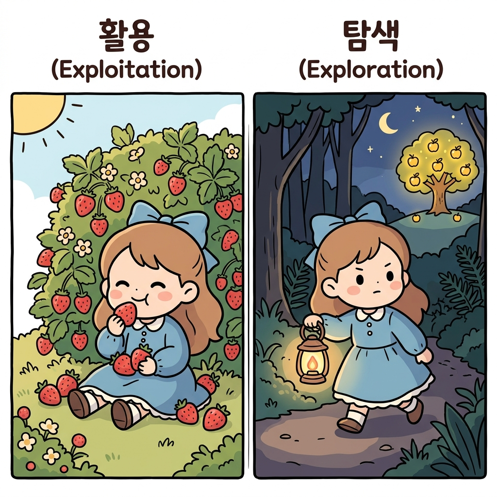
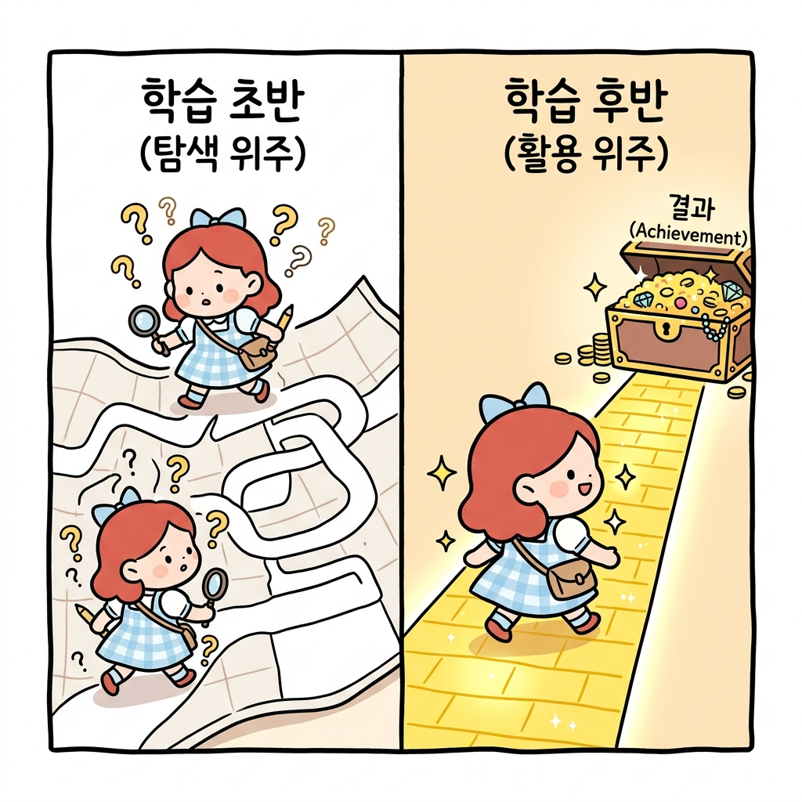

# 01.5 탐색과 활용의 딜레마

> **탐색과 활용의 딜레마Exploration-Exploitation Dilemma**는 이미 검증된 최고 선택지를 반복하는 행동(활용)과 더 나은 미래의 대안을 찾기 위해 불확실한 행동을 시도하는 것(탐색) 사이의 트레이드오프 관계를 다루는 강화학습의 핵심 연구 과제입니다.

"지니! 보물 지도를 그릴 때, 내가 이미 알고 있는 가장 맛있는 사과나무로만 계속 가는 게 좋을까? 아니면 한 번도 가보지 않은 어두운 숲길로 들어가 새로운 과일을 찾아보는 게 좋을까?"

**그림 1-5** 익숙한 딸기 덤불과 먼 곳의 미지의 과일 나무 사이에서 갈등하는 도로시와 입맛을 다시는 토토

도로시가 길 한가운데서 주저하며 물었습니다. 

왼편에는 이미 몇 번 따 먹은 익숙하고 평범한 딸기 덤불이 있었고, 오른편에는 한 번도 가보지 않은 우거진 숲길이 끝없이 펼쳐져 있었습니다.

**그림 1-5-a** 익숙한 맛(딸기)을 주는 왼쪽 길과 미지의 세계(모험)가 기다리는 오른쪽 길 사이의 갈림길

지니가 도로시의 어깨에 내려앉으며 진지한 목소리로 속삭였습니다.

"그것이 바로 모든 모험가와 강화학습 에이전트가 평생 마주해야 하는 **'탐색과 활용의 딜레마Exploration-Exploitation Dilemma'**란다!"

**그림 1-5-b** 도로시의 어깨 위에서 탐색과 활용의 딜레마에 대해 진지하게 조언하는 지니

---

## 01.5.1 탐색과 활용의 정의

지니는 두 가지 모험 행동의 차이를 도로시의 수첩에 적어주었습니다.

* **활용Exploitation (기존 정보 이용)**:
  * 현재까지 모은 정보 중에서 **가장 보상이 컸던 행동**을 그대로 반복하는 선택입니다.
  * **도로시의 비유**: "이미 먹어봐서 맛이 보장된 딸기 덤불로 가서 딸기를 따 먹는 행동"입니다. 안전하고 확실하게 작은 보상을 챙길 수 있습니다.
* **탐색Exploration (새로운 정보 수집)**:
  * 당장은 보상을 줄지 안 줄지 모르지만, 더 나은 보상이 있을지 확인하기 위해 **새로운 행동을 시도**해 보는 선택입니다.
  * **도로시의 비유**: "어두운 숲길로 들어가 더 크고 맛있는 황금 사과나무가 있는지 찾아 떠나는 모험"입니다. 당장은 가시덤불에 찔리거나 길을 잃을 리스크가 있습니다.

**그림 1-5-c** 안전하게 딸기를 먹는 활용(Exploitation)과 횃불을 들고 숲을 개척하며 황금 사과를 찾는 탐색(Exploration)의 대조

---

## 01.5.2 맛집 탐방으로 배우는 딜레마

지니는 도로시가 더 쉽게 이해하도록 맛있는 마법 요리점에 비유해 주었습니다.

"도로시, 네가 매번 마을에 갈 때마다 먹는 치즈 오믈렛 맛집이 있다고 해보자.

* **활용**: 너는 그 가게의 오믈렛 맛을 아주 잘 아니까 매번 그 식당에 가서 식사(활용)를 해. 실패할 확률이 0%니까 마음이 편하지.
* **탐색**: 하지만 어느 날, 새로 오픈한 마법 파스타 식당을 우연히 발견하고 모험을 걸어보기로 결심(탐색)했어.
  * **최악의 시나리오**: 파스타가 끔찍하게 맛이 없어서 돈만 날리고 배가 고플 수 있어(벌점).
  * **최고의 시나리오**: 평생 먹어본 것 중 가장 기막힌 파스타 맛집을 발견해서 앞으로 매주 그 파스타를 먹는 기쁨을 누릴 수 있어(대확장 보상).

**그림 1-5-d** 매번 가던 단골 빵집(활용)에 갈 것인가, 불확실하지만 모험 삼아 새로운 맛집(탐색)에 도전할 것인가의 갈등

만약 네가 안전한 단골집만 계속 '활용'했다면, 진짜 최고의 파스타 맛집은 평생 발견하지 못했을 거야. 

하지만 매일 새로운 곳만 '탐색'한다면 맛없는 음식을 먹고 맨날 배가 아프겠지?"

---

## 01.5.3 강화학습에서의 조율과 조화

"아! 그러니까 모험 초기에는 이곳저곳 골고루 **탐색**을 많이 해서 지도를 넓히고, 숲의 구조를 다 알게 된 후반에는 가장 좋은 길을 적극적으로 **활용**해야 하는 거구나?"

도로시가 손뼉을 치자 지니가 크게 칭찬해 주었습니다.

"정답이야, 도로시! 강화학습 컴퓨터(에이전트)도 마찬가지란다.

1. **학습 초반**: 지도가 텅 비어있으므로 무작위로 마음껏 움직이며 많은 **탐색**을 시도해야 합니다.
2. **학습 후반**: 충분히 좋은 보상 경로를 찾아내면, 점차 엉뚱한 행동을 줄이고 검증된 길을 **활용**하여 보상의 합을 최대화합니다.

**그림 1-5-e** 학습 초반(탐색 위주) 무작위 탐험과 학습 후반(활용 위주) 확실한 길 집중 활용의 비교

만약 에이전트가 탐색을 전혀 하지 않고 눈앞의 작은 사과나무만 반복해서 이용한다면, 저 멀리 묻혀 있는 거대한 다이아몬드 보물상자는 영영 발견하지 못하고 영구히 가난한 모험가로 남게 될 것입니다."

---

## 🌟 정리하자면!

**탐색과 활용의 딜레마**는 강화학습 에이전트가 최적의 정책을 찾아가는 과정에서 직면하는 본질적인 트레이드오프 관계입니다. 

안전하고 확실한 현재의 최선안을 계속 취하는 **활용(Exploitation)**과, 당장의 이득은 낮거나 위험부담이 있더라도 장기적으로 더 우수한 대안을 찾아보기 위해 미지의 선택지를 시도하는 **탐색(Exploration)**을 학습 단계에 맞게 적절히 조율하는 것이 최적 행동 패턴 학습의 핵심입니다.
