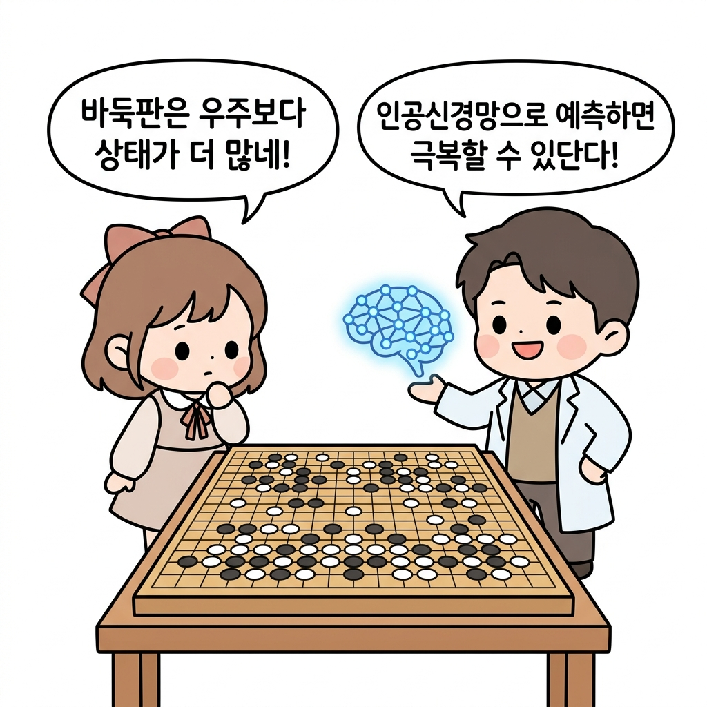
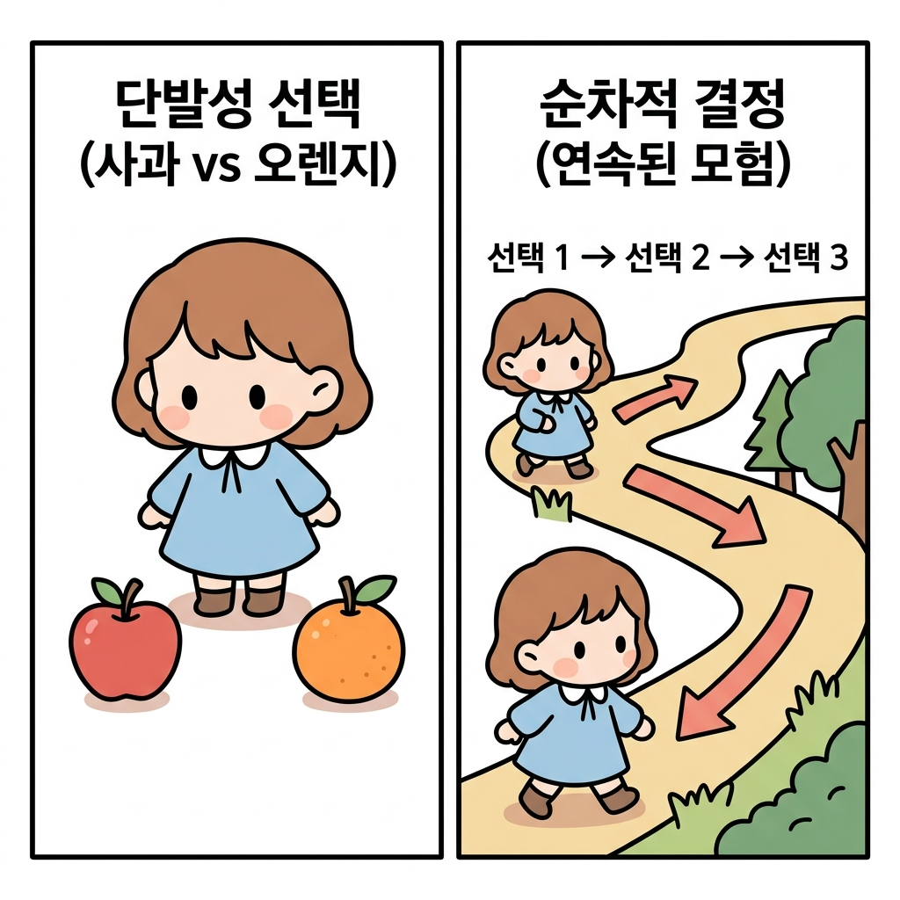
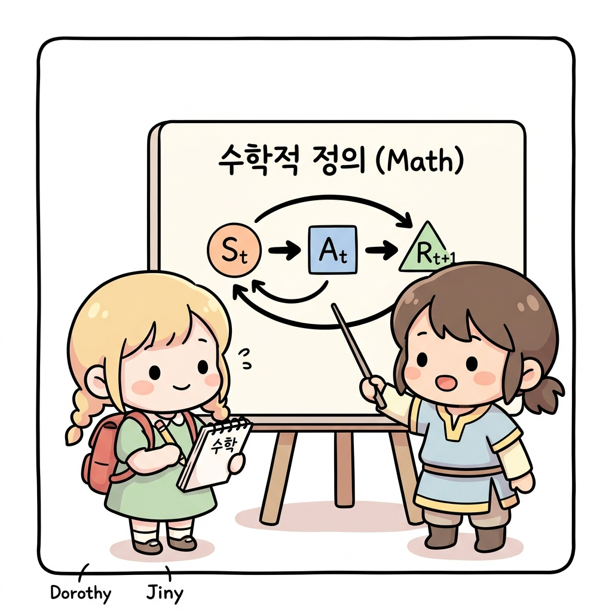
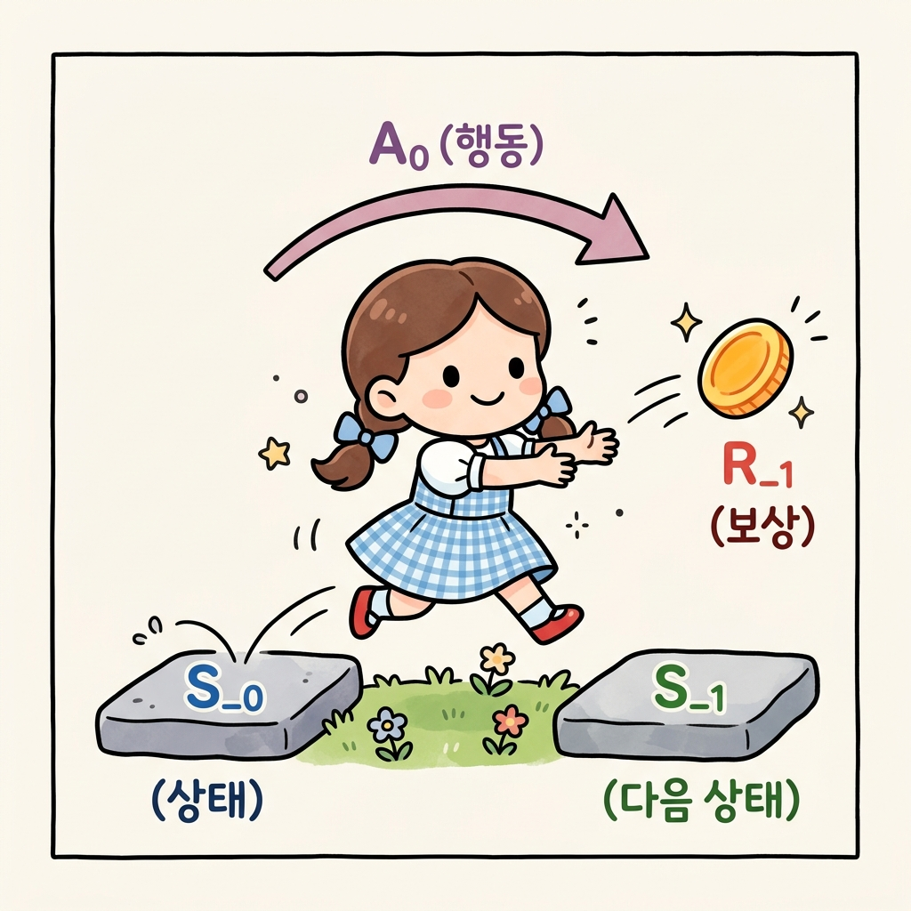
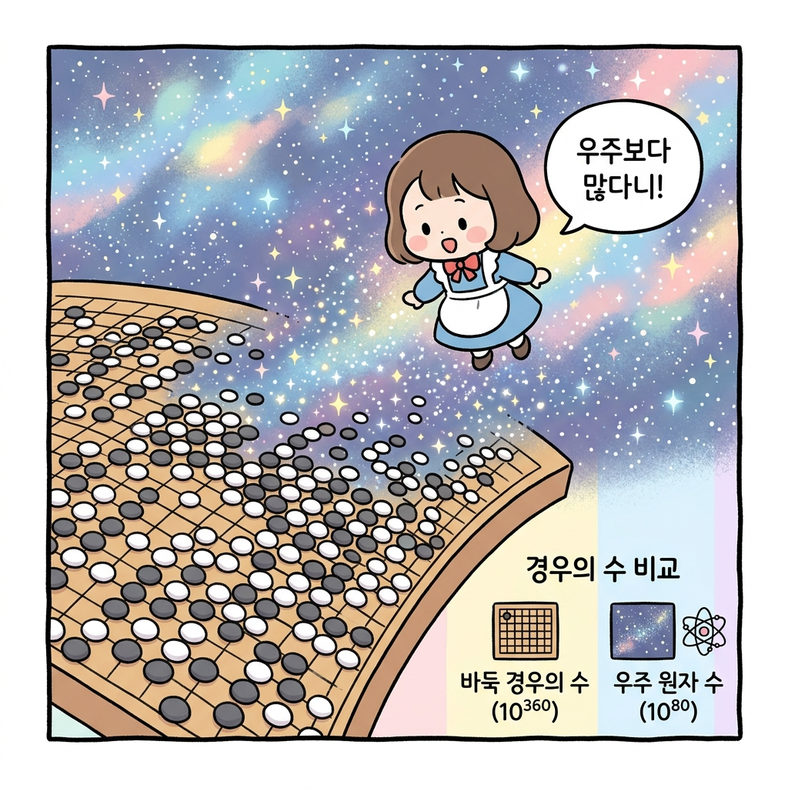
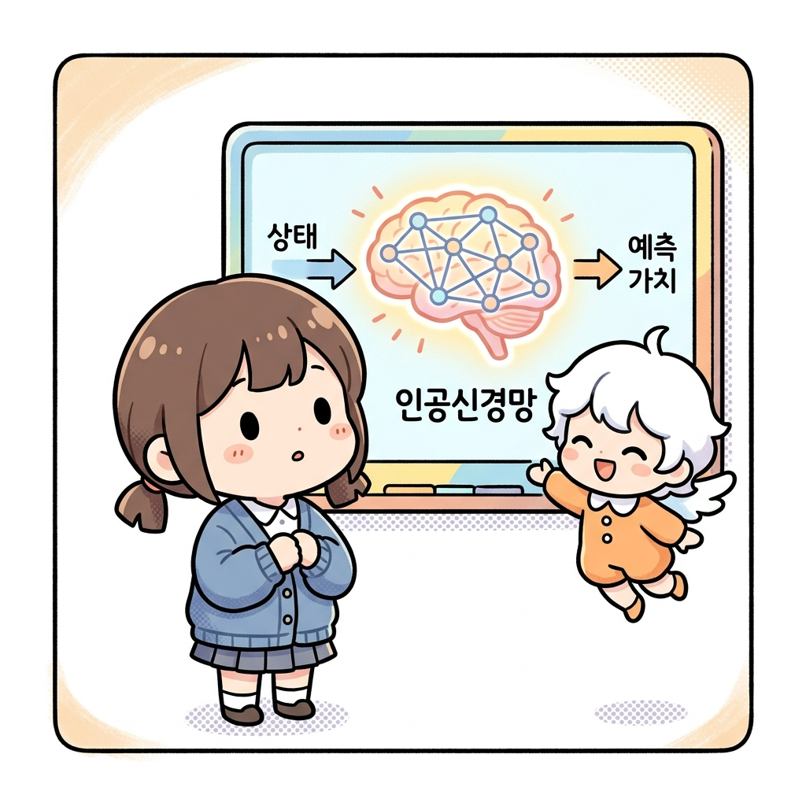

# 01.6 순차적 행동 결정 문제와 알파고

> **순차적 행동 결정 문제Sequential Decision Problem**는 단발성 예측 문제와 달리, 에이전트의 현재 선택이 이후의 상태 전이(State Transition)와 보상 수급에 장기적인 연속 영향을 주는 문제입니다. 
>
> 이를 수학적(확률론)으로 규격화한 상태 전이 체계를 **마르코프 결정 과정MDP**이라고 정의합니다.

"지니! 강화학습 마법은 어떤 형태의 모험(문제)에 가장 잘 어울리는 마법이야?"

도로시가 바둑판처럼 복잡한 격자 세상을 내려다보며 물었습니다. 

**그림 1-6** 격자판 보드게임 위에 선 도로시와 거대한 바둑판을 보며 수많은 인공 뉴런 실타래를 지휘하는 지니

지니가 공중에 떠올라 격자 세상을 한눈에 비추는 큰 조명을 켜주었습니다.

"강화학습 마법은 단순히 '이게 사과냐 오렌지냐' 한 번만 맞히고 끝나는 마법이 아니야. 

매 순간의 선택이 다음 순간의 상황에 계속해서 영향을 미치는 **'순차적 행동 결정 문제Sequential Decision Problem'**를 풀기 위해 태어났단다."

**그림 1-6-a** 한 번 선택하고 종료되는 단발성 문제와 매 결정이 꼬리를 물며 환경을 바꾸는 순차적 행동 결정 문제의 차이

---

## 01.6.1 수학적 수치화와 시험 점수 비유

문제를 컴퓨터에게 풀게 하려면 가장 먼저 문제를 **수학적으로 표현**해야 합니다. 

수학적으로 정의되지 않으면 컴퓨터는 무엇이 좋고 나쁜지 계산할 수 없습니다.

**그림 1-6-b** 컴퓨터가 순차적 행동 결정 문제를 풀 수 있도록 수학 기호(상태, 행동, 보상)로 정의하는 과정

"마치 우리 학교에서 학생들의 실력을 비교해서 공부 성적을 올리기 위해 '시험 점수'라는 수단으로 실력을 수치화하는 것과 같아. 

완벽하지는 않아도 점수라는 숫자가 있어야 내 성적 변화를 객관적으로 측정하고 더 좋은 전략을 세울 수 있으니까."

**그림 1-6-c** 객관적인 측정과 전략 수립을 가능케 하는 시험 점수(수치화) 비유

순차적 행동 결정 문제를 수학적으로 나타내는 도구를 **MDPMarkov Decision Process**라고 부르며, 다음과 같이 4가지 기본 틀로 정의합니다.

1. **상태 (State, *S*)**: 에이전트가 처한 현재 상황의 모든 정보입니다. 공의 위치나 속도처럼 상황을 판단하기 위해 필수적인 값들입니다.
2. **행동 (Action, *A*)**: 에이전트가 어떤 상태에서 취할 수 있는 움직임(상, 하, 좌, 우 등)입니다.
3. **보상 (Reward, *R*)**: 행동에 대한 피드백 점수입니다.
4. **정책 (Policy, *π*)**: 모든 상태에 대해 어떤 행동을 취할지 정해놓은 전체 답안지(지도)입니다.

**그림 1-6-d** 상태 S_0에서 행동 A_0를 지르고 보상 R_1을 받아 새로운 상태 S_1로 이동하는 MDP 전이 구조

---

## 01.6.2 방대한 상태 공간과 바둑의 한계

과거의 전통적인 계산 마법(다이내믹 프로그래밍 등)은 숲속의 갈림길이 몇 개 없을 때는 완벽하게 계산해 낼 수 있었습니다. 하지만 세상이 너무 방대해지면 계산량이 폭발하게 됩니다.

"대표적인 예가 바로 **바둑**이야. 바둑판 위에서 가능한 돌의 배치는 대략 **10360** 가지나 된단다. 우주 전체에 존재하는 모든 원자의 수(약 1080개)보다 훨씬 많은 숫자이지! 컴퓨터의 엄청난 연산 속도로도 모든 경우의 수를 하나씩 직접 계산해 최선의 수(정책)를 찾는 건 불가능했어."

**그림 1-6-e** 우주 전체 원자 수(10^80)를 초월하는 바둑판 경우의 수(10^360)와 계산적 한계 묘사

이 때문에 1997년 체스 챔피언을 이긴 컴퓨터가 나온 이후로도 오랫동안 바둑은 정복되지 못했습니다.

---

## 01.6.3 인공신경망(Deep Learning)과의 대결합

"그럼 컴퓨터가 모든 길을 직접 계산할 수 없는데, 어떻게 알파고는 이세돌 프로기사를 이길 수 있었던 거야?"

도로시의 동그란 눈을 보며 지니가 신비롭게 미소 지었습니다.

"그 비밀이 바로 **인공신경망Artificial Neural Network**과의 결합이란다!
에이전트가 모든 경로의 가치를 하나하나 정확히 외워둘 수 없으니, **눈앞의 상황(상태)을 인공 뉴런 뇌에 집어넣어 대략적인 가치와 정책을 예측(근사)하는 돋보기 기술**을 사용한 거지."

**그림 1-6-f** 방대한 상태를 입력받아 가치와 행동 확률(정책)을 예측·근사하는 인공신경망(함수 근사)의 원리

* **함수 근사Function Approximation**: 방대한 상태를 가진 복잡한 문제를 풀기 위해 상태의 가치를 하나의 예측 함수(인공신경망)로 근사화하여 처리합니다.

로봇의 움직임처럼 환경이 무한대에 가깝게 연속적이고 복잡한 진짜 현실 세계의 문제도, 이 인공신경망과 강화학습의 결합을 통해 로봇이 레고 블록을 쌓거나 장애물을 피해 달리는 등 복잡한 움직임을 스스로 터득해 나가고 있습니다.

---

## 🌟 정리하자면!

**순차적 행동 결정 문제**는 에이전트의 현재 선택이 미래에 지속적인 연쇄 영향을 주는 복잡한 문제로, 이를 확률적 수식으로 정의한 체계가 **마르코프 결정 과정(MDP)**입니다. 바둑이나 현실 세계처럼 가능한 상태의 수(경로)가 우주의 원자 수보다 많은 방대한 환경에서는 전통적인 방식으로 최적해를 일일이 구하는 데 한계가 있으며, 현대 강화학습은 **인공신경망**을 결합하여 복잡한 환경 상태의 정책과 가치를 예측·근사(심층강화학습)하는 방식으로 이 한계를 돌파하고 있습니다.
