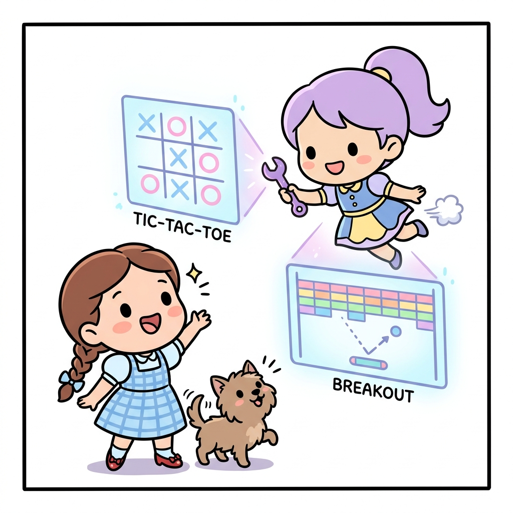
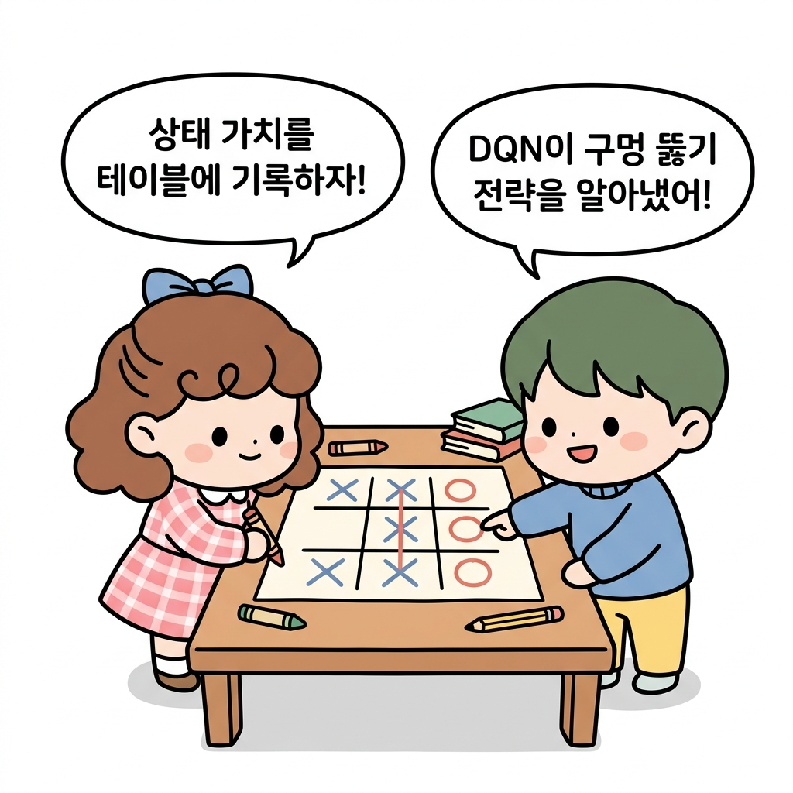
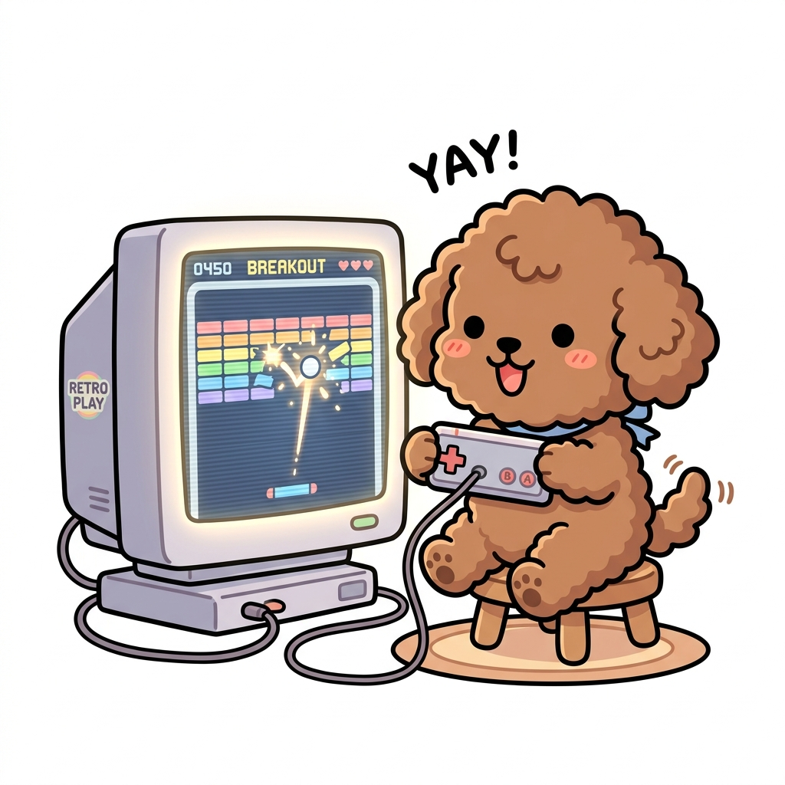

# 01.7 맛보기 예제: 틱택토와 브레이크아웃

> **맛보기 게임 예제**는 강화학습의 문제 해결 방식을 대표하는 두 가지 구현 사례로, 상태 가치 테이블 기반의 시간차 가치 업데이트로 해결하는 **틱택토**와 딥러닝 인공신경망(DQN)으로 최적 큐함수(Q-value)를 예측하여 극복하는 **브레이크아웃**을 다룹니다.

"지니! 우리가 앞으로 공부하면서 실제로 어떤 게임들을 정복하게 되는지 미리 구경해볼 수 있을까?"

도로시가 들떠서 물었습니다. 토토도 게임기 모양의 홀로그램을 보며 꼬리를 신나게 흔들었습니다.

지니가 보랏빛 스패너를 들고 허공에 돌리자, 3×3 격자판의 **틱택토Tic-Tac-Toe** 게임과 알록달록한 벽돌들이 가득 찬 **브레이크아웃Breakout** 게임 화면이 번쩍이며 나타났습니다.

"좋아! 아주 간단한 보드게임부터 딥마인드를 깜짝 놀라게 한 벽돌 깨기 게임까지, 강화학습이 어떻게 이를 터득하는지 그 핵심 흐름을 미리 맛보기로 살펴보자!"

**그림 1-7-a** 보랏빛 스패너를 돌려 틱택토와 브레이크아웃 홀로그램 게임 화면을 투사해 주는 지니와 신기하게 지켜보는 도로시, 토토

---

## 01.7.1 첫 번째 맛보기: 틱택토 (Tic-Tac-Toe)

틱택토는 3×3 격자판에 번갈아 돌을 놓으며 가로나 세로, 대각선으로 먼저 3개를 잇는 사람이 이기는 보드게임입니다.

### 📊 상태 가치 테이블의 활용
도로시가 틱택토를 풀기 위해 지니에게 배운 마법은 **'상태 가치 테이블State-Value Table'**을 그리는 것이었습니다.

1. **가치의 기록**: 틱택토판의 모든 가능한 배치(상태)마다 자신이 이길 확률인 가치(*v*)를 기록해 둡니다. 이기면 1.0, 비기면 0.5, 지면 0.0으로 설정합니다.
2. **탐욕적 선택**: 게임을 진행하며 다음 돌을 놓을 수 있는 여러 자리 중에서 **자신에게 가장 높은 가치를 약속하는 상태**를 선택하여 돌을 놓습니다.
3. **가치의 갱신 (시간차 학습)**: 돌을 놓은 후, 내가 선택한 상태의 이전 가치를 다음 상태의 가치를 보고 조금씩 업데이트(백업)합니다. 
   - 이 갱신 수식은 다음과 같은 시간차 오차(*TD-error*) 갱신 형태를 띱니다.

     *V*(*S**t*) ← *V*(*S**t*) + *α*[*V*(*S**t*+1) - *V*(*S**t*)]

     여기서 *α*(알파)는 배움의 속도를 뜻하는 학습률(*learning rate*)입니다.

**그림 1-7-b** 틱택토 판에 마법 돌을 놓는 도로시와 벽돌 깨기 게임기 화면에서 공을 받아치는 토토

---

## 01.7.2 두 번째 맛보기: 브레이크아웃 (Breakout)

두 번째 맛보기는 아타리Atari의 고전 벽돌 깨기 게임인 **브레이크아웃**입니다. 구글 딥마인드DeepMind가 강화학습과 딥러닝을 결합한 알고리즘(DQN)을 처음 적용해 세상을 놀라게 했던 게임이기도 합니다.

### 🎮 브레이크아웃의 MDP 구성
* **상태 (State)**: 게임기 화면을 연속으로 **4개 합친 것**이 하나의 상태가 됩니다. 공의 움직이는 속도와 방향을 컴퓨터가 스스로 감지할 수 있도록 4개의 연속 화면 이미지(2차원 픽셀 데이터)를 제공합니다.
* **행동 (Action)**: 제자리, 왼쪽, 오른쪽, 발사(게임 시작 시 공 발사) 총 4가지 행동입니다.
* **보상 (Reward)**: 벽돌이 깨질 때마다 `+1`의 보상을 얻고, 위쪽 벽돌을 깰수록 더 높은 점수(보상)를 얻습니다. 공을 떨어뜨려 목숨을 잃으면 `-1`의 벌점을 얻습니다.
* **정책 (Policy)**: 연속 화면 이미지를 인공신경망(**DQN**)에 입력하면, 신경망은 출력으로 각 행동의 가치(큐함수 *Q*-value)를 예측합니다. 에이전트는 이 예측값 중 가장 높은 가치를 지닌 행동을 선택해 플레이합니다.

**그림 1-7-c** 큐함수(Q-value) 보상을 최대로 극대화하며 벽돌 뒤편에 구멍(터널)을 뚫어 격파하는 DQN의 고차원 지혜

### 🕳️ 터널 뚫기 전략의 발견
처음에 에이전트는 아무것도 몰라 마구잡이로 움직이며 공을 놓치지만, 수천 판의 경험을 쌓자 공을 받아치는 능력을 기르더니 마침내 **한쪽 구석에 구멍을 파서 공을 벽돌 위로 날려 보내는 '터널 뚫기' 고차원 전략**을 스스로 발견하여 벽돌을 한꺼번에 폭발적으로 격파하게 됩니다.

"와! 게임의 규칙을 하나도 알려주지 않았는데, 오직 보상(점수)과 화면만을 보고 이런 기발한 전략을 스스로 알아내다니! 정말 마법 같아!"

도로시가 감탄하자, 지니가 웃으며 말했습니다.

"맞아! 이것이 바로 강화학습이 가진 무한한 가능성이란다. 이제 우리도 이 마법을 직접 부려보기 위한 준비를 완벽히 마쳤어!"

---

## 🌟 정리하자면!

강화학습의 작동 원리를 직관적으로 이해할 수 있는 대표 예시인 **틱택토**에서는 모든 상태의 미래 기대 수익을 표로 관리하는 **상태 가치 테이블**을 기반으로 행동을 결정하고 시행착오를 통해 가치를 업데이트합니다. 반면, 상태의 수가 무수히 많은 **브레이크아웃**에서는 딥러닝 인공신경망인 **DQN**을 사용해 연속 화면(상태)으로부터 각 행동의 가치인 **큐값(Q-value)**을 예측·근사하며, 게임 규칙의 입력 없이도 스스로 고차원적 플레이 전략(터널 뚫기 등)을 습득해 나갑니다.
