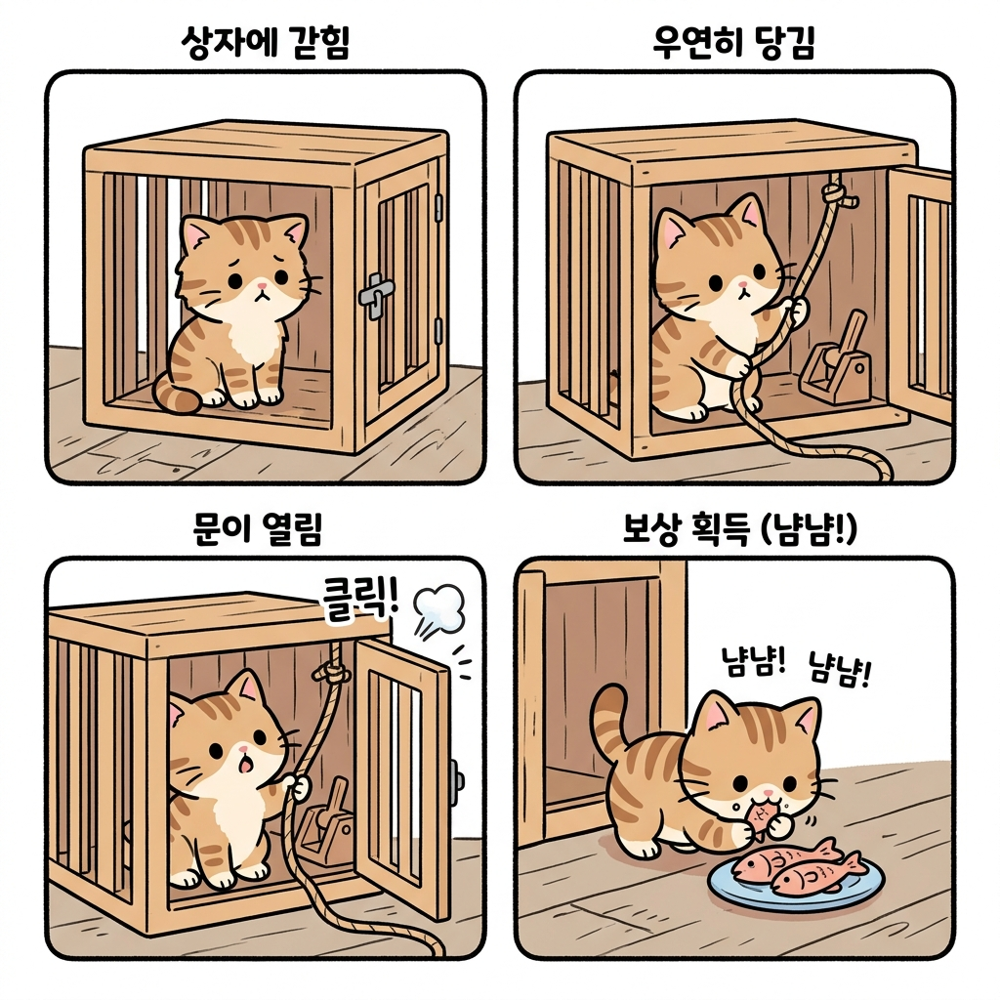
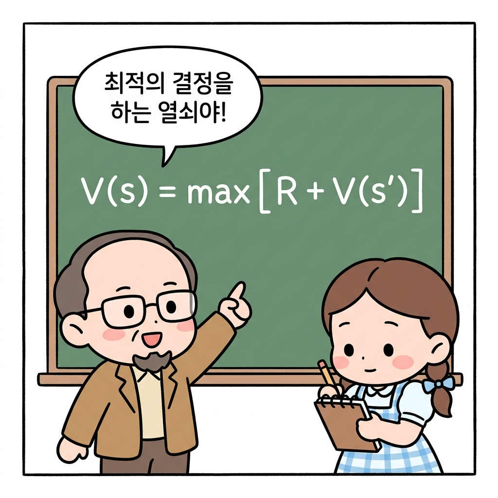
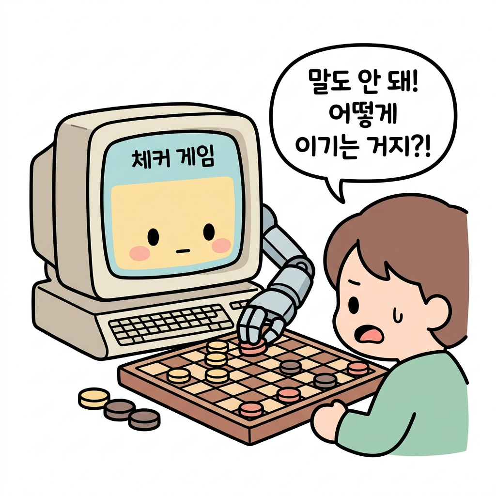

01.8 강화학습의 역사와 기원

> **강화학습의 기원**은 독립적으로 연구되어 온 세 가지 전설적인 학문 줄기인 행동심리학의 **시행착오 학습**, 수학 및 제어공학의 **최적 제어(동적 계획법)**, 컴퓨터공학의 **시간차 학습**이 결합하여 완성된 이론적 융합 학문입니다.

"지니! 이 엄청난 강화학습 마법은 어느 날 갑자기 하늘에서 뚝 떨어진 마법이야?"

도로시가 역사책 모양의 양장본 노트를 펼치며 궁금해했습니다. 지니가 수많은 고서들이 둥둥 떠다니는 도서관 방으로 도로시와 토토를 인도했습니다.

**그림 1-8-a** 날아다니는 고서들로 가득 찬 마법 도서관으로 도로시와 토토를 인도하는 지니

"모든 강력한 연금술이 여러 연구의 결합으로 완성되듯, 강화학습 역시 오랜 역사 속 **세 가지 전설적인 마법 줄기**가 하나로 뭉쳐지면서 탄생한 거대 마법이란다!"

지니는 허공에 둥둥 떠다니는 세 가닥의 오색 실타래를 한손으로 낚아채며 설명하기 시작했습니다.

**그림 1-8-b** 역사 속 마법사들이 수집한 세 가닥의 전설적인 마법 실타래를 하나로 엮는 지니

---

## 01.8.1 첫 번째 실타래: 시행착오 학습 (심리학 학파)

첫 번째 붉은 실타래는 생물의 마음을 관찰하던 행동심리학자들이 짜놓은 것입니다.

* **에드워드 손다이크Edward Thorndike**: 1898년 고양이를 상자 안에 가둔 뒤 시행착오 끝에 탈출하는 법칙인 **'효과의 법칙Law of Effect'**을 발견했습니다. 생물이 어떤 행동을 한 뒤 만족스러운 결과(보상)가 따르면 그 행동을 반복하게 되고, 불쾌한 결과(처벌)가 따르면 그 행동을 피하게 된다는 지극히 당연하지만 강력한 사실을 정리한 것입니다.
* **스키너 박사**: 지렛대를 이용한 쥐 실험을 통해 행동을 더욱 정교하게 유도(조작)할 수 있는 **'강화'**라는 개념을 확고히 다졌습니다.

**그림 1-8-c** 지렛대를 눌러 상자를 탈출해 생선 보상을 얻는 행동주의 심리학의 시행착오 학습(손다이크 고양이 퍼즐 박스)

---

## 01.8.2 두 번째 실타래: 최적 제어와 동적 계획법 (수학 학파)

두 번째 푸른 실타래는 물리학과 제어공학을 다루던 수학자들이 짜놓은 것입니다.

* **리처드 벨만Richard Bellman**: 1950년대 중반, 미사일 궤도를 수정하거나 제어 시스템을 설계할 때 사용되는 **최적 제어Optimal Control** 문제를 풀기 위해 **'동적 계획법Dynamic Programming'**이라는 수학 공식 체계를 개발했습니다.
* **벨만 방정식Bellman Equation**: 오늘날 강화학습을 지탱하는 가장 위대한 기둥 공식으로, 현재 나의 가치와 미래의 가치 사이의 수학적 관계를 밝혀낸 놀라운 공식입니다.

하지만 이 수학 공식은 환경의 정확한 규칙과 확률을 완벽히 알고 있어야만 계산할 수 있다는 치명적인 한계(차원의 저주)가 있었습니다.

**그림 1-8-d** 현재 상태 가치와 미래 가치의 재귀적 관계를 공식화한 리처드 벨만 교수의 벨만 방정식

---

## 01.8.3 세 번째 실타래: 시간차 학습 (컴퓨터 학파)

세 번째 황금빛 실타래는 최초로 스스로 학습하는 컴퓨터 프로그램을 만들려던 개척자들이 짠 것입니다.

* **아서 사무엘Arthur Samuel**: 1959년, 세계 최초로 컴퓨터가 스스로 체커(Checker) 게임을 두면서 자신의 점수를 갱신해 똑똑해지는 프로그램을 설계했습니다. 이 프로그램은 당대 최고의 체커 고수를 물리치며 큰 파장을 불러일으켰습니다.
* 이 방식은 컴퓨터가 환경의 미래 확률을 알지 못해도 **'현재 예측값과 다음 단계 예측값 사이의 시차적인 차이(오차)'**를 이용해 스스로 지도를 조금씩 고쳐나가는 **시간차 학습Temporal Difference Learning**의 모태가 되었습니다.

**그림 1-8-e** 1959년 컴퓨터가 스스로 규칙을 배우며 최적 갱신을 하도록 한 아서 사무엘의 체커 게임 프로그램

---

## 🤝 세 실타래의 역사적 대결합

1980년대 후반, 인공지능의 거장인 **리처드 서튼Richard Sutton**과 **앤드류 바토Andrew Barto** 교수는 이 흩어져 있던 세 개의 실타래를 하나로 엮어 강력한 이론적 결합을 이루어냈습니다.

**그림 1-8-f** 시행착오(심리학), 최적제어(수학), 시간차학습(컴퓨터공학)이라는 세 가닥의 줄기가 하나로 융합되어 현대 강화학습 마법이 되는 과정

* 심리학의 **시행착오(강화)** 개념을 바탕으로,
* 컴퓨터공학의 **시간차 학습** 기법을 빌려와서,
* 제어공학의 **벨만 방정식(동적 계획법)** 수학 문제를 환경의 규칙을 모르고도 완벽히 풀어내는 법을 증명해 냈습니다.

이로써 오늘날 우리가 배우는 현대적 의미의 **강화학습Reinforcement Learning**이 마침내 완성되었습니다!

"우와! 심리학과 수학, 컴퓨터공학이 모두 힘을 합쳐서 만든 아름다운 합작품이 바로 강화학습 마법이구나!"

도로시가 수첩에 꼼꼼히 정리하며 감동 가득한 한숨을 내쉬었습니다. 지니는 미소를 띠며 홀로그램을 정리해 품속에 넣었습니다.

"그렇단다! 자, 오랜 탐사 끝에 역사의 뿌리까지 다 배웠으니, 이제는 본격적인 학습에 앞서 필요한 기초 수학과 확률을 탄탄하게 다지는 2강의 모험으로 떠날 차비가 되었단다!"

---

## 🌟 정리하자면!

**강화학습의 기원**은 독립적으로 발달해 오다 결합한 세 가지 주요 학문적 실타래(기둥)로 요약됩니다. 첫째, 생물이 보상과 시행착오를 통해 행동 강도를 조절하는 원리를 발견한 행동심리학의 **시행착오 학습**, 둘째, 벨만 방정식을 통해 상태의 가치와 최적 의사결정을 재귀적 수식으로 공식화한 제어공학의 **최적 제어(동적 계획법)**, 셋째, 사전 환경 정보 없이 시간 차이에 의한 가치 예측 오차를 학습에 적용한 컴퓨터공학의 **시간차 학습**이 결합하여 현대의 완전한 강화학습 이론을 이루었습니다.
