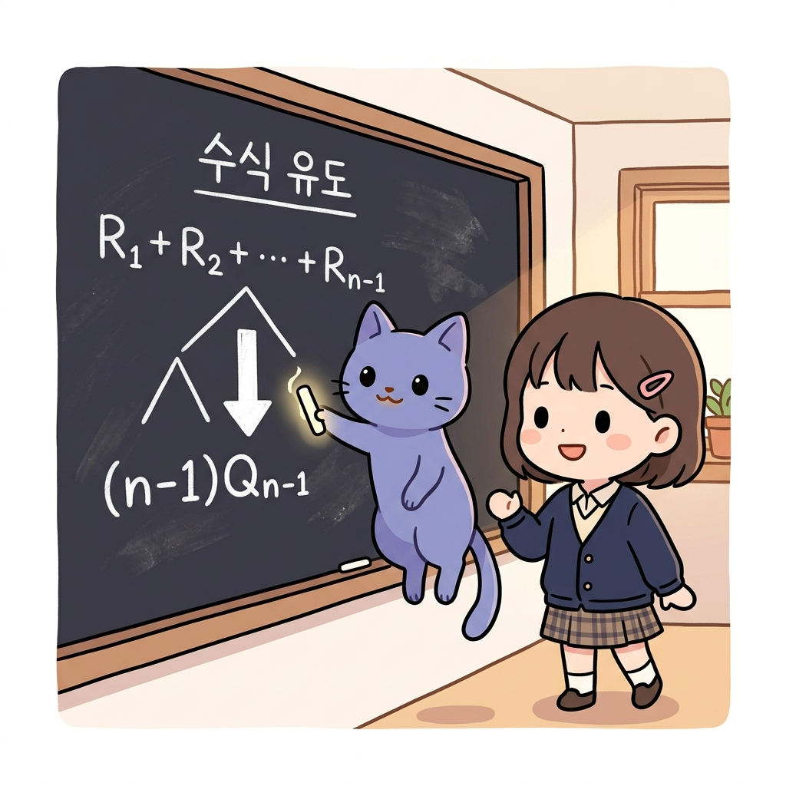

# 02.1 식의 구성과 치환, 교환/분배법칙

> 이 장에서는 복잡한 수식을 단순하게 압축하고 재구성하기 위해 필수적인 **식의 구성, 치환(Substitution), 그리고 결합/분배법칙**을 배웁니다. 이 대수 규칙들을 이해하면 강화학습 공식 유도 시 수만 개의 문자 데이터를 수식 한 줄로 깔끔하게 정리해낼 수 있습니다.


## 02.1.1 복잡한 수식을 가뿐하게 요리하기

**그림 02-1-1** 긴 수식의 공통 항을 하나의 동그라미 문자 상자로 묶어 마법처럼 식을 축소시키는 지니와 도로시


수많은 숫자가 나열된 식을 보고 겁먹을 필요는 전혀 없습니다! 


수학에는 긴 식을 단순한 문자 하나로 묶어 다루는 **치환**과, 식의 곱셈을 분배하거나 묶어 정리하는 **분배법칙**이라는 강력한 도구들이 있기 때문이죠. 지니의 마법 석판 판서와 함께 이 수학 부품들을 마음대로 조립하고 정리하는 비법을 습득해봅시다!


---


### 1. 학습 목표

- 식의 전개와 공통인수로 묶기(분배법칙)를 이해하고 자유롭게 계산할 수 있다.
- 치환(Substitution)의 정의와 복잡한 식의 간소화 효과를 이해한다.
- 교환법칙, 결합법칙, 분배법칙을 활용하여 수식의 구조를 원하는 형태로 변형할 수 있다.


---


### 2. 핵심 개념


#### (1) 교환법칙 (Commutative Law)

더하거나 곱하는 두 수의 연산 순서를 바꾸어 계산해도 그 결과가 정확히 성립한다는 대수 규칙입니다.
- **공식**:
  *a* + *b* = *b* + *a* (덧셈의 교환법칙)
  *a* × *b* = *b* × *a* (곱셈의 교환법칙)


**그림 02-1-2** 연산 순서를 서로 바꾸어도 마법처럼 양팔저울의 등식이 완벽히 보존되는 교환법칙을 공부하는 도로시와 지니


- **강화학습 연계 예시**:
  - 오차값과 학습률을 곱해 가치를 업데이트할 때, *α* × (*R*<sub>*n*</sub> - *Q*<sub>*n-1*</sub>) 과 (*R*<sub>*n*</sub> - *Q*<sub>*n-1*</sub>) × *α* 는 곱셈의 교환법칙에 의해 완벽히 같으므로 코드 구현 시 동일하게 처리됩니다.


---


#### (2) 분배법칙 (Distributive Law)과 공통인수 묶기

괄호 밖의 수를 괄호 안의 모든 항에 각각 곱하여 전개하거나, 반대로 각 항에 공통으로 들어있는 문자(공통인수)를 묶어 괄호 밖으로 빼내는 규칙입니다.


- **공식**:
  *a*(*b* + *c*) = *ab* + *ac*
  *ab* + *ac* = *a*(*b* + *c*) (공통인수 *a*로 묶기)


**그림 02-1-3** 괄호 밖의 변수를 고루 나누어 곱해주거나, 반대로 공통인수로 곱해서 식을 요리하는 분배법칙

- **강화학습 연계 예시**:
  표본 평균 및 지수 감쇄 유도 과정에서 다음과 같은 분배법칙이 빈번하게 사용됩니다.
  *Q*<sub>*n-1*</sub> - *α* *Q*<sub>*n-1*</sub> = (1 - *α*) *Q*<sub>*n-1*</sub>
  - *해설*: 두 항에 공통으로 곱해져 있는 *Q*<sub>*n-1*</sub>을 공통인수로 보고 분배법칙의 역으로 묶어낸 결과입니다. (두 변수의 문자 겹침으로 인한 마크다운 깨짐 방지를 위해 부호 사이에 공백 문자를 명시했습니다).


---


#### (3) 치환 (Substitution)과 대입

어떤 복잡한 수식이나 공통된 긴 묶음을 **간단한 하나의 문자(또는 상자)**로 바꾸어 놓고 식을 전개하는 기법입니다.
- **원리**:
  - 만약 *A* = *x* + *y* + *z* 라고 미리 정해(치환) 둔다면, 복잡한 식 (*x* + *y* + *z*)<sup>2</sup> + 3(*x* + *y* + *z*) 은 단순히 *A*<sup>2</sup> + 3*A* 로 아주 가볍게 쓸 수 있습니다.
  - 계산이 모두 끝난 뒤 마지막에 원래 식을 다시 **대입**해 넣어주면 됩니다.


**그림 02-1-4** 복잡한 식의 일부분을 한 문자로 가볍게 묶어 치환하고 대입하는 대수 조작법

- **강화학습 연계 예시**:
  - **식 3.2 유도**:
    이전 시점의 평균 식인 *Q*<sub>*n-1*</sub> = (*R*<sub>1</sub> + ... + *R*<sub>*n-1*</sub>) / (*n* - 1) 을 정리해 (*R*<sub>1</sub> + ... + *R*<sub>*n-1*</sub>) = (*n* - 1)*Q*<sub>*n-1*</sub> 로 변형합니다.
    그리고 *Q*<sub>*n*</sub> 식의 분자 부분에 있는 (*R*<sub>1</sub> + ... + *R*<sub>*n-1*</sub>) 이라는 길고 무거운 부분을 단번에 (**(*n* - 1)*Q*<sub>*n-1*</sub>**)로 **치환(대입)**하여 식을 간소하게 완성합니다.


---


#### (4) 수학적 표현 vs 파이썬 프로그래밍의 비교

컴퓨터의 프로그래밍 언어(파이썬)에서도 수학의 수식 전개, 우선순위, 치환 등의 원리가 완벽히 녹아들어 작동하고 있습니다.

##### 1) 식의 평가와 연산자 우선순위 (Operator Precedence)
- **수학**: 곱셈과 나눗셈을 덧셈과 뺄셈보다 먼저 계산하며, 괄호 `()`가 씌워진 부분을 가장 우선하여 연산합니다.
- **파이썬**: 연산자 우선순위에 따라 작동합니다. `()` ➔ `**` (거듭제곱) ➔ `*`, `/` (곱셈, 나눗셈) ➔ `+`, `-` (덧셈, 뺄셈) 순으로 평가됩니다.
  - *예시*: 수학식 1 - *α* *Q*<sub>*n-1*</sub> 은 곱셈이 먼저 계산되어 1 - (*α* × *Q*<sub>*n-1*</sub>) 이 됩니다. 파이썬 코드 `1 - alpha * q_prev` 또한 `*`의 우선순위가 `-`보다 높으므로 수학적 규칙과 완벽하게 동일한 순서로 처리됩니다.

##### 2) 변수(Variable)를 이용한 치환과 대입
- **수학**: 복잡한 묶음식을 기호 *A*로 치환해 간단히 표현한 뒤 최종 전개합니다.
- **파이썬**: 복잡한 식의 결과값을 변수명(Variable)에 할당(`=`)하여 사용합니다.
  ```python
  # 수학의 치환과 대입에 해당하는 파이썬 코드
  target_diff = reward + gamma * next_state_value - current_value  # 치환
  current_value = current_value + alpha * target_diff             # 대입
  ```
  - 파이썬에서 변수를 사용하는 것은 수학의 **치환**과 같을 뿐만 아니라, 중복 연산을 피해 메모리와 CPU 연산을 절약하는 **성능 최적화**의 효과를 낳습니다.

##### 3) 분배법칙을 통한 연산 횟수 최적화
- 수학의 분배법칙 *a* × *b* + *a* × *c* = *a* × (*b* + *c*) 는 컴퓨터 연산 장치의 연산량 최적화와도 직결됩니다.
  - **식 A (`a * b + a * c`)**: 곱셈 2번 + 덧셈 1번 = 총 3번의 연산 필요
  - **식 B (`a * (b + c)`)**: 곱셈 1번 + 덧셈 1번 = 총 2번의 연산 필요
  - 분배법칙을 활용해 코드를 작성하면 컴퓨터 장치가 수행해야 할 소모적인 부동소수점 곱셈 연산 횟수를 절반으로 줄일 수 있습니다. 수억 번 학습을 반복하는 강화학습 에이전트의 구동 속도를 비약적으로 단축시키는 비결이 바로 이 분배법칙의 코드 최적화에 있습니다.


---


### 3. 시각 자료: 치환을 통한 수식 유도 트리 다이어그램


**그림 02-1-5** 이전 시점까지의 보상 합산 수열을 평균 치환식으로 대입하여 한 줄의 깔끔한 재귀 평균 점화식으로 유도해내는 전개 과정


---


### 4. 실전 예제

#### 예제 1 (분배법칙과 인수분해)
> **문제**: 다음 식을 분배법칙을 활용하여 공통인수로 묶어 간결하게 정리하시오.
> *(1 - α) Q<sub>n-1</sub> + α R<sub>n</sub>* 에서 괄호를 풀어 전개하고, 다시 *Q<sub>n-1</sub>* 을 기준으로 묶어 증분 업데이트 식 형태로 변형하시오.
>
> **풀이**:
> 1) 먼저 괄호를 풀어 전개합니다:
>    *= Q<sub>n-1</sub> - α Q<sub>n-1</sub> + α R<sub>n</sub>*
> 2) *α* 가 들어있는 두 항을 공통인수 *α* 로 묶어내어 분배법칙을 적용합니다:
>    *= Q<sub>n-1</sub> + α (R<sub>n</sub> - Q<sub>n-1</sub>)*
>    **정답**: *Q<sub>n-1</sub> + α (R<sub>n</sub> - Q<sub>n-1</sub>)*


---


### 5. 핵심 요약

1. **분배법칙**은 괄호 밖의 수를 각 항에 나누어 곱해주거나, 각 항의 공통 문자를 묶어 괄호 밖으로 빼내는 유용한 대수 규칙이다.
2. **치환**은 복잡한 긴 수식 덩어리를 하나의 단순한 기호로 임시 변형하는 행위로, 식의 전체적인 구조를 꿰뚫어 보게 만든다.
3. 이 두 규칙은 강화학습의 다양한 갱신 알고리즘 수식을 유도하고, 컴퓨터 메모리를 최적화하는 데 필수적인 연산 도구이다.
