# 02.1 식의 구성과 치환, 교환/분배법칙

> 이 장에서는 복잡한 수식을 단순하게 압축하고 재구성하기 위해 필수적인 **식의 구성, 치환(Substitution), 그리고 결합/분배법칙**을 알아 봅니다. 수학의 대수 규칙들을 이해하면 강화학습 공식 유도 시 수만 개의 문자 데이터를 수식 한 줄로 깔끔하게 정리해낼 수 있습니다.


## 02.1.1 복잡한 수식을 가뿐하게 요리하기

수많은 숫자가 나열된 식을 보고 겁먹을 필요는 전혀 없습니다! 

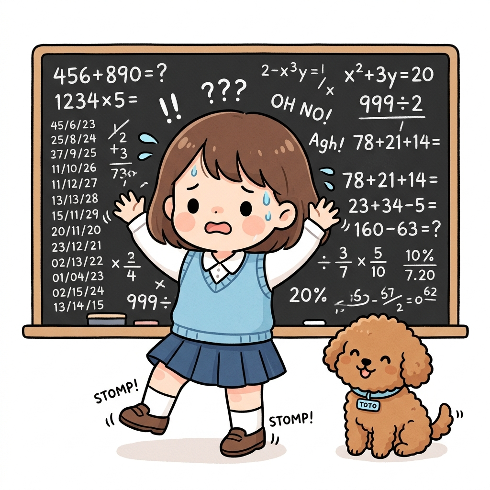
**그림 02-1-1** 칠판에 적힌 수많은 숫자 나열을 보고 잔뜩 겁먹어 발만 동동 구르는 도로시와 그 옆에서 태평한 토토


"지니, 이 칠판 좀 봐! 숫자가 너무 많고 복잡해서 머리가 아파. 대체 이걸 어떻게 다 계산해?"


도로시가 칠판 앞을 서성이며 울상을 짓자, 지니가 보랏빛 마법 연기를 흩날리며 상냥하게 달래주었습니다.


"도로시, 너무 걱정할 필요 없어! 우리에게는 아무리 길고 복잡한 식이라도 단번에 가볍게 압축하는 **치환(Substitution)**이라는 신비한 마법이 있거든. 거기에 식을 예쁘게 정리해 주는 **교환/분배법칙**까지 배우고 나면, 저 칠판 가득한 숫자들도 순식간에 한 줄로 깔끔하게 조립해낼 수 있어!"


**그림 02-1-2** 걱정 어린 표정의 도로시를 따뜻하게 다독이며 수학의 치환 마법을 설명하는 지니


지니의 마법 석판 판서와 함께 이 수학 부품들을 마음대로 조립하고 정리하는 비법을 알려 줍니다.


**그림 02-1-3** 긴 수식의 공통 항을 하나의 동그라미 문자 상자로 묶어 마법처럼 식을 축소시키는 지니와 도로시


---


## 2.1.2 학습 목표

이번에 우리가 학습할 목표는 다음과 같습니다.


- **식의 전개**와 **공통인수**로 묶기(분배법칙)를 이해하고 자유롭게 계산할 수 있다.
- **치환**(Substitution)의 정의와 복잡한 식의 **간소화 효과**를 이해한다.
- 교환법칙, 결합법칙, 분배법칙을 활용하여 수식의 구조를 원하는 형태로 변형할 수 있다.


---


## 2.1.3 교환법칙 (Commutative Law)

> 교환법칙이란? 
>
> 더하거나 곱하는 두 수의 연산 순서를 바꾸어 계산해도 그 결과가 정확히 성립한다는 대수 규칙입니다.


"지니! 연산 순서를 서로 바꾸어도 등식이 완벽히 유지된다는 건, 계산할 때 식의 순서와는 아무 상관이 없다는 의미야?"


도로시가 호기심 가득한 눈으로 묻자, 지니가 쟁반 위에 과일을 얹어 공중에 띄우며 설명했습니다.


"맞아, 도로시! 덧셈과 곱셈은 순서를 어떻게 바꾸어도 결과가 똑같단다. 

예를 들어 '사과 2개와 배 3개'를 합친 것과, '배 3개와 사과 2개'를 합친 것은 개수가 5개로 완전히 같지! 이를 **교환법칙**이라고 해. 

하지만 뺄셈과 나눗셈은 순서를 바꾸면 완전히 다른 결과가 나와. (*5* - *3* ≠ *3* - *5*)"

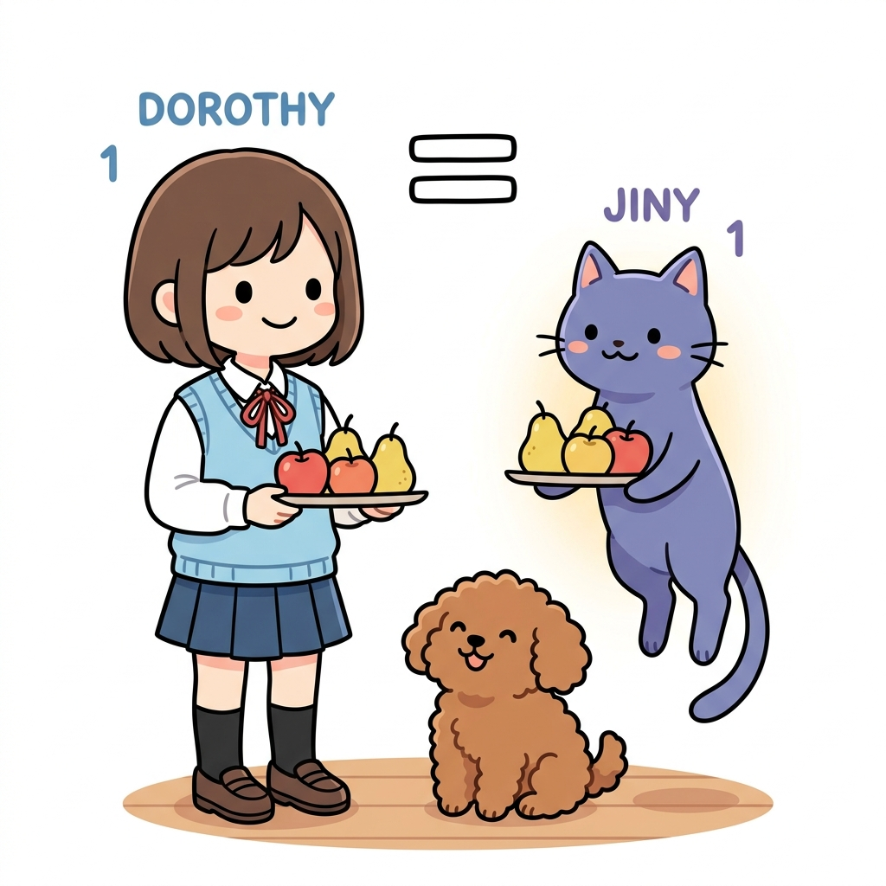
**그림 02-1-4** 사과와 배의 놓는 순서를 바꾸어도 전체 개수는 변함없음을 통해 교환법칙을 설명하는 지니와 도로시


### 2.1.3.1 공식으로 정리

이를 공식으로 표현을 하면 다음과 같습니다.

- **공식**:
  *a* + *b* = *b* + *a* (덧셈의 교환법칙)
  *a* × *b* = *b* × *a* (곱셈의 교환법칙)


**그림 02-1-5** 연산 순서를 서로 바꾸어도 마법처럼 양팔저울의 등식이 완벽히 보존되는 교환법칙을 공부하는 도로시와 지니


### 2.1.3.2 프로그래밍과 코딩에서의 '순서'와 흐름 제어

프로그래밍 세계에서는 수학과 달리 **실행 순서(Execution Order)와 제어 흐름(Control Flow)**이 절대적인 영향력을 행사합니다. 연산의 순서를 바꾸면 버그가 나거나 전혀 다른 결과가 초래될 수 있으며, 조건문의 상태값 판정 순서에 따라 특정 기능의 실행 자체가 배제되기도 합니다.


**실행 순서가 어긋났을 때의 참사**
문 밖으로 걸어나가는 행동을 프로그래밍한다고 해봅시다.

* **정상 순서**: `1. 문을 연다` ➔ `2. 걸어나간다` (안전하게 이동 성공)
* **잘못된 순서**: `1. 걸어나간다` ➔ `2. 문을 연다` (닫힌 문에 머리를 부딪치는 참사 발생!)
이처럼 프로그래밍에서는 각 코드 한 줄이 상태를 바꾸기 때문에 실행 순서를 바꾸는 순간 버그가 되거나 아예 작동하지 않게 됩니다.


**그림 02-1-6** 행동의 실행 순서가 바뀌었을 때 문에 부딪치는 참사를 통해 코딩 흐름의 순서 중요성을 보여주는 지니와 도로시


**조건 판정 순서에 따른 실행 배제 (Short-circuit Evaluation)**
조건문(`if`)에서 두 개 이상의 상태를 판정할 때도 순서가 매우 중요합니다.

* **단락 평가의 원리**: 컴퓨터는 논리 연산에서 앞의 조건문만으로 결과를 확정할 수 있다면 뒤의 조건은 아예 쳐다보지도 않고 **실행에서 배제**합니다.
* **예시**: `if (state != null && state.reward > 0)`
  * `state`가 비어있다면(`null`), 컴퓨터는 첫 조건 `state != null`이 거짓이므로 뒤쪽의 `state.reward > 0`은 아예 실행조차 하지 않고 안전하게 넘어가 에러를 피합니다.
  * 하지만 순서를 바꾸어 `if (state.reward > 0 && state != null)`로 적으면, 비어있는 `state`에서 존재하지도 않는 `.reward` 값을 읽으려고 접근하다가 에러(NullPointerException)가 나며 프로그램이 멈춰버립니다.


**그림 02-1-7** 첫 번째 검문(다리가 있는지 여부)에서 불합격하여 안전문이 닫힘으로써 에러 구덩이로 떨어지는 것을 방지하는 단락 평가의 비유


**함수 호출과 부작용 (Side Effects)**
수학식 *f*(*x*) + *g*(*x*)는 순서를 바꿔 *g*(*x*) + *f*(*x*)로 더해도 결과가 같습니다. 

하지만 프로그래밍에서 두 함수가 전역 변수를 수정하거나 모니터에 로그를 출력하는 등의 **부작용(Side Effect)**을 동반한다면, 실행 순서에 따라 최종 로그가 꼬이거나 상태가 망가질 수 있습니다.


**그림 02-1-8** 먼저 칠한 색을 덮어써서 최종 색상이 달라지는 칠하기 예시를 통해 실행 순서에 따라 결과가 바뀌는 프로그래밍의 부작용(Side Effect)을 설명하는 지니와 도로시


### 2.1.3.3 강화학습에서의 순서와 교환법칙

강화학습 알고리즘 설계와 딥러닝 텐서 계산에서도 순서와 교환법칙의 성질은 핵심적인 역할을 담당합니다.


**딥러닝 행렬 곱셈 (Matrix Multiplication)의 비가환성**
신경망 연산의 핵심인 **행렬 곱셈**은 교환법칙이 성립하지 않습니다. 

즉, 가중치 행렬 *W*와 상태 텐서 *x*에 대해 *W* × *x* ≠ *x* × *W* 입니다.


* **차원의 일치**: 행렬 곱이 성립하려면 앞 행렬의 열 크기와 뒤 행렬의 행 크기가 완벽히 맞물려야 합니다. 마치 형태가 딱 맞는 퍼즐 조각과 같아서 순서가 바뀌면 크기가 어긋나 에러(Shape Mismatch)가 발생합니다.

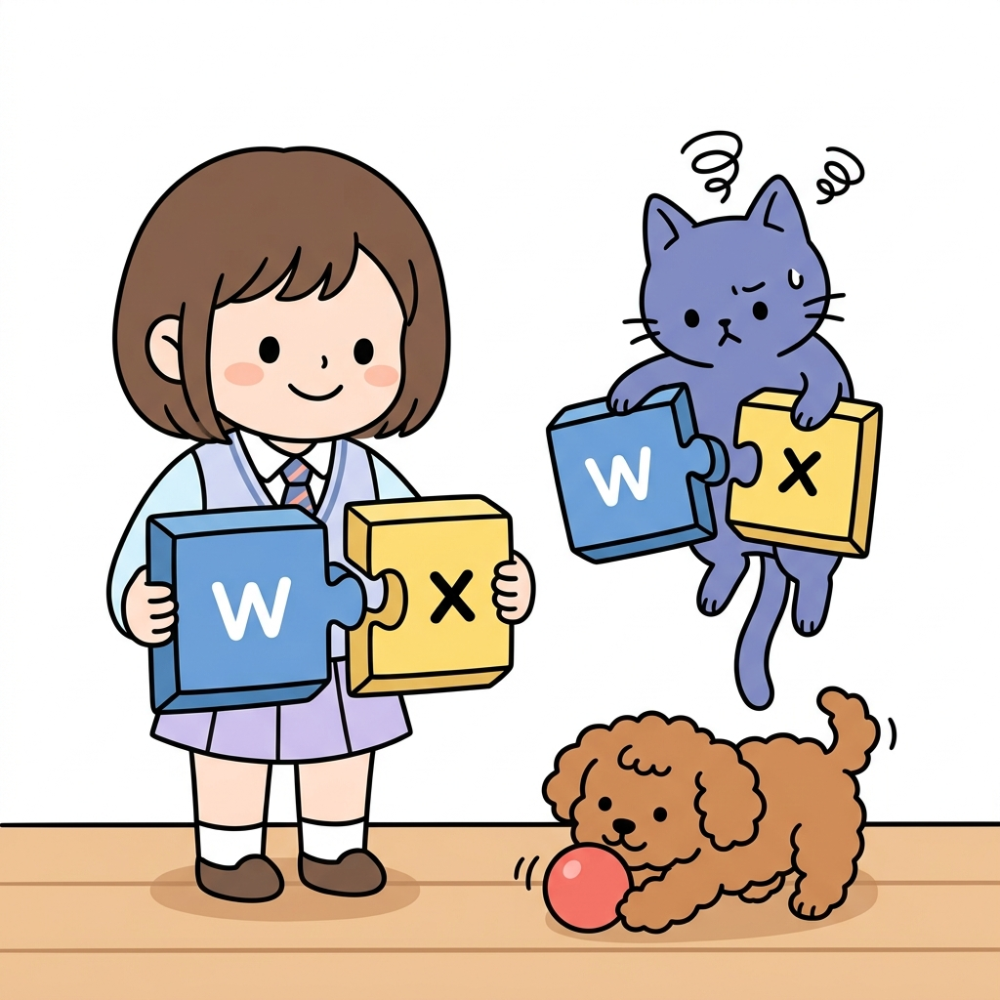
**그림 02-1-9** 앞뒤 행렬의 크기(차원)가 맞물려야만 결합되는 퍼즐 블록을 통해 행렬 곱의 비가환성을 보여주는 지니와 도로시


**강화학습 가치 업데이트 식의 교환법칙**
가치를 업데이트할 때 오차값에 **학습률 *α***를 곱하는 수식은 실수(Scalar) 연산이므로 교환법칙이 성립합니다.

* **식**: *Q*<sub>*n-1*</sub> + *α* × (*R*<sub>*n*</sub> - *Q*<sub>*n-1*</sub>) 과 *Q*<sub>*n-1*</sub> + (*R*<sub>*n*</sub> - *Q*<sub>*n-1*</sub>) × *α* 는 곱셈의 교환법칙에 의해 완벽히 같으므로 코드 구현 시 동일하게 처리됩니다.
* **코딩 적용**: 이 덕분에 파이썬 코드 구현 시 `alpha * (reward - q_prev)`와 `(reward - q_prev) * alpha` 중 어느 쪽을 선택해도 무방하여 개발자의 가독성이나 코딩 스타일에 맞춰 자유롭게 작성할 수 있습니다.

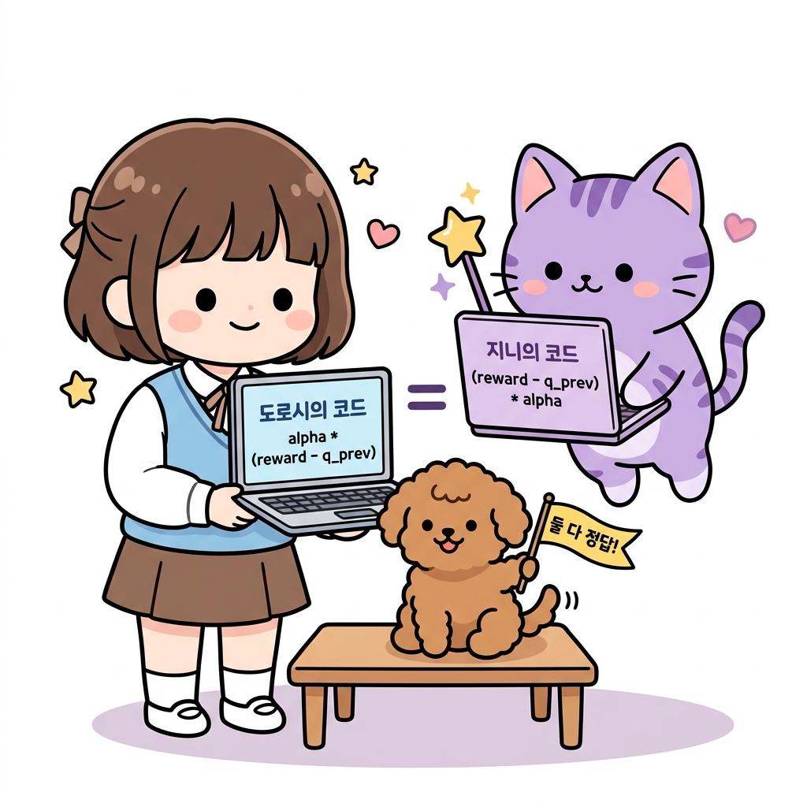
**그림 02-1-10** 곱하는 순서가 달라도 동일한 결과를 내는 가치 업데이트 코드를 서로 비교하며 둘 다 정답임을 확인하는 지니와 도로시, 토토


---


## 2.1.4 분배법칙 (Distributive Law)과 공통인수 묶기

> 분배법칙이란?
>
> 괄호 밖의 수를 괄호 안의 모든 항에 **각각 곱**하여 전개하거나, 반대로 각 항에 **공통**으로 들어있는 문자(공통인수)를 묶어 괄호 밖으로 빼내는 규칙입니다.


"지니! 분배법칙이란 건 뭐야? 이름만 보면 무언가를 골고루 나누어 주는 것 같은데?"


도로시가 과자 상자를 보며 눈을 반짝이자, 지니가 쟁반 위에 놓인 과자를 가리키며 웃었습니다.


"아주 정확해, 도로시! 괄호 밖에 곱해진 어떤 값(공통 인수)을 괄호 안의 모든 멤버들에게 골고루 분배해 곱해주는 마법이지. 예를 들어 '마법 쿠키 3개짜리 봉지'를 (도로시 + 토토)에게 분배하면, 도로시도 3개의 쿠키를 갖고 토토도 3개의 쿠키를 갖게 되는 식이야. 반대로 둘이 각각 3개씩 가지고 있는 쿠키를 '3'이라는 공통 상자로 한데 묶어낼 수도 있어!"

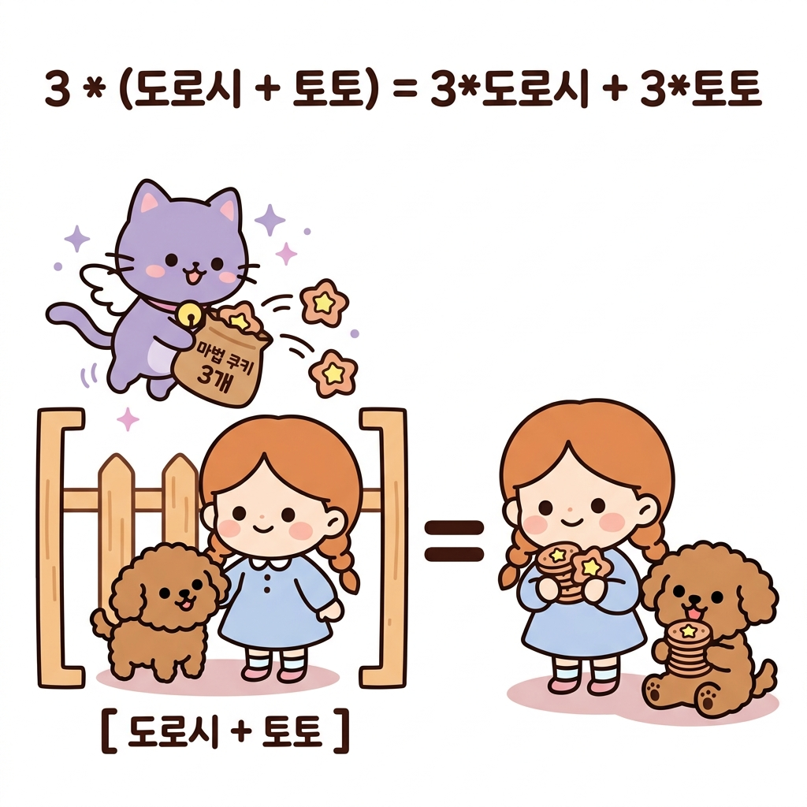
**그림 02-1-11** 괄호 밖의 공통인수(과자)를 골고루 분배하여 곱해주거나 반대로 공통인수로 묶는 분배법칙의 원리를 공부하는 도로시와 지니


### 2.1.4.1 공식으로 정리

이를 공식으로 표현을 하면 다음과 같습니다.


- **공식**:
  *a*(*b* + *c*) = *ab* + *ac* (분배하여 전개하기)
  *ab* + *ac* = *a*(*b* + *c*) (공통인수 *a*로 묶어 인수분해하기)

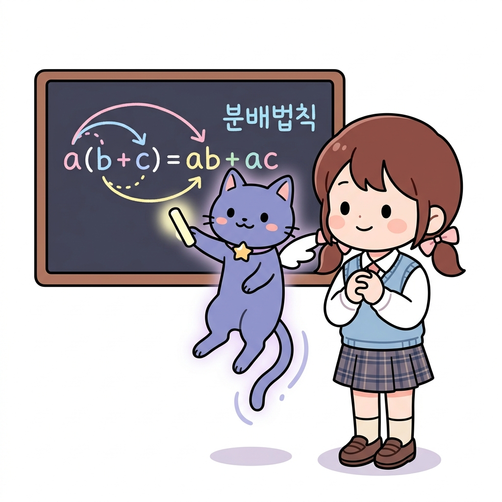
**그림 02-1-12** 괄호 밖의 변수를 고루 나누어 곱해주거나, 반대로 공통인수로 곱해서 식을 요리하는 분배법칙


### 2.1.4.2 프로그래밍과 코딩에서의 분배법칙: 연산량 최적화

수학의 분배법칙 *a* × *b* + *a* × *c* = *a* × (*b* + *c*) 는 컴퓨터가 처리하는 연산 장치의 **연산량 최적화**와 직접적인 관련이 있습니다.


**연산량의 차이**

* **식 A (`a * b + a * c`)**: 곱셈 2번 + 덧셈 1번 = 총 3번의 연산 필요 (무겁고 많은 연산)
* **식 B (`a * (b + c)`)**: 곱셈 1번 + 덧셈 1번 = 총 2번의 연산 필요 (가볍고 빠른 연산)


컴퓨터 연산 장치(CPU/GPU)에서 부동소수점 곱셈은 덧셈보다 훨씬 더 무겁고 리소스를 많이 소모하는 작업입니다. 분배법칙을 이용해 공통인수로 식을 묶어 연산하면, 소모적인 곱셈 횟수를 절반으로 줄일 수 있습니다.


**그림 02-1-13** 수식을 인수분해하여 묶음으로써 연산 상자의 개수를 줄이고 가벼운 발걸음으로 계산하는 도로시의 모습


수억 번의 반복 계산을 수행하는 딥러닝과 강화학습 코드를 작성할 때, 이처럼 분배법칙을 활용하여 코드를 단 한 줄이라도 최적화하면 전체 학습 속도를 수 분에서 수 시간까지 단축시키는 강력한 힘을 발휘하게 됩니다.


### 2.1.4.3 강화학습에서의 분배법칙 활용

강화학습의 핵심 수식 유도 과정(예: 표본 평균 및 지수 감쇄 공식)에서 이 분배법칙은 빈번하게 사용됩니다.


**가치 업데이트 식의 변형 예시**:
*Q*<sub>*n-1*</sub> - *α* *Q*<sub>*n-1*</sub> = (1 - *α*) *Q*<sub>*n-1*</sub>

*해설*: 좌변의 두 항에 공통으로 곱해져 있는 *Q*<sub>*n-1*</sub>을 하나의 공통인수로 파악하여 분배법칙의 역(인수분해)으로 묶어낸 결과입니다. 이를 통해 2번의 연산(곱셈 1번, 뺄셈 1번)만으로 동일한 계산을 마칠 수 있도록 최적화되었습니다.

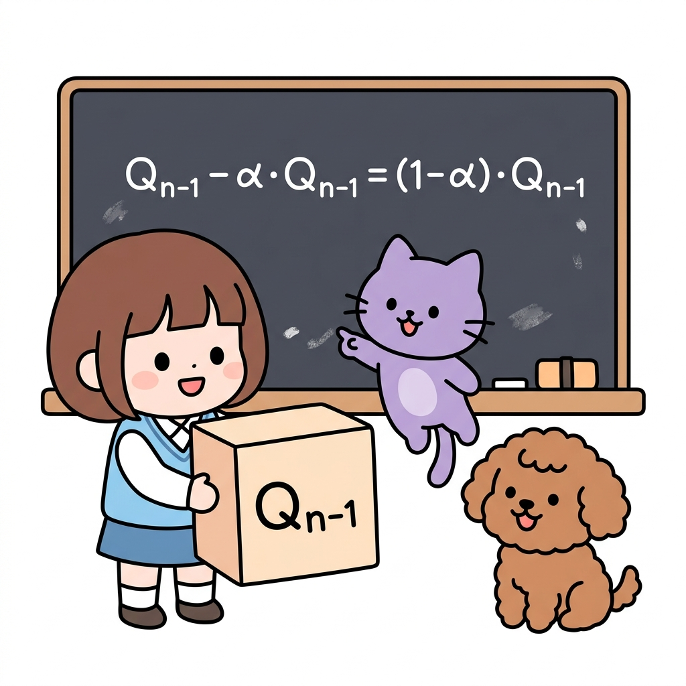
**그림 02-1-14** 가치 업데이트 식에서 공통 항 *Q*<sub>*n-1*</sub>을 묶어서 (1 - *α*) × *Q*<sub>*n-1*</sub>로 식을 유도하고 연산 횟수를 최소화하는 방법을 설명하는 지니와 도로시


---


## 2.1.5 치환 (Substitution)과 대입

> 치환이란?
>
> 어떤 복잡한 수식이나 공통된 긴 묶음을 **간단한 하나의 문자(또는 상자)**로 바꾸어 놓고 식을 전개하는 기법입니다.


"지니! 치환이란 건 복잡한 식을 문자 하나로 줄여주는 요술 상자 같은 거라고 했잖아. 실제 계산할 때는 어떻게 쓰여?"

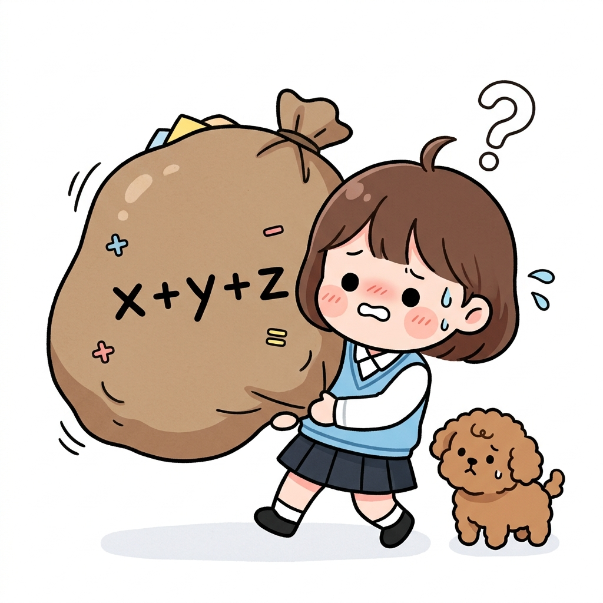
**그림 02-1-15** 복잡하고 무거운 식 더미(x + y + z)를 어떻게 처리해야 할지 고민하는 도로시와 의아해하는 토토


도로시가 질문을 던지자, 지니가 허공에 마법 보관함 자물쇠를 소환하여 열쇠 태그를 흔들며 설명했습니다.


"맞아, 도로시! 수식에서 아주 길고 여러 번 반복해서 사용되는 똑같은 식의 묶음(예: *x* + *y* + *z*)이 보이면, 그걸 잠시 'A'라는 가벼운 문자 카드(또는 상자)로 퉁치고 식을 간단하게 만들어 놓고 정리한 뒤, 마지막에 그 카드 자리에 원래 가방을 다시 돌려주는(대입) 방법이야. 


**그림 02-1-16** 무거운 짐 더미(x + y + z)를 물품 보관함에 맡기고 열쇠 태그(A)를 받아 가뿐해진 상황을 보여주는 지니와 도로시, 토토


마치 마트에서 수많은 짐을 보관함에 넣고 가벼운 '자물쇠 번호표' 하나만 들고 다니다가 계산이 끝난 뒤 짐을 찾아가는 것과 완전히 똑같아!"


### 2.1.5.1 원리와 공식

치환의 기본적인 원리는 다음과 같습니다.


**원리**:

* 만약 *A* = *x* + *y* + *z* 라고 미리 약속(치환)한다면, 복잡하게 생긴 식 (*x* + *y* + *z*)<sup>2</sup> + 3(*x* + *y* + *z*) 은 단순히 *A*<sup>2</sup> + 3*A* 로 아주 간소하게 바뀝니다.
* *A*를 기준으로 모든 전개 및 계산이 다 끝난 뒤, 마지막 결과 식의 *A* 자리에 원래 식인 (*x* + *y* + *z*)를 다시 **대입**해 복원합니다.


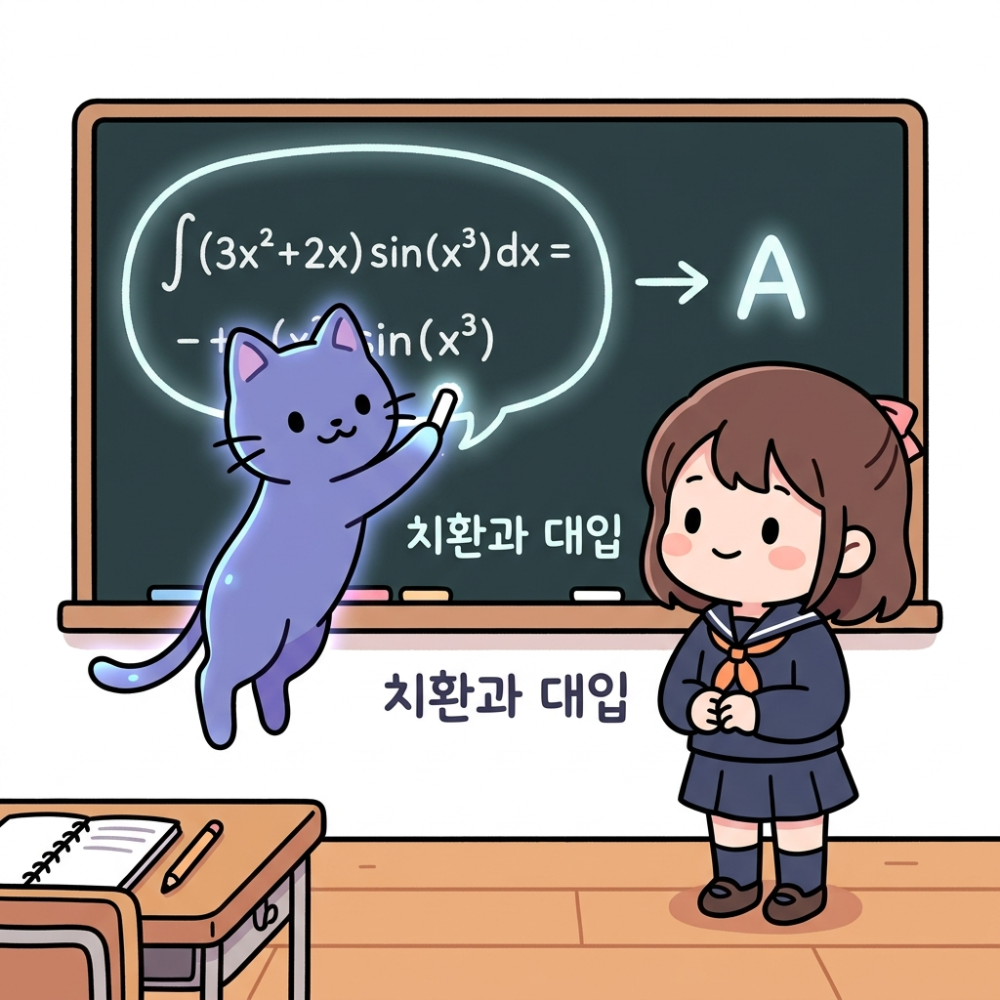
**그림 02-1-17** 복잡한 식의 일부분을 한 문자로 가볍게 묶어 치환하고 대입하는 대수 조작법


### 2.1.5.2 프로그래밍과 코딩에서의 치환: 임시 변수와 함수 추상화

컴퓨터 프로그래밍에서도 수학의 **치환과 대입**의 개념이 매우 중요하게 쓰입니다. 

프로그래밍에서 치환은 크게 두 가지 형태로 나타납니다.


**1. 임시 변수(Temporary Variable)를 이용한 값의 치환**
복잡하거나 자주 반복되는 연산의 값을 하나의 변수에 할당해 두는 것입니다.
* **치환 전**: 
  `y = (x + 5) * (x + 5) + 3 * (x + 5)`
  이 코드에서 컴퓨터는 동일한 연산인 `x + 5`를 총 3번 수행해야 합니다. 연산 속도가 느려지고 코드가 번잡해집니다.
* **치환 후 (임시 변수로 치환)**:
  `temp = x + 5`
  `y = temp * temp + 3 * temp`
  `x + 5`라는 복잡한 식을 `temp`라는 변수로 **치환**하였습니다. 컴퓨터는 덧셈 연산을 단 한 번만 수행한 뒤 그 값을 재사용하므로, CPU 연산 부하가 대폭 줄어들고 코드의 의미가 훨씬 명확해집니다.

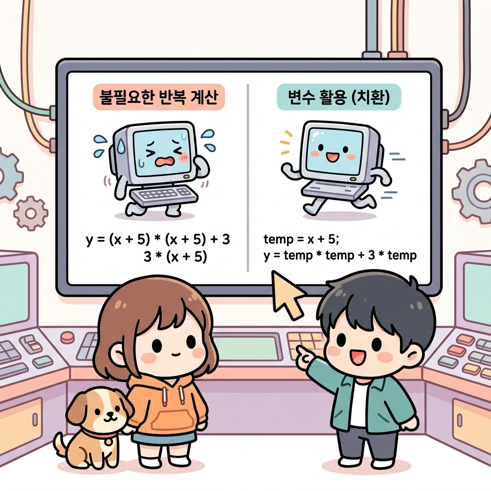
**그림 02-1-18** 동일한 수식 연산의 반복을 변수(temp)에 할당하여 부하를 낮추고 실행 효율을 극대화하는 컴퓨터의 모습


**2. 함수(Function)를 이용한 로직/실행 블록의 치환**
프로그래밍에서 복잡한 연산 흐름이나 특정 기능을 **독립된 함수(Function)로 분리하는 것** 역시 고차원적인 **치환** 행위입니다.

* 수학에서 길고 지저분한 식 *x* + *y* + *z*를 간단히 카드 기호 *A*로 치환해 숨기듯, 프로그래밍에서는 수십 줄의 복잡한 알고리즘을 단 한 줄의 함수 호출문(`calc_value()`)으로 치환하여 감출 수 있습니다.
* **함수 치환의 장점**:
  * **코드 추상화**: 내부의 복잡한 구현 세부 사항(어떻게 계산되는지)을 숨기고, 호출부에서는 함수명(무엇을 하는지)만 보고 쉽게 이해할 수 있습니다.
  * **재사용성**: 동일한 로직이 필요할 때마다 전체 코드를 복사해서 붙여넣을 필요 없이, 치환해 둔 함수 이름만 불러와 재사용합니다.
  * **유지보수 용이성**: 계산 공식에 오류가 있거나 개선할 때, 여러 곳의 코드를 수정할 필요 없이 함수 내부의 정의부 한 곳만 수정하면 전체 프로그램에 대입되어 적용됩니다.


**그림 02-1-19** 복잡하고 거대한 기계 장치(연산 코드 블록)를 마법 마술봉을 이용해 깔끔한 하나의 원격 호출 버튼(함수)으로 치환하는 지니와 도로시


### 2.1.5.3 강화학습에서의 치환 활용

강화학습에서 **평균 가치**를 증분 방식으로 업데이트하는 핵심 식(식 3.2) 유도 과정에서도 이 치환 기법이 절대적인 위력을 발휘합니다.


**식 3.2 유도 과정 예시 (단계별 유도)**:
* **1단계 (이전 평균 정의)**: 이전 시점 *n* - 1 까지 얻은 보상들의 누적 평균 식인 *Q*<sub>*n-1*</sub> 은 다음과 같습니다.
  > *Q*<sub>*n-1*</sub> = (*R*<sub>1</sub> + *R*<sub>2</sub> + ... + *R*<sub>*n-1*</sub>) / (*n* - 1)
* **2단계 (합산 항 정리)**: 위 식의 양변에 *n* - 1 을 곱하면, 복잡하고 긴 보상들의 합을 다음과 같이 정리할 수 있습니다.
  > (*R*<sub>1</sub> + *R*<sub>2</sub> + ... + *R*<sub>*n-1*</sub>) = (*n* - 1) × *Q*<sub>*n-1*</sub>
* **3단계 (대입과 치환)**: 현재 시점 *n* 의 보상 평균 식 *Q*<sub>*n*</sub> 은 다음과 같습니다.
  > *Q*<sub>*n*</sub> = (*R*<sub>1</sub> + *R*<sub>2</sub> + ... + *R*<sub>*n-1*</sub> + *R*<sub>*n*</sub>) / *n*
  
  이 식의 분자에 있는 누적 보상들의 합인 (*R*<sub>1</sub> + ... + *R*<sub>*n-1*</sub>) 자리에, 2단계에서 유도한 **(*n* - 1) × *Q*<sub>*n-1*</sub>**을 **대입(치환)**하여 식을 아주 단순하게 간소화합니다.
  > *Q*<sub>*n*</sub> = {(*n* - 1) × *Q*<sub>*n-1*</sub> + *R*<sub>*n*</sub>} / *n*
* **4단계 (최종 점화식 전개)**: 분자를 풀어서 계산하고 분리하여 최종 증분 가치 업데이트 수식을 얻습니다.
  > *Q*<sub>*n*</sub> = *Q*<sub>*n-1*</sub> + (1 / *n*) × (*R*<sub>*n*</sub> - *Q*<sub>*n-1*</sub>)


지니와 도로시가 칠판 앞에 서서 복잡한 수식을 어떻게 치환 카드로 깔끔하게 정리하는지 보여줍니다.

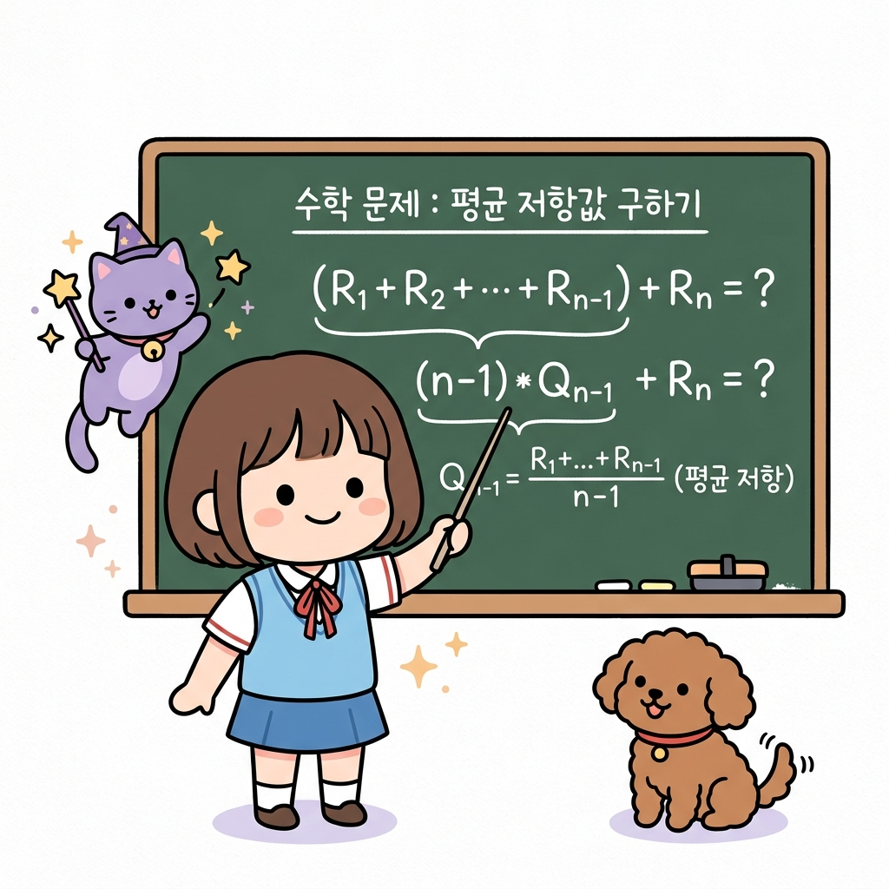
**그림 02-1-20** 칠판에 적힌 이전 보상들의 평균 식을 치환하여 최종 가치 점화식으로 유도해내는 지니와 도로시


---


## 2.1.6 수학적 표현 vs 파이썬 프로그래밍의 비교

컴퓨터의 프로그래밍 언어(파이썬)에서도 수학의 수식 전개, 우선순위, 치환 등의 원리가 완벽히 녹아들어 작동하고 있습니다.


### 2.1.6.1 식의 평가와 연산자 우선순위 (Operator Precedence)
- **수학**: 곱셈과 나눗셈을 덧셈과 뺄셈보다 먼저 계산하며, 괄호 `()`가 씌워진 부분을 가장 우선하여 연산합니다.
- **파이썬**: 연산자 우선순위에 따라 작동합니다. `()` ➔ `**` (거듭제곱) ➔ `*`, `/` (곱셈, 나눗셈) ➔ `+`, `-` (덧셈, 뺄셈) 순으로 평가됩니다.
  - *예시*: 수학식 1 - *α* *Q*<sub>*n-1*</sub> 은 곱셈이 먼저 계산되어 1 - (*α* × *Q*<sub>*n-1*</sub>) 이 됩니다. 파이썬 코드 `1 - alpha * q_prev` 또한 `*`의 우선순위가 `-`보다 높으므로 수학적 규칙과 완벽하게 동일한 순서로 처리됩니다.


### 2.1.6.2 변수(Variable)를 이용한 치환과 대입
- **수학**: 복잡한 묶음식을 기호 *A*로 치환해 간단히 표현한 뒤 최종 전개합니다.
- **파이썬**: 복잡한 식의 결과값을 변수명(Variable)에 할당(`=`)하여 사용합니다.
  ```python
  # 수학의 치환과 대입에 해당하는 파이썬 코드
  target_diff = reward + gamma * next_state_value - current_value  # 치환
  current_value = current_value + alpha * target_diff             # 대입
  ```
  - 파이썬에서 변수를 사용하는 것은 수학의 **치환**과 같을 뿐만 아니라, 중복 연산을 피해 메모리와 CPU 연산을 절약하는 **성능 최적화**의 효과를 낳습니다.


---


### 2.1.7 실전 예제

학습한 내용을 이용하여 몇가지 문제를 풀어 보도록 합니다.


#### 문제 1 (분배법칙과 인수분해)
다음 식을 분배법칙을 활용하여 공통인수로 묶어 간결하게 정리하시오.
*(1 - α) Q<sub>n-1</sub> + α R<sub>n</sub>* 에서 괄호를 풀어 전개하고, 다시 *Q<sub>n-1</sub>* 을 기준으로 묶어 증분 업데이트 식 형태로 변형하시오.

> **풀이**:
> 1) 먼저 괄호를 풀어 전개합니다:
>   *= Q<sub>n-1</sub> - α Q<sub>n-1</sub> + α R<sub>n</sub>*
> 2) *α* 가 들어있는 두 항을 공통인수 *α* 로 묶어내어 분배법칙을 적용합니다:
>    *= Q<sub>n-1</sub> + α (R<sub>n</sub> - Q<sub>n-1</sub>)*
>    **정답**: *Q<sub>n-1</sub> + α (R<sub>n</sub> - Q<sub>n-1</sub>)*


---


### 2.1.8 핵심 요약

1. **분배법칙**은 괄호 밖의 수를 각 항에 나누어 곱해주거나, 각 항의 공통 문자를 묶어 괄호 밖으로 빼내는 유용한 대수 규칙이다.
2. **치환**은 복잡한 긴 수식 덩어리를 하나의 단순한 기호로 임시 변형하는 행위로, 식의 전체적인 구조를 꿰뚫어 보게 만든다.
3. 이 두 규칙은 강화학습의 다양한 갱신 알고리즘 수식을 유도하고, 컴퓨터 메모리를 최적화하는 데 필수적인 연산 도구이다.
