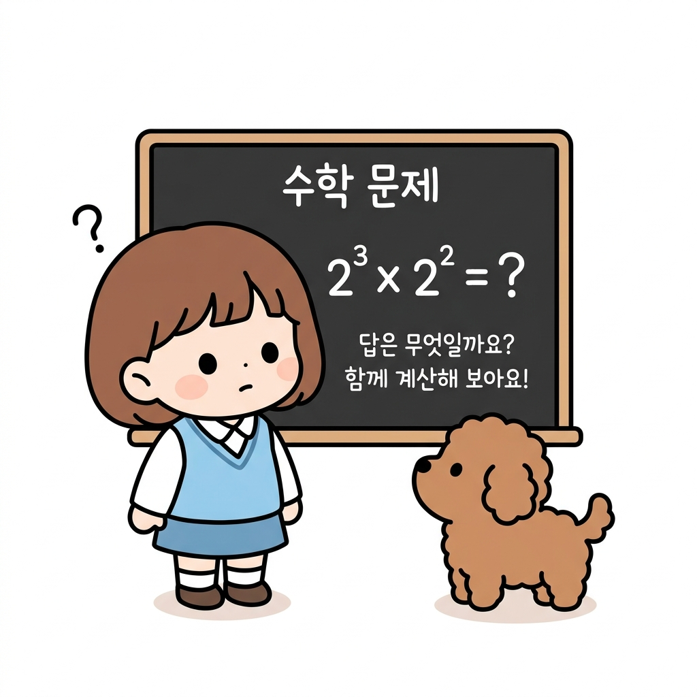
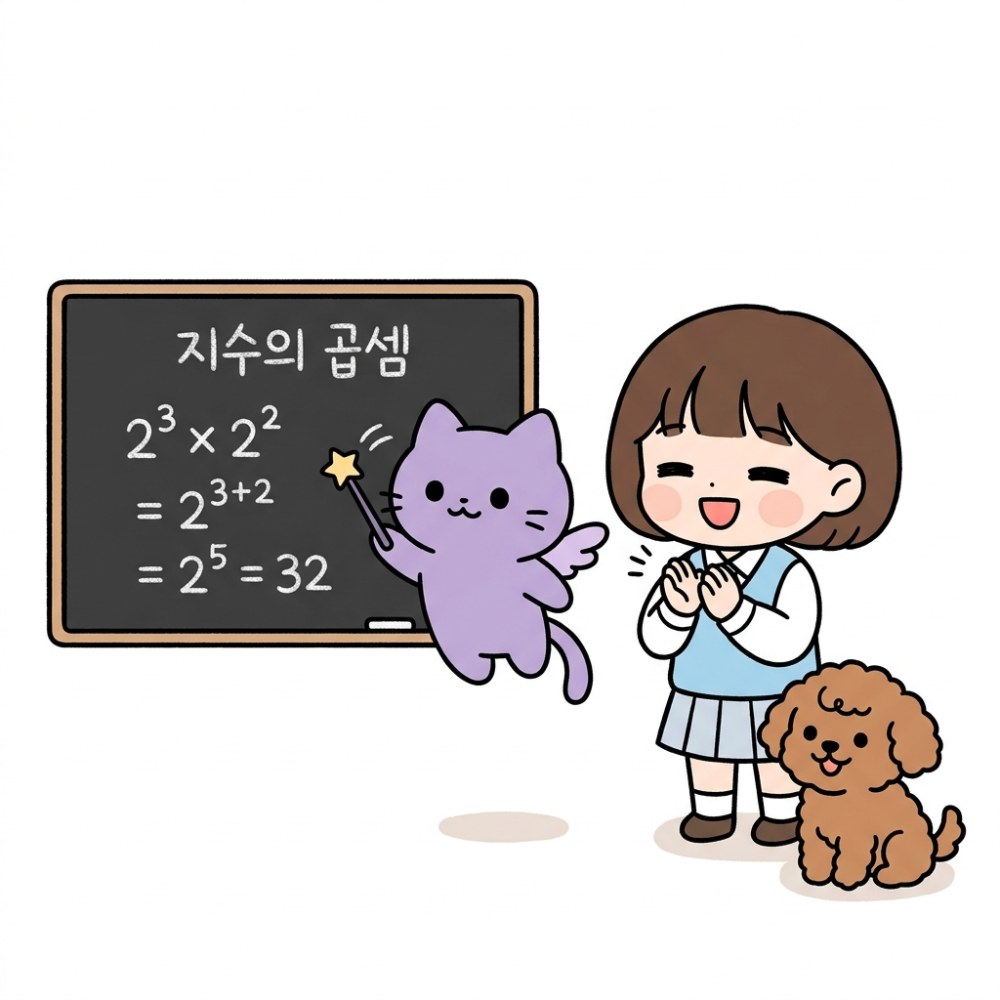
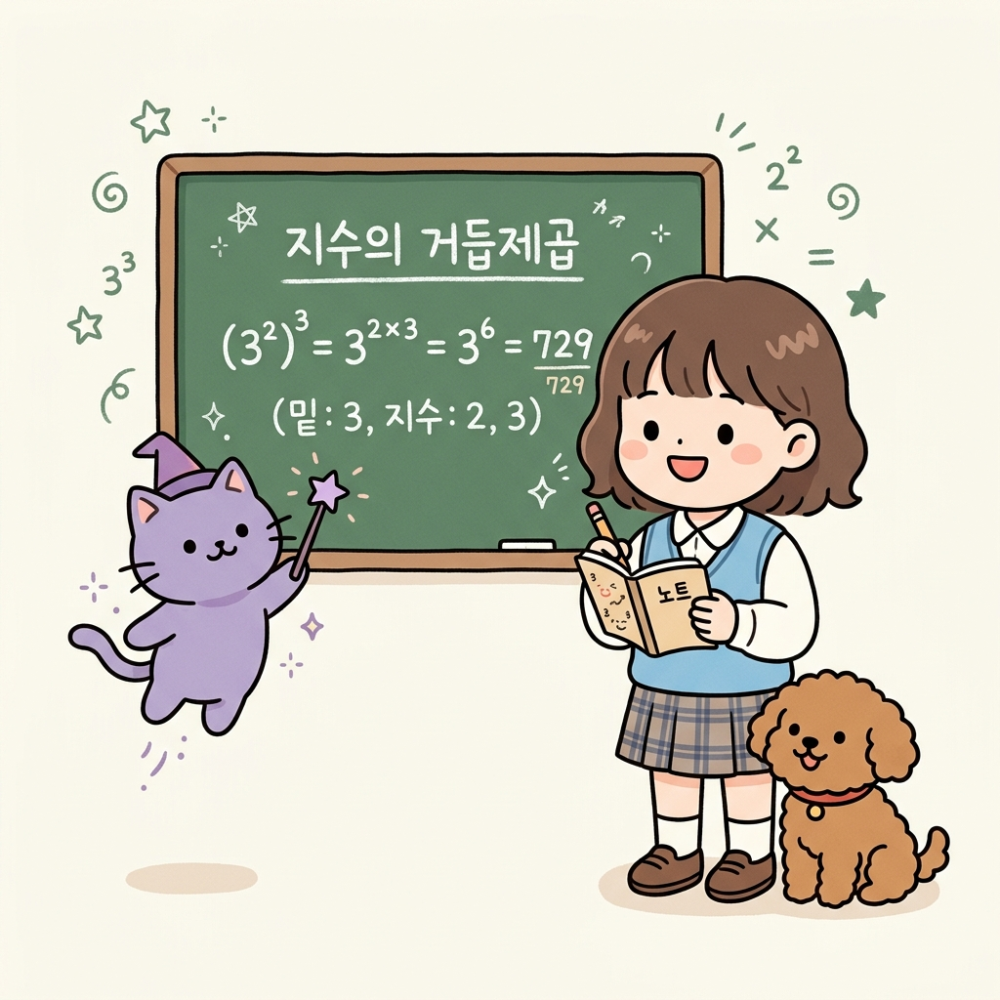
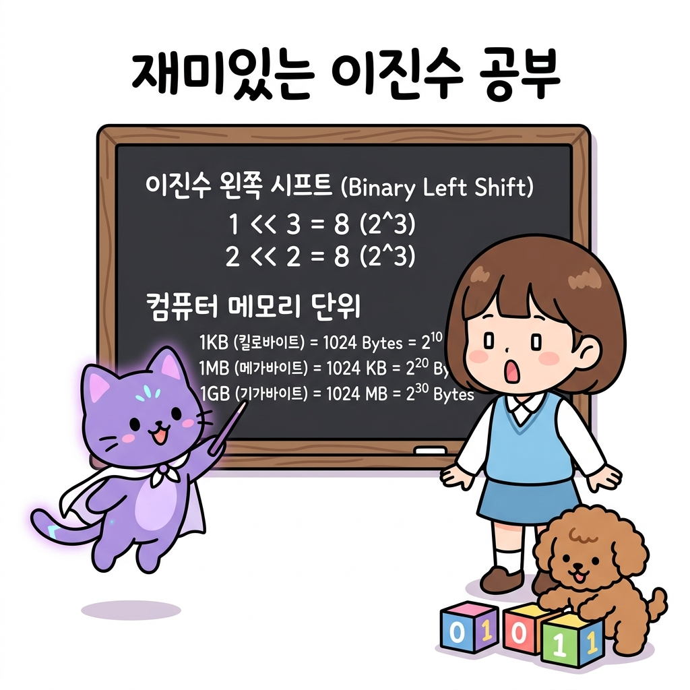
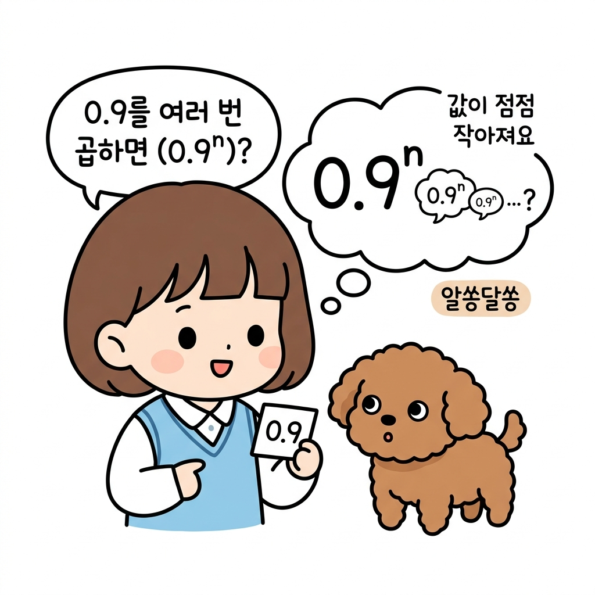
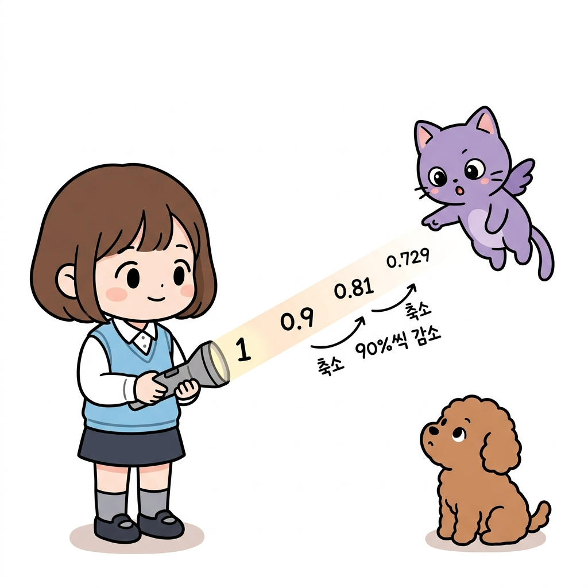
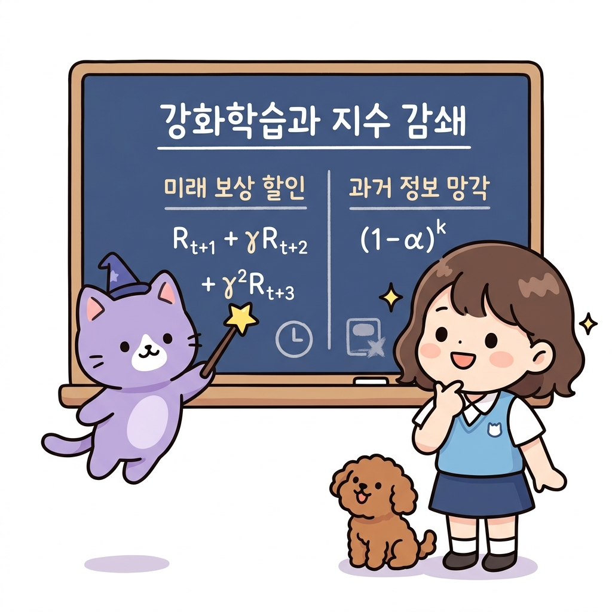
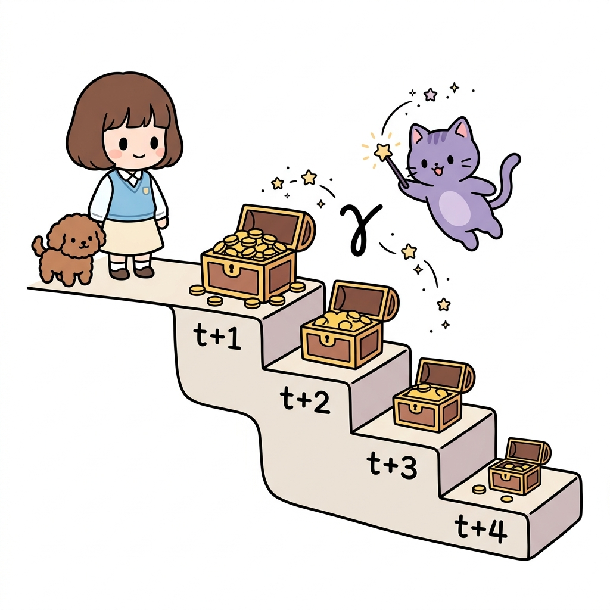
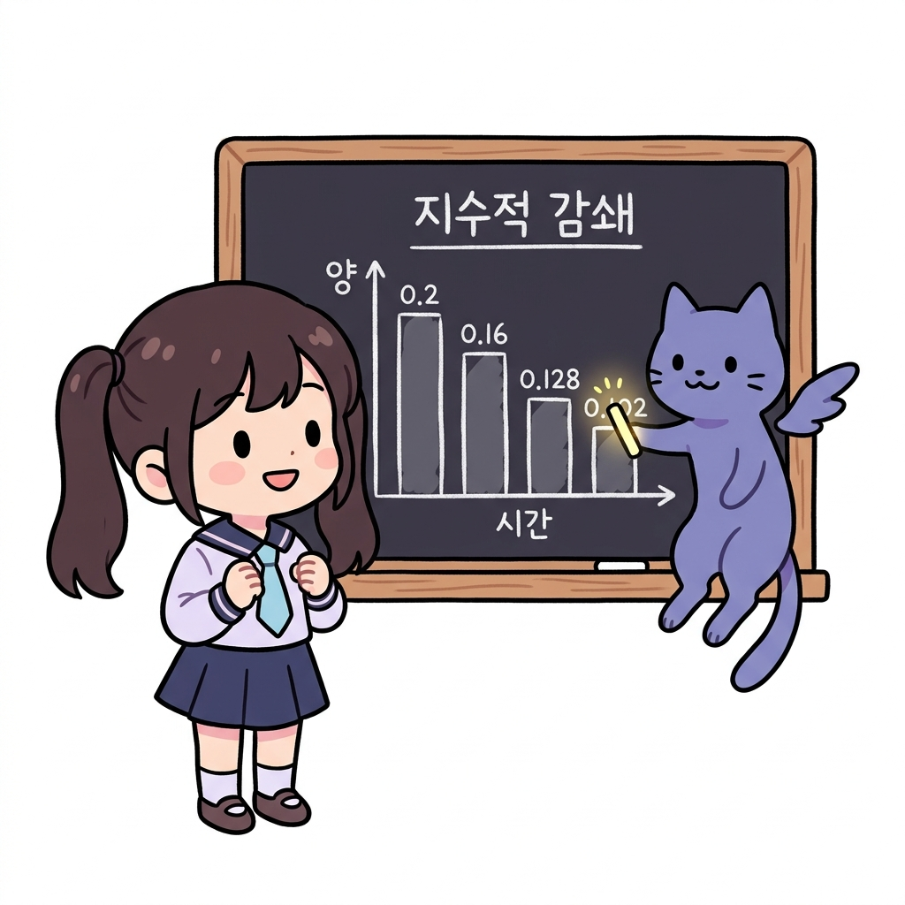

# 02.2 지수와 거듭제곱

> 이 장에서는 **지수와 거듭제곱**의 수학적 기본 원리를 배우고, 1보다 작은 값을 계속 거듭해서 곱할 때 나타나는 지수적 감쇄가 강화학습에서 과거 데이터의 영향력을 제어하는 데 어떻게 사용되는지 배웁니다.


---


## 02.2.1 거듭제곱과 지수란 무엇일까요?

강화학습에서 먼 미래의 보상을 현재 가치로 깎아주는 **할인율**이나, 비정상 환경에서 과거 데이터의 반영률을 점차 낮춰주는 **지수 감쇄**를 이해하려면 먼저 지수의 기초를 탄탄하게 다져야 합니다. 


"지니! 이 보물상자는 열 때마다 안에 든 금화가 반으로 줄어들어! 대체 무슨 마법이 걸려 있는 거야?"


**그림 02-2-1** 보물상자를 열 때마다 금화 개수가 줄어드는 규칙에 대해 의문을 가지는 도로시와 토토


도로시가 상자 안을 들여다보며 신기해하자, 지니가 웃으며 마법 칠판에 수식을 적어가며 설명해 주었습니다.


"그건 바로 '감쇄의 거듭제곱' 마법이 걸려 있기 때문이야, 도로시! 상자를 열 때마다 원래 금화 개수에 계속 0.5를 반복해서 곱하는 규칙이지. 만약 상자를 3번 열면 금화 개수에 0.5 × 0.5 × 0.5를 곱한 만큼 줄어들게 돼. 수학에서는 이렇게 똑같은 수를 반복해서 곱하는 것을 아주 간단하게 표현하는 마법을 **거듭제곱**이라고 불러!"


**그림 02-2-2** 반복된 곱셈(0.5 × 0.5 × 0.5)을 거듭제곱 기호(0.5³)로 깔끔하게 묶어 설명하는 지니와 신기해하는 도로시, 토토


---


## 02.2.2 거듭제곱의 원리와 지수법칙

> 거듭제곱이란?
>
> 같은 수나 문자를 여러 번 반복해서 곱한 것을 간단히 나타낸 것을 **거듭제곱**이라고 합니다.


**그림 02-2-3** 같은 밑을 n번 거듭해서 곱하여 지수로 축약 표시하는 거듭제곱과 지수의 연산


* **표기법**: *a*<sup>*n*</sup>
* **구조와 명칭**:
  * **밑 (*a*)**: 거듭해서 곱하는 기본 수나 문자입니다.
  * **지수 (*n*)**: 거듭해서 곱해진 수나 문자의 개수(횟수)를 나타냅니다.
  * *읽는 방법*: *a*<sup>2</sup>은 'a의 제곱', *a*<sup>3</sup>은 'a의 세제곱', *a*<sup>*n*</sup>은 'a의 n제곱'이라고 읽습니다.


### 2.2.2.1 지수법칙의 기초

지수끼리의 **곱셈**과 **거듭제곱**은 다음과 같은 아주 단순하고 편리한 연산 규칙을 따릅니다.

"지니! 그럼 밑이 같은 지수끼리 곱할 때는 어떻게 계산해야 해? 매번 다 풀어서 곱해야 할까?"


**그림 02-2-4** 밑이 같은 거듭제곱의 곱셈(2³ × 2²)을 어떻게 풀지 고민하는 도로시와 바라보는 토토


"그럴 필요 전혀 없어, 도로시! 지수법칙 두 가지만 기억하면 아주 쉽게 풀 수 있어!"


**1. 밑이 같은 거듭제곱의 곱셈**
밑이 서로 같은 두 거듭제곱을 곱할 때는 두 지수를 서로 **더해주면** 됩니다.

* **공식**: *a*<sup>*m*</sup> × *a*<sup>*n*</sup> = *a*<sup>*m*+*n*</sup>
* **원리**: 2<sup>3</sup> × 2<sup>2</sup> 은 2를 세 번 곱한 것과 두 번 곱한 것을 다시 연달아 곱하는 것이므로, 결국 2를 총 (3 + 2)번, 즉 5번 곱하는 것과 같습니다.
  * *예시*: 2<sup>3</sup> × 2<sup>2</sup> = (2 × 2 × 2) × (2 × 2) = 2<sup>3+2</sup> = 2<sup>5</sup> = 32


**그림 02-2-5** 지수를 서로 더해서 간단히 답을 구하는 지수의 곱셈 법칙을 설명하는 지니와 박수치는 도로시


**2. 거듭제곱의 거듭제곱**
거듭제곱을 한 식을 다시 전체적으로 거듭제곱할 때는 두 지수를 서로 **곱해주면** 됩니다.


* **공식**: (*a*<sup>*m*</sup>)<sup>*n*</sup> = *a*<sup>*m* × *n*</sup>
* **원리**: (3<sup>2</sup>)<sup>3</sup> 은 '3을 두 번 곱한 묶음(3<sup>2</sup>)'을 세 번 반복해서 곱하는 것이므로, 결국 3이 2개씩 3묶음, 즉 총 (2 × 3)개 곱해진 것입니다.
  * *예시*: (3<sup>2</sup>)<sup>3</sup> = 3<sup>2 × 3</sup> = 3<sup>6</sup> = 729


**그림 02-2-6** 안팎의 지수를 곱해 지수를 간소화하는 지수의 거듭제곱 법칙을 설명하는 지니와 노트를 필기하는 도로시


### 2.2.2.2 컴퓨터 2진수 지수법칙

컴퓨터는 모든 데이터를 0과 1로 구성된 2진수로 처리하기 때문에, 컴퓨터 과학과 프로그래밍에서는 밑이 2인 거듭제곱(2<sup>*n*</sup>)과 지수법칙이 광범위하게 적용됩니다.


"지니! 컴퓨터 메모리 용량 단위인 KB, MB, GB 같은 것도 지수법칙이랑 관련이 있어?"
도로시가 고개를 갸웃거리자 지니가 보라색 망토를 휘날리며 대답했습니다.

**그림 02-2-7** 1KB, 1MB, 1GB 메모리 상자들을 들고 지수법칙과의 관계에 대해 질문하는 도로시와 이를 흥미롭게 듣는 지니, 토토


"완전히 관련이 있지! 우리가 흔히 쓰는 메모리 단위가 바로 2의 거듭제곱으로 계산되거든!"


**1. 컴퓨터 메모리 단위의 곱셈 (지수 합 법칙)**
컴퓨터 용량에서 1KB(킬로바이트)는 2<sup>10</sup> 바이트(1024 바이트)입니다.
* **1MB(메가바이트)**는 1KB가 1024개 모인 크기이므로, 2<sup>10</sup> × 2<sup>10</sup> 바이트가 됩니다.
* 지수법칙(지수 합)을 적용하면:
  2<sup>10</sup> × 2<sup>10</sup> = 2<sup>10+10</sup> = 2<sup>20</sup> 바이트가 됩니다.
* **1GB(기가바이트)**는 1MB가 1024개 모인 크기이므로:
  2<sup>20</sup> × 2<sup>10</sup> = 2<sup>20+10</sup> = 2<sup>30</sup> 바이트가 됩니다.


이처럼 지수법칙의 덧셈 규칙 덕분에 메모리 연산 단위를 아주 쉽게 조작하고 설명할 수 있습니다.


**2. 시프트 연산자(Shift Operator)를 이용한 지수 계산 최적화**
프로그래밍에서 컴퓨터가 2의 거듭제곱(2<sup>*n*</sup>)을 연산할 때는 곱셈 연산자 대신 비트 시프트 연산자(`<<`)를 사용하면 하드웨어 레벨에서 연산 속도를 대폭 줄일 수 있습니다.

* **비트 왼쪽 시프트 (`<<`)**: 이진수 비트 열을 왼쪽으로 밀어주는 연산으로, 한 칸 밀 때마다 값이 2배씩 커집니다.
  * `1 << n` 은 수학적으로 **1 × 2<sup>*n*</sup>**을 계산하는 것과 완벽히 같습니다.
  * *예시*: `1 << 3` 은 1 × 2<sup>3</sup> = 8 이 되고, `2 << 2` 는 2 × 2<sup>2</sup> = 8 이 됩니다.


**그림 02-2-8** 컴퓨터 메모리 단위 계산의 지수 합 법칙과 비트 시프트 연산자(<<)를 활용한 2진 지수 연산의 비유를 공부하는 지니와 도로시, 토토


---


## 02.2.3 지수적 감쇄 (Exponential Decay)

밑이 1보다 작은 양수(0 < *a* < 1)일 때, 지수 *n*이 커지면 커질수록 그 결과값은 어떻게 변할까요?


**그림 02-2-9** 1보다 작은 수(0.9)를 거듭제곱할 때의 변화에 대해 호기심을 가지는 도로시와 토토


"지니! 1보다 작은 수인 0.9를 계속해서 곱하니까 값이 엄청 빠르게 작아지는 것 같아!"

도로시가 질문 카드를 보여주자, 지니가 머리 위로 빛을 비추며 대답했습니다.

"맞아, 도로시! 그걸 수학에서는 **지수적 감쇄(Exponential Decay)**라고 불러. 마치 멀어질수록 빛의 밝기가 급격하게 흐려지는 손전등 불빛과도 같지!"


**그림 02-2-10** 손전등 빛이 멀어질수록 밝기가 90%씩 감소(0.9<sup>n</sup>)하며 급격히 흐려지는 현상을 공부하는 지니와 도로시, 토토


**밑이 0.9일 때의 지수적 감쇄 경향**:

* 0.9<sup>1</sup> = 0.9
* 0.9<sup>2</sup> = 0.81
* 0.9<sup>3</sup> = 0.729
* 0.9<sup>10</sup> = 약 0.349 (원래 값의 35% 수준으로 감소)
* 0.9<sup>100</sup> = 약 0.000027 (사실상 0에 수렴!)


이처럼 1보다 작은 값을 거듭해서 곱하면 지수의 증가에 따라 초반에는 빠르게, 갈수록 완만하게 줄어들며 결국 0에 가깝게 소멸하게 됩니다.


---


## 02.2.4 프로그래밍과 코딩에서의 지수 연산

컴퓨터 프로그래밍(파이썬)에서도 거듭제곱 연산자와 지수적 감쇄 연산이 광범위하게 사용됩니다.


### 2.2.4.1 거듭제곱 연산자 (`**`)
파이썬에서는 거듭제곱을 계산할 때 곱셈 기호 두 개(`**`)를 사용합니다.
* *예시*: 3<sup>4</sup> 은 파이썬에서 `3 ** 4` 로 작성하며 결과는 `81`이 됩니다. 
* 실수 지수 연산도 가능하여 제곱근 √9 는 `9 ** 0.5` 로 표현하고 결과는 `3.0`이 됩니다.


**그림 02-2-11** 파이썬의 거듭제곱 연산자(**)를 사용하여 정수 및 실수 지수를 연산하는 화면을 공부하는 지니와 도로시, 토토


> **재미있는 상식: 왜 거듭제곱 연산자로 `**`를 쓸까요?**
>
> "지니! 그런데 수학에서는 지수를 숫자 오른쪽 위에 작게 쓰잖아(3<sup>4</sup>). 왜 컴퓨터 코딩에서는 굳이 곱셈 기호를 두 개 붙여서 `**`로 표현하게 된 거야?"
> 
> 도로시의 질문에 지니가 돋보기를 들고 컴퓨터의 역사에 대해 차근차근 설명해 주었습니다.
> 
> 1. **초기 컴퓨터 단말기의 문자 한계 (Fortran의 유산)**:
>    1950년대에 탄생한 세계 최초의 고급 프로그래밍 언어인 **포트란(Fortran)** 시절에는, 컴퓨터 입력 장치로 천공 카드나 투박한 타자기 형태의 단말기를 사용했습니다. 이 기기들은 위 첨자(Superscript)나 특수 기호를 자유롭게 표현할 수 없었고, 오직 한 줄로 이루어진 문자열만 입력받을 수 있었습니다.
> 2. **'연쇄 곱셈'의 직관적인 표현**:
>    포트란을 만든 존 배커스(John Backus)와 개발진은 수학 수식을 컴퓨터용 일렬 텍스트로 바꾸기 위해 고민했습니다. 거듭제곱은 결국 **동일한 수의 반복적인 곱셈**이므로, 곱셈 기호인 아스테리스크(`*`)를 연달아 두 개 붙인 `**`로 나타내는 것이 가장 직관적이고 구현하기 쉬웠습니다.
> 3. **다른 기호와의 충돌 회피**:
>    수학에서 종종 사용되는 꺾쇠 기호(`^`)는 초기 컴퓨터 자판 규격에 없거나 기계마다 다르게 설정되어 있었습니다. 게다가 나중에 개발된 C 언어 계열에서는 `^` 기호를 '비트 XOR(배타적 논리합)' 연산용으로 예약해 버렸기 때문에, 수식 연산을 위주로 하던 과학기술 계산용 언어(Fortran, PL/I)의 `**` 유산이 파이썬, Perl, Ruby, SQL 등으로 고스란히 이어지게 되었습니다.


### 2.2.4.2 루프(반복문)를 통한 점진적 지수 감쇄의 구현
매 단계마다 이전 값에 할인율(감쇄 계수)을 반복해서 곱해주면, 지수 함수를 직접 호출하지 않고도 컴퓨터가 지수적 감쇄를 실시간으로 구현해낼 수 있습니다.

* **예제 파일**: [exponent_decay_loop.py](file:///Users/hojin9/dev/jinysite/강화학습/src/02_확률과_기초수학/02_지수와_거듭제곱/exponent_decay_loop.py)

```python
# 매 단계마다 이전 가치를 감쇄(decay)시키는 코드
discount_factor = 0.9
value = 100.0

for step in range(4):
    print(f"{step}단계 가치: {value:.1f}")
    value = value * discount_factor  # 매 루프마다 0.9가 누적 곱해짐
```


이 코드의 실행 결과는 다음과 같습니다:

* 0단계 가치: 100.0
* 1단계 가치: 90.0
* 2단계 가치: 81.0
* 3단계 가치: 72.9


**그림 02-2-12** 반복문(Loop) 안에서 매 단계 0.9배씩 곱해지는 상자들이 계단을 따라 내려가며 100에서 72.9로 축소되는 실행 과정


이처럼 프로그래밍에서의 누적 곱셈 루프는 수학적 수식인 100 × 0.9<sup>*t*</sup> 연산을 효율적으로 대체하여 작동합니다.


---


## 02.2.5 강화학습에서의 지수적 감쇄 활용

강화학습 알고리즘 설계에서 지수적 감쇄의 성질은 과거 정보와 **미래 보상**의 중요도를 제어하는 핵심 메커니즘입니다.


**그림 02-2-13** 강화학습에서 에이전트의 의사결정을 돕는 두 가지 지수적 감쇄(미래 보상 할인 및 과거 정보 망각)의 개요를 공부하는 지니와 도로시, 토토


### 2.2.5.1 미래 보상의 할인 (Discount Factor)
강화학습에서 에이전트는 현재 행동에 대한 총보상 합산(반환값 *G*<sub>*t*</sub>)을 극대화하고자 합니다. 

이때 먼 미래의 보상일수록 불확실성이 크므로, 할인율 *γ*(감마, 0 < *γ* < 1)를 도입하여 **지수적**으로 **깎아서 반영**합니다.

> *G*<sub>*t*</sub> = *R*<sub>*t+1*</sub> + *γ* *R*<sub>*t+2*</sub> + *γ*<sup>2</sup> *R*<sub>*t+3*</sub> + *γ*<sup>3</sup> *R*<sub>*t+4*</sub> + ...


**그림 02-2-14** 시간 단계가 지남에 따라 할인율 *γ*(감마)의 거듭제곱으로 인해 미래의 보상 상자 크기(가치)가 기하급수적으로 축소되는 현상을 공부하는 지니와 도로시, 토토

시간 단계가 1단계씩 멀어질 때마다 할인율 *γ*가 거듭제곱되어 곱해지므로, 아주 먼 미래의 보상은 결국 현재 행동 가치 결정에 거의 영향을 미치지 못하게 됩니다.


### 2.2.5.2 비정상 환경에서의 과거 정보 망각 (Non-stationary Bandit)
환경이 시간에 따라 계속 변하는 **비정상 밴디트(Non-stationary Bandit)** 문제에서는 오래된 과거의 데이터보다 **최근에 얻은 보상 데이터**를 더 중요하게 취급해야 합니다. 


증분 업데이트 공식에 **상수 학습률 *α*** (0 < *α* < 1)를 도입하면, 수식 유도를 통해 과거 보상들의 가중치가 **지수적으로 소멸**하는 것을 볼 수 있습니다.


**그림 02-2-15** 과거 단계로 거슬러 올라갈수록 보상의 가중치가 (1 - α)의 거듭제곱으로 지수적 소멸하는 강화학습 가중치 감쇄 구조


최신 보상 *R*<sub>*n*</sub>에는 가중치 *α*가 그대로 곱해지지만, 바로 한 단계 전의 보상 *R*<sub>*n-1*</sub>에는 *α*(1 - *α*)가, *k*단계 전의 보상 *R*<sub>*n-k*</sub>에는 ***α*(1 - *α*)<sup>*k*</sup>**의 가중치가 할당됩니다.


1보다 작은 (1 - *α*)가 과거로 갈수록 거듭제곱되므로, 에이전트는 오래된 과거의 무의미한 정보는 자연스럽게 잊어버리고 최근의 트렌드만을 우선적으로 학습하게 됩니다.


---


## 02.2.6 실전 예제

학습한 내용을 이용하여 몇가지 문제를 풀어 보도록 합니다.


### 문제 1 (지수 갱신 가중치 구하기)

비정상 밴디트 알고리즘에서 고정 학습률 파라미터 *α* = 0.2 라고 설정되어 있습니다. 현재 단계로부터 정확히 3단계 전에 얻은 보상 *R*<sub>*n-3*</sub>이 최종 행동가치 추정치 *Q*<sub>*n*</sub>에 반영되는 가중치 값을 소수로 구하시오.

> **풀이**:
> 지수 가중치 공식에 따라 *k*단계 전 보상의 가중치 계산 식은 다음과 같습니다.
> * Weight = *α* × (1 - *α*)<sup>*k*</sup>
>
> 여기에 *α* = 0.2, *k* = 3 을 대입합니다:
> 1. (1 - 0.2) = 0.8
> 2. 0.8<sup>3</sup> = 0.8 × 0.8 × 0.8 = 0.512 (거듭제곱 계산)
> 3. 0.2 × 0.512 = 0.1024
>
> **정답**: 0.1024


---


## 02.2.7 핵심 요약


**거듭제곱 횟수에 따른 가중치 감쇄 경향**

아래 그래프는 거듭제곱 횟수(과거로 흘러간 단계 *k*)가 늘어남에 따라 가중치 값이 얼마나 빠른 속도로 0을 향해 하강하는지를 잘 보여줍니다.


**그림 02-2-16** 과거의 관측값으로 거슬러 올라갈수록(k가 증가할수록) 가중치가 기하급수적으로 감소하는 지수적 감쇄 현상 그래프


1. **거듭제곱**은 같은 수나 문자를 거듭하여 여러 번 곱한 것이며, **지수**는 곱한 횟수를 뜻한다.
2. 밑이 1보다 작고 0보다 큰 양수(0 < *a* < 1)일 때, 지수가 커지면 커질수록 그 값은 급격히 작아져 0에 수렴하는 **지수적 감쇄(Exponential Decay)** 성질을 가진다.
3. 이 지수적 감쇄 성질은 강화학습에서 과거 데이터의 영향력을 점차 줄이고 최신의 환경 정보를 우선 반영하는 **시간차 가중 알고리즘**의 핵심 토대가 된다.

