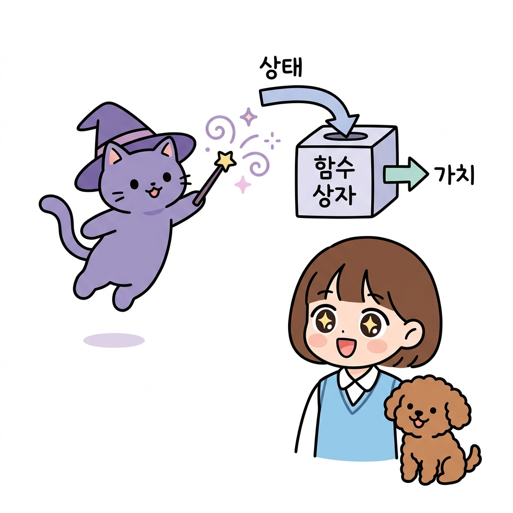
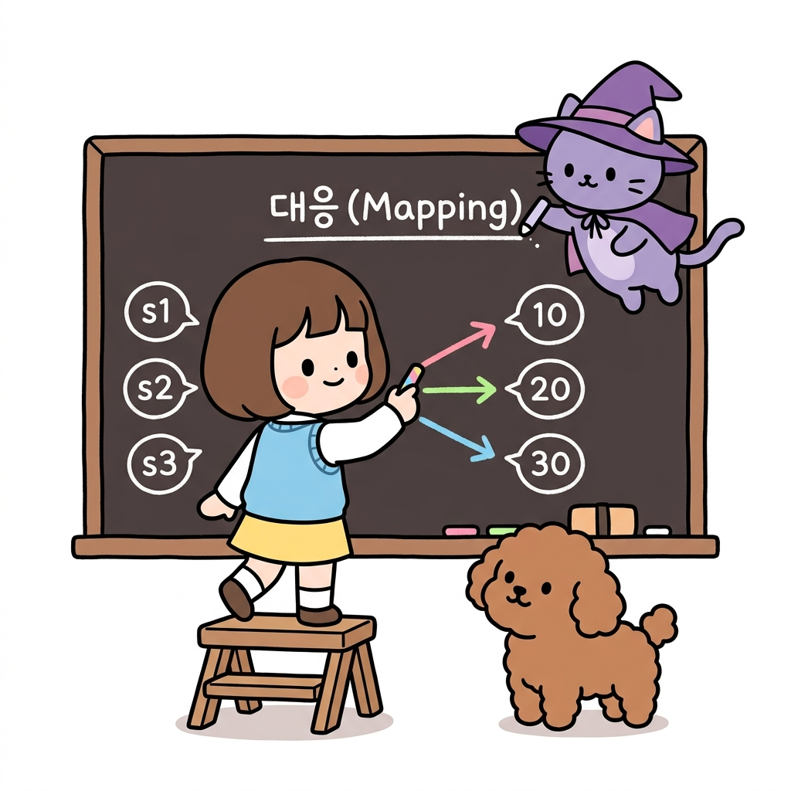
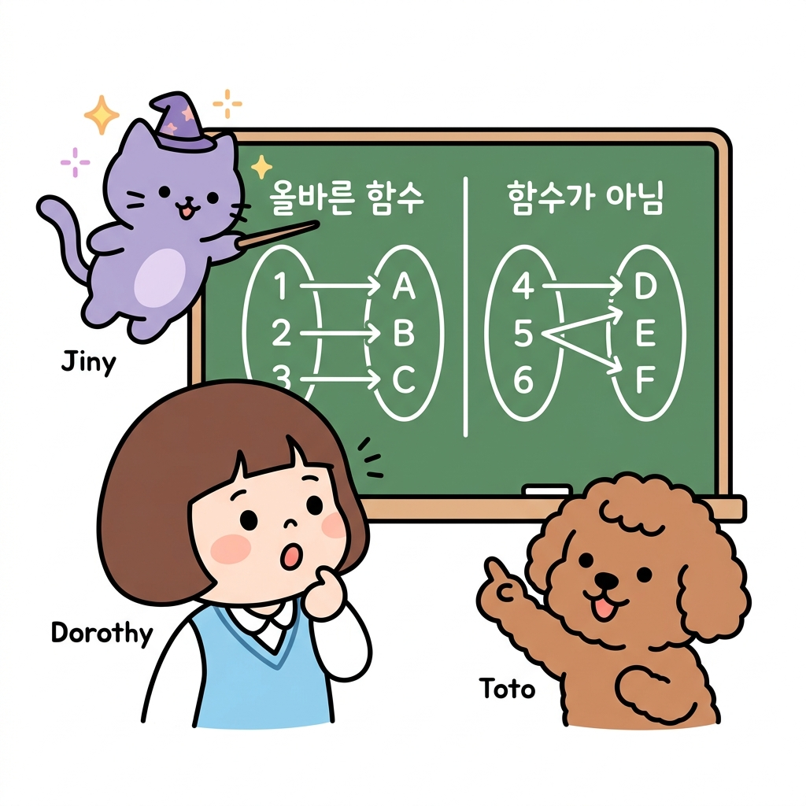
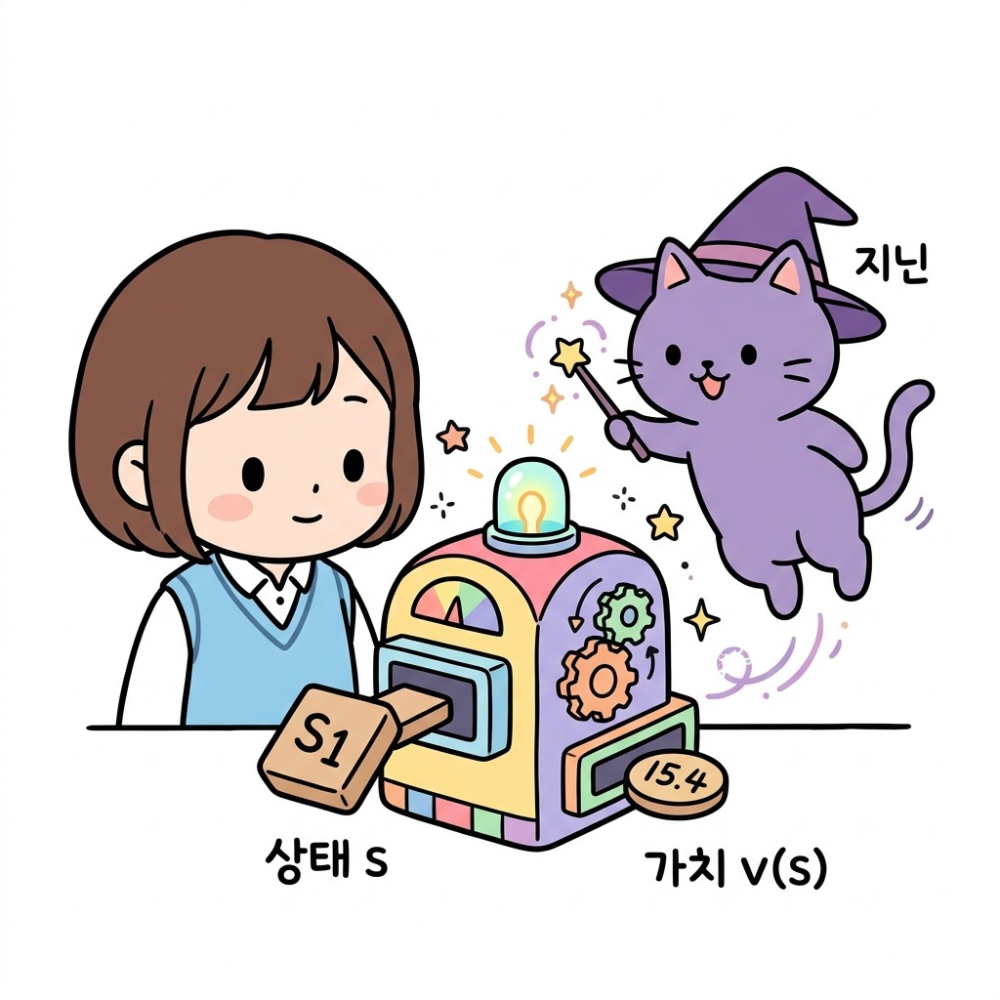
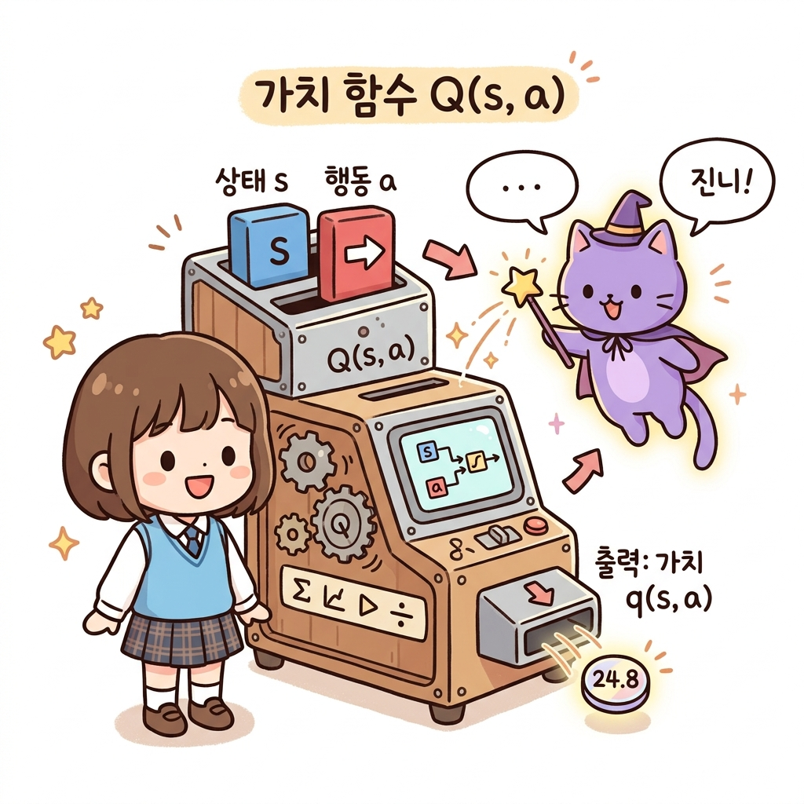
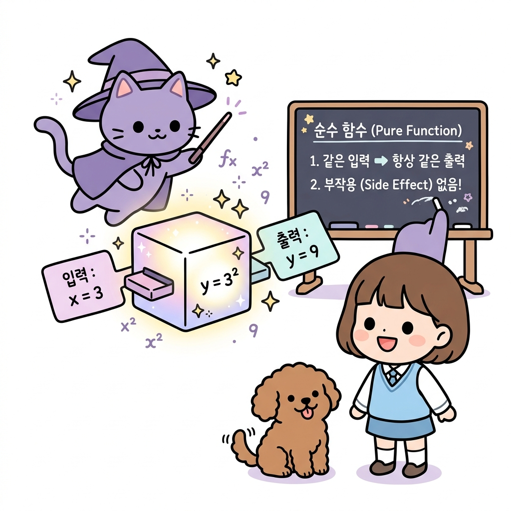
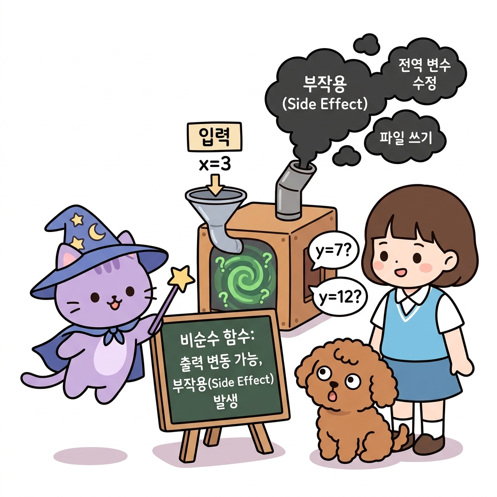
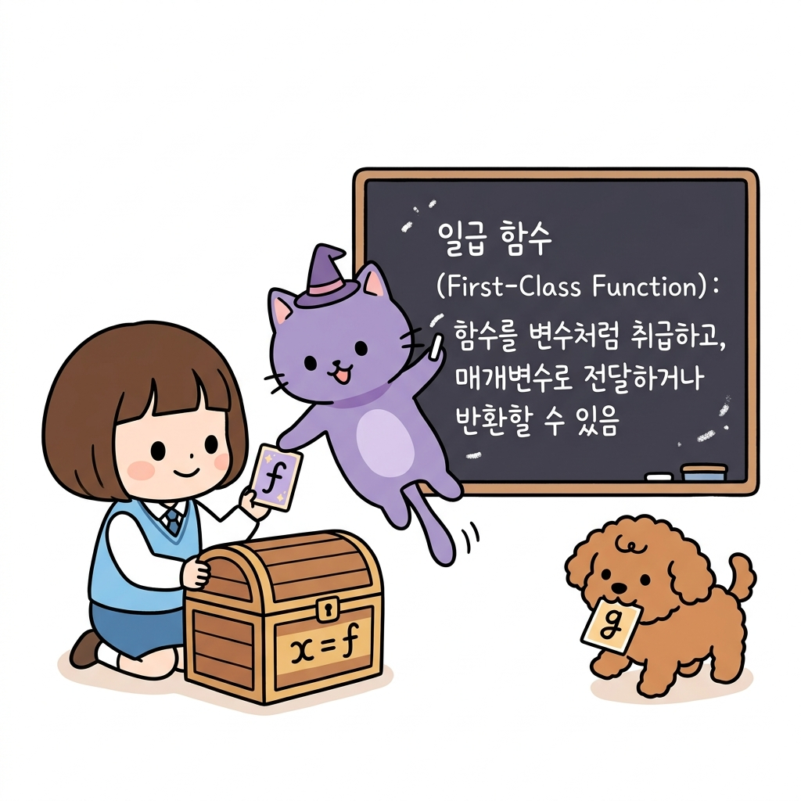
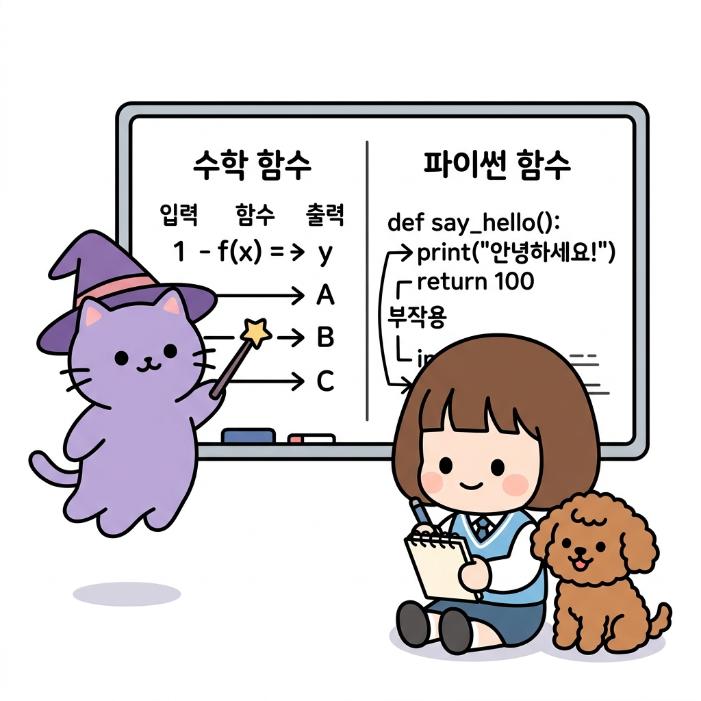

# 02.3 함수의 정의와 대응

> 이 장에서는 입력값과 출력값을 짝지어주는 **함수(Function)**와 **집합/대응**의 수학적 정의를 다루고, 강화학습의 중심 개념인 가치 함수(*v*(*s*))의 본질적 의미와 파이썬 프로그래밍 함수와의 유사성 및 차이점을 배웁니다.

---

## 02.3.1 함수와 대응이란 무엇일까요?

강화학습 책을 읽다 보면 *v*(*s*), *q*(*s*, *a*)처럼 괄호로 둘러싸인 기호들이 쉴 새 없이 나타납니다. 이들은 모두 입력(상태나 행동)을 넣으면 특정 출력(기댓값)을 뱉어내는 **함수**입니다.

"지니! 코딩할 때 `def`로 함수를 정의해서 써보긴 했는데, 수학책에 나오는 함수랑은 뭐가 다르고 왜 강화학습에서 이렇게 중요하게 다뤄지는 거야?"

도로시가 마크다운 노트를 정리하다가 머리를 긁적이며 질문했습니다. 옆에 있던 토토도 고개를 갸웃거렸습니다.

**그림 02-3-1** 파이썬 프로그래밍의 함수 정의(`def`)와 수학적 함수(`y = f(x)`)의 차이점 및 관계에 대해 의문을 가지는 도로시와 토토

그러자 지니가 허공에 요술봉을 흔들며 자상하게 대답했습니다.

"도로시, 아주 예리한 질문이야! 수학에서의 함수는 원래 값을 받아서 다른 값으로 짝짓는 **'마법의 상자'** 같은 개념이란다. 강화학습은 이 수학적 매핑 관계를 프로그래밍으로 영리하게 흉내 내는 과정이지. 내가 마법 상자 하나를 보여줄게."

지니가 칠판에 마법으로 상자 하나를 띄웠습니다.

**그림 02-3-2** 입력으로 '상태'를 넣으면 출력으로 '가치'를 뱉어내는 마법의 함수 상자 원리를 공부하는 지니와 도로시, 토토

"와! 상태를 넣으면 가치 점수가 툭 떨어지네? 정말 마법 상자 같다!"

도로시가 눈을 반짝이며 말했습니다. 지니가 미소를 지으며 설명을 이어갔습니다.

---

## 02.3.2 집합과 대응의 기초

수학적 함수를 더 깊게 이해하기 위해서는 먼저 **집합과 대응**이라는 징검다리를 건너야 합니다. 지니와 도로시가 각각의 개념을 요술 상자와 칠판으로 정리해 나갔습니다.

### 2.3.2.1 집합 (Set)과 원소 (Element)

수학에서 **집합(Set)**은 어떤 조건에 따라 대상을 분명하게 구분하여 모은 **모임 자체**를 가리칩니다. 그리고 그 집합에 포함되는 개개의 구체적인 대상들을 **원소(Element)**라고 부릅니다.

"도로시, 네가 모험할 격자 세상의 모든 방(타일)들을 한 바구니에 담아둔다면 그 바구니가 '상태 집합'이 되고, 그 안에 든 각각의 방 이름들은 '상태 원소'가 된단다!"

지니의 설명에 도로시는 나무 바구니를 가져와 격자판의 타일 블록들을 하나씩 모아 담았습니다.

**그림 02-3-3** 격자 세상의 타일 상태들을 한 바구니에 모아 집합 S = {s1, s2, s3, s4}를 정의하고, 바구니 속에 담긴 개별 블록 원소들을 관찰하는 도로시와 토토

* **수식 표기**: *S* = {*s*1, *s*2, *s*3, *s*4}
* **의미**: 상태 집합 *S*는 원소 *s*1, *s*2, *s*3, *s*4를 가집니다.

---

### 2.3.2.2 대응 (Mapping)

**대응(Mapping)**은 한 집합의 원소들을 다른 집합의 원소들과 **서로 연결하여 짝을 지어주는 약속**이나 **관계**를 의미합니다.

"도로시! 이제 네가 모은 방(상태)들에 어울리는 가치 점수(실수)를 칠판에 적어두고, 서로 선을 그어서 짝을 지어볼래?"

지니의 제안에 도로시는 분필을 들고 칠판 위에서 방 블록과 숫자들을 화살표로 이어보았습니다.

**그림 02-3-4** 상태 집합의 원소들(s1, s2, s3)과 공역의 가치 점수 원소들(10, 20, 30)을 화살표로 연결해 짝짓는 대응(Mapping) 관계를 보여주는 도로시와 토토

* **의미**: 입력의 한 항목(*s*1)에 출력이 될 항목(*10*)을 화살표로 연동하는 **짝짓기 규칙** 자체가 바로 **대응**입니다.

---

### 2.3.2.3 함수 (Function)

**함수(Function)**는 두 집합 *X*, *Y* 사이의 대응 관계 중, 정의역 *X*의 **모든 원소**가 공역 *Y*의 원소에 **오직 하나씩만** 매칭되는 아주 엄격하고 깨끗한 대응을 말합니다.

"도로시, 이 대응 규칙 중에서 만약 어떤 방이 두 개의 가치 점수를 동시에 갖거나(1대 다수 매핑), 아예 가치 점수가 배정되지 않은 방이 있다면 그건 수학적인 함수가 될 수 없어!"

지니가 칠판의 반을 나눠 '올바른 함수'와 '함수가 아닌 것'을 비교해 주었습니다.

**그림 02-3-5** 정의역의 모든 원소가 공역의 단 하나에만 매핑되는 '올바른 함수' 규칙과, 두 개 이상에 대응하거나 짝이 없는 '함수가 아님' 규칙을 구별해 가르치는 지니와 도로시, 토토

* **함수의 성립 요건**:
  1. **정의역의 모든 원소가 참여할 것**: 짝이 없는 외톨이 원소가 없어야 합니다.
  2. **오직 하나만 고를 것**: 하나의 원소가 두 개 이상의 공역 원소로 화살표를 쏠 수 없습니다.

---

## 02.3.3 강화학습에서의 함수 활용

강화학습에서 **의사결정을 돕는 핵심 기능(의사결정 정책과 상태 가치 계산 등)**들은 모두 **수학적 함수** 형태로 체계화되어 있습니다. 에이전트가 환경과 주고받는 모든 신호와 판단은 이 함수들의 끊임없는 호출로 동작합니다.

**그림 02-3-6** 에이전트와 환경 사이에서 가치와 정책을 계산해내며 상호작용의 뼈대를 이루는 강화학습의 수학적 함수 구조를 확인하는 도로시와 토토

---

### 2.3.3.1 상태 가치 함수 *v*(*s*)

**상태 가치 함수(State-Value Function)**는 에이전트가 현재 놓여 있는 상태 *s*가 얼마나 좋은 상태인지를 평가하여 숫자로 알려주는 함수입니다.

* **정의역 (입력 집합)**: 에이전트가 위치할 수 있는 모든 상태들의 집합 *S*
* **공역 (출력 집합)**: 실수 전체의 집합 ℝ
* *v*(*s*)는 특정 상태 *s*를 입력으로 넣으면, 그 상태에서 앞으로 얻을 것으로 예상되는 보상의 합산(실수 값)을 뱉어내는 함수입니다. (예: *v*(*s*1) = 15.4)

**그림 02-3-7** 단일 상태(s1)를 입력받아 그 상태의 종합 예상 점수인 가치값 v(s) = 15.4를 계산하여 동전으로 돌려주는 상태 가치 함수 magic machine

---

### 2.3.3.2 행동 가치 함수 *q*(*s*, *a*)

**행동 가치 함수(Action-Value Function)**는 어떤 상태 *s*에서 특정 행동 *a*를 취하는 것이 얼마나 가치 있는 일인지를 정밀하게 점수 매기는 함수입니다.

* **정의역 (입력 집합)**: 상태 *s*와 행동 *a*의 순서쌍 집합 *S* × *A*
* **공역 (출력 집합)**: 실수 전체의 집합 ℝ
* 현재 상태 *s*에서 어떤 행동 *a*(예: 위로 가기, 오른쪽으로 가기 등)를 취했을 때의 종합적인 미래 가치 값을 평가하여 돌려줍니다.

**그림 02-3-8** 상태(s)와 행동(a)의 순서쌍을 복합 입력으로 받아 그에 해당하는 예상 행동 가치 q(s, a) = 24.8을 산출해 출력하는 행동 가치 함수 q-machine

---

"음, 상태 가치 상자(v)는 내가 어떤 방(상태)에 있는지만 보면 되는데, 행동 가치 상자(q)는 '어떤 방에 있는지(상태)'와 '거기서 어디로 갈지(행동)'의 2개 카드를 둘 다 집어넣어야 출력이 나오네!"

도로시가 두 개의 마법 상자를 유심히 비교하며 중얼거렸습니다. 옆에서 꼬리를 흔들던 토토도 고개를 크게 끄덕였습니다.

**그림 02-3-9** 상태 단일 카드만 필요로 하는 v(s) 함수 상자와 상태 및 행동 2개 카드를 함께 삽입해야 하는 q(s, a) 함수 상자의 본질적 입력 구조 차이를 깨닫고 기뻐하는 도로시와 토토

---

### 2.3.3.3 강화학습에서 함수로 포장해 사용하는 이유

"지니! 그런데 강화학습 개념들을 왜 굳이 '함수'라는 마법의 상자로 꽁꽁 싸서 사용하는 거야? 그냥 상태마다 가치 점수를 적어둔 커다란 표(Table)를 만들어서 확인하면 더 직관적이고 편하지 않아?"

도로시가 큰 장부를 가리키며 묻자, 지니가 요술봉으로 칠판을 가리켰습니다.

"도로시! 아주 중요한 질문이야. 만약 우리가 바둑판처럼 상태 개수가 10개, 20개 수준이 아니라, 바둑(10170개 상태)이나 자율주행 도로 상황처럼 무한에 가까운 상태를 다뤄야 한다면 어떻게 될까? 그걸 표로 다 기록하는 것은 컴퓨터 메모리 한계상 불가능하단다. 

하지만 가치를 계산해주는 **'함수'**를 하나 만들어두면, 거대한 표를 일일이 저장할 필요 없이 입력에 대해 그때그때 값을 계산(함수 근사, Function Approximation)하여 효율적으로 대처할 수 있어! 또한 미분이나 경사하강법 같은 수학적 도구를 활용해 함수 상자의 성능을 더 똑똑하게 최적화하기도 아주 좋단다."

**그림 02-3-10** 모든 경우의 수를 표에 다 기록해야 하는 방대한 테이블 방식의 한계를 깨뜨리고, 복잡한 상태 공간을 하나의 유연한 함수식으로 압축하여 근사 연산하는 이유를 확인하는 지니와 도로시, 토토

---

## 02.3.4 수학적 함수와 프로그래밍 함수의 비교

"지니! 그런데 파이썬에서 함수를 정의해 사용할 때도 결국 입력(매개변수)을 받아서 내부 로직으로 처리한 다음, 특정 출력(`return` 값)을 결과물로 짝지어주는 대응 관계를 만드는 거잖아? 그렇게 생각하면 프로그래밍의 함수와 수학적 함수는 근본적으로 같은 개념 아닐까?"

도로시가 고개를 갸웃하며 예리하게 핵심을 지적했습니다. 옆에 있던 토토도 고개를 크게 끄덕였습니다.

**그림 02-3-11** 입력과 로직 처리, 출력을 연결하는 프로그래밍 함수 구조와 수학적 대응(Mapping) 관계의 본질적 연결을 질문하는 도로시와 토토

지니가 기쁘게 고개를 끄덕이며 칠판에 필기를 이어갔습니다.

"와, 도로시! 정말 대단한 통찰력이야. 네 말대로 프로그래밍의 함수도 수학적 함수처럼 **'입력에 따른 출력값의 대응 관계'**라는 핵심 철학을 완벽하게 담고 있단다. 프로그래밍에서 함수가 단순히 코드 묶음으로 실행되는 수준을 넘어, 입력값을 특정한 로직으로 처리한 뒤 하나의 출력값으로 엄격하게 대응하는 본질적 매핑 관계이기 때문이지! 

다만, 프로그래밍에서는 컴퓨터 환경의 한계나 자유도 때문에 이 대응 관계를 보장하는 방식에 따라 **순수 함수(Pure Function)**와 **비순수 함수(Impure Function)**로 세분화하여 구현할 수 있어."

#### 2.3.4.1 순수 함수 (Pure Function)
수학적 함수의 일대일 결정적 대응 원칙을 완벽하게 구현한 프로그래밍 함수입니다. 외부 상태를 절대로 오염시키지 않는 부작용(Side Effect) 제로 상태를 만족하며, 오직 입력값에만 의존하여 언제나 동일한 출력값을 뱉어냅니다(결정성).

**그림 02-3-12** 입력 x=3에 대해 외부 상태 변경(부작용) 없이 항상 일관된 출력 y=9를 약속하는 수학적 함수와 동일한 성질의 순수 함수

#### 2.3.4.2 비순수 함수 (Impure Function)
수학적 함수의 엄격한 일대일 대응 조건에서 벗어난 기능을 포함할 수 있는 프로그래밍 함수입니다. 내부에서 무작위 난수(`random`)를 불러오거나 전역 변수, 파일 입출력을 활용하여 입력이 같아도 결과가 바뀔 수 있으며, 연산 과정에서 시스템의 상태를 변경시키는 부작용(Side Effect)을 동반하기도 합니다.

**그림 02-3-13** 동일한 입력 x=3을 넣어도 실행 시점의 환경에 따라 출력 결과가 요동치고, 전역 변수 수정이나 파일 저장 등의 부작용을 유발하는 비순수 함수

---

#### 2.3.4.3 재미있는 상식: 일급 함수 (First-Class Function)는 어디에 속할까요?

"지니! 코딩 공부를 하다 보니까 함수를 변수나 값처럼 다루는 **'일급 함수(First-Class Function)'**라는 용어도 자주 접했어. 이건 순수 함수와 비순수 함수 중 어디에 속하는 거야? 수학에서는 이런 개념이 따로 없는지 궁금해!"

도로시의 심도 깊은 질문에 지니가 요술봉으로 함수 카드를 소환하여 보물 상자에 넣어 보였습니다.

"도로시! 결론부터 말하자면, **일급 함수는 순수/비순수 여부와는 관계없는 '프로그래밍 언어의 설계 특징'**이란다. 즉, 언어가 함수를 일반적인 값(정수, 실수 등)과 동등한 자격으로 대우해 주느냐를 뜻하지. 일급 함수 권한이 있는 언어에서는 함수를 변수에 대입하거나, 다른 함수의 매개변수(인자)로 전달하고, 함수를 리턴값으로 돌려받을 수 있어!"

**그림 02-3-14** 함수 카드(f)를 값처럼 변수 보물상자(x = f)에 대입하여 자유롭게 주고받을 수 있는 일급 함수(First-Class Function) 개념을 배우는 도로시와 지니, 토토

"아! 수학에서도 함수들을 모아 집합(함수 공간)을 만들고, 그 함수 자체를 정의역의 원소로 입력받아 미분해서 새로운 도함수를 내놓는 연산자(Operator)나 고차 함수들이 있잖아! 그럼 프로그래밍의 일급 함수는 수학의 **'함수들의 집합'**과 **'함수를 처리하는 고차 연산자'** 개념을 코드로 실현해 낸 거네?"

"완벽해, 도로시! 강화학습 코드를 짤 때 정책 함수 `pi(a|s)` 자체를 업데이트나 가치 평가를 수행하는 고차 함수에 매개변수로 휙 넘겨서 유연하게 튜닝할 수 있는 것도 바로 파이썬이 일급 함수 기능을 완벽히 지원하기 때문이란다."

지니가 정리해 준 수학적 함수(순수 함수)와 프로그래밍의 일반적인 비순수 함수의 최종 비교 일러스트 및 비교표는 다음과 같습니다.

**그림 02-3-15** 항상 일관된 결과를 보장하는 수학적 함수(순수 함수)와 실행 방식이나 시스템 상태에 따라 다르게 대응될 수 있는 비순수 파이썬 함수의 차이를 정리하는 지니와 도로시, 토토

| 비교 항목 | 수학적 함수 (*f*(*x*)) 및 순수 함수 | 프로그래밍의 일반적인 비순수 함수 |
| :--- | :--- | :--- |
| **개념적 본질** | 입력값과 출력값 사이의 **결정적 대응 관계** | 명령어나 실행 로직의 흐름을 묶은 **실행 단위** |
| **결정성 (Determinism)** | **항상 결정적**: 동일한 입력 *x*에 대해서는 언제나 예외 없이 동일한 출력 *f*(*x*)를 반환함. | **비결정적일 수 있음**: 시스템 시간, 무작위 난수, 외부 파일 내용에 따라 결과가 매번 달라질 수 있음. |
| **부작용 (Side Effects)** | **부작용 절대 없음**: 식의 연산일 뿐, 외부 상태나 다른 메모리 값을 절대로 오염시키거나 변경하지 않음. | **부작용 발생 가능**: 화면 출력(`print`), 파일 쓰기, 데이터베이스 수정, 전역 변수 값 변경 등 시스템을 변화시킴. |
| **상태 보존 (Stateful)** | 과거에 함수를 몇 번 호출되었는지 등의 상태 정보를 전혀 저장하지 않음. | 정적 변수나 클래스 변수 등을 사용하여 과거 호출 이력을 내부에 저장하고 활용할 수 있음. |

"결국 강화학습 가치 함수를 파이썬 코드로 구현할 때도, 최대한 입력 상태값에 따라 한결같은 가치를 정확하게 대응하여 출력하는 '순수 함수'처럼 동작하도록 코드를 설계해야 예측이 꼬이지 않겠네!"

"바로 그렇단다, 도로시! 아주 훌륭하게 정리했어."

---

## 02.3.5 실전 예제

학습한 내용을 이용하여 몇가지 문제를 풀어 보도록 합니다.

### 문제 1 (함수의 대응 판별)
다음 상태 공간 *S* = {*s*1, *s*2} 와 가치 공역 *Y* = {10, 20, 30} 사이의 대응 관계 중 수학적 함수로 올바른 관계를 고르고 그 이유를 서술하시오.

> - **관계 A**: *s*1은 10에 대응하고, *s*2는 20과 30에 동시에 대응한다.
> - **관계 B**: *s*1은 10에 대응하고, *s*2는 20에 대응한다.
> 
>**풀이**:
> - **관계 A**는 정의역의 원소 *s*2가 공역의 두 원소(20, 30)에 동시에 대응하므로 함수의 정의인 "오직 하나씩만 대응한다"에 모순되어 함수가 아닙니다.
> - **관계 B**는 정의역의 모든 원소(*s*1, *s*2)가 공역의 원소에 각각 정확히 하나씩 대응하므로 올바른 함수입니다.
> 
>**정답**: 관계 B

---

## 02.3.6 핵심 요약

1. **함수**는 한 집합(정의역)의 모든 원소가 다른 집합(공역)의 원소에 오직 하나씩 매칭되는 대응 규칙을 뜻한다.
2. 강화학습의 **가치 함수** *v*(*s*)는 격자판 상태 집합의 각 타일들을 실수 수치(예측 보상)로 짝지어주는 수학적 대응 상자이다.
3. **수학 함수**는 부작용이 없고 언제나 결정적이지만, **프로그래밍 함수**는 상태를 보존하고 출력의 무작위성이나 시스템 값 변경(부작용)을 동반할 수 있는 실제 실행 명령 단위라는 결정적 차이가 있다.
