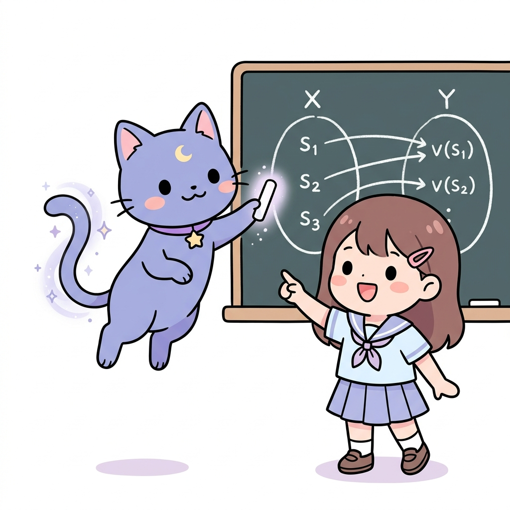
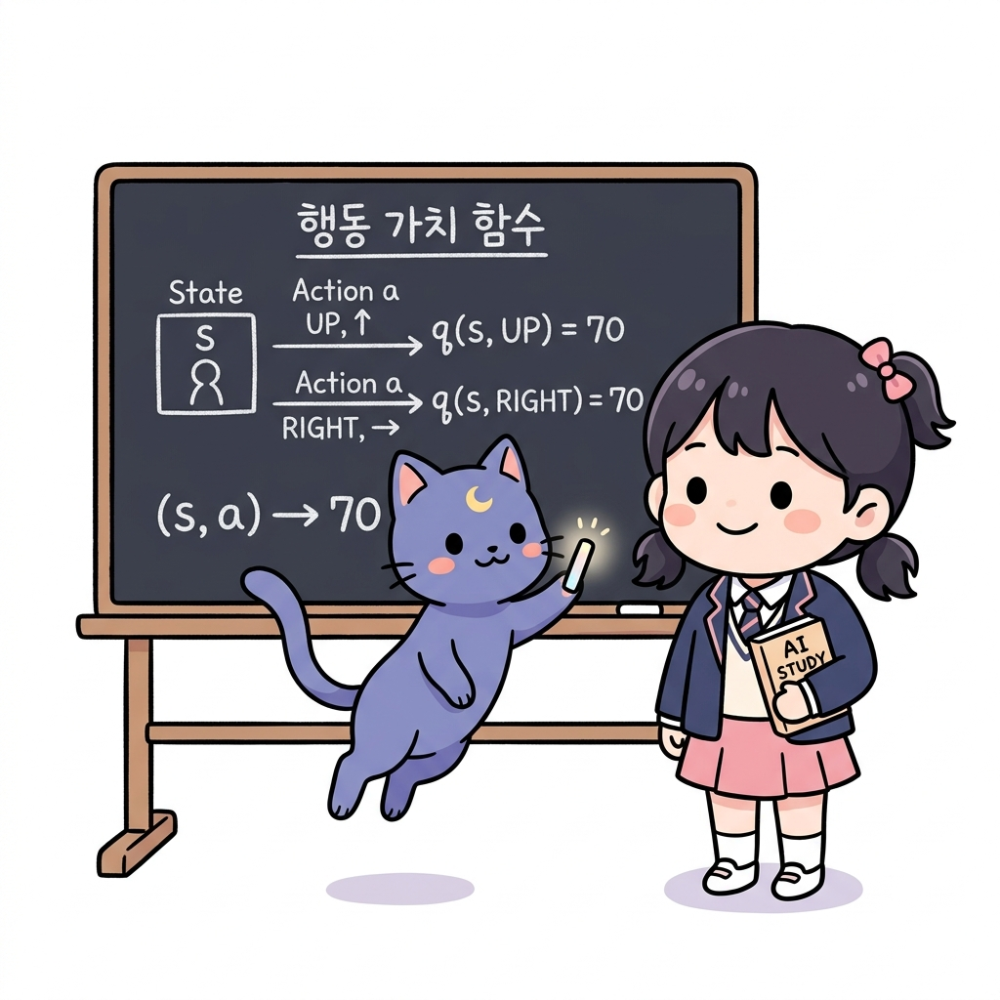
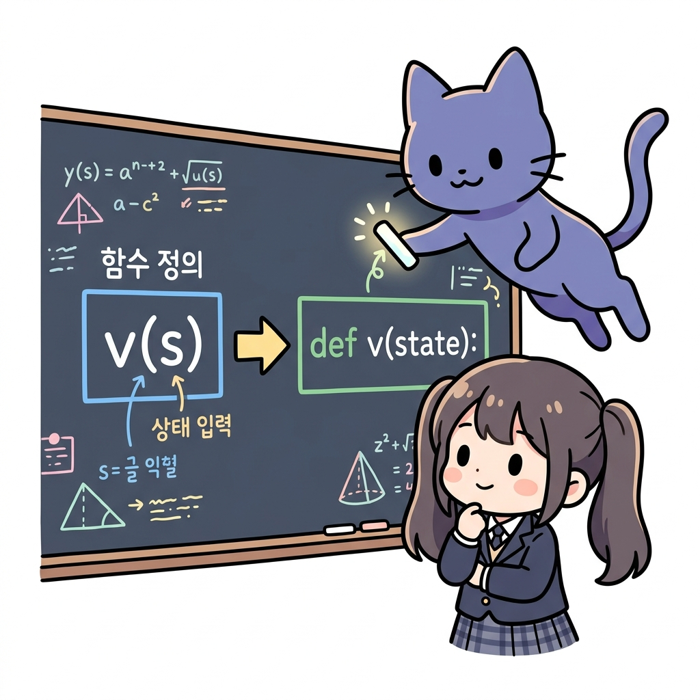

# 02.3 함수의 정의와 대응

> 이 장에서는 입력값과 출력값을 짝지어주는 **함수(Function)**와 **집합/대응**의 수학적 정의를 다루고, 강화학습의 중심 개념인 가치 함수(*v*(*s*))의 본질적 의미와 파이썬 프로그래밍 함수와의 유사성 및 차이점을 배웁니다.

---

## 02.3.1 상태를 값으로 연결하는 마법의 상자

강화학습 책을 읽다 보면 *v*(*s*), *q*(*s*, *a*)처럼 괄호로 둘러싸인 기호들이 쉴 새 없이 나타납니다. 이들은 모두 입력(상태나 행동)을 넣으면 특정 출력(기댓값)을 뱉어내는 **함수**입니다. 

**그림 02-3-1** 격자 세상의 상태 집합 X가 숫자 가치 집합 Y로 하나씩 짝지어져 대응하는 과정을 칠판에 그려주는 지니와 도로시

지니의 마법 대응 칠판을 보며, 수학의 함수와 컴퓨터 프로그래밍 함수가 어떻게 닮았고 또 무엇이 다른지 그 비밀을 명쾌하게 파헤쳐봅시다!

---

### 1. 학습 목표
- 집합(Set)과 원소의 개념을 이해하고, 두 집합 사이의 대응(Mapping) 관계를 안다.
- 수학적 함수의 정의인 "정의역의 각 원소가 공역의 단 하나의 원소에 대응한다"를 설명할 수 있다.
- 강화학습의 가치 함수 *v*(*s*)가 상태 공간과 실수 집합 사이의 함수 관계임을 이해한다.
- 수학에서의 함수와 프로그래밍(파이썬) 함수 간의 공통점과 결정적인 차이점을 비교 설명할 수 있다.

---

### 2. 핵심 개념

#### (1) 집합과 대응으로 이해하는 함수
- **집합 (Set)**: 어떤 조건에 따라 대상을 분명하게 모은 것이며, 그 대상 하나하나를 **원소 (Element)**라고 합니다.
  - *예시*: 격자 세상의 모든 타일들의 모임은 상태 집합 *S* = {*s*1, *s*2, *s*3} 가 됩니다.
- **대응 (Mapping)**: 집합 *X*의 원소와 집합 *Y*의 원소를 서로 짝을 지어주는 관계입니다.
- **함수 (Function)**: 집합 *X*의 **모든 원소**가 집합 *Y*의 원소에 **오직 하나씩만** 대응할 때, 이 대응 관계를 집합 *X*에서 집합 *Y*로의 함수(즉, *f* : *X* ➔ *Y*)라고 부릅니다.
  - 이따금 함수를 어떤 값을 넣으면 변형된 값을 뱉어내는 **'상자(Box)'**에 비유하기도 합니다.

**그림 02-3-2** 여러 입력을 상자에 넣었을 때 정의된 대응에 의해 각각 하나의 값만 뱉어내는 함수의 매직 박스 구조

#### (2) 강화학습 속의 함수
- **상태 가치 함수 *v*(*s*)**:
  - **정의역(입력 집합)**: 에이전트가 위치할 수 있는 모든 상태들의 집합 *S*
  - **공역(출력 집합)**: 실수 전체의 집합 ℝ
  - *v*(*s*)는 특정 상태 *s*를 집합 *S*에서 하나 뽑아서 상자에 넣으면, 그 상태의 예상 보상 합산(실수 값)을 뱉어내는 수학적 함수입니다. (예: *v*(*s*1) = 15.4)

**그림 02-3-3** 하나의 상태 s가 주어졌을 때 그 상태의 종합적인 가치(숫자)를 일대일로 짝짓는 상태 가치 함수

- **행동 가치 함수 *q*(*s*, *a*)**:
  - 정의역이 상태 *s*와 행동 *a*의 순서쌍 집합인 함수입니다. 상태와 행동을 동시에 입력으로 받아 가치 값을 뱉어냅니다.

**그림 02-3-4** 현재 위치한 상태 s에서 취할 수 있는 다양한 행동 a(위, 오른쪽 등) 각각에 대해 가치 값을 대수적으로 평가하는 행동 가치 함수

#### (3) 수학적 함수 vs 프로그래밍(파이썬) 함수의 비교
컴퓨터 언어에서도 `def value_function(state):`와 같은 형태로 함수를 선언해 사용합니다. 둘은 매우 유사하지만 아주 중요한 차이점들이 존재합니다.

| 비교 항목 | 수학적 함수 (*f*(*x*)) | 프로그래밍 함수 (`def func(x)`) |
| :--- | :--- | :--- |
| **공통점** | 입력을 받아 정의된 규칙에 따라 처리하여 출력(반환값)을 제공함. | 입력을 매개변수(Parameter)로 받아 실행 후 결과를 `return`함. |
| **결정성 (Determinism)** | **항상 결정적**: 동일한 입력 *x*에 대해서는 언제나 예외 없이 동일한 출력 *f*(*x*)를 얻음. | **비결정적일 수 있음**: 내부에서 무작위성(`random`), 전역 변수, 파일 읽기 등을 사용하면 매번 출력이 다를 수 있음. |
| **부작용 (Side Effects)** | **부작용 없음**: 식의 연산일 뿐, 우주의 상태나 다른 변수의 값을 수정하지 않음. | **부작용 발생 가능**: 화면 출력(`print`), 데이터베이스 저장, 전역 변수 값 변경 등 시스템 상태를 변화시킬 수 있음. |
| **상태 보존 (Stateful)** | 과거에 함수를 몇 번 호출했는지 등의 상태 정보를 보존하지 않음. | 클래스 멤버 변수나 정적 변수를 이용해 과거 호출 이력을 누적 기억할 수 있음. |

> **💡 요약하자면**
> 수학의 함수는 완벽히 고정된 매핑 관계(대응표)를 나타내지만, 파이썬의 함수는 기계가 수행해야 할 동작 명령의 묶음입니다. 강화학습을 구현할 때는 이 둘의 차이를 이해하고, 비결정적인 환경의 데이터를 수집하여 완벽한 수학적 함수 *v*(*s*)를 근사하도록 코드를 설계해야 합니다.

---

### 3. 시각 자료: 가치 함수의 파이썬 구현 매칭도

**그림 02-3-5** 수학적인 상태 가치 대응 관계 v(s)를 파이썬의 사전(Dict)이나 테이블 조회 함수로 모사하여 연산하는 구조 매칭

---

### 4. 실전 예제

#### 예제 1 (함수의 대응 판별)
> **문제**: 다음 상태 공간 *S* = {*s*1, *s*2} 와 가치 공역 *Y* = {10, 20, 30} 사이의 대응 관계 중 수학적 함수로 올바른 관계를 고르고 그 이유를 서술하시오.
> - **관계 A**: *s*1은 10에 대응하고, *s*2는 20과 30에 동시에 대응한다.
> - **관계 B**: *s*1은 10에 대응하고, *s*2는 20에 대응한다.
>
> **풀이**:
> - **관계 A**는 정의역의 원소 *s*2가 공역의 두 원소(20, 30)에 동시에 대응하므로 함수의 정의인 "오직 하나씩만 대응한다"에 모순되어 함수가 아닙니다.
> - **관계 B**는 정의역의 모든 원소(*s*1, *s*2)가 공역의 원소에 각각 정확히 하나씩 대응하므로 올바른 함수입니다.
> **정답**: 관계 B

---

### 5. 핵심 요약
1. **함수**는 한 집합(정의역)의 모든 원소가 다른 집합(공역)의 원소에 오직 하나씩 매칭되는 대응 규칙을 뜻한다.
2. 강화학습의 **가치 함수** *v*(*s*)는 격자판 상태 집합의 각 타일들을 실수 수치(예측 보상)로 짝지어주는 수학적 대응 상자이다.
3. **수학 함수**는 부작용이 없고 언제나 결정적이지만, **프로그래밍 함수**는 상태를 보존하고 출력의 무작위성이나 시스템 값 변경(부작용)을 동반할 수 있는 실제 실행 명령 단위라는 결정적 차이가 있다.
