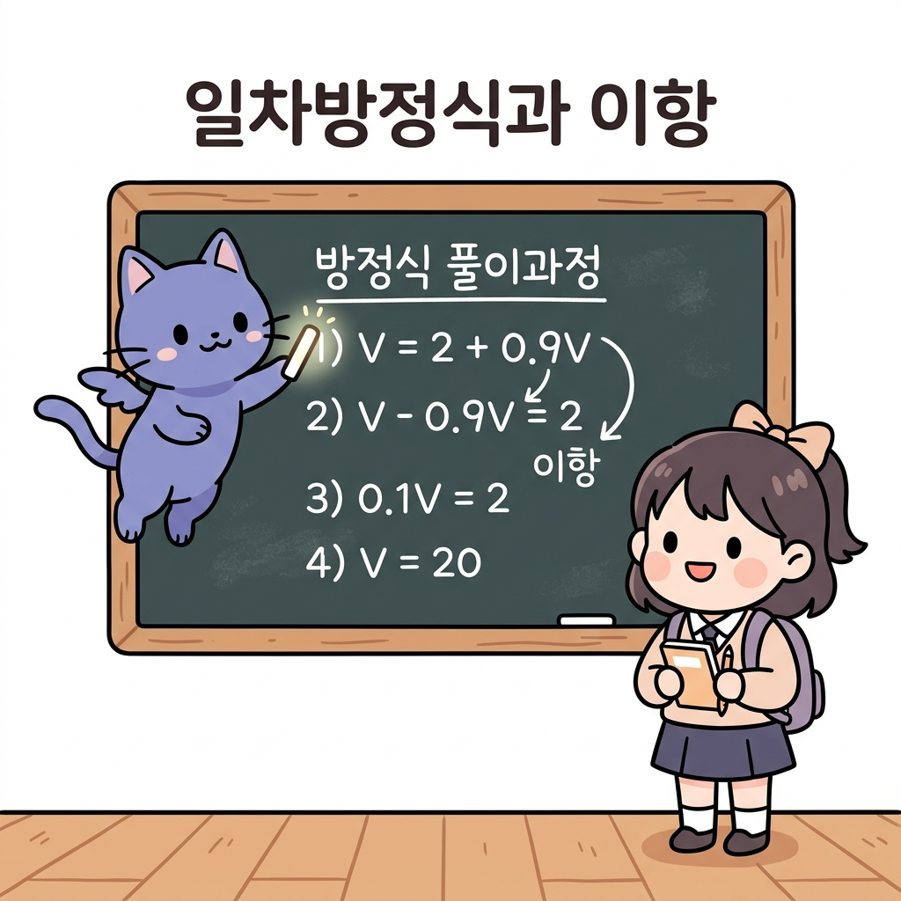
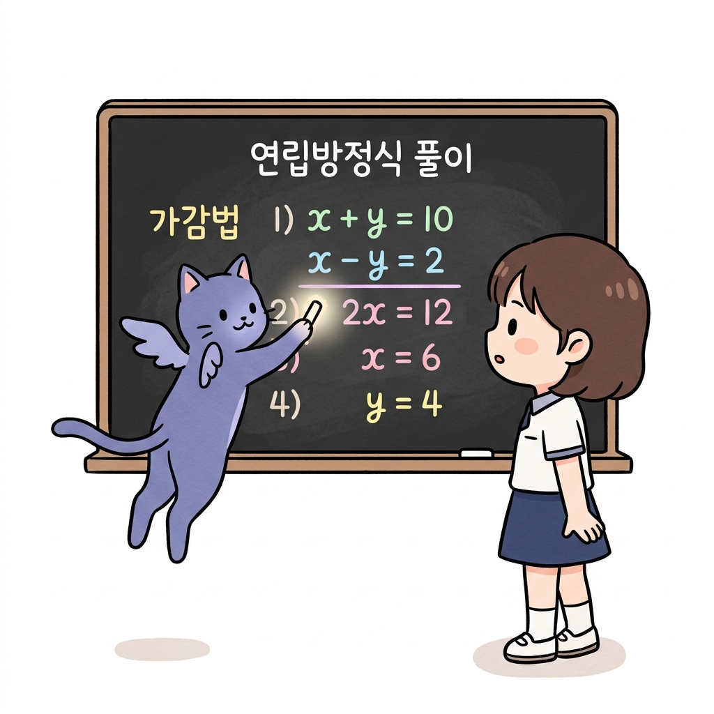
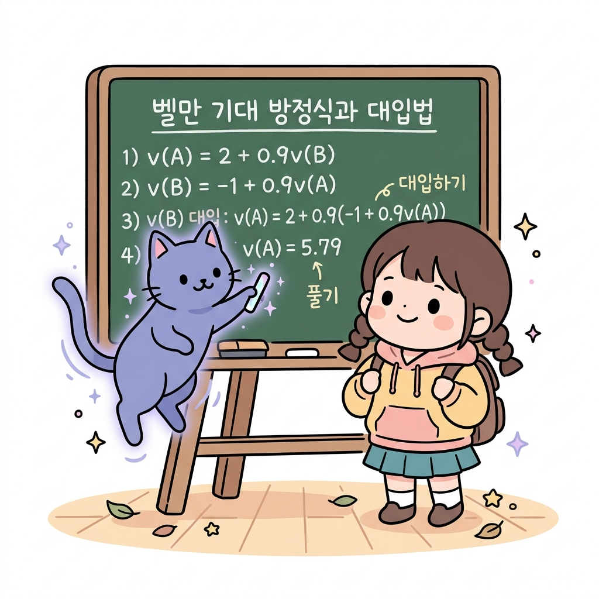
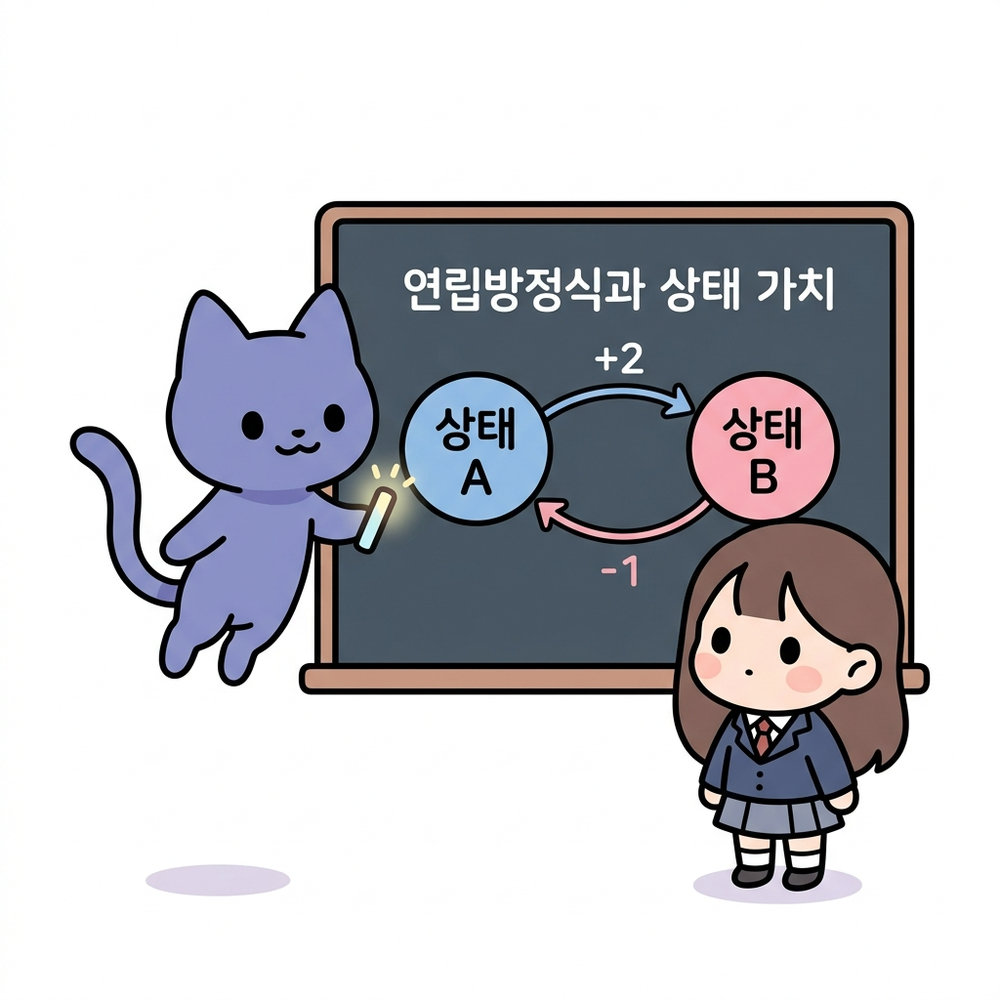

# 02.4 일차방정식과 연립방정식

> 이 장에서는 미지수 *x*, *y*를 포함한 **일차방정식과 연립방정식**의 개념 및 풀이법을 복습하고, 격자 세상 속 여러 상태들의 가치 함수가 서로 얽혀 있을 때 이를 방정식 연립을 통해 구해내는 실전 원리를 배웁니다.

---

## 02.4.1 얽히고설킨 단서들을 풀어내는 방정식의 열쇠

**그림 02-4-1** 두 미지수 x, y가 적힌 양팔저울의 균형을 맞추며 가감법과 대입법으로 해를 구하는 법을 유쾌하게 가르쳐주는 지니와 도로시

강화학습의 상태 가치들은 독립적으로 고정되어 있지 않고, "내 상태의 가치는 이웃한 다음 상태들의 가치와 보상의 가중합"이라는 상호 얽힌 관계를 이룹니다. 이 얽힌 가치들을 하나씩 풀어 참값을 얻기 위해서는 **연립방정식**이라는 비밀 열쇠가 필요합니다. 지니의 요술 칠판 유도를 보며 이 수학적 해결 도구를 마스터해봅시다!

---

### 1. 학습 목표
- 등식의 성질과 이항(Transposition)을 이해하고 일차방정식을 풀 수 있다.
- 미지수가 2개인 연립일차방정식의 개념을 알고, 가감법과 대입법으로 해를 계산한다.
- 서로 연결된 격자 세상 상태들의 가치 함수 관계를 연립방정식으로 세워 직접 해를 풀어낸다.

---

### 2. 핵심 개념

#### (1) 일차방정식과 이항 (Linear Equations and Transposition)
미지수 *x*의 차수가 1인 방정식을 일차방정식이라고 하며, 등식의 양변에 같은 수를 더하거나 빼거나 곱하거나 나누어도 등식이 성립한다는 성질을 이용해 풉니다.
- **이항**: 등식의 한 변에 있는 항을 부호를 바꾸어 다른 변으로 옮기는 것입니다.
  *V* = 2 + 0.9 *V*
  ➔ *V* - 0.9 *V* = 2 (0.9*V*를 좌변으로 이항)
  ➔ (1 - 0.9) *V* = 2 (분배법칙 묶기)
  ➔ 0.1 *V* = 2
  ➔ *V* = 2 / 0.1 = 20

**그림 02-4-2** 등식의 성질을 이용하여 항을 다른 변으로 옮기는 이항 과정 및 가치 함수 수식 해 구하기

#### (2) 연립방정식 (System of Linear Equations)
미지수가 2개인 일차방정식 2개를 한 쌍으로 묶어 놓은 것으로, 공통으로 만족하는 해를 구합니다.
- **가감법**: 두 식을 더하거나 빼서 미지수 하나를 소거하여 푸는 방법입니다.
- **대입법**: 한 식을 다른 미지수에 대한 식으로 정리한 뒤, 그것을 다른 식에 대입하여 푸는 방법입니다.
  - *예시*:
    ① *x* + *y* = 10
    ② *x* - *y* = 2
    - ①과 ②를 더하면: 2*x* = 12 ➔ *x* = 6
    - *x* = 6을 ①에 대입하면: 6 + *y* = 10 ➔ *y* = 4

**그림 02-4-3** 미지수가 2개인 연립방정식을 가감법(소거법)을 활용하여 순차적으로 푸는 과정

---

#### (3) 벨만 기대 방정식의 연립방정식적 실체
격자 세상(Grid World)에 오직 두 개의 상태 *A*와 *B*만 존재하고, 할인율 *γ* = 0.9 이며, 보상 및 상태 이동 규칙이 다음과 같다고 해봅시다.
- 상태 *A*에서 다음 상태는 항상 *B*이고 이때 받는 보상은 2입니다:
  *v*(*A*) = 2 + 0.9 * *v*(*B*)  ... ①
- 상태 *B*에서 다음 상태는 항상 *A*이고 이때 받는 보상은 -1입니다:
  *v*(*B*) = -1 + 0.9 * *v*(*A*) ... ②
  이 두 식은 정확히 미지수가 *v*(*A*), *v*(*B*) 2개인 **연립방정식**입니다!
- **풀어보기**: ②를 ①에 대입(대입법)합니다.
  *v*(*A*) = 2 + 0.9 * [ -1 + 0.9 * *v*(*A*) ]
  *v*(*A*) = 2 - 0.9 + 0.81 * *v*(*A*)
  *v*(*A*) = 1.1 + 0.81 * *v*(*A*)
  *v*(*A*) - 0.81 * *v*(*A*) = 1.1 (이항)
  0.19 * *v*(*A*) = 1.1
  *v*(*A*) = 1.1 / 0.19 = 약 5.79
- 얻은 값을 ②에 대입하여 *v*(*B*)를 구합니다:
  *v*(*B*) = -1 + 0.9 * 5.79 = -1 + 5.21 = 4.21

**그림 02-4-4** 벨만 기대 방정식 관계식을 대입법을 활용하여 상태 가치 수치로 푸는 대수적 연대 과정

이처럼 연립방정식을 풀면 얽혀 있는 격자 세상의 모든 상태 가치들의 참값을 정확하게 구출해낼 수 있습니다!

---

### 3. 시각 자료: 2개 상태 가치 연립방정식 전개 관계도

**그림 02-4-5** 서로 다음 상태의 가치를 상속받으며 2원 연립방정식을 형성하는 상태 가치 전이 시스템

---

### 4. 실전 예제

#### 예제 1 (가치 연립방정식 풀이)
> **문제**: 다음 연립방정식을 만족하는 *v*(*s*1)과 *v*(*s*2)의 해를 구하시오. (단, 소수 첫째자리까지 반올림하여 구할 것)
> ① *v*(*s*1) = 1 + 0.5 * *v*(*s*2)
> ② *v*(*s*2) = 4 + 0.5 * *v*(*s*1)
>
> **풀이**:
> ②를 ①에 대입합니다:
> *v*(*s*1) = 1 + 0.5 * [ 4 + 0.5 * *v*(*s*1) ]
> *v*(*s*1) = 1 + 2 + 0.25 * *v*(*s*1)
> *v*(*s*1) = 3 + 0.25 * *v*(*s*1)
> *v*(*s*1) - 0.25 * *v*(*s*1) = 3 (이항)
> 0.75 * *v*(*s*1) = 3
> *v*(*s*1) = 3 / 0.75 = 4
>
> 구해진 *v*(*s*1) = 4 를 ②에 대입합니다:
> *v*(*s*2) = 4 + 0.5 * 4 = 4 + 2 = 6
> **정답**: *v*(*s*1) = 4, *v*(*s*2) = 6

---

### 5. 핵심 요약
1. **일차방정식**은 미지수가 들어있는 식을 이항과 등식의 성질을 통해 미지수의 값을 도출해내는 해결 도구이다.
2. 여러 상태 가치들이 순환적으로 서로에게 영향을 주는 시스템은 여러 개의 식으로 구성된 **연립방정식** 형태로 모델링된다.
3. 연립방정식의 **대입법**과 **가감법**은 벨만 기대 방정식의 참 상태 가치(상태 가치들의 수치)를 수학적으로 완벽히 풀어내는 유일한 대수 열쇠이다.
