# 02.4 일차방정식과 연립방정식

> 이 장에서는 미지수 *x*, *y*를 포함한 **일차방정식과 연립방정식**의 개념 및 풀이법을 복습하고, 격자 세상 속 여러 상태들의 가치 함수가 서로 얽혀 있을 때 이를 방정식 연립을 통해 구해내는 실전 원리를 배웁니다.

---

## 02.4.1 얽히고설킨 단서들을 풀어내는 방정식의 열쇠

강화학습에서 상태 가치들은 독립적으로 외따로 떨어져 있지 않습니다. 

"내가 있는 방의 가치는 이웃한 다음 방들의 가치와 보상의 가중합"이라는 긴밀하게 맞물린 관계를 형성합니다. 이 얽힌 실타래를 풀어 참값을 얻기 위해서는 **연립방정식**이라는 마법의 열쇠가 필요합니다.

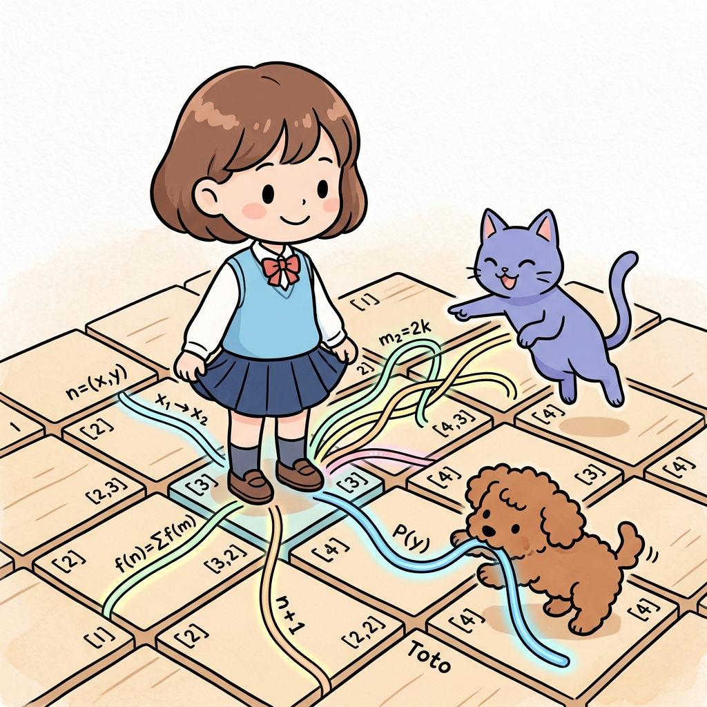
**그림 02-4-1** 격자 세상의 방(상태)들이 실타래처럼 얽혀 서로의 가치에 영향을 주는 관계를 살펴보는 도로시와 지니, 토토

"지니! 격자판에서 가치를 계산하려고 하는데, A 방의 가치는 B 방의 가치에 영향을 받고, B 방의 가치는 다시 A 방의 가치에 영향을 줘서 다람쥐 쳇바퀴 돌듯 수식이 계속 꼬리를 물고 이어져. 이 꼬인 실타래를 어떻게 한꺼번에 풀 수 있을까?"

도로시가 연필을 쥐고 칠판의 순환 수식들을 가리키며 땀을 뻘뻘 흘렸습니다. 

발밑에 있던 토토도 걱정스러운 표정으로 고개를 갸웃거렸습니다.

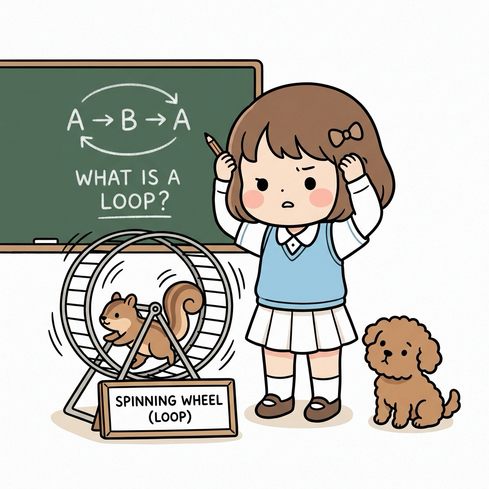
**그림 02-4-2** A 방과 B 방의 가치가 서로 맞물려 쳇바퀴처럼 순환하는 구조를 고민하는 도로시와 토토

지니가 보랏빛 마법 연기를 흩날리며 허공에 양팔 저울 하나를 띄웠습니다.

"도로시, 너무 걱정하지 마! 수학에는 이렇게 서로 얽혀서 꼬리를 무는 관계를 한 번에 말끔하게 정리해주는 도구가 있단다. 바로 **일차방정식**과 **연립방정식**이지. 저울의 균형을 맞추는 원리만 이해하면 아주 쉽게 풀 수 있어!"

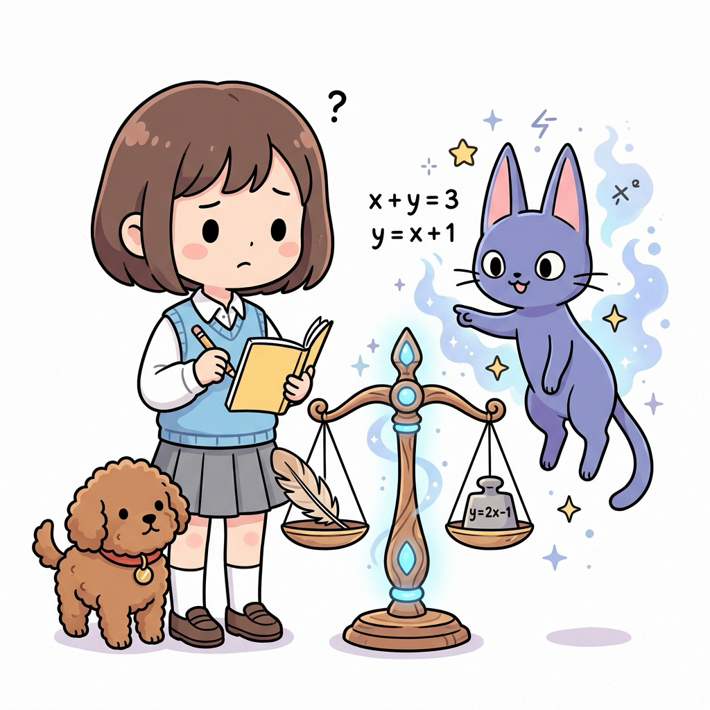
**그림 02-4-3** 서로 맞물려서 꼬리를 무는 가치 관계 수식을 보며 어떻게 계산해야 할지 고민에 빠진 도로시와 토토에게 양팔 저울을 띄워 설명하는 지니

---

## 02.4.2 일차방정식과 이항의 원리

지니는 칠판에 하나의 미지수를 가진 간단한 식을 적었습니다.

"먼저 가장 기초가 되는 **일차방정식**부터 시작해 볼까? 방정식은 쉽게 말해 '양팔 저울'과 같단다. 왼쪽(좌변)과 오른쪽(우변)의 무게가 완벽하게 수평을 이루고 있는 상태지."

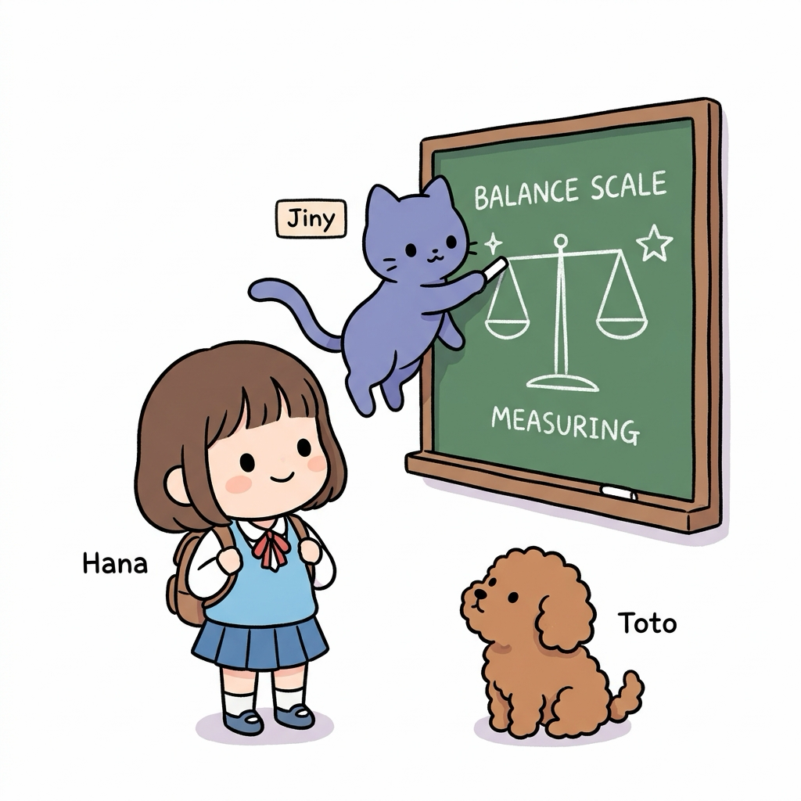
**그림 02-4-4** 지니가 칠판에 그린 양팔 저울 그림을 보며 방정식의 균형을 공부하는 도로시와 토토

### 2.4.2.1 등식의 성질
등식은 다음과 같은 **양팔 저울의 법칙**을 따릅니다:
1. 양변에 같은 수를 더해도 저울은 균형을 유지합니다.
2. 양변에서 같은 수를 빼도 저울은 균형을 유지합니다.
3. 양변에 같은 수를 곱하거나 나눠도(0이 아닌 수로) 저울은 균형을 유지합니다.

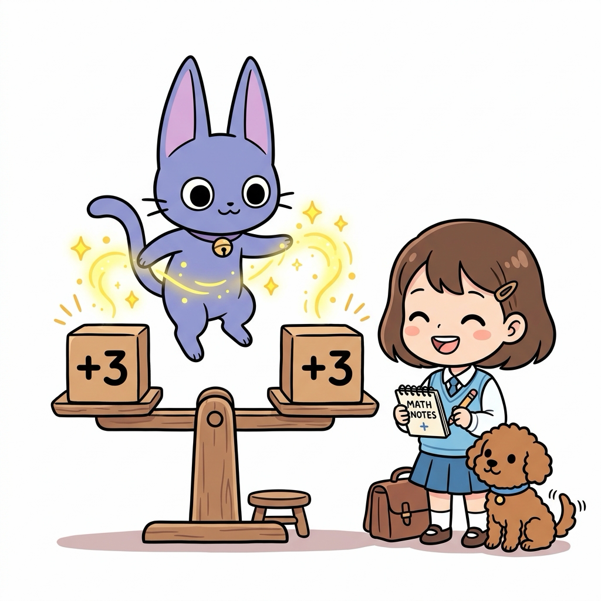
**그림 02-4-5** 등식의 양변에 같은 연산을 취해도 저울의 평형이 유지되는 등식의 성질(Properties of Equality)을 마법 저울로 확인하는 지니와 도로시, 토토

### 2.4.2.2 이항(Transposition)이란?
"이 성질을 이용하면, 등식의 한쪽에 있는 숫자를 반대쪽으로 옮길 수 있는데, 이를 **이항**이라고 해. 이때 저울의 균형을 맞추기 위해 **부호가 반대로** 바뀐단다."

**그림 02-4-6** 등식의 등호(=)를 넘어가면서 항의 부호가 마이너스로 바뀌는 이항의 마법 같은 원리에 호기심을 가지는 도로시와 토토

지니가 손가락을 튕기자 칠판 위에 수식이 둥둥 떠올랐습니다.

* *V* = 2 + 0.9 × *V*

"자, 이 식에서 미지수 *V*를 구하고 싶다면, 오른쪽의 *V* 항을 왼쪽으로 모아야겠지? 0.9 × *V*를 왼쪽으로 이항해 볼까?"

* ➔ *V* - 0.9 × *V* = 2 (더해져 있던 0.9 × *V*가 이항하면서 빼기 `-`로 바뀜)
* ➔ (1 - 0.9) × *V* = 2 (분배법칙으로 *V*를 묶기)
* ➔ 0.1 × *V* = 2
* ➔ *V* = 2 ÷ 0.1 = 20

"와! 더해져 있던 게 반대쪽으로 넘어가면 빼기가 되고, 곱해져 있던 0.1은 반대쪽으로 넘어가면 나누기가 되어서 결국 *V* = 20이라는 참값이 딱 나오는구나!"

도로시가 손뼉을 치며 신나 했습니다.

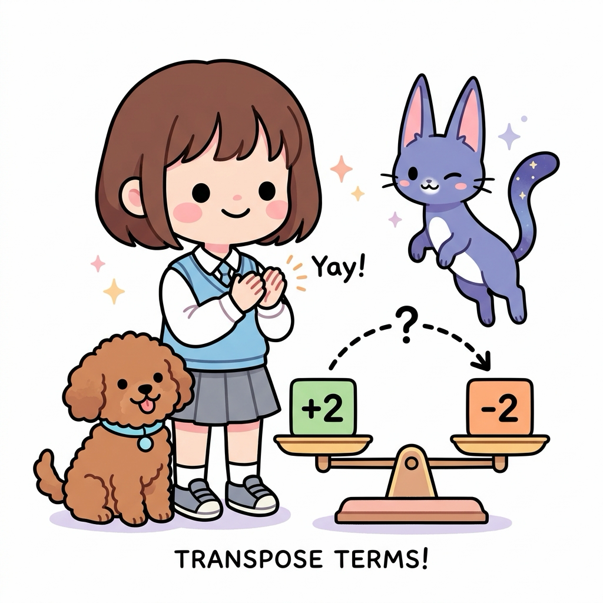
**그림 02-4-7** 등식의 성질에 따라 한 변의 항을 부호를 바꾸어 반대편으로 옮기는 이항(Transposition)의 원리를 양팔 저울로 시각화하여 관찰하는 지니와 도로시, 토토

---

## 02.4.3 연립방정식과 그 풀이법

"좋아, 이제 미지수가 여러 개로 늘어나는 **연립방정식**으로 넘어가 볼까? 연립방정식은 미지수가 2개 이상이고, 이들을 동시에 만족하는 **공통의 해**를 찾는 것이 목표야."

지니가 요술봉으로 칠판을 툭툭 치며 설명했습니다.

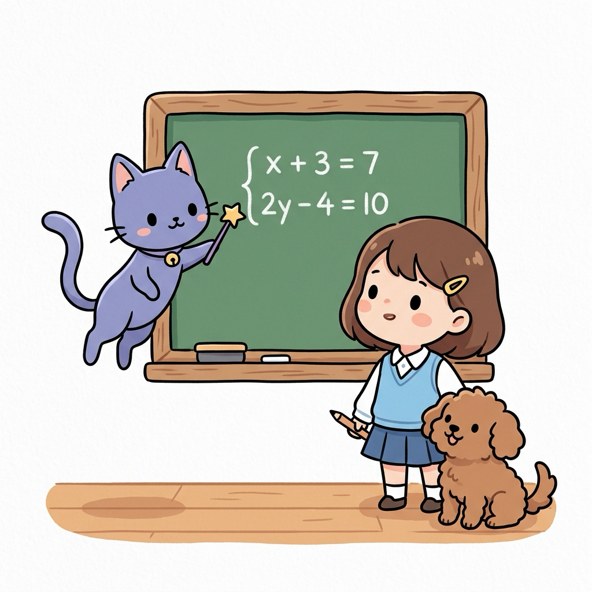
**그림 02-4-8** 두 개의 방정식을 하나로 묶어 연립방정식(System of Equations)을 만들고 해를 구하는 개념을 배우는 도로시와 토토

### 2.4.3.1 연립방정식 (System of Linear Equations)
미지수가 *x*, *y* 두 개인 일차방정식 2개를 한 쌍으로 묶은 형태입니다. 

이를 풀기 위해선 두 미지수 중 하나를 없애서(소거) 일차방정식 문제로 단순화시켜야 합니다. 

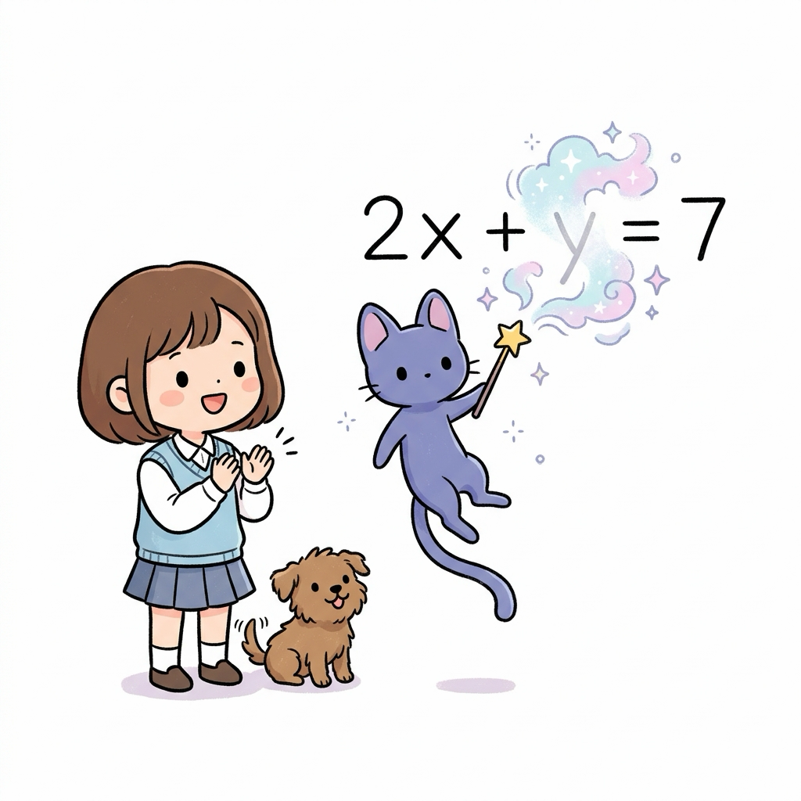
**그림 02-4-9** 두 개의 미지수 중 하나(y)를 소거(Elimination)하여 간단한 일차방정식으로 바꾸는 과정을 칠판을 보며 정리하는 도로시와 토토

여기에는 대표적으로 두 가지 방법이 있습니다.

**그림 02-4-10** 연립방정식의 해를 구하기 위해 사용할 수 있는 대표적인 두 가지 마법의 해결 방식(가감법과 대입법)의 갈림길을 살펴보는 도로시와 토토

### 2.4.3.2 가감법 (Elimination Method)

두 식을 서로 더하거나 빼서 미지수 하나를 없애는 방법입니다.

* **예시**:
  ① *x* + *y* = 10
  ② *x* - *y* = 2
  * 두 식 ①과 ②를 더해봅니다:
    (*x* + *y*) + (*x* - *y*) = 10 + 2
    ➔ 2 × *x* = 12
    ➔ *x* = 6
  * 구해진 *x* = 6을 식 ①에 다시 대입합니다:
    6 + *y* = 10 ➔ *y* = 4

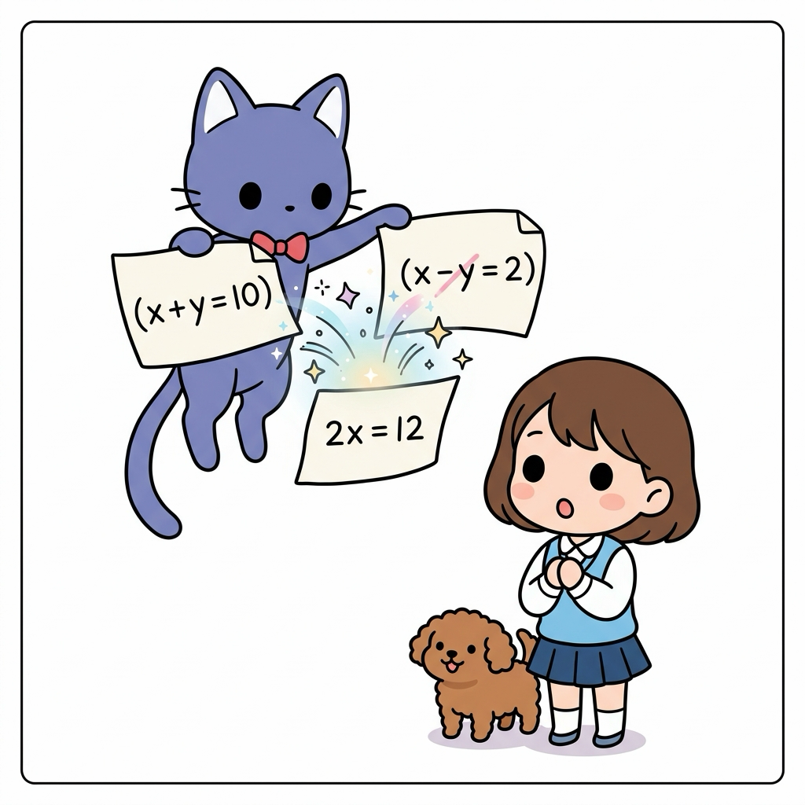
**그림 02-4-11** 두 식을 서로 더해 y를 소거(Elimination)하는 가감법의 계산 과정을 공부하는 도로시와 토토

### 2.4.3.3 대입법 (Substitution Method)
한 식을 하나의 미지수에 관해 정리한 뒤, 그것을 다른 식에 쏙 집어넣어 미지수를 하나로 줄이는 방법입니다.

* **예시**:
  식 ②를 *x*에 대해 정리하면:
  *x* = 2 + *y*
  이를 식 ①의 *x* 자리에 대입합니다:
  (2 + *y*) + *y* = 10
  ➔ 2 + 2 × *y* = 10
  ➔ 2 × *y* = 8 (2를 이항)
  ➔ *y* = 4
  * *y* = 4를 *x* = 2 + *y*에 대입하면:
    *x* = 2 + 4 = 6

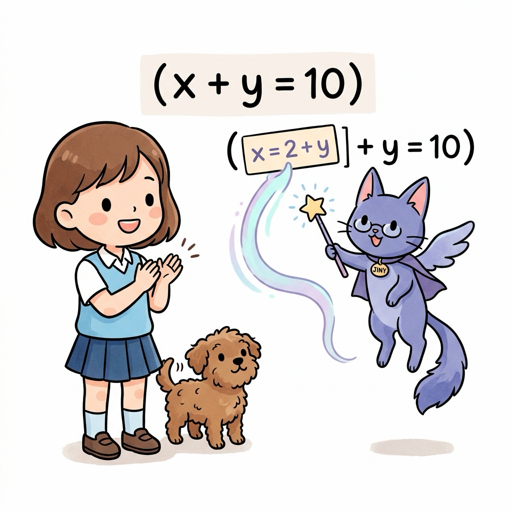
**그림 02-4-12** 한 미지수 식을 다른 식의 미지수 자리에 쏙 대입(Substitution)하여 해결하는 대입법 계산 과정을 공부하는 도로시와 토토

"오! 가감법으로 위아래 식을 더해서 *y*를 없앨 수도 있고, 대입법으로 *x* 자리에 식을 통째로 대입해서 풀 수도 있구나! 결과는 둘 다 똑같네!"

토토가 도로시의 다리 사이로 꼬리를 살랑살랑 흔들며 기쁜 듯 멍멍 짖었습니다.

---

## 02.4.4 방정식의 종류와 해의 역사

"지니, 연립방정식 말고도 세상에는 다양한 모양의 방정식들이 있어?"
도로시가 턱을 괴며 물었습니다.

**그림 02-4-13** 세상의 다양한 방정식들에 대해 호기심 어린 눈빛으로 질문하는 도로시와 지니, 토토

"그럼! 미지수 *x*가 곱해진 횟수, 즉 차수에 따라 **일차방정식**, **이차방정식**, **삼차방정식** 등으로 분류할 수 있단다. 그리고 이 방정식을 풀기 위한 인류의 역사 또한 아주 흥미진진하지."

지니가 허공에 지팡이를 휘두르자, 고대부터 근대까지의 수학 발전사가 파노라마처럼 펼쳐졌습니다.

**그림 02-4-14** 지니가 허공에 마법 지팡이를 휘두르자 마법처럼 펼쳐지는 흥미진진한 인류의 방정식 연구 역사를 감상하는 도로시와 토토

### 2.4.4.1 방정식의 차수와 분류
방정식은 가장 높은 차수의 항을 기준으로 부릅니다:
1. **일차방정식 (Linear Equation)**: *a* × *x* + *b* = 0 (단, *a* ≠ 0)
   - 가장 직관적이며 등식의 성질을 이용하여 쉽게 해를 구할 수 있습니다.
2. **이차방정식 (Quadratic Equation)**: *a* × *x*2 + *b* × *x* + *c* = 0 (단, *a* ≠ 0)
   - 고대 바빌로니아 시절부터 연구되었으며, 오늘날 우리가 잘 아는 **근의 공식**을 통해 근의 참값을 언제나 구할 수 있습니다.
3. **삼차방정식 (Cubic Equation)**과 **사차방정식 (Quartic Equation)**:
   - 16세기 이탈리아의 수학자 타르탈리아, 카르다노, 페라리 등에 의해 일반적인 근의 공식이 발견되었습니다. 어떤 삼차, 사차방정식이 주어지더라도 사칙연산과 거듭제곱근만으로 해를 구할 수 있는 마법의 열쇠가 완성된 것이죠.

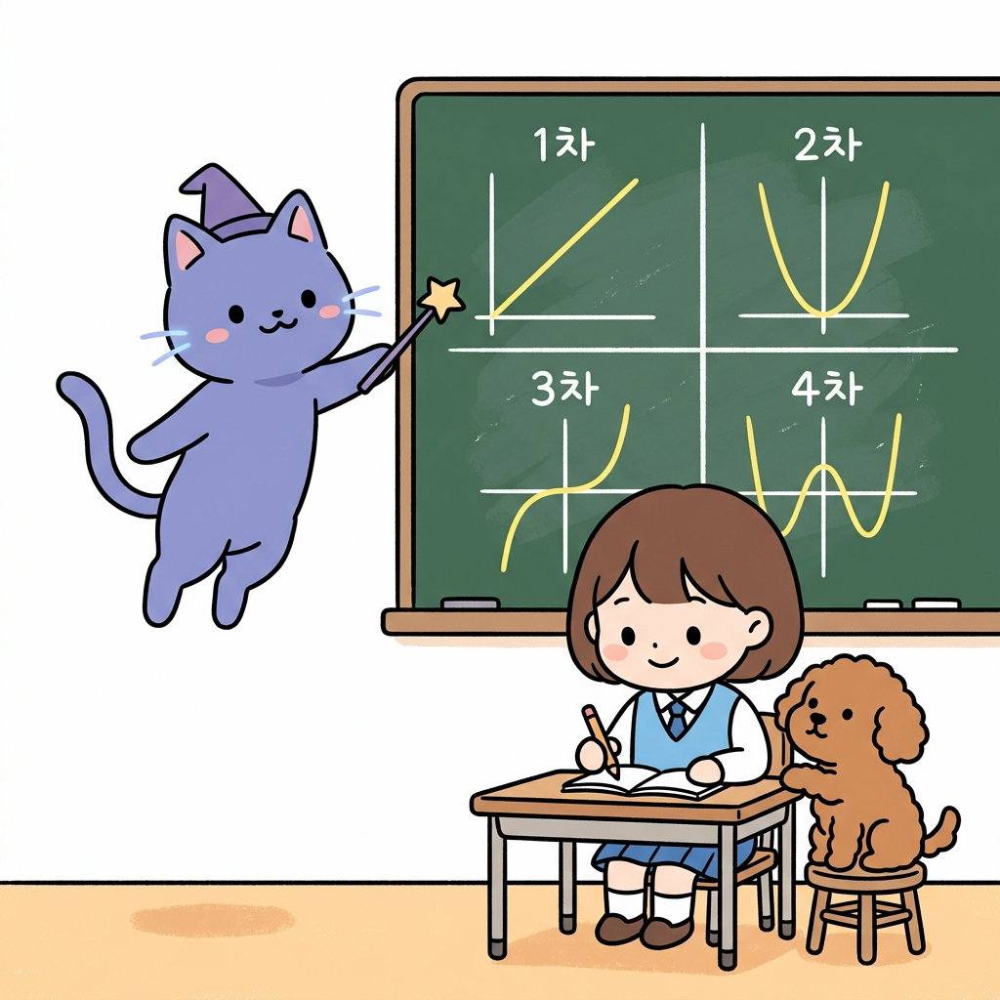
**그림 02-4-15** 차수(1차, 2차, 3차, 4차)에 따른 방정식의 분류와 그에 상응하는 다양한 형태의 기하학적 그래프 곡선을 칠판으로 살펴보는 지니와 도로시, 토토

### 2.4.4.2 오차방정식의 장벽과 아벨-루피니 정리
"우와, 그럼 오차방정식, 육차방정식도 계속 공식이 있겠네?"
도로시의 눈이 반짝였습니다.

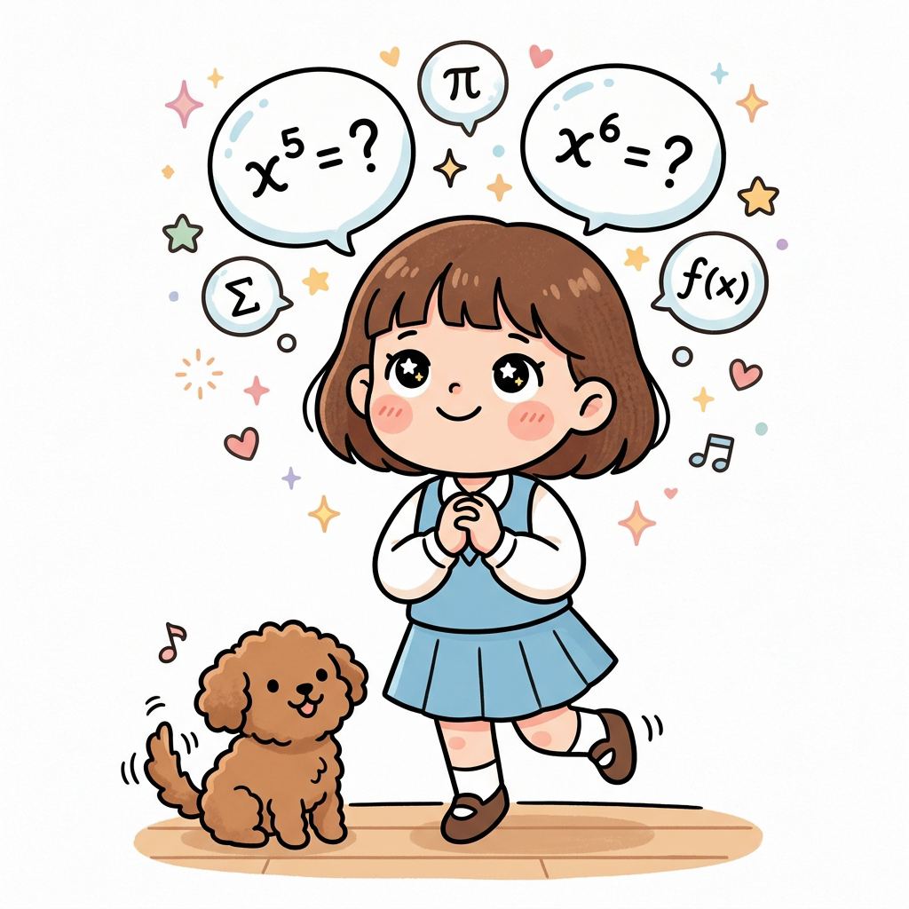
**그림 02-4-16** 5차, 6차 방정식의 근의 공식도 있을 것이라며 눈을 반짝이고 상상하는 도로시와 토토

"놀랍게도 그렇지 않단다, 도로시. 차수가 **오차(5차) 이상**인 방정식부터는 사칙연산과 거듭제곱근만으로 표현되는 **일반적인 근의 공식이 존재하지 않는다**는 사실이 증명되었어."
지니가 단호하게 고개를 저었습니다.

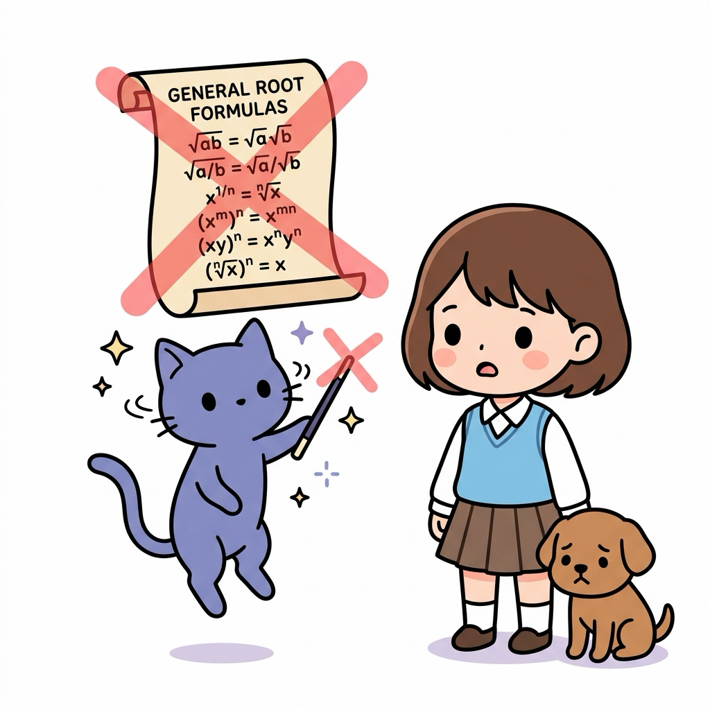
**그림 02-4-17** 5차 이상의 고차방정식에는 사칙연산과 거듭제곱근만으로 표현되는 일반적인 공식이 없음을 설명하는 지니와 실망한 도로시, 토토

- **아벨-루피니 정리 (Abel-Ruffini Theorem)**:
  19세기 초, 천재 수학자 닐스 헨리크 아벨과 파올로 루피니는 "5차 이상의 일반적인 다항방정식은 대수적으로(사칙연산과 제곱근 기호만으로) 풀 수 없다"는 것을 증명했습니다.

**그림 02-4-18** 5차 이상의 방정식의 근의 공식이 없다는 장벽을 수학적으로 증명한 아벨과 루피니의 업적을 설명하는 지니와 도로시, 토토

- **갈루아 이론 (Galois Theory)**:
  이후 에바리스트 갈루아는 방정식의 근들의 대칭성을 군(Group)이라는 대수적 구조로 연결하는 '갈루아 이론'을 통해, 어떤 방정식이 대수적으로 풀릴 수 있는지 없는지를 판별하는 근본적인 원리를 제시했습니다.

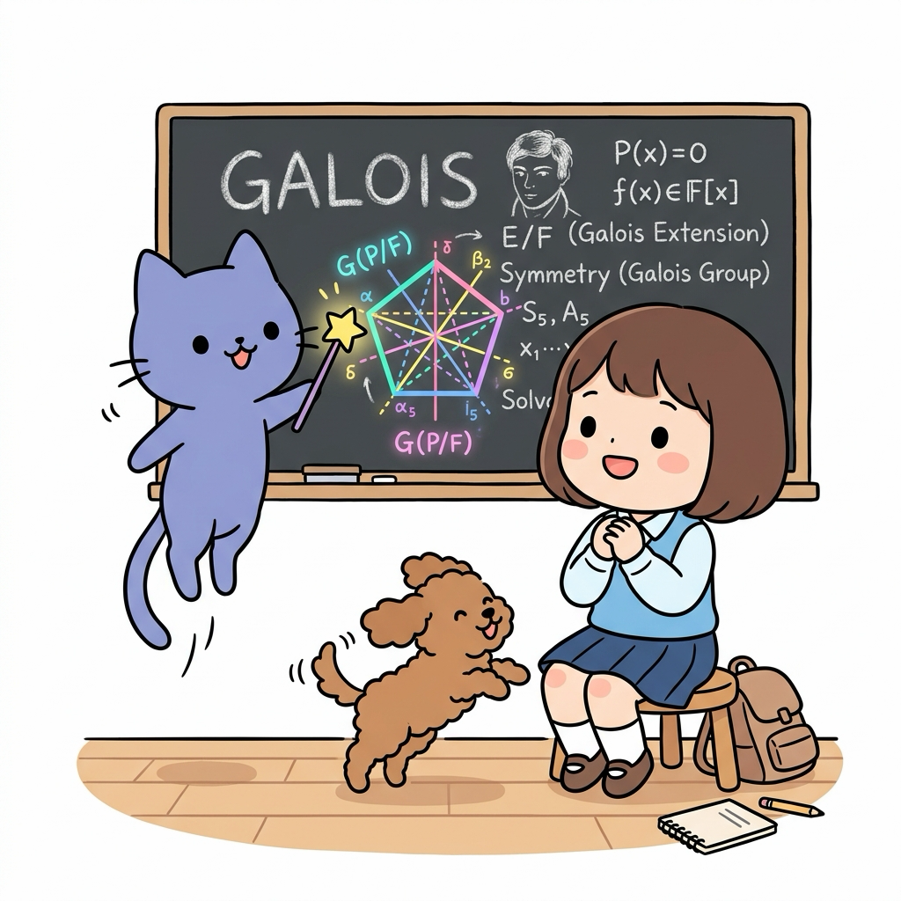
**그림 02-4-19** 대칭군(Symmetry Group) 구조를 통해 방정식의 해법 가능성을 규명한 갈루아 이론을 감상하는 지니와 도로시, 토토

"대수적 공식이 없다는 것뿐이지 해가 존재하지 않는 것은 아니란다. 단지 우리가 사칙연산과 루트 기호만으로 그 아름다운 해를 한 줄의 공식으로 적어낼 수 없을 뿐이지."
지니의 친절한 설명에 도로시는 수학의 깊은 신비로움에 압도된 듯 깊은 한숨을 쉬었습니다.

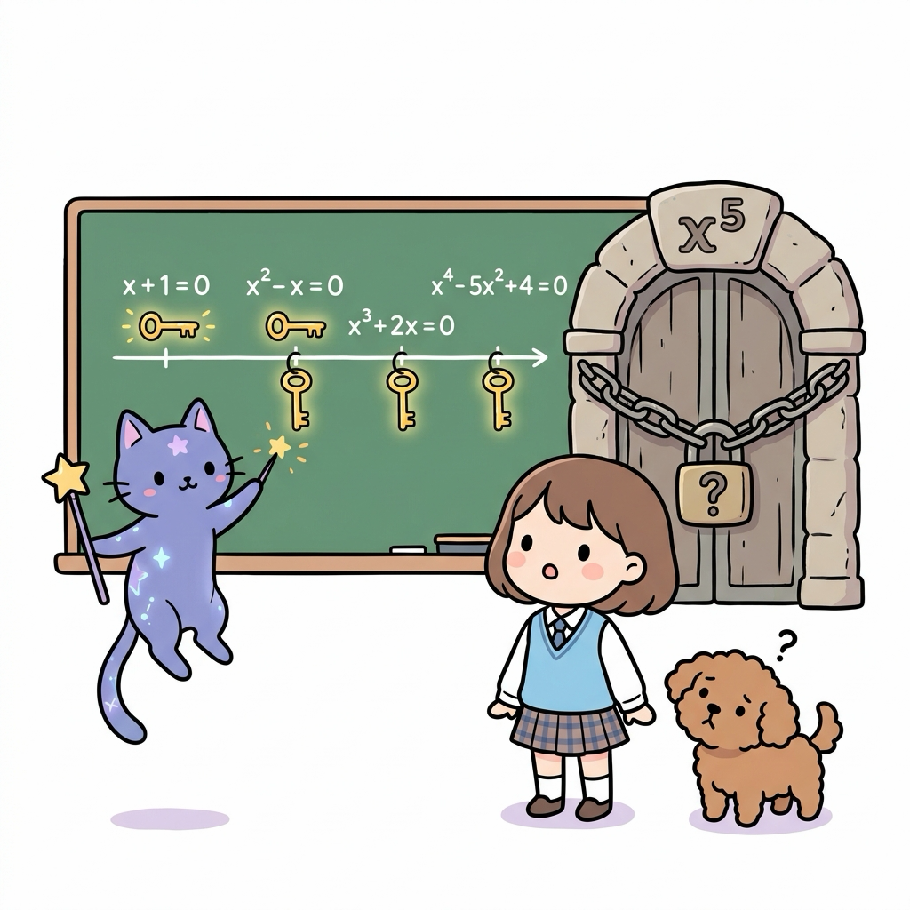
**그림 02-4-20** 1차부터 4차 방정식까지는 해결할 수 있는 열쇠(근의 공식)가 존재하지만, 5차 이상의 방정식은 대수적 공식의 열쇠가 존재하지 않는 장벽에 가로막혀 있음을 보여주는 역사 탐험 지도와 도로시, 토토

---

## 02.4.5 벨만 기대 방정식의 연립방정식적 실체

"도로시, 방금 배운 연립방정식들이 강화학습의 **벨만 기대 방정식(Bellman Expectation Equation)**을 푸는 핵심 열쇠가 된단다. 실제로 격자 세상의 상태 가치들이 어떻게 연립방정식으로 표현되는지 직접 볼래?"

지니가 손가락을 튕기자 두 개의 방 A와 B로 이루어진 격자 지도가 나타났습니다.

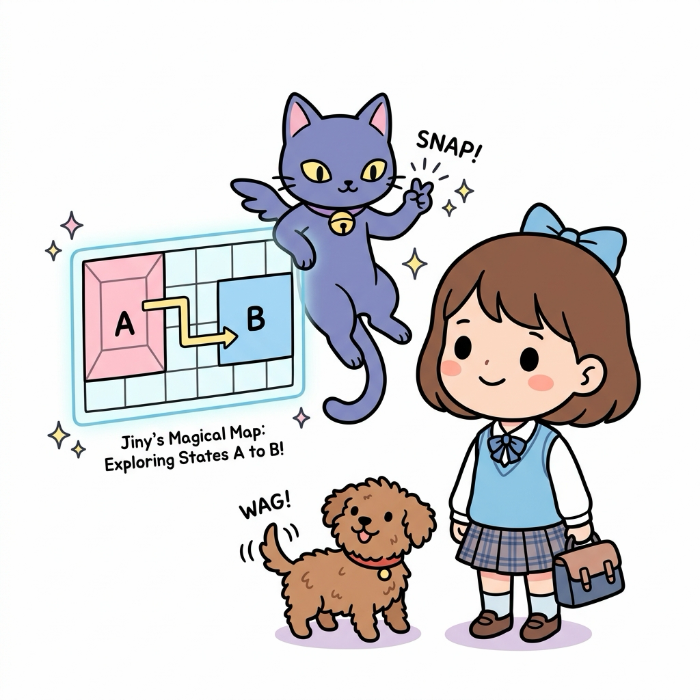
**그림 02-4-21** 지니가 손가락을 튕기자 마법처럼 둥둥 떠오른 두 개의 방 A와 B로 이루어진 격자 세상 상태 지도와 도로시, 토토

### 2.4.5.1 상태 가치 사이의 관계
격자 세상에 오직 두 개의 상태 A와 B만 존재한다고 가정해 봅시다. 할인율 *γ* = 0.9 이며, 보상 및 상태 이동 규칙이 다음과 같습니다:
1. 상태 A에서 다음 상태는 항상 B이고, 이때 받는 즉각 보상은 2입니다.
   *v*(*A*) = 2 + 0.9 × *v*(*B*)  ... ①
2. 상태 B에서 다음 상태는 항상 A이고, 이때 받는 즉각 보상은 -1입니다.
   *v*(*B*) = -1 + 0.9 × *v*(*A*) ... ②

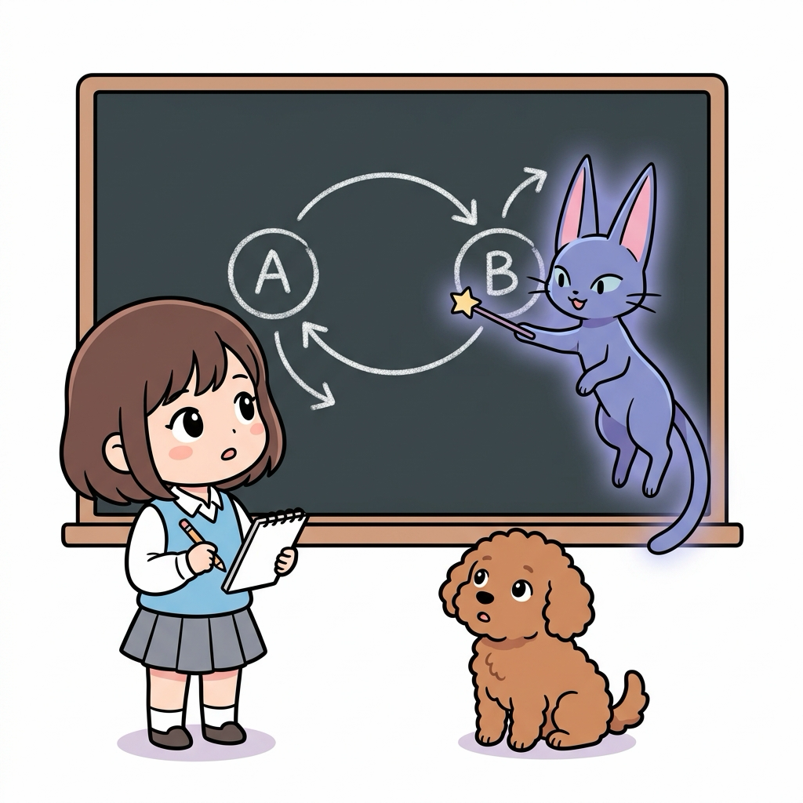
**그림 02-4-22** 상태 A와 B가 서로 물고 물리며 가치값을 전달하는 순환 구조와 벨만 기대 방정식의 관계를 칠판으로 살펴보는 도로시와 토토

"정말이네! 미지수가 *v*(*A*), *v*(*B*) 2개이고 식이 2개인 완벽한 연립방정식이야!"

도로시가 큰 소리로 외쳤습니다.

### 2.4.5.2 대입법으로 가치 구하기

지니가 대입법을 사용해 가치 함수의 참값을 구하기 시작했습니다.

* 식 ②의 *v*(*B*) 식을 식 ①에 대입합니다:
  *v*(*A*) = 2 + 0.9 × [ -1 + 0.9 × *v*(*A*) ]
* 괄호를 풀어서 전개합니다:
  *v*(*A*) = 2 - 0.9 + 0.81 × *v*(*A*)
  *v*(*A*) = 1.1 + 0.81 × *v*(*A*)
* *v*(*A*) 항을 좌변으로 이항합니다:
  *v*(*A*) - 0.81 × *v*(*A*) = 1.1
  (1 - 0.81) × *v*(*A*) = 1.1
  0.19 × *v*(*A*) = 1.1
* *v*(*A*)의 값을 계산합니다:
  *v*(*A*) = 1.1 ÷ 0.19 = 약 5.79
* 구한 *v*(*A*)의 값을 식 ②에 대입하여 *v*(*B*)를 계산합니다:
  *v*(*B*) = -1 + 0.9 × 5.79 = -1 + 5.21 = 4.21

"와! 쳇바퀴 돌 듯 순환하던 두 상태의 정확한 가치 참값인 *v*(*A*) ≈ 5.79, *v*(*B*) ≈ 4.21을 찾아냈어!"

도로시와 토토가 박수를 치며 지니의 마법에 찬사를 보냈습니다.

**그림 02-4-23** 대입법이라는 수학적 열쇠를 사용하여 꼬여 있던 연립방정식 자물쇠를 풀고 상태 A와 B의 가치를 완벽히 계산하는 데 성공한 지니와 도로시, 토토

---

## 02.4.6 실전 예제

학습한 내용을 바탕으로 다음 문제를 직접 해결해 봅시다.

### 문제 1 (가치 연립방정식 풀이)
다음 연립방정식을 만족하는 *v*(*s*1)과 *v*(*s*2)의 해를 구하시오. (단, 소수 첫째자리까지 반올림하여 구할 것)
① *v*(*s*1) = 1 + 0.5 × *v*(*s*2)
② *v*(*s*2) = 4 + 0.5 × *v*(*s*1)

> **풀이**:
> 식 ②를 식 ①에 대입합니다:
> *v*(*s*1) = 1 + 0.5 × [ 4 + 0.5 × *v*(*s*1) ]
>*v*(*s*1) = 1 + 2 + 0.25 × *v*(*s*1)
> *v*(*s*1) = 3 + 0.25 × *v*(*s*1)
> 
> *v*(*s*1) 항을 좌변으로 이항합니다:
> *v*(*s*1) - 0.25 × *v*(*s*1) = 3
> 0.75 × *v*(*s*1) = 3
> *v*(*s*1) = 3 ÷ 0.75 = 4
> 
> 구해진 *v*(*s*1) = 4 를 식 ②에 대입하여 *v*(*s*2)를 구합니다:
> *v*(*s*2) = 4 + 0.5 × 4 = 4 + 2 = 6
> 
>**정답**: *v*(*s*1) = 4, *v*(*s*2) = 6

---

## 02.4.7 핵심 요약

**그림 02-4-24** 일차방정식의 저울 균형, 연립방정식의 대수적 해법, 그리고 고차방정식의 해의 역사까지 학습을 무사히 마치고 뿌듯해하는 지니와 도로시, 토토의 기념사진

1. **일차방정식**은 양팔 저울의 원리와 같이 등식의 성질 및 이항(부호를 바꿔 반대편으로 옮김)을 활용하여 미지수의 참값을 구하는 해결 도구이다.
2. 강화학습의 상태 가치들이 순환하며 서로에게 영향을 미칠 때는 각 상태들의 가치 관계를 **연립방정식** 형태로 나타낼 수   있다.
3. **가감법**과 **대입법**은 맞물린 벨만 기대 방정식의 상태 가치 참값을 대수적으로 오차 없이 풀어내는 마법의 열쇠이다.
4. **방정식의 종류와 해의 역사**에서 1차부터 4차 다항방정식은 일반적인 대수적 해법(근의 공식)이 존재하지만, 5차 이상의 방정식은 대수적으로 풀 수 없음이 아벨과 갈루아에 의해 밝혀졌다.
