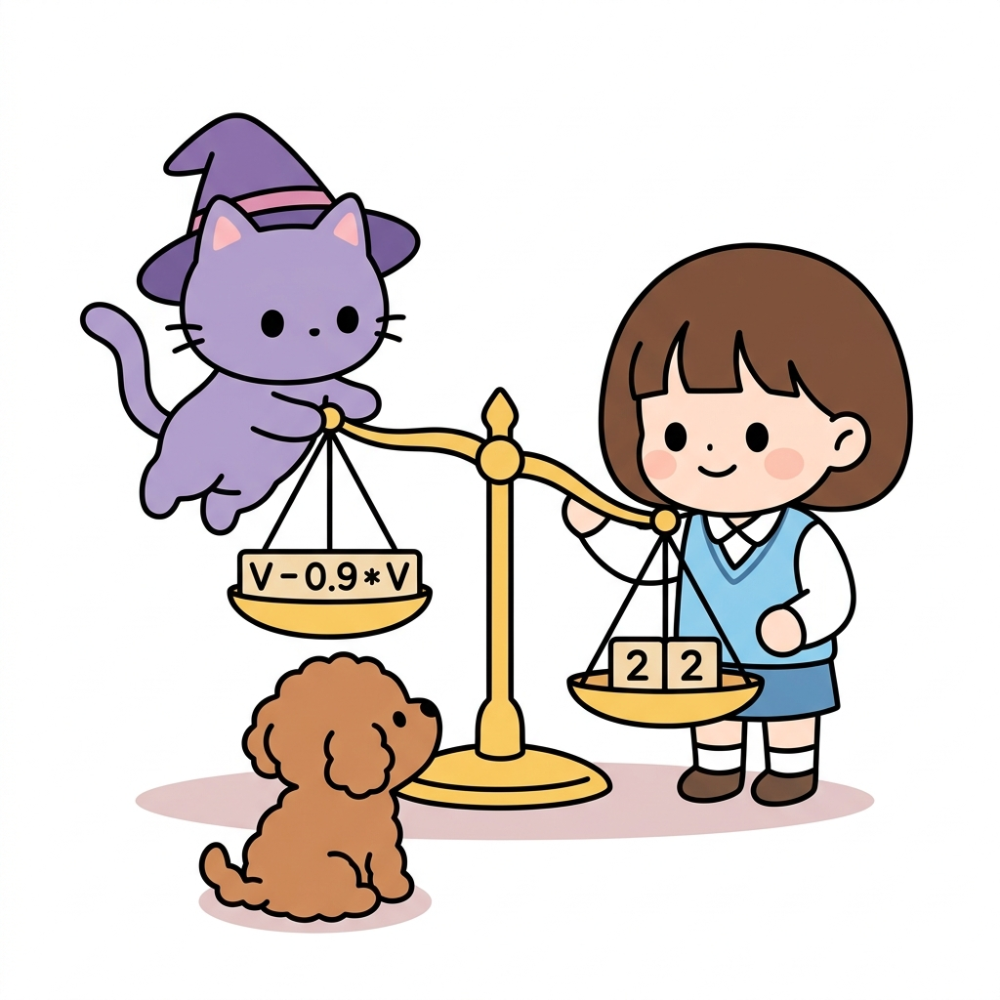
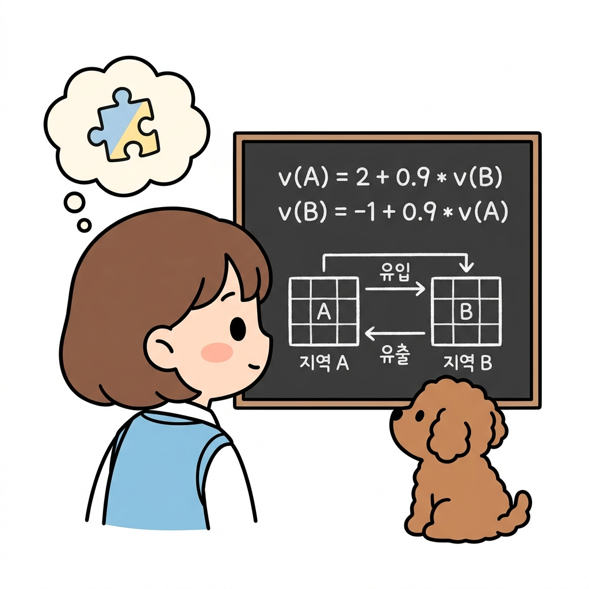

# 02.4 일차방정식과 연립방정식

> 이 장에서는 미지수 *x*, *y*를 포함한 **일차방정식과 연립방정식**의 개념 및 풀이법을 복습하고, 격자 세상 속 여러 상태들의 가치 함수가 서로 얽혀 있을 때 이를 방정식 연립을 통해 구해내는 실전 원리를 배웁니다.

---

## 02.4.1 얽히고설킨 단서들을 풀어내는 방정식의 열쇠

강화학습의 상태 가치들은 독립적으로 고정되어 있지 않고, "내 상태의 가치는 이웃한 다음 상태들의 가치와 보상의 가중합"이라는 상호 얽힌 관계를 이룹니다. 이 얽힌 가치들을 하나씩 풀어 참값을 얻기 위해서는 **연립방정식**이라는 비밀 열쇠가 필요합니다. 

"지니! 격자판에서 가치 함수를 계산할 때, 이쪽 칸의 가치가 저쪽 칸의 가치에 영향을 주고, 저쪽 칸 가치도 이쪽 칸에 다시 영향을 주니까 꼬리표처럼 수식이 계속 맞물려서 돌아가. 이걸 대체 어떻게 한꺼번에 풀 수 있는 거야?"

도로시가 연필을 쥔 채 칠판에 적힌 공식들을 가리키며 난감한 표정을 지었습니다. 토토는 도로시의 발밑에 엎드린 채 고개를 갸웃거렸습니다. 지니는 자상하게 미소를 짓고는 양팔 저울 하나를 마법으로 만들어 띄워 보였습니다.

"도로시, 수학에는 얽혀 있는 수식들의 실타래를 한 번에 풀어주는 마법의 열쇠가 있단다. 바로 **일차방정식**과 **연립방정식**의 성질이지! 저울의 균형을 맞추듯이 수식의 좌우 대칭 원리를 이용하면 해결할 수 있어."

---

### 1. 학습 목표
- 등식의 성질과 이항(Transposition)을 이해하고 일차방정식을 풀 수 있다.
- 미지수가 2개인 연립일차방정식의 개념을 알고, 가감법과 대입법으로 해를 계산한다.
- 서로 연결된 격자 세상 상태들의 가치 함수 관계를 연립방정식으로 세워 직접 해를 풀어낸다.

---

### 2. 핵심 개념

#### (1) 일차방정식과 이항 (Linear Equations and Transposition)
미지수 *x*의 차수가 1인 방정식을 일차방정식이라고 하며, 등식의 양변에 같은 수를 더하거나 빼거나 곱하거나 나누어도 등식이 성립한다는 성질을 이용해 풉니다.

* **이항**: 등식의 한 변에 있는 항을 부호를 바꾸어 다른 변으로 옮기는 것입니다. 양팔 저울 한쪽에 무거운 추를 덜어내어 반대쪽으로 옮기는 원리와 같습니다.

수식으로 살펴볼까요?
* *V* = 2 + 0.9 × *V*
* ➔ *V* - 0.9 × *V* = 2 (0.9*V*를 좌변으로 이항하여 부호가 마이너스로 바뀜)
* ➔ (1 - 0.9) × *V* = 2 (분배법칙으로 묶기)
* ➔ 0.1 × *V* = 2
* ➔ *V* = 2 / 0.1 = 20

**그림 02-4-1** 양팔 저울의 균형을 잡는 직관적인 원리를 통해 등식의 성질과 이항 연산을 공부하는 지니와 도로시, 토토

"아! 한쪽에 더해져 있던 것을 반대쪽으로 넘기면 빼기(`-`)가 되는구나. 그렇게 해서 미지수를 한군데로 모아 풀면 되는 거네!"

도로시가 손뼉을 치며 말했습니다.

---

#### (2) 연립방정식 (System of Linear Equations)
미지수가 2개인 일차방정식 2개를 한 쌍으로 묶어 놓은 것으로, 공통으로 만족하는 해를 구합니다.
* **가감법**: 두 식을 더하거나 빼서 미지수 하나를 소거하여 푸는 방법입니다.
* **대입법**: 한 식을 다른 미지수에 대한 식으로 정리한 뒤, 그것을 다른 식에 대입하여 푸는 방법입니다.

* *예시*:
  ① *x* + *y* = 10
  ② *x* - *y* = 2
  * ①과 ②를 더하면 (가감법): 2*x* = 12 ➔ *x* = 6
  * *x* = 6을 ①에 대입하면 (대입법): 6 + *y* = 10 ➔ *y* = 4

---

#### (3) 벨만 기대 방정식의 연립방정식적 실체
실제 강화학습의 벨만 기대 방정식은 연립방정식과 완전히 같은 모습을 하고 있습니다.

격자 세상(Grid World)에 오직 두 개의 상태 *A*와 *B*만 존재하고, 할인율 *γ* = 0.9 이며, 보상 및 상태 이동 규칙이 다음과 같다고 해봅시다.
* 상태 *A*에서 다음 상태는 항상 *B*이고 이때 받는 보상은 2입니다:
  *v*(*A*) = 2 + 0.9 × *v*(*B*)  ... ①
* 상태 *B*에서 다음 상태는 항상 *A*이고 이때 받는 보상은 -1입니다:
  *v*(*B*) = -1 + 0.9 × *v*(*A*) ... ②

"와! 식 ①과 식 ②를 보니까 진짜 미지수가 *v*(*A*), *v*(*B*) 2개인 연립방정식이네!"

도로시가 깜짝 놀란 목소리로 말했습니다.

**그림 02-4-2** 서로 맞물려 순환하는 상태 A와 B의 가치 함수 수식 관계를 살펴보고 연립방정식의 해법을 고민하는 도로시와 토토

지니가 요술봉을 흔들어 대입법으로 해를 풀어 나갔습니다.
* **풀어보기**: ②를 ①에 대입합니다.
  *v*(*A*) = 2 + 0.9 × [ -1 + 0.9 × *v*(*A*) ]
  *v*(*A*) = 2 - 0.9 + 0.81 × *v*(*A*)
  *v*(*A*) = 1.1 + 0.81 × *v*(*A*)
  *v*(*A*) - 0.81 × *v*(*A*) = 1.1 (이항)
  0.19 × *v*(*A*) = 1.1
  *v*(*A*) = 1.1 / 0.19 = 약 5.79
* 얻은 값을 ②에 대입하여 *v*(*B*)를 구합니다:
  *v*(*B*) = -1 + 0.9 × 5.79 = -1 + 5.21 = 4.21

**그림 02-4-3** 대입법을 활용하여 상태 A와 B의 정확한 가치값(5.79와 4.21)을 계산해 내는 성공적인 수식 풀이 과정

"대단해! 이렇게 맞물린 2차 연립방정식을 푸니까 상태 *A*와 *B*의 가치 참값이 정확하게 풀리는구나!"

도로시와 토토가 신나게 발을 구르며 기뻐했습니다.

---

## 02.4.2 실전 예제

### 문제 1 (가치 연립방정식 풀이)
> 다음 연립방정식을 만족하는 *v*(*s*1)과 *v*(*s*2)의 해를 구하시오. (단, 소수 첫째자리까지 반올림하여 구할 것)
> ① *v*(*s*1) = 1 + 0.5 × *v*(*s*2)
> ② *v*(*s*2) = 4 + 0.5 × *v*(*s*1)
>
> **풀이**:
> ②를 ①에 대입합니다:
> *v*(*s*1) = 1 + 0.5 × [ 4 + 0.5 × *v*(*s*1) ]
> *v*(*s*1) = 1 + 2 + 0.25 × *v*(*s*1)
> *v*(*s*1) = 3 + 0.25 × *v*(*s*1)
> *v*(*s*1) - 0.25 × *v*(*s*1) = 3 (이항)
> 0.75 × *v*(*s*1) = 3
> *v*(*s*1) = 3 / 0.75 = 4
>
> 구해진 *v*(*s*1) = 4 를 ②에 대입합니다:
> *v*(*s*2) = 4 + 0.5 × 4 = 4 + 2 = 6
>
> **정답**: *v*(*s*1) = 4, *v*(*s*2) = 6

---

## 02.4.3 핵심 요약

1. **일차방정식**은 미지수가 들어있는 식을 이항과 등식의 성질을 통해 미지수의 값을 도출해내는 해결 도구이다.
2. 여러 상태 가치들이 순환적으로 서로에게 영향을 주는 시스템은 여러 개의 식으로 구성된 **연립방정식** 형태로 모델링된다.
3. 연립방정식의 **대입법**과 **가감법**은 벨만 기대 방정식의 참 상태 가치(상태 가치들의 수치)를 수학적으로 완벽히 풀어내는 유일한 대수 열쇠이다.
