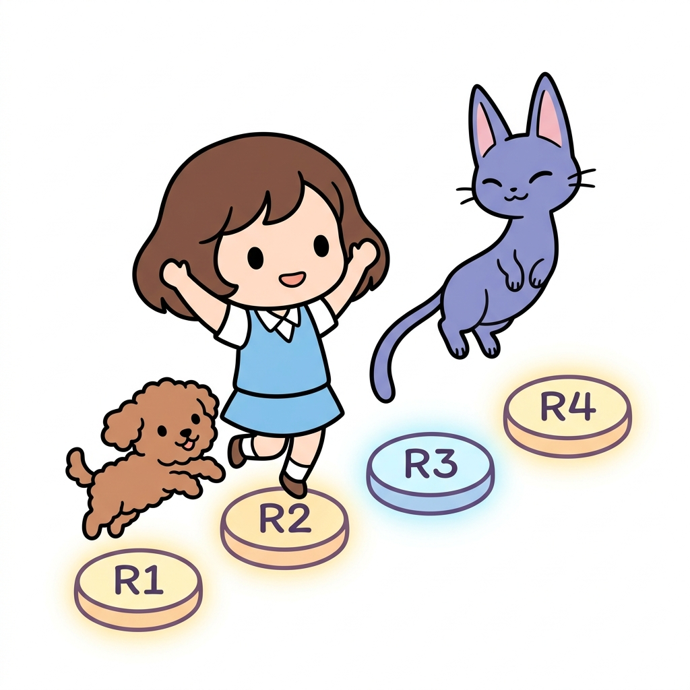
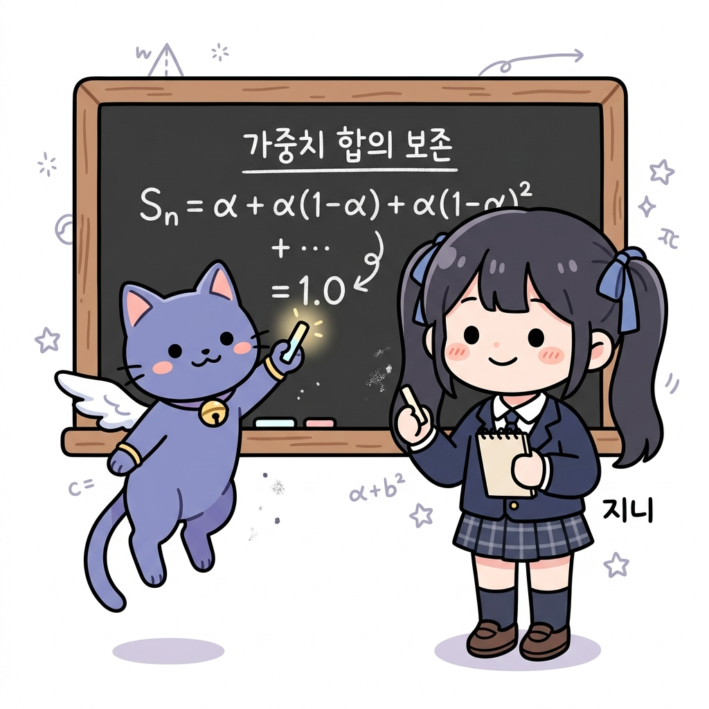
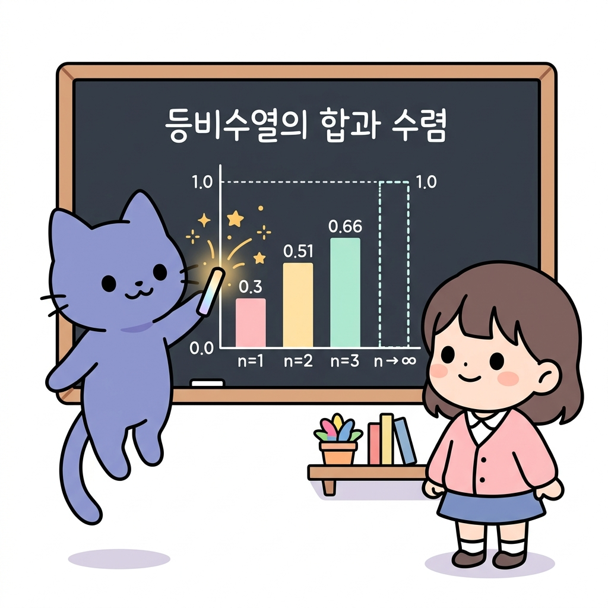

# 02.5 수열과 등비수열의 합

> 이 장에서는 규칙적으로 숫자를 나열한 **수열(Sequence)**의 개념을 정의하고, 보상이 감쇄율에 의해 변화하는 수열들의 총합을 구할 때 사용되는 **등비수열의 합**을 쉽고 체계적으로 배웁니다.

---

## 02.5.1 징검다리를 딛고 올라가는 수의 규칙

**그림 02-5-1** 규칙적으로 나열된 보물 징검다리를 딛고 건너며 숫자 수열의 합을 구하는 도로시와 토토

강화학습 에이전트가 매 시점마다 환경과 상호작용하며 획득하는 보상값들은 시간의 순서대로 나열된 **수열**과 같습니다. 도로시와 토토가 징검다리 숲길의 숫자 디딤돌(R1, R2, R3...)들을 하나씩 딛고 건너며, 모든 보상의 총합인 등비수열의 합을 완성해 나가는 재미있는 모험으로 수열을 가볍게 정복해봅시다!

---

### 1. 학습 목표
- 수열(Sequence)과 일반항, 합의 수학적 기호를 이해한다.
- 등비수열(Geometric Sequence)의 정의와 성질을 안다.
- 등비수열의 합 공식을 활용하여 감쇄율이 적용된 보상 합산의 수렴성을 분석할 수 있다.

---

### 2. 핵심 개념

#### (1) 수열 (Sequence)의 기본 정의
어떤 규칙에 따라 수를 차례대로 나열한 것을 **수열**이라고 합니다.
- **일반항 (*a**n*)**:
  수열에서 나열된 각 수들을 **항**이라고 부르며, 첫 번째 항을 *a*1, 두 번째 항을 *a*2, 그리고 *n*번째 항을 **일반항 *a**n***이라고 나타냅니다.
  - *강화학습 연계*: 에이전트가 1회부터 *n*회까지 겪어 얻은 보상의 흐름은 수열 **[*R*1, *R*2, ..., *R**n*]**로 표현됩니다.

**그림 02-5-2** 보상의 흐름과 같이 어떤 규칙에 따라 순서대로 차례차례 나열한 숫자의 배열(수열)

#### (2) 등비수열 (Geometric Sequence)
첫째항부터 시작하여 차례대로 **일정한 수(공비, *r*)**를 곱하여 만들어지는 수열입니다.
- **일반항 공식**:
  *a**n* = *a*1 * *r**n*-1
- **등비수열의 합 (*S**n*) 공식**:
  첫째항이 *a*, 공비가 *r*인 등비수열의 *n*번째 항까지의 합 *S**n*은 다음과 같습니다.
  *S**n* = *a*(1 - *r**n*) / (1 - *r*)  (단, *r* ≠ 1)
  - *해설*: 만약 공비 *r*이 1보다 작은 수(예: 0.9)이고 항의 개수 *n*이 무한대(*n* ➔ ∞)로 커지면, *r**n*은 0에 가까워집니다 (02.2장 지수적 감쇄). 따라서 등비수열의 합은 발산하지 않고 ***a* / (1 - *r*)**로 수렴합니다.

**그림 02-5-3** 일정한 공비를 거듭하여 곱해가며 형성되는 등비수열 공식의 칠판 판서

#### (3) 강화학습 비정상 문제의 가중치 합
비정상 밴디트 문제에서 과거 보상들의 가중치 감쇄항들을 모두 더해보면 다음과 같은 등비수열의 합 형태를 이룹니다.
*S**n* = *α* + *α*(1 - *α*) + *α*(1 - *α*)2 + ... + *α*(1 - *α*)*n*-1
- 이 식은 첫째항 *a* = *α*, 공비 *r* = (1 - *α*) 인 등비수열의 합입니다.
- 등비수열 합 공식에 대입하면:
  *S**n* = *α* [ 1 - (1 - *α*)*n* ] / [ 1 - (1 - *α*) ]
  *S**n* = *α* [ 1 - (1 - *α*)*n* ] / *α* = **1 - (1 - *α*)*n***
- 만약 *n*이 무한히 커진다면 (1 - *α*)*n*은 0에 수렴하므로, 가중치들의 총합은 완벽하게 **1**이 됩니다. 즉, 가중치들의 합이 1로 보존되어 가치의 크기가 변동 없이 안전하게 보존됩니다.

**그림 02-5-4** 할인율과 가중치들의 무한 누적합이 대수적으로 소거되어 최종 1.0으로 수렴 보존됨을 밝히는 유도

---

### 3. 시각 자료: 등비수열의 합산 비주얼 도식

**그림 02-5-5** 등비수열 가중치의 누적합이 횟수가 거듭될수록 1.0에 도달하여 수렴하는 시각화 도식

---

### 4. 실전 예제

#### 예제 1 (등비수열의 합 계산)
> **문제**: 첫째항이 0.3 이고 공비가 0.7 인 등비수열의 3번째 항까지의 합 *S*3의 값을 구하시오. (소수로 답할 것)
>
> **풀이**:
> 등비수열의 3번째 항까지의 나열은 다음과 같습니다:
> - 1번째 항 = 0.3
> - 2번째 항 = 0.3 * 0.7 = 0.21
> - 3번째 항 = 0.3 * 0.72 = 0.3 * 0.49 = 0.147
>
> 세 항의 합을 직접 구합니다:
> *S*3 = 0.3 + 0.21 + 0.147 = 0.657
> (공식 대입 시: *S*3 = 0.3 * (1 - 0.73) / (1 - 0.7) = 0.3 * (1 - 0.343) / 0.3 = 1 - 0.343 = 0.657)
> **정답**: 0.657

---

### 5. 핵심 요약
1. **수열**은 규칙적인 수의 나열로, 각 수를 항이라 부르고 첫 번째부터 *a*1, *a*2, *a**n* 형태로 쓴다.
2. **등비수열의 합**은 공비 *r* 이 1보다 작을 때, 항의 개수가 무한히 많아지면 결국 분모의 공비 항이 수렴하여 하나의 일정한 경계값에 다다르게 된다.
3. 비정상 밴디트의 지수 이동 평균 가중치 합산식은 공비가 (1 - *α*) 인 등비수열의 합 구조를 띠고 있으며, 그 총합은 무한히 진행 시 항상 **1.0**으로 보존된다.
