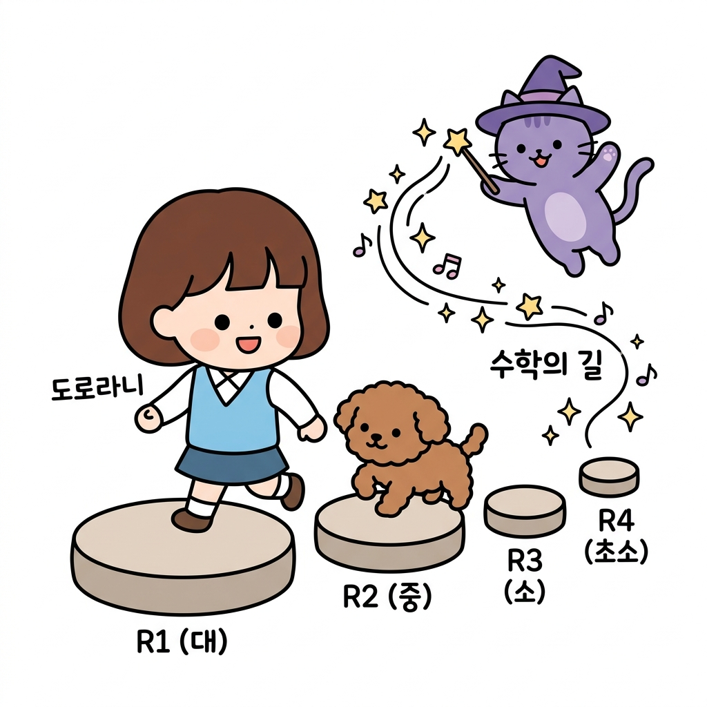
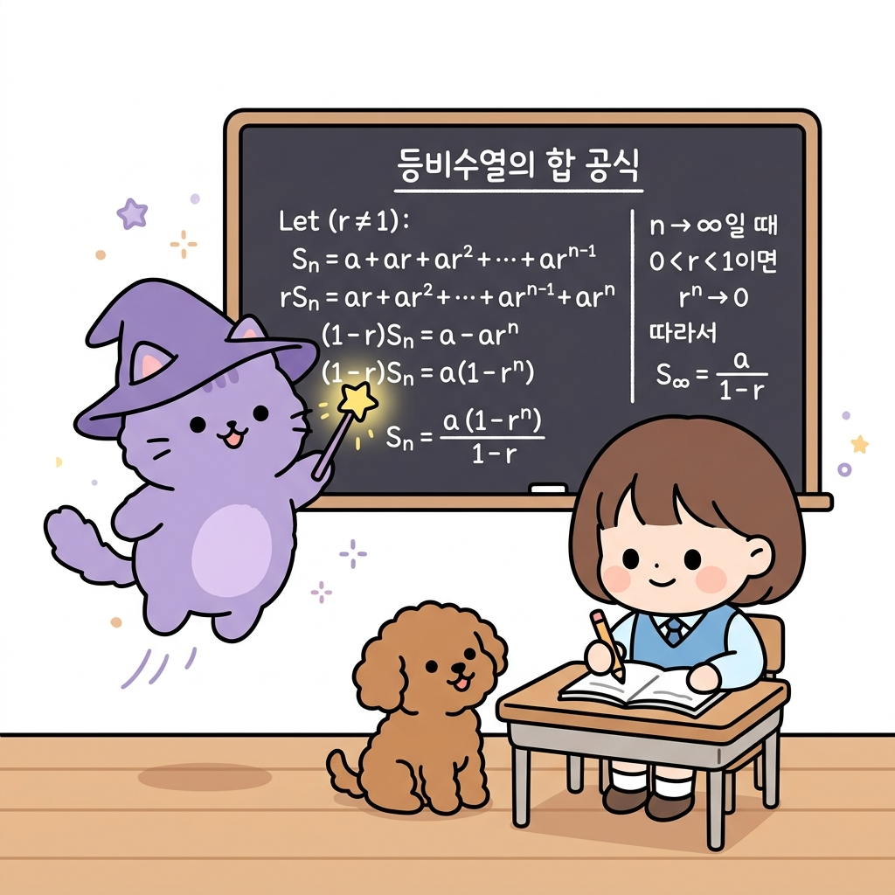

# 02.5 수열과 등비수열의 합

> 이 장에서는 규칙적으로 숫자를 나열한 **수열(Sequence)**의 개념을 정의하고, 보상이 감쇄율에 의해 변화하는 수열들의 총합을 구할 때 사용되는 **등비수열의 합**을 쉽고 체계적으로 배웁니다.

---

## 02.5.1 징검다리를 딛고 올라가는 수의 규칙

강화학습 에이전트가 매 시점마다 환경과 상호작용하며 획득하는 보상값들은 시간의 순서대로 나열된 **수열**과 같습니다.

"지니! 에이전트가 앞으로 무한히 계속해서 보상을 받아 나간다면, 그 보상을 전부 다 합했을 때 값이 무한대로 커져서 에이전트 머리가 터져버리는 거 아냐? 컴퓨터가 무한대 값을 계산할 수는 없잖아!"

도로시가 눈을 둥그렇게 뜨며 물어보았습니다. 토토도 동의한다는 듯 꼬리를 흔들며 멍멍 짖었습니다. 지니는 숲속 연못 위에 둥둥 떠 있는 둥근 징검다리들을 가리키며 마법 요술봉을 흔들었습니다.

"후후, 도로시. 좋은 걱정이야! 하지만 징검다리 디딤돌들의 크기가 갈수록 일정한 비율로 작아진다면 어떻게 될까? 아무리 많은 디딤돌이 늘어서 있어도 건너가야 할 총길이는 결코 무한대로 커지지 않고 하나의 딱 정해진 값으로 수렴하게 된단다. 이걸 수학에서는 **등비수열의 합**이라고 불러."

---

### 1. 학습 목표
- 수열(Sequence)과 일반항, 합의 수학적 기호를 이해한다.
- 등비수열(Geometric Sequence)의 정의와 성질을 안다.
- 등비수열의 합 공식을 활용하여 감쇄율이 적용된 보상 합산의 수렴성을 분석할 수 있다.

---

### 2. 핵심 개념

#### (1) 수열 (Sequence)의 기본 정의
어떤 규칙에 따라 수를 차례대로 나열한 것을 **수열**이라고 합니다.
* **일반항 (*a**n*)**: 수열에서 나열된 각 수들을 **항**이라고 부르며, 첫 번째 항을 *a*1, 두 번째 항을 *a*2, 그리고 *n*번째 항을 **일반항 *a**n***이라고 나타냅니다.
  * *강화학습 연계*: 에이전트가 1회부터 *n*회까지 겪어 얻은 보상의 흐름은 수열 **[*R*1, *R*2, ..., *R**n*]**로 표현됩니다.

**그림 02-5-1** 미래 단계로 한 칸씩 나아갈 때마다 보상의 크기(디딤돌 크기)가 일정 비율로 작아지며 늘어선 수열의 형태를 관찰하는 도로시와 토토

"아! 보상들이 시간 순서대로 나란히 늘어서 있으니까 진짜 징검다리 배열 같네!"

도로시가 디딤돌을 깡충깡충 건너뛰며 외쳤습니다.

---

#### (2) 등비수열 (Geometric Sequence)
첫째항부터 시작하여 차례대로 **일정한 수(공비, *r*)**를 곱하여 만들어지는 수열입니다.
* **일반항 공식**:
  *a**n* = *a*1 × *r**n*-1
* **등비수열의 합 (*S**n*) 공식**:
  첫째항이 *a*, 공비가 *r*인 등비수열의 *n*번째 항까지의 합 *S**n*은 다음과 같습니다.
  *S**n* = *a*(1 - *r**n*) / (1 - *r*)  (단, *r* ≠ 1)

"지니! 만약 공비 *r*이 0.9처럼 1보다 작은 수이고 항의 개수 *n*이 무한대로 커지면 분자의 *r**n*은 어떻게 돼?"

"지수가 무한히 커질수록 그 값은 급격히 작아져 결국 0이 된다고 배웠지? (02.2장 참고) 따라서 *r**n* → 0 이 되므로, 무한히 더한 등비수열의 합은 발산하지 않고 **_*a* / (1 - *r*)_**로 딱 떨어지게 수렴한단다."

**그림 02-5-2** 칠판에 적힌 무한 등비수열 합산 공식을 보고, 공비 r이 1보다 작을 때 수식의 값들이 안전하게 수렴하는 유도 과정을 공부하는 도로시와 지니

"오! 분자의 지수 부분이 통째로 날아가는구나! 그래서 무한히 많이 더해도 가치가 무한대로 폭발하지 않고 안전하게 계산되는 거였어!"

도로시가 감탄했습니다.

---

#### (3) 강화학습 비정상 문제의 가중치 합
비정상 밴디트 문제에서 과거 보상들의 가중치 감쇄항들을 모두 더해보면 다음과 같은 등비수열의 합 형태를 이룹니다.
*S**n* = *α* + *α*(1 - *α*) + *α*(1 - *α*)2 + ... + *α*(1 - *α*)*n*-1
* 이 식은 첫째항 *a* = *α*, 공비 *r* = (1 - *α*) 인 등비수열의 합입니다.
* 등비수열 합 공식에 대입하면:
  *S**n* = *α* [ 1 - (1 - *α*)*n* ] / [ 1 - (1 - *α*) ]
  *S**n* = *α* [ 1 - (1 - *α*)*n* ] / *α* = **1 - (1 - *α*)*n***
* 만약 *n*이 무한히 커진다면 (1 - *α*)*n*은 0에 수렴하므로, 가중치들의 총합은 완벽하게 **1.0**이 됩니다. 즉, 가중치들의 합이 1로 보존되어 가치의 크기가 왜곡되지 않고 안전하게 유지됩니다.

**그림 02-5-3** 과거 데이터들의 가중치 수열을 무한히 더했을 때 정확히 1.0으로 수렴 보존됨을 확인하고 기뻐하는 도로시와 지니, 토토

---

## 02.5.2 실전 예제

### 문제 1 (등비수열의 합 계산)
> 첫째항이 0.3 이고 공비가 0.7 인 등비수열의 3번째 항까지의 합 *S*3의 값을 구하시오. (소수로 답할 것)
>
> **풀이**:
> 등비수열의 3번째 항까지의 나열은 다음과 같습니다:
> - 1번째 항 = 0.3
> - 2번째 항 = 0.3 × 0.7 = 0.21
> - 3번째 항 = 0.3 × 0.72 = 0.3 × 0.49 = 0.147
>
> 세 항의 합을 직접 구합니다:
> *S*3 = 0.3 + 0.21 + 0.147 = 0.657
>
> (공식 대입 시: *S*3 = 0.3 × (1 - 0.73) / (1 - 0.7) = 0.3 × (1 - 0.343) / 0.3 = 1 - 0.343 = 0.657)
>
> **정답**: 0.657

---

## 02.5.3 핵심 요약

1. **수열**은 규칙적인 수의 나열로, 각 수를 항이라 부르고 첫 번째부터 *a*1, *a*2, *a**n* 형태로 쓴다.
2. **등비수열의 합**은 공비 *r* 이 1보다 작을 때, 항의 개수가 무한히 많아지면 결국 분모의 공비 항이 수렴하여 하나의 일정한 경계값에 다다르게 된다.
3. 비정상 밴디트의 지수 이동 평균 가중치 합산식은 공비가 (1 - *α*) 인 등비수열의 합 구조를 띠고 있으며, 그 총합은 무한히 진행 시 항상 **1.0**으로 보존된다.
