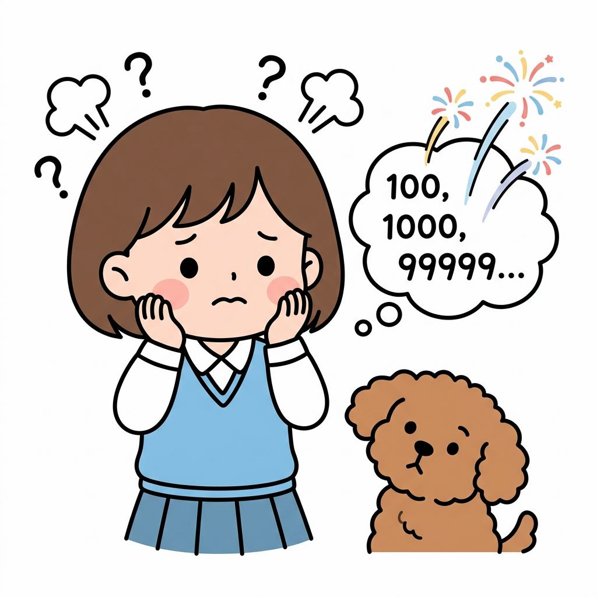
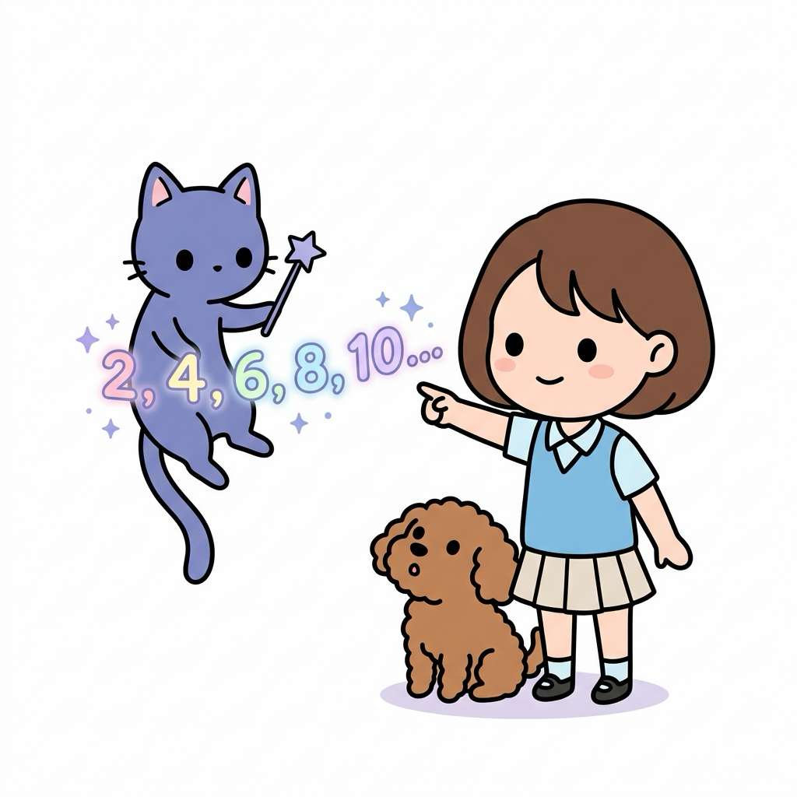
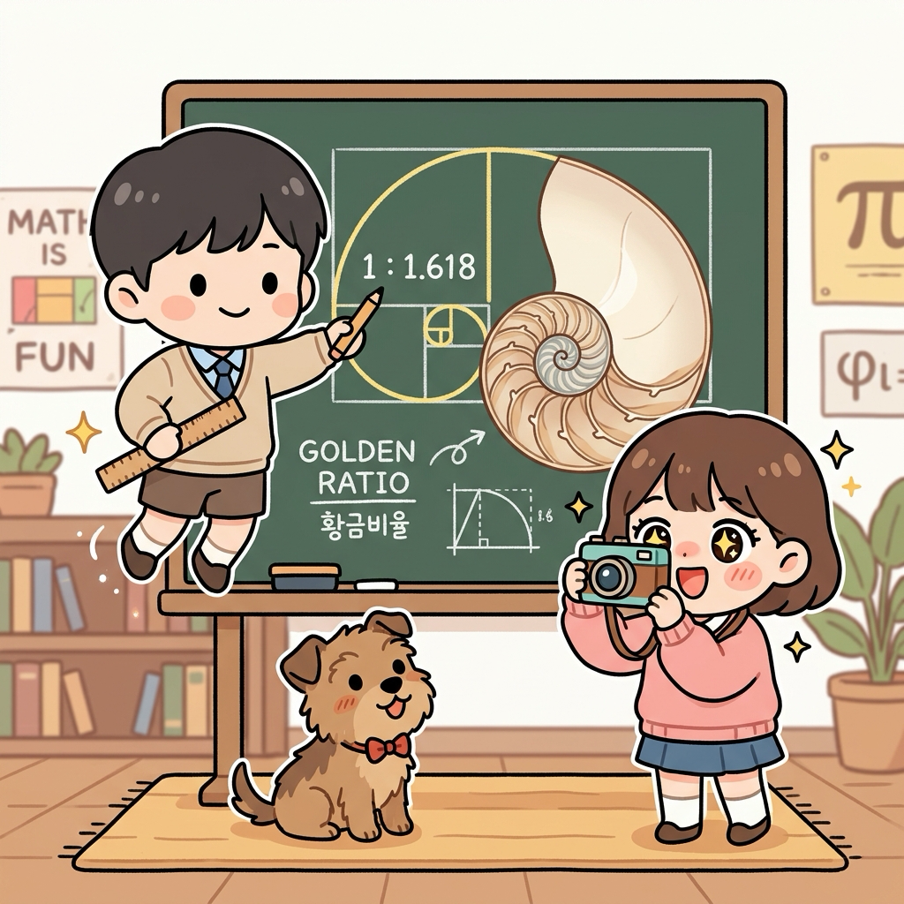
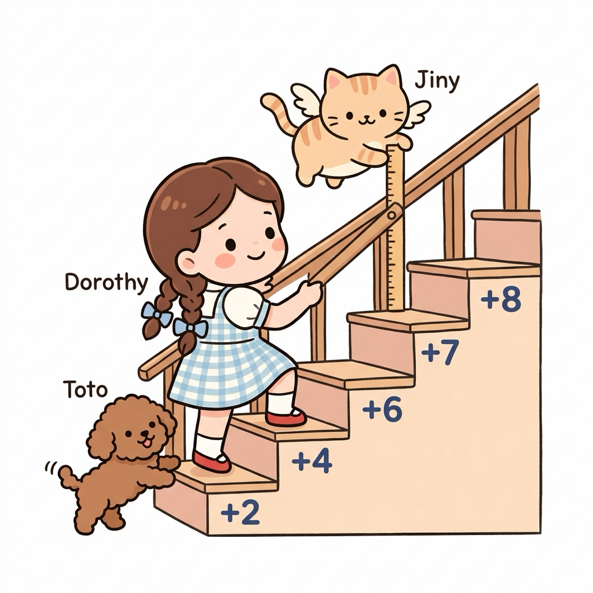
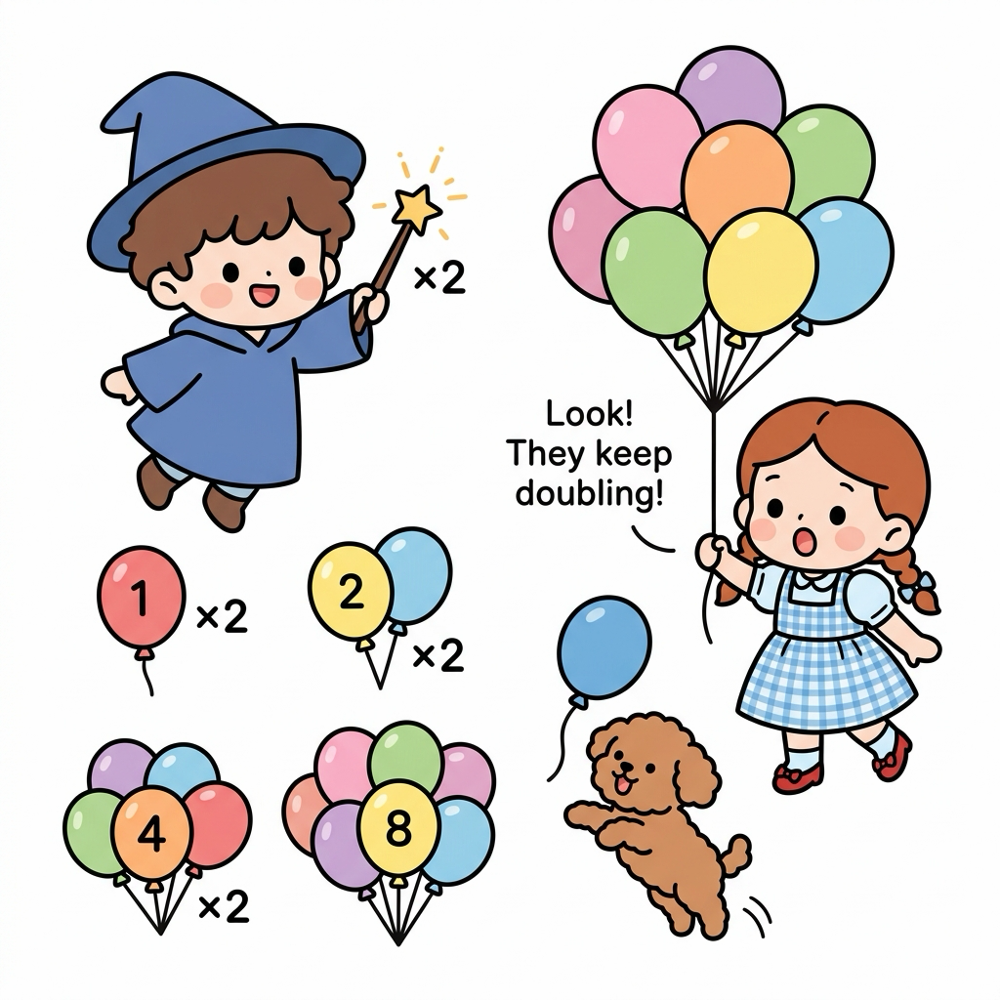
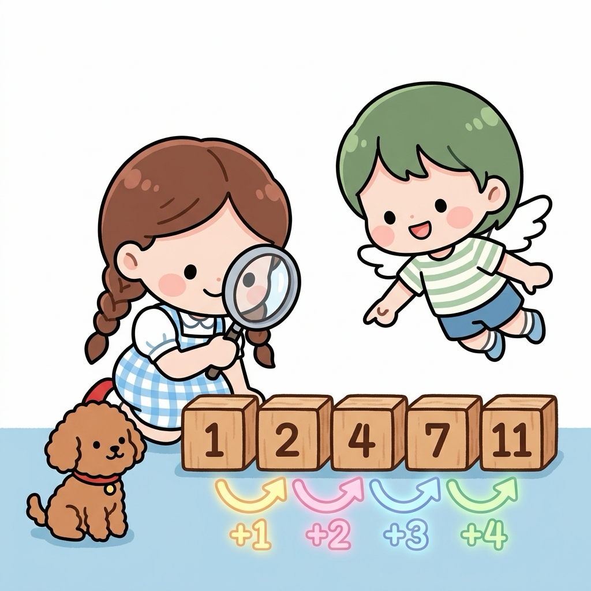
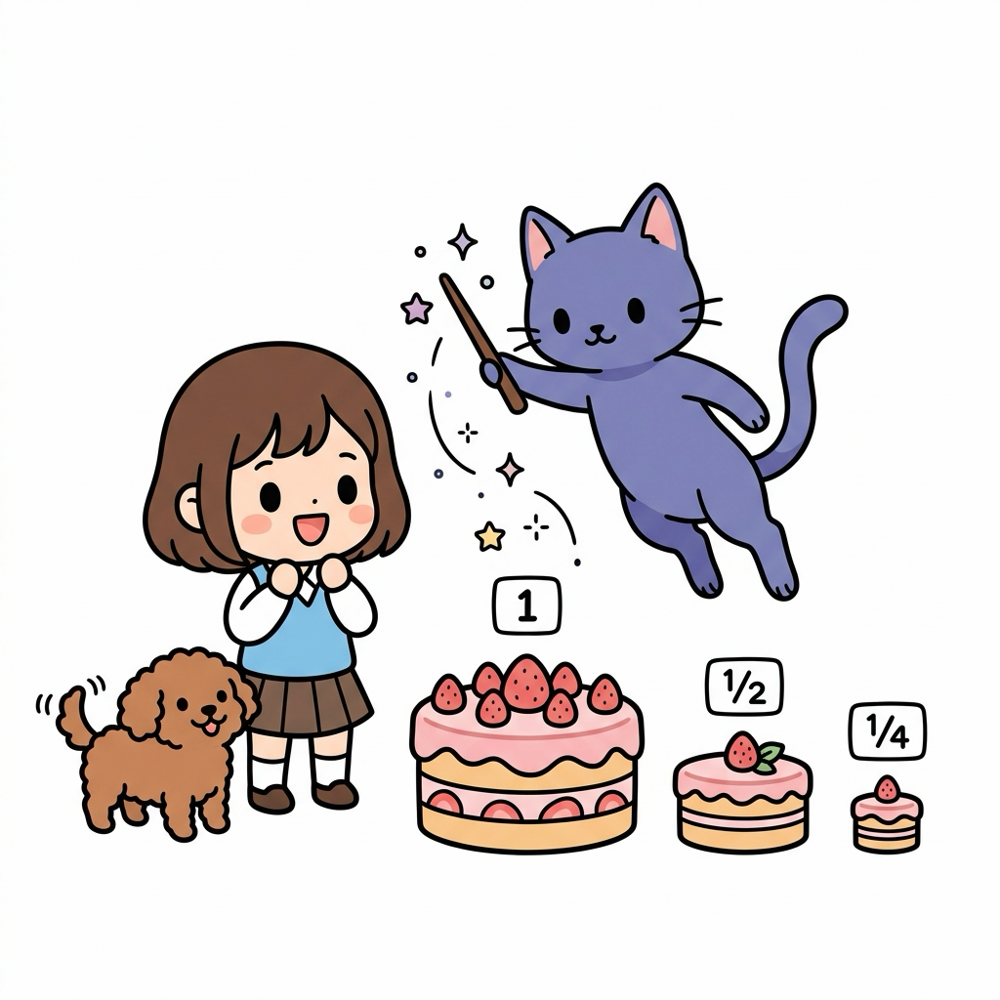
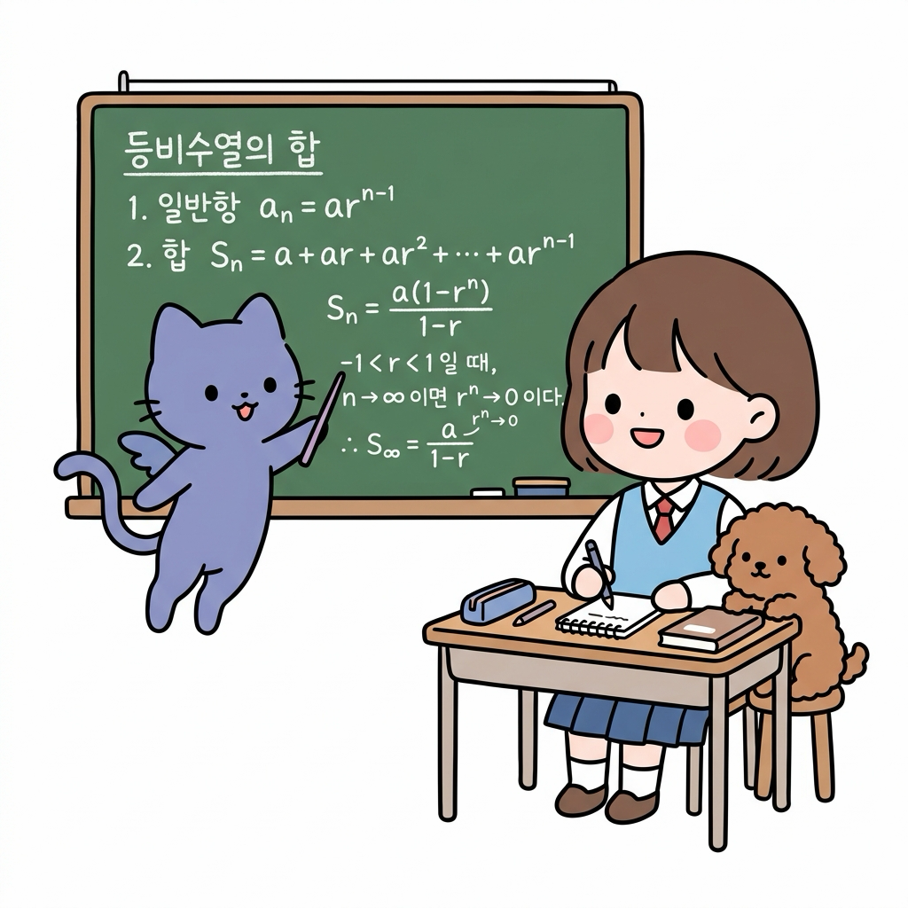
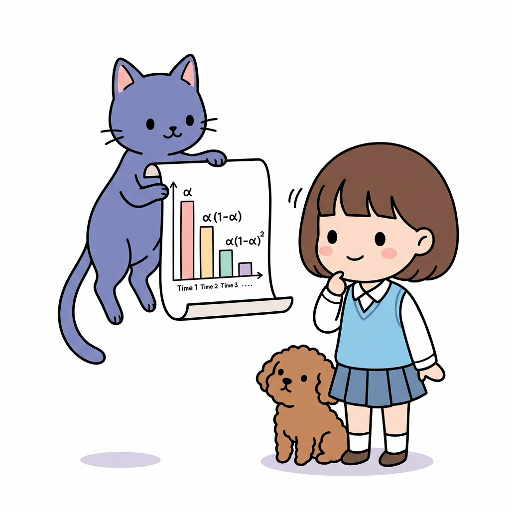
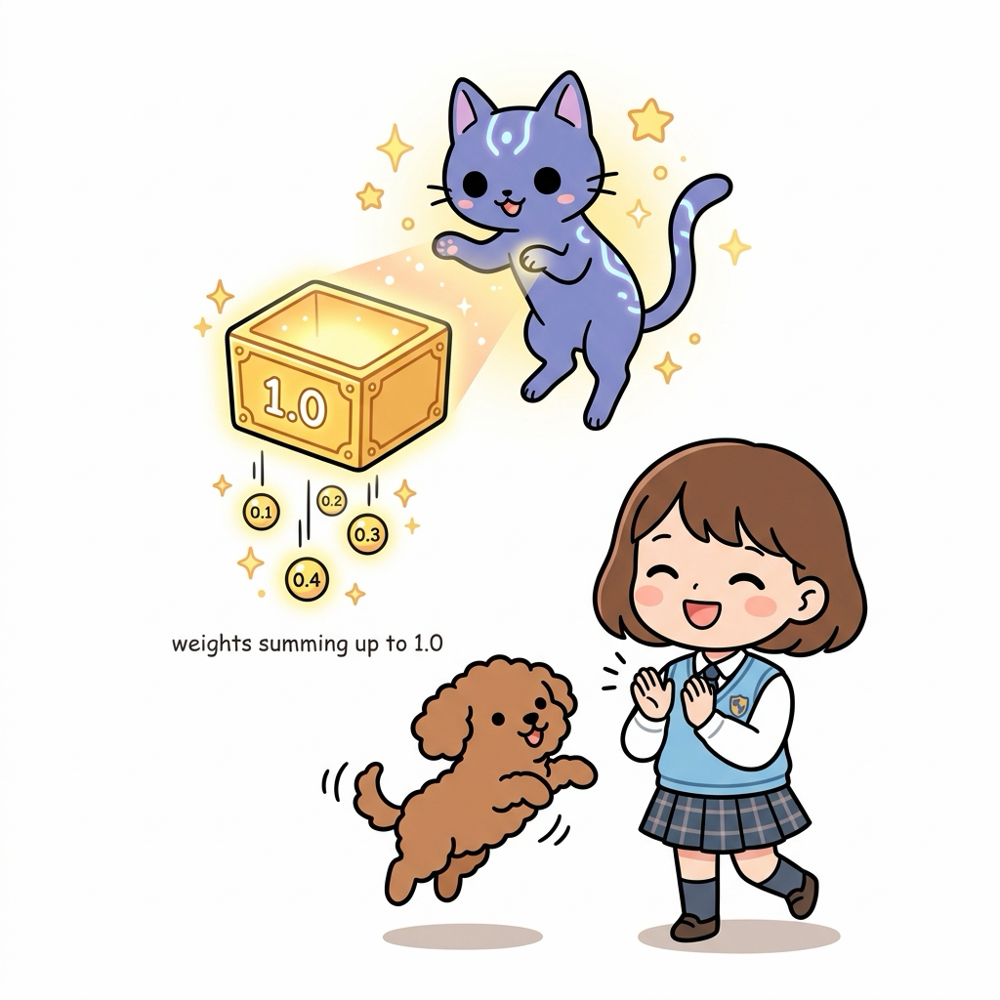

# 02.5 수열과 등비수열의 합

> 이 장에서는 규칙적으로 숫자를 나열한 **수열(Sequence)**의 개념을 정의하고, 보상이 감쇄율에 의해 변화하는 수열들의 총합을 구할 때 사용되는 **등비수열의 합**을 쉽고 체계적으로 배웁니다.

---

## 02.5.1 징검다리를 딛고 올라가는 수의 규칙

강화학습 에이전트가 **매 시점**마다 환경과 상호작용하며 획득하는 보상값들은 시간의 순서대로 나열된 **수열**과 같습니다.

"지니! 에이전트가 앞으로 무한히 계속해서 보상을 받아 나간다면, 그 보상을 전부 다 합했을 때 값이 무한대로 커져서 에이전트 머리가 터져버리는 거 아냐? 컴퓨터가 무한대 값을 계산할 수는 없잖아!"

도로시가 눈을 둥그렇게 뜨며 물어보았습니다. 토토도 동의한다는 듯 꼬리를 흔들며 멍멍 짖었습니다.

**그림 02-5-1** 미래 보상을 무한히 계속 더하면 가치가 폭발적으로 불어나 버릴까 봐 눈을 동그랗게 뜨고 걱정하는 도로시와 토토

지니는 숲속 연못 위에 둥둥 떠 있는 둥근 징검다리들을 가리키며 마법 요술봉을 흔들었습니다.

"후후, 도로시. 좋은 걱정이야! 하지만 징검다리 디딤돌들의 크기가 갈수록 일정한 비율로 작아진다면 어떻게 될까? 아무리 많은 디딤돌이 늘어서 있어도 건너가야 할 총길이는 결코 무한대로 커지지 않고 하나의 딱 정해진 값으로 수렴하게 된단다. 이걸 수학에서는 **등비수열의 합**이라고 불러."

**그림 02-5-2** 미래 단계로 한 칸씩 나아갈 때마다 보상의 크기(디딤돌 크기)가 일정 비율로 작아지며 늘어선 수열의 형태를 관찰하는 도로시와 토토

"아! 보상들이 시간 순서대로 나란히 늘어서 있으니까 진짜 징검다리 배열 같네!"

도로시가 디딤돌을 깡충깡충 건너뛰며 외쳤습니다.

---

## 02.5.2 수열: 규칙적으로 나열된 수의 징검다리

어떤 규칙에 따라 수를 차례대로 나열한 것을 **수열(Sequence)**이라고 합니다.

**그림 02-5-3** 일정한 규칙(짝수 늘어놓기)에 따라 차례대로 수를 나열한 수열의 기초적인 원리를 지니의 마법으로 재미있게 들여다보는 도로시와 토토

### 2.5.2.1 수열과 일반항
수열에서 나열된 각 수들을 **항**이라고 부르며, 첫 번째 항을 *a*1, 두 번째 항을 *a*2, 그리고 *n*번째 항을 **일반항 *an***이라고 나타냅니다.

**그림 02-5-4** 첫 번째 항인 a₁부터 일반항인 an까지 수열의 구성원들을 카드로 매달아 하나씩 살펴보고 기록하는 도로시와 지니, 토토

### 2.5.2.2 강화학습에서의 보상 수열
에이전트가 1회부터 *n*회까지 겪어 얻은 보상의 흐름은 수열 [*R*1, *R*2, ..., *Rn*]로 표현됩니다. 

**그림 02-5-5** 시간의 흐름에 따라 순서대로 떨어지는 보상값들을 차곡차곡 받아내며 하나의 보상 수열을 만드는 도로시와 토토

### 2.5.2.3 피보나치수열: 번식의 원리와 황금비의 비밀

#### 1) 피보나치수열의 기원과 원리
"수열의 세상에는 아주 신비롭고, 어찌 보면 조금 무시무시한 규칙도 있단다."
지니가 요술봉을 휘두르자 칠판에 medieval 복장을 한 피사 출신의 12세기 수학자 **레오나르도 피보나치(Leonardo Fibonacci)**가 나타났습니다.

"피보나치는 이탈리아에 아라비아 숫자를 널리 소개한 아주 훌륭한 수학자야. 그는 토끼의 번식을 간단한 수학적 모델로 설명했단다. 갓 태어난 한 쌍의 토끼가 자라서 매달 새로운 토끼 한 쌍을 낳는 규칙을 시뮬레이션해 보았지."
- **1번째 달**: 처음 태어난 토끼 한 쌍 [1]
- **2번째 달**: 아직 자라나며 준비하는 단계 [1]
- **3번째 달**: 드디어 어른이 되어 새로운 토끼 한 쌍을 출산 [2]
- **4번째 달**: 첫 번째 토끼 쌍이 또 낳고, 두 번째 토끼 쌍은 성숙 대기 [3]
- **5번째 달**: 성숙한 토끼 쌍들이 번식하여 급격히 숫자가 증가 [5]

"우와! 처음 두 항은 1, 1이고 세 번째 항부터는 바로 앞의 두 항을 더해나가는 규칙이네!" 도로시가 외쳤습니다.

- **피보나치수열의 점화식**: *an* = *an-1* + *an-2* (단, *a*1 = 1, *a*2 = 1)
- **수열의 나열**: [1, 1, 2, 3, 5, 8, 13, 21, 34, 55, ...]

"맞아! 이전의 두 상태가 현재 상태에 영향을 주어 폭발적으로 팽창해 나가지. 그래서 이 규칙을 그대로 숲으로 가져오면..."
지니가 손가락을 튕기자, 사방에서 귀엽고 복슬복슬한 하얀 토끼들이 튀어나와 연못 주위를 가득 메우기 시작했습니다. 1쌍에서 시작해 순식간에 수십 쌍으로 번식하며 도로시와 토토를 포위했습니다.
"지니! 멈춰줘! 이러다간 연못이 토끼들로 꽉 차버리겠어!" 도로시가 깜짝 놀라며 토토를 안아 올렸습니다.

**그림 02-5-6** 12세기 수학자 레오나르도 피보나치가 제안한 토끼 번식 모델과 수열의 기본 점화식 원리를 관찰하는 도로시와 지니, 토토

#### 2) 자연 속의 피보나치 수열
"방금 본 토끼 군단은 조금 당황스러웠겠지만, 이 수열은 신기하게도 우리 자연계의 수많은 곳에서 꽃을 피우고 있단다." 지니가 마법으로 토끼들을 다시 되돌려 보낸 뒤, 연못가의 해바라기와 소나무 솔방울을 가리켰습니다.

"해바라기 씨앗이 배열된 모습을 자세히 보면 시계 방향 나선과 반시계 방향 나선이 얽혀 있단다. 이 나선의 개수를 세어보면 각각 21개와 34개, 혹은 34개와 55개처럼 정확히 피보나치수열의 이웃한 두 숫자를 이루고 있어. 솔방울의 비늘 배열이나 식물의 줄기에서 잎이 돋아나는 순서에서도 이 수열이 예외 없이 나타난단다."

"식물들이 햇빛을 골고루 받고, 씨앗을 가장 빽빽하고 안전하게 채우기 위해 수학적 규칙을 스스로 따르고 있는 거네요!" 도로시가 신기한 듯 돋보기를 들고 해바라기 씨앗을 자세히 관찰하며 말했습니다.

**그림 02-5-7** 해바라기 씨앗 나선 배열과 솔방울 비늘 개수 등 자연 도처에 숨겨진 피보나치수열의 아름다운 적용 예제들을 찾아보는 도로시와 지니, 토토

#### 3) 황금비(Golden Ratio)와의 관계
"더 나아가서 피보나치수열은 인류가 발견한 가장 완벽한 비율인 **황금비(Golden Ratio)**와 맞닿아 있단다." 지니가 마법으로 칠판 위에 신비롭고 정교한 앵무조개(Nautilus)의 껍데기 단면과 황금 나선을 그렸습니다.

"피보나치수열에서 이웃한 두 항의 비율(*an* ÷ *an-1*)을 점점 계산해 보자. 1÷1=1, 2÷1=2, 3÷2=1.5, 5÷3=1.666..., 8÷5=1.6, 13÷8=1.625... 뒤로 갈수록 이 비율은 놀랍게도 **1 : 1.618...**이라는 완벽한 황금 비율로 무한히 수렴하게 된단다."

"아! 이 나선의 팽창 비율이 정확히 1.618이 되는군요! 앵무조개 껍데기뿐만 아니라 태풍의 눈, 은하의 소용돌이 형태에서도 이 아름다운 황금비 나선이 나타나요." 도로시가 눈을 반짝이며 카메라로 황금 나선 그림을 찍었습니다.

"그렇단다. 자연이 가장 안정적이면서도 아름다운 성장을 도모하기 위해 선택한 황금비가, 결국 단순한 앞뒤 항의 덧셈 수열에서 유도된다는 것이 수학의 경이로움이지."

**그림 02-5-8** 피보나치수열의 비율 수렴을 통해 유도되는 황금비(1:1.618) 및 자연계의 대표적인 기하학적 형태인 황금나선을 공부하는 도로시와 지니, 토토

---

## 02.5.3 수열의 다양한 얼굴들: 수열의 종류와 특징

"지니, 그런데 세상에는 숫자를 곱하기만 하는 수열만 있는 거야? 다른 규칙을 가진 수열들은 없어?"
도로시가 궁금하다는 듯 고개를 갸웃거리며 물었습니다.

**그림 02-5-9** 등비수열 외에 다른 규칙을 가진 수열들도 있는지 호기심 가득한 눈으로 질문하는 도로시와 토토

"당연히 아니지! 수열은 규칙을 정하기 나름이라 아주 많은 종류가 있단다. 그중 가장 기본적이고 대표적인 것들을 칠판에 정리해 줄게." 지니가 요술봉으로 칠판을 톡톡 두드리자 여러 규칙적인 수들이 나타났습니다.

**그림 02-5-10** 지니가 요술봉을 휘두르자 온갖 규칙적인 수들의 배열이 화려한 마법처럼 펼쳐지는 모습을 구경하는 도로시와 토토

#### 1. 등차수열(Arithmetic Sequence)
- **정의**: 첫째항부터 시작하여 차례대로 **일정한 수(공차, *d*)**를 더하여 만들어지는 수열입니다.
- **예시**: [2, 4, 6, 8, 10, ...] (공차 *d* = 2)
- **상세 설명**: 등차수열은 마치 일정한 간격으로 놓인 계단을 하나씩 밟고 올라가는 것과 같습니다. 첫 번째 계단이 2m 높이라면, 그 다음은 4m, 6m, 8m처럼 항상 2m씩 동일한 높이로 증가합니다. 이처럼 매 단계마다 더해지는 일정한 차이를 공통의 차이라는 의미에서 **공차(*d*)**라고 부릅니다.

**그림 02-5-11** 일정한 공차 d = 2 만큼 매번 동일하게 높아지는 계단을 오르며 등차수열의 규칙을 몸소 체험하는 도로시와 지니, 토토

#### 2. 등비수열(Geometric Sequence)
- **정의**: 첫째항부터 시작하여 차례대로 **일정한 수(공비, *r*)**를 곱하여 만들어지는 수열입니다.
- **예시**: [3, 6, 12, 24, 48, ...] (공비 *r* = 2)
- **상세 설명**: 등비수열은 일정한 비율로 폭발적으로 늘어나거나 줄어드는 마법 같은 수열입니다. 예를 들어 풍선 하나가 매 단계마다 2배로 불어난다면, 1개에서 시작한 풍선은 2개, 4개, 8개로 급격하게 불어납니다. 이처럼 차례대로 곱해지는 공통의 비율을 **공비(*r*)**라고 부르며, 강화학습에서는 미래 보상의 가치를 시간에 따라 줄여나가는 감쇄인자(Discount Factor)로 유용하게 쓰입니다.

**그림 02-5-12** 마법을 부려 도로시가 든 풍선의 개수를 매번 2배씩 늘려나가며 등비수열(공비 r = 2)의 기하급수적인 팽창을 보여주는 지니와 토토

#### 3. 조화수열(Harmonic Sequence)
- **정의**: 각 항의 **역수(Reciprocal)**가 등차수열을 이루는 수열입니다.
- **예시**: [1, 1/2, 1/3, 1/4, 1/5, ...] (역수를 취하면 [1, 2, 3, 4, 5, ...]로 공차가 1인 등차수열이 됨)
- **상세 설명**: 조화수열은 자연계의 주파수나 소리의 어울림을 설명할 때 쓰이는 아름다운 규칙입니다. 실로폰이나 거문고 등의 악기에서 소리를 내는 진동체(줄이나 건반)의 길이를 1, 1/2, 1/3, 1/4배 등으로 점점 줄여나가면, 조화롭고 아름다운 음계가 연주됩니다. 이 수열 자체는 얼핏 불규칙해 보이지만, 분모와 분자를 뒤집는 역수 연산을 적용하면 분모가 예쁜 등차수열이 되는 숨겨진 수학적 질서를 가집니다.

**그림 02-5-13** 분모가 1, 2, 3, 4, 5로 늘어나며 아름다운 화음을 만드는 실로폰 건반 길이의 조화수열을 연주하는 도로시와 지휘하는 지니, 듣고 있는 토토

#### 4. 계차수열(Difference Sequence)
- **정의**: 어떤 수열의 이웃하는 두 항의 **차(Difference)**로 이루어진 새로운 수열이 특정한 규칙을 따르는 수열입니다.
- **예시**: [1, 2, 4, 7, 11, 16, ...] (항들의 차이가 [1, 2, 3, 4, 5, ...]인 등차수열을 이룸)
- **상세 설명**: 계차수열은 수열 속에 또 다른 규칙적인 수열이 보물찾기처럼 숨어 있는 흥미진진한 수열입니다. 예시로 나온 [1, 2, 4, 7, 11] 수열에서 이웃한 값들을 서로 빼보면 그 차이가 각각 1, 2, 3, 4로 늘어납니다. 이처럼 인접한 항들끼리의 차(계차)를 구해 늘어놓았을 때, 그 계차들이 스스로 또 다른 예쁜 수열(예: 등차수열이나 등비수열)을 이루고 있을 때 이를 계차수열이라고 합니다.

**그림 02-5-14** 숫자 블록들의 차이가 +1, +2, +3, +4로 규칙적으로 늘어나는 계차의 흐름을 돋보기로 추적하며 계차수열의 구조를 확인하는 도로시와 지니, 토토

"우와! 규칙을 다르게 주니까 완전히 다른 개성을 가진 수열들이 태어나네요! 등비수열은 그중 한 종류일 뿐이었어."
도로시가 칠판의 요약표를 보며 고개를 끄덕였습니다.

**그림 02-5-15** 등차수열, 등비수열, 조화수열 등 수열의 여러 가지 종류와 각 수열이 가지는 독특한 특징적 변화 그래프를 지니와 함께 살펴보는 도로시와 토토

---

## 02.5.4 등비수열: 일정하게 작아지는 마법

첫째항부터 시작하여 차례대로 **일정한 수(공비, *r*)**를 곱하여 만들어지는 수열입니다.

### 2.5.4.1 일반항 공식
첫째항이 *a*이고 공비가 *r*일 때, *n*번째 항 *an*은 다음과 같습니다:
*an* = *a* × *r**n*-1

**그림 02-5-16** 첫 번째 케이크를 기준으로 매 단계마다 2분의 1 비율로 작아지며 등비수열의 규칙을 보여주는 지니의 마법과 도로시, 토토

---

## 02.5.5 등비수열의 합과 무한의 수렴성

### 2.5.5.1 등비수열의 합 공식

첫째항이 *a*, 공비가 *r*인 등비수열의 *n*번째 항까지의 합 *Sn*은 다음과 같습니다:
*Sn* = *a* × (1 - *r**n*) ÷ (1 - *r*)  (단, *r* ≠ 1)

"지니! 만약 공비 *r*이 0.9처럼 1보다 작은 수이고 항의 개수 *n*이 무한대로 커지면 분자의 *r**n*은 어떻게 돼?"

"지수가 무한히 커질수록 그 값은 급격히 작아져 결국 0이 된다고 배웠지? 따라서 *r**n* ➔ 0 이 되므로, 무한히 더한 등비수열의 합은 발산하지 않고 **_*a* ÷ (1 - *r*)_**로 딱 떨어지게 수렴한단다."

**그림 02-5-17** 칠판에 적힌 무한 등비수열 합산 공식을 보고, 공비 *r*이 1보다 작을 때 수식의 값들이 안전하게 수렴하는 유도 과정을 공부하는 도로시와 지니, 토토

"오! 분자의 지수 부분이 통째로 날아가는구나! 그래서 무한히 많이 더해도 가치가 무한대로 폭발하지 않고 안전하게 계산되는 거였어!"

도로시가 감탄했습니다.

---

## 02.5.6 강화학습 지수 이동 평균과 가중치 보존

### 2.5.6.1 비정상 문제와 과거 가중치

비정상 밴디트 문제에서 과거 보상들의 가중치 감쇄항들을 모두 더해보면 다음과 같은 등비수열의 합 형태를 이룹니다:

*Sn* = *α* + *α* × (1 - *α*) + *α* × (1 - *α*)2 + ... + *α* × (1 - *α*)*n*-1

이 식은 첫째항 *a* = *α*, 공비 *r* = (1 - *α*) 인 등비수열의 합입니다.

**그림 02-5-18** 시간이 지남에 따라 가중치의 크기가 일정 비율(1 - *α*)로 감쇄하며 줄어드는 가중치 등비수열을 지니와 함께 관찰하는 도로시와 토토

### 2.5.6.2 가중치 합의 1.0 보존
등비수열 합 공식에 대입하면 다음과 같습니다:

*Sn* = *α* × [ 1 - (1 - *α*)*n* ] ÷ [ 1 - (1 - *α*) ]
*Sn* = *α* × [ 1 - (1 - *α*)*n* ] ÷ *α* = **1 - (1 - *α*)*n***

만약 *n*이 무한히 커진다면 (1 - *α*)*n*은 0에 수렴하므로, 가중치들의 총합은 완벽하게 **1.0**이 됩니다. 즉, 가중치들의 합이 1로 보존되어 가치의 크기가 왜곡되지 않고 안전하게 유지됩니다.

**그림 02-5-19** 과거 데이터들의 가중치 수열을 무한히 더했을 때 정확히 1.0으로 수렴 보존됨을 확인하고 기뻐하는 도로시와 지니, 토토

---

## 02.5.7 실전 예제

학습한 내용을 바탕으로 다음 문제를 직접 해결해 봅시다.

### 문제 1 (등비수열의 합 계산)

첫째항이 0.3 이고 공비가 0.7 인 등비수열의 3번째 항까지의 합 *S*3의 값을 구하시오. (소수로 답할 것)

> **풀이**:
>등비수열의 3번째 항까지의 나열은 다음과 같습니다:
> - 1번째 항 = 0.3
> - 2번째 항 = 0.3 × 0.7 = 0.21
> - 3번째 항 = 0.3 × 0.72 = 0.3 × 0.49 = 0.147
> 
> 세 항의 합을 직접 구합니다:
>*S*3 = 0.3 + 0.21 + 0.147 = 0.657
> 
> (공식 대입 시: *S*3 = 0.3 × (1 - 0.73) ÷ (1 - 0.7) = 0.3 × (1 - 0.343) ÷ 0.3 = 1 - 0.343 = 0.657)
>
> **정답**: 0.657

---

## 02.5.8 핵심 요약

**그림 02-5-20** 수열의 정의, 등비수열의 합 공식, 그리고 강화학습에서의 가중치 보존 수렴성까지 배움을 완수하고 졸업장을 든 지니와 도로시, 토토의 기념사진

1. **수열**은 규칙적인 수의 나열로, 각 수를 항이라 부르고 첫 번째부터 *a*1, *a*2, *an* 형태로 쓴다.
2. **등비수열의 합**은 공비 *r*이 1보다 작을 때, 항의 개수가 무한히 많아지면 결국 분모의 공비 항이 수렴하여 하나의 일정한 경계값에 다다르게 된다.
3. 비정상 밴디트의 지수 이동 평균 가중치 합산식은 공비가 (1 - *α*) 인 등비수열의 합 구조를 띠고 있으며, 그 총합은 무한히 진행 시 항상 **1.0**으로 보존된다.
