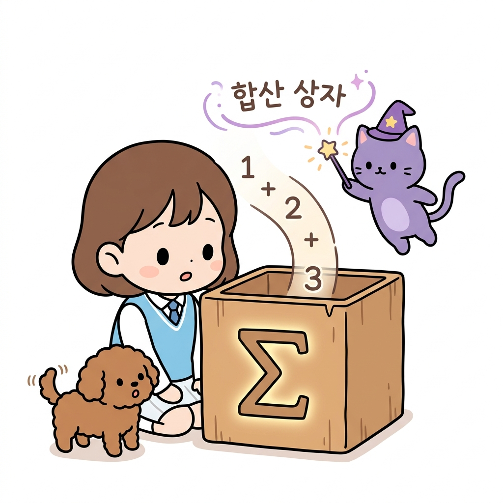
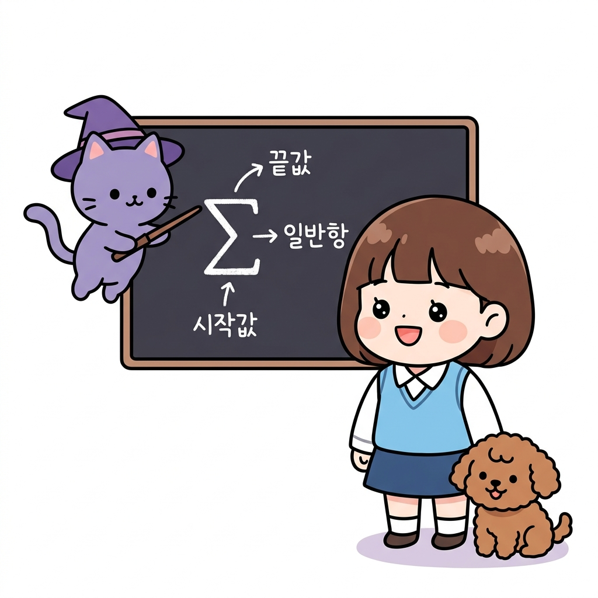

# 02.6 시그마(Σ) 기호와 합 공식

> 이 장에서는 여러 수들의 나열을 합하는 기호인 **시그마(Σ)**의 뜻과 구조, 성질을 학습하고, 강화학습의 중심인 벨만 기대 방정식에 나타나는 기댓값 합산 표기를 자유자재로 해독하고 다루는 기초 체력을 기릅니다.

---

## 02.6.1 마법의 합산 기호 시그마(Σ)와 조우하기

수십, 수만 개의 행동 가치나 상태 가치들의 합을 구해야 할 때, 식을 길게 늘어놓는 것은 매우 지루하고 복잡한 일입니다.

"지니! 책에 나오는 공식을 보는데 수식이 너무 길고 복잡해! 덧셈 기호가 끝도 없이 늘어서 있어서 보는 것만으로도 머리가 어지러워."

도로시가 책을 짚으며 울상을 지었습니다. 토토도 끙끙 앓는 소리를 내며 도로시의 옷자락을 당겼습니다. 지니는 눈을 찡긋하고는 허공에 요술봉을 흔들더니 커다란 상자 하나를 소환했습니다. 상자의 전면에는 신비로운 그리스 문자 **Σ**가 환하게 빛나고 있었습니다.

"도로시, 걱정 마! 수학에는 아주 긴 덧셈 식을 단 하나의 기호로 압축해주는 훌륭한 **'합산 상자'**가 있단다. 바로 그리스 대문자 **시그마(Σ)**지! 숫자가 상자 안으로 들어가면 덧셈 기호(`+`)로 엮여서 톡 튀어나오는 마법을 부린단다."

**그림 02-6-1** 긴 수식의 나열을 마법처럼 압축하여 합산해주는 시그마(Σ) 상자를 구경하는 지니와 도로시, 토토

"우와! 여러 개의 숫자들이 상자 안으로 들어가서 다 더해지다니, 정말 편리한 기호네!"

도로시가 신기해하며 눈을 반짝였습니다.

---

### 1. 학습 목표
- 합의 기호 시그마(∑)의 정의와 구성(시작값, 끝값, 일반항)을 이해한다.
- 시그마의 기본 연산 성질(실수배, 덧셈/뺄셈의 분배)을 마스터한다.
- 벨만 방정식 속 행동(*a*) 및 다음 상태(*s'*)의 총합 연산 구조를 시그마를 사용해 올바르게 해독한다.

---

### 2. 핵심 개념

#### (1) 합의 기호 시그마 (∑)의 뜻과 표기법
수열의 첫째항부터 *n*번째 항까지의 합을 기호 **∑**를 사용하여 다음과 같이 단순화하여 나타냅니다.
* **수식 표기**:
  ∑*i*=1*n* *a**i* = *a*1 + *a*2 + *a*3 + ... + *a**n*

"지니! 이 기호에 붙어 있는 글자들은 각각 무슨 뜻이야?"

지니가 칠판을 가리키며 화살표를 띄웠습니다.

**그림 02-6-2** 합의 기호 시그마(∑)의 위와 아래, 오른쪽에 위치한 구성 요소들의 위치와 역할 정리

* **∑ (시그마)**: 합한다는 의미인 Summation의 첫 글자 **S**에 해당하는 그리스 문자 대문자입니다.
* **아래첨자 (*i*=1)**: 합을 시작할 첫 번째 항 번호(시작값)를 지정합니다.
* **위첨자 (*n*)**: 합을 멈출 마지막 항 번호(끝값)를 지정합니다.
* ***a**i***: 합산할 수열의 일반항을 지정합니다.

"아! 밑에 있는 숫자부터 위에 있는 숫자까지 하나씩 늘려가면서 오른쪽에 있는 식을 다 더하라는 마법 명령어구나!"

도로시가 똑 부러지게 요약했습니다.

---

#### (2) 시그마의 주요 성질 (Properties of Sigma)
시그마 기호는 덧셈의 연산 성질을 고스란히 따르기 때문에, 다음과 같은 편리한 분리 규칙을 쓸 수 있습니다.
1. **합과 차의 분배**:
   ∑ (*a**i* ± *b**i*) = ∑ *a**i* ± ∑ *b**i*
   * *해설*: 식끼리 더하거나 뺀 것의 총합은, 각각의 총합을 구한 뒤 더하거나 빼는 것과 같습니다.
2. **실수배의 분리**:
   ∑ *c* × *a**i* = *c* × ∑ *a**i* (단, *c*는 상수)
   * *해설*: 모든 항에 곱해진 상수 *c*는 합산 기호 앞으로 꺼내어, 마지막에 딱 한 번만 곱해줘도 됩니다.
3. **상수만의 합**:
   ∑*i*=1*n* *c* = *c* × *n*
   * *해설*: 변수가 없는 상수 *c*를 *n*번 반복해서 더하므로 단순 곱셈이 됩니다.

---

#### (3) 벨만 기대 방정식 속의 시그마 읽기
실제 강화학습의 뼈대 공식인 벨만 기대 방정식에는 이 시그마 기호가 복합적으로 나타납니다.

***v*(*s*) = ∑*a* *π*(*a*|*s*) [ *R**s**a* + *γ* ∑*s'* *P*(*s'*|*s*, *a*) *v*(*s'*) ]**

"지니, 여기서는 밑에 아래첨자만 있고 위에 끝값이 안 보여!"

"날카로운 관찰이야! 강화학습에서는 일일이 숫자를 쓰는 대신, 아래첨자에 변수(예: 행동 *a*, 다음 상태 *s'*)만 적어서 **'선택 가능한 모든 행동'** 또는 **'이동 가능한 모든 다음 상태'** 전체에 대해 다 더하라는 뜻으로 축약하여 사용한단다."

* **첫 번째 시그마 (∑*a*)**:
  현재 상태 *s*에서 에이전트가 고를 수 있는 모든 행동 *a*에 대하여, 정책 확률 *π*(*a*|*s*)를 반영한 행동 가치의 가중합(평균)을 계산하라는 뜻입니다.
* **두 번째 시그마 (∑*s'*)**:
  행동 *a*를 취했을 때 도달할 수 있는 모든 다음 상태 *s'*에 대하여, 상태 전이 확률 *P*(*s'*|*s*, *a*)를 곱한 다음 상태 가치의 가중합을 계산하라는 뜻입니다.

"아! 시그마 덕분에 복잡한 모든 경로의 가치 계산 평균을 저렇게 한 줄로 우아하게 요약할 수 있는 거였네!"

도로시가 기뻐하며 토토를 안아주었습니다.

---

## 02.6.2 실전 예제

### 문제 1 (시그마 기호 계산)
> 다음 시그마 기호의 연산 결과를 구하시오.
> ∑*i*=13 (2 × *i* - 1)
>
> **풀이**:
> 변수 *i*에 1부터 3까지 대입하며 차례로 더해 나갑니다.
> - *i* = 1 일 때: 2 × 1 - 1 = 1
> - *i* = 2 일 때: 2 × 2 - 1 = 3
> - *i* = 3 일 때: 2 × 3 - 1 = 5
>
> 따라서 총합은 다음과 같습니다:
> ∑*i*=13 (2 × *i* - 1) = 1 + 3 + 5 = 9
>
> **정답**: 9

---

## 02.6.3 핵심 요약

1. **시그마 기호(∑)**는 여러 항들을 차례대로 더해 나갈 때, 이를 짧은 하나의 기호로 압축 표기하는 연산 도구이다.
2. 아래첨자는 합산을 시작하는 변수의 초깃값(시작 항 번호)을 나타내고, 위첨자는 합산을 멈추는 최종 경계값(끝 항 번호)을 의미한다.
3. 시그마는 곱해진 상수를 기호 밖으로 분리하거나, 덧셈/뺄셈을 쪼개어 처리할 수 있는 대수적 선형 성질을 가지며, 이는 벨만 방정식의 상태/행동 가중합 계산에 직결된다.
