# 02.6 시그마(Σ) 기호와 합 공식

> 이 장에서는 여러 수들의 나열을 합하는 기호인 **시그마(Σ)**의 뜻과 구조, 성질을 학습하고, 강화학습의 중심인 벨만 기대 방정식에 나타나는 기댓값 합산 표기를 자유자재로 해독하고 다루는 기초 체력을 기릅니다.


---


## 02.6.1 덧셈 상자 속으로: 합의 기호 시그마(Σ)와의 만남

수십, 수만 개의 행동 가치나 상태 가치들의 합을 구해야 할 때, 식을 길게 늘어놓는 것은 매우 지루하고 복잡한 일입니다.


"지니! 책에 나오는 공식을 보는데 수식이 너무 길고 복잡해! 덧셈 기호가 끝도 없이 늘어서 있어서 보는 것만으로도 머리가 어지러워."

도로시가 책을 짚으며 울상을 지었습니다. 


**그림 02-6-1** 긴 수식의 나열과 덧셈 기호가 끝없이 늘어선 것을 보고 머리가 어지러워 어질어질해진 도로시와 걱정하는 토토


토토도 끙끙 앓는 소리를 내며 도로시의 옷자락을 당겼습니다. 지니는 눈을 찡긋하고는 허공에 요술봉을 흔들더니 커다란 상자 하나를 소환했습니다. 상자의 전면에는 신비로운 그리스 문자 **Σ**가 환하게 빛나고 있었습니다.


"도로시, 걱정 마! 수학에는 아주 긴 덧셈 식을 단 하나의 기호로 압축해주는 훌륭한 **'합산 상자'**가 있단다. 바로 그리스 대문자 **시그마(Σ)**지! 숫자가 상자 안으로 들어가면 덧셈 기호(`+`)로 엮여서 톡 튀어나오는 마법을 부린단다."


**그림 02-6-2** 긴 수식의 나열을 마법처럼 압축하여 합산해주는 시그마(Σ) 상자를 구경하는 지니와 도로시, 토토


"우와! 여러 개의 숫자들이 상자 안으로 들어가서 다 더해지다니, 정말 편리한 기호네!"

도로시가 신기해하며 눈을 반짝였습니다.


---


## 02.6.2 시그마의 해부학: 시작값, 끝값, 그리고 일반항

수열의 첫째항부터 *n*번째 항까지의 합을 기호 **Σ**를 사용하여 나타낼 때는 상자의 각 자리에 알맞은 규칙을 명시해 주어야 합니다.


"지니! 이 기호에 붙어 있는 글자들은 각각 무슨 뜻이야?"

지니가 칠판을 가리키며 요술봉으로 구성 요소들을 하나씩 지목해 주었습니다.


"시그마 기호는 세 가지 중요한 단서로 이루어져 있어. 각각 어디서 시작하고, 어디서 끝내며, 어떤 형태의 숫자를 더할지 알려주는 나침반이지."


**그림 02-6-3** 시작점, 끝점, 나아갈 형태(일반항)를 알려주는 시그마(Σ) 모양의 나침반을 관찰하며 앞으로 걸어갈 경로를 모색하는 도로시와 지니, 토토


---


### 2.6.2.1 시그마의 세 가지 정보 단서

시그마의 구조는 마치 세 조각의 조각 정보가 하나로 모여 완전한 길을 가리키는 나침반 지형도와 같습니다. 각각의 구성 요소는 저마다의 흥미로운 기원과 결정적인 역할을 맡고 있습니다.


#### 1) 몸체: 합의 기호 시그마(Σ)의 유래
> 시그마 기호 **Σ**는 그리스 문자 알파벳의 대문자이며, 영어의 알파벳 **S**에 해당하는 글자입니다. 

"도로시, 영어에서 '합계'를 뜻하는 단어가 무엇이지?" 지니가 칠판에 큰 글씨를 쓰며 물었습니다.
"음, Summation(합계) 또는 Sum(합산)이요!"

"맞아! 그 Summation의 머리글자인 **S**를 그리스 문자 대문자로 바꿔 쓴 것이 바로 **Σ(시그마)** 란다. 18세기 위대한 수학자 레온하르트 오일러(Leonhard Euler)가 이 기호를 사용하기 시작하면서 전 세계 수학책에 합을 뜻하는 공식 표준 기호로 당당하게 자리매김했지."

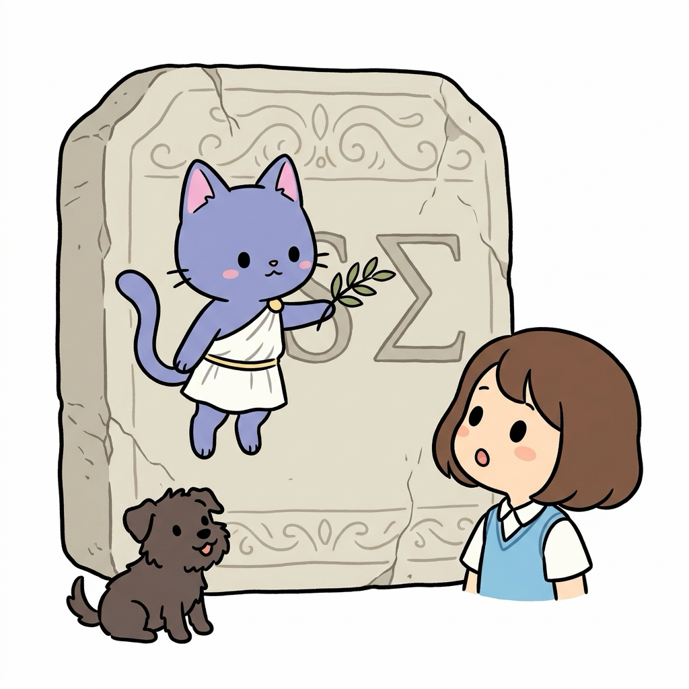
**그림 02-6-4** 그리스 문자의 역사적 배경과 합계(Summation)를 상징하는 시그마(Σ) 기호의 유래를 고대 석판을 통해 알아보는 지니와 도로시, 토토


---


#### 2) 한계: 아래첨자(시작값)와 위첨자(끝값)의 역할
시그마 기호의 아래와 위에는 합산을 수행할 **범위(경계선)**가 표시됩니다.
* **아래쪽 첨자 (*i* = 1)**: 합산을 시작할 '시작값'을 설정합니다. 여기에 등장하는 문자 *i*는 합산을 하나씩 세어주는 카운터 역할을 담당하므로 **루프 인덱스(Index)** 혹은 **루프 변수**라고 부릅니다.
* **위쪽 첨자 (*n*)**: 합산을 최종적으로 멈출 '끝값'을 설정합니다.


"아! 그러니까 레이스 경주로 치면 아래첨자는 출발선이고, 위첨자는 결승선인 셈이군요!" 도로시가 외치자 토토가 꼬리를 세차게 흔들었습니다.

지니가 고개를 끄덕였습니다. "정확해! 카운터 변수 *i*는 출발선 1부터 시작해 발걸음을 뗄 때마다 1씩 정직하게 증가하면서 결승선 *n*에 도달할 때까지 멈추지 않고 징검다리를 하나씩 전부 계산한단다."

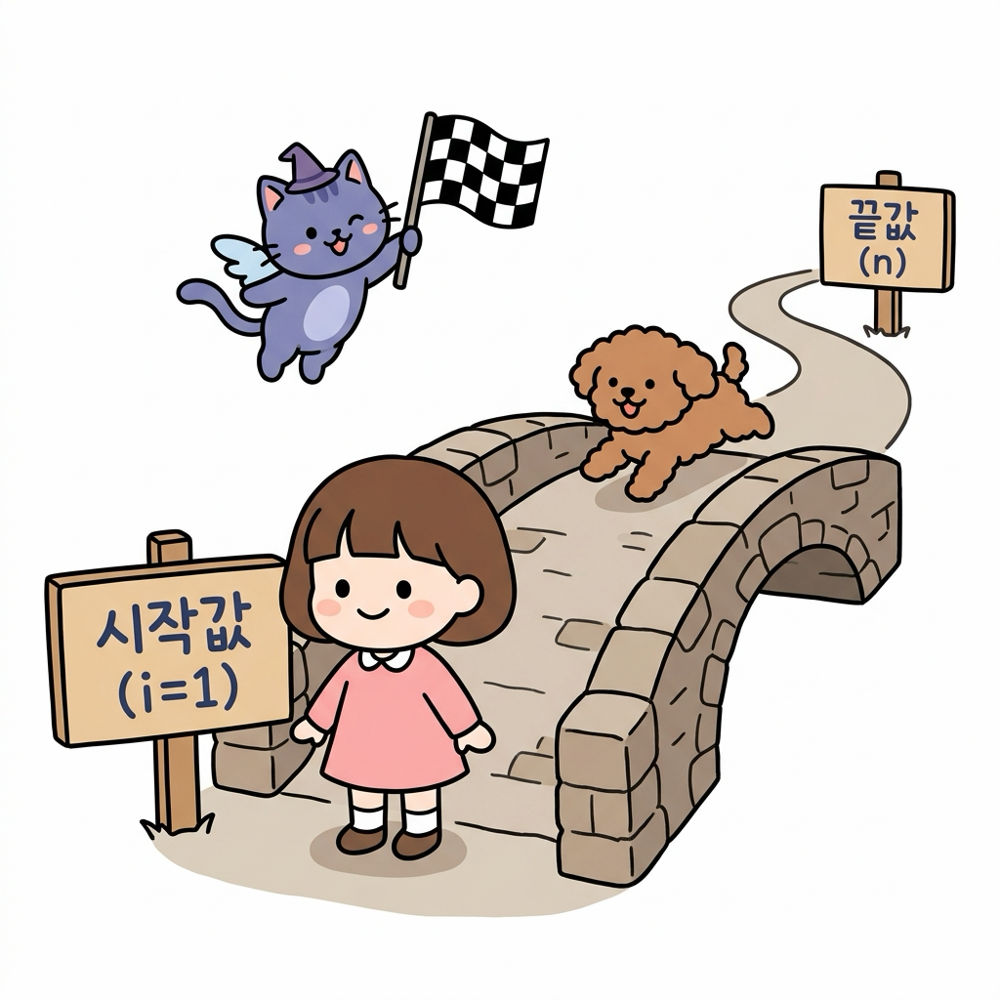
**그림 02-6-5** 루프 변수 i가 출발선 1부터 출발하여 결승선 n을 향해 뛰어가는 과정 속에서 시작값과 끝값의 범위를 체험하는 도로시와 지니, 토토


---


#### 3) 알맹이: 오른쪽 식(일반항)의 의미
> 시그마 기호의 오른쪽에 위치한 식은 합산의 실제 대상이 되는 **일반항 *a<sub>i</sub>***가 적히는 자리입니다.


"출발선과 결승선이 정해졌다면, 실제로 어떤 물건을 실어 나를 것인지 내용물이 필요하겠지? 오른쪽 식은 인덱스 변수 *i*가 1, 2, 3...으로 한 칸씩 증가할 때마다 그 숫자를 집어넣어서 새로운 값을 만들어내는 **'제조기'**이자 **'레시피'**란다."


예를 들어 일반항 자리에 *a<sub>i</sub>*가 있다면 인덱스가 증가함에 따라 *a*<sub>1</sub>, *a*<sub>2</sub>, *a*<sub>3</sub>가 차례대로 생성되어 합산 상자 안으로 들어가게 됩니다.


**그림 02-6-6** 인덱스 변수를 투입하면 그 규칙에 맞춰 덧셈용 알맹이(항)들을 펑펑 뿜어내는 일반항 제조기 가마솥을 관찰하는 도로시와 지니, 토토


---


### 2.6.2.2 수식 전개와 인덱스 변수의 흐름
즉, 아래의 수식은 루프 변수 *i*를 1부터 시작하여 *n*까지 1씩 늘려가며 *a<sub>i</sub>*에 대입한 항들을 모두 더하라는 뜻이 됩니다:

$$
\sum_{i=1}^{n} a_i = a_1 + a_2 + a_3 + \dots + a_n
$$

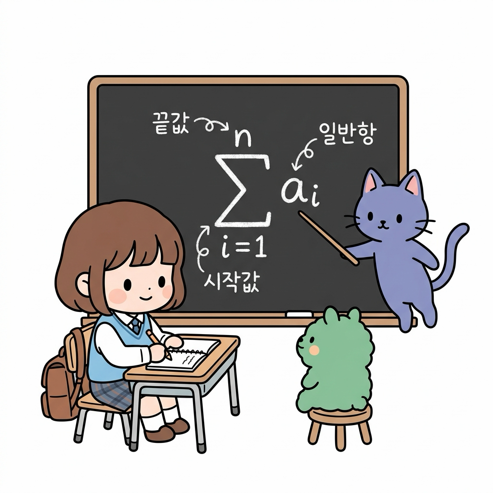
**그림 02-6-7** 합의 기호 시그마(Σ)의 위와 아래, 오른쪽에 위치한 구성 요소들의 역할과 대입 규칙을 공부하는 도로시와 지니, 토토


---


### 2.6.2.3 프로그래밍 루프(Loop)와의 비교
"아! 컴퓨터 프로그래밍에서 배우는 반복문(Loop)이랑 정말 똑같네요! 아래 숫자가 초기 조건이고, 위의 숫자가 종료 조건, 그리고 오른쪽 식이 반복 실행할 코드인 셈이잖아요!"


도로시가 손뼉을 치며 똑 부러지게 요약했습니다.

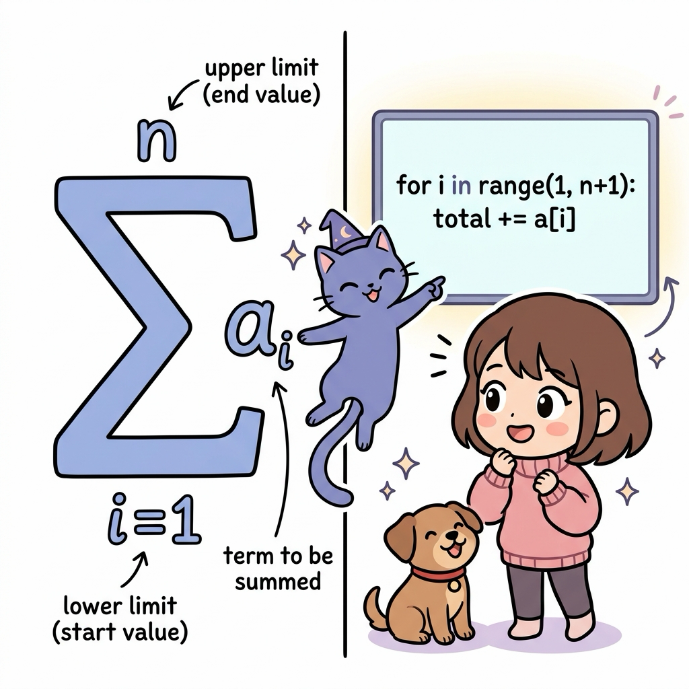
**그림 02-6-8** 수학의 시그마(Σ) 수식 기호 구성 요소와 파이썬의 for 반복문(Loop) 소스코드 간의 1:1 매칭 구조를 설명하는 지니와 도로시, 토토


"정확해, 도로시! 인덱스 변수는 *i*뿐만 아니라 *j*, *k*, *t* 등 어떤 문자를 써도 상관없단다. 기호의 규칙만 이해하면 아주 간결하게 표현할 수 있지."

```python
# 1부터 n까지의 수열 a_i의 합을 구하는 파이썬 코드 예제
total = 0
for i in range(1, n + 1):
    total += a[i]
```

이 파이썬 코드에서 `total` 변수를 0으로 초기화하고, `i` 값을 1부터 `n`까지 1씩 증가시키면서 수열의 각 항 `a[i]`를 차례대로 더해 나가는 과정이 바로 시그마 기호가 수행하는 내부적인 연산 원리입니다.


---


## 02.6.3 시그마의 세 가지 비밀: 기본 연산 성질

시그마 기호는 결국 **덧셈을 연속해서 수행**하는 것이므로, 덧셈과 곱셈의 분배법칙 및 결합법칙이 그대로 적용됩니다. 

지니가 칠판에 시그마가 가진 세 가지 강력한 연산 법칙을 적어 주었습니다.

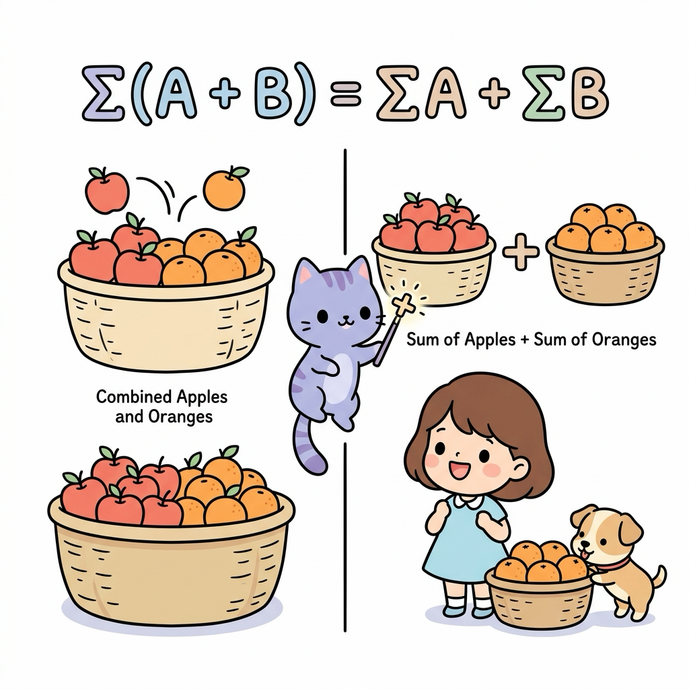
**그림 02-6-9** 덧셈의 묶기(분배법칙)를 바구니에 사과와 오렌지를 모아 담는 방식에 비유하여 시그마 성질의 원리를 알아보는 지니와 도로시, 토토


---


### 2.6.3.1 합과 차의 분배 법칙
두 수열의 합이나 차를 통째로 더하는 것은, 각각의 수열을 먼저 더한 다음 합하거나 빼는 것과 같습니다.
$$
\sum_{i=1}^{n} (a_i \pm b_i) = \sum_{i=1}^{n} a_i \pm \sum_{i=1}^{n} b_i
$$
"두 개의 징검다리 코스를 각각 완주해서 합친 거리나, 두 코스의 매 단계를 더해서 한 번에 걸어간 거리나 결국 총합은 같다는 뜻이야."

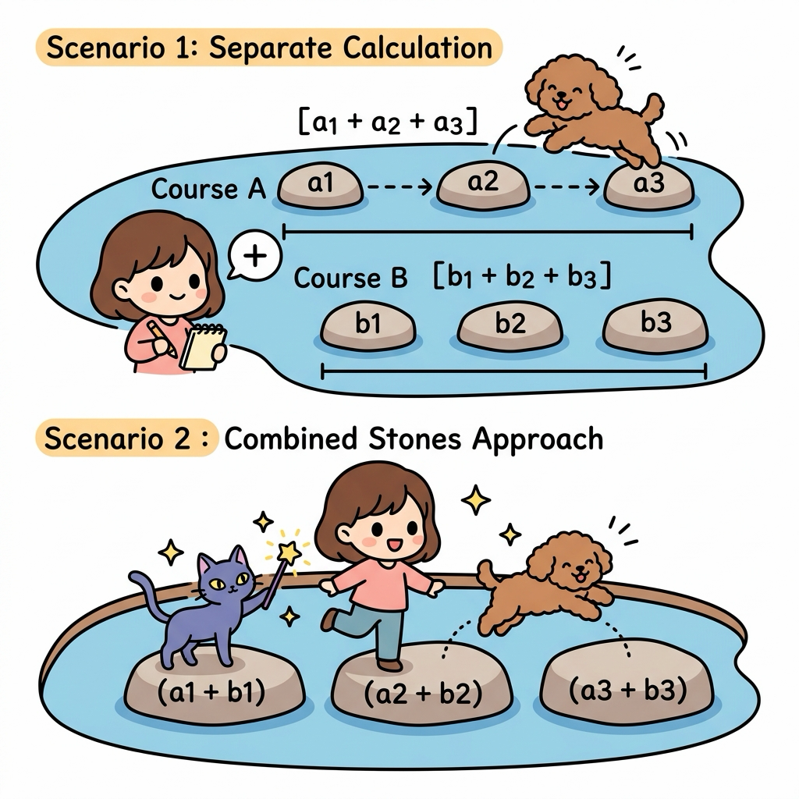
**그림 02-6-10** 두 개의 코스를 별도로 계산하여 더한 결과(Scenario 1)와 디딤돌들을 미리 더한 후 건너는 결과(Scenario 2)의 총합이 완벽히 동일함을 체험하는 도로시와 지니, 토토


---


### 2.6.3.2 상수 배(실수 배)의 분리 법칙
수열의 모든 항에 동일한 상수 *c*가 곱해져 있다면, 먼저 합산을 모두 끝마친 뒤 마지막에 상수 *c*를 곱해 주어도 결과가 같습니다.
$$
\sum_{i=1}^{n} (c \cdot a_i) = c \cdot \sum_{i=1}^{n} a_i
$$
"매번 *c*배씩 곱해서 더하는 번거로운 일 대신, 일단 다 더해놓고 마지막에 딱 한 번만 *c*를 곱해주면 계산이 훨씬 빨라지겠지?"

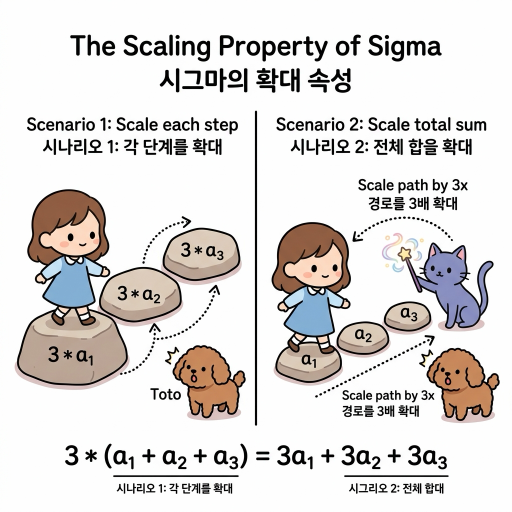
**그림 02-6-11** 각 단계 디딤돌의 크기를 3배로 확대하여 건너는 것(Scenario 1)과 일반 돌을 모두 건넌 뒤 최종 거리를 3배 확대하는 것(Scenario 2)의 총합이 같음을 관찰하는 도로시와 지니, 토토


---


### 2.6.3.3 상수만의 합산 법칙
일반항 자리에 변수 없이 오직 상수 *c*만 존재한다면, 이는 상수 *c*를 시작값부터 끝값까지 횟수만큼 반복해서 더하라는 뜻이 되어 **단순 곱셈**으로 계산됩니다.
$$
\sum_{i=1}^{n} c = c \cdot n = cn
$$
"아무것도 변하지 않는 디딤돌 *c*를 총 *n*번 징검다리로 놓았다면, 총길이는 당연히 *c*를 *n*번 곱한 값이 되겠지?"

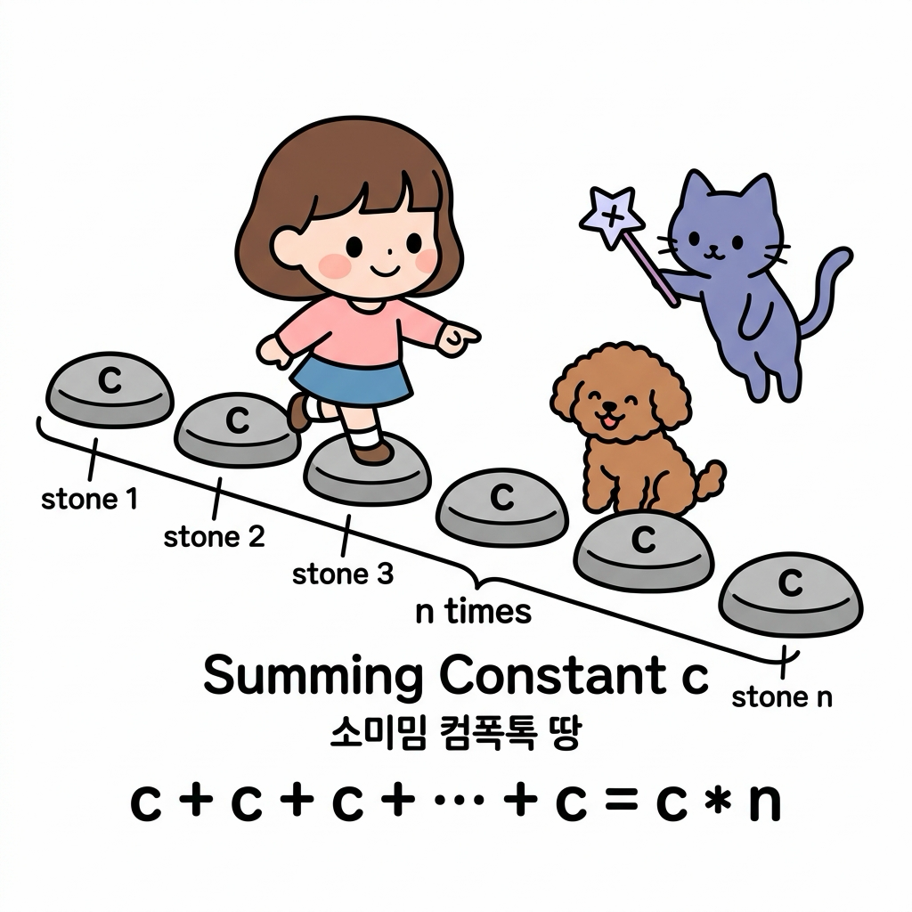
**그림 02-6-12** 동일한 간격이나 크기를 가진 디딤돌 c가 총 n개 늘어서 있는 다리를 건너며 상수 합산이 곱셈(c × n)으로 환원되는 원리를 알아보는 도로시와 지니, 토토


---


"와! 이 성질들을 잘 활용하면 얽혀 있는 복잡한 수식들을 쪼개고 묶어서 아주 쉽게 계산할 수 있겠어요!"
도로시가 노트를 정리하며 밝게 웃었습니다.

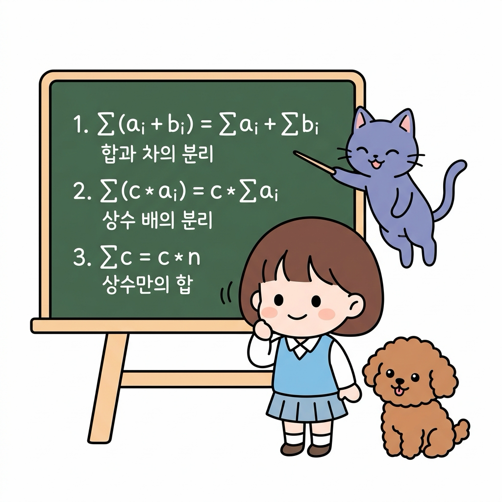
**그림 02-6-13** 실수배의 분리, 합과 차의 분배, 상수의 누적 합산 등 시그마 연산이 가지는 세 가지 중요한 대수적 성질을 공부하는 도로시와 지니, 토토


---


## 02.6.4 자연수의 거듭제곱 합 공식

"지니, 만약에 디딤돌에 적힌 숫자가 1, 2, 3, ... 처럼 1씩 계속 증가하거나, 1², 2², 3², ... 처럼 제곱으로 증가한다면 어떻게 더해? 이걸 매번 다 손으로 더해야 하는 거야?"

도로시가 이마의 땀을 닦으며 질문했습니다. 


**그림 02-6-14** 1부터 100까지 혹은 제곱의 합 등을 하나씩 손으로 더해야 하는 상황에 머리가 아파와 이마의 땀을 닦는 도로시와 걱정스러운 눈빛의 토토


지니가 미소를 지으며 칠판에 새로운 마법 공식을 그렸습니다.

"걱정 마, 도로시! 옛날의 꼬마 천재 수학자 가우스가 초등학생 시절 발견한 것과 같은 아주 기막힌 합 공식이 있단다. 매번 일일이 더하지 않고도 공식 하나로 총합을 뚝딱 구해주는 마법이지."

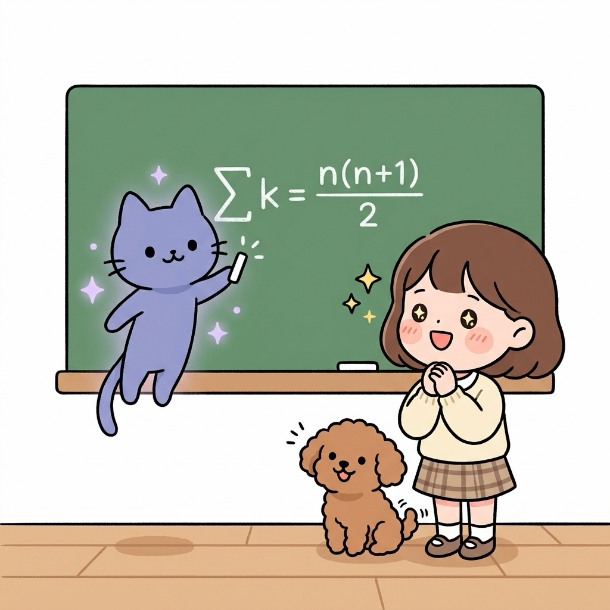
**그림 02-6-15** 칠판에 마법 같은 자연수의 합 공식을 적어주는 지니의 모습을 반짝이는 눈빛으로 바라보며 안도하는 도로시와 토토


### 2.6.4.1 자연수 합 공식 (Σ k)
첫째항부터 *n*번째 자연수까지의 합입니다.
$$
\sum_{k=1}^{n} k = \frac{n(n + 1)}{2}
$$
"1부터 *n*까지 늘어놓고 첫 숫자와 끝 숫자를 짝지으면 항상 (*n*+1)이 되고, 이 쌍이 전체 개수의 절반인 *n*/2만큼 생기므로 자연스럽게 유도되는 공식이란다."

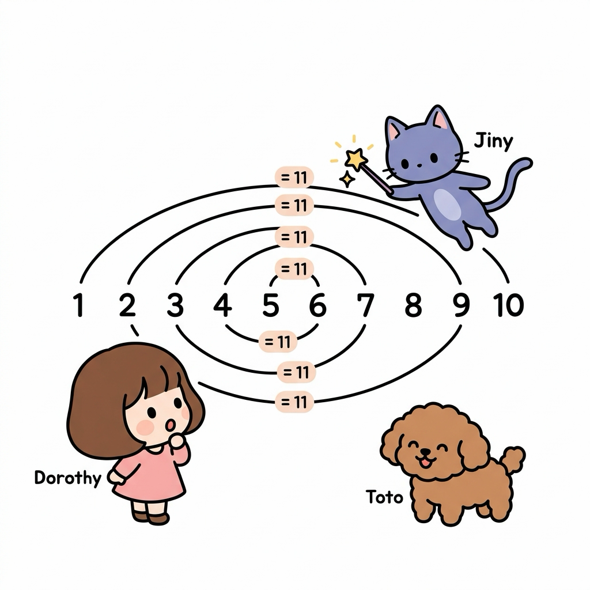
**그림 02-6-16** 1부터 10까지의 자연수들을 양끝에서 짝지어 합이 11이 되는 한 쌍들(총 5쌍)을 만들어 빠르게 연산하는 방식을 구경하는 도로시와 지니, 토토


### 2.6.4.2 자연수 제곱 합 공식 (Σ k²)
첫째항부터 *n*번째 자연수의 제곱들의 합입니다.
$$
\sum_{k=1}^{n} k^2 = \frac{n(n + 1)(2n + 1)}{6}
$$
"이 공식은 입체적인 블록 쌓기 모형에서 유도되는데, 강화학습의 분산이나 고차원 상태를 평가할 때 아주 요긴하게 활용된단다."

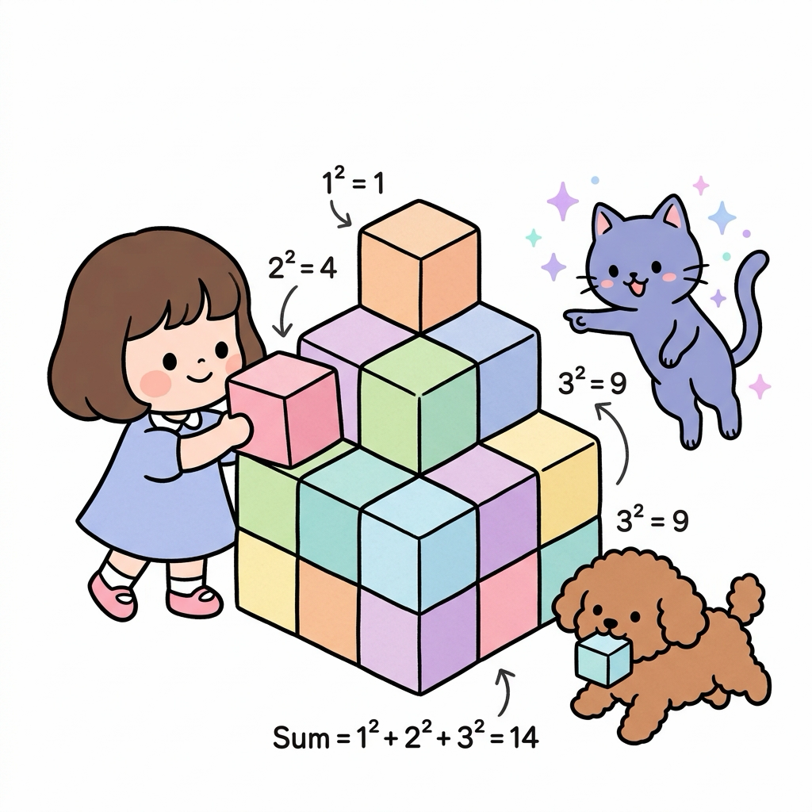
**그림 02-6-17** 1², 2², 3²개의 블록들로 이루어진 3D 블록 피라미드 탑을 함께 쌓아 올리며 제곱 합 공식의 입체적 구성을 공부하는 도로시와 지니, 토토


### 2.6.4.3 자연수 세제곱 합 공식 (Σ k³)
첫째항부터 *n*번째 자연수의 세제곱들의 합입니다.
$$
\sum_{k=1}^{n} k^3 = \left[ \frac{n(n + 1)}{2} \right]^2
$$
"정말 신기하게도 세제곱들의 합은 자연수의 합 공식을 그대로 제곱한 형태와 같아진단다! 수학이 가진 참 아름다운 대칭성이지."

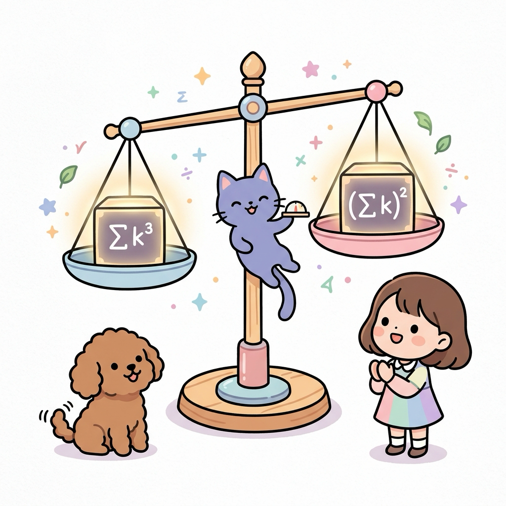
**그림 02-6-18** 세제곱의 합 상자(Σ k³)와 자연수 합의 제곱 상자((Σ k)²)가 마법 천칭 저울 위에서 완벽히 수평을 이루며 균형을 이루는 대칭을 구경하는 도로시와 지니, 토토


---

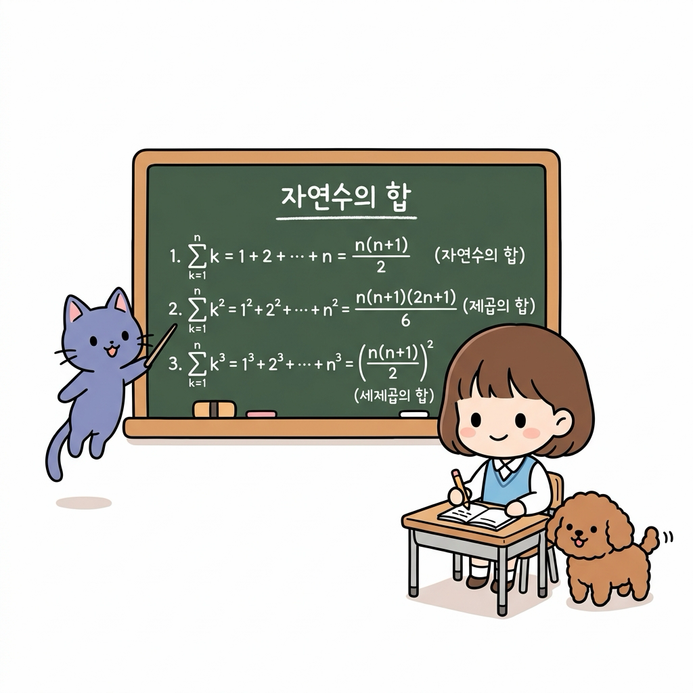
**그림 02-6-19** 자연수 k, 제곱 k², 세제곱 k³의 합을 매번 일일이 더하지 않고 공식 하나로 해결하는 마법 같은 수학 규칙을 익히는 도로시와 지니, 토토


---


## 02.6.5 강화학습 속의 시그마: 벨만 기대 방정식 해석

"그럼 도로시, 이제 우리가 배운 시그마 마법을 강화학습의 진짜 뼈대 공식에 적용해 볼까?"

지니가 요술봉으로 허공을 가르자, 눈앞에 복잡하고 웅장한 수식이 환하게 드러났습니다. 

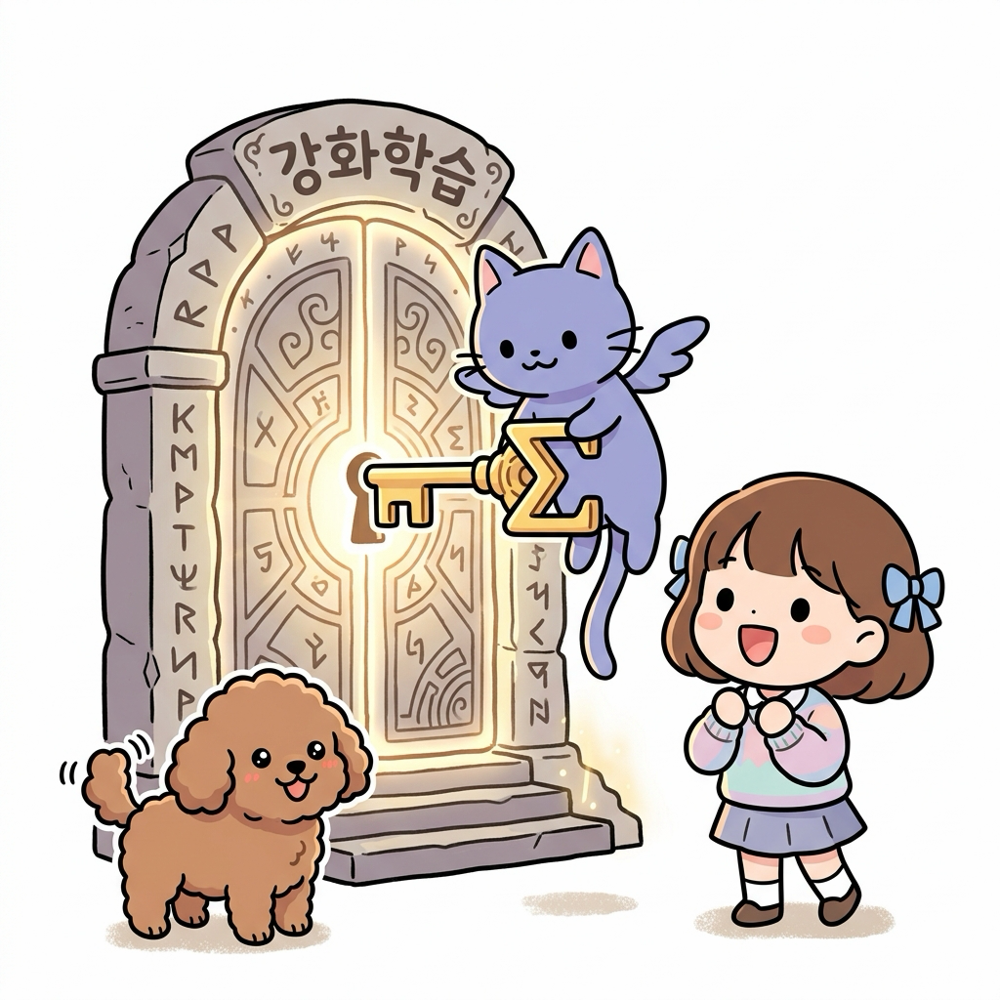
**그림 02-6-20** 강화학습(Reinforcement Learning) 세계의 웅장한 문을 열기 위해 시그마(Σ) 모양의 마법 황금 열쇠를 사용하는 지니와 기대에 찬 도로시, 토토

바로 강화학습에서 가장 중요한 **벨만 기대 방정식(Bellman Expectation Equation)**이었습니다.
$$
v(s) = \sum_{a} \pi(a|s) \left[ R_s^a + \gamma \sum_{s'} P(s'|s, a) v(s') \right]
$$

"지니! 여기 적힌 시그마는 아래에 숫자 대신 *a*나 *s'* 같은 문자만 덜렁 적혀 있어! 그리고 위에는 끝값 표시도 없는데?"

도로시가 깜짝 놀라며 수식을 가리켰습니다. 토토도 수식이 무서운 듯 뒤로 살짝 물러나 낑낑댔습니다.

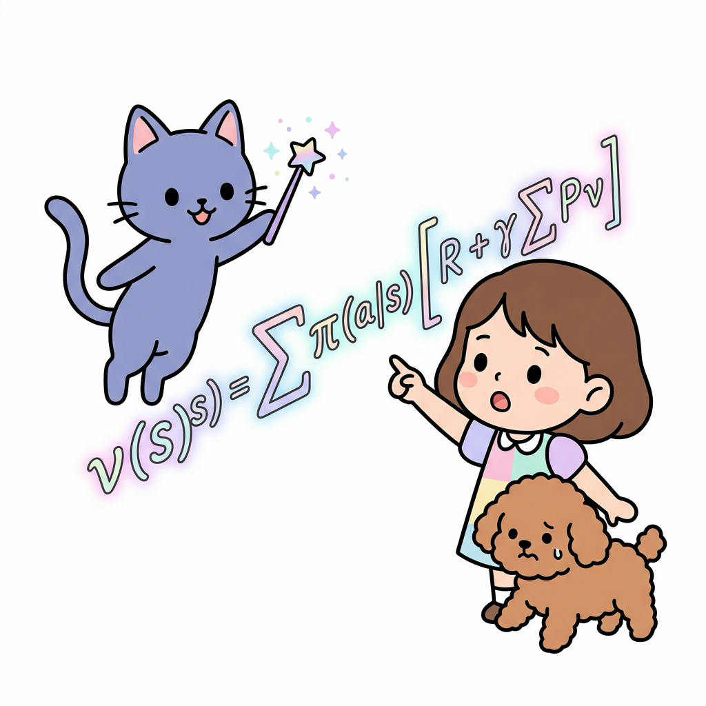
**그림 02-6-21** 허공에 떠오른 복잡한 벨만 기대 방정식의 시그마 아래에 숫자 대신 a나 s'가 적혀 있는 것을 가리키며 깜짝 놀라는 도로시와 겁먹은 토토


"날카로운 지적이야, 도로시. 강화학습에서는 인덱스를 숫자로 일일이 세기 어렵기 때문에, 아래첨자에 변수(예: 행동 *a*, 다음 상태 *s'*)만 적어서 **'선택 가능한 모든 행동'** 또는 **'이동 가능한 모든 다음 상태'** 전체에 대해 남김없이 더하라는 뜻으로 축약하여 사용한단다."

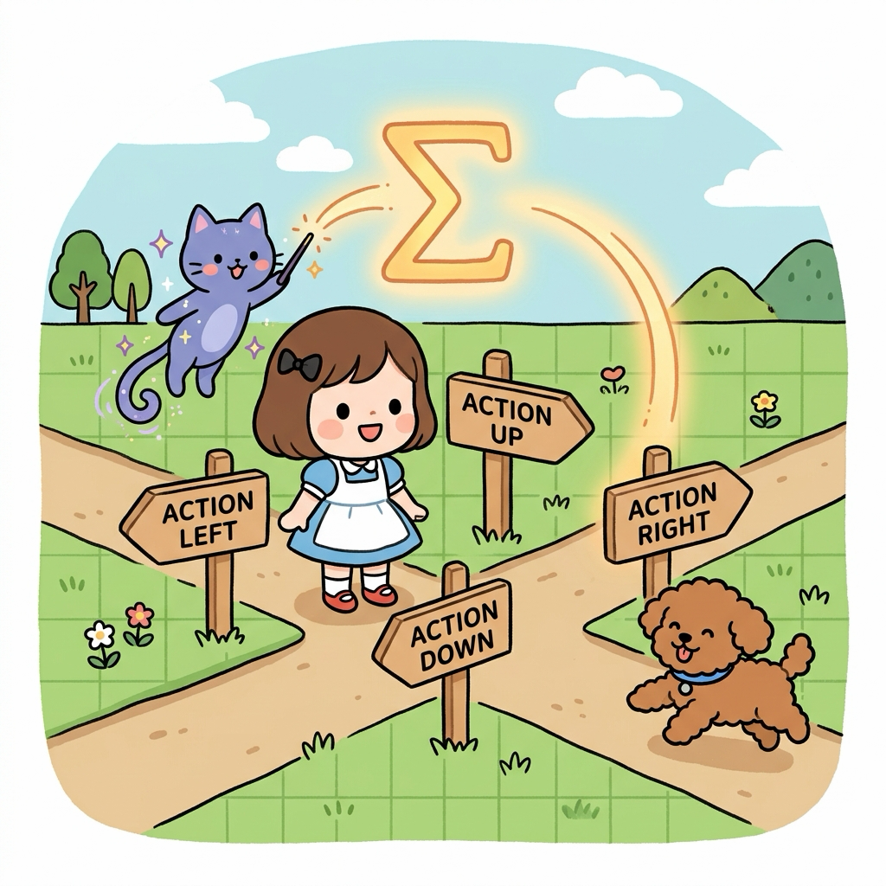
**그림 02-6-22** 사방으로 뻗어 있는 갈림길의 방향 표지판(행동 a)들을 시그마(Σ)를 통해 하나의 경로망으로 묶어서 계산하려는 도로시와 지니, 토토


지니가 수식을 한 부분씩 나누어 해석해 주었습니다.


---


### 2.6.5.1 안쪽의 시그마 (Σ<sub>*s'*</sub>): 다음 상태의 가치 평균
현재 상태 *s*에서 행동 *a*를 취했을 때 도달할 수 있는 **모든 다음 상태 *s'***에 대하여, 해당 상태로 이동할 확률 *P*(*s'*|*s*, *a*)와 그 상태의 가치 *v*(*s'*)를 곱한 값들의 총합을 구하라는 뜻입니다. 


즉, 다음 **상태 가치의 평균(기댓값)**을 계산하는 부분입니다.
$$
\sum_{s'} P(s'|s, a) v(s')
$$

> **💡 수식 기호 해설:**
> * *P*(*s'*|*s*, *a*): **상태 전이 확률** (현재 상태 *s*에서 행동 *a*를 취했을 때 다음 상태 *s'*에 도달할 확률)
> * *v*(*s'*): **상태 가치** (다음 상태 *s'*가 가진 가치 혹은 기대 보상)


"도로시, 네가 현재 위치 *s*에서 '앞으로 전진'하는 행동 *a*를 취할 때, 바닥이 미끄러워서 **세 갈래 가능성 중 오직 한 곳에만 도달**하게 된단다.

예를 들어, 80% 확률로 정면의 안전한 디딤돌 *s₁'*, 10% 확률로 오른쪽의 미끄러운 디딤돌 *s₂'*, 10% 확률로 왼쪽의 디딤돌 *s₃'* 중 **딱 한 군데로만 미끄러져 들어가게 되는 것**이지.

결코 *s₁'* → *s₂'* → *s₃'* 순서대로 줄줄이 이동하는 게 아니란다!
이 안쪽 시그마는 각 디딤돌로 갈라질 확률에 그곳의 가치를 각각 곱해서, 결국 이 점프 한 번으로 얻게 될 **'평균적인 가치의 기대치'**를 한 번에 계산해 주는 마법이란다."

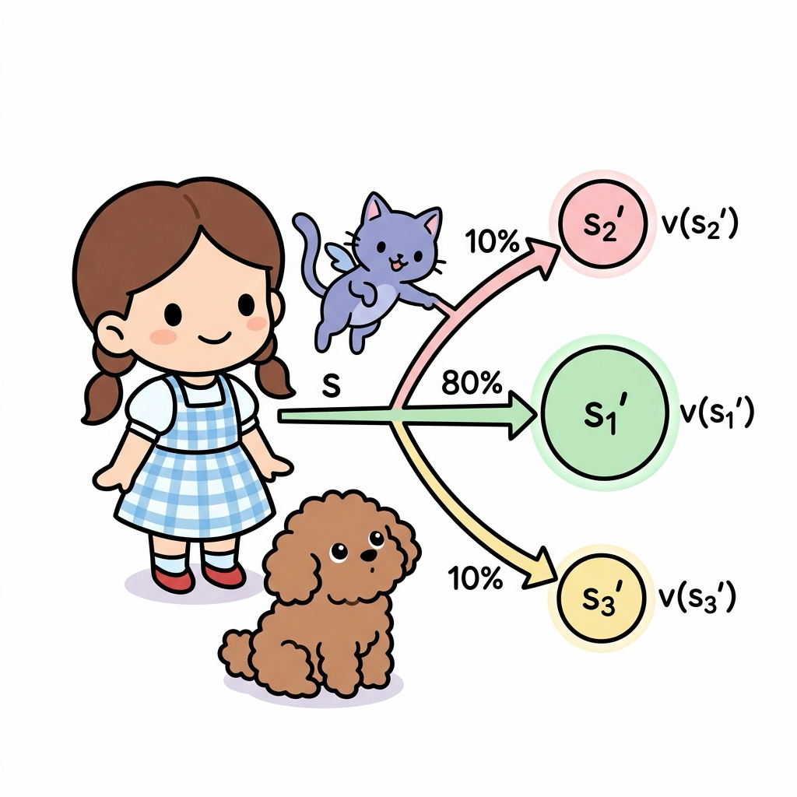
**그림 02-6-23** 현재 상태 s에서 행동을 취했을 때 세 가지 다음 상태(s1', s2', s3') 중 확률에 따라 단 한 곳으로 분기 착지하는 가중평균 가치를 계산하는 원리를 보여주는 도로시와 지니, 토토


### 2.6.5.2 바깥쪽의 시그마 (Σ<sub>*a*</sub>): 정책에 따른 기대 가치 합산
에이전트가 현재 상태 *s*에서 취할 수 있는 **모든 행동 *a***에 대하여, **정책 확률 *π*(*a*|*s*)**와 그 행동을 취했을 때 얻는 기대 가치들을 곱해 모두 더하라는 뜻입니다. 


즉, 정책에 따라 행동을 선택했을 때 얻게 되는 최종 평균 가치를 구하게 됩니다.
$$
\sum_{a} \pi(a|s) Q(s, a)
$$

> **💡 수식 기호 해설:**
> * *π*(*a*|*s*): **정책** (현재 상태 *s*에서 행동 *a*를 선택할 확률)
> * *Q*(*s*, *a*): **행동 가치** (현재 상태 *s*에서 행동 *a*를 수행했을 때 얻을 수 있는 기대 가치)


"그리고 바깥쪽 시그마는 '에이전트가 취할 수 있는 모든 행동들에 대해 각각의 정책 확률을 곱해 합산하는 최종 평균 계산'이란다. 어떤 방향으로 갈 것인지 선택에 따른 전체 기댓값이지."

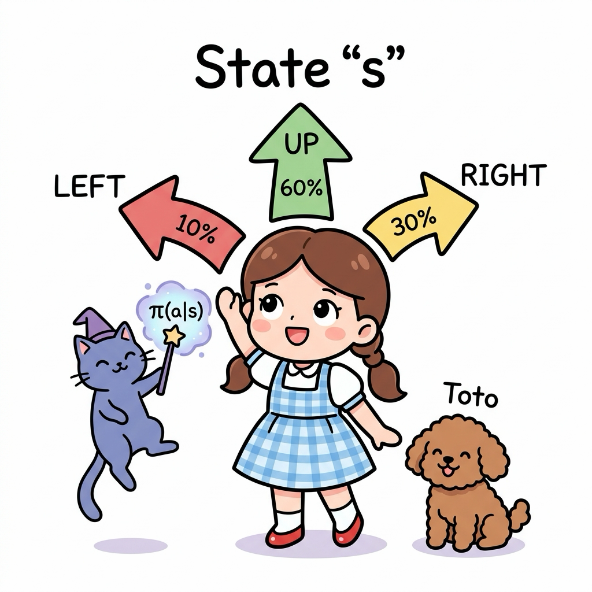
**그림 02-6-24** 에이전트가 현재 상태에서 취할 수 있는 여러 행동들(UP, RIGHT, LEFT)의 행동 선택 확률(정책 *π*)들을 모두 합산하여 평균을 내는 원리를 설명하는 지니와 도로시, 토토


### 2.6.5.3 벨만 기대 방정식의 최종 의미
"아! 그러니까 이 복잡해 보이는 식은 결국 **'내가 취할 수 있는 모든 행동들과 그로 인해 일어날 수 있는 모든 다음 상황들의 가치를 확률에 따라 곱해서 평균낸 값'**을 한 줄로 우아하게 요약한 거였군요!"

도로시가 무릎을 탁 치며 외쳤습니다.

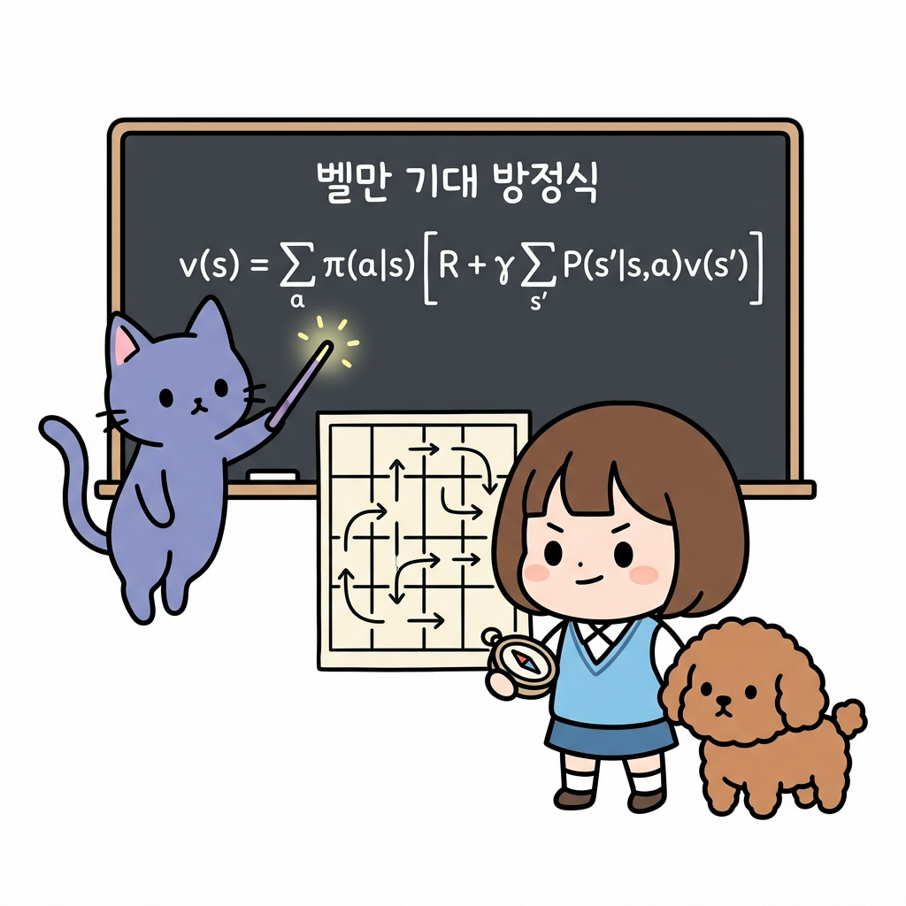
**그림 02-6-25** 격자 세상에서 상태와 행동의 여러 갈래 길로 나뉘는 복잡한 가치 평가 계산이 시그마 기호를 통해 간결하게 합산 및 평균 계산되는 구조를 분석하는 도로시와 지니, 토토


"그렇단다. 시그마 기호 덕분에 우리는 수만 가지 선택지가 얽혀 있는 복잡한 에이전트의 운명을 단 한 줄의 수식으로 깔끔하게 정리하고 계산할 수 있는 것이란다."


지니가 친절하게 덧붙였습니다.


---


## 02.6.6 실전 예제

학습한 내용을 바탕으로 다음 문제를 직접 해결해 봅시다.


### 문제 1 (시그마 기호 계산)

다음 시그마 기호의 연산 결과를 구하시오.

**Σ<sub>*i*=1</sub><sup>3</sup> (2 × *i* - 1)**

> **풀이**:
> 변수 *i*에 1부터 3까지 대입하며 차례로 더해 나갑니다.
> - *i* = 1 일 때: 2 × 1 - 1 = 1
> - *i* = 2 일 때: 2 × 2 - 1 = 3
> - *i* = 3 일 때: 2 × 3 - 1 = 5
> 
> 따라서 총합은 다음과 같습니다:
> Σ<sub>*i*=1</sub><sup>3</sup> (2 × *i* - 1) = 1 + 3 + 5 = 9
> 
> **정답**: 9


### 문제 2 (자연수 합 공식 계산)

다음 식의 값을 자연수 거듭제곱 합 공식을 사용하여 구하시오.

**Σ<sub>*k*=1</sub><sup>10</sup> *k***

> **풀이**:
> 자연수 합 공식인 **Σ<sub>*k*=1</sub><sup>*n*</sup> *k* = *n*(*n* + 1) ÷ 2** 에 *n* = 10 을 대입합니다.
> - 공식 대입: 10 × (10 + 1) ÷ 2 = 10 × 11 ÷ 2 = 55
> 
> **정답**: 55


---


## 02.6.7 핵심 요약


**그림 02-6-26** 합의 기호 시그마의 해부학적 구조와 기본 연산 법칙, 자연수 거듭제곱 합 공식, 그리고 벨만 기대 방정식 속 확률 합산까지의 마스터 코스를 무사히 통과하고 졸업장을 들어 보이는 도로시와 지니, 토토


1. **시그마 기호(Σ)**는 여러 항들을 차례대로 더해 나갈 때, 이를 짧은 하나의 기호로 압축 표기하는 연산 도구이다.
2. 아래첨자는 합산을 시작하는 변수의 초깃값(시작 항 번호)을 나타내고, 위첨자는 합산을 멈추는 최종 경계값(끝 항 번호)을 의미한다.
3. 자연수의 거듭제곱 합은 일일이 더하지 않고 공식(Σ k, Σ k², Σ k³)을 이용하여 빠른 연산이 가능하며, 이는 다양한 강화학습 수식 증명 및 전개에 활용된다.
4. 시그마는 곱해진 상수를 기호 밖으로 분리하거나, 덧셈/뺄셈을 쪼개어 처리할 수 있는 대수적 선형 성질을 가지며, 이는 벨만 방정식의 상태/행동 가중합 계산에 직결된다.
