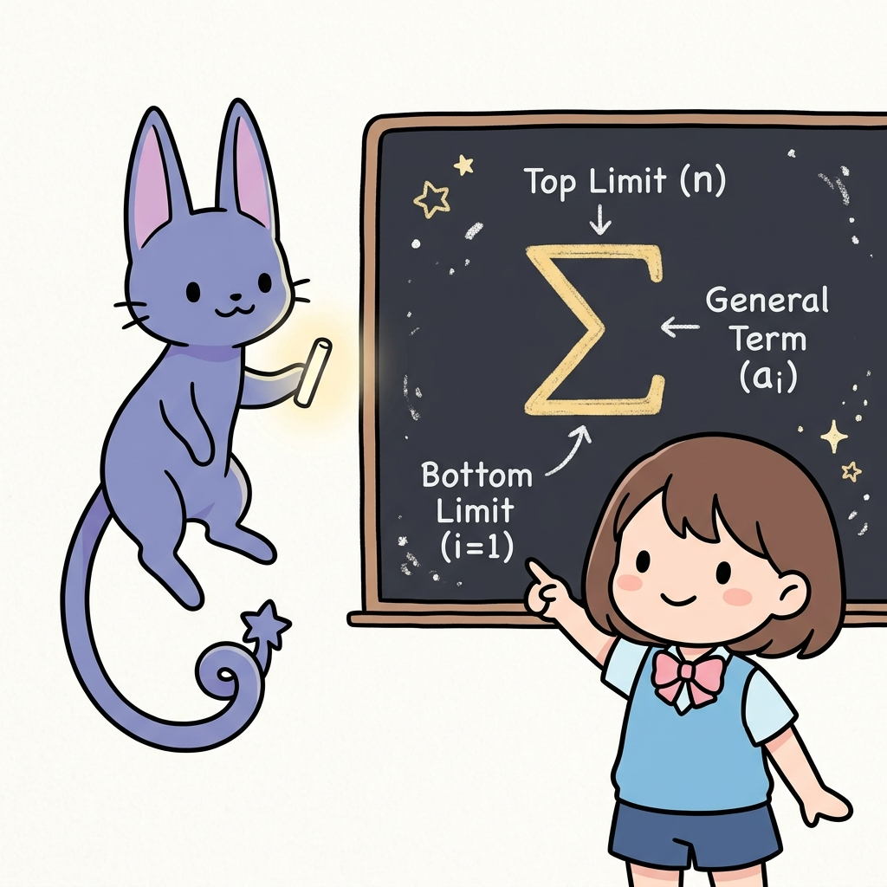
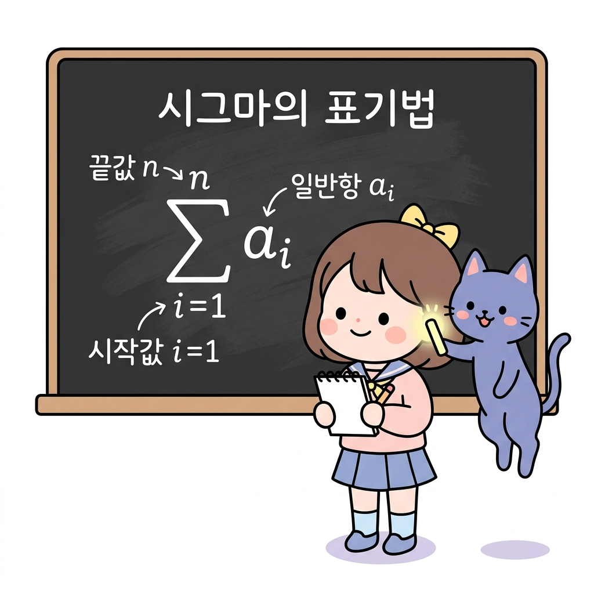
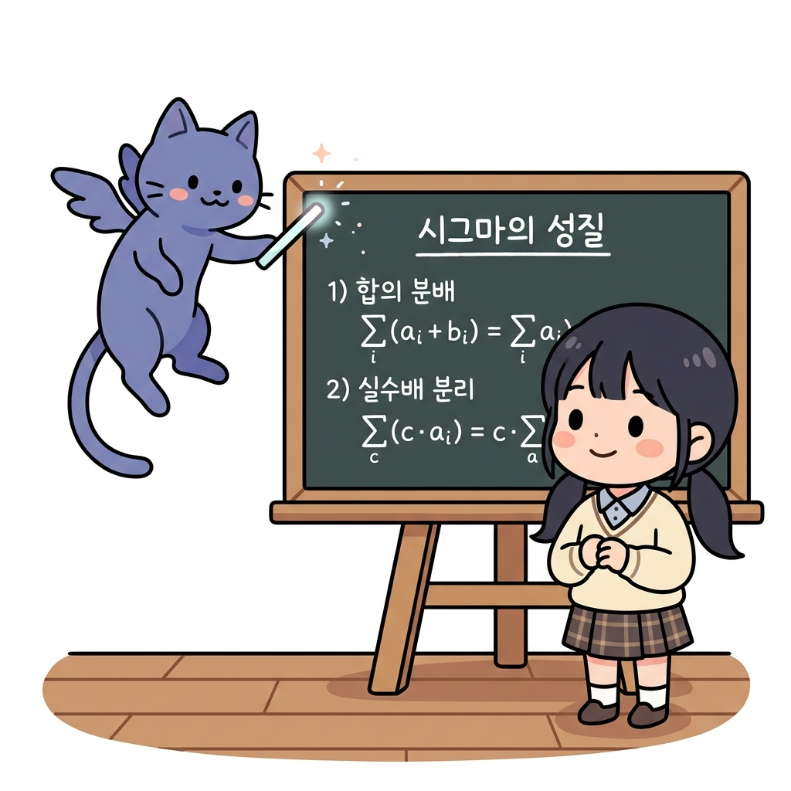
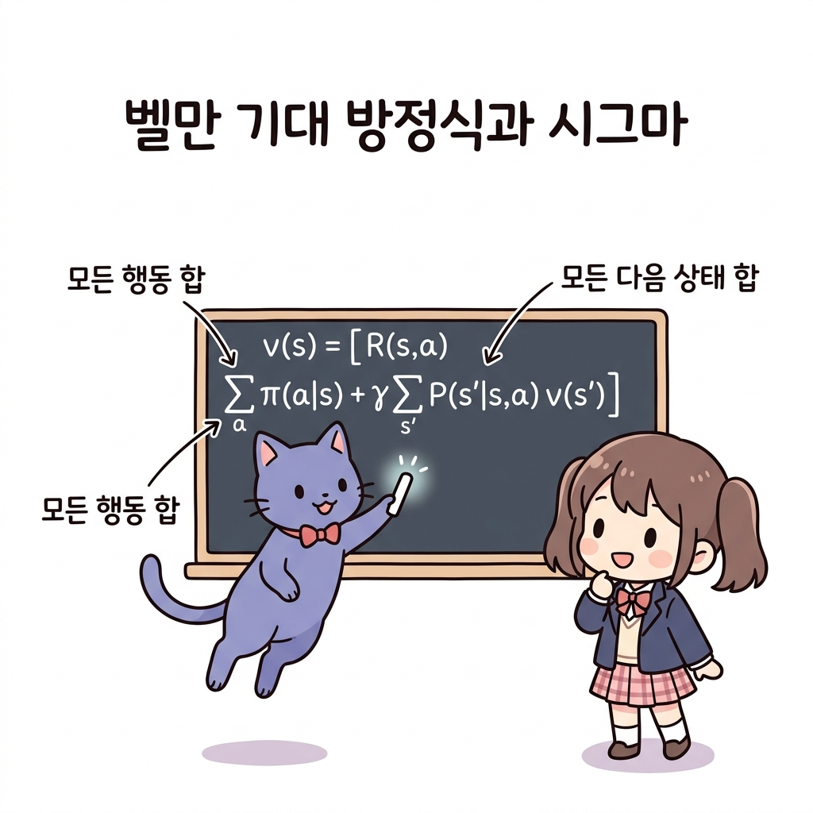

# 02.6 시그마(Σ) 기호와 합 공식

> 이 장에서는 여러 수들의 나열을 합하는 기호인 **시그마(Σ)**의 뜻과 구조, 성질을 학습하고, 강화학습의 중심인 벨만 기대 방정식에 나타나는 기댓값 합산 표기를 자유자재로 해독하고 다루는 기초 체력을 기릅니다.

---

## 02.6.1 마법의 합산 기호 시그마(Σ)와 조우하기

**그림 02-6-1** 칠판에 적힌 커다란 그리스 문자 시그마(Σ) 기호의 시작값과 끝값의 마법적 위치를 설명하는 지니와 놀라는 도로시

수십, 수만 개의 행동 가치나 상태 가치들의 합을 구해야 할 때, 식을 길게 늘어놓는 것은 매우 지루하고 복잡한 일입니다. 그리스 문자 **시그마(Σ)**는 이 지루한 덧셈을 한 기호로 요약해주는 훌륭한 마법 압축기입니다. 지니가 설명하는 시그마의 구조와 성질을 도로시의 모험 필기장과 함께 명쾌하게 격파해봅시다!

---

### 1. 학습 목표
- 합의 기호 시그마(∑)의 정의와 구성(시작값, 끝값, 일반항)을 이해한다.
- 시그마의 기본 연산 성질(실수배, 덧셈/뺄셈의 분배)을 마스터한다.
- 벨만 방정식 속 행동(a) and 다음 상태(s')의 총합 연산 구조를 시그마를 사용해 올바르게 해독한다.

---

### 2. 핵심 개념

#### (1) 합의 기호 시그마 (∑)의 뜻과 표기법
수열의 첫째항부터 *n*번째 항까지의 합을 기호 **∑** (그리스 문자 시그마)를 사용하여 다음과 같이 단순화하여 나타냅니다.
- **수식 표기**:
  ∑*i*=1*n* *a**i* = *a*1 + *a*2 + *a*3 + ... + *a**n*
- **시그마의 구성 요소**:
  - **∑ (시그마)**: 합한다는 의미의 영어 Summation of 첫 글자인 **S**에 대응하는 그리스 대문자입니다.
  - **아래첨자 (*i*=1)**: 시작하는 항의 번호(변수의 초깃값)를 지정합니다.
  - **위첨자 (*n*)**: 마지막 항의 번호(끝값)를 지정합니다.
  - ***a**i***: 합산할 수열의 일반항(변수)입니다.

**그림 02-6-2** 시작값과 끝값, 일반항으로 구성되는 합의 기호 시그마(∑)의 표기 구조

#### (2) 시그마의 주요 성질 (Properties of Sigma)
시그마 기호는 덧셈의 성질로부터 비롯되었기 때문에, 다음과 같은 대수적 조작이 가능합니다.
1. **합과 차의 분배**:
   ∑ (*a**i* ± *b**i*) = ∑ *a**i* ± ∑ *b**i*
   - *해설*: 두 수열을 더하거나 뺀 것의 총합은, 각각의 총합을 구한 뒤 더하거나 빼는 것과 완벽히 같습니다.
2. **실수배의 분리**:
   ∑ *c* * *a**i* = *c* * ∑ *a**i* (단, *c*는 상수)
   - *해설*: 각 항에 일정하게 곱해진 상수 *c*는 합산 기호(∑) 앞으로 마법처럼 탈출시켜서 나중에 한 번만 곱해줘도 됩니다.
3. **상수만의 합**:
   ∑*i*=1*n* *c* = *c* * *n*
   - *해설*: *c*를 *n*번 반복해서 더한다는 뜻이므로 *c* * *n*이 됩니다.

**그림 02-6-3** 덧셈의 성질을 이용한 시그마 합의 분배 및 실수배 상수의 분리 법칙

#### (3) 벨만 방정식 속의 시그마 읽기
강화학습의 뼈대인 벨만 기대 방정식에는 다음과 같이 시그마가 핵심 요소로 나타납니다.
***v*(*s*) = ∑*a* *π*(*a*|*s*) [ *R**s**a* + *γ* ∑*s'* *P*(*s'*|*s*, *a*) *v*(*s'*) ]**
- **첫 번째 시그마 (∑*a*)**: 에이전트가 상태 *s*에서 고를 수 있는 모든 가능한 행동 *a*의 가짓수 전체에 대해 합산을 구하라는 뜻입니다. 정책 확률분포 *π*(*a*|*s*)와 가치를 곱해 가중합(기댓값)을 냅니다.
- **두 번째 시그마 (∑*s'*)**: 행동 *a*를 취해 도달할 수 있는 모든 다음 상태 *s'*의 가짓수 전체에 대해 합산을 구하라는 뜻입니다. 전이 확률 *P*(*s'*|*s*, *a*)와 다음 상태의 가치를 곱하여 평균을 냅니다.

**그림 02-6-4** 정책 확률에 따른 행동 합과 전이 확률에 따른 상태 전이 합이 결합된 벨만 기대 방정식의 시그마 구조

---

### 3. 시각 자료: 시그마 기호 구조 분해 도식

**그림 02-6-5** 시그마(∑) 기호의 상단/하단 첨자 및 일반항의 위치적 정의도

---

### 4. 실전 예제

#### 예제 1 (시그마 기호 계산)
> **문제**: 다음 시그마 기호의 연산 결과를 구하시오.
> ∑*i*=13 (2 *i* - 1)
>
> **주어진 식 풀이**:
> 변수 *i*에 1부터 3까지 대입하며 차례로 더해 나갑니다.
> - *i* = 1 일 때: 2(1) - 1 = 1
> - *i* = 2 일 때: 2(2) - 1 = 3
> - *i* = 3 일 때: 2(3) - 1 = 5
>
> 따라서 총합은 다음과 같습니다:
> ∑*i*=13 (2 *i* - 1) = 1 + 3 + 5 = 9
> **정답**: 9

---

### 5. 핵심 요약
1. **시그마 기호(∑)**는 여러 항들을 차례대로 더해 나갈 때, 이를 짧은 하나의 기호로 압축 표기하는 연산 도구이다.
2. 아래첨자는 합산을 시작하는 변수의 초깃값(시작 항 번호)을 나타내고, 위첨자는 합산을 멈추는 최종 경계값(끝 항 번호)을 의미한다.
3. 시그마는 곱해진 상수를 기호 밖으로 분리하거나, 덧셈/뺄셈을 쪼개어 처리할 수 있는 대수적 선형 성질을 가지며, 이는 벨만 방정식의 상태/행동 가중합 계산에 직결된다.
