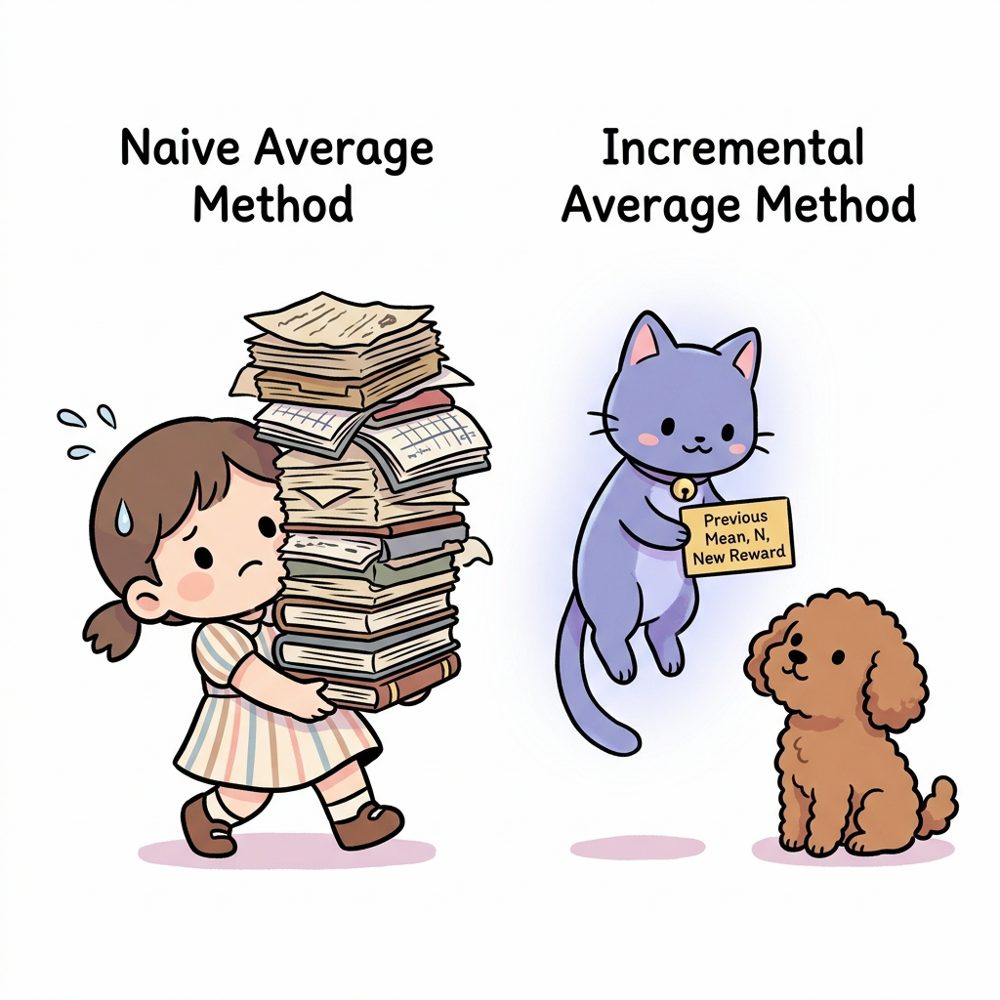
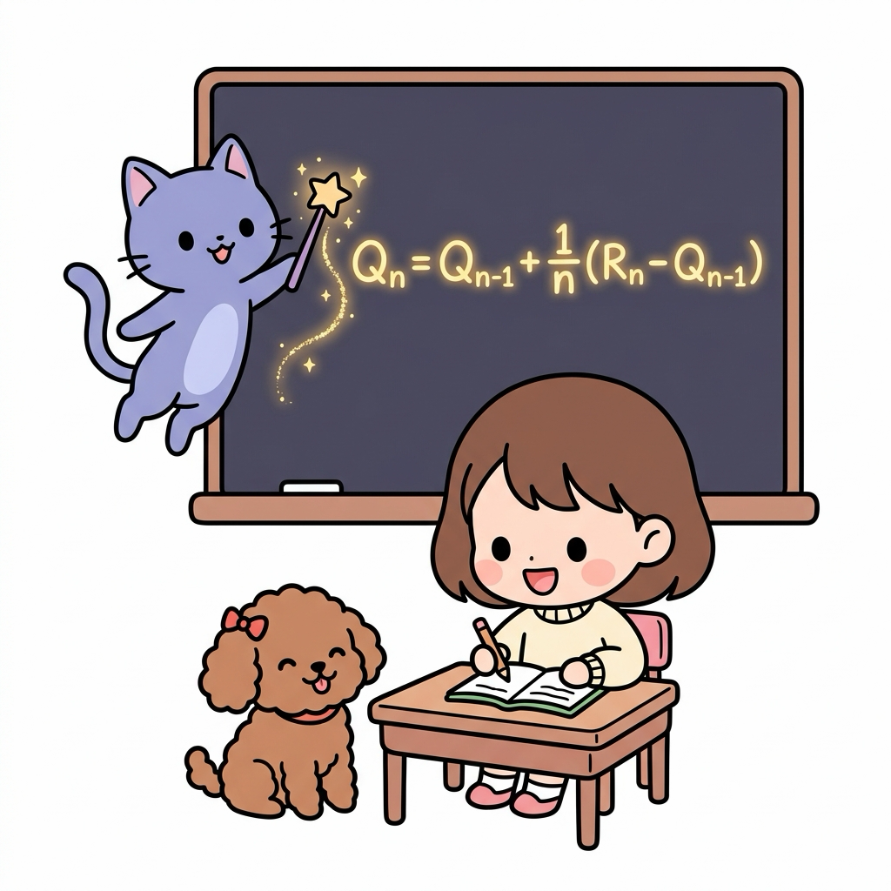
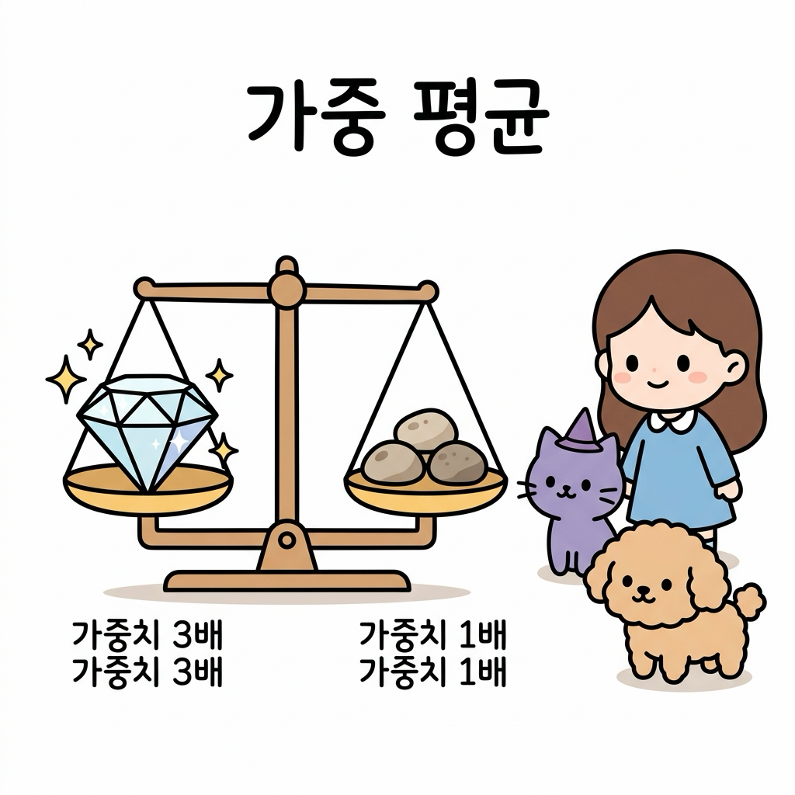
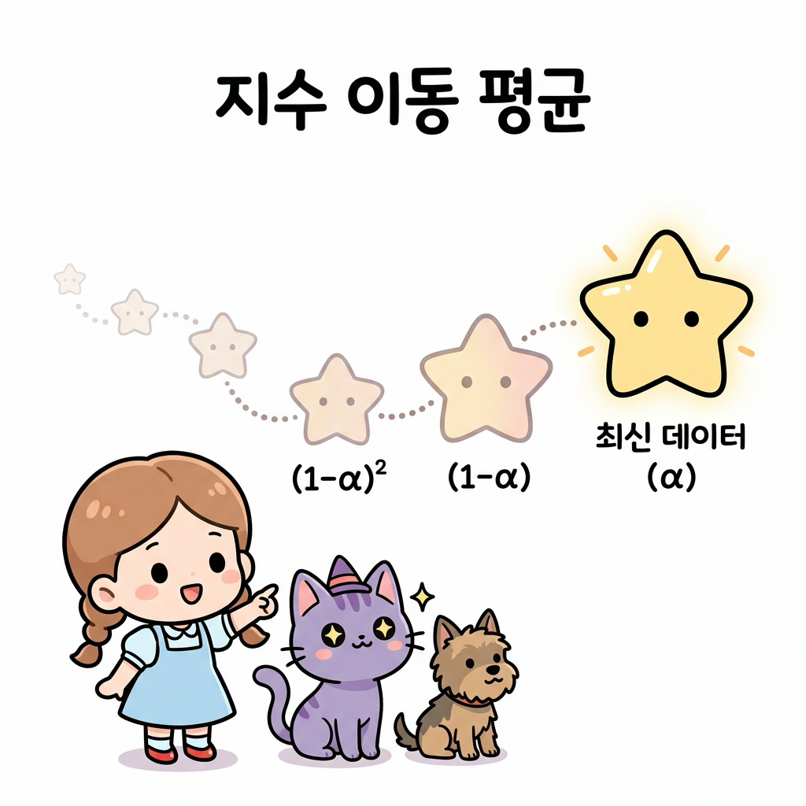
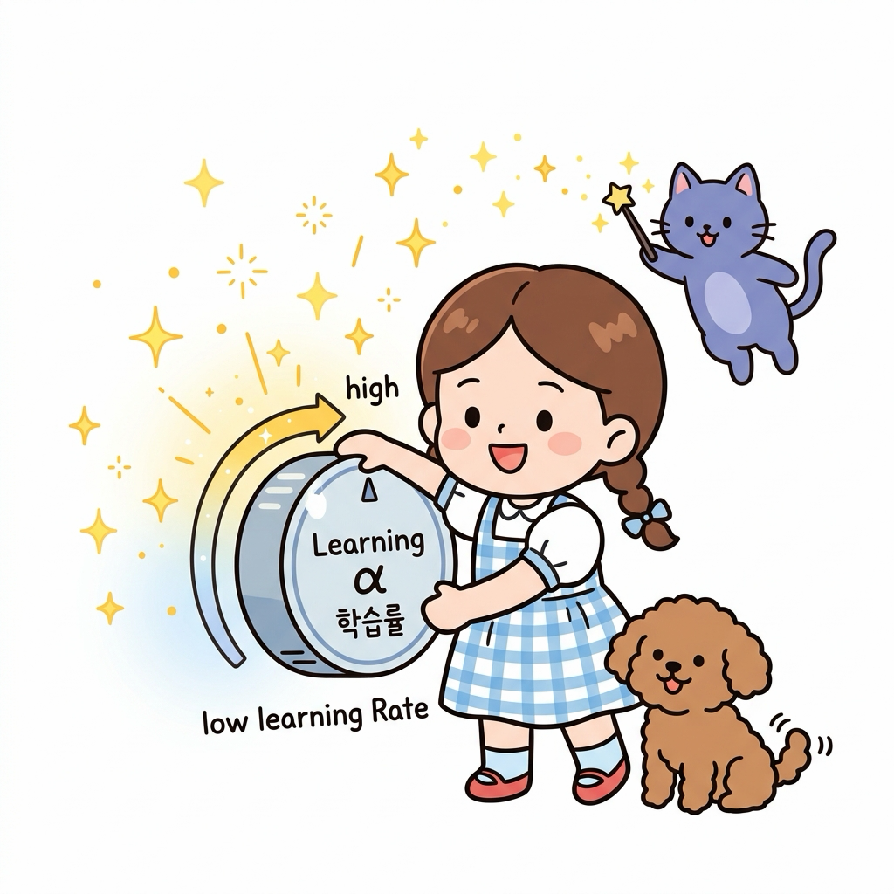
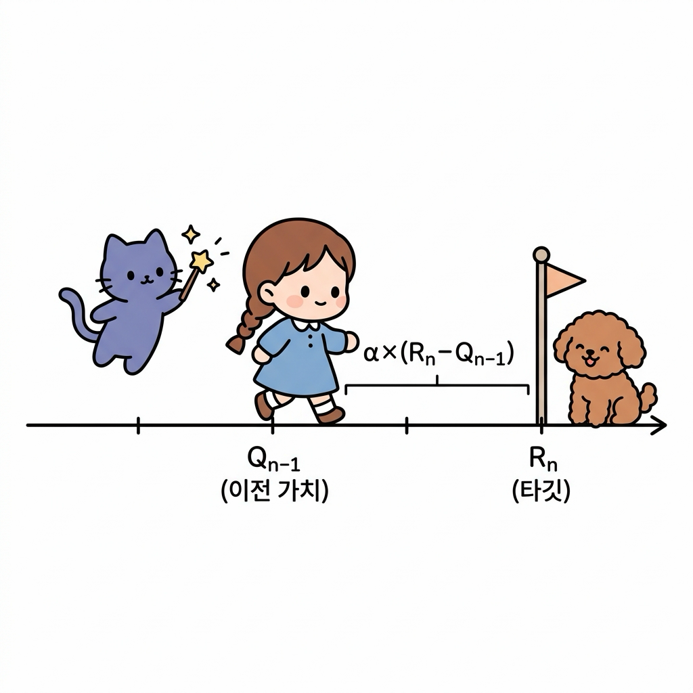
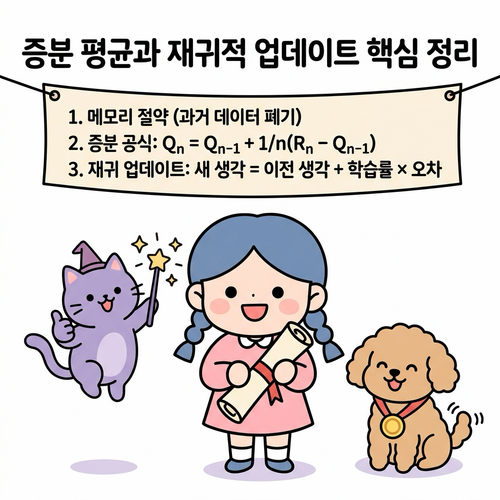

# 02.7 증분 평균과 재귀적 업데이트

> 이 장에서는 데이터를 무제한으로 기억하지 않고도 실시간으로 평균을 계산할 수 있는 **증분 평균 공식**의 유도 과정과, 이전 상태의 지식에 새로운 정보를 버무려 업데이트하는 **재귀적 업데이트**의 수학적 의미를 심도 있게 배웁니다.


---


## 02.7.1 메모리를 아끼는 마법의 실시간 평균 공식

데이터가 수백만 개 쌓였을 때 매번 합산을 다시 구해 평균을 내는 것은 컴퓨터 메모리와 연산에 극심한 과부하를 줍니다. 


"지니! 에이전트가 겪은 모든 수천 번의 보상 데이터를 저장해 두고 매번 평균을 다시 구하려면, 데이터 개수만큼 컴퓨터의 메모리 저장 공간이 계속 낭비되잖아. 혹시 과거 데이터를 하나도 저장하지 않고도 실시간으로 똑똑하게 평균을 구하는 방법은 없을까?"


**그림 02-7-1** 끊임없이 쏟아지는 수천 번의 보상 데이터 때문에 메모리가 가득 차(Memory Full!) 어쩔 줄 몰라 하는 도로시와 걱정하는 토토, 그리고 마법을 준비하는 지니


도로시가 갈색 단발머리를 쓸어 넘기며 책상 위에 수없이 쌓인 과거 데이터 장부들을 보고 한숨을 폭 쉬었습니다. 


토토는 그 옆에서 꼬리를 살랑살랑 흔들며 지니를 쳐다보았습니다. 

지니가 영리한 눈빛으로 돋보기를 고쳐 쓰고는 보랏빛 털을 털며 공중에 푸른 마법 연기와 함께 조그마한 주문 카드를 꺼내 보였습니다.


**그림 02-7-2** 모든 데이터 장부를 갖고 있어야 하는 단순 표본 평균 방식과 최소한의 요약 정보(이전 평균, 횟수, 신규 데이터) 카드로 빠르게 실시간 평균을 구하는 증분 평균 방식의 비교


"도로시! 아주 훌륭한 통찰이야. 컴퓨터의 메모리를 거의 쓰지 않으면서도 완벽한 평균을 낼 수 있는 비장의 무기가 바로 **증분 평균 공식(Incremental Mean Formula)**이란다. 이전 평균값과 이번에 얻은 신규 데이터, 그리고 누적 횟수 딱 3가지만 있으면 새로운 평균을 즉시 뽑아낼 수 있어!"


"와! 진짜 모든 과거 데이터를 다 찢어버려도 카드에 적힌 공식 하나면 평균이 바로 갱신되네!"

도로시가 신기한 듯 수첩을 펼쳐 들며 반짝이는 눈으로 물었습니다. 


"어떻게 이런 기적 같은 공식이 유도되는지 칠판의 유도 과정을 차근차근 살펴보자꾸나."

지니가 요술봉을 흔들자 칠판 위로 마법처럼 공식과 유도 전개식이 환하게 떠올랐습니다.


**그림 02-7-3** 지니가 요술봉을 휘두르자 칠판 위에 마법의 빛으로 환하게 떠오르는 증분 평균 공식(Incremental Mean Formula)을 초롱초롱한 눈으로 필기하는 도로시와 구경하는 토토


---


### 2.7.1.1 학습 목표

* 모든 과거 데이터를 누적 저장하여 평균을 구하는 방식(단순 표본 평균)의 메모리 및 연산 성능 한계를 이해한다.
* 증분 평균 공식이 도출되는 대수적 유도 과정을 이해하고 단계별로 설명할 수 있다.
* 강화학습 업데이트의 기둥인 `새 값 = 이전 값 + 학습률 × 오차(타깃 - 이전 값)`의 구조와 직관을 명확히 이해한다.


---


### 2.7.1.2 평균이란 무엇이며 어떤 종류가 있을까?

"지니, 그런데 우리가 보통 '평균'이라고 부르는 것에도 여러 종류가 있어? 단순히 다 더해서 개수로 나누는 것 말고 또 다른 방법이 있는 거지?"

도로시가 호기심 가득한 눈으로 수첩을 펴며 물었습니다. 


**그림 02-7-4** 수첩과 연필을 들고 단순히 모든 데이터를 더해 나누는 방법 외에 어떤 종류의 평균이 더 있는지 궁금해하는 도로시와 의아해하는 토토, 그리고 대답을 준비하는 지니


지니는 요술봉으로 허공에 커다란 천칭 저울과 모험 지도를 띄웠습니다.

"그럼! 평균이란 여러 데이터를 대표하는 '가운데 중심점'을 찾는 마법인데, 상황과 목적에 따라 계산 방식이 다양하단다. 크게 네 가지가 대표적이지."


**그림 02-7-5** 동일한 비중을 다루는 산술 평균, 중요도를 다르게 저울질하는 가중 평균, 최근 발자국 일부만 관찰하는 이동 평균의 차이를 공부하는 도로시와 지니, 토토


---


#### 1. 단순 산술 평균 (Simple Arithmetic Mean)

모든 데이터의 가치나 비중을 동일하게(1/*n*) 보고 전부 더해 전체 개수로 나누는 가장 보편적인 평균 계산법입니다. 예를 들어 학교에서 시험 과목들의 평균 점수를 낼 때 사용합니다.

$$
\bar{x} = \frac{1}{n} \sum_{i=1}^{n} x_i = \frac{x_1 + x_2 + \dots + x_n}{n}
$$


**그림 02-7-6** 4개의 동일한 사과를 4개의 접시에 똑같이 1/4씩 나누어 담아 모든 데이터에 동등한 비중(1/n)을 부여하는 단순 산술 평균의 원리


---


#### 2. 가중 평균 (Weighted Mean)

데이터마다 **중요도**(가중치 *w*<sub>*i*</sub>)를 다르게 부여하여 평균을 구하는 방법입니다. 


예를 들어 3학점짜리 수학 과목은 1학점짜리 교양 과목보다 전체 학점 평균에 3배 큰 영향(가중치)을 미칩니다. 강화학습에서 에이전트가 행동을 고를 때 정책 확률 *π*(*a*|*s*)를 가중치로 곱해 기댓값을 구하는 과정도 대표적인 가중 평균입니다.


$$
\bar{x}_w = \frac{\sum_{i=1}^{n} w_i x_i}{\sum_{i=1}^{n} w_i}
$$


만약 모든 가중치의 합이 1(Σ *w*<sub>*i*</sub> = 1)로 정규화되어 있다면 식은 더욱 간단해집니다.


$$
\bar{x}_w = \sum_{i=1}^{n} w_i x_i = w_1 x_1 + w_2 x_2 + \dots + w_n x_n
$$


**그림 02-7-7** 3배의 중요도를 가진 다이아몬드와 일반 조약돌들을 저울에 올려놓고 중요도(가중치)에 따라 중심을 맞추는 가중 평균의 원리


---


#### 3. 이동 평균 (Moving Average)

끝없이 쏟아지는 시계열 흐름 데이터 속에서, 전체가 아닌 **최근 일정 구간**(*k*개의 최신 창문)의 데이터만을 골라내어 실시간으로 창을 이동시키며 구하는 평균입니다. 


주식 시장의 5일/20일 이동평균선이나 실시간 센서 신호의 잡음을 걸러낼 때 널리 쓰입니다.
$$
\text{SMA}_t = \frac{1}{k} \sum_{i=0}^{k-1} x_{t-i} = \frac{x_t + x_{t-1} + \dots + x_{t-k+1}}{k}
$$


**그림 02-7-8** 지나간 오래된 발자국들은 버리고 최근 *k*=3개의 최신 발자국만을 투명 창문(Moving Window)에 담아 평균을 추적하는 이동 평균의 원리


---


#### 4. 지수 이동 평균 (Exponential Moving Average, EMA)

가장 **최신의 데이터에는 가장 높은 가중치**를 부여하고, 과거 데이터로 거슬러 올라갈수록 영향력을 지수함수적으로 점차 줄여나가는 평균 방식입니다. 


바로 직전의 평균값과 최신 데이터를 버무려 가볍게 갱신할 수 있어 강화학습의 **재귀적 가치 갱신(TD 학습, Q-learning)**의 수학적 모태가 됩니다.


$$
\text{EMA}_t = \alpha x_t + (1 - \alpha) \text{EMA}_{t-1}
$$


여기서 *α*(0 < *α* ≤ 1)는 최신 정보를 얼마나 적극적으로 반영할지 결정하는 평활 계수(학습률)입니다.


**그림 02-7-9** 가장 최근 데이터(별)는 크고 밝은 가중치(α)를 받고, 오래된 과거로 갈수록 혜성의 꼬리처럼 기하급수적으로 영향력((1-α), (1-α)²)이 줄어드는 지수 이동 평균의 원리


---


### 2.7.1.3 단순 표본 평균 vs 증분 표본 평균


#### 1. 단순 표본 평균 (Naive Mean)

매 시점마다 모든 보상값 *R*<sub>*i*</sub>를 메모리에 고스란히 담아 기억해 두었다가, 총합을 구하여 데이터의 수 *n*으로 나누는 고전적인 방식입니다.

$$
Q_n = \frac{R_1 + R_2 + \dots + R_n}{n}
$$


**그림 02-7-10** 과거의 모든 보상 기록 데이터(R₁, R₂, ..., Rₙ)를 상자에 무겁게 쌓아두고 매번 합산을 계산해야 하는 단순 표본 평균 방식의 메모리 부담

> **⚠️ 한계점**: 데이터가 쌓일수록 합산을 구하는 `sum()` 연산의 연산 복잡도가 늘어나고, 컴퓨터 메모리가 누적 보상 데이터로 가득 차 과부하가 걸리게 됩니다.


---


#### 2. 증분 표본 평균 (Incremental Mean)

과거의 개별 보상 리스트를 즉시 지워버리고, 오직 바로 **직전의 평균값 *Q*<sub>*n*-1</sub>**과 이번에 획득한 보상 *R*<sub>*n*</sub>, 그리고 현재의 누적 횟수 *n*만을 사용하여 평균을 갱신하는 실시간 평균 공식입니다.

$$
Q_n = Q_{n-1} + \frac{1}{n} (R_n - Q_{n-1})
$$


**그림 02-7-11** 과거의 모든 장부를 보관할 필요 없이 단 한 장의 마법 카드로 새로운 보상(Rₙ)이 들어올 때마다 실시간으로 평균을 즉시 갱신하는 증분 표본 평균 방식

> **💡 장점**: 과거의 개별 보상 기록들을 보관해 둘 필요가 전혀 없어 메모리 소모가 거의 제로에 수렴하며, 단 한 번의 사칙연산으로 실시간 업데이트가 끝납니다.


---

### 2.7.1.4 증분 공식의 유도 과정 (Derivation)

지니가 가리키는 칠판에는 도로시가 학교에서 배웠던 치환과 분배법칙을 활용한 논리적인 식 전개 과정이 빛나고 있었습니다.

1. *n* - 1번째 시점까지의 표본 평균 정의식에서 출발합니다.
   
$$
Q_{n-1} = \frac{R_1 + R_2 + \dots + R_{n-1}}{n-1}
$$

2. 위 식의 양변에 *n* - 1을 곱해 분자(보상들의 합) 부분만 남겨둡니다.
   
$$
(n-1) Q_{n-1} = R_1 + R_2 + \dots + R_{n-1}
$$

3. 이제 *n*번째 시점의 표본 평균 정의식에 위의 합산 덩어리를 통째로 대입합니다.
   
$$
Q_n = \frac{(R_1 + R_2 + \dots + R_{n-1}) + R_n}{n}
$$

$$
Q_n = \frac{(n-1) Q_{n-1} + R_n}{n}
$$

4. 분자를 분배법칙을 이용해 괄호를 풀어 정리합니다.
   
$$
Q_n = \frac{n Q_{n-1} - Q_{n-1} + R_n}{n}
$$

5. 식을 분수별로 쪼개어 단순화하면 최종 증분 공식이 깔끔하게 완성됩니다.
   
$$
Q_n = \frac{n Q_{n-1}}{n} + \frac{R_n - Q_{n-1}}{n}
$$

$$
Q_n = Q_{n-1} + \frac{1}{n} (R_n - Q_{n-1})
$$


"와! 중학교 때 배웠던 치환과 분배 법칙만으로 이렇게 효율적인 증분 평균 수식이 유도되다니 마법 같아!"


도로시가 징검다리를 하나하나 건너듯 유도 단계를 이해하고 수첩에 꼼꼼히 받아적었습니다.


**그림 02-7-12** 5단계의 대수적 치환과 분배법칙을 징검다리 건너듯 차근차근 밟아 증분 평균 공식을 유도해 내는 도로시와 지니, 토토


---


### 2.7.1.5 공식의 물리적 의미와 재귀적 업데이트

지니는 도로시에게 이 공식이 단순한 평균 계산을 넘어 강화학습의 학습(Learning) 메커니즘 그 자체를 담고 있다고 설명했습니다.


$$
Q_n = Q_{n-1} + \alpha (R_n - Q_{n-1})
$$


여기서 1 / *n*을 시간 흐름에 따라 변화하는 가중치 혹은 고정된 값인 학습률 *α*로 바꾸어 작성하면, 강화학습의 핵심 골격인 **시간차(Temporal Difference) 업데이트 수식**이 완성됩니다.


$$
Q_n = Q_{n-1} + \text{StepSize} \times [ \text{Target} - Q_{n-1} ]
$$

> **💡 수식 기호 해설:**
>
> * **타깃 (Target, *R*<sub>*n*</sub>)**: 이번 단계에서 에이전트가 마주한 실제 환경의 보상이나 최종 목표치입니다.
> * **예측 오차 (Error, *R*<sub>*n*</sub> - *Q*<sub>*n*-1</sub>)**: 실제 발생한 사건(타깃)과 기존에 가지고 있던 내 생각(이전 예측) 간의 격차입니다.
> * **학습률 (StepSize, *α*)**: 이 오차 정보를 받아들여 내 생각의 나침반을 얼마나 강하게 꺾을지 결정하는 피드백 다이얼의 크기입니다.


"도로시, 이 수식이 뜻하는 진짜 직관적인 의미는 다음과 같단다."

지니가 눈앞에 신비로운 학습률 다이얼을 띄워 돌려 보였습니다.

> **💡 직관적인 생각의 업데이트 규칙**
> "에이전트인 너의 새로운 생각(*Q*<sub>*n*</sub>)은, **[기존의 내 생각(*Q*<sub>*n*-1</sub>)]**에다가 **[내가 틀린 오차(진짜 보상 - 예전 예측)]**의 일부(**[학습률]**)만큼을 곱해 보정하며 조금씩 다듬어 나가는 과정이란다."


**그림 02-7-13** 학습률(α) 다이얼을 돌려 새로운 오차 정보를 기존 생각에 얼마나 빠르고 강하게 피드백할 것인지 결정하는 갱신 원리


"아! 다이얼을 높여서 크게 돌리면 최신 정보(오차)를 많이 반영해서 생각이 휙휙 빠르게 변하고, 낮게 설정하면 예전 예측을 고집하면서 아주 신중하게 보정하겠네!"

도로시가 고개를 끄덕이자 토토도 동조하듯 다이얼 근처를 앞발로 콕 짚었습니다.


**그림 02-7-14** 수직선상에서 이전 가치 Q<sub>n-1</sub>이 예측 오차와 학습률을 곱한 크기만큼 타깃(R<sub>n</sub>) 방향으로 점진적으로 한 걸음씩 보정되는 갱신 메커니즘


"바로 그거야. 이 오차 방향으로 한 걸음씩 기존의 가치를 끌고 가는 방식이 강화학습 학습 알고리즘의 위대한 출발점이란다."


지니가 부드러운 목소리로 덧붙였습니다.


---


### 2.7.1.6 파이썬으로 구현하는 실시간 평균 계산기

지니가 수첩 뒤에 마법의 파이썬 코드 카드를 한 장 꽂아 주었습니다. 


이 코드는 단순 표본 평균과 증분 표본 평균이 연산 과정에서 메모리를 다루는 실제 차이를 잘 보여줍니다.

```python
# 단순 표본 평균(Naive)과 증분 표본 평균(Incremental) 방식 비교 시뮬레이션
rewards = [1.0, 2.0, 4.0, 3.0, 5.0]

# 1. Naive 표본 평균 방식 (과거 모든 값을 보관해야 함)
naive_sum = 0.0
naive_averages = []
for n, r in enumerate(rewards, 1):
    naive_sum += r
    q_n = naive_sum / n  # 모든 합을 매번 횟수 n으로 나눔
    naive_averages.append(q_n)

# 2. Incremental 표본 평균 방식 (과거 리스트 폐기 가능)
q_incremental = 0.0  # 이전 평균 Q_{n-1} (초기화 0.0)
incremental_averages = []
for n, r in enumerate(rewards, 1):
    # 이전 평균 q_incremental and n, 신규 데이터 r만으로 즉시 계산
    q_incremental = q_incremental + (1 / n) * (r - q_incremental)
    incremental_averages.append(q_incremental)

print("Naive Averages       :", naive_averages)
print("Incremental Averages :", incremental_averages)
```

> **💻 실행 결과:**
> ```text
> Naive Averages       : [1.0, 1.5, 2.3333333333333335, 2.5, 3.0]
> Incremental Averages : [1.0, 1.5, 2.3333333333333335, 2.5, 3.0]
> ```
> 두 결과는 소수점 아래까지 완벽히 일치하지만, **증분 표본 평균**은 이전의 평균값 하나만 기억하고 있으면 되기 때문에 데이터 크기가 무제한으로 증가하더라도 리스트를 계속 키울 필요가 없습니다.


---


## 02.7.2 실전 예제

학습한 내용을 바탕으로 다음 문제를 직접 해결해 봅시다.

### 2.7.2.1 문제 1 (증분 공식 계산)

> 이전까지 계산된 코인의 표본 평균값 *Q*<sub>4</sub> = 3.5 이었습니다. 5번째 기계를 플레이하여 획득한 보상 *R*<sub>5</sub> = 6.0 일 때, 메모리를 절약하는 증분 평균 공식을 사용하여 새로운 표본 평균 *Q*<sub>5</sub>를 계산하시오.
>
> **풀이**:
> 증분 표본 평균 공식을 적용합니다.
>
$$
Q_5 = Q_4 + \frac{1}{5} (R_5 - Q_4)
$$
>
> 주어진 값들을 대입합니다.
>
$$
Q_5 = 3.5 + 0.2 \times (6.0 - 3.5)
$$
>
$$
Q_5 = 3.5 + 0.2 \times 2.5
$$
>
$$
Q_5 = 3.5 + 0.5 = 4.0
$$
>**정답**: 4.0


---


## 02.7.3 핵심 요약


**그림 02-7-15** 과거 데이터를 모두 기억하지 않고도 이전 지식과 새로운 오차 정보만으로 생각을 점진적으로 발전시키는 증분 평균과 재귀적 업데이트 단원의 핵심 정리

1. **단순 평균** 방식은 과거 모든 데이터를 저장해야 하므로 연산량과 메모리가 폭발하지만, **증분 평균** 방식은 최신 데이터와 이전 평균만을 사용하므로 고도로 효율적이다.
2. 증분 공식은 이전 평균 식을 치환하여 대입해 괄호를 풀고 분배하는 일련의 대수적 전개 과정을 통해 도출된다.
3. 이 공식은 강화학습 갱신 알고리즘의 근간인 **`새 가치 = 이전 가치 + 학습률 × 오차`** 형태를 띠며, 이는 오차 방향으로 기존 지식을 점진적으로 보정하는 학습 규칙을 정의한다.
