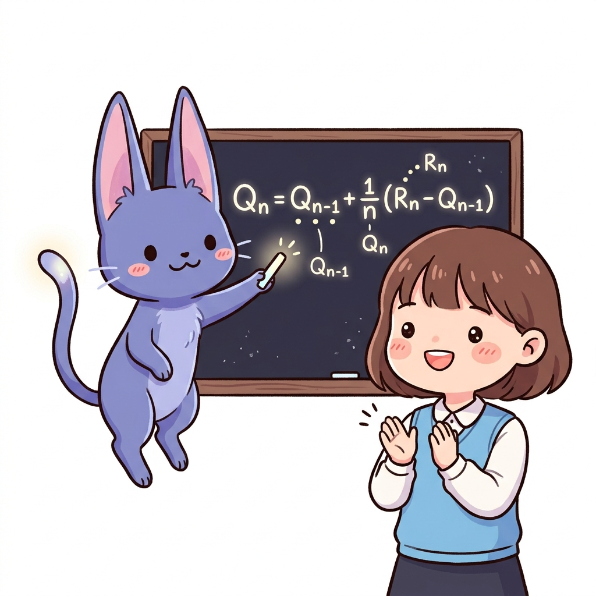
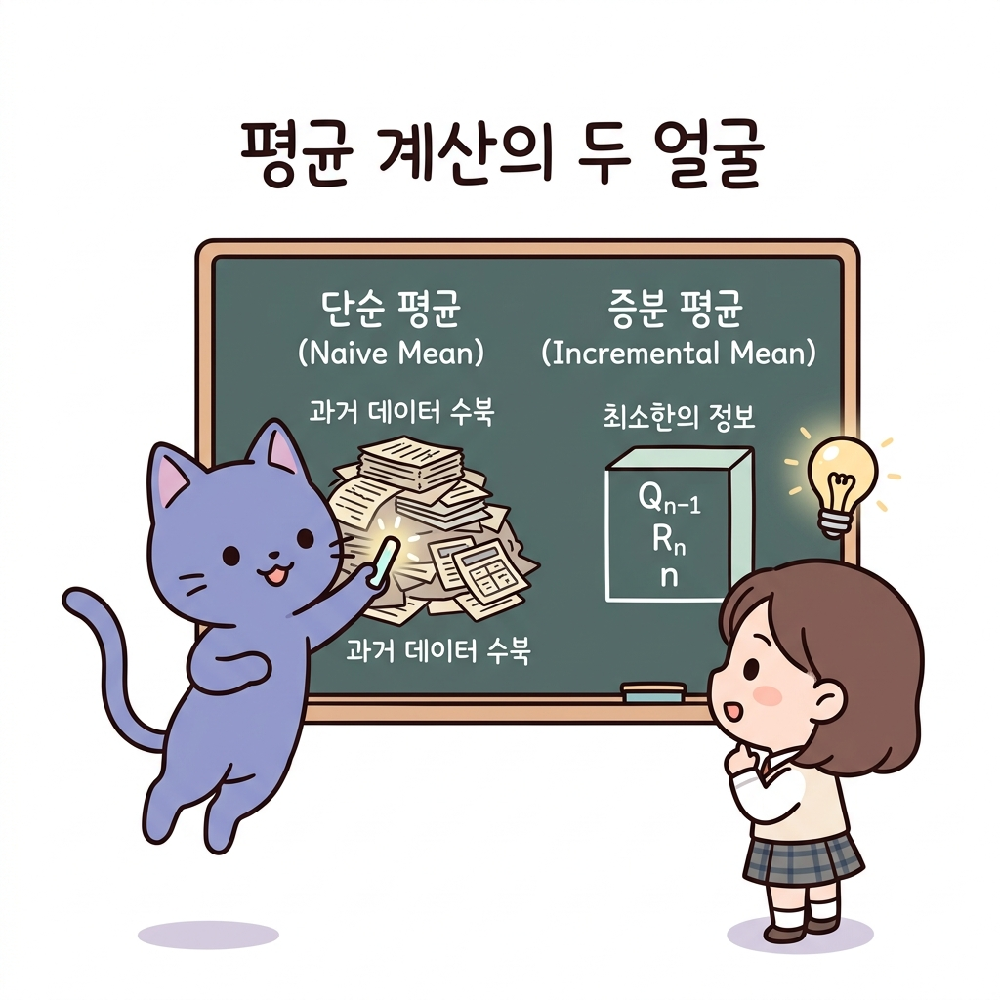
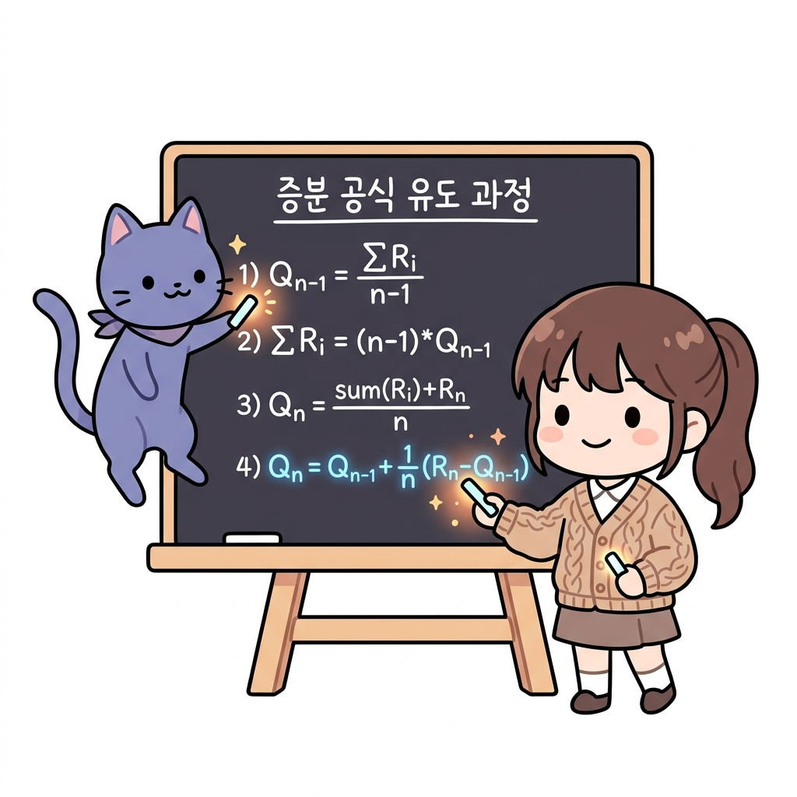
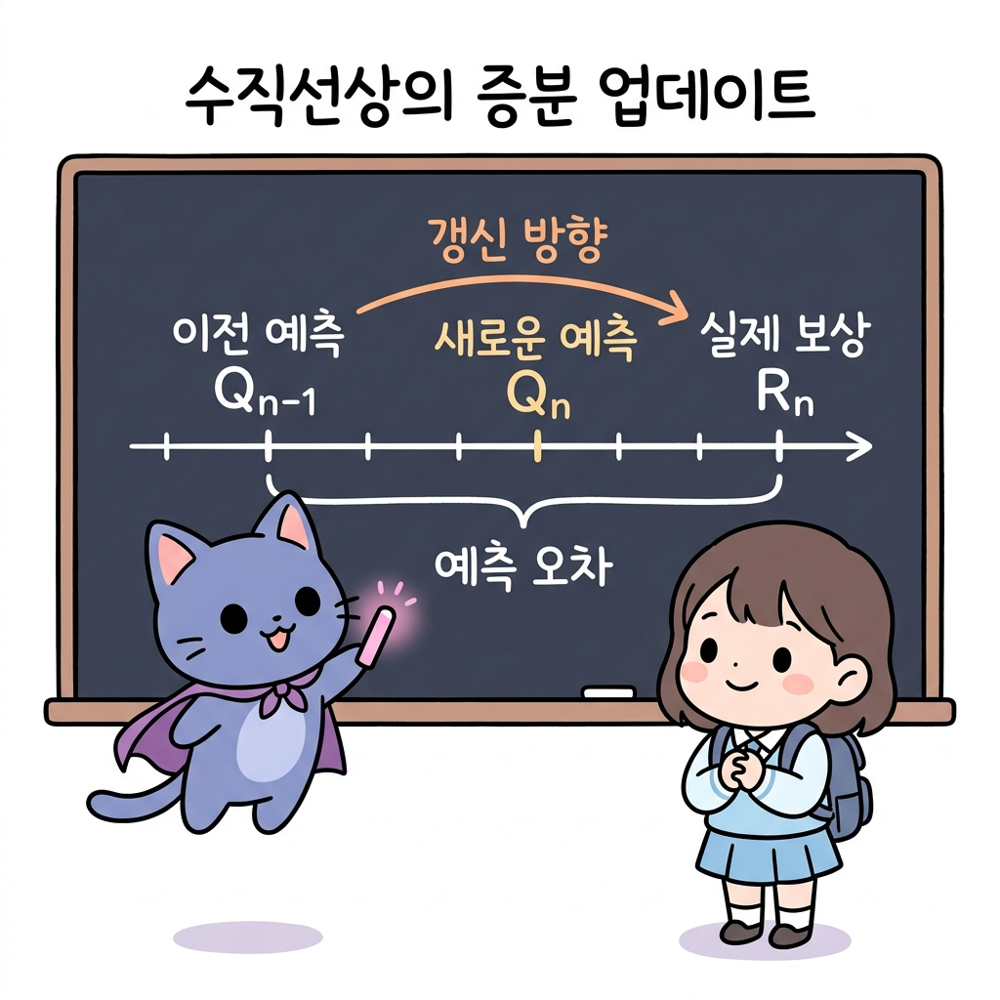

# 02.7 증분 평균과 재귀적 업데이트

> 이 장에서는 데이터를 무제한으로 기억하지 않고도 실시간으로 평균을 계산할 수 있는 **증분 평균 공식**의 유도 과정과, 이전 상태의 지식에 새로운 정보를 버무려 업데이트하는 **재귀적 업데이트**의 수학적 의미를 심도 있게 배웁니다.

---

## 02.7.1 메모리를 아끼는 마법의 실시간 평균 공식

**그림 02-7-1** 기존의 두꺼운 평균 장부를 찢고, 새로운 보상 하나만으로 실시간 점수를 갱신하는 칠판 필기 속 지니와 박수 치는 도로시

데이터가 수백만 개 쌓였을 때 매번 합산을 다시 구해 평균을 내는 것은 컴퓨터 메모리와 연산에 극심한 과부하를 줍니다. 이전 평균값(*Q**n*-1)과 직전 획득한 보상(*R**n*), 그리고 횟수(*n*) 단 3개의 숫자만으로 완벽한 새 평균을 뽑아내는 **증분 공식**의 원리를 지니의 칠판 유도 과정을 통해 정복해봅시다!

---

### 1. 학습 목표
- 모든 과거 데이터를 누적 저장하여 평균을 구하는 방식(단순 표본 평균)의 메모리 및 연산 성능 한계를 이해한다.
- 증분 평균 공식 *Q**n* = *Q**n*-1 + (1 / *n*)(*R**n* - *Q**n*-1)이 도출되는 대수적 유도 과정을 이해하고 설명할 수 있다.
- 강화학습 업데이트의 기둥인 `새 값 = 이전 값 + 학습률 * 오차(타깃 - 이전 값)`의 구조와 직관을 명확히 이해한다.

---

### 2. 핵심 개념

#### (1) 단순 표본 평균 vs 증분 표본 평균
- **단순 표본 평균 (Naive Mean)**:
  *Q**n* = (*R*1 + *R*2 + ... + *R**n*) / *n*
  - *단점*: 보상값 *R**i* 전체를 메모리(리스트)에 들고 있어야 하며, *n*이 1,000, 10,000으로 커지면 매 갱신 시 `sum()` 연산의 소모 비용이 계속 증가합니다.
- **증분 표본 평균 (Incremental Mean)**:
  *Q**n* = *Q**n*-1 + (1 / *n*) * (*R**n* - *Q**n*-1)
  - *장점*: 과거 리스트를 보관할 필요가 전혀 없으며, 오직 이전 평균 *Q**n*-1과 현재 횟수 *n*, 신규 보상 *R**n*만 알고 있으면 한 번의 덧셈/나눗셈으로 실시간 평균이 완성됩니다.

**그림 02-7-2** 모든 데이터를 다 기억하는 단순 평균과 최소한의 정보만으로 갱신하는 증분 평균 방식의 비교

#### (2) 증분 공식의 유도 과정 (Derivation)
이 공식은 02.1장에서 배운 **대입과 치환, 분배법칙**을 사용해 다음과 같이 완벽히 유도됩니다.
1. *n* - 1번째 시점의 표본 평균 정의:
   *Q**n*-1 = (*R*1 + ... + *R**n*-1) / (*n* - 1)
2. 분자의 합 부분만 남기고 양변에 *n* - 1을 곱함:
   *R*1 + ... + *R**n*-1 = (*n* - 1) * *Q**n*-1  ➔ **[대수 변형]**
3. *n*번째 시점의 표본 평균 정의에 위 식을 대입(치환):
   *Q**n* = (*R*1 + ... + *R**n*-1 + *R**n*) / *n*
   *Q**n* = [ (*n* - 1) * *Q**n*-1 + *R**n* ] / *n*  ➔ **[치환 대입]**
   *Q**n* = [ *n**Q**n*-1 - *Q**n*-1 + *R**n* ] / *n*
   *Q**n* = *Q**n*-1 + (1 / *n*) * (*R**n* - *Q**n*-1)  ➔ **[분배법칙 정리 완료!]**

**그림 02-7-3** 대입법과 치환, 분배법칙을 활용하여 증분 평균 수식을 대수적으로 유도해내는 단계별 전개식

#### (3) 공식의 물리적 의미와 재귀적 업데이트 (Temporal Difference 구조)
*Q**n* = *Q**n*-1 + *StepSize* * [ *Target* - *Q**n*-1 ]
- **타깃 (*Target*, *R**n*)**: 이번 시행에서 도달하고자 했던 실제 결과값입니다.
- **예측 오차 (*Error*, *R**n* - *Q**n*-1)**: 실제 관측된 보상과 나의 기존 예상값(*Q**n*-1)의 차이(노이즈)입니다.
- **학습률 (*StepSize*, 1 / *n* 또는 *α*)**: 이 오차를 나의 기존 생각에 얼마나 강하게 피드백하여 수정할 것인지 결정하는 비율입니다.

> **💡 직관적으로 이해하기**
> "새로운 생각은 예전 생각에다가, 내가 틀린 오차(진짜 보상 - 예전 예측)의 일부를 반영해서 조금씩 고쳐나가는 것이란다."

**그림 02-7-4** 이전 추정치에 오차와 학습률을 곱한 피드백을 더하여 가치를 점진적으로 개선해나가는 업데이트의 핵심 관계식

---

### 3. 시각 자료: 증분식 갱신 시 수직선상 위치 관계

**그림 02-7-5** 이전 가치 추정치 *Q**n*-1에서 예측 오차 방향으로 일정 비율만큼 이동하여 새 추정치 *Q**n*을 갱신하는 원리

---

### 4. 실전 예제

#### 예제 1 (증분 공식 계산)
> **문제**: 이전까지 계산된 코인의 표본 평균값 *Q*4 = 3.5 이었습니다. 5번째 기계를 플레이하여 획득한 보상 *R*5 = 6.0 일 때, 메모리를 절약하는 증분 평균 공식을 사용하여 새로운 표본 평균 *Q*5를 계산하시오.
>
> **풀이**:
> 증분 표본 평균 공식을 적용합니다:
> - *Q*5 = *Q*4 + (1 / 5) * (*R*5 - *Q*4)
> - 주어진 값들을 대입합니다:
>   *Q*5 = 3.5 + 0.2 * (6.0 - 3.5)
>   *Q*5 = 3.5 + 0.2 * 2.5
>   *Q*5 = 3.5 + 0.5 = 4.0
> **정답**: 4.0

---

### 5. 핵심 요약
1. **단순 평균** 방식은 과거 모든 데이터를 저장해야 하므로 연산량과 메모리가 폭발하지만, **증분 평균** 방식은 최신 데이터와 이전 평균만을 사용하므로 고도로 효율적이다.
2. 증분 공식은 이전 평균 식을 치환하여 대입해 괄호를 풀고 분배하는 일련의 대수적 전개 과정을 통해 도출된다.
3. 이 공식은 강화학습 갱신 알고리즘의 근간인 **`새 가치 = 이전 가치 + 학습률 * 오차`** 형태를 띠며, 이는 오차 방향으로 기존 지식을 점진적으로 보정하는 학습 규칙을 정의한다.
