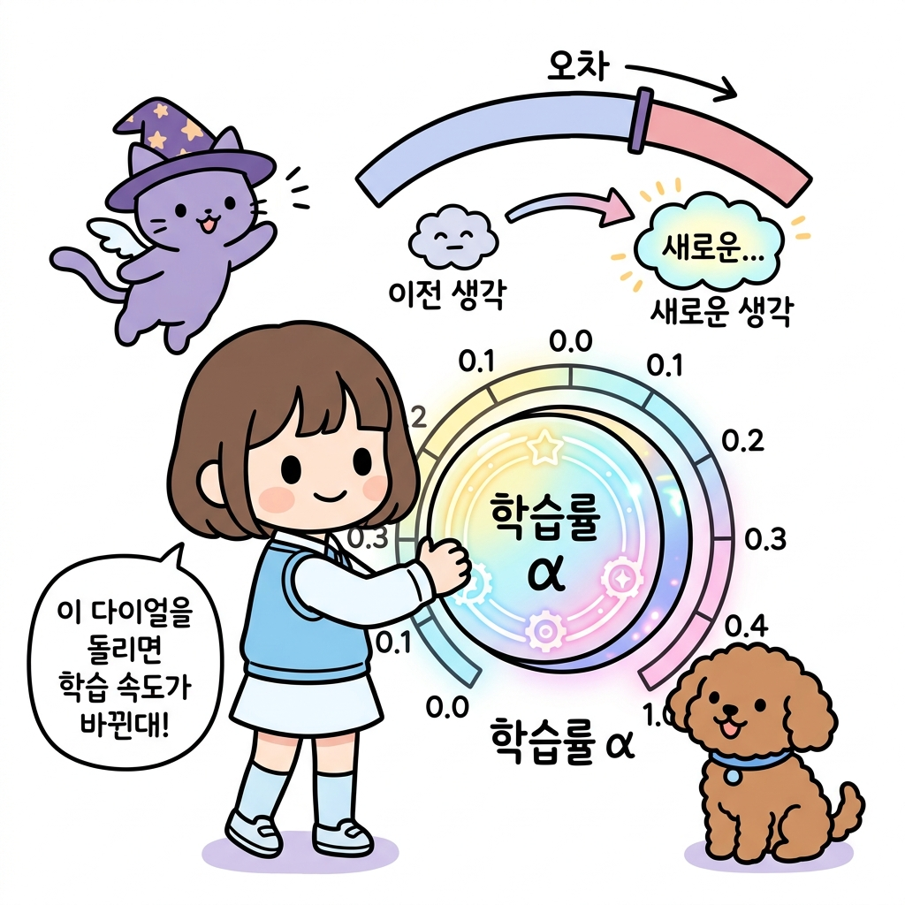
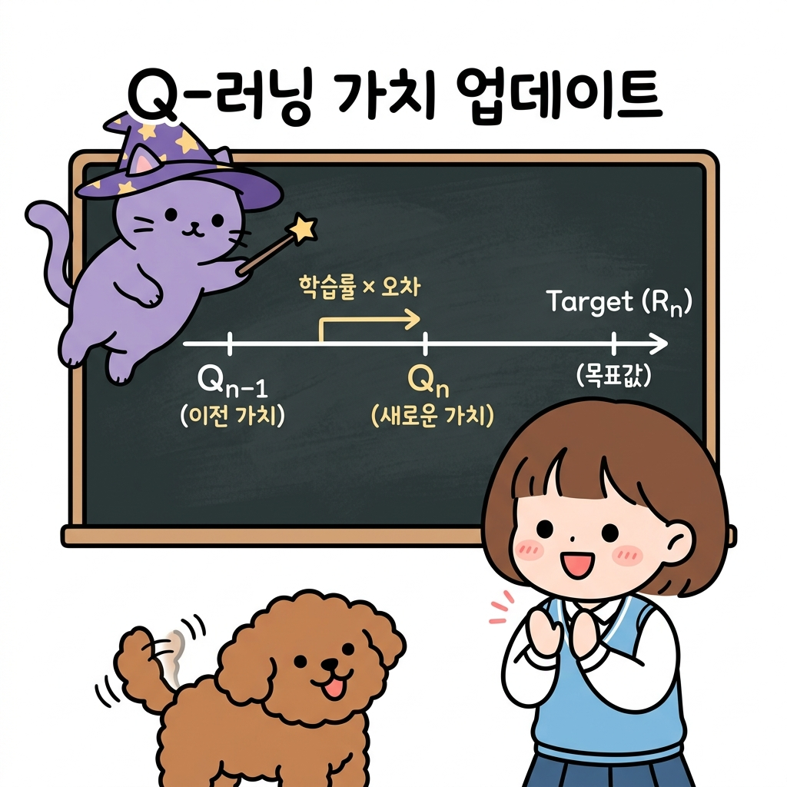

# 02.7 증분 평균과 재귀적 업데이트

> 이 장에서는 데이터를 무제한으로 기억하지 않고도 실시간으로 평균을 계산할 수 있는 **증분 평균 공식**의 유도 과정과, 이전 상태의 지식에 새로운 정보를 버무려 업데이트하는 **재귀적 업데이트**의 수학적 의미를 심도 있게 배웁니다.

---

## 02.7.1 메모리를 아끼는 마법의 실시간 평균 공식

데이터가 수백만 개 쌓였을 때 매번 합산을 다시 구해 평균을 내는 것은 컴퓨터 메모리와 연산에 극심한 과부하를 줍니다. 

"지니! 에이전트가 겪은 모든 수천 번의 보상 데이터를 저장해 두고 매번 평균을 다시 구하려면, 데이터 개수만큼 컴퓨터의 메모리 저장 공간이 계속 낭비되잖아. 혹시 과거 데이터를 하나도 저장하지 않고도 실시간으로 똑똑하게 평균을 구하는 방법은 없을까?"

도로시가 책상 위에 수없이 쌓인 과거 데이터를 가리키며 한숨을 폭 쉬었습니다. 토토는 그 옆에서 꼬리를 살랑살랑 흔들며 지니를 쳐다보았습니다. 지니가 돋보기를 고쳐 쓰고는 요술봉으로 조그마한 주문 카드를 꺼내 보였습니다.

"도로시! 아주 훌륭한 통찰이야. 컴퓨터의 메모리를 거의 쓰지 않으면서도 완벽한 평균을 낼 수 있는 비장의 무기가 바로 **증분 평균 공식(Incremental Mean Formula)**이란다. 이전 평균값과 이번에 얻은 신규 데이터, 그리고 누적 횟수 딱 3가지만 있으면 새로운 평균을 즉시 뽑아낼 수 있어!"

**그림 02-7-1** 모든 데이터 장부를 갖고 있어야 하는 단순 표본 평균 방식과 최소한의 요약 정보(이전 평균, 횟수, 신규 데이터) 카드로 빠르게 실시간 평균을 구하는 증분 평균 방식의 비교

"와! 진짜 모든 과거 데이터를 다 찢어버려도 카드에 적힌 공식 하나면 평균이 바로 갱신되네!"

도로시가 기뻐하며 물었습니다. 

"어떻게 이런 기적 같은 공식이 유도되는지 칠판의 유도 과정을 차근차근 살펴보자꾸나."

---

### 1. 학습 목표
- 모든 과거 데이터를 누적 저장하여 평균을 구하는 방식(단순 표본 평균)의 메모리 및 연산 성능 한계를 이해한다.
- 증분 평균 공식 *Q**n* = *Q**n*-1 + (1 / *n*)(*R**n* - *Q**n*-1)이 도출되는 대수적 유도 과정을 이해하고 설명할 수 있다.
- 강화학습 업데이트의 기둥인 `새 값 = 이전 값 + 학습률 × 오차(타깃 - 이전 값)`의 구조와 직관을 명확히 이해한다.

---

### 2. 핵심 개념

#### (1) 단순 표본 평균 vs 증분 표본 평균
* **단순 표본 평균 (Naive Mean)**:
  *Q**n* = (*R*1 + *R*2 + ... + *R**n*) / *n*
  * *단점*: 모든 보상값 *R**i*를 리스트에 담아 기억해야 하며, 데이터가 쌓일수록 합산을 구하는 `sum()`의 연산량이 기하급수적으로 늘어납니다.
* **증분 표본 평균 (Incremental Mean)**:
  *Q**n* = *Q**n*-1 + (1 / *n*) × (*R**n* - *Q**n*-1)
  * *장점*: 과거 보상 리스트를 즉시 폐기할 수 있으며, 이전 평균 *Q**n*-1과 현재 횟수 *n*, 그리고 지금 얻은 보상 *R**n*만 있으면 단 한 번의 사칙연산으로 실시간 갱신이 완료됩니다.

---

#### (2) 증분 공식의 유도 과정 (Derivation)
이 공식은 우리가 앞서 배운 대입법과 치환, 분배법칙을 결합하여 매끄럽게 유도해낼 수 있습니다.

1. *n* - 1번째 시점의 표본 평균 정의:
   *Q**n*-1 = (*R*1 + ... + *R**n*-1) / (*n* - 1)
2. 분자의 합 부분만 남기고 양변에 *n* - 1을 곱해 형태를 변형시킵니다:
   *R*1 + ... + *R**n*-1 = (*n* - 1) × *Q**n*-1
3. *n*번째 시점의 표본 평균 정의식 분자에 위 식을 치환하여 대입합니다:
   *Q**n* = (*R*1 + ... + *R**n*-1 + *R**n*) / *n*
   *Q**n* = [ (*n* - 1) × *Q**n*-1 + *R**n* ] / *n*
   *Q**n* = [ *n* × *Q**n*-1 - *Q**n*-1 + *R**n* ] / *n*
   *Q**n* = *Q**n*-1 + (1 / *n*) × (*R**n* - *Q**n*-1) (분배하여 정리 완료!)

"와! 중학교 때 배운 분해와 대입법만으로 복잡했던 평균 수식이 저렇게 효율적인 증분 식으로 유도되다니 신기해!"

도로시가 노트를 받아적으며 감탄했습니다.

---

#### (3) 공식의 물리적 의미와 재귀적 업데이트 (Temporal Difference 구조)
지니는 칠판에 적힌 공식을 가리키며 그 직관적인 물리 법칙을 도로시에게 가르쳐 주었습니다.

*Q**n* = *Q**n*-1 + *StepSize* × [ *Target* - *Q**n*-1 ]

* **타깃 (*Target*, *R**n*)**: 이번 시행에서 에이전트가 도달하고자 했던 실제 목표 결과값입니다.
* **예측 오차 (*Error*, *R**n* - *Q**n*-1)**: 실제 일어난 일(보상)과 에이전트의 예전 예측값(*Q**n*-1)의 격차(오차)입니다.
* **학습률 (*StepSize*, 1 / *n* 또는 *α*)**: 이 오차를 나의 기존 지식에 얼마나 강하게 피드백하여 수정할 것인지 결정하는 비율입니다.

"도로시, 이 수식의 진짜 의미는 다음과 같단다."

> **💡 직관적인 생각의 업데이트 규칙**
> "에이전트의 새로운 생각은, **[예전 생각]**에다가 **[내가 틀린 오차(진짜 보상 - 예전 예측)]**의 일부(**[학습률]**)만큼을 버무려서 조금씩 보정해 나가는 과정이란다."

**그림 02-7-2** 학습률(α) 다이얼을 돌려 새로운 오차 정보를 기존 생각에 얼마나 빠르고 강하게 피드백할 것인지 결정하는 갱신 원리

"아! 다이얼을 크게 돌리면 최신 정보 오차를 많이 반영해서 생각이 빠르게 변하고, 작게 돌리면 아주 조심스럽게 조금씩 수정하겠네!"

도로시가 고개를 끄덕이자 토토도 동조하듯 다이얼을 앞발로 건드렸습니다.

**그림 02-7-3** 수직선상에서 이전 가치 Qn-1이 예측 오차와 학습률을 곱한 크기만큼 타깃(Rn) 방향으로 점진적으로 한 걸음씩 보정되는 갱신 메커니즘

"바로 그거야. 이 점진적 보정 개념이 강화학습의 시간차(Temporal Difference) 학습법의 핵심 토대란다."

---

## 02.7.2 실전 예제

### 문제 1 (증분 공식 계산)
> 이전까지 계산된 코인의 표본 평균값 *Q*4 = 3.5 이었습니다. 5번째 기계를 플레이하여 획득한 보상 *R*5 = 6.0 일 때, 메모리를 절약하는 증분 평균 공식을 사용하여 새로운 표본 평균 *Q*5를 계산하시오.
>
> **풀이**:
> 증분 표본 평균 공식을 적용합니다:
> * *Q*5 = *Q*4 + (1 / 5) × (*R*5 - *Q*4)
>
> 주어진 값들을 대입합니다:
> * *Q*5 = 3.5 + 0.2 × (6.0 - 3.5)
> * *Q*5 = 3.5 + 0.2 × 2.5
> * *Q*5 = 3.5 + 0.5 = 4.0
>
> **정답**: 4.0

---

## 02.7.3 핵심 요약

1. **단순 평균** 방식은 과거 모든 데이터를 저장해야 하므로 연산량과 메모리가 폭발하지만, **증분 평균** 방식은 최신 데이터와 이전 평균만을 사용하므로 고도로 효율적이다.
2. 증분 공식은 이전 평균 식을 치환하여 대입해 괄호를 풀고 분배하는 일련의 대수적 전개 과정을 통해 도출된다.
3. 이 공식은 강화학습 갱신 알고리즘의 근간인 **`새 가치 = 이전 가치 + 학습률 × 오차`** 형태를 띠며, 이는 오차 방향으로 기존 지식을 점진적으로 보정하는 학습 규칙을 정의한다.
