# 02.8 경우의 수와 순열/조합

> 이 장에서는 **경우의 수와 순열/조합**에 관한 기초부터 심화 개념들을 유기적으로 결합하여 학습합니다.

---

## 02.8.1 경우의 수와 합의 법칙, 곱의 법칙

**그림 02-8-1** 두 갈래의 갈림길(A, B)과 각 길 속 선택지의 합/곱 가짓수를 판서하며 강의해주는 지니

경우의 수는 모험 경로에서 우리가 직면할 수 있는 모든 선택지의 수입니다. 갈림길을 차례로 덧셈하여 전체 가짓수를 알아내는 **합의 법칙**과, 문들을 연속해서 통과하며 선택지를 곱하는 **곱의 법칙**의 첫 단추를 지니와 도로시의 갈림길 판서와 함께 유쾌하게 채워봅시다!

---

### 1. 학습 목표
- 사건과 경우의 수의 뜻을 이해한다.
- 동시에 일어나지 않는 두 사건에 대해 합의 법칙을 적용할 수 있다.
- 연이어 일어나는 두 사건에 대해 곱의 법칙을 적용할 수 있다.

---

### 2. 핵심 개념

#### (1) 사건과 경우의 수
- **사건 (Event)**: 주사위를 던지거나 동전을 던지는 것과 같이, 같은 조건에서 반복할 수 있는 실험이나 관찰에 의해 나타나는 결과입니다.
- **경우의 수 (Number of Cases)**: 어떤 사건이 일어날 수 있는 가지 수입니다.
  - *예시*: 주사위 한 개를 던질 때, '짝수의 눈이 나오는 사건'의 경우의 수는 2, 4, 6으로 총 3가지입니다.

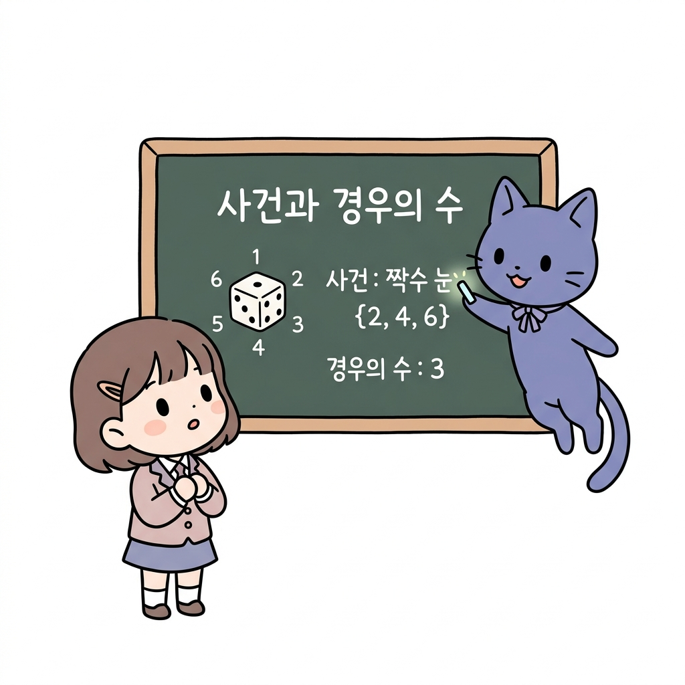
**그림 02-8-2** 하나의 주사위를 던지는 사건과 짝수 눈(2, 4, 6)이 나오는 경우의 수(3가지)의 관계

#### (2) 합의 법칙 (Addition Rule)
두 사건 *A*, *B*가 동시에 일어나지 않을 때, 사건 *A*가 일어나는 경우의 수를 *m*, 사건 *B*가 일어나는 경우의 수를 *n*이라고 하면, 사건 *A* **또는** 사건 *B*가 일어나는 경우의 수는 다음과 같습니다.
*m* + *n*
- *키워드*: **또는(Or)**, **~하거나**
- *주의*: 두 사건이 동시에 발생할 수 없을 때에만 성립합니다.

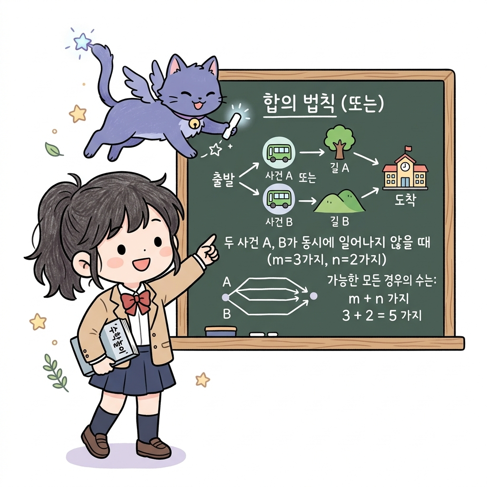
**그림 02-8-3** 두 사건 A 또는 B가 동시에 일어나지 않을 때 두 사건의 경우의 수를 합산(m + n)하여 계산하는 원리

#### (3) 곱의 법칙 (Multiplication Rule)
사건 *A*가 일어나는 경우의 수가 *m*이고, 그 각각에 대하여 사건 *B*가 일어나는 경우의 수가 *n*일 때, 두 사건 *A*, *B*가 **동시에(연이어)** 일어나는 경우의 수는 다음과 같습니다.
*m* × *n*
- *키워드*: **동시에**, **연이어**, **그리고(And)**, **~하고 나서**
- *주의*: 여기서 '동시에'는 물리적으로 같은 시각만을 의미하는 것이 아니라, 두 사건이 모두 빠짐없이 일어나는 상황을 뜻합니다.

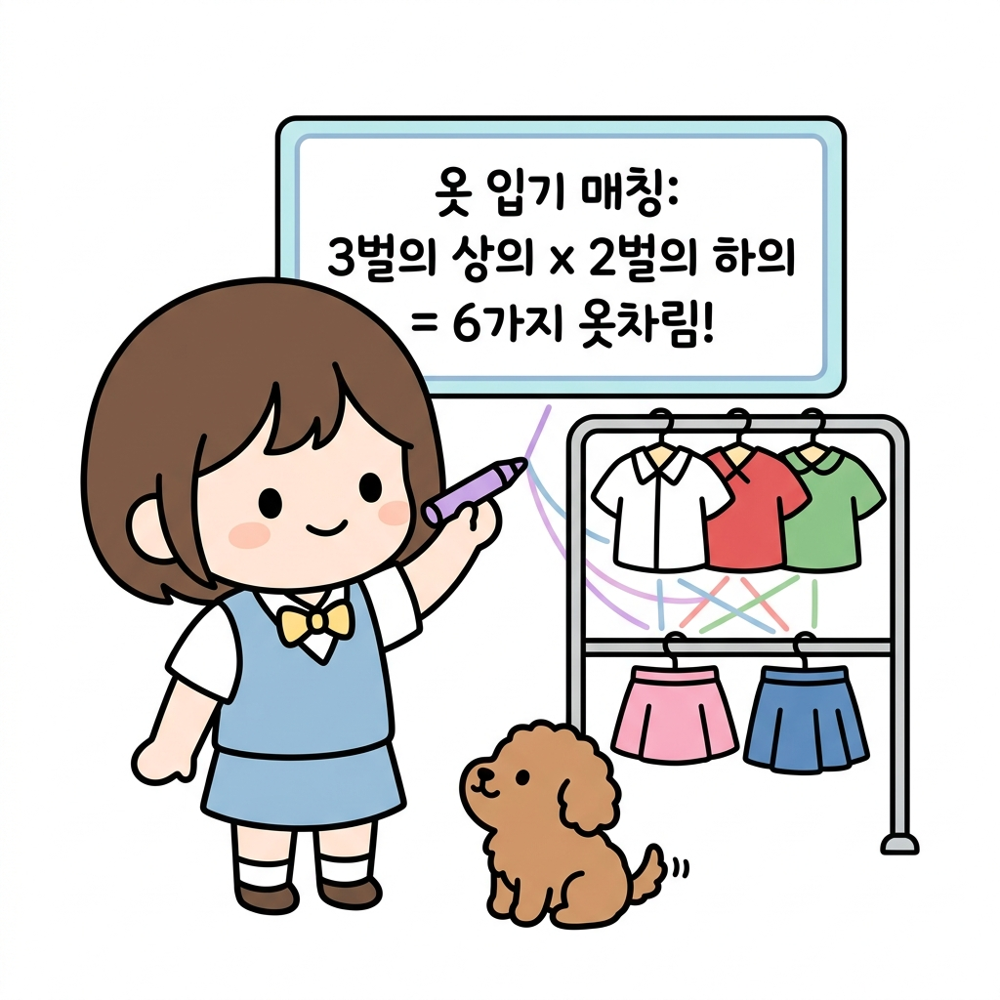
**그림 02-8-4** 상의와 하의를 입는 가짓수를 곱의 법칙으로 계산하는 옷 매칭 사례

* 옷장에서 상의 3벌과 하의 2벌을 골라 매칭하는 경우, 상의를 고르는 각각의 경우(3가지)마다 하의를 고르는 경우(2가지)가 결합하므로 총 3 × 2 = 6가지의 조합이 생깁니다.

---

### 3. 시각 자료: 합의 법칙과 곱의 법칙 도식

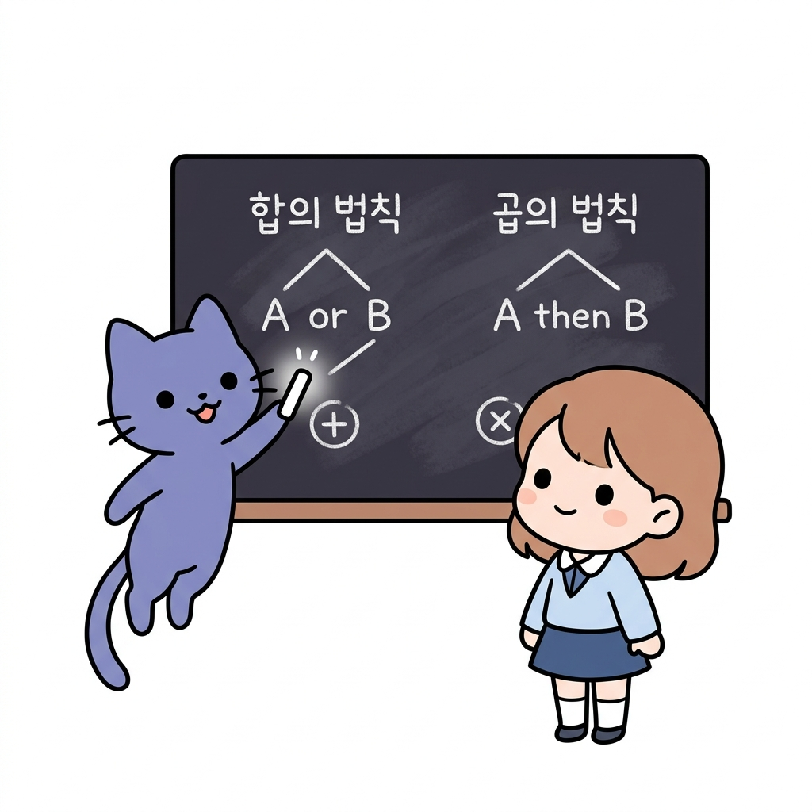
**그림 02-8-5** 개별 선택의 상황(Or)을 연결하는 합의 법칙과 연속적인 짝짓기 상황(And)을 연결하는 곱의 법칙의 차이 도식

---

### 4. 실전 예제

#### 예제 1 (합의 법칙)
> **문제**: 도로시네 반에서는 현장 학습 장소로 산 3곳(설악산, 지리산, 월출산) 또는 바다 2곳(해운대, 만리포) 중 한 곳을 선택하려고 합니다. 선택할 수 있는 총 여행지의 경우의 수는 몇 가지인가요?
>
> **풀이**:
> 산을 선택하는 사건과 바다를 선택하는 사건은 동시에 일어날 수 없습니다. 따라서 합의 법칙을 적용합니다.
> 경우의 수 = 3 (산) + 2 (바다) = 5가지
> **정답**: 5가지

#### 예제 2 (곱의 법칙)
> **문제**: 도로시는 상의로 흰색, 빨간색, 연두색 블라우스 3벌이 있고, 하의로 핑크색 스커트, 파란색 스커트, 노란색 바지 3벌이 있습니다. 상의와 하의를 각각 하나씩 선택하여 입을 수 있는 옷차림의 총 경우의 수는 몇 가지인가요?
>
> **풀이**:
> 상의를 고르는 사건과 하의를 고르는 사건은 연이어 일어나는(모두 만족해야 하는) 사건입니다. 따라서 곱의 법칙을 적용합니다.
> 경우의 수 = 3 (상의) × 3 (하의) = 9가지
> **정답**: 9가지

#### 예제 3 (혼합 문제)
> **문제**: 동전 한 개와 주사위 한 개를 동시에 던질 때, 일어날 수 있는 모든 경우의 수는 몇 가지인가요?
>
> **풀이**:
> 동전을 던져 나오는 경우의 수는 2가지(앞, 뒤)이고, 주사위를 던져 나오는 경우의 수는 6가지(1부터 6까지)입니다. 두 사건이 동시에 발생하므로 곱의 법칙을 적용합니다.
> 경우의 수 = 2 (동전) × 6 (주사위) = 12가지
> **정답**: 12가지

---

### 5. 핵심 요약
1. **경우의 수**는 어떤 사건이 일어날 수 있는 가짓수이다.
2. 사건 *A*, *B*가 동시에 일어나지 않는 **선택의 상황(Or)** 에서는 **합의 법칙 (*m* + *n*)**을 사용한다.
3. 사건 *A*, *B*가 연이어 일어나는 **조합의 상황(And)** 에서는 **곱의 법칙 (*m* × *n*)**을 사용한다.

---

## 02.8.2 경우의 수 심화: 중복이 있는 합의 법칙과 곱의 법칙

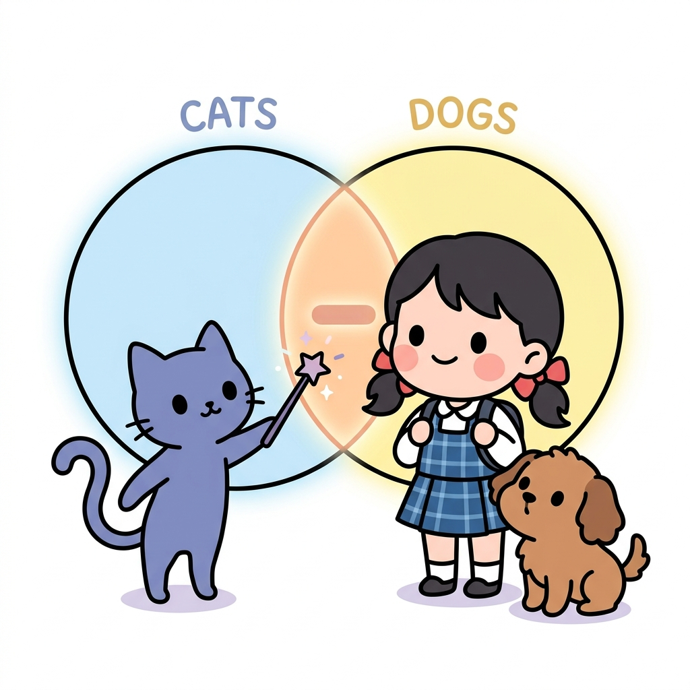
**그림 02-8-6** 두 벤다이어그램 마법 원반의 겹친 부위를 소거하며 중복합을 계산하는 법을 설명해주는 지니와 도로시

선택지가 서로 완전히 분리되어 있지 않고 **중복**이 존재할 때의 합산 요령을 다룹니다. 두 개의 동그라미(벤다이어그램)가 겹치는 영역을 마법 지우개로 쏙 빼내는 지니와 도로시의 그림 설명처럼, 중복을 확실하게 제어하여 정확한 경우의 수를 계산하는 심화 비법을 정복해보아요!

---

### 1. 학습 목표
- 중복되는 경우가 있을 때 합의 법칙을 보완하여 올바른 경우의 수를 계산할 수 있다.
- 곱의 법칙의 활용 상황(순서쌍의 개수)을 다룰 수 있다.
- 수학적 확률의 분자, 분모를 구성하는 경우의 수를 엄밀히 구하는 훈련을 한다.

---

### 2. 핵심 개념

#### (1) 중복이 있는 합의 법칙 (Sum Rule with Overlap)
두 사건 *A*와 *B*가 일어나는 경우의 수가 각각 *m*, *n*이고, 두 사건 *A*, *B*가 동시에 일어나는 경우의 수가 *l*가지 존재할 때, 사건 *A* **또는** 사건 *B*가 일어나는 경우의 수는 다음과 같습니다.
경우의 수 = *m* + *n* - *l*
- **집합적 표현 (Venn Diagram)**:
  *n*(*A* ∪ *B*) = *n*(*A*) + *n*(*B*) - *n*(*A* ∩ *B*)
- *주의*: 단순히 두 사건의 가짓수를 더하기만 하면 동시에 겹쳐서 일어나는 원소들을 두 번 세게 되는(중복) 오류가 발생하므로, 겹치는 부분(*l*)을 반드시 한 번 빼주어야 합니다.

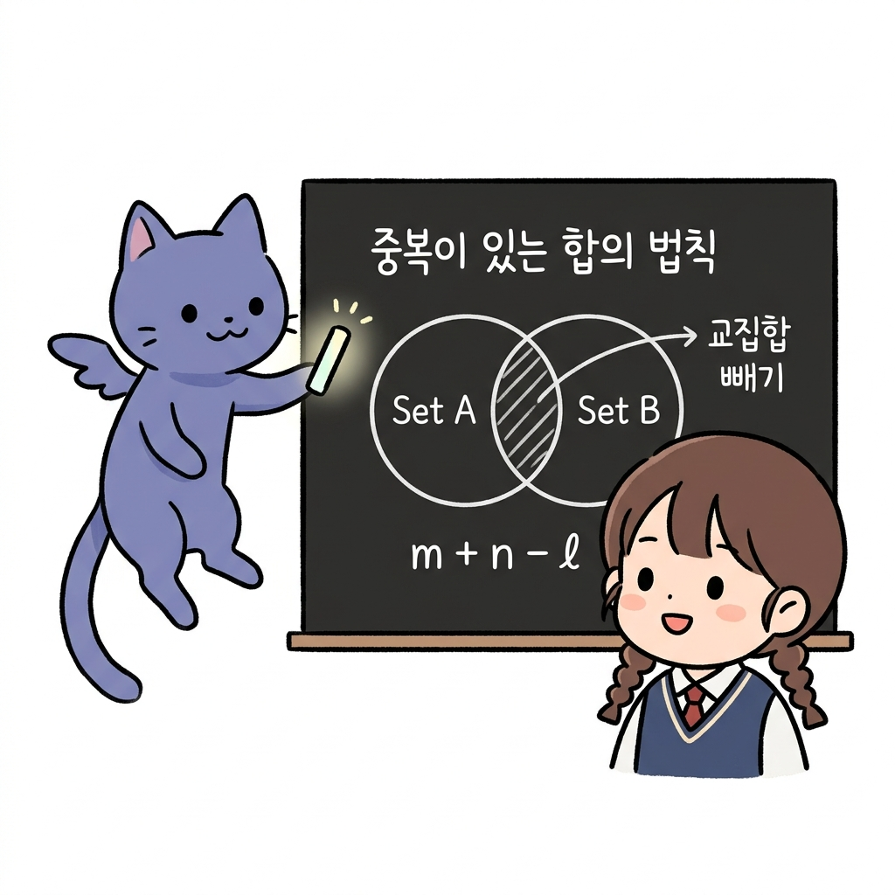
**그림 02-8-7** 중복이 발생하는 두 사건의 합산 시 교집합의 경우의 수(l)를 제외하여 중복을 없애는 원리

#### (2) 곱의 법칙 (Product Rule)
사건 *A*가 일어나는 경우의 수가 *m*가지이고, 그 각각에 대하여 다른 사건 *B*가 일어나는 경우의 수가 *n*가지일 때, 두 사건 *A*, *B*가 잇달아 일어나는 경우의 수는 다음과 같습니다.
경우의 수 = *m* × *n*

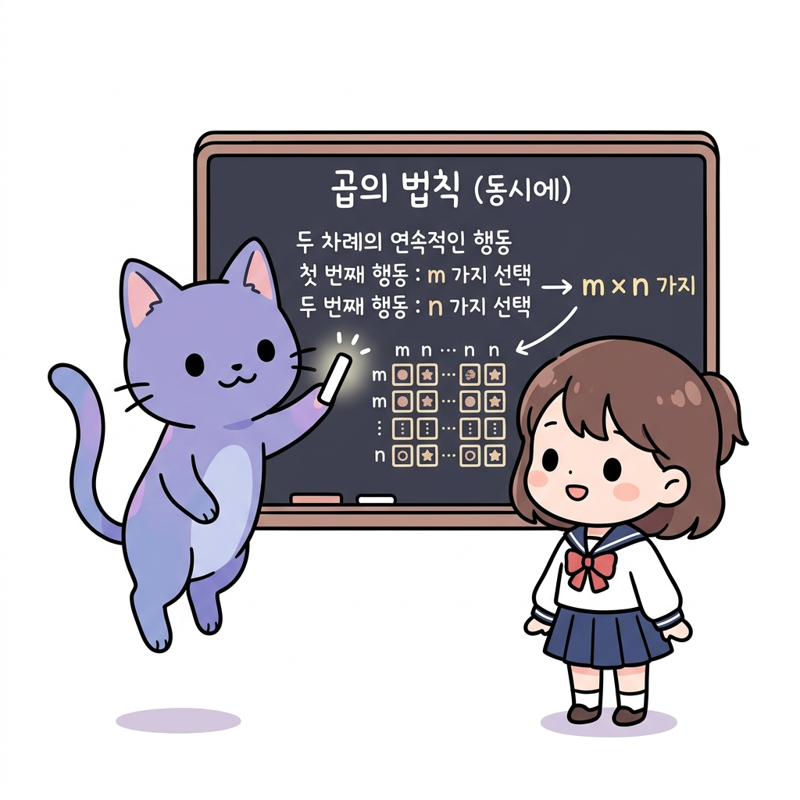
**그림 02-8-8** 두 사건 A, B가 연속해서 일어날 때 각 사건의 경우의 수를 곱하여 전체 가짓수(m × n)를 구하는 원리

**그림 02-8-9** 중간 경유지를 통과하는 이동 경로의 가짓수를 곱의 법칙으로 계산하는 구조

* 서울에서 대전까지 가는 버스 노선이 3가지이고, 대전에서 지리산까지 가는 기차 노선이 2가지가 있을 때, 서울에서 대전을 거쳐 지리산까지 가는 총 이동 경로의 가짓수는 3 × 2 = 6가지가 됩니다. 이는 첫 번째 선택의 각 경우의 수(3가지)마다 두 번째 선택의 경우의 수(2가지)가 결합하기 때문에 곱의 법칙이 성립하는 대표적인 예입니다.

---

### 3. 시각 자료: 벤 다이어그램을 통한 합의 법칙 도식

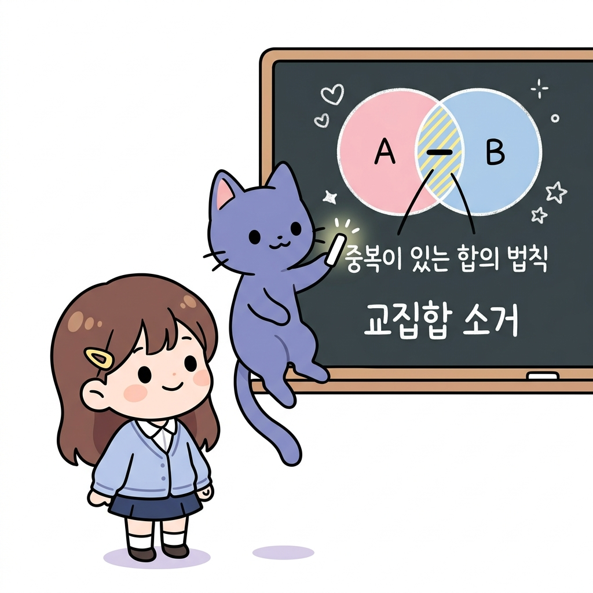
**그림 02-8-10** 두 집합의 합집합 계산 시 겹치는 교집합 영역을 1회 감하여 중복을 제거하는 벤다이어그램 도식

---

### 4. 실전 예제

#### 예제 1 (중복이 있는 합의 법칙)
> **문제**: 케이블 방송의 편성표를 보니 유재석이 출연하는 프로그램은 4개(무한도전, 놀러와, 해피투게더, 패밀리가 떴다)이고, 이효리가 출연하는 프로그램은 3개(체인지, 상상플러스, 패밀리가 떴다)입니다. 카르다노 선생님이 유재석 **또는** 이효리가 출연하는 프로그램 중 하나를 선택하여 시청하려고 할 때, 선택할 수 있는 경우의 수는 몇 가지인가요?
>
> **풀이**:
> - 유재석 출연 프로그램 개수 *n*(*A*) = 4
> - 이효리 출연 프로그램 개수 *n*(*B*) = 3
> - 두 연예인이 동시에 출연하는 프로그램(패밀리가 떴다) 개수 *n*(*A* ∩ *B*) = 1
>
> 중복이 있는 합의 법칙을 적용합니다.
> 경우의 수 = *n*(*A*) + *n*(*B*) - *n*(*A* ∩ *B*) = 4 + 3 - 1 = 6가지
> **정답**: 6가지

#### 예제 2 (곱의 법칙)
> **문제**: 저녁 식사 식단을 짜기 위해 찌개 한 가지와 나물요리 한 가지를 준비하려고 합니다. 준비할 수 있는 찌개가 2가지(된장찌개, 김치찌개)이고, 나물요리가 3가지(콩나물, 시금치나물, 고사리나물)일 때, 구성할 수 있는 총 식단의 경우의 수는 몇 가지인가요?
>
> **풀이**:
> 찌개를 고르는 행위와 나물요리를 고르는 행위는 연이어 완성되는 사건입니다. 따라서 곱의 법칙을 적용합니다.
> 경우의 수 = 2 (찌개) × 3 (나물) = 6가지
> **정답**: 6가지

---

### 5. 핵심 요약
1. **합의 법칙**을 사용할 때 두 사건이 동시에 일어나는 중복 상황(*A* ∩ *B*)이 있는지 반드시 점검하고, 중복이 있다면 **$m + n - l$**로 계산한다.
2. **곱의 법칙**은 두 개의 대상을 각각 짝짓는 순서쌍의 개수를 구하는 데 유용하다: **$m \times n$**.
3. 확률을 계산하기 위해 경우의 수를 정확히 세는 것이 선행되어야 하며, 중복 누락 등의 실수를 피하는 것이 중요하다.

---

## 02.8.3 팩토리얼과 순서대로 나열하기

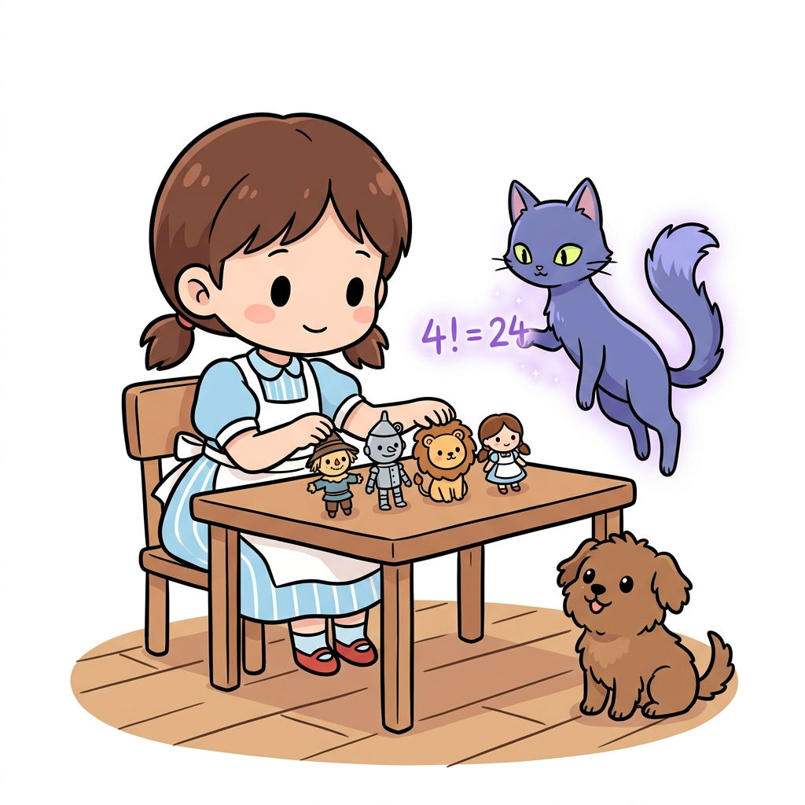
**그림 02-8-11** 네 마리의 인형을 일렬로 세우며 팩토리얼의 재귀적 곱셈을 설명해주는 지니와 도로시

서로 다른 대상을 빠짐없이 일렬로 세우는 경우의 수인 **팩토리얼(Factorial, 계승)**을 이해하고 활용하는 법을 배웁니다. 도로시가 책상 위에 오즈의 마법사 캐릭터 인형들을 여러 순서로 늘어놓으며 배우는 팩토리얼(*n*!)의 마법 같은 곱셈 원리를 지니와 함께 기분 좋게 학습해볼까요?

---

### 1. 학습 목표
- 서로 다른 대상을 일렬로 나열하는 방법의 수를 구하는 원리를 이해한다.
- 계승을 뜻하는 팩토리얼(*n*!) 기호와 그 계산 방식을 익힌다.

---

### 2. 핵심 개념

#### (1) 일렬로 나열하는 경우의 수 (Ordering Items in a Row)
서로 다른 *n*개의 대상을 일렬로 늘어놓는 경우의 수를 구할 때는 첫 번째 자리부터 순서대로 들어갈 수 있는 대상의 가짓수를 곱해 나갑니다.
- **원리**:
  - 1번째 자리에 놓을 수 있는 대상: *n*가지
  - 2번째 자리에 놓을 수 있는 대상: 첫 번째에 놓인 것을 제외한 (*n* - 1)가지
  - 3번째 자리에 놓을 수 있는 대상: 앞선 둘을 제외한 (*n* - 2)가지
  - ...
  - 맨 마지막 자리에 놓을 수 있는 대상: 남은 1가지
- **곱의 법칙**에 따라 총 경우의 수는 다음과 같습니다:
  *n* × (*n* - 1) × (*n* - 2) × ... × 2 × 1

#### (2) 팩토리얼 (Factorial, 계승)
1부터 *n*까지의 모든 자연수를 곱한 것을 ***n*의 계승**이라 하고, 기호로 ***n*!**과 같이 나타냅니다.
*n*! = *n* × (*n* - 1) × (*n* - 2) × ... × 2 × 1
- *읽는 방법*: 'n 팩토리얼' 또는 'n의 계승'
- *특수한 값*: 0! = 1로 정의합니다.

**그림 02-8-12** 영화관 의자에 친구들을 앉히는 가짓수를 팩토리얼 곱셉으로 구하는 원리

* 도로시, 토토, 프로드 세 사람이 영화관 좌석 3개에 앉는 경우의 수를 계산해 봅시다. 1번 자리에 앉을 사람을 고르는 가짓수는 3명 중 한 명이고, 2번 자리에는 남은 2명 중 한 명, 마지막 3번 자리에는 남은 1명이 자동으로 앉게 됩니다. 이 연쇄적인 결정을 수식으로 나타낸 것이 바로 3! = 3 × 2 × 1 = 6입니다.

---

### 3. 시각 자료: 3가지를 나열하는 트리 도식

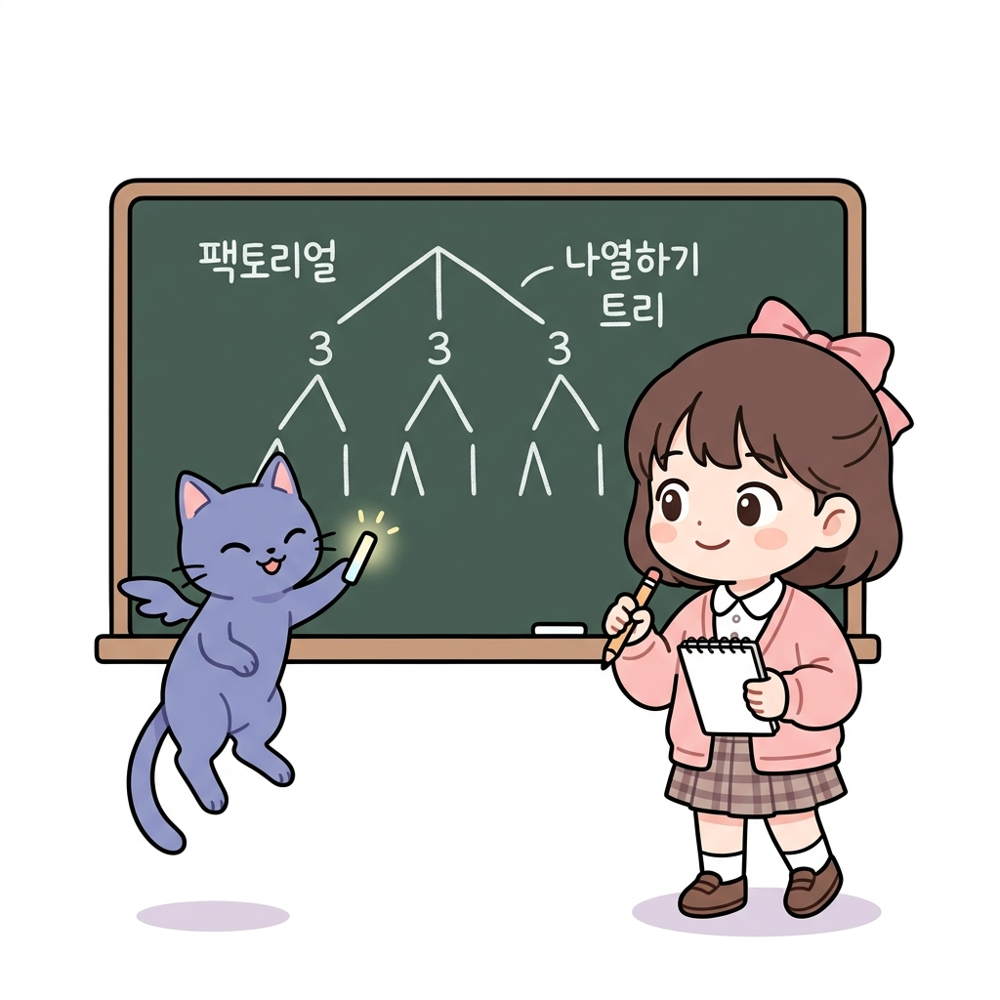
**그림 02-8-13** 3가지 원소를 중복 없이 나란히 늘어놓을 때 분기하는 가짓수를 묘사한 나열 트리 도식

---

### 4. 실전 예제

#### 예제 1 (기본 줄 세우기)
> **문제**: 도로시, 카르다노, 토토 3명이 극장 매표소 앞에 나란히 줄을 서려고 합니다. 이들이 줄을 설 수 있는 총 경우의 수는 몇 가지인가요?
>
> **풀이**:
> 서로 다른 3명을 일렬로 세우는 경우의 수이므로 3!을 계산합니다.
> 경우의 수 = 3! = 3 × 2 × 1 = 6가지
> **정답**: 6가지

#### 예제 2 (다섯 명의 멤버 배치)
> **문제**: 무한도전 멤버 5명(재석, 명수, 형돈, 준하, 홍철)을 무대 위 5개의 자리에 왼쪽부터 일렬로 배치하려고 합니다. 이들을 일렬로 세울 수 있는 총 경우의 수는 몇 가지인가요?
>
> **풀이**:
> 서로 다른 5명을 일렬로 세우는 경우의 수이므로 5!을 계산합니다.
> 경우의 수 = 5! = 5 × 4 × 3 × 2 × 1 = 120가지
> **정답**: 120가지

---

### 5. 핵심 요약
1. 서로 다른 *n*개를 일렬로 줄 세우는 방법의 수는 **곱의 법칙**을 연속으로 적용한 것이다.
2. 1부터 *n*까지의 자연수를 차례대로 곱한 것을 ***n*! (n 팩토리얼)** 이라 부르며, 줄 세우기 문제의 대표적인 공식이다.
3. 팩토리얼 연산은 수의 크기가 아주 빠르게 커지는 성질을 가지고 있다 (예: 3! = 6, 5! = 120, 10! = 3,628,800).

---

## 02.8.4 순열: 택하여 줄 세우기

**그림 02-8-14** 시상대(1등, 2등, 3등 단상)에 인형들을 줄 세우며 순열 기호 *n**P**r*의 의미를 학습하는 지니와 도로시

서로 다른 n개 중 r개를 선택해 순서를 고려하여 줄 세우는 **순열(Permutation)**을 공부합니다. 시상대의 각 단상에 동물 인형들을 배치하며 가짓수를 계산해내는 도로시와 지니의 놀이 학습처럼, 순열(*n**P**r*)의 원리를 탄탄히 이해해 봅시다!

---

### 1. 학습 목표
- 서로 다른 *n*개 중에서 *r*개를 선택하여 일렬로 배열하는 경우의 수(순열)를 구하는 원리를 이해한다.
- 순열 기호 *n**P**r*의 의미를 알고, 팩토리얼과의 관계를 이해하며 식을 변형할 수 있다.

---

### 2. 핵심 개념

#### (1) 순열 (Permutation)
서로 다른 *n*개 중에서 *r*(0 < *r* ≤ *n*)개를 택하여 순서대로 나열하는 것을 **순열**이라고 하며, 기호로 ***n**P**r***과 같이 나타냅니다.
- *읽는 방법*: 'n P r' 또는 'n 퍼뮤테이션 r'
- **계산식**:
  *n**P**r* = *n* × (*n* - 1) × (*n* - 2) × ... × (*n* - *r* + 1) (곱하는 개수가 *r*개)

#### (2) 순열의 공식과 팩토리얼
순열의 계산식에 분자와 분모에 (*n* - *r*)!을 곱해 주면 다음과 같이 팩토리얼 기호만으로 공식을 나타낼 수 있습니다.
*n**P**r* = *n*! / (*n* - *r*)!
- *의미*: 전체 *n*개를 일렬로 줄 세우는 *n*! 중에서, 선택되지 않은 (*n* - *r*)개의 순서 나열(줄 세우기)인 (*n* - *r*)!을 나누어 제외(약분)하는 구조입니다.
- *특수한 경우*:
  - *n**P**n* = *n*! / 0! = *n*! (서로 다른 *n*개 전체를 일렬로 나열하는 경우)
  - *n**P**0* = *n*! / *n*! = 1 (아무것도 택하지 않는 것도 1가지 경우로 침)

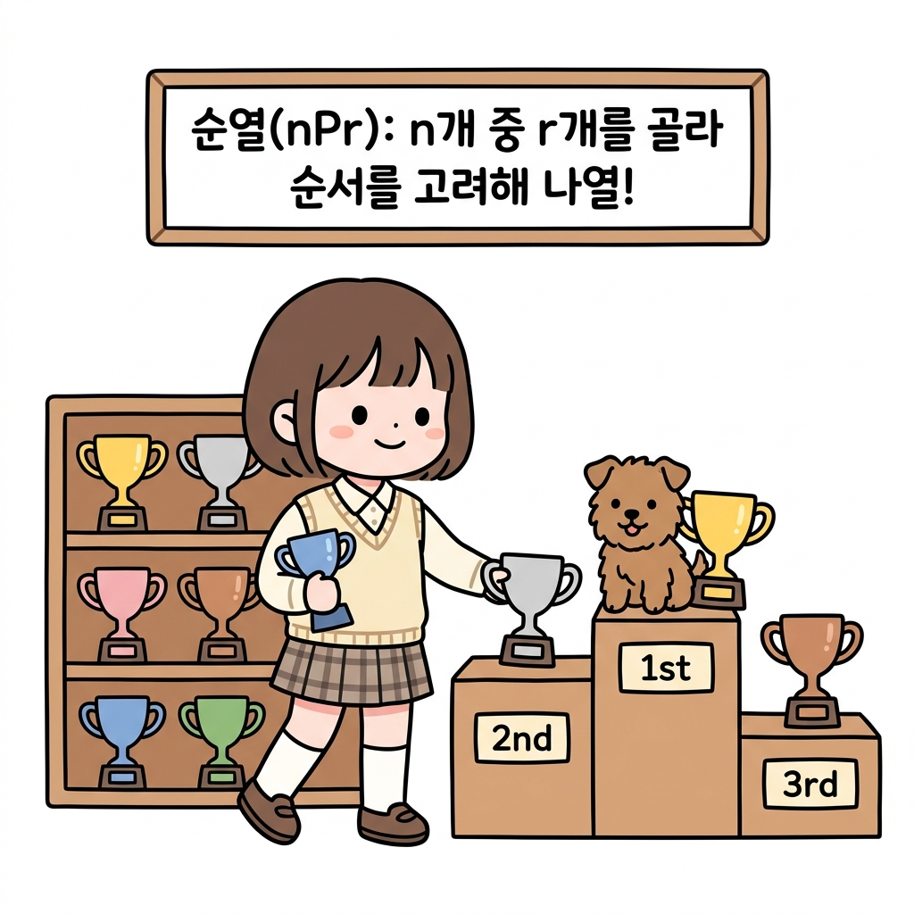
**그림 02-8-15** 전체 트로피 중 등수별 3개를 순서대로 매칭하여 배치하는 가짓수를 구하는 순열 사례

* 진열대에 놓인 서로 다른 5개의 트로피 중 1등, 2등, 3등(순서와 직책이 구분됨)에게 부여할 트로피 3개를 순서대로 나열해 고르는 경우의 수는 순열 공식을 사용하여 5*P*3 = 5 × 4 × 3 = 60가지가 됩니다. 순열은 이처럼 **대상을 선택하는 순서가 최종 결과에 영향을 주는 상황(Order matters)**에 사용합니다.

---

### 3. 시각 자료: 순열의 자리 배치와 공식 유도

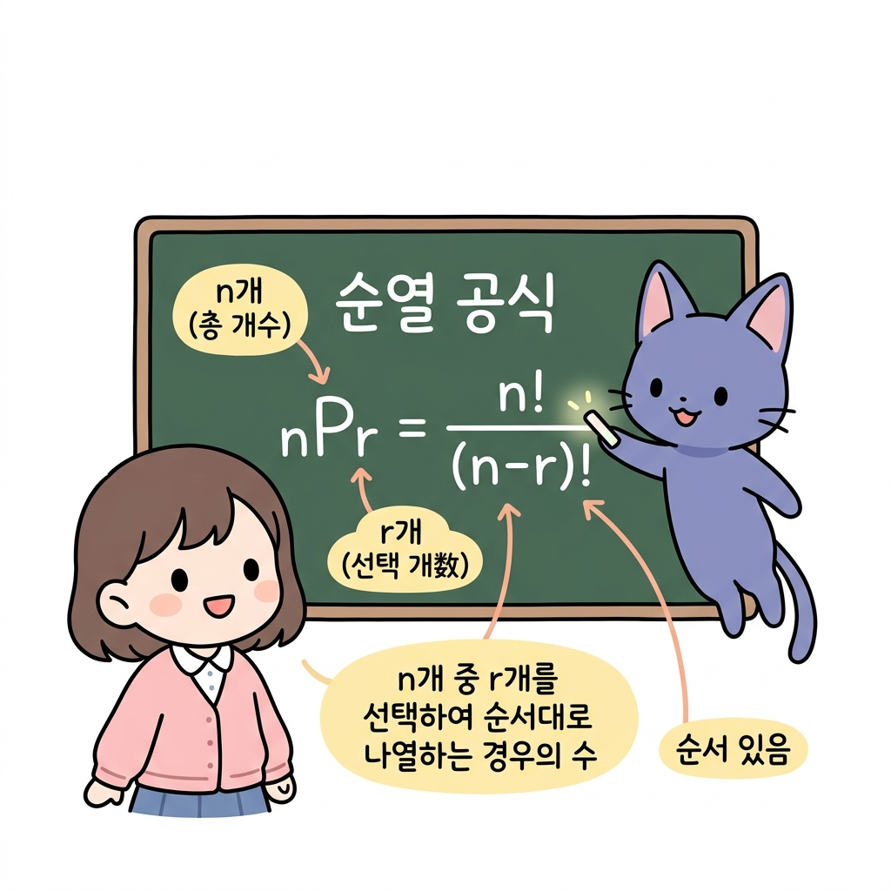
**그림 02-8-16** 전체 대상 중 특정 개수를 택하고, 이들의 자리 배열 순서까지 고려한 경우의 수(순열)를 계산하는 기호식 정의도

---

### 4. 실전 예제

#### 예제 1 (올림픽 메달 시나리오)
> **문제**: 4강에 대한민국, 중국, 영국, 프랑스 4개국이 진출했습니다. 이 중 금메달, 은메달, 동메달을 획득하는 국가들의 총 경우의 수는 몇 가지인가요?
>
> **풀이**:
> 서로 다른 4개국 중에서 순서를 생각하여(메달 종류) 3개국을 선택하여 배열하는 순열 문제입니다.
> 경우의 수 = 4*P*3 = 4 × 3 × 2 = 24가지
> **정답**: 24가지

#### 예제 2 (학급 임원 선출)
> **문제**: 학생 수가 30명인 학급에서 회장 1명, 부회장 1명을 선출하는 경우의 수는 몇 가지인가요?
>
> **풀이**:
> 회장과 부회장은 직책(순서)의 구분이 있으므로 서로 다른 30명 중 2명을 뽑아 나열하는 순열 문제입니다.
> 경우의 수 = 30*P*2 = 30 × 29 = 870가지
> **정답**: 870가지

---

### 5. 핵심 요약
1. **순열 (*n**P**r*)**은 대상을 **뽑고 나서 순서대로 나열**까지 하는 가짓수이다.
2. *n**P**r* 계산은 *n*부터 시작해 1씩 줄여가며 총 ***r*개의 숫자**를 곱한다.
3. 팩토리얼 기호를 사용하여 순열 공식을 ***n**P**r* = *n*! / (*n* - *r*)!**로 표현할 수 있으며, 이는 식의 증명이나 약분에 널리 활용된다.

---

## 02.8.5 조합: 순서 없이 선택하기

**그림 02-8-17** 여러 과일 중 두 과일을 순서 없이 양손에 쥐며 조합 기호 *n**C**r*을 배우는 지니와 도로시

순서와 관계없이 특정 대상을 묶음으로 골라내기만 하는 **조합(Combination)**을 공부합니다. 바구니에 담긴 사과, 바나나, 체리 중 도로시가 순서 없이 과일을 골라 쥐는 직관적인 놀이 과정을 통해 순열과의 명확한 차이점과 조합(*n**C**r*)의 신비로운 대칭 성질을 정복해봅시다!

---

### 1. 학습 목표
- 순열과 조합의 차이점을 파악한다.
- 서로 다른 *n*개 중에서 순서를 생각하지 않고 *r*개를 선택하는 경우의 수(조합, *n**C**r*)를 구하는 원리를 이해한다.
- 조합의 성질 *n**C**r* = *n**C**n-r*을 이해하고 활용하여 복잡한 계산을 단순화한다.

---

### 2. 핵심 개념

#### (1) 조합 (Combination)
서로 다른 *n*개 중에서 순서를 생각하지 않고 *r*(0 < *r* ≤ *n*)개를 택하는 것을 **조합**이라고 하며, 기호로 ***n**C**r***과 같이 나타냅니다.
- *읽는 방법*: 'n C r' 또는 'n 콤비네이션 r'
- **순열과의 관계**:
  *n**P**r*은 대상을 뽑아서 순서대로 나열하는 것이므로, 조합으로 그냥 뽑아 놓은 *r*개의 대상을 일렬로 나열하는 가짓수(*r*!)만큼 중복이 생깁니다.
  *n**C**r* = *n**P**r* / *r*! = *n*! / (*r*!(*n* - *r*)!)

**그림 02-8-18** 맛을 고르고 컵에 담을 때 순서와 상관없이 조합으로 계산하는 사례

* 아이스크림 전문점에서 판매하는 5가지 맛 중에서 순서와 상관없이 3가지를 골라 하나의 큰 컵에 담는 경우를 계산해 봅시다. 콘 위에 차례대로 얹어 순서가 중요한 경우(순열)와 달리, 한 컵에 담기면 최종 결과는 동일하므로 순서가 무의미합니다. 따라서 5*P*3 = 60가지 중 3개를 줄 세우는 가짓수(3! = 6)만큼의 중복을 나누어주어 총 5*C*3 = 60 / 6 = 10가지의 선택을 할 수 있습니다.

#### (2) 조합의 유용한 성질
1. **여조합의 성질 (대칭성)**:
   *n**C**r* = *n**C**n-r*
   - *의미*: *n*명 중에서 초대할 *r*명을 고르는 방법의 수는, 초대하지 않고 제외할 (*n* - *r*)명을 고르는 방법의 수와 완벽히 같습니다. *r*이 *n*의 절반보다 클 때 이 성질을 쓰면 계산량이 획기적으로 줄어듭니다.
2. **특수한 값**:
   - *n**C**n* = 1
   - *n**C**0* = 1

---

### 3. 시각 자료: 순열과 조합의 차이 및 공식 정리

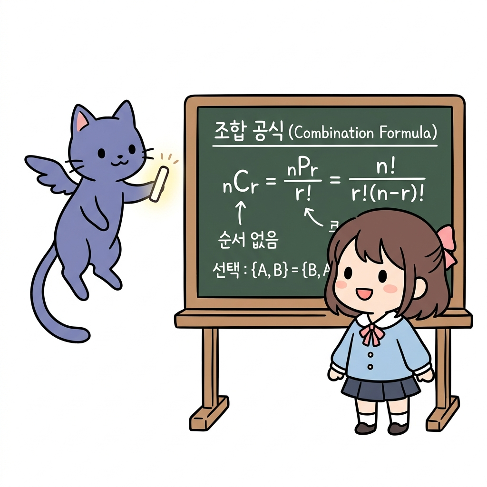
**그림 02-8-19** 대상을 순서 없이 묶음으로 짝짓는 경우의 수(조합)와 순열의 나눗셈 중복 제거 관계도

---

### 4. 실전 예제

#### 예제 1 (마트에서 아이스크림 고르기)
> **문제**: 마트에 있는 10가지 종류의 아이스크림 중에서 서로 다른 3가지를 고르는 경우의 수는 몇 가지인가요?
>
> **풀이**:
> 맛보는 순서는 상관없이 단순히 고르기만 하므로 조합 문제입니다.
> 10*C*3 = 10*P*3 / 3! = (10 × 9 × 8) / (3 × 2 × 1) = 120가지
> **정답**: 120가지

#### 예제 2 (여조합 성질을 활용한 계산)
> **문제**: 학생 20명 중에서 생일파티에 초대할 친구 18명을 선택하는 경우의 수는 몇 가지인가요?
>
> **풀이**:
> 18명을 순서 없이 선택하므로 20*C*18을 계산해야 합니다.
> 하지만 조합의 성질 *n**C**r* = *n**C**n-r*을 사용해 초대받지 못할 2명을 선택하는 문제로 바꾸어 풉니다.
> 20*C*18 = 20*C*20-18 = 20*C*2
> 20*C*2 = (20 × 19) / (2 × 1) = 190가지
> **정답**: 190가지

---

### 5. 핵심 요약
1. **순열**은 순서가 있고(줄 세우기), **조합**은 순서가 없다(대표 뽑기, 묶음 만들기).
2. 조합의 수 *n**C**r*은 순열의 수 *n**P**r*에서 대상의 순서 배열 가짓수인 ***r*!**로 나눈 값이다.
3. 계산할 때 아래 첨자 *r*이 클 때에는 ***n**C**r* = *n**C**n-r***을 적극 활용하여 간단하게 계산한다.
