# 02.8 경우의 수와 순열/조합

> 이 장에서는 인공지능 에이전트가 탐색할 수 있는 모든 행동 경로와 상태의 가짓수를 체계적으로 헤아리는 **경우의 수(Number of Cases)**와, 순서의 유무에 따라 선택지를 세는 **순열(Permutation)** 및 **조합(Combination)**의 수학적 원리를 배웁니다.

---

## 02.8.1 경우의 수와 합의 법칙, 곱의 법칙

경우의 수는 모험 경로에서 우리가 직면할 수 있는 모든 선택지의 수입니다.


"지니! 숲속 갈림길을 만났는데, 어느 길을 골라서 가야 안전하게 보물을 얻을 수 있을까? 그리고 내가 선택할 수 있는 총 경로의 가짓수는 전부 몇 가지야?"

도로시가 바구니를 들고 숲길 중간에서 좌우를 둘러보았습니다. 토토는 발밑에서 두리번거리며 꼬리를 흔들었습니다.

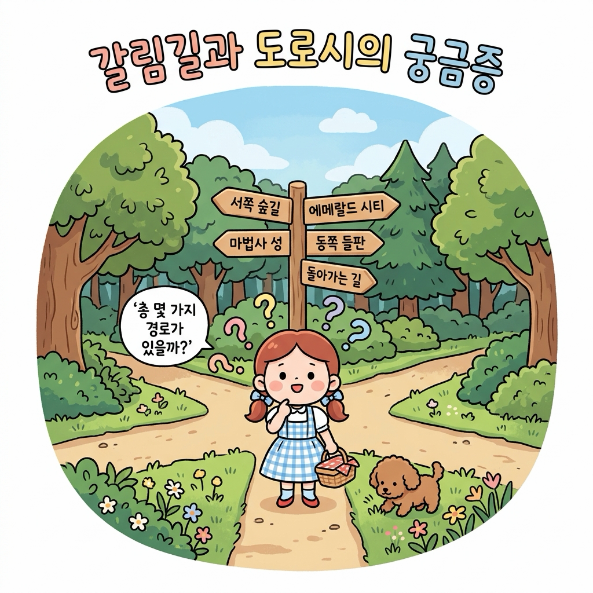
**그림 02-8-1** 숲속 갈림길 표지판 앞에서 자신이 선택할 수 있는 경로의 가짓수(경우의 수)가 총 몇 개인지 고민에 빠진 도로시와 토토


지니는 공중에 요술봉을 휘둘러 갈림길 지도를 입체적으로 띄웠습니다.

"도로시! 갈림길을 지혜롭게 지나가기 위해서는 먼저 우리가 마주할 수 있는 모든 선택지, 즉 **경우의 수(Number of Cases)**를 정확히 셀 줄 알아야 해. 길을 선택하는 상황에 따라 덧셈을 해야 할지, 곱셈을 해야 할지 결정하는 2가지 규칙이 있단다."

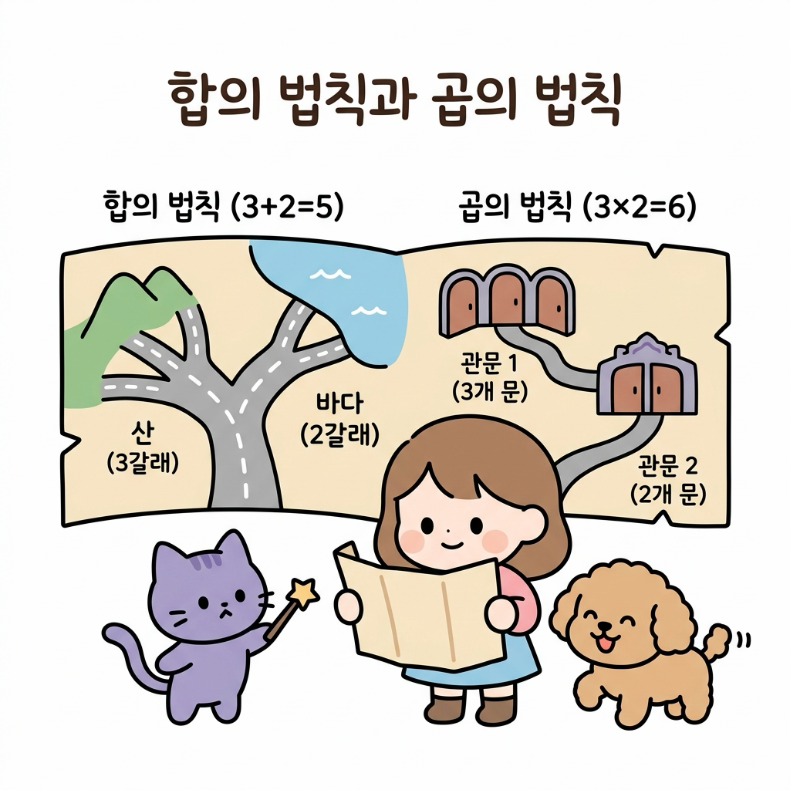
**그림 02-8-2** 산과 바다 중 하나를 고르는 분리된 경로(합의 법칙: 3 + 2 = 5)와, 두 관문을 차례대로 연이어 통과해야 하는 연속 경로(곱의 법칙: 3 × 2 = 6)의 차이를 지도에서 설명하는 지니


"아! 왼쪽 갈림길처럼 산 코스 3개 또는 바다 코스 2개 중 하나만 택할 때는 서로 겹치지 않으니까 단순히 더해서 구하는 **합의 법칙(Or)**이고, 오른쪽 길처럼 1번 관문을 통과한 뒤 연이어 2번 관문을 통과해야 할 때는 연쇄적인 선택이 만들어지니까 곱해서 구하는 **곱의 법칙(And)**이구나!"


도로시가 지도를 보며 환하게 웃으며 수첩에 꼼꼼히 정리하고 고개를 끄덕였습니다.


**그림 02-8-3** 선택은 덧셈(Or), 연속은 곱셈(And)이라는 경우의 수의 2대 핵심 연산 규칙을 명쾌하게 이해하고 수첩에 기록하는 도로시와 흐뭇해하는 지니, 토토


---


### 2.8.1.1 학습 목표

* 사건(Event)과 경우의 수(Number of Cases)의 수학적 의미를 이해한다.
* 동시에 일어나지 않는 두 사건에 대해 합의 법칙을 적용하여 계산할 수 있다.
* 연이어 일어나는 두 사건에 대해 곱의 법칙을 적용하여 계산할 수 있다.
* 중복이 존재하는 사건에서 포함-배제의 원리를 적용할 수 있다.


---


### 2.8.1.2 사건과 경우의 수란?

먼저 기본 개념에 대해서 알아 봅시다.


#### 1. 사건 (Event)

주사위를 굴리거나 동전을 던지는 것과 같이, 동일한 조건에서 반복할 수 있는 관찰이나 실험(시행, Trial)을 통해 나타나는 구체적인 결과들의 모임입니다.


* **대표 예시**: 주사위 1개를 던질 때 '짝수의 눈이 나오는 사건' = {2, 4, 6}

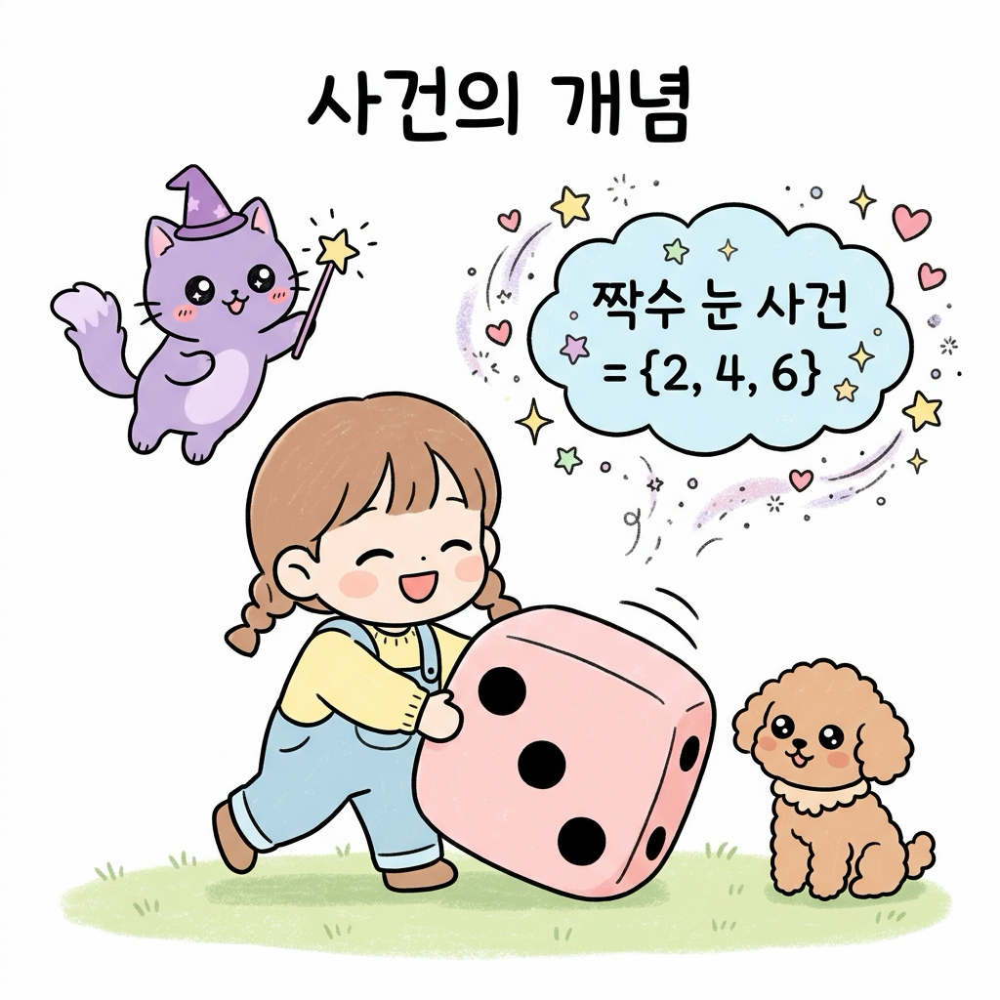
**그림 02-8-4** 동일한 조건에서 주사위를 굴려 관찰할 수 있는 결과의 모임(사건)을 탐구하는 도로시와 지니, 토토


---


#### 2. 경우의 수 (Number of Cases)

특정 사건이 일어날 수 있는 가능한 **모든 가짓수**의 총개수를 의미합니다.
* **대표 예시**: 주사위 1개를 던져 '짝수의 눈이 나오는 사건'의 경우의 수는 2, 4, 6의 총 3가지입니다.

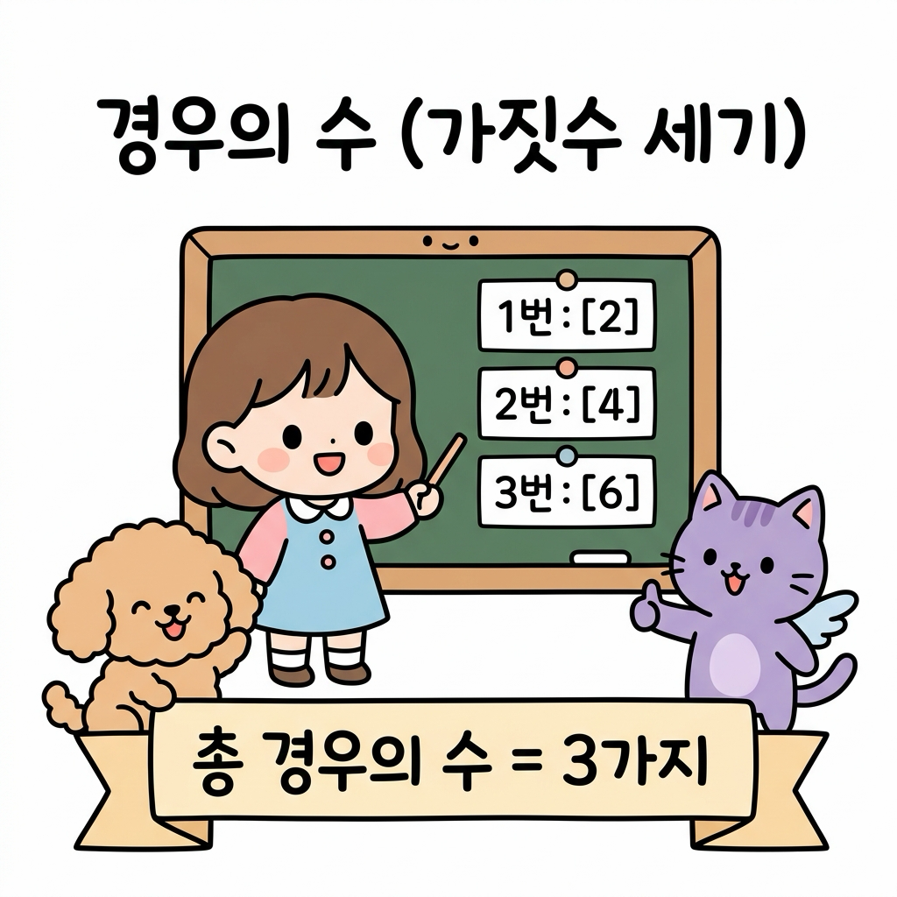
**그림 02-8-5** 특정 사건에 해당하는 모든 결과의 가짓수를 하나하나 짚으며 총개수(경우의 수)를 헤아리는 도로시와 지니, 토토


---


### 2.8.1.3 합의 법칙과 곱의 법칙


#### 1. 합의 법칙 (Addition Rule)

두 사건 *A*, *B*가 **동시에 일어나지 않을 때**, 사건 *A*가 일어나는 경우의 수를 *m*, 사건 *B*가 일어나는 경우의 수를 *n*이라고 하면, 사건 *A* **또는(Or)** 사건 *B*가 일어나는 총 경우의 수는 두 수를 더하여 구합니다.

$$
\text{경우의 수} = m + n
$$

* **핵심 키워드**: **또는(Or)**, **~하거나**, **택일(하나만 선택)**

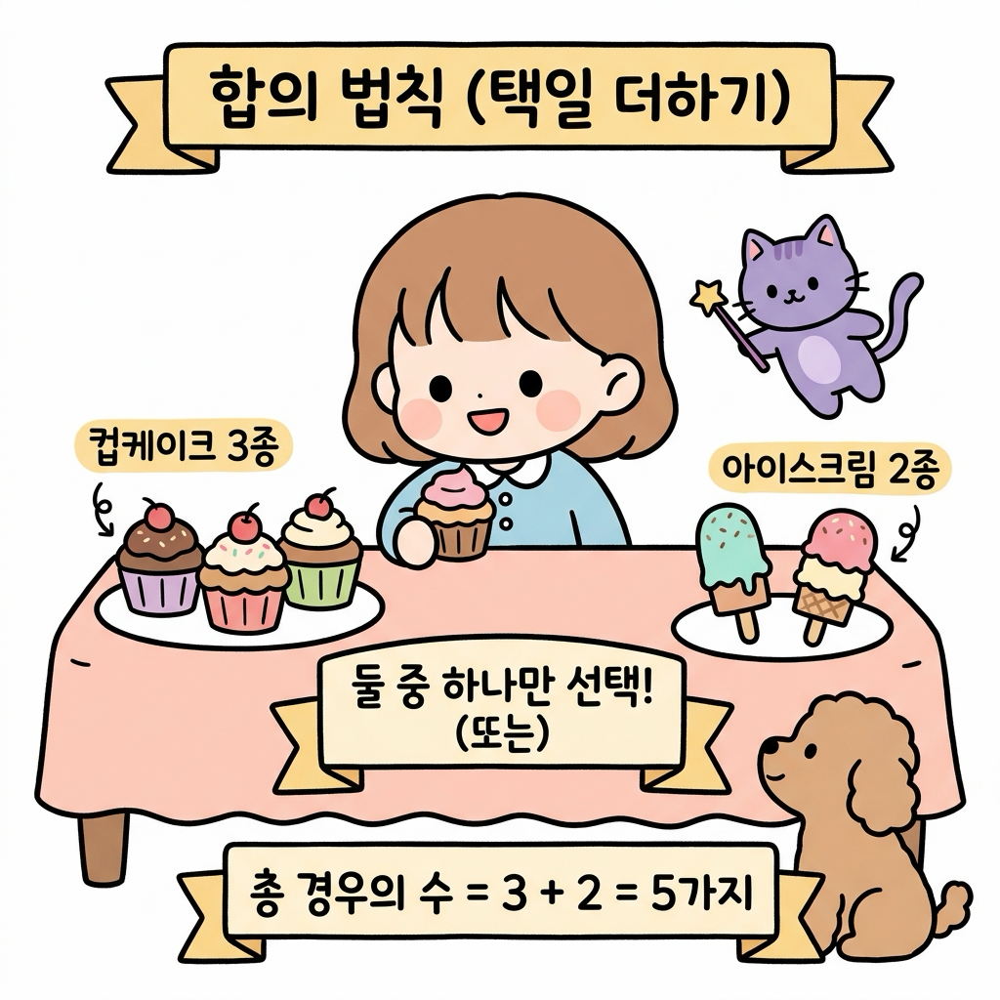
**그림 02-8-6** 컵케이크 3종 또는 아이스크림 2종 중 단 하나만을 선택하여 맛보는 합의 법칙(3 + 2 = 5가지)의 원리


#### 2. 곱의 법칙 (Multiplication Rule)

사건 *A*가 일어나는 경우의 수가 *m*이고, 그 각각에 대하여 사건 *B*가 일어나는 경우의 수가 *n*일 때, 두 사건 *A*, *B*가 **동시에(연이어, And)** 일어나는 총 경우의 수는 두 수를 곱하여 구합니다.

$$
\text{경우의 수} = m \times n
$$

* **핵심 키워드**: **그리고(And)**, **동시에**, **연이어(순차적 진행)**

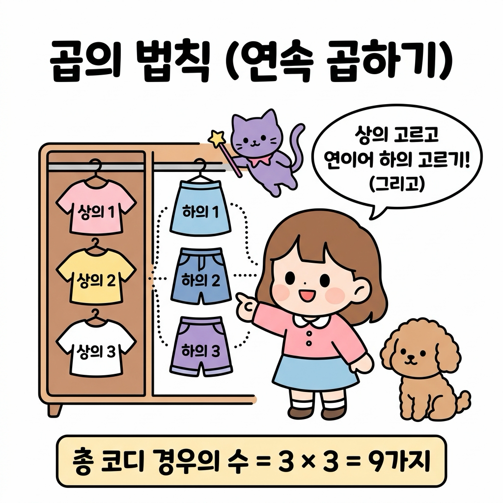
**그림 02-8-7** 상의 3벌을 고르고 연이어 하의 3벌을 매치하여 총 9가지 코디 스타일을 연출하는 곱의 법칙(3 × 3 = 9가지)의 원리


#### 3. 중복이 있는 합의 법칙 (포함-배제의 원리)

선택지가 서로 완전히 분리되어 있지 않고 공통으로 겹치는 영역이 존재할 때는, 단순 덧셈 후 중복된 교집합 영역을 반드시 한 번 빼주어야 합니다.

$$
n(A \cup B) = n(A) + n(B) - n(A \cap B)
$$

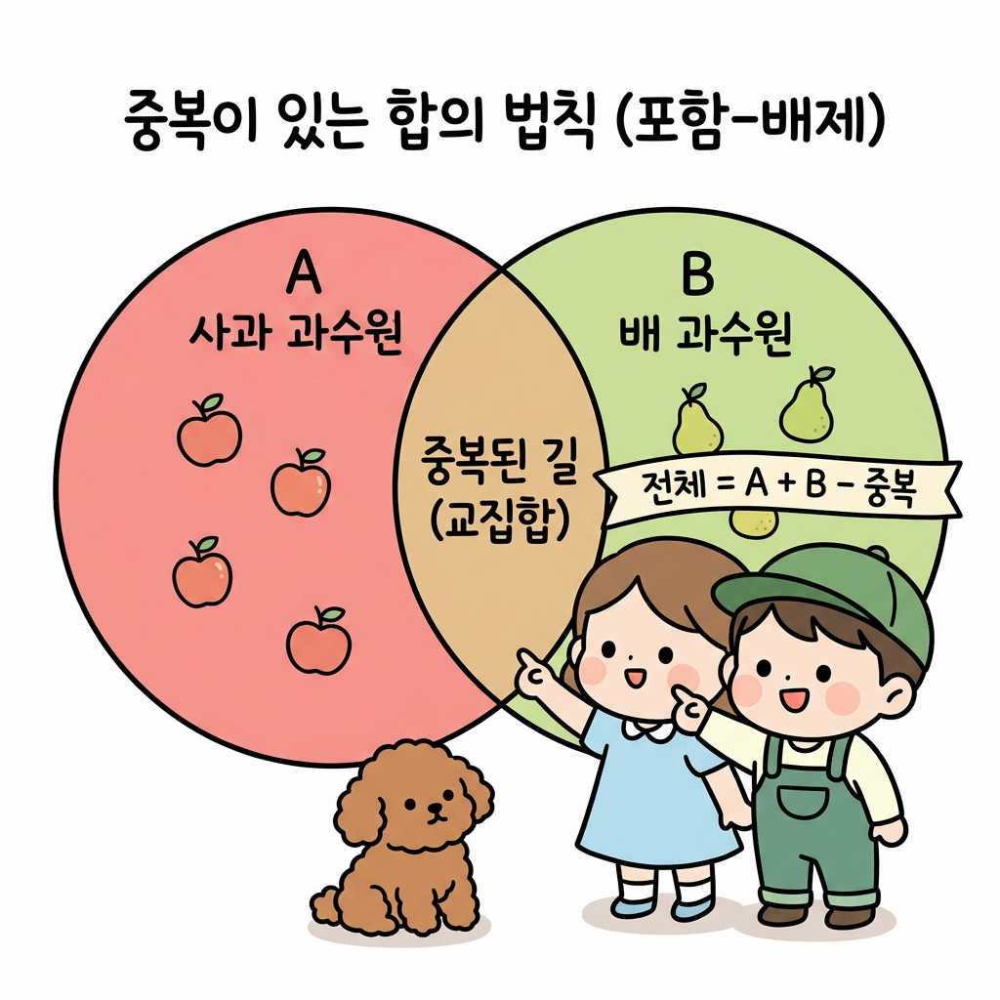
**그림 02-8-8** 사과 과수원(A)과 배 과수원(B) 사이에 겹쳐 있는 중복된 길(교집합)을 한 번 빼주어 전체 경우의 수를 정확히 계산하는 포함-배제의 원리


---


## 02.8.2 팩토리얼과 순열 (Permutation)

서로 다른 대상들을 차례대로 줄 세우거나, 그중 몇 개를 골라 순서를 고려하여 나열하는 방법을 배웁니다.


"지니! 내 책상 위에 빨강, 파랑, 노랑 세 개의 신비로운 보석이 있어. 이 보석들을 왼쪽부터 차례대로 배열하는 방법은 총 몇 가지일까?"

도로시가 반짝이는 보석들을 만지작거리며 물었습니다. 토토는 테이블 밑에서 호기심 어린 눈으로 반짝이는 보석을 바라보았습니다.

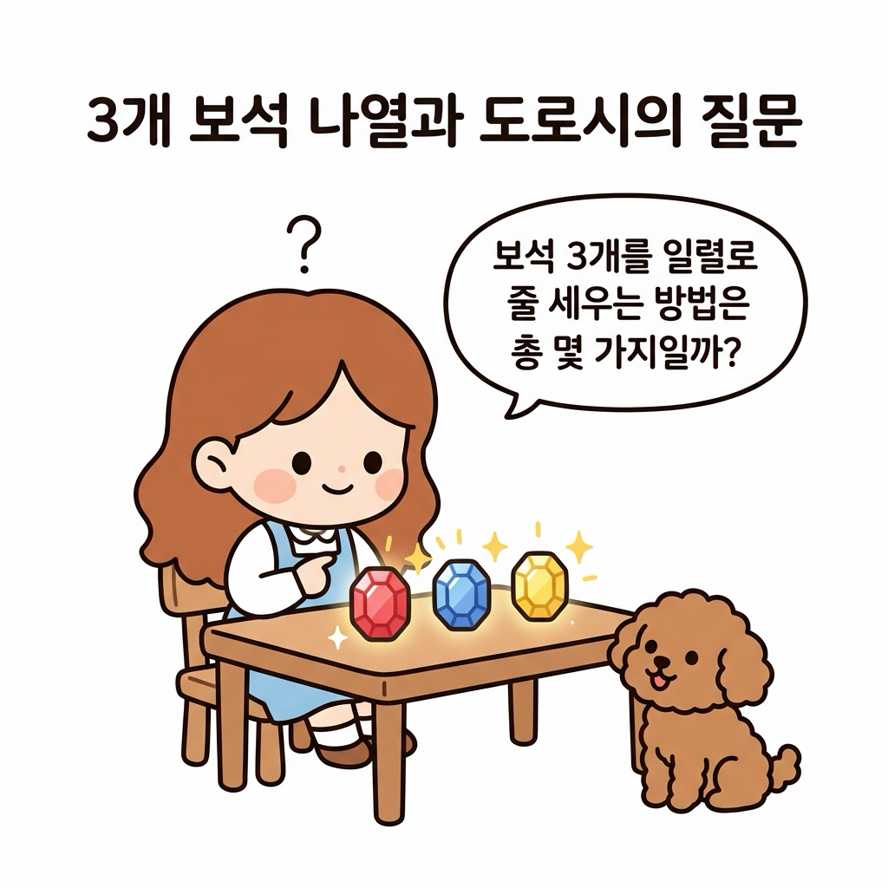
**그림 02-8-9** 책상 위에 놓인 3개의 신비로운 보석을 일렬로 나열하는 총 가짓수를 궁금해하는 도로시와 토토


지니는 공중에 요술 칠판을 소환하여 수식을 반짝이는 빛으로 적으며 설명했습니다.


"첫 번째 자리에 놓을 수 있는 보석은 3가지, 두 번째 자리에는 첫 번째 자리를 제외한 2가지, 마지막 자리에는 남은 1가지가 오게 되지. 이를 곱의 법칙으로 계산하면 3 × 2 × 1 = 6가지가 되는데, 이를 수학 기호로 **3!(3 팩토리얼)**이라고 부른단다."

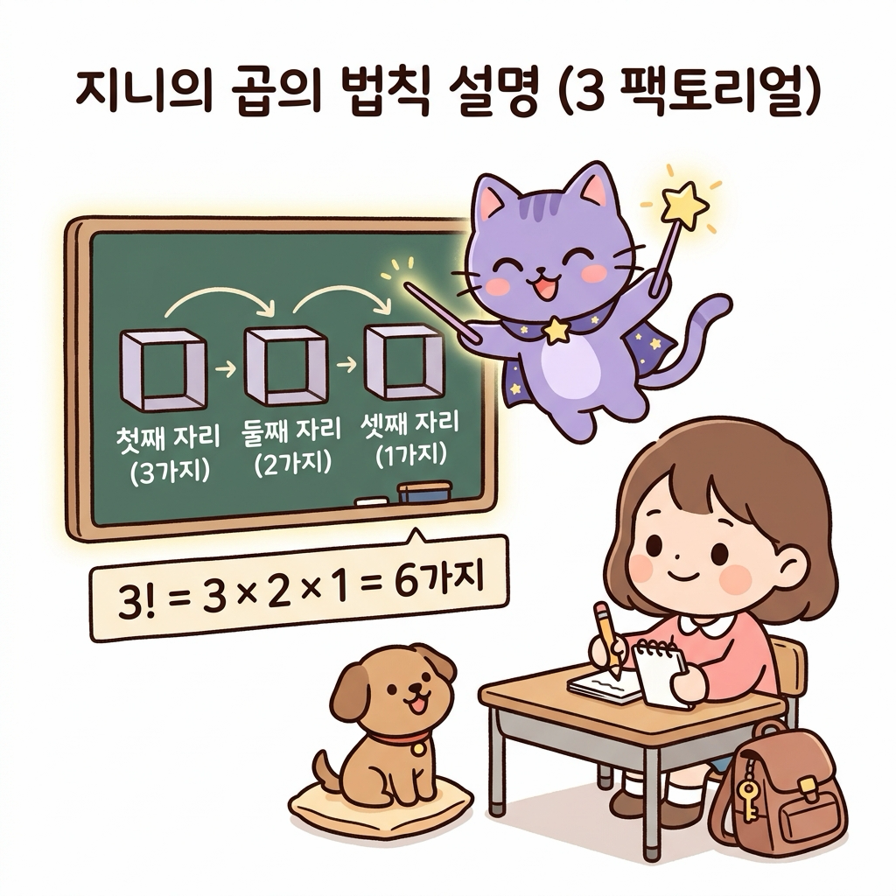
**그림 02-8-10** 요술 칠판에 자리를 하나씩 채워가는 곱의 법칙(3! = 3 × 2 × 1 = 6가지) 원리를 차근차근 설명하는 지니와 필기하는 도로시


---


### 2.8.2.1 팩토리얼 (Factorial, 계승)

1부터 *n*까지의 모든 자연수를 차례대로 곱한 것을 뜻하며, 기호로 **_n!_**이라 표기합니다.


$$
n! = n \times (n - 1) \times (n - 2) \times \dots \times 2 \times 1
$$

> **💡 약속**: 수학적으로 계산의 일관성을 위해 **0! = 1**로 정의합니다.

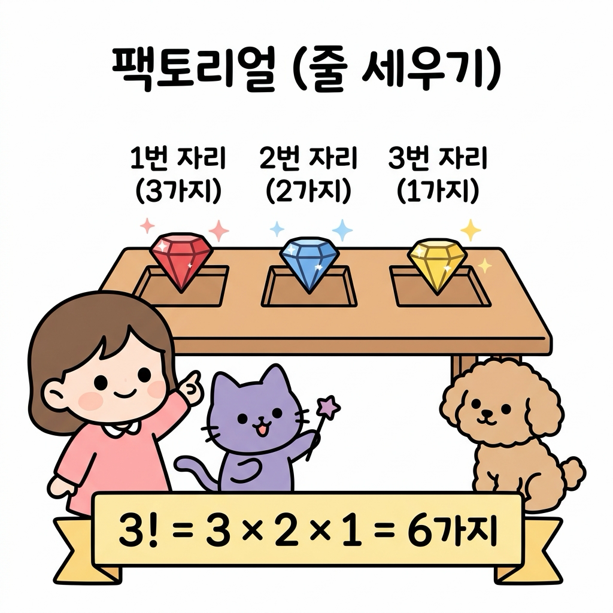
**그림 02-8-11** 3개의 보석을 1번, 2번, 3번 자리에 차례대로 배치하며 3! = 3 × 2 × 1 = 6가지 경우의 수를 확인하는 도로시와 지니, 토토


---


### 2.8.2.2 순열 (Permutation): 순서를 고려하여 줄 세우기

서로 다른 *n*개 중에서 *r*개를 택하여 **순서를 고려하여 일렬로 나열**하는 경우의 수를 **순열**이라 하며, 기호로 **<sub>*n*</sub>*P*<sub>*r*</sub>**이라 씁니다.


$$
_nP_r = \frac{n!}{(n - r)!} = n \times (n - 1) \times \dots \times (n - r + 1)
$$


"아! 5개의 트로피 중 1등과 2등 단상에 올릴 트로피 2개를 순서대로 고르는 가짓수는 <sub>5</sub>*P*<sub>2</sub> = 5 × 4 = 20가지구나! 뽑는 순서가 결과에 영향을 주는 상황(Order matters)에는 이 순열을 쓰는 거네!"


도로시가 노트를 보며 고개를 끄덕였습니다.

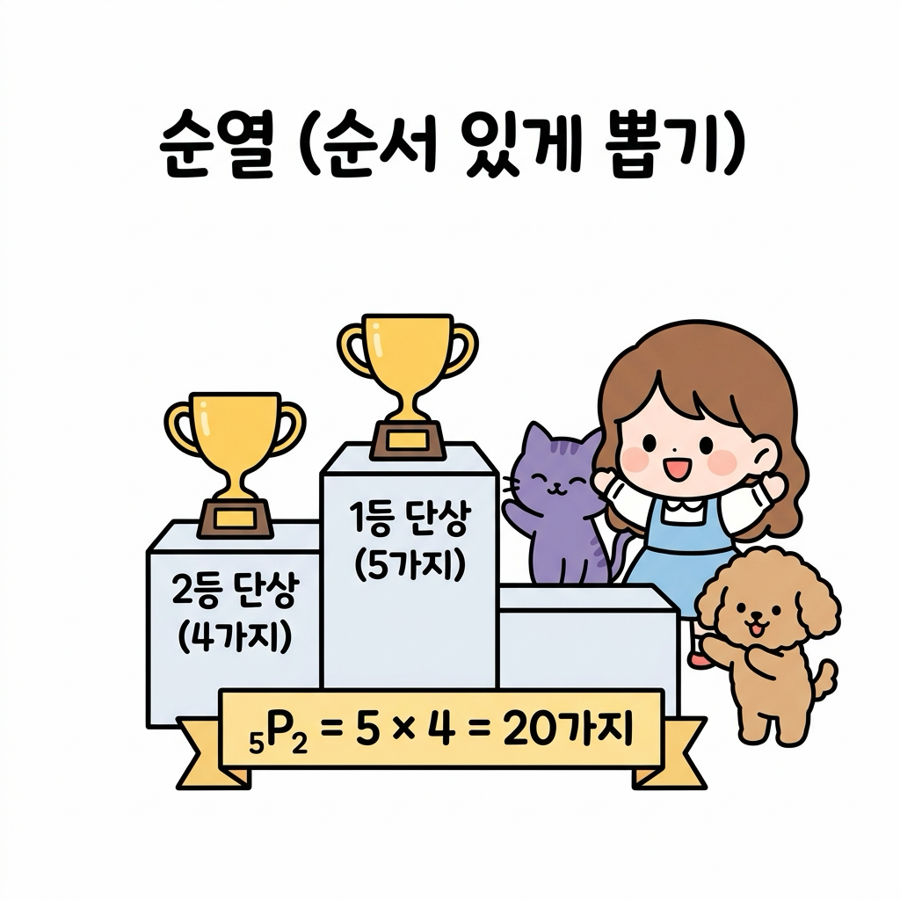
**그림 02-8-12** 5개의 트로피 중 1등 단상(5가지)과 2등 단상(4가지)에 순서를 따져 올리는 순열(₅P₂ = 20가지)의 원리를 탐구하는 도로시와 지니, 토토


---


## 02.8.3 조합 (Combination): 순서 없이 묶음 뽑기

순서와 관계없이 특정 대상을 그룹(묶음)으로 골라내기만 하는 경우의 수를 공부합니다.


"지니! 순열은 순서대로 줄을 세우는 거였잖아. 그렇다면 순서는 전혀 상관없이, 그냥 바구니에서 과일 2개를 묶음으로 쏙 골라내기만 하는 가짓수는 어떻게 계산해?"


도로시가 과일 바구니에서 사과와 귤을 꺼내며 물었습니다. 토토는 바구니 옆에서 킁킁 냄새를 맡으며 호기심 어린 눈빛을 보냈습니다.

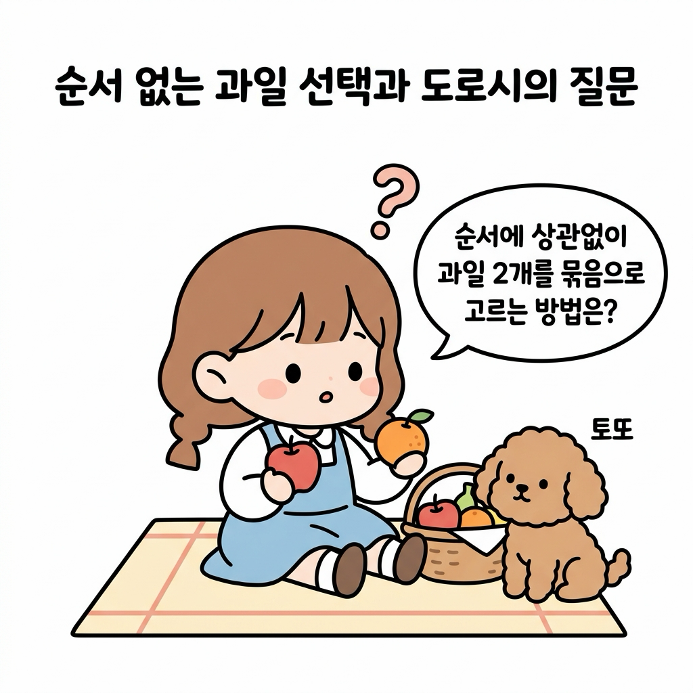
**그림 02-8-13** 바구니에 담긴 과일 중 순서에 상관없이 2개를 묶음으로 선택하는 가짓수를 궁금해하는 도로시와 토토


지니는 공중에 요술 칠판을 띄우고 나눗셈 기호를 그리며 자상하게 설명했습니다.

"그때는 바로 **조합(Combination, <sub>*n*</sub>*C*<sub>*r*</sub>)**을 사용한단다. 순서가 상관없으므로, 일단 순열(<sub>*n*</sub>*P*<sub>*r*</sub>)로 나열한 뒤 그 개수들이 자리를 바꾸는 중복 가짓수(*r*!)만큼 나누어 제외해주면 된단다."

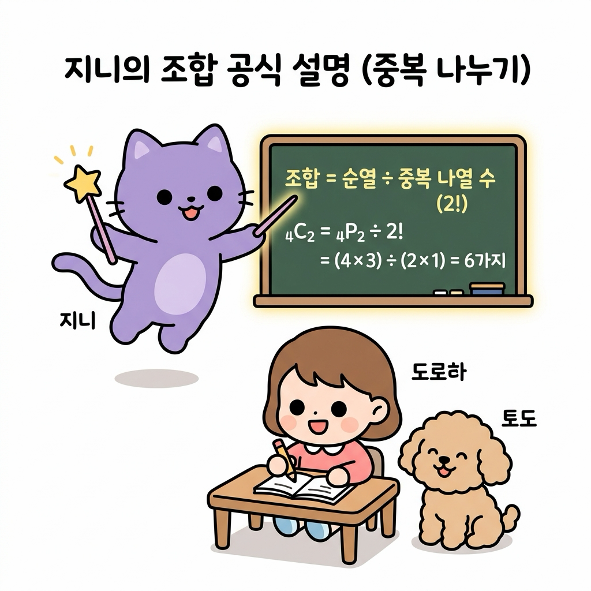
**그림 02-8-14** 요술 칠판에 순열을 중복 나열 수(2!)로 나누어 조합(₄C₂ = 6가지)을 구하는 핵심 원리를 설명하는 지니와 필기하는 도로시


---


### 2.8.3.1 조합의 정의와 계산 공식

서로 다른 *n*개 중에서 순서를 고려하지 않고 단지 *r*개를 **선택하여 묶음을 만드는 경우의 수**를 **조합**이라 하며, 기호로 **<sub>*n*</sub>*C*<sub>*r*</sub>**이라 씁니다.

$$
_nC_r = \frac{_nP_r}{r!} = \frac{n!}{r! (n - r)!}
$$

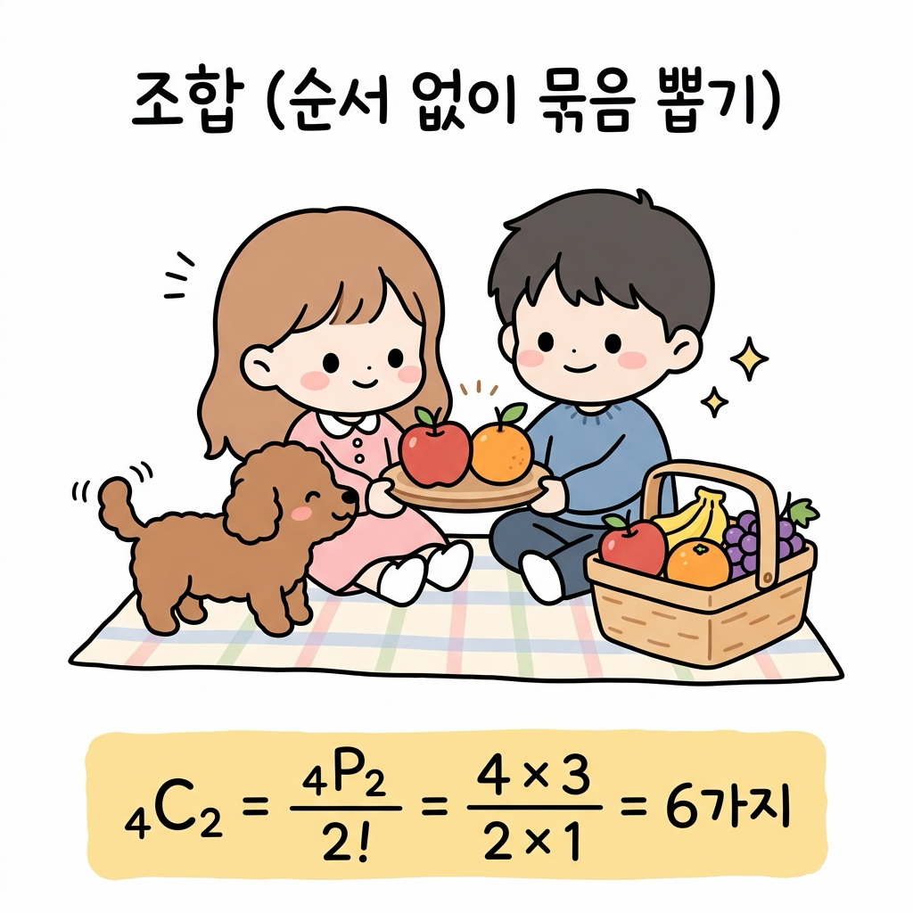
**그림 02-8-15** 과일 바구니의 4개 과일 중 순서에 상관없이 2개를 묶음으로 선택하는 조합(₄C₂ = 6가지)의 원리를 배우는 도로시와 지니, 토토


---


### 2.8.3.2 조합의 대칭성과 계산 단순화 성질

조합에는 계산을 획기적으로 줄여주는 매우 아름다운 **대칭성(Symmetry)** 성질이 있습니다.

$$
_nC_r = _nC_{n - r}
$$

> **💡 직관적인 의미**: 10개의 별 중 선물 상자에 넣을 8개의 별을 고르는 가짓수(<sub>10</sub>*C*<sub>8</sub>)는, 상자에 넣지 않고 밖에 남겨둘 2개의 별을 고르는 가짓수(<sub>10</sub>*C*<sub>2</sub>)와 수학적으로 완벽히 똑같습니다.

$$
_{10}C_8 = _{10}C_{10 - 8} = _{10}C_2 = \frac{10 \times 9}{2 \times 1} = 45
$$

"와! <sub>20</sub>*C*<sub>18</sub> 같은 복잡한 숫자도 대칭성 성질을 이용해 <sub>20</sub>*C*<sub>2</sub>로 바꾸면 단 2초 만에 계산이 끝나네!"

도로시가 감탄하며 손뼉을 쳤습니다.

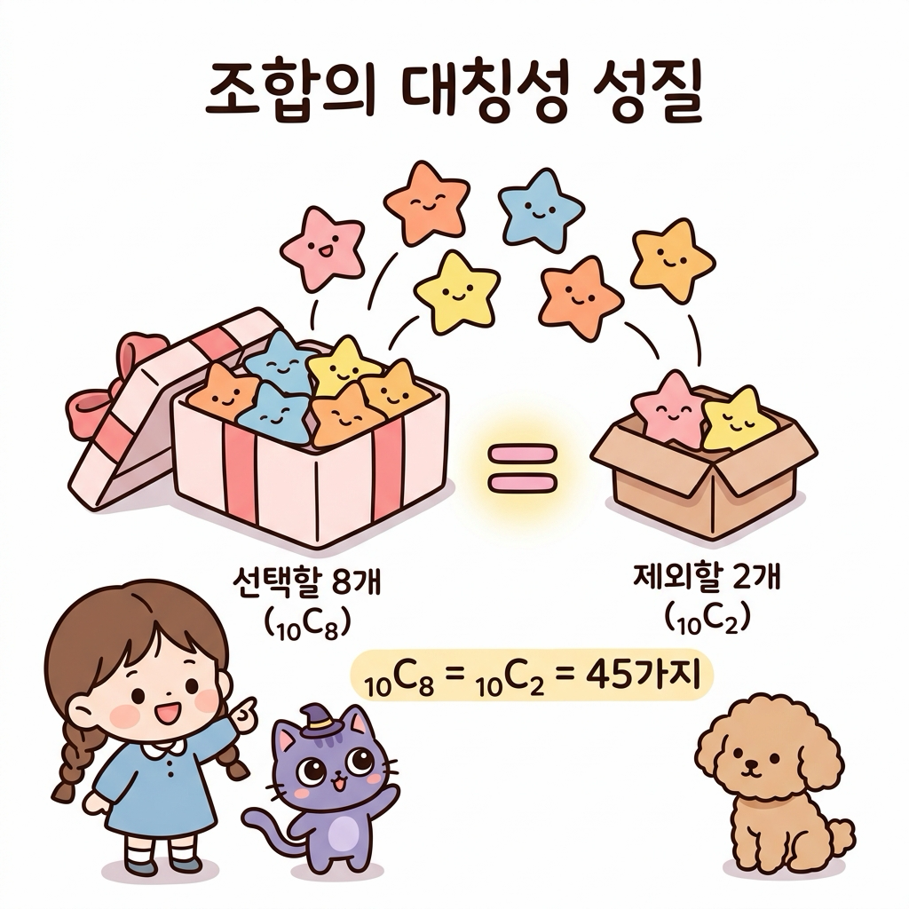
**그림 02-8-16** 10개의 별 중 선택할 8개를 고르는 것(₁₀C₈)과 제외할 2개를 고르는 것(₁₀C₂)이 완벽하게 대칭을 이루어 결과(45가지)가 같음을 보여주는 원리


---


### 2.8.3.3 순열 vs 조합 한눈에 비교하기

| 구분 | 순열 (Permutation) | 조합 (Combination) |
| :--- | :--- | :--- |
| **기호** | <sub>*n*</sub>*P*<sub>*r*</sub> | <sub>*n*</sub>*C*<sub>*r*</sub> |
| **핵심 개념** | **순서가 있다** (Order Matters) | **순서가 없다** (Order Doesn't Matter) |
| **대표 상황** | 이어달리기 주자 순서, 반장/부반장 선출 | 동아리 대표 2명 선출, 로또 번호 추첨 |
| **계산 공식** | <sub>*n*</sub>*P*<sub>*r*</sub> = *n*! / (*n* - *r*)! | <sub>*n*</sub>*C*<sub>*r*</sub> = <sub>*n*</sub>*P*<sub>*r*</sub> / *r*! = *n*! / [*r*!(*n* - *r*)!] |
| **관계식** | <sub>*n*</sub>*P*<sub>*r*</sub> = <sub>*n*</sub>*C*<sub>*r*</sub> × *r*! | <sub>*n*</sub>*C*<sub>*r*</sub> = <sub>*n*</sub>*P*<sub>*r*</sub> / *r*! |


---


## 02.8.4 파이썬으로 구현하는 순열과 조합 계산기

파이썬의 표준 라이브러리인 `math`와 `itertools` 모듈을 사용하면 순열과 조합의 총 개수뿐만 아니라 실제 나열되는 모든 요소의 묶음 목록을 실시간으로 생성할 수 있습니다.

```python
import itertools
import math

items = ['A', 'B', 'C', 'D']
n = len(items)
r = 2

# 1. math 모듈을 사용한 총 경우의 수 계산
perm_count = math.perm(n, r)  # 4P2 = 12
comb_count = math.comb(n, r)  # 4C2 = 6

print(f"4개 중 2개를 순서 있게 나열하는 순열(4P2) 개수: {perm_count}")
print(f"4개 중 2개를 순서 없이 뽑는 조합(4C2) 개수: {comb_count}")

# 2. itertools 모듈을 사용한 실제 요소 묶음 목록 생성
perm_list = list(itertools.permutations(items, r))
comb_list = list(itertools.combinations(items, r))

print("\n[순열 목록 (순서 있음)]:", perm_list)
print("[조합 목록 (순서 없음)]:", comb_list)
```

```text
[실행 결과]
4개 중 2개를 순서 있게 나열하는 순열(4P2) 개수: 12
4개 중 2개를 순서 없이 뽑는 조합(4C2) 개수: 6

[순열 목록 (순서 있음)]: [('A', 'B'), ('A', 'C'), ('A', 'D'), ('B', 'A'), ('B', 'C'), ('B', 'D'), ('C', 'A'), ('C', 'B'), ('C', 'D'), ('D', 'A'), ('D', 'B'), ('D', 'C')]
[조합 목록 (순서 없음)]: [('A', 'B'), ('A', 'C'), ('A', 'D'), ('B', 'C'), ('B', 'D'), ('C', 'D')]
```

> **💡 코드 해석**: 순열 목록에서는 `('A', 'B')`와 `('B', 'A')`가 서로 다른 2개의 경우로 취급되지만, 조합 목록에서는 순서 구분이 없으므로 `('A', 'B')` 단 1개의 묶음으로 압축되는 것을 직관적으로 확인할 수 있습니다.


---


## 02.8.5 실전 예제


### 2.8.5.1 문제 1 (합의 법칙과 곱의 법칙)

도로시는 상의 3벌(흰색, 빨간색, 연두색)과 하의 3벌(핑크색 치마, 파란색 치마, 노란색 바지)을 가지고 있습니다. 

> 1. 상의와 하의를 각각 하나씩 골라 입는 총 코디 경우의 수(*A*)를 구하시오.
> 2. 현장학습 장소로 산 3곳 또는 바다 2곳 중 단 한 곳만을 여행지로 고르는 경우의 수(*B*)를 구하시오.
> 
>**풀이**:
> 1. 상의를 고르고 **연이어** 하의를 고르므로 **곱의 법칙**을 적용합니다.
> 

$$
A = 3 \times 3 = 9
$$
>
> 2. 산과 바다는 동시에 갈 수 없는 **배타적 선택**이므로 **합의 법칙**을 적용합니다.
>
$$
B = 3 + 2 = 5
$$
>
> **정답**: *A* = 9가지, *B* = 5가지

---

### 2.8.5.2 문제 2 (순열과 조합 계산)

> 인공지능 연구 동아리 학생 10명 중에서 다음을 선출하는 경우의 수를 계산하시오.
> 1. 회장 1명과 부회장 1명을 순서대로 선출하는 경우의 수(*P*)
> 2. 연구 발표를 진행할 대표 2명을 직책 없이 선출하는 경우의 수(*C*)
>
> **풀이**:
> 1. 회장과 부회장은 직책(순서)의 구분이 있으므로 **순열**입니다.
>
$$
P = _{10}P_2 = 10 \times 9 = 90
$$
>
> 2. 대표 2명은 직책(순서) 구분이 없는 묶음이므로 **조합**입니다.
>
$$
C = _{10}C_2 = \frac{_{10}P_2}{2!} = \frac{10 \times 9}{2 \times 1} = 45
$$
>**정답**: *P* = 90가지, *C* = 45가지


---


## 02.8.6 핵심 요약

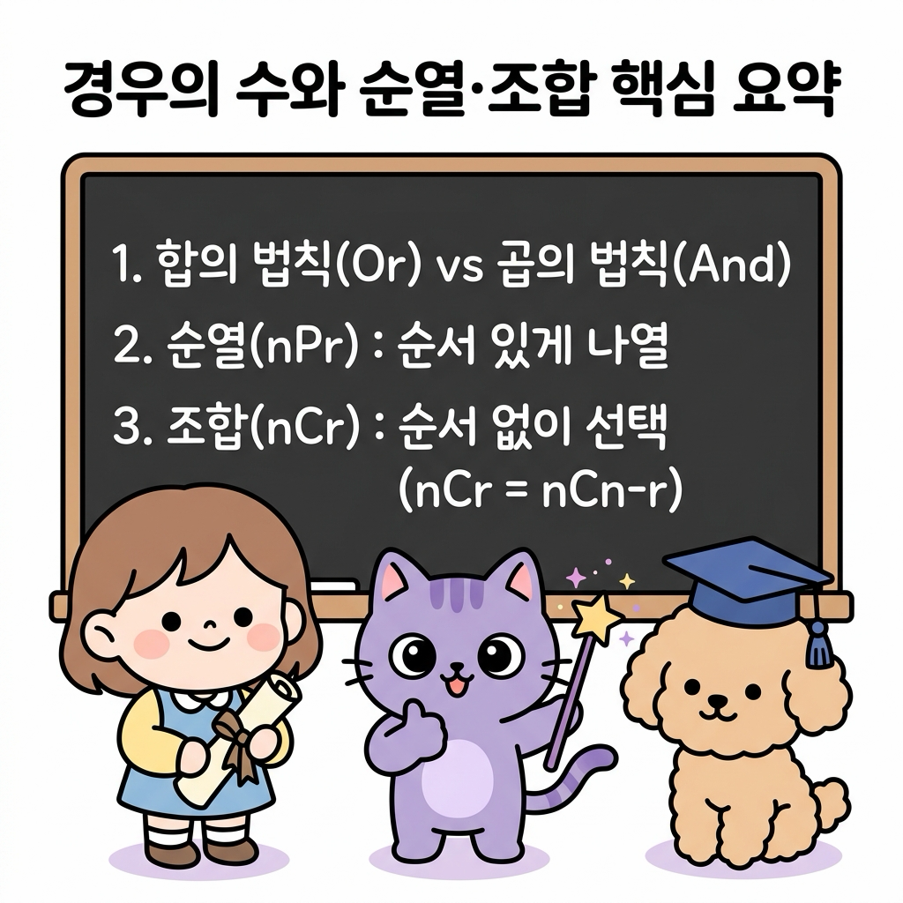
**그림 02-8-17** 갈림길 탐색을 위한 합의 법칙과 곱의 법칙, 순서가 있는 순열과 순서가 없는 조합의 수학적 기초를 모두 마스터한 도로시와 지니, 토토

1. **합의 법칙**은 동시에 일어나지 않는 사건의 덧셈(Or)이며, **곱의 법칙**은 연속적·동시적으로 일어나는 사건의 곱셈(And)이다.
2. **순열(<sub>*n*</sub>*P*<sub>*r*</sub>)**은 서로 다른 *n*개 중 *r*개를 **순서를 고려하여 나열**하는 경우의 수이며, **조합(<sub>*n*</sub>*C*<sub>*r*</sub>)**은 **순서 없이 선택**하여 묶음을 만드는 경우의 수이다.
3. 조합은 순열의 값에서 중복되는 나열 수인 *r*!을 나눈 값을 가지며, 대칭성 성질인 **<sub>*n*</sub>*C*<sub>*r*</sub> = <sub>*n*</sub>*C*<sub>*n-r*</sub>**을 활용하면 복잡한 조합 계산을 극적으로 단순화할 수 있다.
