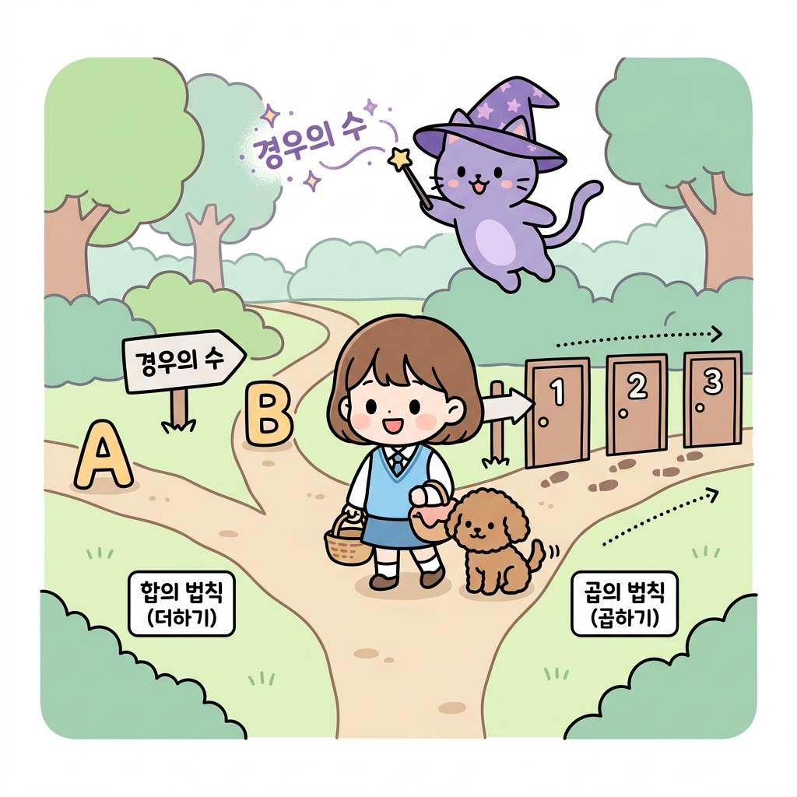
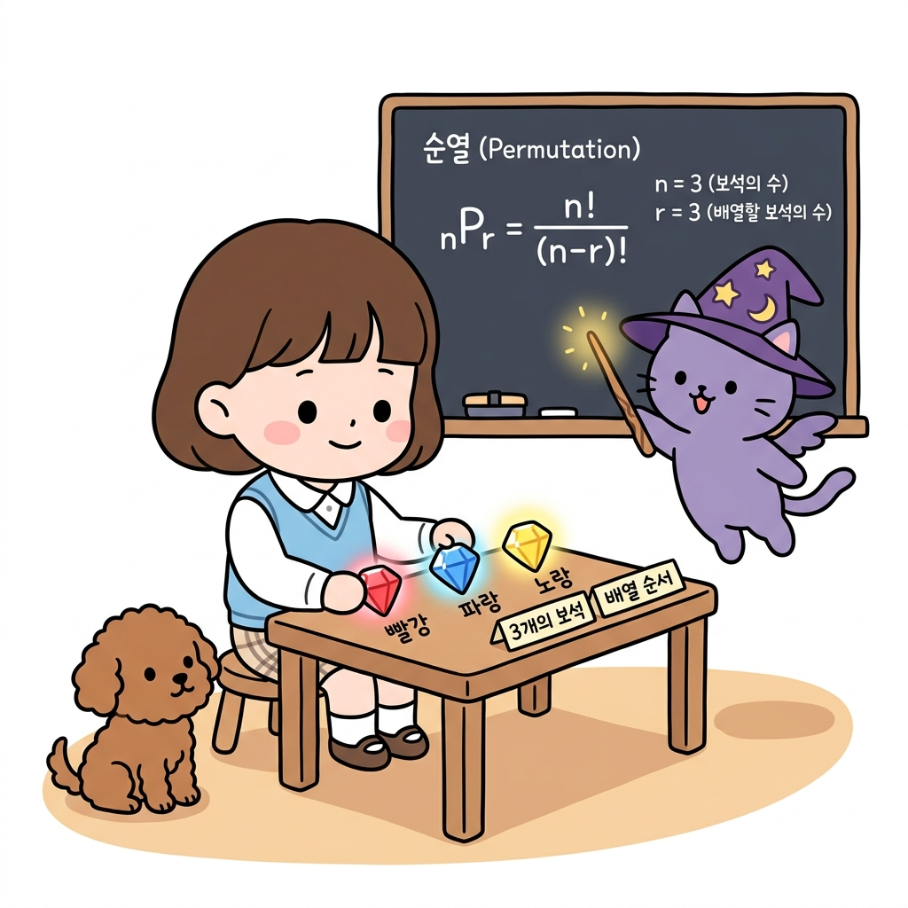
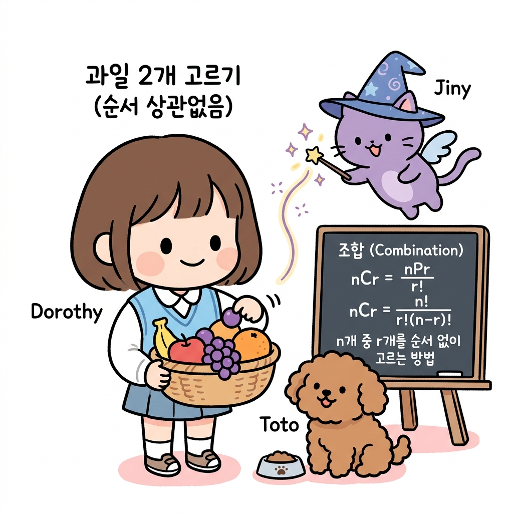

# 02.8 경우의 수와 순열/조합

> 이 장에서는 **경우의 수와 순열/조합**에 관한 기초부터 심화 개념들을 유기적으로 결합하여 학습합니다.

---

## 02.8.1 경우의 수와 합의 법칙, 곱의 법칙

경우의 수는 모험 경로에서 우리가 직면할 수 있는 모든 선택지의 수입니다.

"지니! 숲속 갈림길을 만났는데, 어느 길을 골라서 가야 안전하게 보물을 얻을 수 있을까? 그리고 내가 선택할 수 있는 총 경로의 가짓수는 전부 몇 가지야?"

도로시가 바구니를 들고 숲길 중간에서 좌우를 둘러보았습니다. 토토는 발밑에서 두리번거리며 꼬리를 흔들었습니다. 지니는 공중에 요술봉을 휘둘러 갈림길 지도를 입체적으로 띄웠습니다.

"도로시! 갈림길을 지혜롭게 지나가기 위해서는 먼저 우리가 마주할 수 있는 모든 선택지, 즉 **경우의 수(Number of Cases)**를 정확히 셀 줄 알아야 해. 길을 선택하는 상황에 따라 덧셈을 해야 할지, 곱셈을 해야 할지 결정하는 2가지 규칙이 있단다."

**그림 02-8-1** 한 번에 하나만 고를 수 있는 분리된 경로(합의 법칙)와, 차례대로 연이어 가야 하는 순차적 경로(곱의 법칙)의 차이를 이해하는 도로시와 지니, 토토

"아! 왼쪽 갈림길 A 또는 B 중 하나를 택할 때는 서로 겹치지 않으니까 단순히 더해서 구하는 **합의 법칙**이고, 오른쪽 길처럼 1번 문을 통과한 뒤 연이어 2번, 3번 문을 통과해야 할 때는 조합이 만들어지니까 곱해서 구하는 **곱의 법칙**이구나!"

도로시가 지도를 보며 고개를 끄덕였습니다.

---

### 1. 학습 목표
- 사건과 경우의 수의 뜻을 이해한다.
- 동시에 일어나지 않는 두 사건에 대해 합의 법칙을 적용할 수 있다.
- 연이어 일어나는 두 사건에 대해 곱의 법칙을 적용할 수 있다.

---

### 2. 핵심 개념

#### (1) 사건과 경우의 수
* **사건 (Event)**: 주사위를 던지는 것과 같이, 동일한 조건에서 반복할 수 있는 관찰이나 실험의 결과입니다.
* **경우의 수 (Number of Cases)**: 사건이 일어날 수 있는 모든 가짓수입니다.
  * *예*: 주사위 한 개를 던질 때, '짝수 눈이 나오는 사건'의 경우의 수는 [2, 4, 6]으로 총 3가지입니다.

#### (2) 합의 법칙 (Addition Rule)
두 사건 *A*, *B*가 동시에 일어나지 않을 때, 사건 *A*가 일어나는 경우의 수를 *m*, 사건 *B*가 일어나는 경우의 수를 *n*이라고 하면, 사건 *A* **또는** 사건 *B*가 일어나는 경우의 수는 다음과 같습니다.
* **_m + n_**
  * *힌트*: **또는(Or)**, **~하거나**라는 조건일 때 사용합니다.

#### (3) 곱의 법칙 (Multiplication Rule)
사건 *A*가 일어나는 경우의 수가 *m*이고, 그 각각에 대하여 사건 *B*가 일어나는 경우의 수가 *n*일 때, 두 사건 *A*, *B*가 **동시에(연이어)** 일어나는 경우의 수는 다음과 같습니다.
* **_m × n_**
  * *힌트*: **그리고(And)**, **동시에**, **~하고 나서 연이어**라는 조건일 때 사용합니다.

---

### 3. 실전 예제

#### 예제 1 (합의 법칙)
> **문제**: 도로시네 반에서는 현장 학습 장소로 산 3곳(설악산, 지리산, 월출산) 또는 바다 2곳(해운대, 만리포) 중 한 곳을 선택하려고 합니다. 선택할 수 있는 총 여행지의 경우의 수는 몇 가지인가요?
>
> **풀이**:
> 산을 선택하는 사건과 바다를 선택하는 사건은 동시에 고를 수 없습니다. 따라서 합의 법칙을 적용합니다.
> 경우의 수 = 3 (산) + 2 (바다) = 5가지
> **정답**: 5가지

#### 예제 2 (곱의 법칙)
> **문제**: 도로시는 상의로 흰색, 빨간색, 연두색 블라우스 3벌이 있고, 하의로 핑크색 스커트, 파란색 스커트, 노란색 바지 3벌이 있습니다. 상의와 하의를 각각 하나씩 선택하여 입을 수 있는 옷차림의 총 경우의 수는 몇 가지인가요?
>
> **풀이**:
> 상의를 고르는 사건과 하의를 고르는 사건은 연이어 일어나는 사건입니다. 따라서 곱의 법칙을 적용합니다.
> 경우의 수 = 3 (상의) × 3 (하의) = 9가지
> **정답**: 9가지

---

## 02.8.2 경우의 수 심화: 중복이 있는 합의 법칙과 곱의 법칙

선택지가 서로 완전히 분리되어 있지 않고 **중복**이 존재할 때의 합산 요령을 다룹니다.

"지니! 만약 갈림길 숲길 코스 중에서 겹치는 구간이 존재한다면, 그때는 단순 합의 법칙을 쓰면 안 되는 거지?"

"맞아, 도로시! 겹치는 영역을 생각하지 않고 그냥 다 더해버리면 중복된 원소들을 두 번 세게 되는 오류가 발생한단다. 그래서 겹치는 교집합 부분을 반드시 한 번 빼주어야 해."

* **중복이 있는 합의 법칙**:
  경우의 수 = *m* + *n* - *l* (여기서 *l*은 두 사건이 동시에 겹치는 경우의 수)
  * 집합의 원소 개수 공식: *n*(*A* ∪ *B*) = *n*(*A*) + *n*(*B*) - *n*(*A* ∩ *B*)

---

## 02.8.3 팩토리얼과 순서대로 나열하기

서로 다른 대상을 빠짐없이 일렬로 세우는 경우의 수인 **팩토리얼(Factorial, 계승)**을 배웁니다.

"지니! 내 책상 위에 빨강, 파랑, 노랑 세 개의 신비로운 보석이 있어. 이 보석들을 왼쪽부터 차례대로 배열하는 방법은 총 몇 가지일까?"

도로시가 반짝이는 보석들을 만지작거리며 지니에게 질문했습니다. 토토는 테이블 밑에서 눈을 반짝였습니다. 지니는 요술 칠판에 수식을 적으며 설명했습니다.

"첫 번째 자리에 놓을 수 있는 보석은 3가지, 그 다음 두 번째 자리에는 첫 번째 자리에 놓인 것을 제외한 2가지, 마지막 자리에는 남은 1가지가 오게 되지. 이 연쇄적인 결정을 곱의 법칙으로 계산하면 3 × 2 × 1 = 6가지가 되는데, 이를 수학 기호로 **3!(3 팩토리얼)**이라고 부른단다."

**그림 02-8-2** 3개의 보석을 테이블 위에 나열하는 경우의 수를 통해 팩토리얼 및 순열(3P3) 공식을 학습하는 도로시와 지니, 토토

* **팩토리얼 (Factorial, 계승)**:
  1부터 *n*까지의 모든 자연수를 차례대로 곱한 것을 뜻하며, 기호로 **_n!_**이라 씁니다.
  *n*! = *n* × (*n* - 1) × (*n* - 2) × ... × 2 × 1
  * *참고*: 0!은 1로 정의합니다.

---

## 02.8.4 순열: 택하여 줄 세우기

서로 다른 *n*개 중 *r*개를 선택해 순서를 고려하여 일렬로 줄 세우는 것을 **순열(Permutation)**이라고 합니다.

* **순열 기호**: ***n**P**r***
* **계산식**:
  *n**P**r* = *n* × (*n* - 1) × ... × (*n* - *r* + 1) (곱하는 수의 개수가 *r*개)
  *n**P**r* = *n*! / (*n* - *r*)!

"아! 5개의 트로피 중 1등, 2등, 3등 단상에 올릴 트로피 3개를 순서대로 고르는 가짓수는 5*P*3 = 5 × 4 × 3 = 60가지구나! 뽑는 순서가 결과에 영향을 주는 상황(Order matters)에는 이 순열을 쓰는 거네!"

도로시가 노트를 보며 고개를 끄덕였습니다.

---

## 02.8.5 조합: 순서 없이 선택하기

순서와 관계없이 특정 대상을 묶음으로 골라내기만 하는 **조합(Combination)**을 공부합니다.

"지니! 순열은 순서대로 줄을 세우는 거였잖아. 그렇다면 순서는 전혀 상관없이, 그냥 바구니에서 과일 2개를 묶음으로 쏙 골라내기만 하는 가짓수는 어떻게 계산해?"

도로시가 과일 바구니에서 사과와 포도를 꺼내며 물었습니다. 지니는 칠판에 나눗셈 기호를 그리며 자상하게 설명했습니다.

"그때는 바로 **조합(Combination, *n**C**r*)**을 사용한단다. 순서가 상관없으므로, 일단 순열(*n**P**r*)로 나열한 뒤 그 개수들이 자리를 바꾸는 중복 가짓수(*r*!)만큼 나누어 제외해주면 된단다."

**그림 02-8-3** 과일 바구니에서 순서 상관없이 과일 2개를 묶음으로 선택하는 상황을 통해 조합(nCr) 공식의 중복 제거 원리를 파악하는 도로시와 지니, 토토

* **조합 공식**:
  ***n**C**r* = *n**P**r* / *r*! = *n*! / [ *r*! × (*n* - *r*)! ]**
* **조합의 대칭성 성질**:
  ***n**C**r* = *n**C**n-r***
  * *직관적 의미*: 10명 중 여행에 데려갈 8명을 고르는 가짓수(10*C*8)는 데려가지 않고 제외할 2명을 고르는 가짓수(10*C*2)와 수학적으로 완전히 대칭을 이룹니다.

"와! 20*C*18 같은 큰 숫자는 대칭성 성질을 이용해 20*C*2로 바꾸면 식이 훨씬 간단해지는구나! 수학은 참 영리해!"

도로시가 박수를 치며 활짝 웃었습니다.

---

## 02.8.6 실전 예제

### 문제 1 (순열과 조합 계산)
> 학생 10명 중 회장, 부회장 2명을 뽑는 경우의 수(*A*)와, 대표 2명을 뽑는 경우의 수(*B*)를 각각 계산하시오.
>
> **풀이**:
> - 회장과 부회장은 직책(순서)의 구분이 있으므로 순열입니다:
>   *A* = 10*P*2 = 10 × 9 = 90가지
> - 대표 2명은 직책(순서)의 구분이 없으므로 조합입니다:
>   *B* = 10*C*2 = (10 × 9) / (2 × 1) = 45가지
>
> **정답**: *A* = 90가지, *B* = 45가지

---

## 02.8.7 핵심 요약

1. **합의 법칙**은 동시에 일어나지 않는 사건의 합산(Or)이며, **곱의 법칙**은 연속적/동시적으로 일어나는 조합(And)의 곱산이다.
2. **순열(*n**P**r*)**은 서로 다른 *n*개 중 *r*개를 **순서를 고려하여 나열**하는 경우의 수이며, **조합(*n**C**r*)**은 **순서 없이 선택**하여 묶음을 만드는 경우의 수이다.
3. 조합은 순열의 값에서 중복되는 나열 수인 *r*!을 나눈 값을 가지며, 대칭성 성질인 ***n**C**r* = *n**C**n-r***을 적극 활용하면 큰 수의 조합 계산이 단순해진다.
