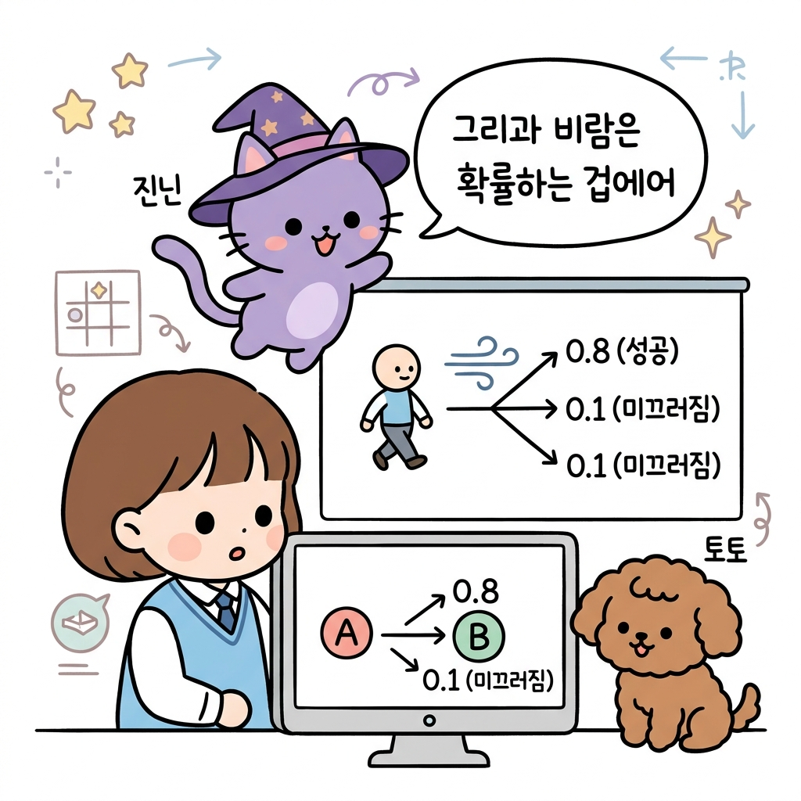
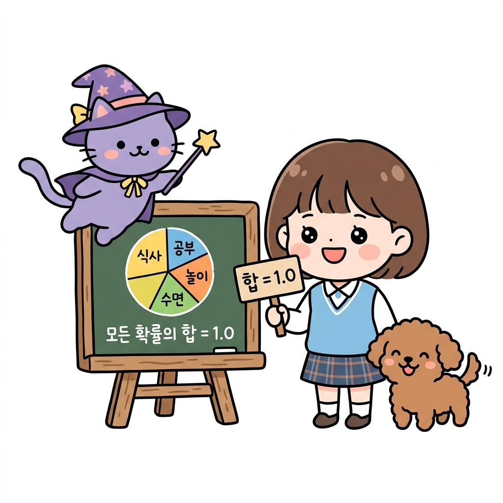
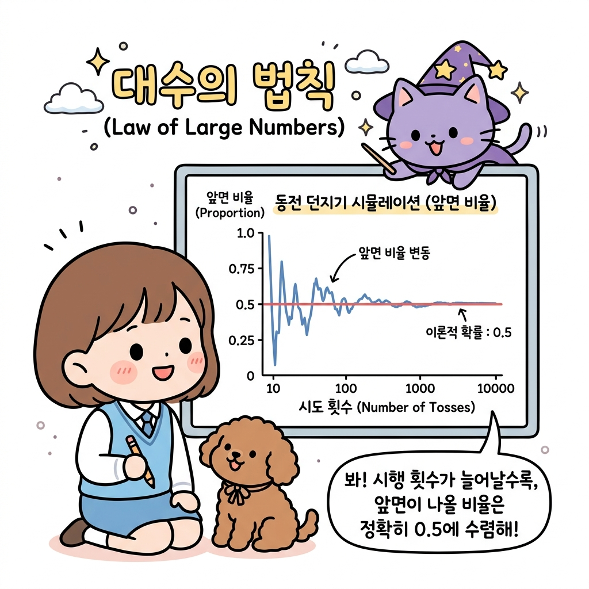

# 02.9 확률의 정의와 성질

> 이 장에서는 **확률의 정의와 성질 (수학적/실험적/기하학적 확률)**에 관한 기초부터 심화 개념들을 유기적으로 결합하여 학습합니다.

---

## 02.9.1 확률의 뜻과 실험적 확률

확률이란 불확실한 결과를 객관적으로 파악하기 위한 수학적 수단입니다.

"지니! 격자 세상(Grid World) 게임판 위에서 캐릭터가 위로 가라고 명령을 내렸는데, 바람이 강하게 불어서 캐릭터가 옆 칸으로 자꾸 미끄러져 가버려! 내가 가라고 한 방향으로 갈 확률은 정확히 몇 퍼센트나 되는 거야?"

도로시가 조이패드를 쥔 채 곤란한 표정으로 칠판의 격자지도를 보며 말했습니다. 토토도 멍멍 짖으며 바람 소리에 맞춰 고개를 저었습니다. 지니는 입체 스크린을 띄워 바람이 부는 전이 지도를 보여주었습니다.

"도로시! 강화학습에서는 행동을 취했을 때 100% 성공하지 못하고 다른 상태로 이탈하는 경우가 많아. 이때 특정 칸으로 도달하게 될 가능성을 수치로 표현한 것을 **전이 확률(Transition Probability)**이라고 불러. 이는 불확실성을 객관적으로 수치화하는 확률의 정의와 완벽하게 닿아 있단다."

**그림 02-9-1** 격자 세상에서 이동 명령을 내렸을 때 바람의 세기와 방향에 따라 실제 다른 상태로 미끄러져 들어갈 전이 확률 시스템을 살펴보는 지니와 도로시, 토토

"아! 내가 똑바로 전진할 성공 확률이 0.8(80%)이고, 옆으로 미끄러질 확률이 각각 0.1(10%)씩 배정되어 있구나!"

도로시가 그림을 보며 설명했습니다.

"그렇단다. 그리고 여기서 중요한 대원칙이 하나 있어. 에이전트가 어떤 상태에서 어떤 행동을 하든, 이동할 수 있는 모든 다음 상태들의 전이 확률을 합치면 항상 **1.0 (100%)**이 되어야 한단다."

**그림 02-9-2** 하루 일과를 나누어 결정하는 파이 차트의 비율처럼, 일어날 수 있는 모든 사건의 개별 확률들을 전부 합산하면 정확히 1.0(100%)이 됨을 설명하는 도로시와 지니

---

### 1. 학습 목표
- 확률의 기본적 의미를 이해한다.
- 실험이나 관찰을 통해 얻어지는 실험적 확률(통계적 확률)의 개념을 이해한다.
- 대수의 법칙(Law of Large Numbers)의 의의를 파악한다.

---

### 2. 핵심 개념

#### (1) 확률의 의미
* **확률 (Probability)**: 어떤 사건이 일어날 가능성을 0과 1 사이의 수치(혹은 0%에서 100%)로 나타낸 것입니다.

#### (2) 실험적 확률 (Empirical Probability)
동일한 조건 아래에서 어떤 실험이나 관찰을 *N*번 반복할 때, 사건 *A*가 일어난 횟수를 *r*이라 하면, *N*을 충분히 크게 함에 따라 상대도수 *r* / *N*이 일어나는 비율이 일정한 값 *P*에 한없이 가까워집니다. 이 값 *P*를 사건 *A*의 **실험적 확률**이라고 합니다.
* **_P(A) ≈ r / N_** (단, *N*은 매우 큰 수)

---

#### (3) 대수의 법칙 (Law of Large Numbers)
"지니! 동전을 직접 열 번 던져봤는데, 앞면이 일곱 번이나 나왔어! 그럼 내 동전은 앞면이 나올 확률이 70%인 거야?"

"하하, 좋은 질문이야! 던진 횟수가 적을 때는 우연의 장난으로 비율이 왜곡되어 보일 수 있지. 하지만 던진 횟수가 수천, 수만 번으로 늘어날수록 앞면이 나올 상대적 비율은 결국 이론적인 진짜 확률인 50%(0.5)에 가깝게 수렴하게 된단다. 이걸 수학에서는 **대수의 법칙(큰 수의 법칙)**이라고 불러."

**그림 02-9-3** 동전 던지기 시행 횟수(N)가 적을 때는 확률 변동이 심하나, 횟수가 만 번 가까이 늘어날수록 이론적 확률인 0.5로 일정하게 수렴하는 대수의 법칙 시뮬레이션

"와! 시행 횟수가 엄청 많아지면 결국 참 확률로 수렴하는구나! 그래서 강화학습 에이전트도 수많은 에피소드를 겪게 해서 상태 가치를 참값으로 수렴시키는 거였어!"

도로시가 눈을 빛내며 말했습니다.

---

## 02.9.2 수학적 확률과 기하학적 확률

* **수학적 확률 (Mathematical Probability)**: 일어날 수 있는 모든 경우의 수 *N*가지 중 사건 *A*가 일어나는 경우의 수 *a*가지의 비입니다:
  **_P(A) = a / N_**
* **기하학적 확률 (Geometric Probability)**: 무한한 경우의 수가 존재하는 연속적인 영역에서 길이, 넓이, 부피의 비율로 확률을 정의하는 방식입니다:
  **_P(A) = 영역 A의 크기 / 전체 영역 S의 크기_**

---

## 02.9.3 독립사건과 확률의 곱셈정리

* **독립사건 (Independent Events)**: 두 사건 *A*와 *B*가 서로 일어날 확률에 전혀 영향을 주지 않는 경우를 뜻합니다.
* **확률의 곱셈**: 두 사건이 독립일 때, 동시에(혹은 연이어) 두 사건이 모두 일어날 확률은 각 확률의 곱과 같습니다:
  **_P(A ∩ B) = P(A) × P(B)_**

---

## 02.9.4 실전 예제

### 문제 1 (독립사건의 곱셈)
> 서로 다른 두 개의 주사위(빨강, 파랑)를 동시에 던질 때, 두 주사위의 눈이 모두 4 이하가 나올 확률을 구하시오.
>
> **풀이**:
> * 사건 *A* (빨강 주사위의 눈이 4 이하일 확률) = 4 / 6 = 2 / 3
> * 사건 *B* (파랑 주사위의 눈이 4 이하일 확률) = 4 / 6 = 2 / 3
>
> 두 사건은 독립사건이므로 확률의 곱셈정리를 적용합니다:
> * *P*(*A* ∩ *B*) = *P*(*A*) × *P*(*B*) = 2/3 × 2/3 = 4 / 9 (약 44.4%)
>
> **정답**: 4 / 9

---

## 02.9.5 핵심 요약

1. **확률**은 불확실한 사건의 발생 가능성을 0과 1 사이의 수치로 나타낸 것이다.
2. **대수의 법칙**에 의해 실제 시행 횟수 *N*이 무한히 커질수록 실험적 확률은 이론적인 수학적 확률에 수렴한다.
3. 독립적인 두 사건이 연이어 발생할 확률은 각 사건의 개별 확률을 곱한 **독립사건의 곱셈 (*P(A) × P(B)*)**으로 간단히 구한다.
