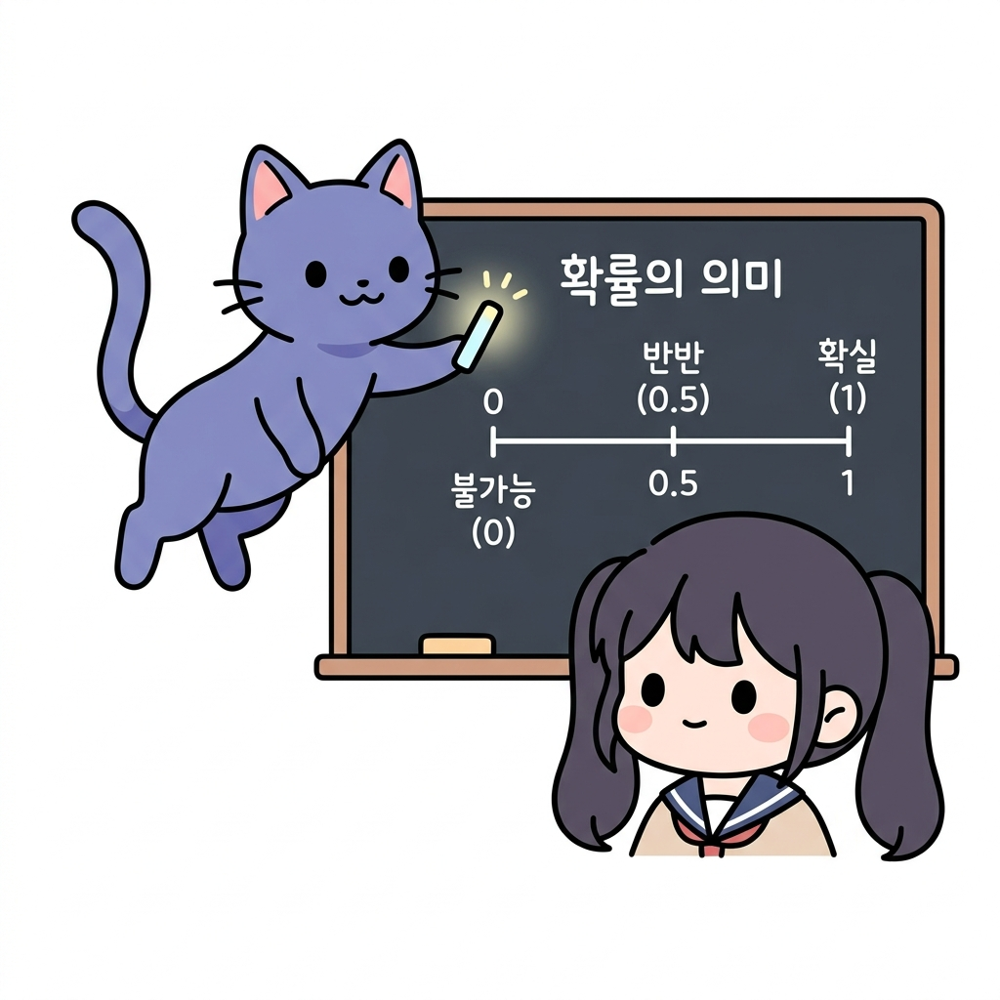
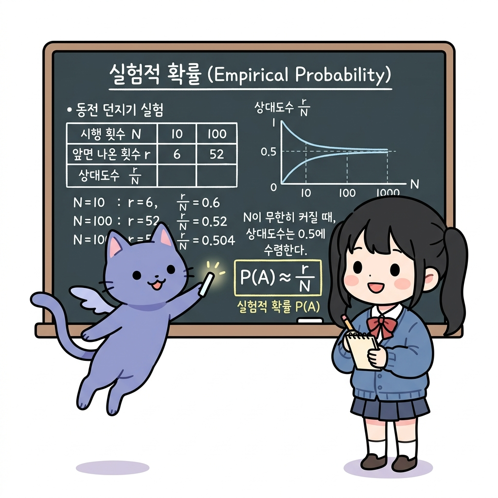
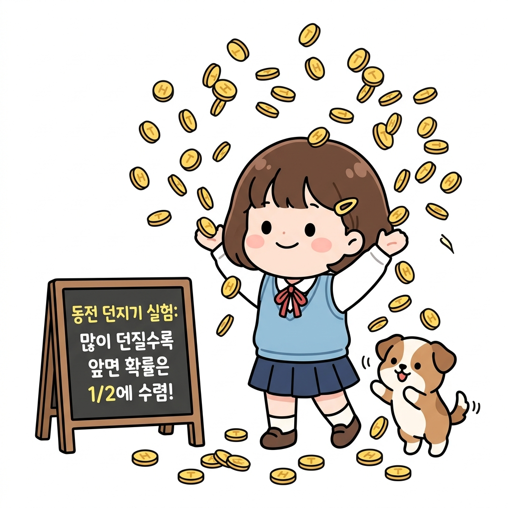
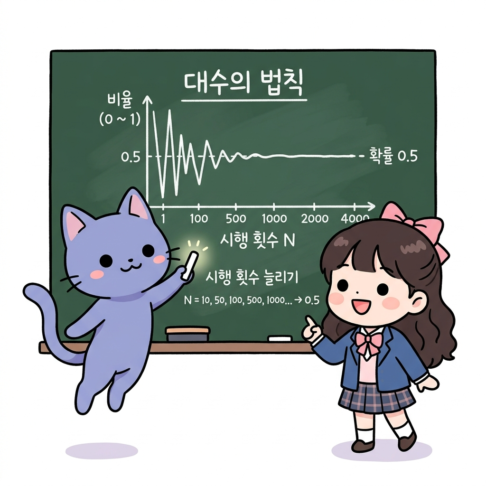
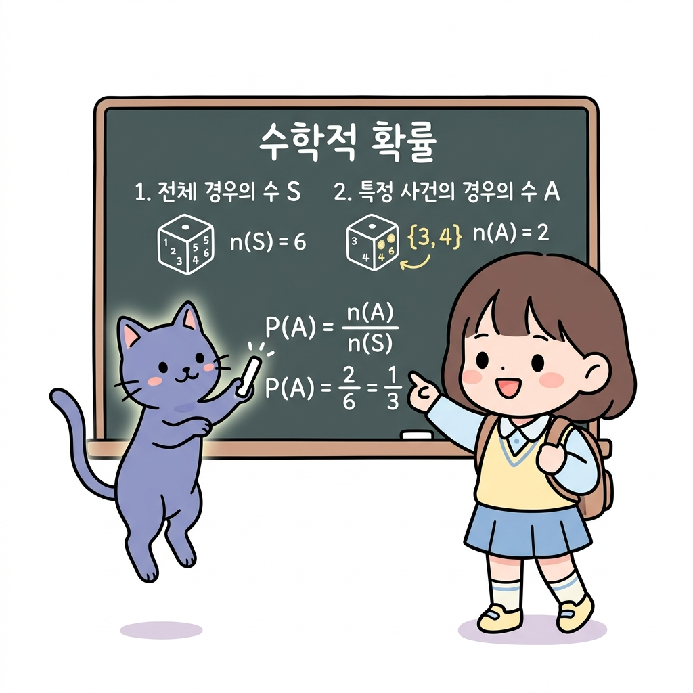
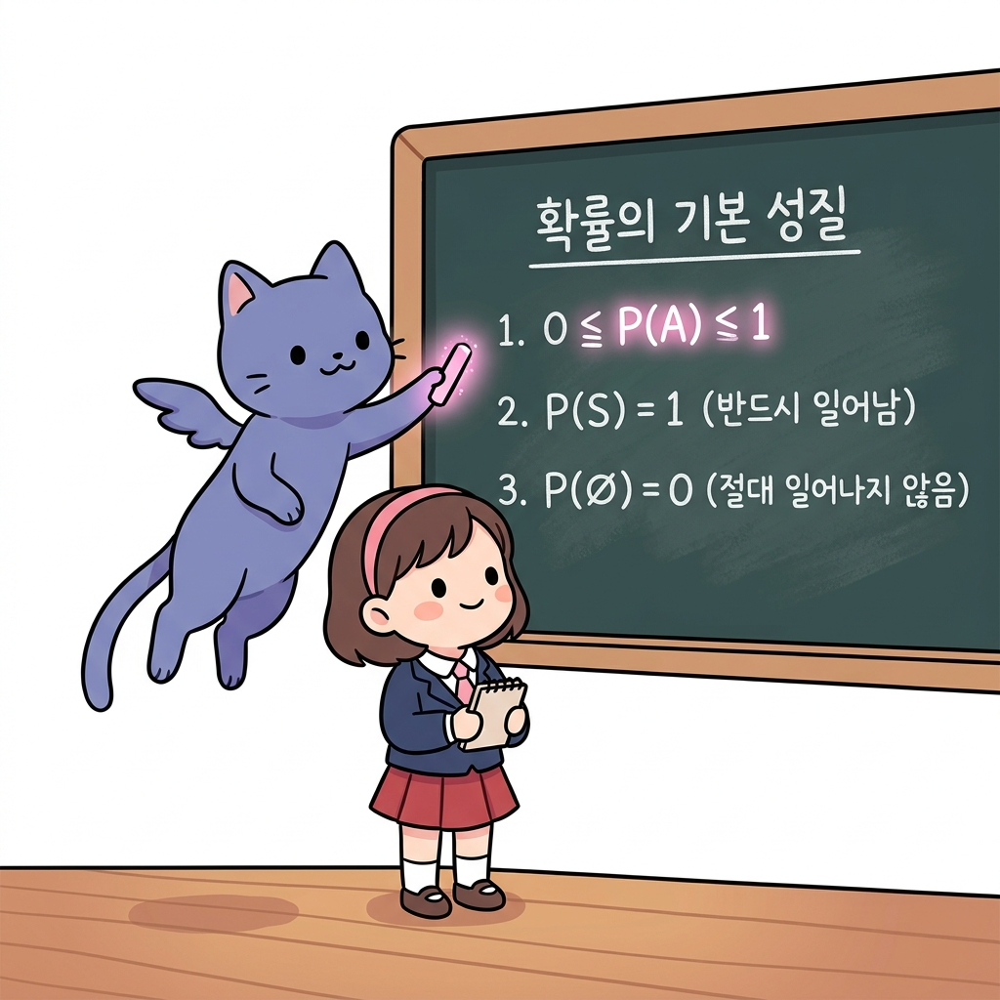
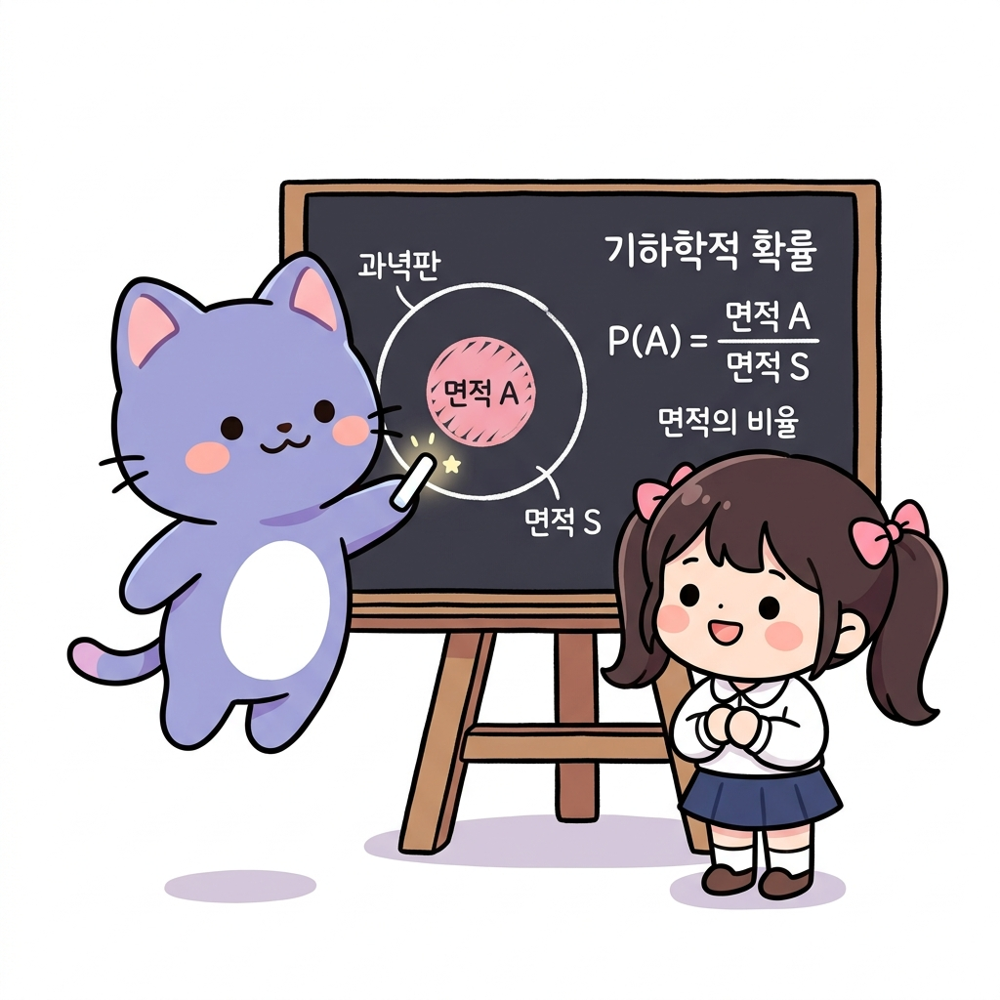
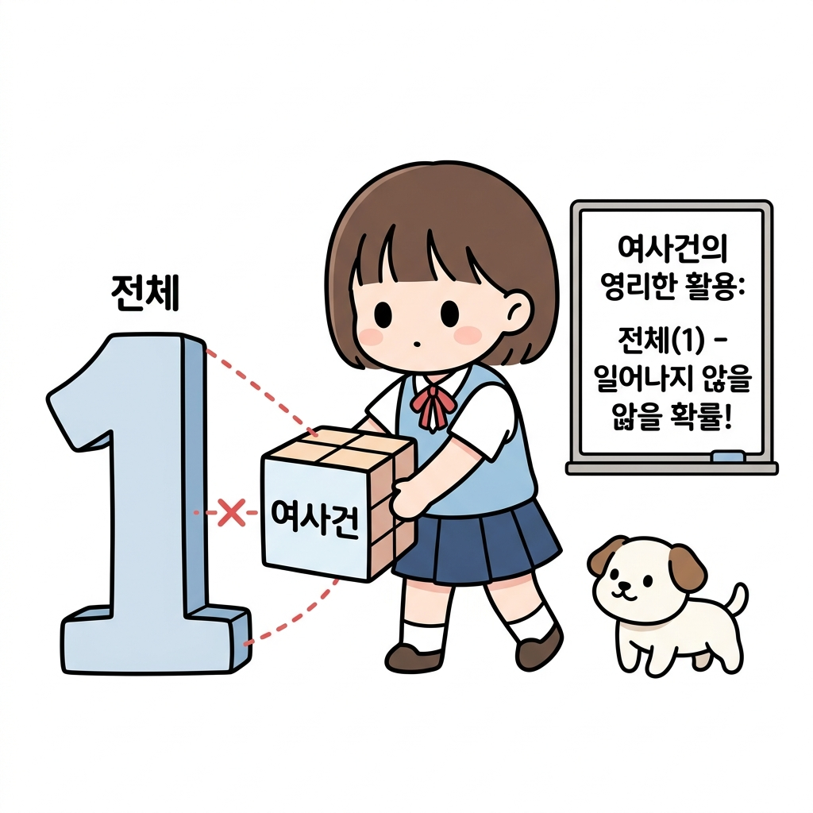
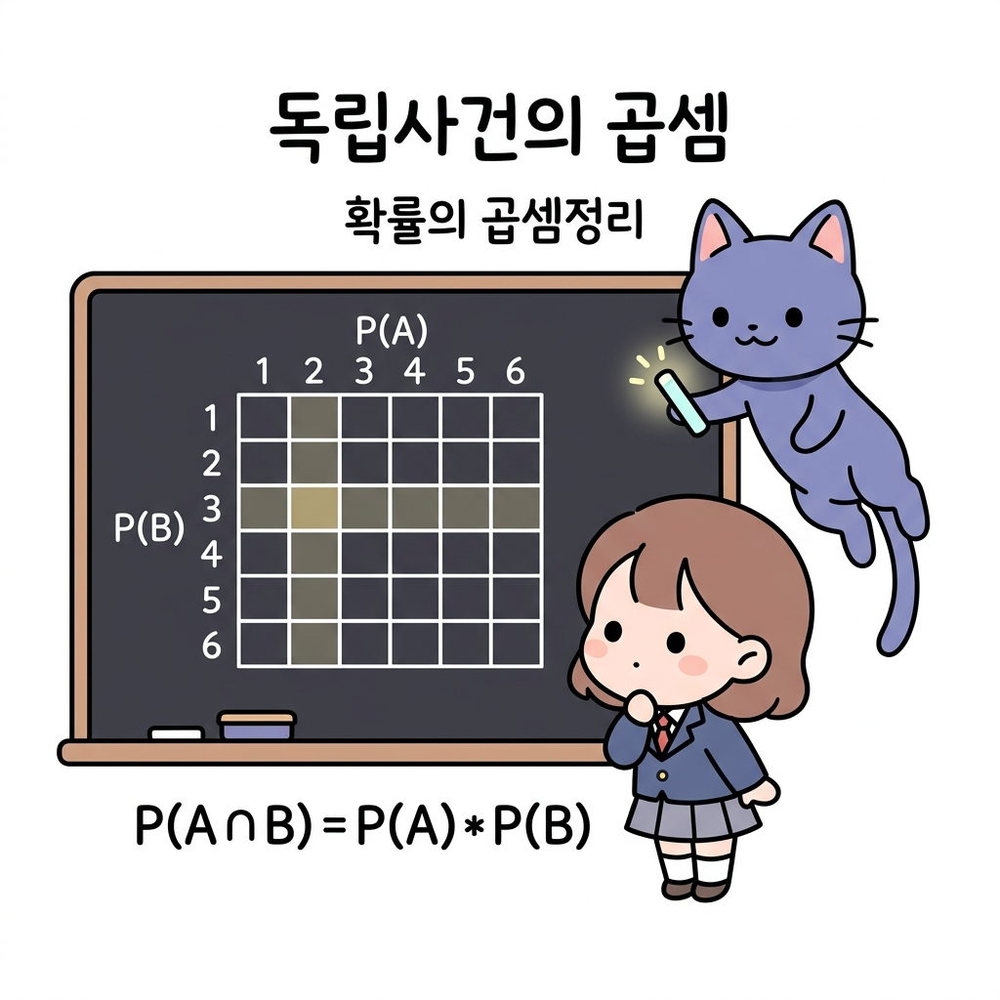
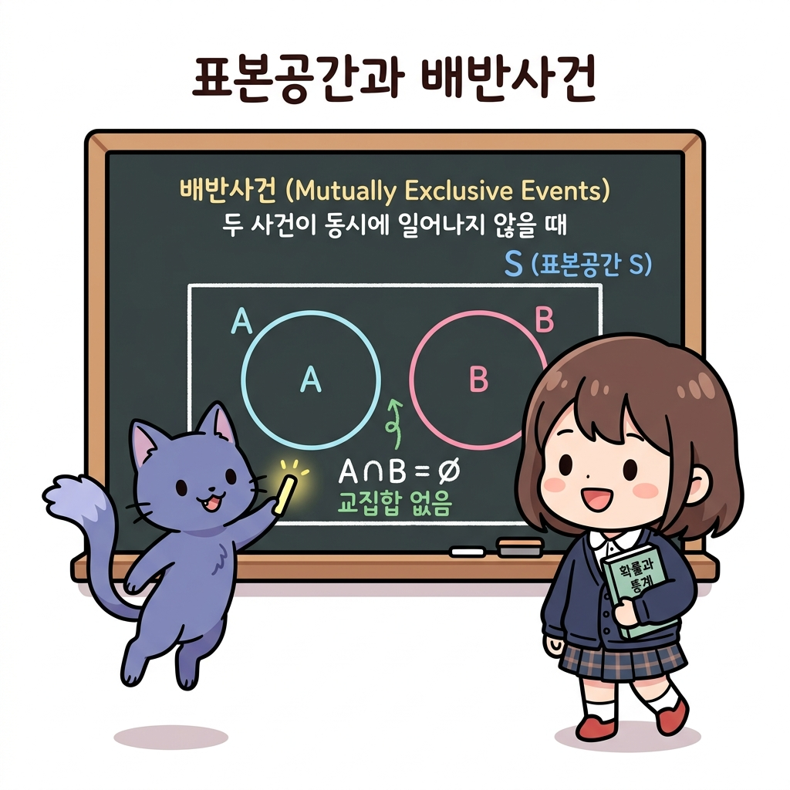

# 02.9 확률의 정의와 성질 (수학적/실험적/기하학적 확률)

> 이 장에서는 **확률의 정의와 성질 (수학적/실험적/기하학적 확률)**에 관한 기초부터 심화 개념들을 유기적으로 결합하여 학습합니다.

---

## 02.9.1 확률의 뜻과 실험적 확률

**그림 02-9-1** 동전을 직접 백 번 던지며 앞뒷면이 나오는 횟수를 장부에 적는 도로시와 시간의 경과에 따른 수렴을 설명하는 지니

확률이란 불확실한 결과를 객관적으로 파악하기 위한 수단입니다. 특히 주사위나 동전을 무수히 많이 던지는 실험을 통해 얻은 비율인 **실험적 확률**과, 시행 횟수가 끝없이 많아질수록 이론적인 진짜 확률에 가깝게 수렴한다는 **대수의 법칙**을 도로시의 동전 던지기 기록장과 함께 직관적으로 배워봅시다!

---

### 1. 학습 목표
- 확률의 기본적 의미를 이해한다.
- 실험이나 관찰을 통해 얻어지는 실험적 확률(통계적 확률)의 개념을 이해한다.
- 대수의 법칙(Law of Large Numbers)의 의의를 파악한다.

---

### 2. 핵심 개념

#### (1) 확률의 의미
- **확률 (Probability)**: 어떤 사건이 일어날 수 있는 가능성을 수치로 나타낸 것입니다. 보통 0과 1 사이의 값(또는 0%와 100% 사이)으로 표현합니다.
  - 표현 방식: 분수, 소수, 백분율 등.

**그림 02-9-2** 확률이 의미하는 불가능(0)부터 확실(1)까지의 스펙트럼과 가능성 표현 방식

#### (2) 실험적 확률 (Empirical Probability / 통계적 확률)
- 동일한 조건 아래에서 어떤 실험이나 관찰을 *N*번 반복할 때, 사건 *A*가 일어난 횟수를 *r*이라 하면, *N*을 충분히 크게 함에 따라 상대도수 *r* / *N*이 일어나는 비율이 일정한 값 *P*에 한없이 가까워집니다. 이 일정한 값 *P*를 사건 *A*의 **실험적 확률(통계적 확률)** 이라고 합니다.
  *P*(*A*) ≈ *r* / *N*  (단, *N*은 충분히 큰 수)

**그림 02-9-3** 주사위나 동전 던지기 실험을 무수히 많이 반복하여 통계적으로 구하는 실험적 확률의 원리

#### (3) 대수의 법칙 (Law of Large Numbers)
- 실험이나 시행의 횟수 *N*이 커질수록, 실험을 통해 얻어지는 상대도수 *r* / *N*은 수학적으로 계산된 참 확률에 수렴한다는 법칙입니다.
  - *주의*: 시행 횟수가 적을 때는 우연성이 크게 작용하여 참 확률과 격차가 생길 수 있으나, 시행 횟수가 매우 많아지면 결국 참 확률로 수렴합니다.

**그림 02-9-4** 동전 던지기 횟수(N)의 증가에 따른 앞면 등장 확률의 50% 수렴 현상

* 동전을 던지는 횟수가 적을 때는 앞면이 나오는 비율이 0.8이나 0.2처럼 극단적으로 나올 수 있지만, 던지는 횟수를 800번 이상 늘릴수록 결국 수학적 확률인 0.5(50%) 근처로 안정되게 수렴하게 됩니다.

---

### 3. 시각 자료: 대수의 법칙 수렴 도식

**그림 02-9-5** 동전 던지기 시행 횟수 N이 증가함에 따라 상대도수가 참 확률인 0.5에 수렴해가는 그래프 도식

---

### 4. 실전 예제

#### 예제 1 (실험적 확률과 상대도수)
> **문제**: 토토가 주머니에서 특이하게 생긴 동물 복사뼈(네 면에 각각 태양, 달, 사자, 용이 그려짐)를 여러 번 던져서 '용' 그림이 나오는 횟수를 기록했습니다. 기록한 표는 다음과 같습니다.
>
> | 던진 횟수 (*N*) | 용이 나온 횟수 (*r*) | 용이 나온 비율 (*r* / *N*) |
> | :---: | :---: | :---: |
> | 10 | 8 | 8 / 10 = 0.8 |
> | 100 | 68 | 68 / 100 = 0.68 |
> | 1000 | 709 | 709 / 1000 = 0.709 |
> | 10000 | 7000 | 7000 / 10000 = 0.7 |
>
> 던지는 횟수가 늘어남에 따라 '용'이 나올 실험적 확률은 어떤 값에 가까워지고 있나요?
>
> **풀이**:
> 던지는 횟수 *N*이 10 ➔ 100 ➔ 1000 ➔ 10000으로 커질수록, 비율 *r* / *N*이 0.8 ➔ 0.68 ➔ 0.709 ➔ 0.7로 변화하며 특정 값인 0.7에 수렴하고 있습니다. 따라서 대수의 법칙에 의해 실험적 확률은 0.7(70%)로 수렴합니다.
> **정답**: 0.7

#### 예제 2 (실생활에서의 확률 비교)
> **문제**: 토토와 새로 전학 온 농구선수 친구의 자유투 성공률을 비교하려고 합니다.
> - 농구선수 친구: 작년 경기에서 자유투 총 100개를 던져 60개 성공
> - 토토: 연습 상황에서 자유투 총 50개를 던져 10개 성공
> 두 사람의 자유투 성공 확률을 비교해 보세요.
>
> **풀이**:
> - 농구선수 친구의 성공 확률: *P*(친구) = 60 / 100 = 0.6
> - 토토의 성공 확률: *P*(토토) = 10 / 50 = 0.2
>
> 두 사람의 성공 확률을 비교했을 때, 농구선수 친구(0.6)가 토토(0.2)보다 자유투를 성공시킬 확률이 월등히 높음을 알 수 있습니다.
> **정답**: 농구선수 친구가 더 높음 (친구: 0.6, 토토: 0.2)

---

### 5. 핵심 요약
1. **확률**은 어떤 사건이 발생할 가능성을 수치화한 것이다.
2. **실험적 확률**은 실제 여러 번의 실험이나 관찰을 통해 나타난 비율을 이용해 확률을 정의하는 방식이다.
3. **대수의 법칙**에 의하여 시행 횟수 *N*이 충분히 커질 때 실험적 확률은 실제 참 확률에 수렴한다.

---

## 02.9.2 수학적 확률과 기하학적 확률

**그림 02-9-6** 다트 과녁판의 사과 명중 부위 면적을 활용하여 기하학적 비율과 확률을 강의하는 지니와 도로시

수학적 확률은 일어날 수 있는 모든 경우의 수에 대해 특정 사건이 일어나는 경우의 수의 비율입니다. 더불어 선의 길이, 영역의 넓이, 부피의 비율로 확률을 다루는 **기하학적 확률**의 개념까지 지니의 마법 다트판을 통해 입체적으로 마스터해 봅시다!

---

### 1. 학습 목표
- 수학적 확률의 정의를 알고 이를 구할 수 있다.
- 확률의 기본 성질을 이해한다.
- 여사건의 확률과 확률의 덧셈정리(배반사건)를 활용할 수 있다.
- 기하학적 확률의 개념을 이해하고 적용할 수 있다.

---

### 2. 핵심 개념

#### (1) 수학적 확률 (Mathematical Probability)
어떤 시행에서 일어날 수 있는 모든 경우의 수가 *N*가지이고, 각 경우가 일어날 가능성이 모두 같을 때, 사건 *A*가 일어나는 경우의 수가 *a*가지이면 사건 *A*가 일어날 확률 *P*(*A*)는 다음과 같습니다.
*P*(*A*) = *n*(*A*) / *n*(*S*) = *a* / *N*
- *S*: 표본공간 (전체 사건의 집합)
- *A*: 특정 사건

**그림 02-9-7** 하나의 주사위를 던지는 시행에서 특정 사건이 나타날 수학적 확률의 정의

#### (2) 확률의 기본 성질
임의의 사건 *A*에 대하여:
1. 사건 *A*가 일어날 확률 *P*(*A*)는 항상 0 이상 1 이하입니다.
   0 ≤ *P*(*A*) ≤ 1
2. 반드시 일어나는 사건(전체사건 *S*)의 확률은 1입니다.
   *P*(*S*) = 1
3. 절대로 일어날 수 없는 사건(공사건 ∅)의 확률은 0입니다.
   *P*(∅) = 0

**그림 02-9-8** 확률값이 가지는 범주와 필연적 사건, 불가능한 사건에 대한 확률의 기본 성질

#### (3) 여사건의 확률 (Complementary Probability)
사건 *A*가 일어나지 않을 사건을 *A*의 여사건이라 하고 *A**c*로 나타냅니다. 사건 *A*가 일어날 확률을 *p*라고 할 때, 사건 *A*가 일어나지 않을 확률 *P*(*A**c*)는 다음과 같습니다.
*P*(*A**c*) = 1 - *P*(*A*) = 1 - *p*

#### (4) 확률의 덧셈정리 (배반사건)
두 사건 *A*, *B*가 동시에 일어나지 않을 때(즉, 배반사건 *A* ∩ *B* = ∅ 일 때), 사건 *A* 또는 사건 *B*가 일어날 확률은 각각의 확률의 합과 같습니다.
*P*(*A* ∪ *B*) = *P*(*A*) + *P*(*B*)

#### (5) 기하학적 확률 (Geometric Probability)
- 연속적인 변수를 갖는 표본공간에서 어떤 영역 *S* 안에 영역 *A*가 포함되어 있을 때, 영역 *S*에 임의로 점을 하나 찍을 때 그 점이 영역 *A*에 들어갈 확률은 다음과 같습니다.
  *P*(*A*) = 영역 *A*의 크기 (길이, 넓이, 부피) / 전체 영역 *S*의 크기

**그림 02-9-9** 격자 타일 바닥 위에 던져진 동전이 걸치지 않고 면적 내에 온전히 안착할 기하학적 비율 계산

* 일정한 규격의 격자 타일 바닥에 동전을 임의로 던질 때, 동전이 특정 타일 영역(예: 녹색 영역) 안에 완벽하게 들어갈 확률은 전체 영역에 대비한 해당 영역의 면적 비율로 결정됩니다. 이렇게 무한한 경우의 수가 존재하는 연속적 공간에서는 경우의 수 대신 **영역의 넓이 비율**을 이용해 기하학적 확률을 구합니다.

---

### 3. 시각 자료: 확률의 영역과 기하학적 확률

**그림 02-9-10** 전체 집합 영역 S와 부분 사건 영역 A의 비례 면적을 통해 기하학적 가능성을 평가하는 다트판 관계식 도식

---

### 4. 실전 예제

#### 예제 1 (수학적 확률)
> **문제**: 서로 다른 두 개의 주사위를 동시에 던질 때, 두 눈의 수의 합이 10 이상일 확률을 구하세요.
>
> **풀이**:
> - 일어날 수 있는 모든 경우의 수 *n*(*S*) = 6 × 6 = 36가지
> - 합이 10 이상인 사건 *A*: (4,6), (5,5), (5,6), (6,4), (6,5), (6,6)으로 총 6가지
> - 따라서 구하고자 하는 확률 *P*(*A*)는:
>   *P*(*A*) = *n*(*A*) / *n*(*S*) = 6 / 36 = 1 / 6
> **정답**: 1 / 6

#### 예제 2 (여사건의 확률)
> **문제**: 전체 인원이 40명인 학급에서 교탁 바로 앞의 두 자리를 배정받는 제비뽑기를 하려고 합니다. 토토가 교탁 바로 앞자리에 앉지 않게 될 확률을 구하세요.
>
> **풀이**:
> - 교탁 바로 앞자리에 앉게 될 사건 *A*의 확률: *P*(*A*) = 2 / 40 = 0.05
> - 교탁 바로 앞자리에 앉지 않을 사건 *A**c*의 확률은 여사건의 성질을 이용합니다:
>   *P*(*A**c*) = 1 - *P*(*A*) = 1 - 0.05 = 0.95
> **정답**: 0.95 (95%)

#### 예제 3 (기하학적 확률)
> **문제**: 반지름의 길이가 각각 1, 2인 동심원으로 이루어진 과녁이 있습니다. 이 과녁에 화살을 쏠 때, 화살이 빨간색 안쪽 과녁(반지름 1인 원)에 맞을 확률을 구하세요. (단, 화살은 반드시 과녁 안에 맞고, 영역에 맞을 확률은 면적에 비례합니다.)
>
> **풀이**:
> - 전체 영역 *S*(반지름 2인 원)의 넓이: *π* × 22 = 4*π*
> - 표적 영역 *A*(반지름 1인 원)의 넓이: *π* × 12 = *π*
> - 따라서 기하학적 확률은:
>   *P*(*A*) = 영역 *A*의 넓이 / 전체 영역 *S*의 넓이 = *π* / 4*π* = 1 / 4
> **정답**: 1 / 4 (25%)

---

### 5. 핵심 요약
1. **수학적 확률**은 모든 근원사건이 일어날 가능성이 같을 때, 사건 *A*의 경우의 수 / 전체 경우의 수로 계산한다.
2. 어떤 사건 *A*가 일어날 확률 *P*(*A*)는 항상 0 ≤ *P*(*A*) ≤ 1이다.
3. '적어도 ~가 아닐 확률' 등 반대의 경우를 구할 때는 **여사건의 확률 (1 - *P*(*A*))**을 적용하면 편리하다.
4. 연속적인 영역에서의 가능성은 **기하학적 확률 (넓이의 비)**을 이용해 구한다.

---

## 02.9.3 확률의 성질과 여사건

**그림 02-9-11** 전체 확률(1)에서 폭탄 확률 P(A)를 소거한 여사건 우산 아래에서 안심하는 도로시와 토토, 그리고 지니

서로 영향을 전혀 주지 않는 **독립사건**의 개념과, 연이어 독립사건이 터질 때의 계산 법칙인 **확률의 곱셈정리**를 배웁니다. 폭탄이 터질 확률을 소거하고(여사건) 남은 안전 구역의 우산 밑에 서 있는 도로시와 지니의 비유식처럼, 확률의 빈틈없는 곱셈 법칙을 재미있게 내 것으로 만들어봅시다!

---

### 1. 학습 목표
- 독립사건의 뜻을 이해한다.
- 독립사건이 연이어 발생할 때의 확률 계산(확률의 곱셈정리)을 할 수 있다.
- 사건을 수치와 가능성으로 엄밀하게 비교하고 분석할 수 있다.

---

### 2. 핵심 개념

#### (1) 독립사건 (Independent Events)
두 사건 *A*와 *B*가 일어날 때, 한 사건이 일어나는 것이 다른 사건이 일어날 확률에 영향을 주지 않는 경우, 두 사건 *A*, *B*를 서로 **독립(Independent)** 이라고 합니다.
- *예시*: 첫 번째 던진 주사위의 눈과 두 번째 던진 주사위의 눈은 서로에게 영향을 미치지 않으므로 독립사건입니다.

#### (2) 독립사건의 확률의 곱셈
두 사건 *A*, *B*가 서로 독립일 때, 두 사건이 동시에(또는 연이어) 일어날 확률 *P*(*A* ∩ *B*)는 각 사건이 일어날 확률의 곱과 같습니다.
*P*(*A* ∩ *B*) = *P*(*A*) × *P*(*B*)
- *활용*: 표본공간을 직접 그려서 모든 조합을 세지 않아도, 개별 확률의 곱을 통해 손쉽게 전체 확률을 계산할 수 있습니다.

**그림 02-9-12** 전체 시행 중 모두 실패할 확률을 활용하여 적어도 한 번 성공할 여사건 확률을 연산하는 법

* 여러 개의 독립사건이 일어날 때 '적어도 한 번 성공할 확률'을 직접 구하려면 복잡해집니다. 이럴 때는 곱셈법칙을 이용해 '모두 실패할 확률'을 먼저 구한 뒤, 전체 확률 1에서 이를 빼는 **여사건의 방법**을 결합하면 계산이 극적으로 간단해집니다.

#### (3) 큰 수의 법칙과 수학적 확률의 수렴
시행 횟수 *N*이 매우 커지면, 실제 실험을 통해 나타나는 실험적 확률 *r* / *N*은 수학적으로 유도된 참 확률(수학적 확률) *P*에 점점 수렴합니다.
- 시행 횟수가 적을 때는 우연히 높은 승률(예: 10번 중 7번 성공)이 나와 왜곡될 수 있으므로, 많은 횟수의 실험으로 참 확률을 교정해야 합니다.

---

### 3. 시각 자료: 독립사건의 확률 격자 및 곱셈 도식

**그림 02-9-13** 2차원 의사결정 격자 내에서 두 독립사건이 겹치는 사건의 면적이 개별 확률의 곱셈과 일치함을 입증하는 도식

---

### 4. 실전 예제

#### 예제 1 (주사위 내기의 함정)
> **문제**: 프로드가 토토에게 다음과 같은 내기를 제안했습니다.
> - 토토는 주사위 눈 중에서 4개의 숫자(1, 2, 3, 4)를 고릅니다.
> - 주사위 두 개(빨강, 파랑)를 동시에 던져 두 주사위에서 모두 토토가 고른 숫자가 나오면 토토가 이깁니다.
> - 그렇지 않으면(적어도 하나가 5나 6이 나오면) 프로드가 이깁니다.
> 이 내기는 누구에게 유리한가요?
>
> **풀이 1 (격자 세기)**:
> - 전체 경우의 수: 6 × 6 = 36가지
> - 두 주사위에서 모두 1, 2, 3, 4가 나오는 경우의 수: 4 × 4 = 16가지
> - 토토가 이길 확률:
>   *P*(토토) = 16 / 36 = 4 / 9 ≈ 0.444
> - 프로드가 이길 확률:
>   *P*(프로드) = 1 - 4 / 9 = 5 / 9 ≈ 0.556
>
> **풀이 2 (독립사건 곱셈)**:
> - 사건 *A*: 빨강 주사위에서 1, 2, 3, 4가 나올 확률 ➔ *P*(*A*) = 4 / 6 = 2 / 3
> - 사건 *B*: 파랑 주사위에서 1, 2, 3, 4가 나올 확률 ➔ *P*(*B*) = 4 / 6 = 2 / 3
> - 두 사건은 독립이므로:
>   *P*(*A* ∩ *B*) = *P*(*A*) × *P*(*B*) = 2 / 3 × 2 / 3 = 4 / 9
>
> **결론**: 토토가 이길 확률은 약 44.4%로 절반(50%)보다 작고, 프로드가 이길 확률은 55.6%로 더 높습니다. 따라서 이 내기는 프로드에게 절대적으로 유리합니다.
> **정답**: 프로드가 유리함

#### 예제 2 (주머니 속 구슬 꺼내기)
> **문제**: 검은 공 2개와 흰 공 1개가 들어 있는 상자에서 동시에 두 손을 넣어 공을 2개 꺼냅니다. 이때 양손 모두에 검은 공이 들려 나올 확률을 구하세요.
>
> **풀이**:
> 세 개의 공에 번호를 붙입니다: 검은 공(1번, 2번), 흰 공(3번)
> - 공 2개를 동시에 꺼내는 전체 경우의 수: (1,2), (1,3), (2,3)의 총 3가지
> - 양손 모두 검은 공이 되는 경우의 수: (1,2)로 총 1가지
> - 따라서 확률은:
>   *P* = 1 / 3 ≈ 0.333
>   **정답**: 1 / 3

---

### 5. 핵심 요약
1. 두 사건이 서로 영향을 주지 않는다면 **독립사건**이다.
2. 두 독립사건이 함께 일어날 확률은 **각 사건의 확률을 곱하여** 쉽게 구할 수 있다: *P*(*A* ∩ *B*) = *P*(*A*) × *P*(*B*).
3. 겉보기에 조건이 아홉 개 중 하나를 고르거나(1~4가 나와서 유리해 보이는 등) 가능성이 커 보이는 내기일지라도, 수학적으로 독립사건의 곱셈이나 조합의 격자를 세밀히 계산해 보면 설계자의 함정(사기 행각)을 밝혀낼 수 있다.

---

## 02.9.4 표본공간과 배반사건

**그림 02-9-14** 거대한 표본공간 S 모래상자 안에 서로 전혀 겹치지 않는 울타리로 분리된 두 사건 A, B를 관찰하는 도로시와 지니

확률 수학의 가장 기본 뼈대인 시행, 사건, 그리고 모든 가능성의 전체 집합인 **표본공간(Sample Space)**을 배웁니다. 더불어 절대 동시에 발생할 수 없어 서로 멀리 떨어져 격리된 **배반사건(Mutually Exclusive Events)**의 원리를 지니와 도로시의 모래상자 집합 비유를 통해 확실하게 머릿속에 각인시켜봅시다!

---

### 1. 학습 목표
- 시행, 사건, 표본공간 등 확률 계산의 기초가 되는 용어를 이해한다.
- 곱사건, 합사건, 여사건, 공사건을 집합 기호와 매칭하여 설명할 수 있다.
- 동시에 일어날 수 없는 사건인 **배반사건**의 개념을 명확히 정의한다.

---

### 2. 핵심 개념

#### (1) 시행과 사건
- **시행 (Trial)**: 주사위나 동전을 던지는 것처럼 같은 조건에서 반복할 수 있고, 그 결과가 우연에 의해 결정되는 실험이나 관찰을 뜻합니다.
- **표본공간 (Sample Space, *S*)**: 어떤 시행에서 일어날 수 있는 모든 결과의 집합입니다. (집합론의 전체집합 *U*에 대응)
- **사건 (Event)**: 표본공간 *S*의 부분집합으로, 특정 조건에 의해 나타나는 결과들의 모임입니다.

#### (2) 사건의 연산과 종류
- **합사건 (*A* ∪ *B*)**: 사건 *A* 또는 사건 *B*가 일어나는 사건입니다.
- **곱사건 (*A* ∩ *B*)**: 사건 *A*와 사건 *B*가 동시에 일어나는 사건입니다.
- **여사건 (*A**c*)**: 사건 *A*가 일어나지 않는 사건입니다.
- **공사건 (∅)**: 절대로 일어날 수 없는 사건입니다. (확률은 항상 0)

#### (3) 배반사건 (Mutually Exclusive Events)
두 사건 *A*와 *B*가 동시에 일어날 수 없을 때, 즉 곱사건이 공사건일 때(*A* ∩ *B* = ∅), 두 사건 *A*, *B*를 서로 **배반사건**이라고 합니다.
- *예시*: 어떤 사람이 '남학생일 사건'과 '여학생일 사건'은 동시에 일어날 수 없으므로 서로 배반사건입니다.

**그림 02-9-15** 한 학생이 안경을 쓴 학생 집합 A와 안경을 쓰지 않은 학생 집합 B에 동시에 속할 수 없는 배반사건 관계

* 교실에 앉아 있는 학생들을 "안경을 쓴 학생 집합(Group A)"과 "안경을 쓰지 않은 학생 집합(Group B)"으로 나누었을 때, 한 학생이 동시에 안경을 썼으면서 동시에 안경을 쓰지 않을 수는 없습니다. 따라서 두 집합은 서로 겹치는 원소가 없는 **배반사건(*A* ∩ *B* = ∅)** 관계가 됩니다.

---

### 3. 시각 자료: 벤 다이어그램을 통한 사건의 관계 도식

**그림 02-9-16** 전체 표본공간 S 안에서 교집합이 전혀 없이(공집합 ∅) 고립되어 있는 두 배반사건 A와 B의 벤다이어그램 도식

---

### 4. 실전 예제

#### 예제 1 (주사위 던지기에서의 사건 분석)
> **문제**: 한 개의 주사위를 던지는 시행에서 홀수의 눈이 나오는 사건을 *A*, 4 이하의 눈이 나오는 사건을 *B*, 6의 약수의 눈이 나오는 사건을 *C*라 할 때, 세 사건 *A*, *B*, *C* 중 서로 배반사건인 두 사건은 무엇인가요?
>
> **풀이**:
> - 표본공간 *S* = {1, 2, 3, 4, 5, 6}
> - 사건 *A* = {1, 3, 5}
> - 사건 *B* = {1, 2, 3, 4}
> - 사건 *C* = {1, 2, 3, 6}
>
> 두 사건의 교집합이 공집합인지를 확인합니다.
> - *A* ∩ *B* = {1, 3} ≠ ∅ (배반 아님)
> - *B* ∩ *C* = {1, 2, 3} ≠ ∅ (배반 아님)
> - *A* ∩ *C* = {1, 3} ≠ ∅ (배반 아님)
>
> 이번에는 새로운 사건 *D* = {6}(6의 눈이 나올 사건)를 정의해 봅시다.
> - *A* ∩ *D* = {1, 3, 5} ∩ {6} = ∅이므로 사건 *A*와 사건 *D*는 배반사건입니다.
> **정답**: 사건 *A*와 사건 *D*는 배반사건

#### 예제 2 (기본 확률 구하기)
> **문제**: 빨간 주사위와 파란 주사위를 동시에 던질 때, 두 주사위에서 나온 눈의 차가 1일 확률을 구하세요.
>
> **풀이**:
> - 표본공간 *S*의 총 원소의 수 (모든 경우의 수): 6 × 6 = 36가지
> - 두 눈의 차가 1이 되는 사건 *E*:
>   (1,2), (2,1), (2,3), (3,2), (3,4), (4,3), (4,5), (5,4), (5,6), (6,5)의 총 10가지
> - 따라서 수학적 확률 *P*(*E*)는:
>   *P*(*E*) = 10 / 36 = 5 / 18
> **정답**: 5 / 18
