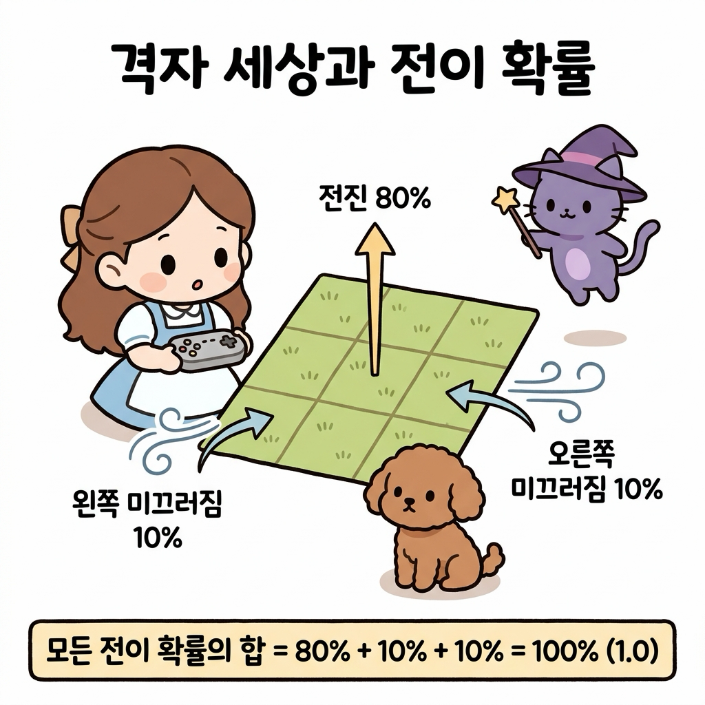
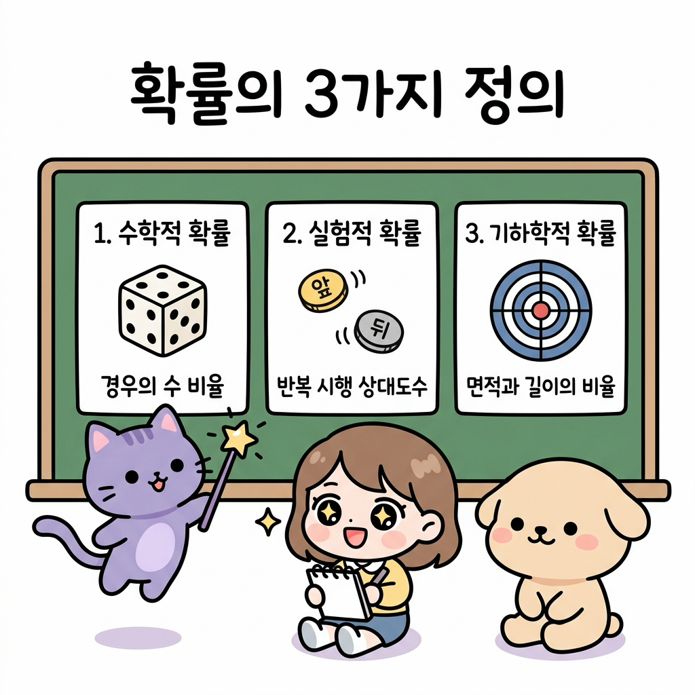
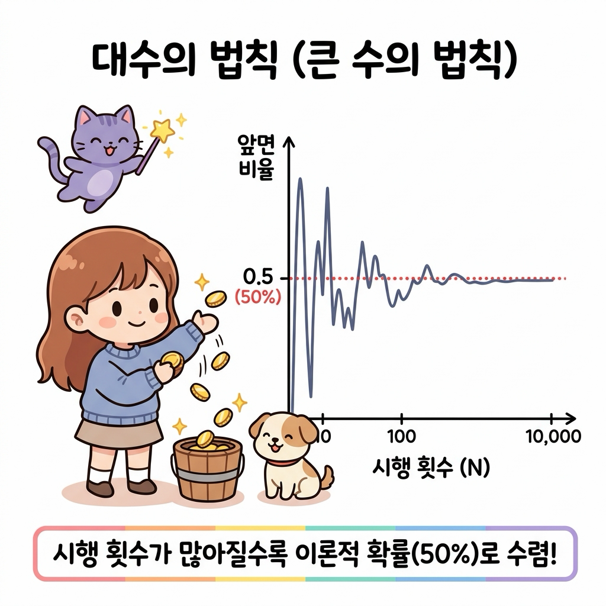
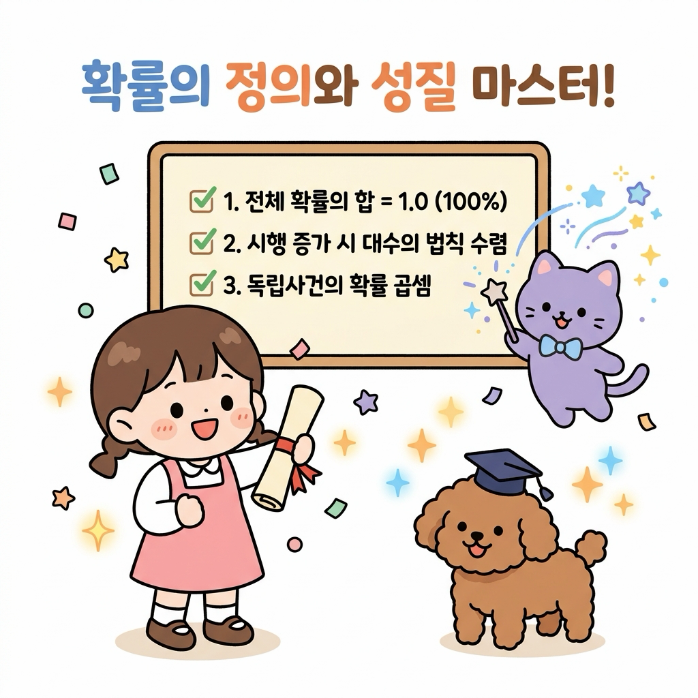

# 02.9 확률의 정의와 성질

> 이 장에서는 **확률의 수학적·실험적·기하학적 정의**와 기본 공리를 학습하고, 시행 횟수가 늘어남에 따라 표본 평균이 참 확률에 수렴하는 **대수의 법칙(큰 수의 법칙)**을 통해 강화학습 전이 확률(Transition Probability)의 수학적 기초를 다집니다.

---

## 02.9.1 확률의 뜻과 상태 전이 확률

확률이란 불확실한 결과를 객관적이고 체계적인 수치로 다루기 위한 수학적 도구입니다.

"지니! 격자 세상(Grid World) 게임판 위에서 캐릭터에게 '위로 전진해!' 하고 명령을 내렸는데, 갑자기 바람이 쌩 불어서 옆 칸으로 미끄러져 버렸어! 내가 원하는 방향으로 갈 확률은 정확히 몇 퍼센트인 거야?"

도로시가 조이패드를 쥔 채 곤란한 표정으로 격자 지도를 바라보며 물었습니다. 토토도 멍멍 짖으며 바람 소리에 맞춰 고개를 갸우뚱거렸습니다. 지니는 요술봉을 휘둘러 허공에 바람의 방향과 전이 확률 지도를 입체로 띄워 주었습니다.

"도로시! 강화학습 환경에서는 행동(Action)을 취했을 때 100% 확정적으로 목표 칸에 도달하지 못하고 외부 요인(바람, 마찰)에 의해 다른 상태로 이탈할 수 있단다. 이때 특정 행동 후 다음 상태에 도달할 가능성을 수치화한 것을 **상태 전이 확률(Transition Probability)**이라고 부르지."


**그림 02-9-1** 격자 세상에서 이동 명령을 내렸을 때 전진 성공(80%)과 좌우 미끄러짐(각 10%)의 전이 확률 시스템을 살펴보는 도로시와 지니, 토토

"아! 전진할 성공 확률이 0.8(80%)이고, 양옆으로 미끄러질 확률이 각각 0.1(10%)씩 배정되어 있구나! 세 숫자를 다 더하면 정확히 1.0(100%)이 되네!"

도로시가 환하게 웃으며 외쳤습니다. 지니가 칠판을 가리키며 덧붙였습니다.

"맞아! 어떤 상태에서 어떤 행동을 하든, 이동 가능한 모든 다음 상태들의 전이 확률을 전부 합산하면 **항상 1.0(100%)**이 되어야 한다는 것이 확률의 가장 중요한 절대 공리란다."

---

### 2.9.1.1 확률의 기본 성질과 콜모고로프 공리계

수학적으로 확률은 전체 표본공간 *S*와 특정 사건 *A*에 대해 다음의 세 가지 기본 성질(공리)을 반드시 만족해야 합니다.

1. **비음수성**: 모든 사건 *A*의 확률은 항상 0 이상 1 이하의 실수이다.
$$
0 \le P(A) \le 1
$$

2. **전체 사건의 확률 (정규화)**: 반드시 일어나는 전사건(표본공간 *S*)의 확률은 1이다.
$$
P(S) = 1
$$

3. **공사건의 확률**: 절대로 일어날 수 없는 사건(공사건 $\emptyset$)의 확률은 0이다.
$$
P(\emptyset) = 0
$$

---

## 02.9.2 확률을 정의하는 세 가지 관점

확률은 문제를 바라보는 대상과 실험 환경에 따라 크게 세 가지 관점으로 정의됩니다.


**그림 02-9-2** 경우의 수 비율로 계산하는 수학적 확률, 반복 실험으로 수렴하는 실험적 확률, 연속 영역의 크기로 구하는 기하학적 확률의 3대 정의를 비교 설명하는 지니와 도로시, 토토

---

### 2.9.2.1 수학적 확률 (고전적 확률)

표본공간 *S*의 각 원소(근원사건)가 일어날 가능성이 모두 동등할 때(Equally likely), 전체 경우의 수 중 사건 *A*가 일어나는 경우의 수의 비율로 정의합니다.

$$
P(A) = \frac{n(A)}{n(S)} = \frac{\text{사건 } A\text{가 일어나는 경우의 수}}{\text{모든 가능한 경우의 수}}
$$

* **대표 예시**: 주사위 1개를 던질 때 소수의 눈(2, 3, 5)이 나올 확률:
$$
P(\text{소수}) = \frac{3}{6} = \frac{1}{2} = 0.5
$$

---

### 2.9.2.2 실험적 확률 (통계적 확률, 경험적 확률)

동일한 조건에서 시행을 *N*번 독립적으로 반복할 때, 사건 *A*가 발생한 횟수를 *r*이라고 하면, 시행 횟수 *N*이 무한히 커짐에 따라 상대도수(*r* / *N*)가 수렴하는 극한값을 뜻합니다.

$$
P(A) = \lim_{N \to \infty} \frac{r}{N}
$$

* **특징**: 주사위의 무게중심이 쏠려 있거나 기상 예측, 강화학습 에이전트의 보상 획득률처럼 이론적 계산이 불가능한 현실 데이터의 확률을 측정할 때 사용합니다.

---

### 2.9.2.3 기하학적 확률 (연속 영역 확률)

경우의 수가 무한히 많은 연속적인 공간(시간, 길이, 면적, 부피)에서 전체 영역 *S*의 크기 대비 사건 *A*에 해당하는 영역의 비율로 확률을 정의합니다.

$$
P(A) = \frac{\text{사건 } A\text{가 차지하는 영역의 크기(넓이)}}{\text{전체 영역 } S\text{의 크기(넓이)}}
$$

* **대표 예시**: 반지름이 2인 원형 과녁에서 반지름이 1인 정중앙 원을 맞힐 확률:
$$
P(\text{정중앙}) = \frac{\pi \times 1^2}{\pi \times 2^2} = \frac{1}{4} = 0.25
$$

---

## 02.9.3 대수의 법칙과 표본공간의 수렴

"지니! 동전을 직접 10번 던져봤는데, 앞면이 7번이나 나왔어! 그럼 내 동전은 앞면이 나올 확률이 70%인 거야?"

도로시가 동전들을 손바닥에 올려놓으며 갸우뚱거렸습니다. 지니는 허공에 꺾은선 그래프를 띄우며 자상하게 설명했습니다.

"던진 횟수가 적을 때는 우연한 편향이나 노이즈 때문에 비율이 요동칠 수 있단다. 하지만 던진 횟수를 1,000번, 10,000번으로 늘려갈수록 상대도수는 이론적인 참 확률(50%)에 완벽하게 수렴하게 되지. 이걸 수학에서는 **대수의 법칙(Law of Large Numbers, 큰 수의 법칙)**이라고 부른단다."


**그림 02-9-3** 동전 던지기 시행 횟수(N)가 적을 때는 확률 변동이 심하나, 횟수가 만 번에 도달할수록 이론적 참 확률(0.5)로 매끄럽게 수렴하는 대수의 법칙 시뮬레이션

$$
\lim_{N \to \infty} \left| \frac{r_N}{N} - p \right| = 0
$$

"와! 시행 횟수를 대규모로 누적하면 참 확률에 도달하는구나! 그래서 강화학습에서도 에이전트가 수만 번의 에피소드를 탐험하며 상태 가치를 참값으로 학습해 나가는 거였어!"

도로시가 눈을 반짝이며 고개를 끄덕였습니다.

---

## 02.9.4 파이썬으로 구현하는 대수의 법칙 시뮬레이터

파이썬의 `random` 모듈을 활용하여 동전을 던지는 시행 횟수(*N*)가 증가함에 따라 앞면이 나올 확률이 이론적 참 확률(0.5)로 수렴하는 과정을 확인합니다.

```python
import random

def simulate_law_of_large_numbers(trials_list):
    print("=== 대수의 법칙 동전 던지기 시뮬레이션 ===")
    random.seed(42)  # 재현성을 위한 시드 고정
    
    for n in trials_list:
        heads_count = 0
        for _ in range(n):
            # 1: 앞면, 0: 뒷면
            if random.randint(0, 1) == 1:
                heads_count += 1
                
        relative_frequency = heads_count / n
        error = abs(relative_frequency - 0.5)
        print(f"시행 횟수 N = {n:7,d} | 앞면 횟수 = {heads_count:7,d} | "
              f"상대도수 = {relative_frequency:.5f} | 오차 = {error:.5f}")

# 시행 횟수를 10회부터 1,000,000회까지 기하급수적으로 증가
trials = [10, 50, 100, 500, 1000, 10000, 100000, 1000000]
simulate_law_of_large_numbers(trials)
```

```text
[실행 결과]
=== 대수의 법칙 동전 던지기 시뮬레이션 ===
시행 횟수 N =      10 | 앞면 횟수 =       7 | 상대도수 = 0.70000 | 오차 = 0.20000
시행 횟수 N =      50 | 앞면 횟수 =      29 | 상대도수 = 0.58000 | 오차 = 0.08000
시행 횟수 N =     100 | 앞면 횟수 =      49 | 상대도수 = 0.49000 | 오차 = 0.01000
시행 횟수 N =     500 | 앞면 횟수 =     248 | 상대도수 = 0.49600 | 오차 = 0.00400
시행 횟수 N =   1,000 | 앞면 횟수 =     515 | 상대도수 = 0.51500 | 오차 = 0.01500
시행 횟수 N =  10,000 | 앞면 횟수 =   5,023 | 상대도수 = 0.50230 | 오차 = 0.00230
시행 횟수 N = 100,000 | 앞면 횟수 =  49,944 | 상대도수 = 0.49944 | 오차 = 0.00056
시행 횟수 N = 1,000,000 | 앞면 횟수 = 500,317 | 상대도수 = 0.50032 | 오차 = 0.00032
```

> **💡 코드 해석**: 시행 횟수 *N* = 10일 때는 상대도수가 0.70(오차 0.20)으로 요동치지만, *N*이 1,000,000회에 도달하면 상대도수가 0.50032로 이론적 확률 0.5와의 오차가 0.00032 수준으로 급격히 줄어드는 것을 확인할 수 있습니다.

---

## 02.9.5 실전 예제

### 2.9.5.1 문제 1 (독립사건과 확률의 곱셈)

> 서로 다른 두 개의 주사위(빨간색, 파란색)를 동시에 던질 때, 두 주사위의 눈이 모두 4 이하가 나올 확률을 구하시오.
>
> **풀이**:
> 1. 빨간색 주사위에서 4 이하의 눈(1, 2, 3, 4)이 나올 사건을 *A*라 하면:
$$
P(A) = \frac{4}{6} = \frac{2}{3}
$$
> 2. 파란색 주사위에서 4 이하의 눈이 나올 사건을 *B*라 하면:
$$
P(B) = \frac{4}{6} = \frac{2}{3}
$$
> 3. 두 주사위는 서로 영향을 주지 않는 독립사건이므로 곱셈정리를 적용합니다:
$$
P(A \cap B) = P(A) \times P(B) = \frac{2}{3} \times \frac{2}{3} = \frac{4}{9} \approx 0.4444\ (44.4\%)
$$
>
> **정답**: 4 / 9 (약 44.4%)

---

### 2.9.5.2 문제 2 (기하학적 확률과 강화학습 탐색 영역)

> 한 변의 길이가 10인 정사각형 모험 지도 구역에서, 중심에 위치한 가로 4, 세로 4인 정사각형 '보물 상자 구역'에 에이전트가 무작위로 착지할 확률을 구하시오.
>
> **풀이**:
> 1. 전체 지도 영역 *S*의 넓이:
$$
\text{Area}(S) = 10 \times 10 = 100
$$
> 2. 보물 상자 구역 *A*의 넓이:
$$
\text{Area}(A) = 4 \times 4 = 16
$$
> 3. 기하학적 확률 공식에 따라 전체 면적 대비 목표 면적의 비율을 계산합니다:
$$
P(A) = \frac{\text{Area}(A)}{\text{Area}(S)} = \frac{16}{100} = 0.16\ (16\%)
$$
>
> **정답**: 16% (0.16)

---

## 02.9.6 핵심 요약


**그림 02-9-4** 전체 확률의 합 1.0 공리, 대수의 법칙에 의한 참값 수렴, 독립사건의 곱셈 등 확률의 기본기를 마스터한 도로시와 지니, 토토

1. **확률의 공리**: 모든 확률값은 0 이상 1 이하이며($0 \le P(A) \le 1$), 이동 가능한 모든 다음 상태 전이 확률의 총합은 항상 **1.0(100%)**이다.
2. **확률의 3대 정의**: 표본공간의 원소 비율로 구하는 **수학적 확률**, 반복 시행의 극한으로 얻는 **실험적 확률**, 연속 공간의 면적비로 구하는 **기하학적 확률**이 있다.
3. **대수의 법칙(LLN)**: 시행 횟수 *N*이 커질수록 표본 상대도수는 이론적 참 확률에 반드시 수렴한다.
4. **독립사건의 곱셈**: 서로 영향을 미치지 않는 독립사건들이 동시에 발생할 확률은 각 확률의 단순 곱($P(A \cap B) = P(A) \times P(B)$)으로 계산한다.
