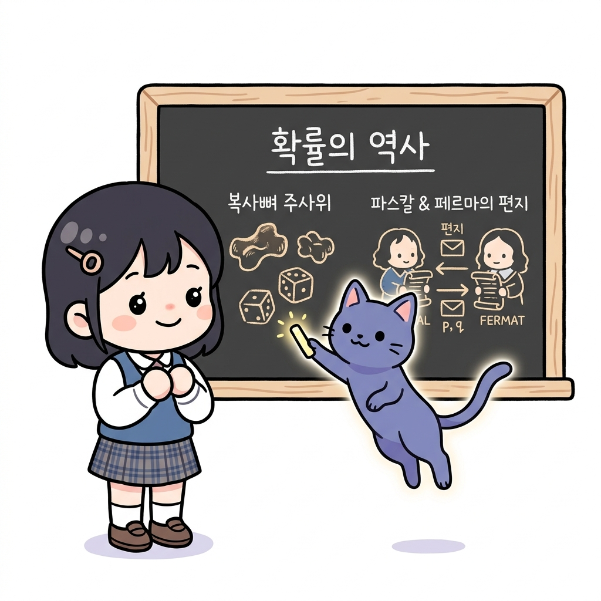
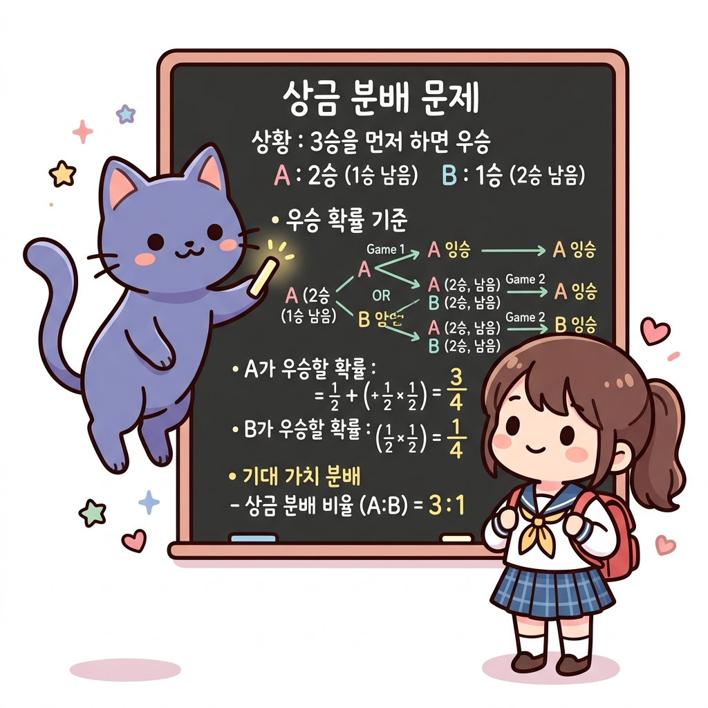
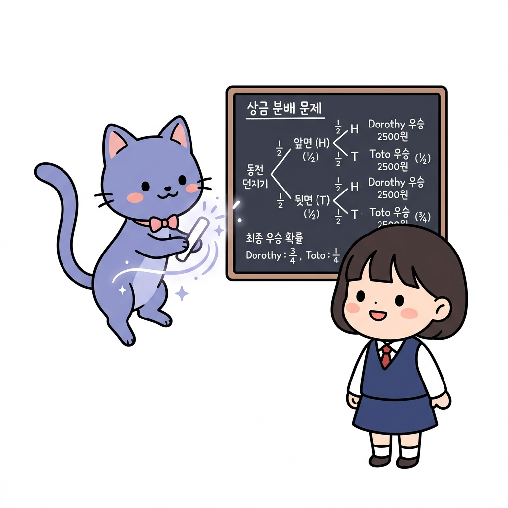
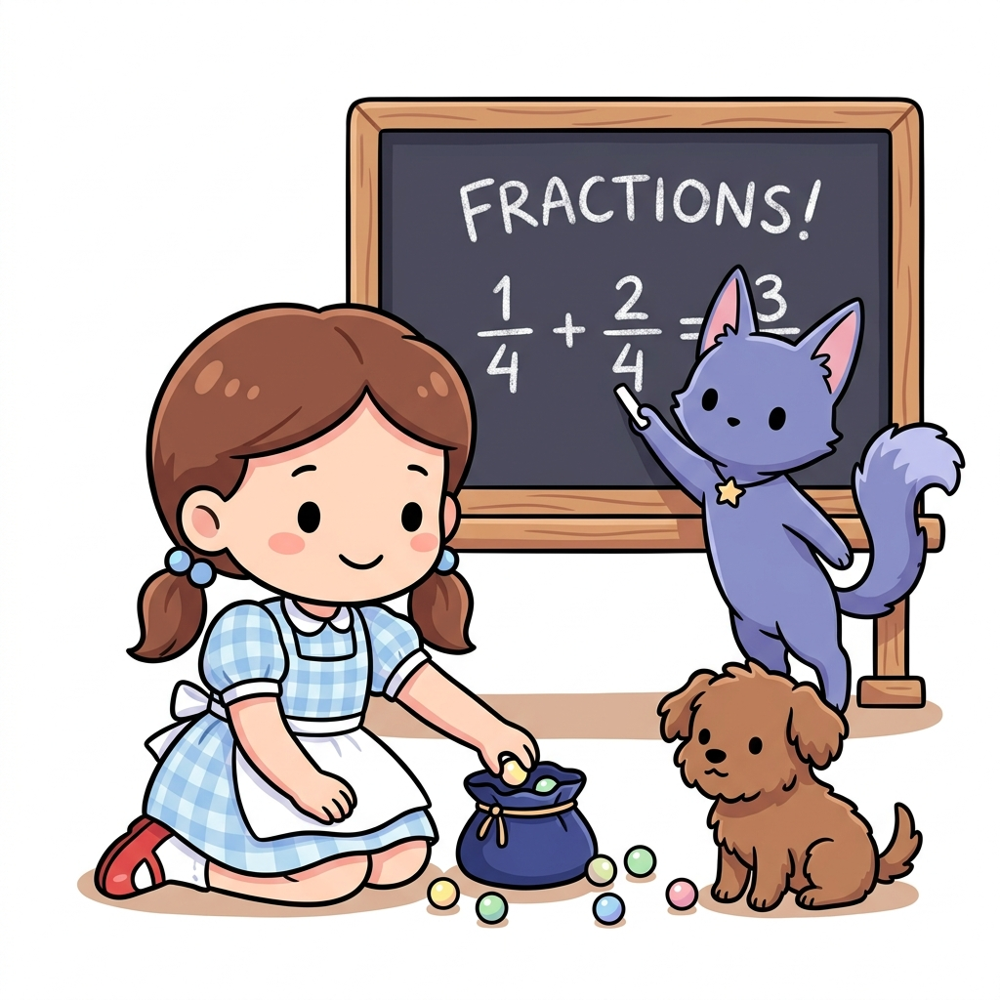
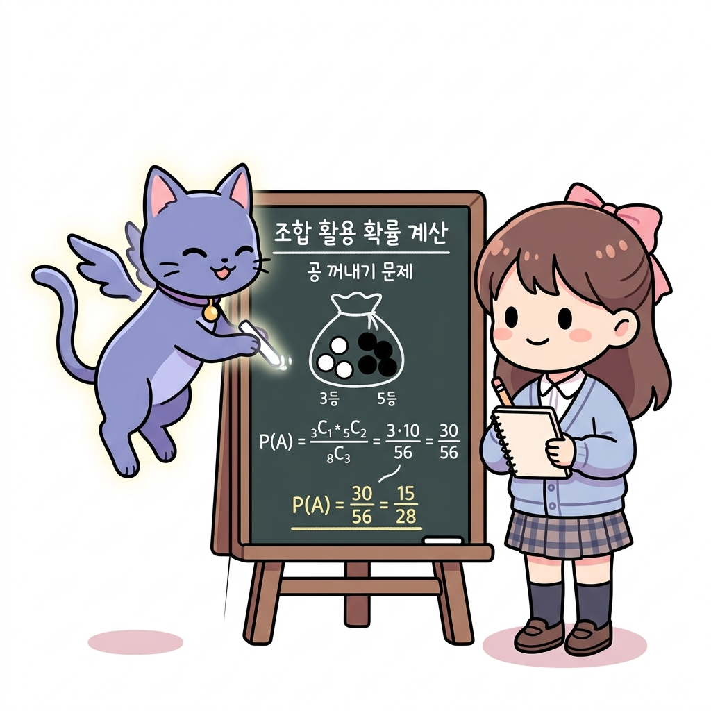
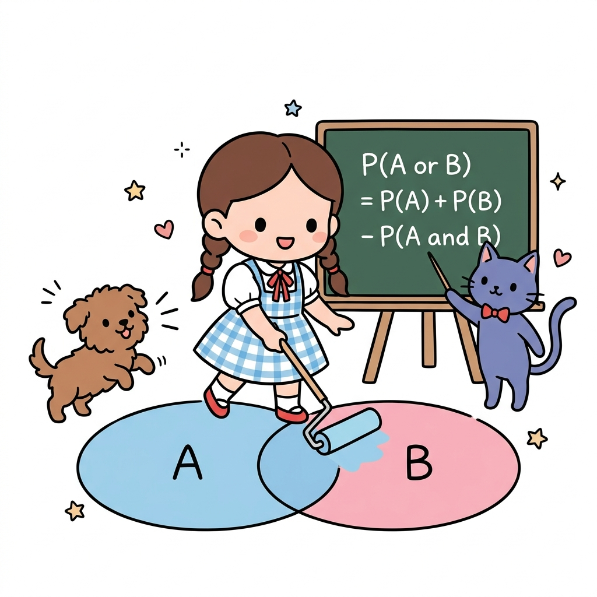
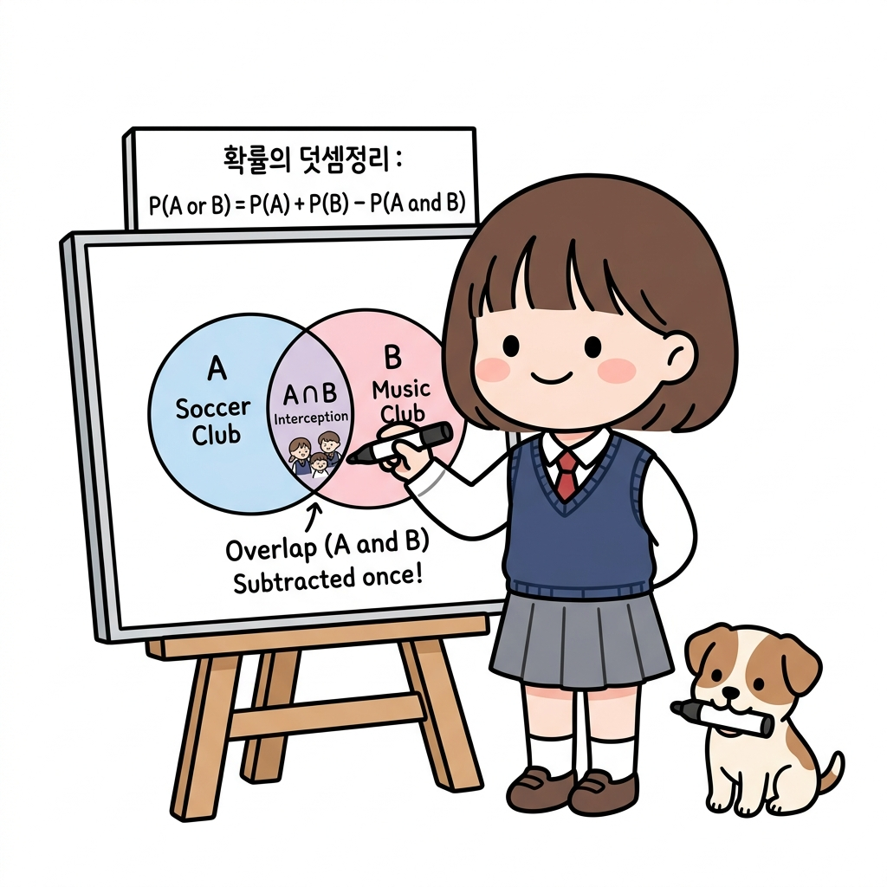
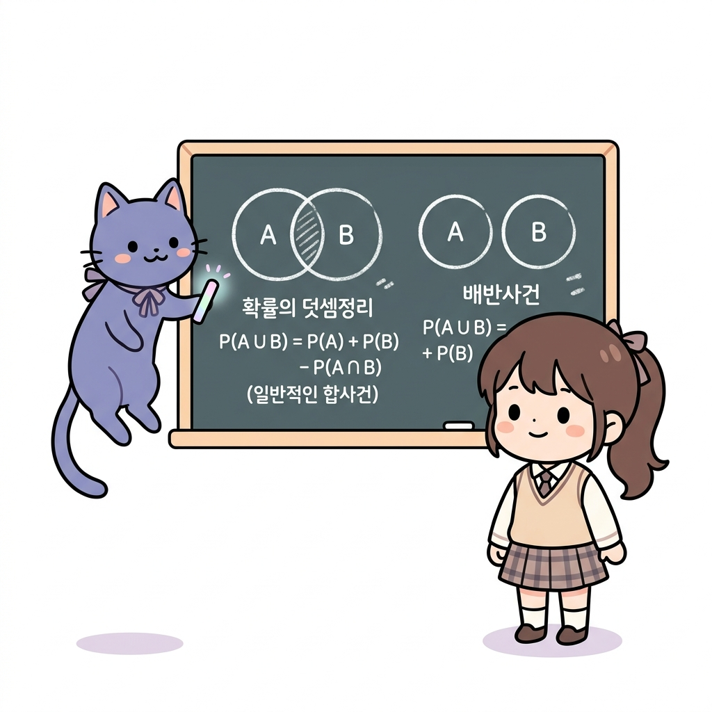

# 02.10 확률의 역사와 덧셈정리 (조합 활용 확률 계산)

> 이 장에서는 **확률의 역사와 덧셈정리 (조합 활용 확률 계산)**에 관한 기초부터 심화 개념들을 유기적으로 결합하여 학습합니다.

---

## 02.10.1 확률의 역사와 상금 분배 문제

**그림 02-10-1** 중단된 보물 상자 게임의 남은 기대 점수에 맞춰 금화를 공정하게 분배하는 법을 강의해주는 지니와 도로시

수학의 오랜 난제였던 **상금 분배 문제(Problem of Points)**와 확률 이론의 역사적 태동을 알아봅니다. 게임이 도중에 중단되었을 때, 지금까지의 점수가 아닌 '앞으로 이길 기댓값'에 비례하여 금화를 공평하게 나누는 파스칼과 페르마의 명쾌한 해법을 도로시의 보물상자 분배장과 함께 배워봅시다!

---

### 1. 학습 목표
- 확률 이론의 태동과 역사적 배경을 파악한다.
- 파스칼과 페르마가 고민했던 '상금 분배 문제'를 이해하고 설명할 수 있다.
- 기대값과 중단된 게임에서의 공정한 상금 분배 확률을 계산할 수 있다.

---

### 2. 핵심 개념

#### (1) 확률의 태동과 역사
- **신탁의 도구**: 고대인들은 동물의 복사뼈나 주사위를 던져 신의 뜻을 묻는 데 사용하였습니다.
- **도박과 확률**: 17세기 유럽에서 도박 문제(특히 중단된 게임의 상금을 어떻게 공정하게 나눌 것인가)를 해결하는 과정에서 현대 확률론이 정립되기 시작했습니다.
- **파스칼과 페르마**: 1654년, 프랑스의 수학자 블레즈 파스칼과 피에르 드 페르마는 편지를 주고받으며 상금 분배 문제를 명쾌하게 풀어냈으며, 이것이 확률론의 시초가 되었습니다.

**그림 02-10-2** 고대 복사뼈 주사위 던지기부터 파스칼과 페르마의 편지를 거쳐 정립된 확률의 발전 역사

#### (2) 분배 문제 (Problem of Points)
- **개념**: 실력이 비슷한 두 사람 *A*, *B*가 게임을 하여 먼저 특정 횟수(예: 3승)를 이기는 사람이 상금을 전부 갖기로 했습니다. 그런데 게임이 도중에 중단되었을 때, 지금까지의 전적을 바탕으로 상금을 어떻게 나누는 것이 가장 공평할까요?
- **공정한 분배 기준**: 단순히 지금까지 이긴 횟수의 비율로 나누는 것은 공정하지 않습니다. **"만약 게임을 계속했다면 각자가 최종 우승할 확률"**의 비율로 나누는 것이 공정합니다.

**그림 02-10-3** 중단된 경기에서 미래의 기대 우승 확률에 근거하여 공평하게 상금을 분배하는 수학적 원리

**그림 02-10-4** 중단 시점의 전적에 의존하지 않고 미래의 기대 가치를 기반으로 공평하게 상금을 분배하는 원리

* 야외에서 한창 진행 중이던 게임이 비로 인해 갑자기 중단되었을 때, 지금까지 획득한 점수의 비로 상금을 단순 배분하는 것은 공정하지 못합니다. 카드라노 선생님이 보여주는 공식처럼, 게임을 지속했을 때 남은 게임에서 각 플레이어가 승리하여 최종 우승에 도달할 **수학적 확률**을 계산해 그 비율만큼 나누어야 정의롭습니다.

---

### 3. 시각 자료: 상금 분배 문제 트리 다이어그램

**그림 02-10-5** 3판 2선승제 게임이 중단되었을 때, 남은 판들의 가상 전개를 트리로 나타낸 확률 가치 분배도

---

### 4. 실전 예제

#### 예제 1 (상금 분배 문제 계산)
> **문제**: 도로시와 토토가 먼저 3번 이기는 사람이 상금 100만 원을 모두 가지는 게임을 하고 있었습니다. 실력이 동등한 상황(매 게임 이길 확률이 각각 1/2)에서 현재 도로시는 2승, 토토는 1승을 거두었습니다. 이 시점에서 게임이 중단되었다면 상금을 각각 어떻게 나누어야 공평할까요?
>
> **풀이**:
> 게임이 계속 진행되었을 때 각각 최종 우승할 확률을 구합니다.
> - 도로시가 우승하려면 1승이 더 필요합니다.
> - 토토가 우승하려면 2승이 더 필요합니다.
>
> **1. 토토가 우승할 확률 *P*(토토)**:
> 토토가 우승하려면 다음 2번의 게임을 연속으로 이겨야 합니다. 두 게임은 독립시행이므로:
> *P*(토토) = 1/2 × 1/2 = 1/4
>
> **2. 도로시가 우승할 확률 *P*(도로시)**:
> 여사건의 확률을 활용하여 쉽게 구할 수 있습니다.
> *P*(도로시) = 1 - *P*(토토) = 1 - 1/4 = 3/4
>
> **3. 상금의 공정한 분배**:
> 우승 확률의 비인 *P*(도로시) : *P*(토토) = 3/4 : 1/4 = 3 : 1로 상금을 배분합니다.
> - 도로시의 몫: 100만 원 × 3/4 = 75만 원
> - 토토의 몫: 100만 원 × 1/4 = 25만 원
>
> **정답**: 도로시 75만 원, 토토 25만 원

---

### 5. 핵심 요약
1. **상금 분배 문제**는 게임이 중단되었을 때, 게임을 계속 진행했다면 각각 최종 우승했을 확률을 구해 그 비율대로 상금을 나누는 문제이다.
2. 각 사건이 독립적일 때, 미래에 연이어 발생할 최종 우승 확률은 **확률의 곱셈**과 **여사건의 확률**을 연립하여 해결한다.
3. 이 분배 문제는 기대값의 원형이 되었으며, 현대 금융 및 의사결정 이론(의사결정 트리)의 시초가 되었다.

---

## 02.10.2 조합을 이용한 확률 계산

**그림 02-10-6** 구슬 주머니에서 무작위로 여러 구슬을 꺼낼 때 조합 공식과 분수로 정확한 확률을 계산해주는 지니와 도로시

주머니에서 여러 개의 바둑돌이나 구슬을 한꺼번에 꺼낼 때의 확률처럼, 실제 강화학습에서도 복잡하게 얽힌 상태 전이 확률을 정확히 구해내기 위해 **조합(*n**C**r*)을 이용한 확률 계산법**이 자주 사용됩니다. 구슬 주머니를 털어 수학 공식을 칠판에 적어내는 도로시와 지니의 조언을 통해 조합 기반 확률 계산을 정교하게 훈련해봅시다!

---

### 1. 학습 목표
- 확률의 기호적 표시법(*P*(*A*))과 여사건의 확률(*P*(*A**c*) = 1 - *P*(*A*))을 능숙하게 사용한다.
- 조합(*n**C**r*) 기호를 이용하여 복잡한 수학적 확률을 정확히 계산한다.
- 직관적인 판단이 실질적인 확률 계산과 어떻게 다를 수 있는지 설명할 수 있다.

---

### 2. 핵심 개념

#### (1) 확률의 기호적 표현과 성질
어떤 시행에서 사건 *A*가 일어날 확률을 ***P*(*A*)**로 나타냅니다. (Probability의 앞 글자 *P*에서 따옴)
- 사건 *A*가 일어나지 않을 사건(여사건)은 *A**c*로 표시하며, 그 확률은 다음과 같습니다.
  *P*(*A**c*) = 1 - *P*(*A*)
- 이 성질을 활용하면 '적어도 한 번 ~일 확률'처럼 직접 계산하기 복잡한 문제 상황을 간단히 풀 수 있습니다.

#### (2) 조합을 이용한 확률의 정의
표본공간 *S*의 원소의 개수가 *n*(*S*), 사건 *A*의 원소의 개수가 *n*(*A*)일 때, 조합을 이용해 각 경우의 수를 구하여 다음과 같이 확률을 정의하고 계산합니다.
*P*(*A*) = *n*(*A*) / *n*(*S*) = 사건 *A*가 일어나는 조합의 수 / 전체 선택의 조합의 수

**그림 02-10-7** 구슬 상자에서 동시에 공 여러 개를 꺼내는 경우의 조합 확률 연산 사례

* 흰 공 3개와 검은 공 5개가 들어 있는 주머니에서 동시에 3개의 공을 꺼낼 때, 흰 공 1개와 검은 공 2개가 나올 확률을 계산해 봅시다. 
  - 분모(전체 경우의 수)는 전체 8개 중 3개를 선택하는 조합인 8*C*3 = 56가지입니다.
  - 분자(사건 경우의 수)는 흰 공 3개 중 1개를 고르는 조합 3*C*1 = 3가지와, 검은 공 5개 중 2개를 고르는 조합 5*C*2 = 10가지를 곱한 3 × 10 = 30가지입니다.
  - 따라서 최종 확률은 (3*C*1 × 5*C*2) / 8*C*3 = 30 / 56 = 15 / 28가 됩니다.

---

### 3. 시각 자료: 조합과 여사건을 이용한 확률 계산

**그림 02-10-8** 구슬 주머니에서 동시에 여러 구슬을 임의 선택할 때 발생하는 분모/분자 조합 가짓수 관계도

---

### 4. 실전 예제

#### 예제 1 (주머니에서 공 꺼내기)
> **문제**: 주머니 속에 공 4개가 들어 있습니다. 이 중 1개의 공에만 '꽝'이 적혀 있습니다. 주머니에서 동시에 2개의 공을 꺼낼 때, '꽝'이 아닌 공만 2개 꺼낼 확률을 구하세요.
>
> **풀이**:
> - 전체 경우의 수 (분모): 공 4개 중 2개를 동시에 꺼내는 조합
>   *n*(*S*) = 4*C*2 = (4 × 3) / (2 × 1) = 6가지
> - 꽝이 아닌 공만 2개 꺼내는 경우의 수 (분자): 꽝이 아닌 공 3개 중 2개를 꺼내는 조합
>   *n*(*A*) = 3*C*2 = 3*C*1 = 3가지
> - 따라서 구하고자 하는 확률 *P*(*A*)는:
>   *P*(*A*) = *n*(*A*) / *n*(*S*) = 3 / 6 = 1 / 2
> **정답**: 1 / 2 (50%)

#### 예제 2 (당첨 음료수 문제 - 직관의 파괴)
> **문제**: 음료수 10병이 들어 있는 한 상자 속에 '한 병 더'(당첨) 음료수가 2병 섞여 있습니다. 이 상자에서 임의로 3병의 음료수를 살 때, 당첨 음료수를 적어도 1병 이상 구매하게 될 확률을 구하세요.
>
> **풀이**:
> '적어도 1병 이상 당첨 음료수를 구매할 사건'을 *X*라 하면, 그 여사건 *X**c*는 '구매한 3병 모두 꽝(당첨이 아님)일 사건'입니다.
>
> 1. 모든 경우의 수 (분모): 10병 중 3병을 고르는 조합
>    *n*(*S*) = 10*C*3 = (10 × 9 × 8) / (3 × 2 × 1) = 120가지
> 2. 모두 꽝인 병만 뽑는 경우의 수 (분자): 꽝인 병 8병(10 - 2) 중 3병을 고르는 조합
>    *n*(*X**c*) = 8*C*3 = (8 × 7 × 6) / (3 × 2 × 1) = 56가지
> 3. 여사건의 확률 *P*(*X**c*) 계산:
>    *P*(*X**c*) = 56 / 120 = 7 / 15
> 4. 본 사건의 확률 *P*(*X*) 계산:
>    *P*(*X*) = 1 - *P*(*X**c*) = 1 - 7 / 15 = 8 / 15 ≈ 53.3%
>
> **결론**: 전체 10병 중 당첨이 2병(20%)밖에 안 되지만, 3병을 고를 때 적어도 1병 당첨될 확률은 절반이 넘는 53.3%나 됩니다.
> **정답**: 8 / 15

---

### 5. 핵심 요약
1. ***P*(*A*)**는 사건 *A*가 일어날 확률을 의미한다.
2. '적어도 ~일 확률'을 구할 때는 전체 확률 1에서 반대 사건의 확률을 빼는 **여사건의 확률 (1 - *P*(*A**c*))**을 적용하는 것이 훨씬 간편하다.
3. 확률은 직관(20% 당첨이니 3개 사도 낮겠지 하는 생각 등)과 실제 계산 결과가 매우 다를 수 있으므로 반드시 **조합(*n**C**r*)** 등의 도구로 정확히 수치화해야 한다.

---

## 02.10.3 확률의 덧셈정리

**그림 02-10-9** 두 겹쳐진 원형 융단 위를 페인트 롤러로 칠하며 덧셈공식에서 중복 부위를 삭감하는 과정을 판서해주는 지니와 도로시

두 사건 중 하나가 터질 확률인 합사건의 확률 *P*(*A* ∪ *B*)를 정확히 합산해내는 **확률의 덧셈정리**를 공부합니다. 겹쳐진 두 웅덩이 영역을 롤러로 덧칠할 때 두 번 칠해진 중복 교집합(*P*(*A* ∩ *B*))을 콕 빼주는 도로시와 지니의 미술 시간 비유를 따라 직관적이고 경쾌하게 이해해봅시다!

---

### 1. 학습 목표
- 합사건의 확률을 구하는 기본 원리인 **확률의 덧셈정리**를 이해한다.
- 배반사건인 경우와 배반사건이 아닌 경우를 구분하여 각각의 공식에 맞추어 해결할 수 있다.
- 하나의 확률 문제를 여사건을 이용한 방법과 덧셈정리를 이용한 방법 두 가지로 유연하게 해결한다.

---

### 2. 핵심 개념

#### (1) 확률의 덧셈정리 (Addition Theorem of Probability)
임의의 두 사건 *A*, *B*에 대하여 사건 *A* 또는 사건 *B*가 일어날 확률 *P*(*A* ∪ *B*)는 다음과 같습니다.
*P*(*A* ∪ *B*) = *P*(*A*) + *P*(*B*) - *P*(*A* ∩ *B*)
- *원리*: 경우의 수 합의 법칙 *n*(*A* ∪ *B*) = *n*(*A*) + *n*(*B*) - *n*(*A* ∩ *B*)의 양변을 표본공간의 크기 *n*(*S*)로 나누어 유도됩니다.

**그림 02-10-10** 축구 동아리 A와 농구 동아리 B의 합산 가입 인원 산정 시 중복 교집합 인원을 차감하는 구조

* 학교 축구 동아리(*A*)와 농구 동아리(*B*) 명단을 조사했더니, 두 동아리 전체 학생의 가짓수를 구할 때 각각의 가짓수를 단순히 더하기만 하면 두 동아리에 모두 가입해 있는 학생들(*A* ∩ *B*)이 중복 계산(더블 카운팅)됩니다. 따라서 전체 가짓수를 구할 때는 반드시 중복 가입자(*A* ∩ *B*)의 수를 한번 차감해 주어야 정확한 수치가 됩니다.

#### (2) 배반사건일 때의 덧셈정리
두 사건 *A*, *B*가 동시에 일어날 수 없는 배반사건일 때(즉, *A* ∩ *B* = ∅ 이므로 *P*(*A* ∩ *B*) = 0), 공식은 다음과 같이 단순화됩니다.
*P*(*A* ∪ *B*) = *P*(*A*) + *P*(*B*)

---

### 3. 시각 자료: 일반 사건과 배반사건의 덧셈정리 벤 다이어그램

**그림 02-10-11** 교집합이 존재하는 일반적인 합사건(중복 차감 필요)과 교집합이 없는 배반사건의 덧셈정리 비교 도식

---

### 4. 실전 예제

#### 예제 1 (주사위 던지기)
> **문제**: 한 개의 주사위를 던질 때, 짝수의 눈 또는 3의 배수의 눈이 나올 확률을 구하세요.
>
> **풀이**:
> - 홀수/짝수 및 배수 사건을 다음과 같이 정의합니다.
>   - 사건 *A*: 짝수 눈이 나오는 사건 ➔ *A* = {2, 4, 6} 이므로 *P*(*A*) = 3 / 6 = 1 / 2
>   - 사건 *B*: 3의 배수 눈이 나오는 사건 ➔ *B* = {3, 6} 이므로 *P*(*B*) = 2 / 6 = 1 / 3
> - 사건 *A*와 *B*의 교집합(곱사건): *A* ∩ *B* = {6} 이므로 *P*(*A* ∩ *B*) = 1 / 6
>
> 두 사건이 배반사건이 아니므로 확률의 덧셈정리를 사용합니다.
> *P*(*A* ∪ *B*) = *P*(*A*) + *P*(*B*) - *P*(*A* ∩ *B*) = 3 / 6 + 2 / 6 - 1 / 6 = 4 / 6 = 2 / 3
> **정답**: 2 / 3

#### 예제 2 (음료수 당첨 확률 - 덧셈정리로 직접 구하기)
> **문제**: 당첨 음료수 2병과 꽝 음료수 8병이 섞인 상자에서 임의로 3병을 고를 때, 적어도 1병 이상 당첨될 확률을 확률의 덧셈정리를 이용하여 구하세요.
>
> **풀이**:
> 적어도 1병 이상 당첨되는 사건 *X*는 다음 두 사건의 합사건입니다.
> - 사건 *A*: 당첨 1병, 꽝 2병을 꺼내는 사건 ➔ *n*(*A*) = 2*C*1 × 8*C*2 = 2 × 28 = 56가지
>   *P*(*A*) = 56 / 10*C*3 = 56 / 120 = 7 / 15
> - 사건 *B*: 당첨 2병, 꽝 1병을 꺼내는 사건 ➔ *n*(*B*) = 2*C*2 × 8*C*1 = 1 × 8 = 8가지
>   *P*(*B*) = 8 / 10*C*3 = 8 / 120 = 1 / 15
>
> 꺼낸 3병 중에서 당첨 음료수가 1병이면서 동시에 2병일 수는 없으므로, 두 사건 *A*와 *B*는 **배반사건**입니다.
> *P*(*X*) = *P*(*A* ∪ *B*) = *P*(*A*) + *P*(*B*) = 7 / 15 + 1 / 15 = 8 / 15
> **정답**: 8 / 15 (여사건으로 계산한 결과 1 - 8*C*3 / 10*C*3 = 8 / 15와 동일함)

---

### 5. 핵심 요약
1. 두 사건 *A*, *B*가 동시에 일어날 가능성이 있다면 중복 계산을 피하기 위해 반드시 ***P*(*A* ∩ *B*)**를 빼주어야 한다.
2. 두 사건이 **배반사건**이라면 동시 발생 확률이 0이므로 단순히 두 확률을 합한다: ***P*(*A*) + *P*(*B*)**.
3. 확률을 풀 때, 여사건으로 푸는 방법과 배반사건의 덧셈정리로 나누어 푸는 방법 둘 다 활용하여 교차 검증할 수 있다.
