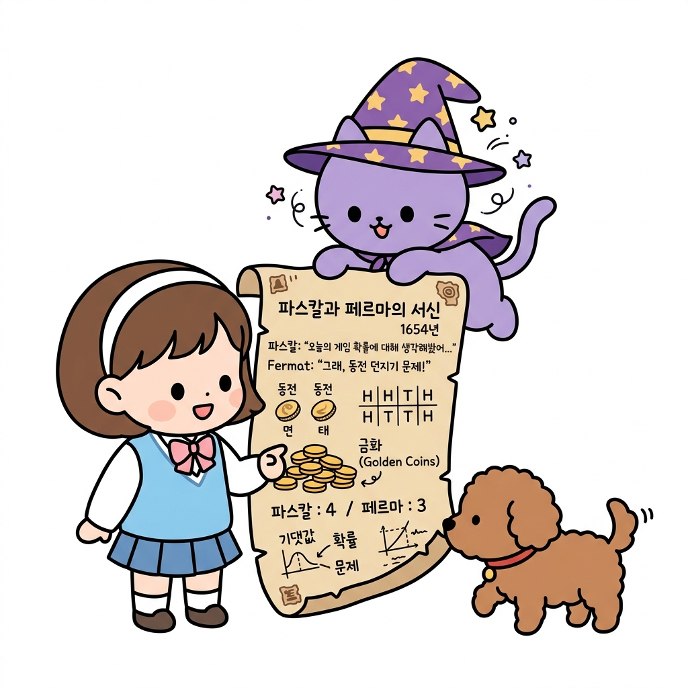
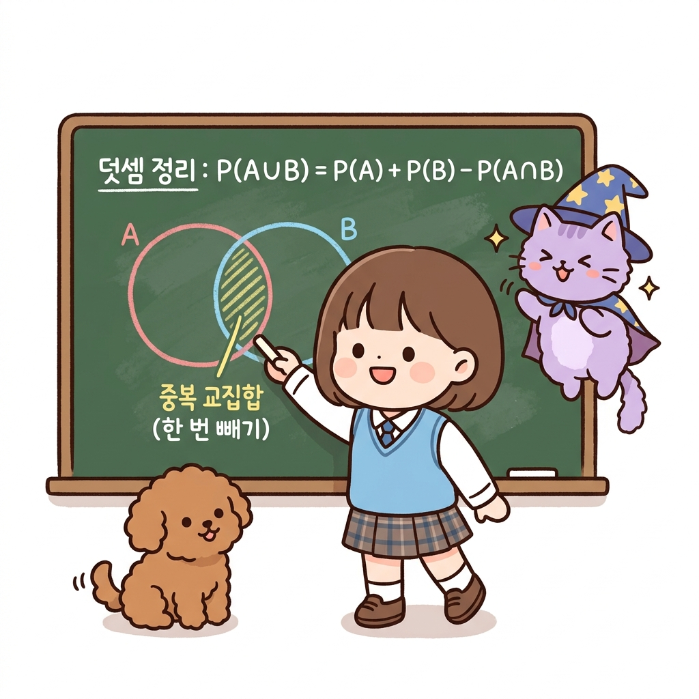
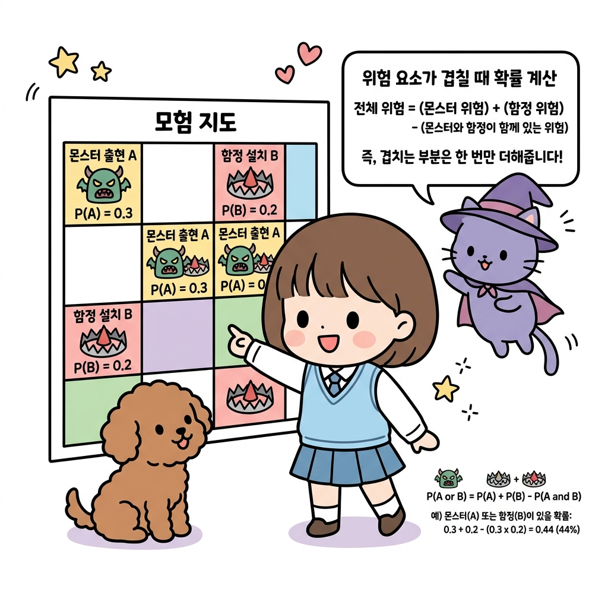

# 02.10 확률의 역사와 덧셈정리

> 이 장에서는 **확률의 역사와 덧셈정리 (조합 활용 확률 계산)**에 관한 기초부터 심화 개념들을 유기적으로 결합하여 학습합니다.

---

## 02.10.1 확률의 역사와 상금 분배 문제

수학의 오랜 난제였던 **상금 분배 문제(Problem of Points)**와 확률 이론의 역사적 태동을 알아봅니다.

"지니! 토토랑 내가 먼저 3판을 이기면 금화 주머니를 전부 갖기로 게임을 하고 있었거든? 그런데 갑자기 소나기가 내려서 게임을 중단해야 해. 현재 전적은 내가 2승, 토토가 1승이야. 이 상태에서 금화를 어떻게 나누어야 서로 불만 없이 가장 공평하게 나눌 수 있을까?"

도로시가 주머니 속 금화들을 세며 걱정스러운 눈빛으로 물었습니다. 토토는 자기도 많이 이기고 싶었는지 멍멍 소리를 내며 도로시 곁에 앉았습니다. 지니가 깃털 펜과 오래된 편지 한 장을 흔들어 보였습니다.

"도로시! 그건 아주 유명한 역사적인 질문이야. 1654년 도박사들이 고민하던 **'상금 분배 문제'**라는 것인데, 천재 수학자 파스칼과 페르마가 편지를 주고받으며 멋지게 풀어냈단다. 바로 이 질문이 현대 확률론의 진정한 시작점이 되었지!"

**그림 02-10-1** 게임이 중단되었을 때, 지금까지의 승수 비율이 아닌 '미래에 우승하게 될 기대 가치(확률)'를 근거로 상금을 공평하게 배분해야 함을 설명하는 지니와 도로시, 토토

"단순히 2승 대 1승이니까 금화를 2:1로 나누면 안 돼?"

"안 된단다! 만약 게임을 계속했다면 도로시가 최종 우승할 확률과 토토가 최종 우승할 확률의 **'기대 가치'** 비율대로 나누어야 정의롭지."

---

### 1. 학습 목표
- 확률 이론의 태동과 역사적 배경을 파악한다.
- 파스칼과 페르마가 고민했던 '상금 분배 문제'를 이해하고 설명할 수 있다.
- 기댓값과 중단된 게임에서의 공정한 상금 분배 확률을 계산할 수 있다.

---

### 2. 핵심 개념

#### (1) 상금 분배 문제의 확률적 풀이
* **도로시가 우승할 확률**: 도로시는 앞으로 1승만 더 하면 됩니다.
* **토토가 우승할 확률**: 토토는 앞으로 연이어 2승을 거두어야 합니다.
  * 토토가 우승할 확률 = 1/2 × 1/2 = 1/4 (25%)
  * 도로시가 우승할 확률 = 1 - 1/4 = 3/4 (75%)

"아! 내가 이길 확률이 75%이고 토토가 이길 확률이 25%니까, 금화 비율을 3:1로 나누는 게 공정하구나!"

도로시가 고개를 끄덕였습니다. 이처럼 미래에 얻을 가치(상태 가치와 정책의 가치 기댓값)를 바탕으로 현재의 판단을 세우는 원리가 강화학습 가치 평가의 기초가 됩니다.

---

## 02.10.2 조합을 이용한 확률 계산

주머니에서 여러 개의 구슬을 꺼낼 때의 확률처럼, 전체 경우의 수와 특정 사건의 경우의 수를 **조합(*n**C**r*)**을 사용해 세어 확률을 구하는 방법입니다.

* **조합 확률 계산식**:
  *P*(*A*) = *n*(*A*) / *n*(*S*) = 사건 *A*가 일어나는 조합의 수 / 전체 선택의 조합의 수
  * *예*: 흰 공 3개와 검은 공 5개가 든 주머니에서 공 3개를 동시에 꺼낼 때, 흰 공 1개와 검은 공 2개가 나올 확률은?
    * 분모 (전체 조합) = 8*C*3 = 56가지
    * 분자 (흰 공 1개, 검은 공 2개 조합) = 3*C*1 × 5*C*2 = 3 × 10 = 30가지
    * 최종 확률 = 30 / 56 = 15 / 28

---

## 02.10.3 확률의 덧셈정리

합사건(사건 *A* 또는 사건 *B*가 일어날 사건)의 확률을 정확히 더해 나가는 성질입니다.

"지니! 만약 모험 지도에서 몬스터가 출현할 칸의 확률과 함정이 설치될 칸의 확률을 한꺼번에 고려해서 전체 위험도를 계산하고 싶어. 두 확률을 그냥 단순히 더하기만 하면 돼?"

도로시가 지도판을 가리키며 묻자, 지니가 칠판에 두 개의 겹쳐진 동그라미를 그렸습니다.

"조심해야 해! 몬스터와 함정이 동시에 존재하는 겹친 칸이 있다면, 단순 덧셈은 그 칸을 두 번 계산하게(더블 카운팅) 된단다. 그래서 겹쳐진 중복 영역을 반드시 한 번 빼주어야 정확한 덧셈정리가 완성되지."

**그림 02-10-2** 두 합집합 영역을 계산할 때 중복으로 들어가는 교집합(겹친 부위)을 한 번 삭감해내는 확률의 덧셈정리 공식을 설명하는 도로시와 지니

* **확률의 덧셈정리 공식**:
  **_P(A ∪ B) = P(A) + P(B) - P(A ∩ B)_**
* **배반사건일 때 (겹치지 않을 때)**:
  동시에 일어날 수 없으므로 교집합 확률이 0이 되어 단순히 두 확률을 더합니다:
  **_P(A ∪ B) = P(A) + P(B)_**

**그림 02-10-3** 격자 모험 지도 위에서 몬스터 출현(A)과 함정 설치(B) 위험 요소의 겹침 부위를 덧셈정리로 정교하게 연산하여 참 위험률(44%)을 찾아내는 예시

"아! 몬스터 칸(30%)과 함정 칸(20%)을 단순히 더해서 50%라고 착각하기 쉽지만, 두 위험이 겹쳐서 존재하는 칸(30% × 20% = 6%)을 빼서 계산하니까 진짜 위험 확률은 44%가 되는구나!"

도로시가 큰 소리로 설명하자, 토토가 신나게 꼬리를 흔들며 기뻐했습니다.

---

## 02.10.4 실전 예제

### 문제 1 (상금 분배 계산)
> A와 B가 먼저 3승을 거두면 우승하는 게임을 하고 있었습니다. 현재 A는 2승, B는 0승인 상황에서 게임이 중단되었습니다. 총 상금 80만 원을 어떻게 나누는 것이 공평할까요? (단, 각 경기에서 이길 확률은 1/2로 실력이 같습니다.)
>
> **풀이**:
> * B가 우승하려면 앞으로 남은 3번의 경기에서 연속으로 3번을 다 이겨야 합니다:
>   *P*(B) = 1/2 × 1/2 × 1/2 = 1/8
> * A가 우승할 확률은 그 여사건입니다:
>   *P*(A) = 1 - 1/8 = 7/8
> * A와 B의 우승 확률의 비는 7 : 1 이므로 상금을 나눕니다:
>   * A의 상금: 80만 원 × 7/8 = 70만 원
>   * B의 상금: 80만 원 × 1/8 = 10만 원
>
> **정답**: A 70만 원, B 10만 원

---

## 02.10.5 핵심 요약

1. **상금 분배 문제**는 중단 시점의 점수 비율이 아닌 '미래에 우승하게 될 기대 가치(확률)'를 계산해 그 비율대로 상금을 나누어 공정성을 확립한다.
2. 합사건의 확률을 구할 때 두 사건이 동시에 발생할 여지가 있다면 중복 셈을 배제하기 위해 교집합 확률을 차감하는 **확률의 덧셈정리**를 적용한다.
3. 동시에 일어날 수 없는 **배반사건**은 교집합 확률이 0이므로 각각의 확률을 더해 빠르게 합산 확률을 낸다.
