# 02.10 확률의 역사와 덧셈정리

> 이 장에서는 현대 확률 이론의 기원이 된 **상금 분배 문제(Problem of Points)**와 미래 기대 가치(Expected Value)의 개념을 배우고, **조합(<sub>*n*</sub>*C*<sub>*r*</sub>)을 활용한 확률 계산** 및 중복을 배제하는 **확률의 덧셈정리(Addition Rule of Probability)**를 체계적으로 정립합니다.


---


## 02.10.1 확률의 역사와 상금 분배 문제 (Problem of Points)

확률론은 단순한 수학적 호기심이 아니라, 중단된 게임의 상금을 가장 공평하게 나누기 위한 치열한 고민에서 탄생했습니다.


"지니! 토토랑 내가 3판을 먼저 이기면 금화 주머니를 전부 갖기로 게임을 하고 있었거든? 그런데 갑자기 소나기가 쏟아져서 게임을 중단해야 해. 현재 스코어는 내가 2승, 토토가 1승이야. 금화를 어떻게 나누어야 서로 억울하지 않고 가장 공평하게 나눌 수 있을까?"


도로시가 주머니 속 금화들을 만지작거리며 진지한 눈빛으로 물었습니다. 

토토도 멍멍 짖으며 테이블 위의 스코어보드를 가리켰습니다.

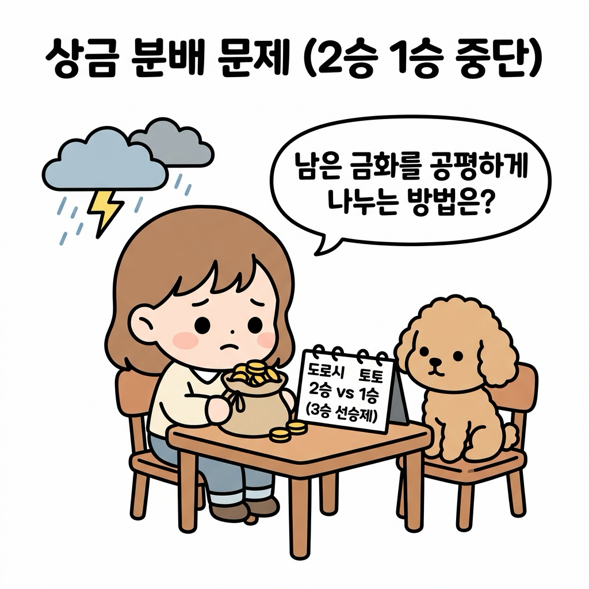
**그림 02-10-1** 3승 선승제 게임에서 도로시 2승, 토토 1승 상황 중 갑작스러운 비로 게임이 중단되었을 때 금화의 공정한 분배 방식을 고민하는 도로시와 토토


"단순히 지금까지 거둔 승수 비율대로 2 : 1로 나누면 안 될까?"

도로시가 묻자, 지니가 공중에 고풍스러운 양피지 편지를 띄우며 미소 지었습니다.


"그렇게 나누면 1승만 더 하면 우승하는 도로시가 손해를 보게 된단다! 1654년, 천재 수학자 블레즈 파스칼(Pascal)과 피에르 드 페르마(Fermat)는 편지를 주고받으며 **'과거의 점수 비율이 아니라, 게임을 계속 진행했을 때 각자가 최종 우승하게 될 미래의 기대 가치(확률)'**대로 상금을 나누어야 한다고 명쾌하게 증명했단다."

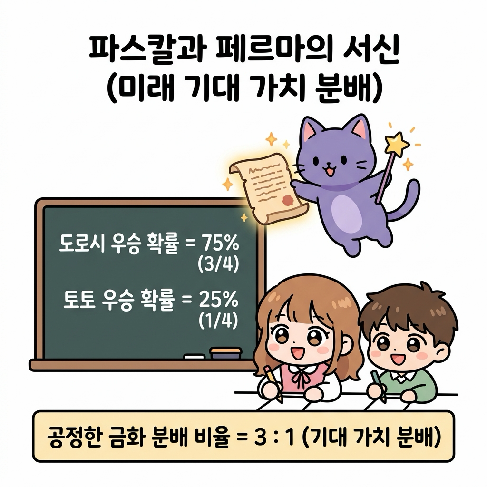
**그림 02-10-2** 파스칼과 페르마의 서신에 담긴 원리를 통해 도로시 우승 확률 75%(3/4)와 토토 우승 확률 25%(1/4)에 따라 상금을 3 : 1로 공정하게 분배하는 방식을 설명하는 지니


---


### 2.10.1.1 상금 분배 문제의 수학적 유도

최대 앞으로 남은 게임 횟수는 2판입니다.

(동전 던지기와 같이 각 판의 승률이 50% = 1/2로 같다고 가정)


#### 1단계: 앞으로 진행될 게임 시나리오 분석 (게임 트리)

현재 스코어는 도로시 2승, 토토 1승이므로, 앞으로 최대 2판만 더 진행하면 3승을 먼저 달성하는 최종 우승자가 무조건 결정됩니다.

1. **다음 판(4번째 판)의 전개**:
   - **도로시 승리 (확률 1/2)**: 도로시가 3승을 달성하여 게임이 즉시 종료됩니다 ➔ **도로시 최종 우승!**
   - **토토 승리 (확률 1/2)**: 도로시 2승, 토토 2승 동점이 되어 마지막 5번째 판으로 이어집니다.

2. **마지막 판(5번째 판)의 전개**:
   - **도로시 승리 (확률 1/2 × 1/2 = 1/4)**: 도로시 3승 ➔ **도로시 최종 우승!**
   - **토토 승리 (확률 1/2 × 1/2 = 1/4)**: 토토 3승 ➔ **토토 최종 역전 우승!**

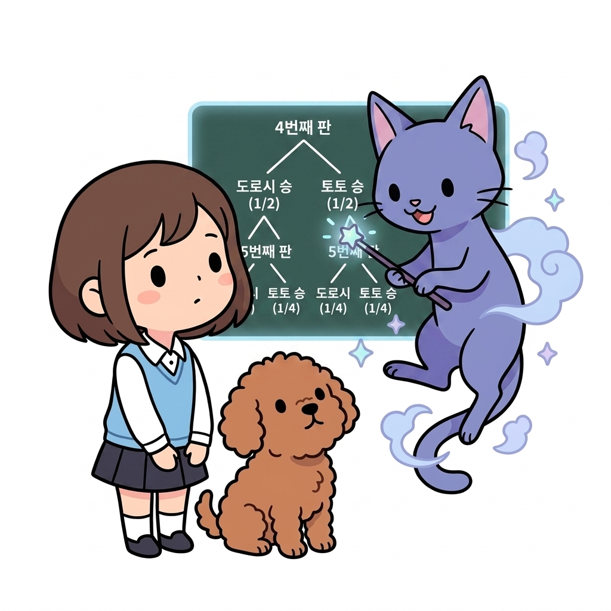
**그림 02-10-3** 도로시 2승, 토토 1승 상황에서 앞으로 진행될 4번째 판과 5번째 판의 승패 **전개 가능성**을 보여주는 게임 트리 다이어그램


#### 2단계: 미래 기대 가치(최종 우승 확률) 계산

각 선수가 최종 우승을 차지하게 될 **모든 독립적인 경로**의 확률을 합산합니다.

* **도로시 최종 우승 확률**: 4번째 판에서 바로 이길 확률(1/2)과 5번째 판에서 이길 확률(1/4)의 합
$$
P(\text{도로시 우승}) = \frac{1}{2} + \frac{1}{4} = \frac{3}{4}\ (75\%)
$$

* **토토 최종 우승 확률**: 4번째 판과 5번째 판을 모두 연속으로 이겨야 하는 확률(1/4)
$$
P(\text{토토 우승}) = \frac{1}{2} \times \frac{1}{2} = \frac{1}{4}\ (25\%)
$$

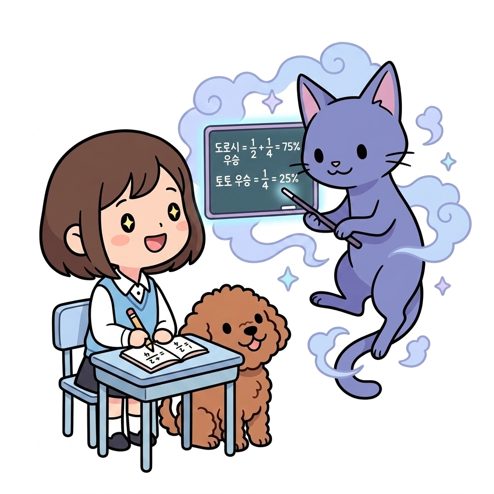
**그림 02-10-4** **각 시나리오별 확률**을 합산하여 도로시 우승 확률 75%(3/4)와 토토 우승 확률 25%(1/4)를 유도하는 계산 과정


#### 3단계: 미래 기대 가치에 따른 공정한 금화 분배

$$
\text{도로시의 몫} : \text{토토의 몫} = 75\% : 25\% = 3 : 1
$$

"와! 내가 최종 우승할 확률이 75%이고 토토가 역전 우승할 확률이 25%니까, 금화를 **3 : 1**로 나누어 갖는 것이 완벽하게 정의로운 분배였구나!"


도로시가 손뼉을 치며 감탄했습니다. 토토도 꼬리를 흔들며 만족스러워했습니다.

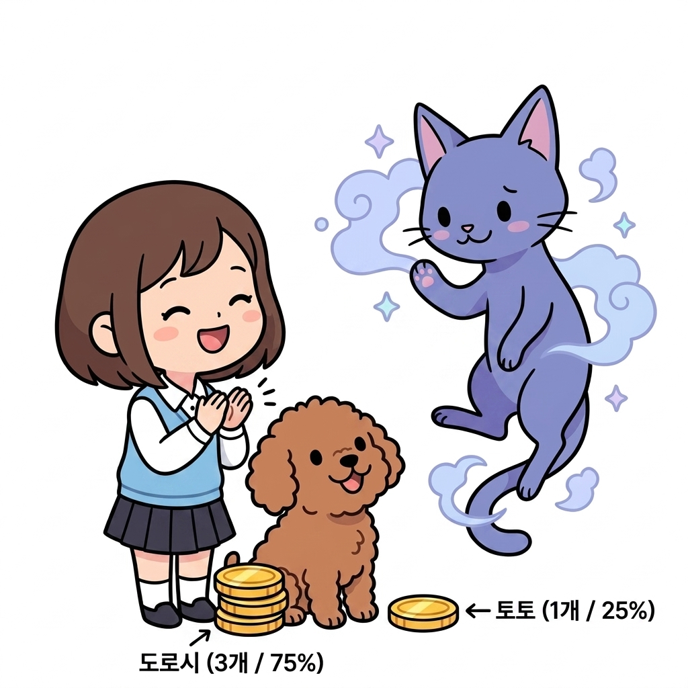
**그림 02-10-5** 미래 우승 확률 비(75% : 25% = 3 : 1)에 따라 금화를 도로시 3닢, 토토 1닢으로 공정하게 나누어 갖는 도로시와 토토, 지니


> **💡 강화학습과의 연결**: 강화학습 에이전트가 현재 상태의 가치(State Value)를 평가할 때, 과거에 지나온 경험뿐만 아니라 **앞으로 미래에 받게 될 누적 보상의 기댓값(Expectation)**을 바탕으로 판단을 내리는 철학이 바로 이 상금 분배 문제의 기대 가치 원리와 직결됩니다. 
>
> 향후에는 이처럼 분석적으로 모든 경우의 수를 계산하기 어려울 때, 직접 수많은 시뮬레이션 에피소드를 끝까지 수행하여 기대 가치를 경험적으로 추정하는 **몬테카를로(Monte Carlo) 기법**으로 발전하여 학습하게 됩니다.


---


## 02.10.2 조합을 이용한 확률 계산

동일한 가능성을 지닌 대상들 중에서 **여러 개를 동시**에 뽑을 때, 표본공간의 크기와 사건의 경우의 수를 **조합(<sub>*n*</sub>*C*<sub>*r*</sub>)**으로 계산하여 확률을 구합니다.

$$
P(A) = \frac{n(A)}{n(S)} = \frac{\text{사건 } A\text{가 일어나는 조합의 수}}{\text{전체 가능한 조합의 수}}
$$

* **수식의 직관적 이해**:
  - **분모 *n(S)* (전체 조합의 수)**: 전체 대상 중 순서 없이 *r*개를 뽑는 모든 가능한 묶음(표본공간)의 총 가짓수
  - **분자 *n(A)* (사건 *A*의 조합의 수)**: 그중에서 우리가 관찰하고자 하는 특정 조건(사건 *A*)을 만족하는 묶음의 가짓수
  - 즉, 여러 개를 한 번에 뽑을 때의 확률은 **'전체 가능한 묶음 가짓수 중에서 목표 조건을 만족하는 묶음 가짓수의 비율'**을 의미합니다.

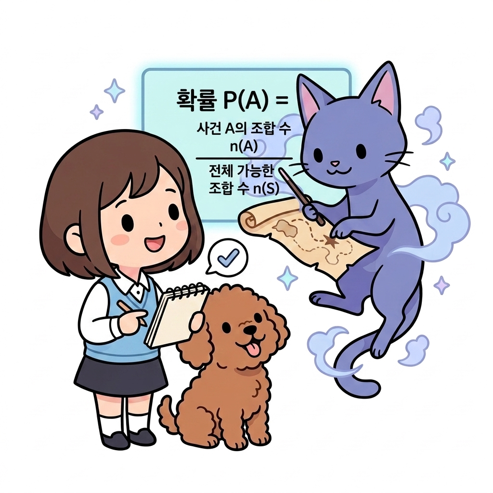
**그림 02-10-6** 전체 가능한 조합의 수(분모) 대비 목표 사건 조합의 수(분자)의 비율로 확률을 구하는 조합 확률 공식의 기본 구조를 설명하는 지니와 도로시, 토토


### 대표 예제: 구슬 주머니 추출

주머니 속에 **흰 공 3개**와 **검은 공 5개**(총 8개)가 들어 있을 때, 무작위로 3개의 공을 동시에 꺼낼 때 흰 공 1개와 검은 공 2개가 나올 확률:

1. **전체 표본공간 경우의 수**: 8개 중 3개를 순서 없이 뽑는 조합
$$
n(S) = _8C_3 = \frac{8 \times 7 \times 6}{3 \times 2 \times 1} = 56
$$

2. **사건 *A*의 경우의 수**: 흰 공 3개 중 1개를 뽑고, 연이어 검은 공 5개 중 2개를 뽑는 곱의 법칙
$$
n(A) = _3C_1 \times _5C_2 = 3 \times \frac{5 \times 4}{2 \times 1} = 3 \times 10 = 30
$$

3. **최종 확률 계산**:
$$
P(A) = \frac{n(A)}{n(S)} = \frac{30}{56} = \frac{15}{28} \approx 0.5357\ (53.6\%)
$$

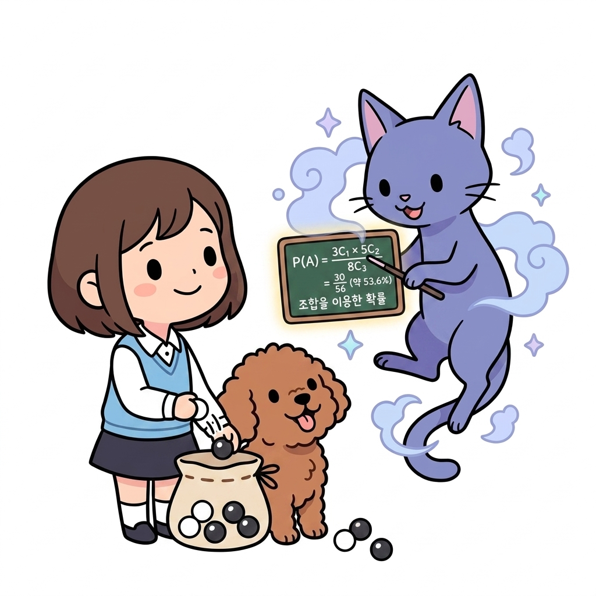
**그림 02-10-7** 주머니 속 8개의 구슬 중 3개를 동시에 꺼낼 때 조합(₈C₃ = 56)과 조건 사건(₃C₁ × ₅C₂ = 30)의 비율로 확률(53.6%)을 도출하는 지니와 도로시, 토토


---


## 02.10.3 확률의 덧셈정리와 여사건


### 2.10.3.1 일반적인 확률의 덧셈정리 (포함-배제의 원리)

두 사건 *A*와 *B*가 **동시에 일어날 가능성**(교집합)이 존재할 때, 두 사건 중 적어도 하나가 일어날 합사건의 확률은 두 확률을 더한 뒤 중복된 교집합 확률을 반드시 한 번 빼주어야 합니다.

$$
P(A \cup B) = P(A) + P(B) - P(A \cap B)
$$

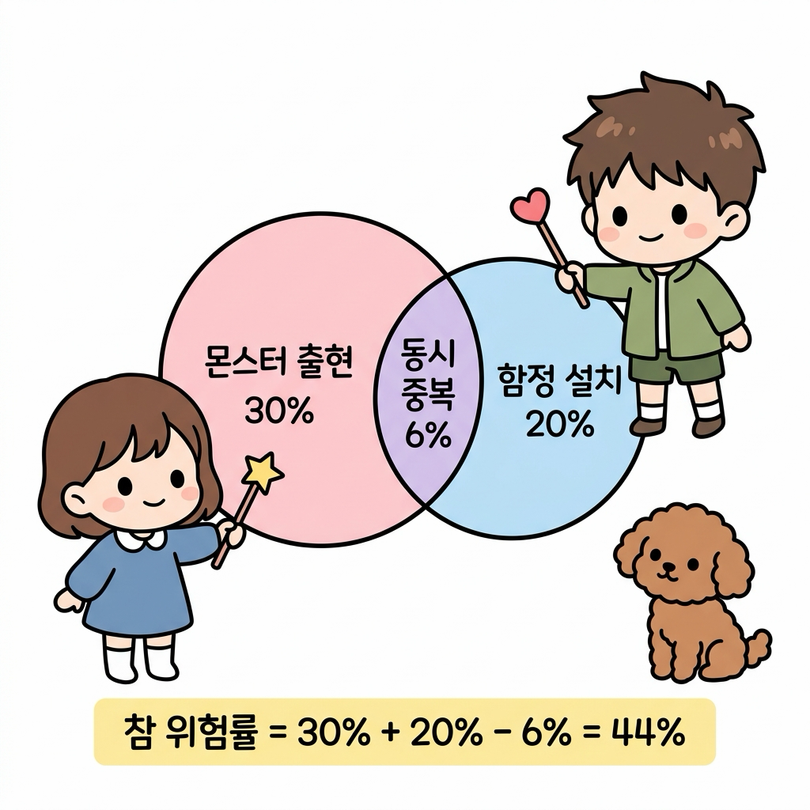
**그림 02-10-8** 격자 모험 지도에서 몬스터 출현(A, 30%)과 함정 설치(B, 20%)가 겹치는 교집합 영역(6%)을 삭감하여 참 위험률(44%)을 도출하는 확률의 덧셈정리 벤 다이어그램


"아! 몬스터 위험(30%)과 함정 위험(20%)을 그냥 더해서 50%라고 하면 두 위험이 겹쳐 있는 6% 구간이 이중 계산(Double Counting)되니까, 6%를 쏙 빼주어서 참 위험도가 44%가 되는 거구나!"

도로시가 벤 다이어그램을 보며 명쾌하게 설명했습니다.


---


### 2.10.3.2 배반사건일 때의 덧셈정리

두 사건 *A*, *B*가 **동시에 절대로 일어날 수 없을 때(배반사건, Mutually Exclusive Events)**, 두 사건의 교집합은 공집합(*A* ∩ *B* = ∅)이 되며 교집합 확률은 0이 됩니다.

따라서 겹쳐서 중복 계산되는 영역이 없으므로, 두 사건 중 어느 하나가 일어날 합사건의 확률은 단순히 각 사건의 확률을 더하여 계산합니다.

$$
P(A \cap B) = 0 \implies P(A \cup B) = P(A) + P(B)
$$

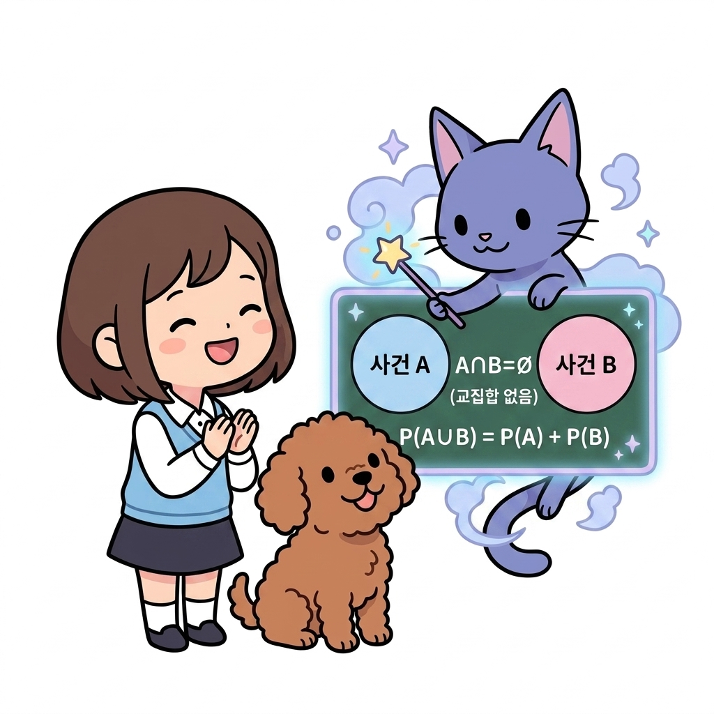
**그림 02-10-9** 교집합이 존재하지 않아(*A* ∩ *B* = ∅) 두 영역이 완전히 분리되어 있을 때, 단순히 두 확률을 더하여 합사건 확률을 도출하는 배반사건 덧셈정리 벤 다이어그램


"아하! 한 걸음에 오른쪽으로 가면서 동시에 왼쪽으로 갈 수 없듯이, 겹치는 교집합이 전혀 없는 사건들은 빼줄 중복이 없으니 그냥 더하기만 하면 되는구나!"

도로시가 두 개의 분리된 원을 가리키며 활짝 웃었습니다.


---


### 2.10.3.3 여사건의 확률

사건 *A*가 일어나지 않을 사건을 사건 *A*의 **여사건(*A*<sup>*c*</sup>, Complementary Event)**이라 부릅니다.

어떤 시행에서 사건 *A*와 그 여사건 *A*<sup>*c*</sup>는 동시에 일어날 수 없는 배반사건(*A* ∩ *A*<sup>*c*</sup> = ∅)이면서, 둘을 합치면 전체 표본공간(*A* ∪ *A*<sup>*c*</sup> = *S*)이 됩니다. 따라서 전체 확률(1.0 = 100%)에서 사건 *A*의 확률을 빼서 매우 간결하게 구합니다.

$$
P(A^c) = 1 - P(A)
$$

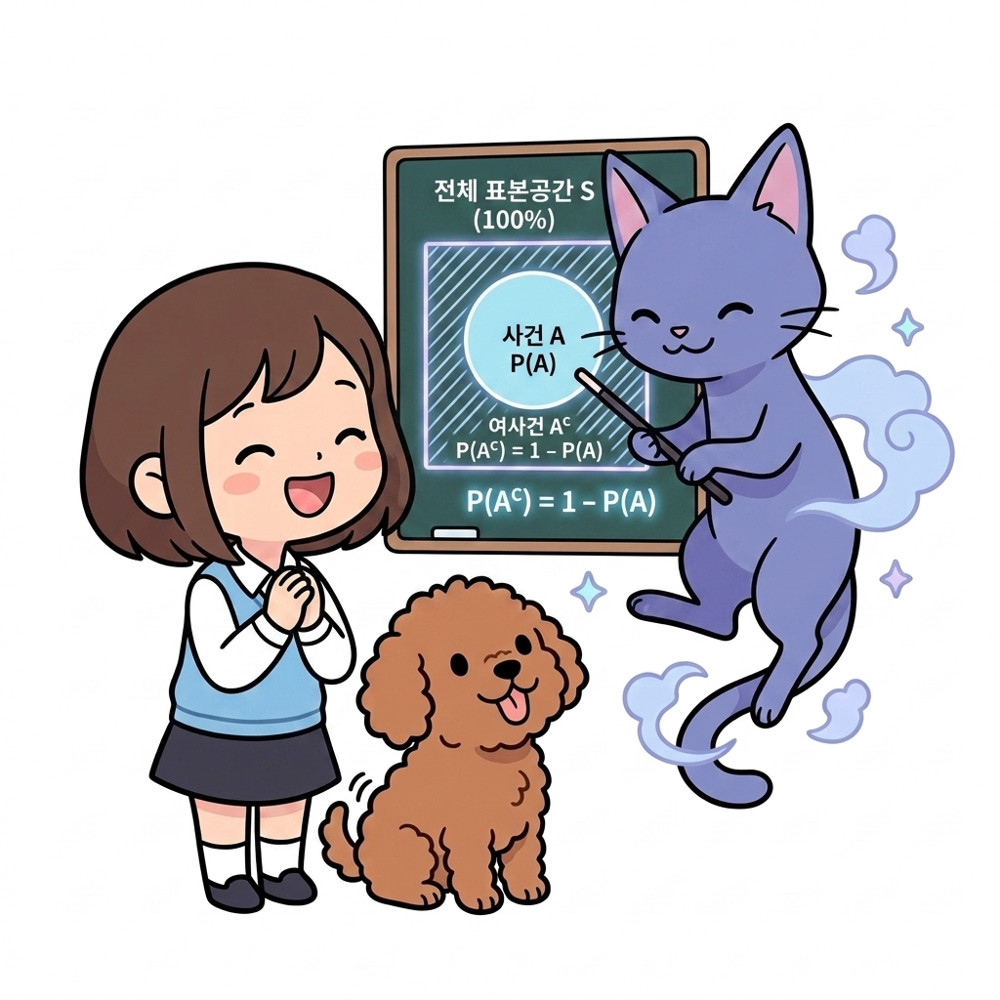
**그림 02-10-10** 전체 표본공간 *S*(100%)에서 사건 *A* 영역을 제외한 나머지 바깥 영역 전체(*A*<sup>*c*</sup>)를 1에서 빼서 산출하는 여사건 확률 벤 다이어그램


* **💡 실전 치트키 (적어도 하나는 ~일 확률)**:
  - "적어도 1개는 ~일 확률"을 직접 구하려면 '1개일 확률 + 2개일 확률 + 3개일 확률...'처럼 수많은 경우의 수를 일일이 더해야 합니다.
  - 하지만 여사건 공식(*P*(*A*<sup>*c*</sup>) = 1 - *P*(*A*))을 활용하여 **'모두 ~가 아닐 확률(0개일 확률)'** 딱 하나만 구한 뒤 전체 1에서 빼주면 복잡한 문제가 단 한 줄로 해결됩니다.


"와! 여러 가지 경우를 복잡하게 다 더할 필요 없이, 반대되는 딱 하나의 여사건만 구해서 1에서 쏙 빼면 정답이 나오는구나! 이건 진짜 계산을 10배 빠르게 만들어주는 마법의 치트키야!"

도로시가 손뼉을 치며 크게 감탄했습니다.


---


## 02.10.4 파이썬으로 구현하는 상금 분배 & 조합 확률 계산기

파이썬의 `math.comb` 모듈을 활용하여 상금 분배 시뮬레이션 및 주머니 공 추출 확률을 계산합니다.


* **예제 파일**: [points_and_combination.py](points_and_combination.py)

```python
import math

# 1. 상금 분배 문제 (도로시 2승 vs 토토 1승, 3승 선승제)
total_prize = 800000  # 총 상금 80만원
p_dorothy_win = 0.5 + (0.5 * 0.5)  # 1/2 + 1/4 = 0.75
p_toto_win = 0.5 * 0.5             # 1/4 = 0.25

dorothy_share = int(total_prize * p_dorothy_win)
toto_share = int(total_prize * p_toto_win)

print("=== 1. 상금 분배 문제 계산 결과 ===")
print(f"도로시 우승 확률: {p_dorothy_win * 100:.1f}% -> 배분 상금: {dorothy_share:,}원")
print(f"토토 우승 확률: {p_toto_win * 100:.1f}% -> 배분 상금: {toto_share:,}원")

# 2. 조합을 이용한 구슬 주머니 확률 계산 (흰 공 3, 검은 공 5 중 3개 추출)
total_combinations = math.comb(8, 3)                # 8C3 = 56
target_combinations = math.comb(3, 1) * math.comb(5, 2)  # 3C1 * 5C2 = 3 * 10 = 30
prob_balls = target_combinations / total_combinations

print("\n=== 2. 조합 활용 구슬 추출 확률 ===")
print(f"전체 경우의 수 (8C3): {total_combinations}가지")
print(f"흰 공 1개, 검은 공 2개 경우의 수 (3C1 * 5C2): {target_combinations}가지")
print(f"최종 추출 확률: {prob_balls:.5f} ({prob_balls * 100:.2f}%)")
```

```text
[실행 결과]
=== 1. 상금 분배 문제 계산 결과 ===
도로시 우승 확률: 75.0% -> 배분 상금: 600,000원
토토 우승 확률: 25.0% -> 배분 상금: 200,000원

=== 2. 조합 활용 구슬 추출 확률 ===
전체 경우의 수 (8C3): 56가지
흰 공 1개, 검은 공 2개 경우의 수 (3C1 * 5C2): 30가지
최종 추출 확률: 0.53571 (53.57%)
```

> **💡 코드 해석**: 과거의 승패 비율(2:1)로 상금을 나누면 도로시가 53.3만 원을 받게 되지만, 미래 기대 가치(75%:25% = 3:1)로 계산하면 도로시가 60만 원, 토토가 20만 원을 받게 되어 수학적으로 완벽하게 공정한 분배가 이루어집니다.


---


## 02.10.5 실전 예제

학습한 내용을 바탕으로 다음 문제를 직접 해결해 봅시다.


### 2.10.5.1 문제 1 (상금 분배 계산)

> A와 B가 3승을 먼저 거두면 우승하는 대결을 펼치던 중, A가 2승 0패로 앞선 상황에서 경기가 중단되었습니다. 총 상금 80만 원을 각자의 미래 우승 확률에 따라 공정하게 배분하시오.
>
> **풀이**:
> 1. B가 최종 우승하려면 앞으로 남은 3경기를 모두 연속으로 이겨야 합니다:
$$
P(B) = \frac{1}{2} \times \frac{1}{2} \times \frac{1}{2} = \frac{1}{8}\ (12.5\%)
$$
> 2. A가 우승할 확률은 그 여사건입니다:
$$
P(A) = 1 - P(B) = 1 - \frac{1}{8} = \frac{7}{8}\ (87.5\%)
$$
> 3. 우승 확률의 비가 7 : 1 이므로 상금을 배분합니다:
>    - A의 상금 = 800,000 × (7/8) = 700,000원
>    - B의 상금 = 800,000 × (1/8) = 100,000원
>
> **정답**: A 70만 원, B 10만 원


---


### 2.10.5.2 문제 2 (확률의 덧셈정리와 배반사건)

> 1부터 50까지 적힌 50장의 카드 중 무작위로 1장을 뽑을 때, 3의 배수 또는 5의 배수가 나올 확률을 구하시오.
>
> **풀이**:
> 1. 전체 카드 수 *n(S)* = 50
> 2. 사건 *A* (3의 배수): 3, 6, ..., 48 ➔ 16개 (*P(A)* = 16/50)
> 3. 사건 *B* (5의 배수): 5, 10, ..., 50 ➔ 10개 (*P(B)* = 10/50)
> 4. 교집합 *A* ∩ *B* (15의 배수): 15, 30, 45 ➔ 3개 (*P(A ∩ B)* = 3/50)
> 5. 확률의 덧셈정리를 적용합니다:
$$
P(A \cup B) = P(A) + P(B) - P(A \cap B) = \frac{16}{50} + \frac{10}{50} - \frac{3}{50} = \frac{23}{50} = 0.46\ (46\%)
$$
>**정답**: 23 / 50 (46%)


---


## 02.10.6 핵심 요약

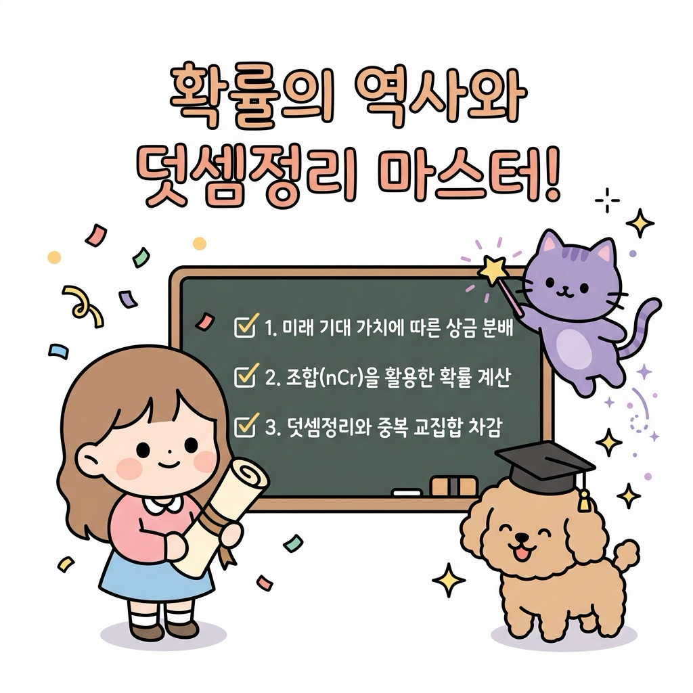
**그림 02-10-11** 상금 분배 문제에서 비롯된 기대 가치 계산법과 조합 기반 확률 산출, 덧셈정리의 이중 계산 방지 원리를 완벽하게 마스터한 도로시와 지니, 토토


1. **상금 분배 문제의 교훈**: 중단된 게임의 보상은 과거 점수가 아니라 **미래에 발생할 우승 확률(기대 가치)**에 비례하여 나누어야 공정하다.
2. **조합(<sub>*n*</sub>*C*<sub>*r*</sub>) 확률**: 순서가 없는 다중 추출 문제는 분모(전체 조합 수)와 분자(사건 조합 수)를 각각 조합 공식으로 세어 확률을 구한다.
3. **확률의 덧셈정리**: 합사건 확률 계산 시 교집합 확률을 반드시 빼주어(*P*(*A* ∪ *B*) = *P*(*A*) + *P*(*B*) - *P*(*A* ∩ *B*)) 중복 계산을 배제한다.
4. **여사건의 활용**: '적어도 하나' 조건이 포함된 문제는 여사건 공식(*P*(*A*<sup>*c*</sup>) = 1 - *P*(*A*))을 활용하여 빠르게 역산한다.
