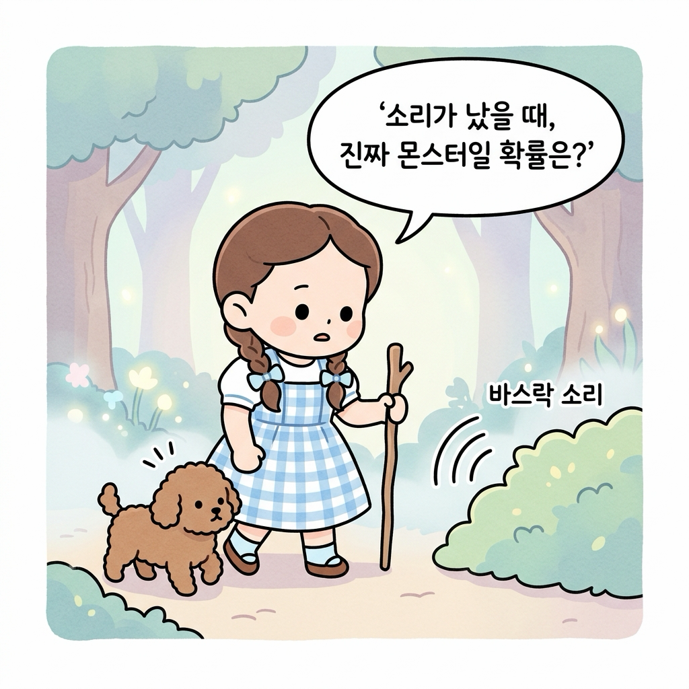
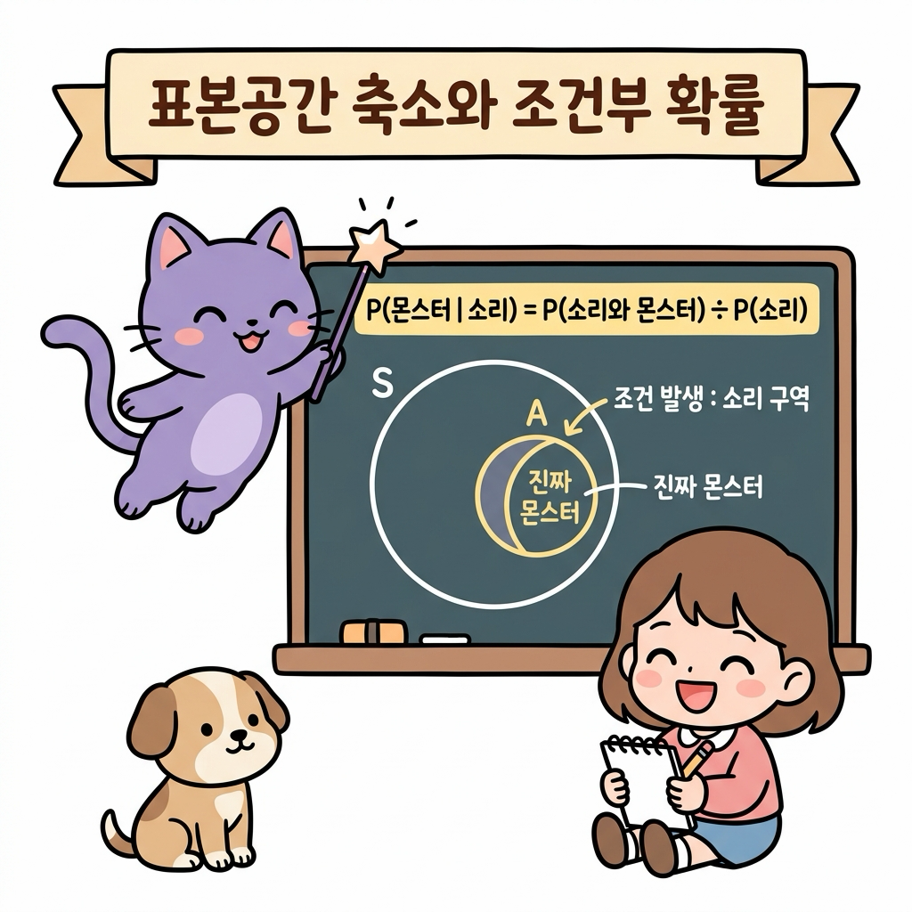
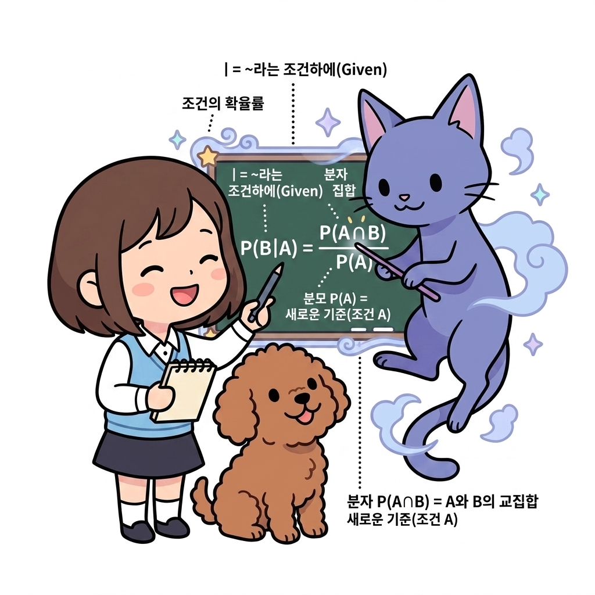
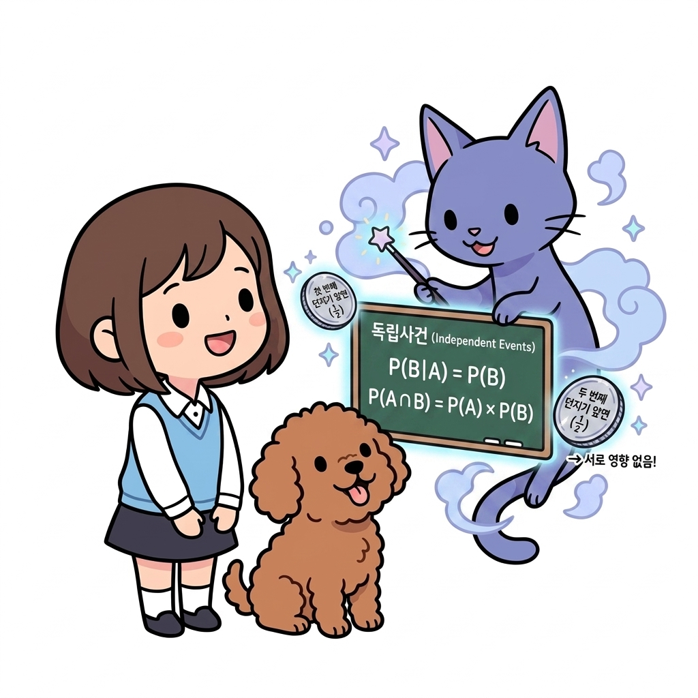
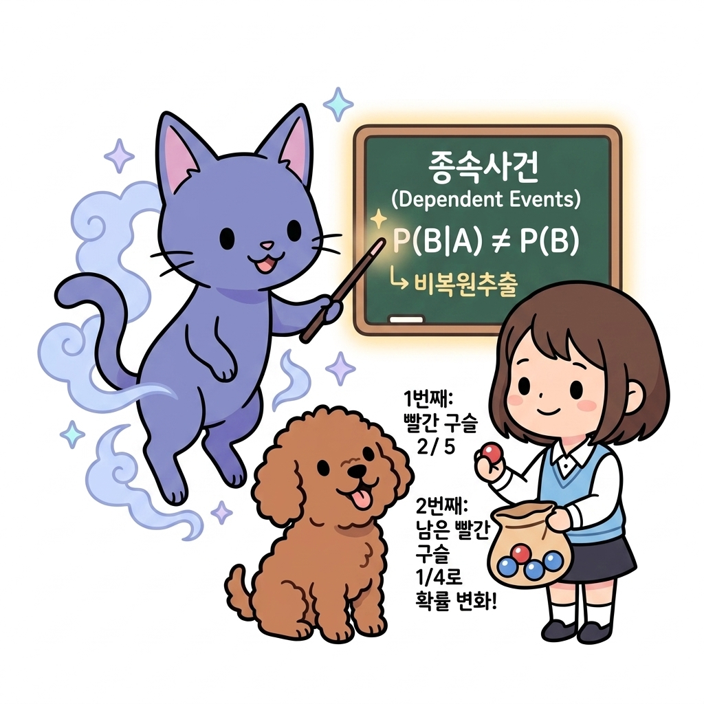
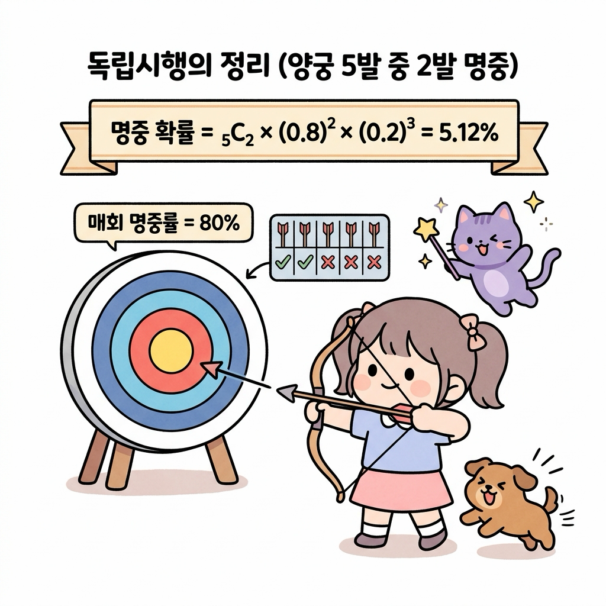
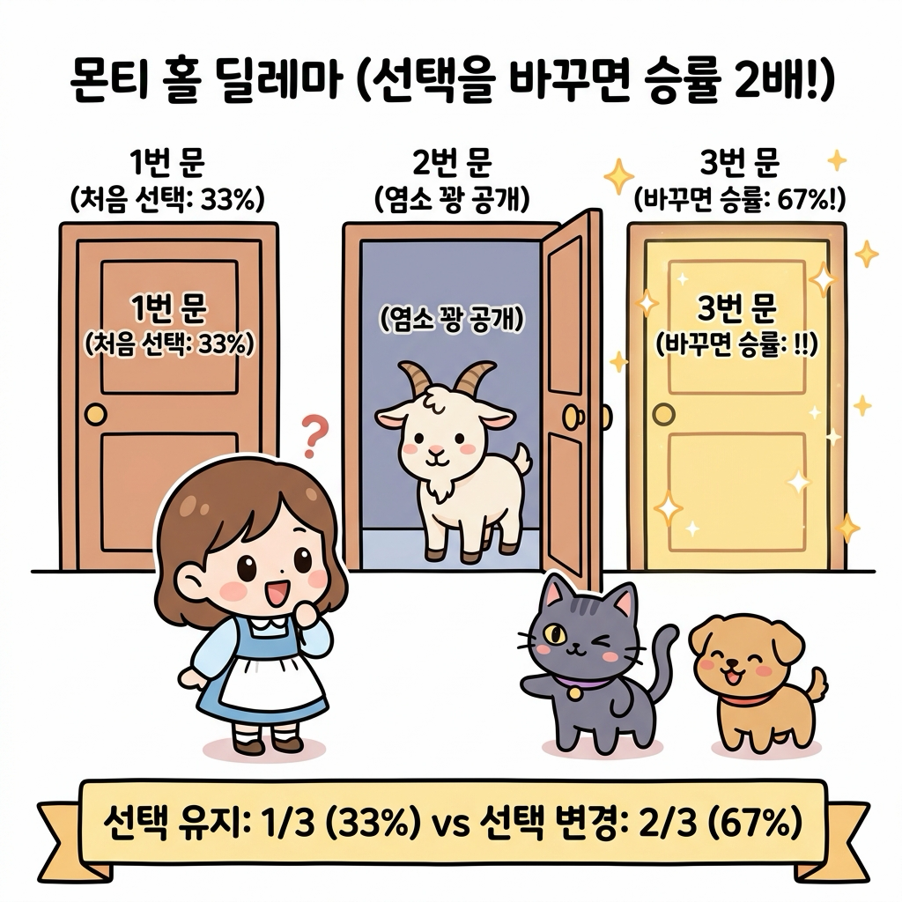
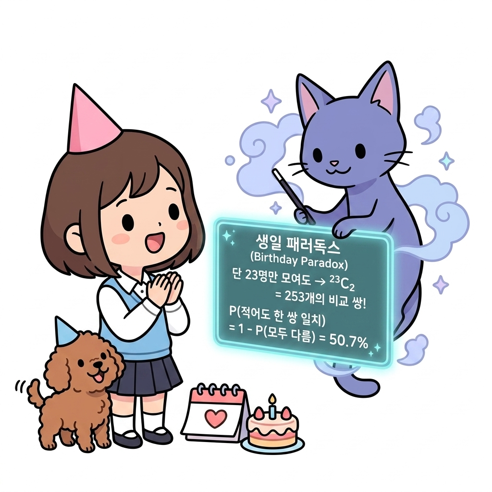
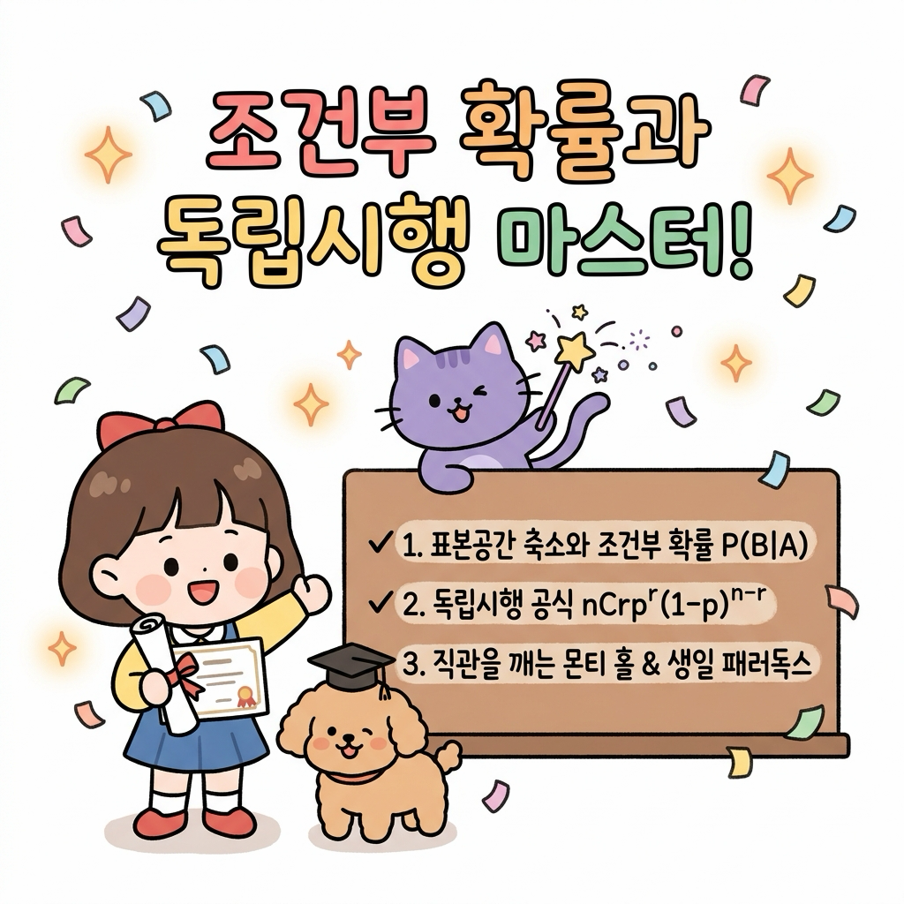

# 02.11 조건부 확률과 독립시행

> 이 장에서는 새로운 정보나 단서가 주어졌을 때 표본공간이 축소되며 확률이 갱신되는 **조건부 확률(Conditional Probability)**의 원리를 학습하고, 매회 독립적으로 반복되는 사건의 확률을 구하는 **독립시행의 정리** 및 인간의 직관을 깨뜨리는 **몬티 홀 딜레마(Monty Hall Problem)**와 **생일 패러독스**를 탐구합니다.


---


## 02.11.1 안개 속 단서와 조건부 확률 (Conditional Probability)

새로운 정보나 단서가 관측되면, 우리가 고려해야 할 전체 가능성의 범위(표본공간)는 단서가 일어난 영역으로 좁혀집니다.


"지니! 안개가 자욱하게 낀 어두운 숲(전쟁 안개, Fog of War)을 지나가고 있는데, 수풀 저편에서 '바스락'거리는 소리가 들렸어! 이 소리가 났을 때 진짜 몬스터를 마주치게 될 확률은 얼마나 돼? 아무 소리도 안 들렸을 때보다 몬스터를 만날 확률이 더 높아진 거지?"

도로시가 나무 지팡이를 짚은 채 두려움과 호기심이 섞인 눈빛으로 귀를 기울였습니다. 

토토도 귀를 쫑긋 세우고 바스락거리는 수풀을 경계했습니다.


**그림 02-11-1** 안개 낀 숲에서 '바스락' 소리 단서(조건)를 감지했을 때 몬스터가 존재할 사후 확률을 고민하는 도로시와 토토


---


지니가 요술봉을 휘두르며 허공에 마법 칠판을 띄웠습니다.

"도로시! 아무런 정보가 없을 때의 단순 사전 확률과 달리, '소리가 났다'는 단서(사건 *A*)가 먼저 주어지면, 표본공간은 전체 세상 *S*가 아니라 '소리가 난 구역(*A*)'으로 즉시 압축된단다. 이 축소된 영역 안에서 몬스터가 존재하는 비율을 새롭게 구하는 것을 **조건부 확률(Conditional Probability)**이라고 부르지."


**그림 02-11-2** 전체 표본공간 S가 관측된 조건 사건 A(소리 구역)로 축소되고, 그 내부의 교집합(진짜 몬스터) 비율을 계산하는 조건부 확률 공식 유도 원리


---


### 2.11.1.1 조건부 확률의 수학적 정의와 기호 해설

사건 *A*가 일어났다는 전제하에 사건 *B*가 일어날 조건부 확률은 **_P(B|A)_** (B given A)라 표기하며 다음과 같이 정의합니다.

$$
P(B|A) = \frac{P(A \cap B)}{P(A)} = \frac{n(A \cap B)}{n(A)} \quad (\text{단, } P(A) > 0)
$$

* **기호와 수식의 직관적 해설**:
  - **_P(B|A)_ (조건부 확률)**: "사건 *A*가 주어졌을 때(Given *A*), 사건 *B*가 일어날 확률"을 의미합니다.
  - **수직선 막대 \| (Given, 조건)**: 수직선 `|`의 오른쪽에 적힌 사건 *A*가 **'이미 일어난 전제 조건'**임을 뜻합니다.
  - **분모 *P(A)* 또는 *n(A)* (새로운 기준)**: 조건 사건 *A*가 일어남으로써, 전체 세상(표본공간 *S*) 대신 **사건 *A*의 영역 전체가 새로운 전체 기준(분모)**으로 축소됩니다.
  - **분자 *P(A ∩ B)* 또는 *n(A ∩ B)* (교집합 영역)**: 새로운 기준인 *A* 영역 중에서 우리가 관심 있는 목표 사건 *B*도 함께 겹쳐서 일어나는 **교집합 영역의 크기**입니다.
  - **단, *P(A)* > 0**: 조건 자체가 절대로 일어날 수 없는 사건(확률 0)이면 나눌 수 없으므로(분모는 0이 될 수 없음), 전제 조건의 확률은 항상 0보다 커야 합니다.


**그림 02-11-3** 조건부 확률 공식 *P(B|A)*의 각 기호(수직선 |, 분모 P(A), 분자 P(A ∩ B))가 의미하는 구조와 역할을 상세히 설명하는 지니와 도로시, 토토


"아! 수직선 `|` 오른쪽의 *A*가 '새로운 기준(분모)'이 되고, 그 안에서 *B*와 겹치는 교집합이 '분자'가 되는 거구나! 기호의 위치만 봐도 공식이 머릿속에 쏙 들어와!"

도로시가 손뼉을 치며 환하게 웃었습니다.


---


## 02.11.2 독립사건과 종속사건의 판별


### 2.11.2.1 독립사건 (Independent Events)

한 사건 *A*가 일어났다는 사실이 다른 사건 *B*가 일어날 확률에 아무런 영향을 주지 않는 관계를 **독립사건(Independent Events)**이라 부릅니다.


* **수학적 정의와 판별식**:
  - 조건부 확률 정의에 따라, 사건 *A*가 발생했다는 조건이 붙더라도 사건 *B*의 확률이 본래 확률과 완전히 동일합니다:
$$
P(B|A) = P(B)
$$
  - 이를 조건부 확률 공식과 결합하면, 두 사건이 동시에 일어날 교집합 확률은 **두 확률의 단순 곱**으로 표현됩니다:
$$
P(A \cap B) = P(A) \times P(B)
$$

* **대표 예시 (동전 던지기와 복원추출)**:
  - **동전 2번 던지기**: 첫 번째 던지기에서 앞면(*A*)이 나왔다고 해서 두 번째 던지기에서 앞면(*B*)이 나올 확률(1/2)이 변하지 않습니다.
  - **주머니 복원추출**: 주머니에서 공을 하나 꺼내 색깔을 확인한 뒤 **다시 집어넣고** 두 번째 공을 뽑으면, 주머니 안의 공 개수와 색상 비율이 처음 상태 그대로 유지되므로 두 시행은 완벽히 독립입니다.


**그림 02-11-4** 사건 A의 발생 여부가 사건 B의 확률에 영향을 주지 않는 독립사건의 정의(P(B|A) = P(B))와 동전 던지기 복원추출 예시를 설명하는 지니와 도로시, 토토


"아하! 첫 번째 동전에서 앞면이 나왔든 뒷면이 나왔든, 두 번째 동전에서 앞면이 나올 확률은 여전히 50%(1/2)인 것처럼 서로에게 전혀 **간섭하지 않는 관계**가 바로 '독립'이구나!"

도로시가 고개를 끄덕였습니다.


---


### 2.11.2.2 종속사건 (Dependent Events)

한 사건 *A*의 발생 여부가 다른 사건 *B*가 일어날 확률에 **직접적인 영향을 미치는 관계**를 **종속사건(Dependent Events)**이라 부릅니다.


* **수학적 정의와 판별식**:
  - 사건 *A*가 일어났다는 조건이 주어지면, 사건 *B*의 확률이 본래 확률과 달라집니다:
$$
P(B|A) \neq P(B)
$$
  - 따라서 두 사건이 연속으로 일어날 교집합 확률은 두 번째 확률로 조건부 확률 *P(B|A)*를 곱해야 합니다 (확률의 곱셈정리):
$$
P(A \cap B) = P(A) \times P(B|A)
$$

* **대표 예시 (비복원추출 - 구슬 주머니)**:
  - 주머니 속에 **빨간 구슬 2개**, **파란 구슬 3개**(총 5개)가 들어 있습니다.
  - **첫 번째 구슬 (사건 *A*)**: 빨간 구슬을 뽑을 확률은 *P(A)* = 2/5 (40%)입니다.
  - **두 번째 구슬 (사건 *B*)**: 뽑은 빨간 구슬을 **다시 넣지 않고(비복원추출)** 두 번째 구슬을 뽑으면, 주머니에 남은 구슬은 총 4개(빨강 1, 파랑 3)로 상태가 변합니다.
  - 따라서 두 번째에도 빨간 구슬이 나올 조건부 확률은 *P(B|A)* = 1/4 (25%)로 뚝 떨어집니다. (*P(B|A)* ≠ *P(B)*)


**그림 02-11-5** 앞선 시행의 결과가 주머니 속 공의 구성(상태)을 변화시켜 다음 확률에 영향을 미치는 종속사건(P(B|A) ≠ P(B))의 비복원추출 원리를 설명하는 지니와 도로시, 토토


"아하! 첫 번째에 빨간 구슬을 쏙 빼버리니까 주머니의 상태가 바뀌어서, 두 번째에 빨간 구슬이 나올 확률이 40%에서 25%로 줄어드는구나! 앞의 선택이 뒤의 확률을 바꾸는 관계가 바로 '종속'이네!"

도로시가 손에 쥔 빨간 구슬을 보며 감탄했습니다.


---


## 02.11.3 독립시행의 정리 (Binomial Trials)

매회 동일한 조건에서 시행을 반복하여 매 시도의 성공 확률이 이전 결과에 영향을 받지 않는 독립적인 연쇄 시행을 **독립시행**이라 합니다.


"지니! 내가 훈련장에서 양궁 활쏘기 연습을 하고 있어. 매번 화살을 쏠 때 과녁을 맞힐 확률이 0.8(80%)로 일정하다고 해보자. 총 5발을 쐈을 때, 정확히 2발만 명중시킬 확률은 어떻게 구해?"

도로시가 활시위를 당기며 물었습니다. 토토는 과녁 옆에서 꼬리를 흔들며 응원했습니다.


**그림 02-11-6** 매회 사격 성공률(80%)이 일정한 독립시행 환경에서 5번의 시도 중 2번 성공할 조합과 확률을 계산하는 도로시와 지니, 토토


지니가 수식을 칠판에 적으며 설명했습니다.

"총 5번의 시도 중 어느 2번에서 명중할 것인지 자리를 고르는 조합(<sub>5</sub>*C*<sub>2</sub>)에, 성공 확률 2번의 거듭제곱(0.8<sup>2</sup>)과 실패 확률 3번의 거듭제곱(0.2<sup>3</sup>)을 연이어 곱해주면 된단다."

$$
P(X = r) = _nC_r \times p^r \times (1 - p)^{n - r}
$$

* **양궁 5발 중 2발 명중 계산**:
$$
P(X = 2) = _5C_2 \times (0.8)^2 \times (0.2)^3 = 10 \times 0.64 \times 0.008 = 0.0512\ (5.12\%)
$$


---


## 02.11.4 직관을 깨뜨리는 확률의 역설

인간의 직관적인 어림짐작과 실제 수학적 계산이 극명하게 갈리는 대표적인 유명 퍼즐들입니다.


### 2.11.4.1 몬티 홀 딜레마 (Monty Hall Problem)

퀴즈 쇼 무대에 닫힌 3개의 문(1번, 2번, 3번)이 있습니다. 한 문 뒤에는 '황금 자동차(당첨)', 나머지 두 문 뒤에는 '염소(꽝)'가 있습니다.

1. 도로시가 **1번 문**을 선택했습니다. (당첨 확률 1/3 = 33%)
2. 어디에 차가 있는지 알고 있는 사회자가 남은 2번, 3번 문 중 꽝인 **2번 문**을 열어 염소를 보여주었습니다.
3. 사회자가 묻습니다: **"1번 문을 고수하시겠습니까, 아니면 3번 문으로 바꾸시겠습니까?"**


**그림 02-11-7** 몬티 홀 퀴즈 쇼 무대에서 사회자가 2번 문의 염소(꽝)를 공개했을 때, 선택을 3번 문으로 바꾸는 것이 승리 확률을 2/3(67%)로 2배 높여줌을 보여주는 시각화


"그냥 문이 2개 남았으니까 반반(50% : 50%) 아니야?"

도로시가 갸우뚱거리자, 지니가 빙그레 웃으며 답했습니다.


"아니란다! 도로시가 처음에 차를 골랐을 확률은 1/3이고, 꽝을 골랐을 확률은 2/3였어. 도로시가 처음에 꽝을 골랐다면 사회자는 남은 꽝을 열어줄 수밖에 없으므로, **선택을 바꾸면 무조건 차를 얻게 된단다!** 따라서 선택을 바꾸었을 때의 당첨 확률은 **2/3(약 67%)**로 2배나 껑충 뛰게 되지!"


---


### 2.11.4.2 생일 패러독스 (Birthday Paradox)

1년 365일 중, 한 방에 **단 23명의 사람**만 모여 있어도 **생일이 같은 사람이 적어도 한 쌍 이상 존재할 확률은 약 50.7%**로 절반을 훌쩍 넘습니다. (30명이 모이면 70.6%, 50명이 모이면 무려 97.0%에 도달!)

직관적으로는 1년이 365일이나 되므로 23명 정도로는 생일이 겹치기 어려울 것 같지만, 실제로는 **"비교할 수 있는 쌍(Pair)의 조합 수"**가 폭발적으로 증가하기 때문입니다.

* **비교 가능한 쌍의 조합 수**:
  - 23명 중에서 2명을 짝지어 생일을 비교할 수 있는 모든 쌍의 수는 조합(<sub>23</sub>*C*<sub>2</sub>)으로 계산됩니다:
$$
_{23}C_2 = \frac{23 \times 22}{2} = 253\text{쌍}
$$
  - 무려 **253번이나 생일이 같은지 맞춰볼 기회**가 생기므로 겹칠 확률이 급격히 치솟습니다.

* **여사건을 이용한 수학적 증명 (모두 생일이 다를 확률)**:
  - 23명의 생일이 모두 다를 확률은 비복원추출처럼 순차적으로 곱하여 구합니다:
$$
P(\text{모두 다름}) = \frac{365}{365} \times \frac{364}{365} \times \frac{363}{365} \times \dots \times \frac{365 - 23 + 1}{365} \approx 0.4927\ (49.27\%)
$$
  - 따라서 여사건 공식에 의해 **적어도 한 쌍의 생일이 일치할 확률**은:
$$
P(\text{적어도 한 쌍 일치}) = 1 - P(\text{모두 다름}) = 1 - 0.4927 = 0.5073\ (50.73\%)
$$


**그림 02-11-8** 단 23명만 모여도 253개의 비교 쌍(₂₃C₂ = 253)이 생성되어 생일이 겹칠 확률이 50%를 초과하는 생일 패러독스의 원리를 설명하는 지니와 도로시, 토토


"와! 1년 365일 중에서 나와 생일이 같은 특정 사람을 찾는 게 아니라, 23명 안에서 '아무나 둘이 겹치는 쌍'을 찾는 거니까 253쌍이나 비교할 수 있어서 확률이 50%를 훌쩍 넘는 거였구나!"

도로시가 고깔모자를 쓰고 손뼉을 치며 신기해했습니다. 토토도 꼬리를 흔들었습니다.


---


## 02.11.5 파이썬으로 구현하는 몬티 홀 & 독립시행 시뮬레이터

파이썬의 `random` 모듈로 몬티 홀 게임을 100,000번 시뮬레이션하여 선택을 바꾸는 전략의 우수성을 검증합니다.


* **예제 파일**: [monty_hall_and_binomial.py](monty_hall_and_binomial.py)

```python
import random
import math

def monty_hall_simulation(trials=100000):
    stay_wins = 0
    switch_wins = 0
    random.seed(42)
    
    for _ in range(trials):
        # 3개의 문 중 무작위로 1곳에 자동차(1), 나머지 2곳에 염소(0) 배치
        doors = [0, 1, 2]
        car_door = random.randint(0, 2)
        player_choice = random.randint(0, 2)
        
        # 사회자는 플레이어가 선택하지 않았고, 자동차도 없는 꽝 문을 열어 공개
        possible_host_doors = [d for d in doors if d != player_choice and d != car_door]
        host_door = random.choice(possible_host_doors)
        
        # 선택을 바꿀 경우 남은 문
        switch_choice = [d for d in doors if d != player_choice and d != host_door][0]
        
        # 승리 카운팅
        if player_choice == car_door:
            stay_wins += 1
        if switch_choice == car_door:
            switch_wins += 1
            
    print(f"=== 몬티 홀 시뮬레이션 ({trials:,}회 시행) ===")
    print(f"1. 처음 선택 유지 시 승률: {stay_wins / trials * 100:.2f}% (이론값 33.33%)")
    print(f"2. 다른 문으로 변경 시 승률: {switch_wins / trials * 100:.2f}% (이론값 66.67%)")

monty_hall_simulation()

# 독립시행 양궁 계산
n, r, p = 5, 2, 0.8
binomial_prob = math.comb(n, r) * (p ** r) * ((1 - p) ** (n - r))
print(f"\n양궁 5발 중 2발 명중 확률 (n=5, r=2, p=0.8): {binomial_prob * 100:.2f}%")
```

```text
[실행 결과]
=== 몬티 홀 시뮬레이션 (100,000회 시행) ===
1. 처음 선택 유지 시 승률: 33.36% (이론값 33.33%)
2. 다른 문으로 변경 시 승률: 66.64% (이론값 66.67%)

양궁 5발 중 2발 명중 확률 (n=5, r=2, p=0.8): 5.12%
```

> **💡 코드 해석**: 10만 번의 컴퓨터 시뮬레이션 결과, 문을 바꾸었을 때의 승률이 정확히 66.64%(2/3)로 유지했을 때의 33.36%(1/3)보다 정확히 2배 높게 나타나 수학적 직관의 오류를 명확히 입증합니다.


---


## 02.11.6 실전 예제


학습한 내용을 바탕으로 다음 문제를 직접 해결해 봅시다.


### 2.11.6.1 문제 1 (비복원추출 조건부 확률과 곱셈정리)

> 주머니 속에 빨간 구슬 2개와 파란 구슬 3개(총 5개)가 들어 있습니다. 구슬을 한 개씩 연속해서 두 번 꺼낼 때(꺼낸 구슬은 다시 넣지 않음), 두 번 모두 빨간 구슬이 나올 확률을 구하시오.
>
> **풀이**:
> 1. 첫 번째에 빨간 구슬을 꺼낼 사건을 *A*라 하면:
$$
P(A) = \frac{2}{5}
$$
> 2. 첫 번째 빨간 구슬이 빠져나간 후 남은 4개(빨강 1, 파랑 3) 중 두 번째에 빨간 구슬을 꺼낼 조건부 확률은:
$$
P(B|A) = \frac{1}{4}
$$
> 3. 확률의 곱셈정리에 따라 두 사건이 연속으로 발생할 확률은:
$$
P(A \cap B) = P(A) \times P(B|A) = \frac{2}{5} \times \frac{1}{4} = \frac{2}{20} = \frac{1}{10}\ (10\%)
$$
>**정답**: 1 / 10 (10%)


---


### 2.11.6.2 문제 2 (독립시행 주사위 던지기)

> 주사위 1개를 4번 던질 때, 1의 눈이 정확히 3번 나올 확률을 구하시오.
>
> **풀이**:
> 1. 1회 시행 시 1의 눈이 나올 성공 확률 *p* = 1/6, 실패 확률 1 - *p* = 5/6
> 2. 총 시행 횟수 *n* = 4, 성공 횟수 *r* = 3
> 3. 독립시행 공식 적용:
$$
P(X = 3) = _4C_3 \times \left(\frac{1}{6}\right)^3 \times \left(\frac{5}{6}\right)^1 = 4 \times \frac{1}{216} \times \frac{5}{6} = \frac{20}{1296} = \frac{5}{324} \approx 0.01543\ (1.54\%)
$$
>**정답**: 5 / 324 (약 1.54%)


---


## 02.11.7 핵심 요약


**그림 02-11-9** 표본공간의 축소를 수반하는 조건부 확률과 독립시행 공식, 몬티 홀 딜레마와 생일 패러독스의 원리를 정복한 도로시와 지니, 토토


1. **조건부 확률(*P(B|A)*)**: 새로운 단서나 조건 *A*가 관측되면 전체 표본공간이 사건 *A*의 영역으로 축소되며, 그 안에서 교집합의 비율(*P(A ∩ B) / P(A)*)을 구한다.
2. **독립과 종속**: 이전 사건이 다음 사건에 영향을 미치지 않으면 **독립사건(*P(A ∩ B) = P(A)P(B)*)**, 영향을 미치면 **종속사건**이다.
3. **독립시행의 정리**: 매회 성공률 *p*가 일정한 독립 실험을 *n*번 반복하여 *r*번 성공할 확률은 **<sub>*n*</sub>*C*<sub>*r*</sub> *p*<sup>*r*</sup> (1-*p*)<sup>*n-r*</sup>**로 계산한다.
4. **확률적 직관의 교정**: 몬티 홀 딜레마(선택 변경 시 2/3 승률)와 생일 문제(23명만으로 50% 돌파)는 인간의 어림짐작을 깨뜨리는 정교한 수학적 통찰을 제공한다.
