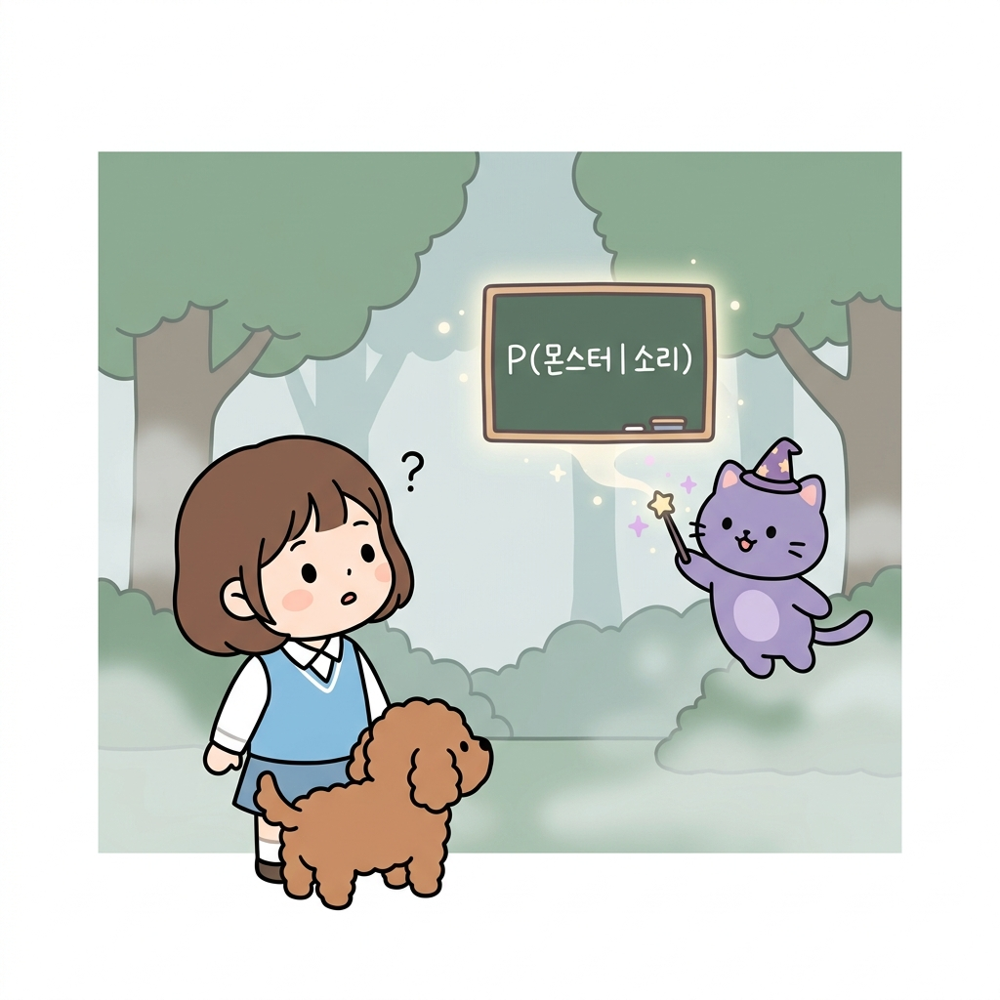
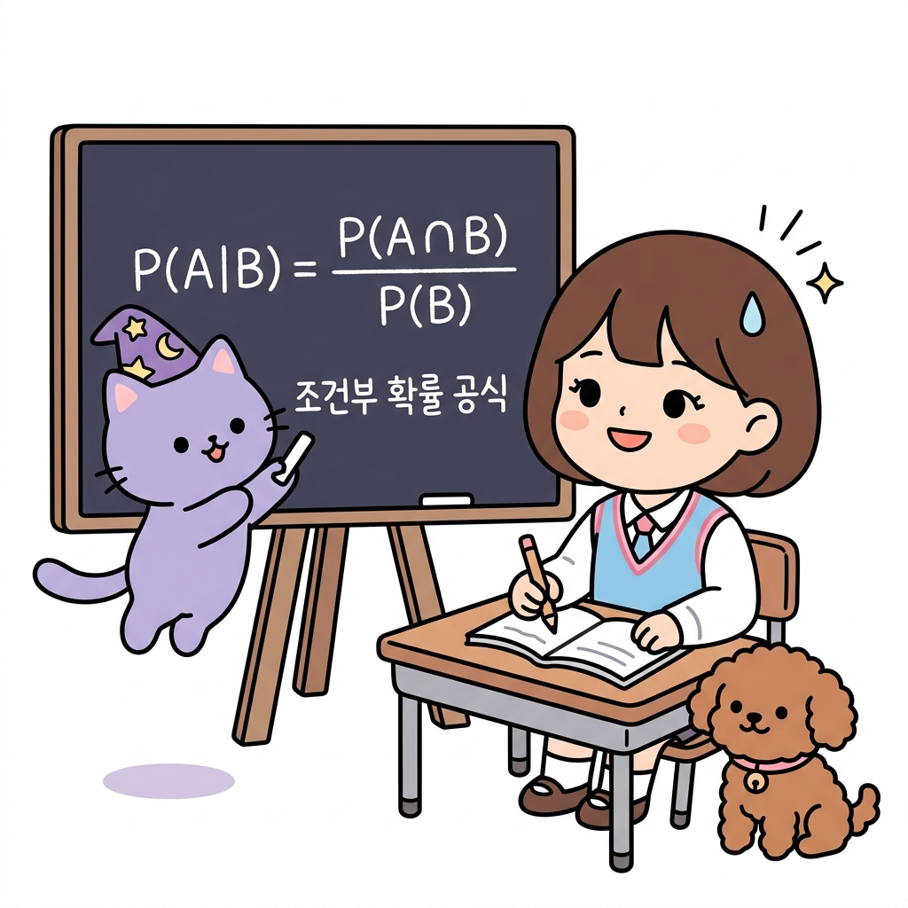
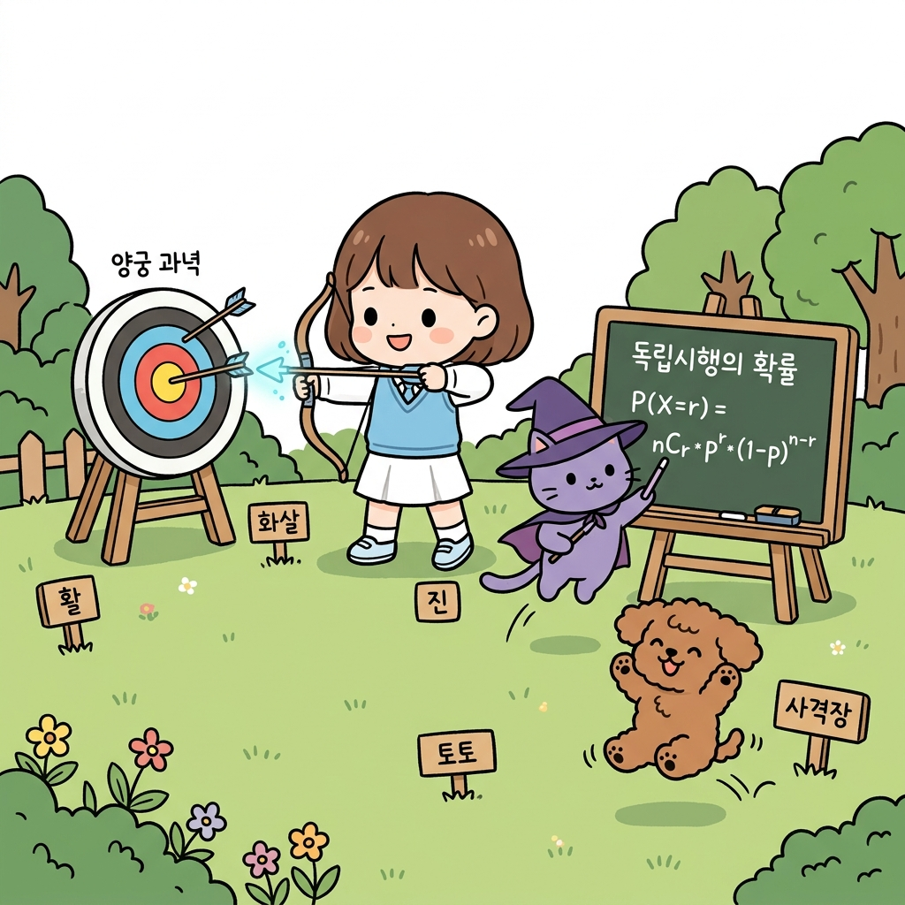

# 02.11 조건부 확률과 독립시행

> 이 장에서는 **조건부 확률과 독립시행 (몬티 홀 & 생일 패러독스)**에 관한 기초부터 심화 개념들을 유기적으로 결합하여 학습합니다.

---

## 02.11.1 조건부 확률과 독립/종속 사건

어떤 사건이 이미 일어났다는 가정하에 다른 사건이 터질 비율인 **조건부 확률**을 배웁니다.

"지니! 안개가 자욱하게 낀 어두운 숲(전쟁 안개, Fog of War)을 지나가고 있는데, 저 멀리서 부스럭거리는 으스스한 소리가 들렸어! 이 소리가 몬스터가 내는 소리일 확률은 얼마나 될까? 아무 단서도 없을 때보다 몬스터를 마주할 확률이 더 올라간 거야?"

도로시가 두려움에 찬 표정으로 귀를 기울이며 물었습니다. 토토도 잔뜩 긴장해서 꼬리를 감추고 주위를 경계했습니다. 지니가 허공에 마법 요술 칠판을 띄워 공식을 차근차근 그렸습니다.

"도로시! 아무런 정보가 없을 때의 단순 확률과 달리, '소리가 났다'는 단서(조건 *A*)가 먼저 주어지면, 몬스터가 존재할 확률(사건 *B*)은 완전히 새롭게 업데이트된단다. 이걸 수학에서는 **조건부 확률(Conditional Probability)**이라고 부르지."

**그림 02-11-1** 안개 속에서 들려오는 소리 정보(조건)를 기반으로 몬스터가 존재할 확률을 조건부 기호 P(몬스터|소리)로 구성하는 도로시와 지니, 토토

"아! '소리'라는 단서가 발견된 구역으로 표본공간(전체 가능성)이 좁혀지니까, 그 안에서 진짜 몬스터 소리인 비율만 구하면 되는 거네!"

도로시가 소리를 분석하며 답했습니다.

---

### 1. 학습 목표
- **조건부 확률**의 정의와 표기법(*P*(*B*|*A*))을 이해하고 이를 계산할 수 있다.
- **독립사건**과 **종속사건**의 정의를 명확히 알고, 어떤 사건들이 독립인지 종속인지 수식으로 판별할 수 있다.
- 표(분할표)를 활용하여 실생활 조건부 확률 문제를 쉽게 구하는 방법을 익힌다.

---

### 2. 핵심 개념

#### (1) 조건부 확률 (Conditional Probability)
어떤 사건 *A*가 일어났다는 전제하에(가정했을 때) 사건 *B*가 일어날 확률을 기호로 **_P(B|A)_**로 나타냅니다. (B given A 라고 읽습니다.)

**그림 02-11-2** 사전 조건 B가 일어났을 때 사건 A가 일어날 조건부 확률 공식 P(A|B) = P(A ∩ B) / P(B)를 설명하는 지니와 도로시, 토토

* **조건부 확률 공식**:
  **_P(B|A) = P(A ∩ B) / P(A)_** (단, *P*(*A*) > 0)
  * *의미*: 조건 *A*가 발생함에 따라 표본공간이 전체에서 *A*로 축소되며, 그 중 *B*도 동시에 만족하는 교집합 비율을 세어 줍니다.

#### (2) 독립사건과 종속사건
* **독립사건 (Independent Events)**:
  사건 *A*의 발생 여부가 사건 *B*의 확률에 전혀 영향을 주지 않는 관계입니다:
  * *조건식*: **_P(B|A) = P(B)_**
  * *판별식*: **_P(A ∩ B) = P(A) × P(B)_**
* **종속사건 (Dependent Events)**:
  한 사건의 발생이 다른 사건의 확률을 변화시키는 관계입니다 (독립이 아닌 모든 사건).

---

## 02.11.2 확률의 곱셈정리와 독립시행의 정리

매회 동일한 조건에서 반복하여 행동할 때의 확률 법칙을 다룹니다.

"지니! 내가 훈련장에서 양궁 연습을 하고 있어. 매번 화살을 쏠 때 과녁을 맞힐 확률이 0.8(80%)로 항상 똑같다고 가정해 보자. 총 5번의 화살을 쐈을 때, 정확히 2번 과녁을 명중시킬 확률은 어떻게 구해야 해?"

도로시가 활을 당겨 과녁판을 겨냥하며 물었습니다. 토토는 사격장 팻말 옆에서 힘차게 응원했습니다. 지니가 과녁판 옆에 수식을 적어 유도했습니다.

"그건 매 시행의 성공 확률이 다른 시도에 전혀 영향을 주지 않는 대표적인 **독립시행**이란다. 이때는 몇 번째 시도에서 성공할 것인지 순서를 결정하는 조합(*n**C**r*)과, 성공 확률의 거듭제곱, 실패 확률의 거듭제곱을 결합하여 풀 수 있어."

**그림 02-11-3** 매회 사격 성공률이 일정한 독립시행 조건에서 n번 시도 중 r번 성공할 확률을 계산하는 공식을 연습하는 도로시와 지니, 토토

* **독립시행의 정리 공식**:
  사건이 일어날 확률이 *p*일 때, *n*번 반복하는 독립시행에서 사건이 정확히 *r*회 일어날 확률 *P*는 다음과 같습니다.
  **_P(X=r) = nCr × pr × (1-p)n-r_**
  * *n**C**r*: *n*번의 시도 중 성공할 *r*번을 고르는 경우의 수
  * *p**r*: *r*번 성공할 확률
  * (1-*p*)*n-r*: 나머지 실패할 확률

---

## 02.11.3 생활 속의 확률과 직관의 오류

인간의 직관적인 느낌과 실제 수학적 확률 계산이 매우 다르게 나타나는 대표적인 퍼즐들입니다.

### 1. 몬티 홀 딜레마 (Monty Hall Problem)
* **딜레마**: 3개의 문 중 하나 뒤에만 보상(자동차)이 있고 둘은 염소(꽝)가 있습니다. 참가자가 1번 문을 고르자, 사회자가 남은 문 중 꽝인 2번 문을 열어 보여줍니다. 이때 3번 문으로 선택을 바꾸는 것이 유리할까요?
* **정답**: **선택을 바꾸는 것이 승리 확률이 2/3로 상승하여 2배 더 유리**합니다. (처음 선택을 고수하면 1/3 유지)

### 2. 생일 패러독스 (Birthday Paradox)
* **패러독스**: 한 교실에 단 20명의 학생만 모여 있어도, 생일이 같은 학생이 적어도 한 쌍 이상 존재할 확률은 우리의 직관(매우 낮을 것이라는 생각)과 달리 **약 60.6%**나 됩니다. (여사건의 결합 법칙으로 유도)

"와! 직관만 믿고 선택을 안 바꾸거나, 생일이 같을 확률이 무조건 낮을 거라고 찍으면 수학 시험에서 꽝을 뽑겠네!"

도로시가 웃으며 토토를 안아주었습니다.

---

## 02.11.4 실전 예제

### 문제 1 (비복원추출 곱셈정리)
> 주머니 속에 빨간 공 2개와 파란 공 3개가 들어 있습니다. 공을 한 개씩 연속해서 두 번 꺼낼 때(꺼낸 공은 다시 넣지 않음), 두 번 모두 빨간 공이 나올 확률을 구하시오.
>
> **풀이**:
> * 첫 번째 빨간 공을 꺼낼 확률 *P*(*A*) = 2 / 5
> * 꺼낸 공을 넣지 않으므로 남은 빨간 공 1개, 파란 공 3개 중 빨간 공을 꺼낼 조건부 확률 *P*(*B*|*A*) = 1 / 4
> * 확률의 곱셈정리에 의해:
>   *P*(*A* ∩ *B*) = 2 / 5 × 1 / 4 = 1 / 10 (10%)
>
> **정답**: 1 / 10

---

## 02.11.5 핵심 요약

1. **조건부 확률 *P(B|A)***는 사건 *A*가 발생했다는 전제하에 사건 *B*가 일어날 확률이며, 전체 표본공간이 사건 *A*의 영역으로 축소된다.
2. 매회 시행 결과가 이전 결과에 전혀 영향을 주지 않는 시도를 **독립시행**이라 하며, *n*번 중 *r*번 성공할 확률은 ***n**C**r* × *p**r* × (1-*p*)*n-r*** 공식으로 구한다.
3. 몬티 홀 문제와 생일 패러독스는 인간의 주관적 느낌(직관)이 정교한 객관적 수학 확률과 크게 어긋날 수 있음을 보여주는 대표적인 사례이다.
