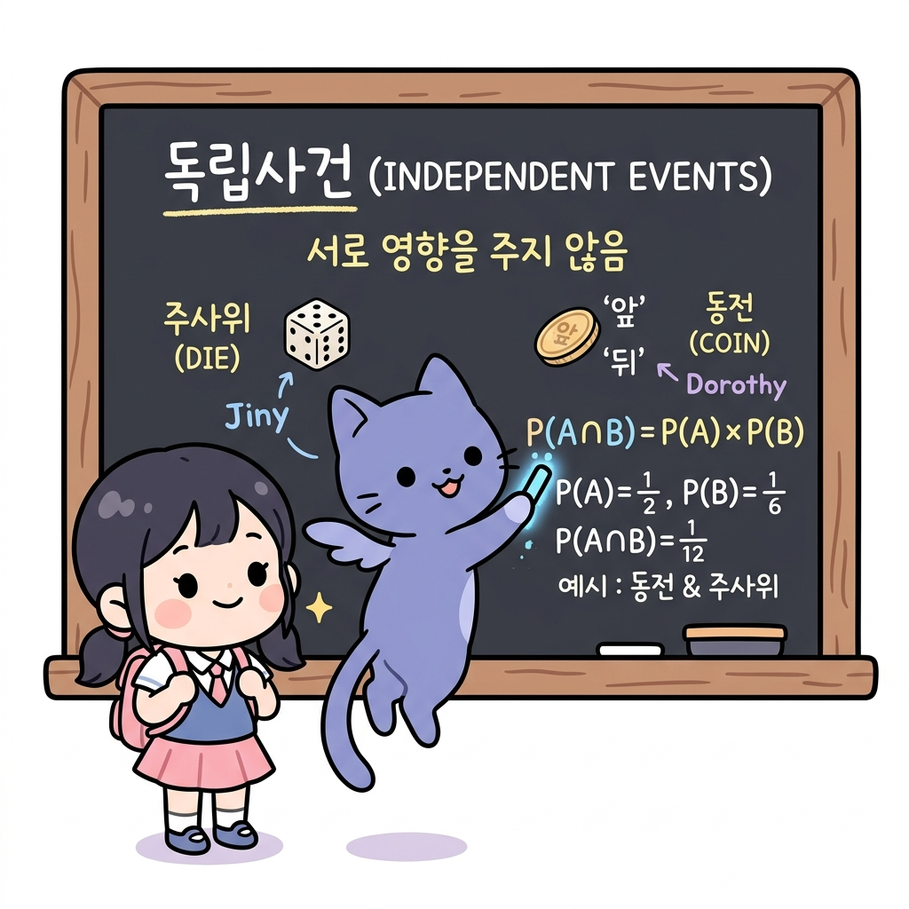
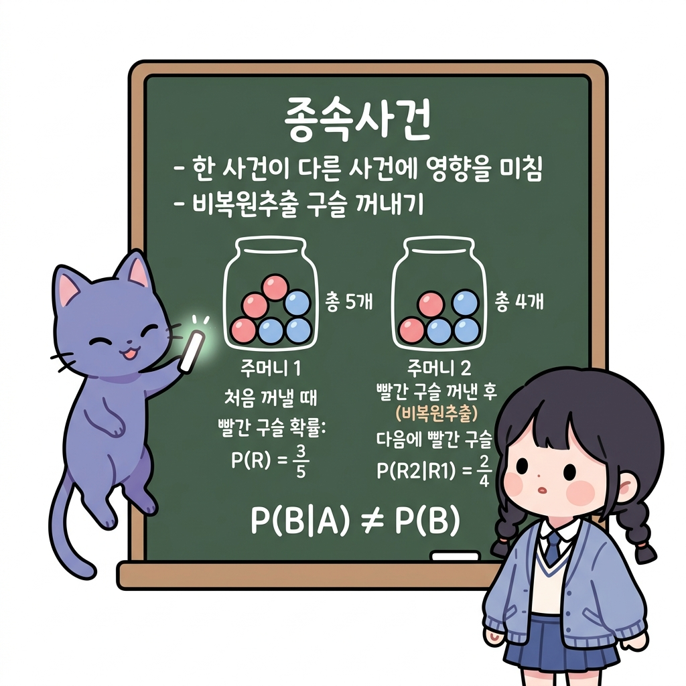
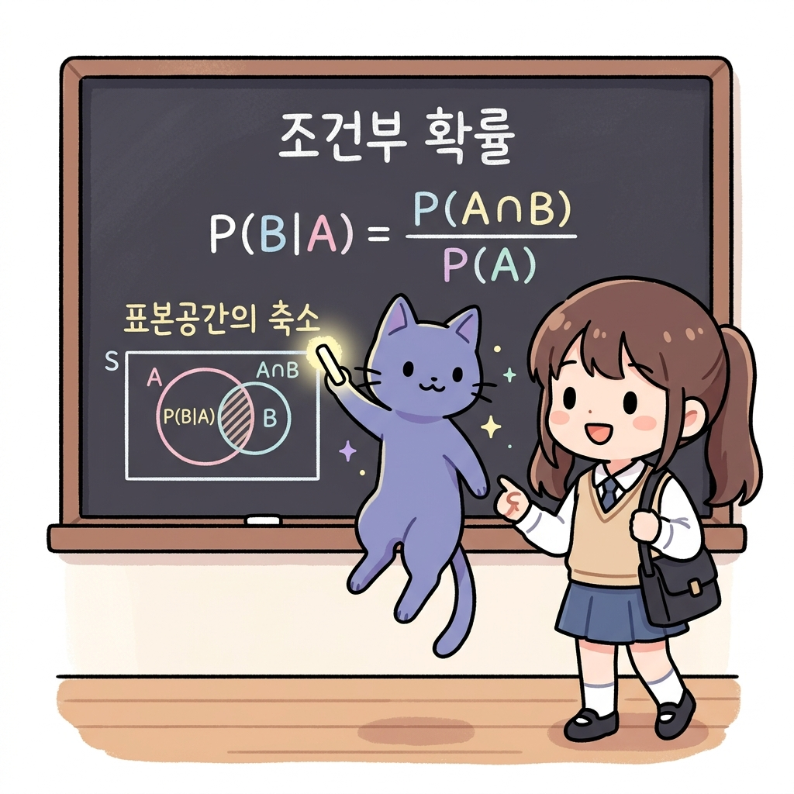
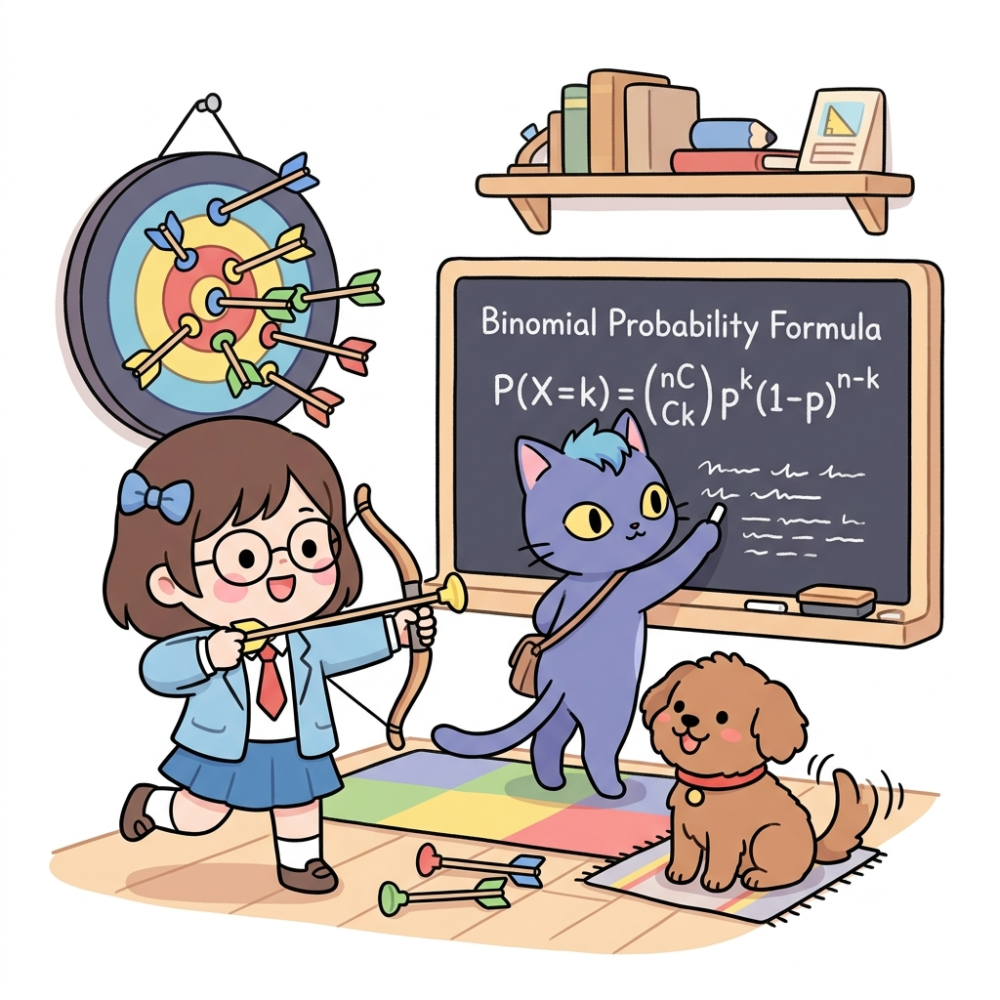
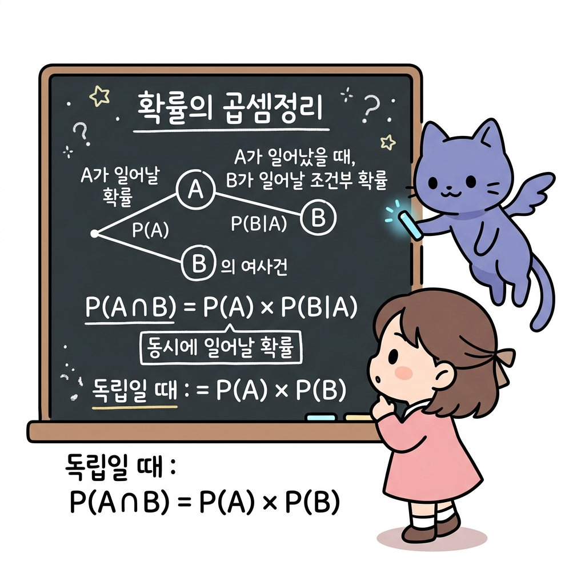
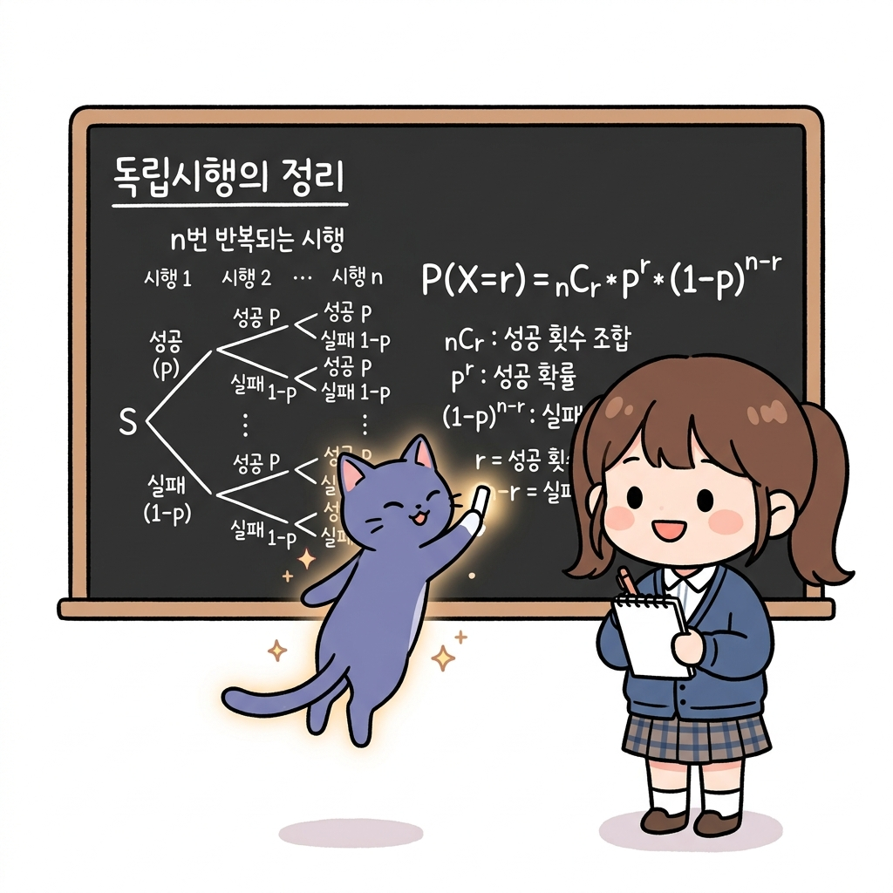
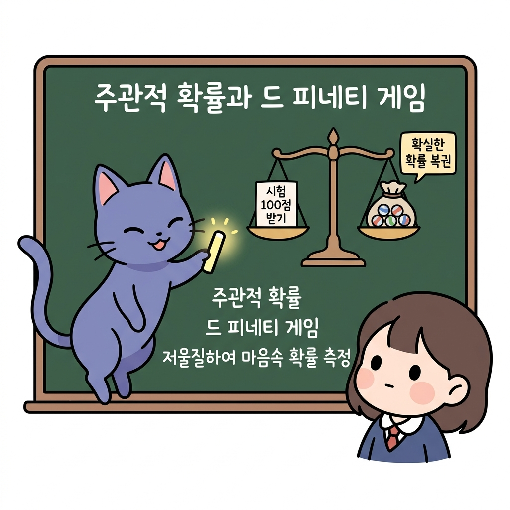
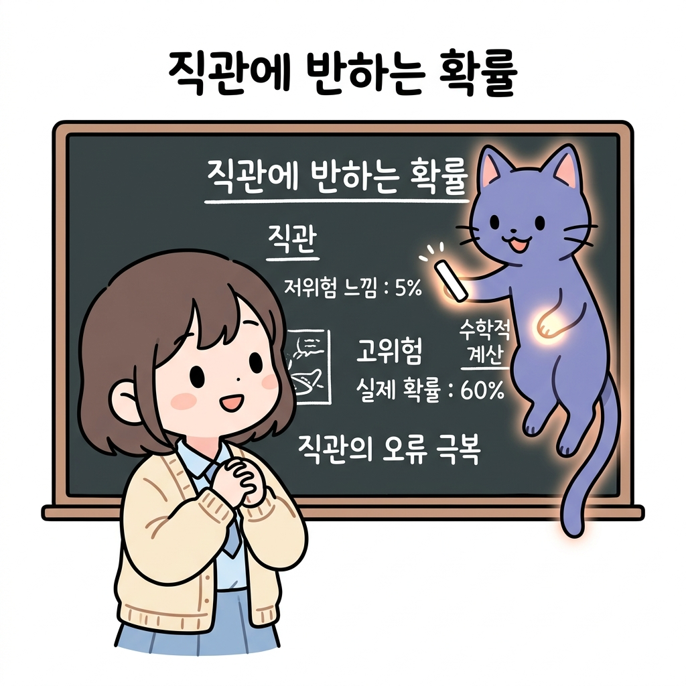
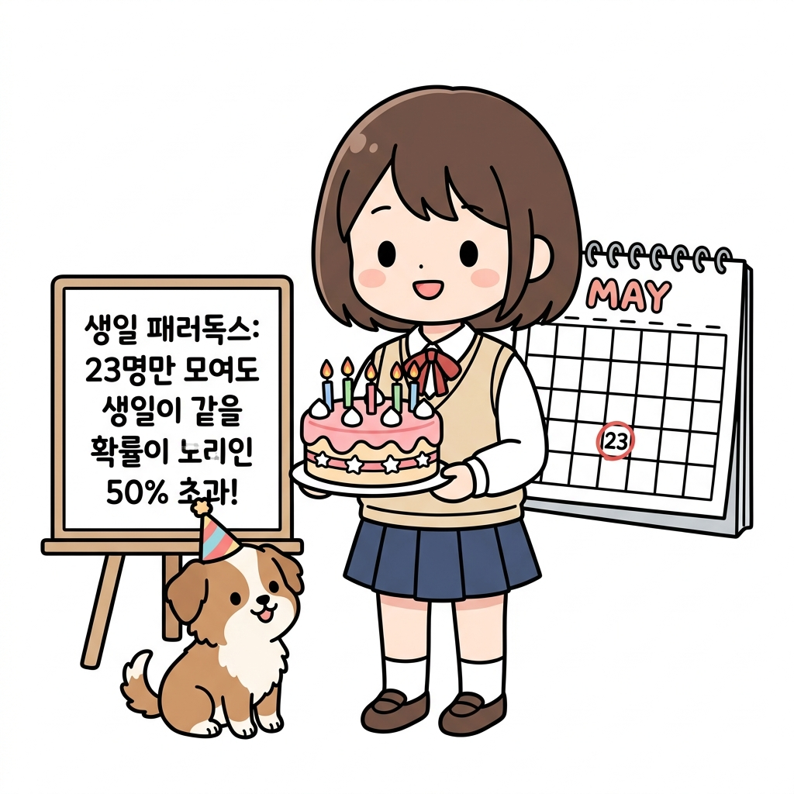
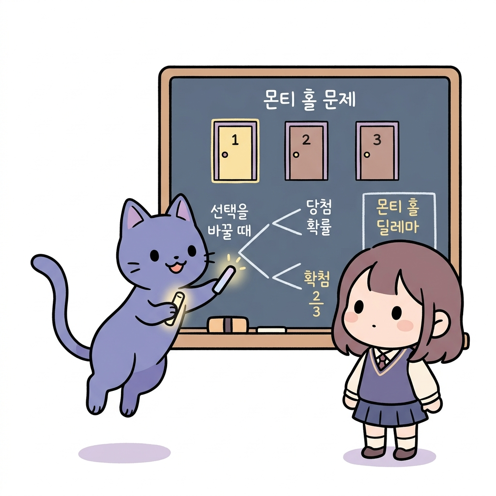

# 02.11 조건부 확률과 독립시행 (몬티 홀 & 생일 패러독스)

> 이 장에서는 **조건부 확률과 독립시행 (몬티 홀 & 생일 패러독스)**에 관한 기초부터 심화 개념들을 유기적으로 결합하여 학습합니다.

---

## 02.11.1 조건부 확률과 독립/종속 사건

**그림 02-11-1** 특정 조건 구역 A의 비를 돋보기로 보며 조건부 확률 P(B|A)를 설명해주는 지니와 도로시

어떤 사건이 이미 일어났다는 가정하에 다른 사건이 터질 비율인 **조건부 확률(*P*(*B*|*A*))**과, 두 사건의 연계 관계(독립/종속)를 배웁니다. 지니가 칠판에 적어준 조건부 영역 분석 공식과 도로시가 돋보기로 빗속에서 사과를 관찰하는 비유를 통해 조건부 확률의 진수를 깔끔하게 학습해봅시다!

---

### 1. 학습 목표
- **조건부 확률**의 정의와 표기법(*P*(*B*|*A*))을 이해하고 이를 계산할 수 있다.
- **독립사건**과 **종속사건**의 정의를 명확히 알고, 어떤 사건들이 독립인지 종속인지 수식으로 판별할 수 있다.
- 표(분할표)를 활용하여 실생활 조건부 확률 문제를 쉽게 구하는 방법을 익힌다.

---

### 2. 핵심 개념

#### (1) 조건부 확률 (Conditional Probability)
어떤 사건 *A*가 일어났다는 전제하에(가정했을 때) 사건 *B*가 일어날 확률을 **조건부 확률**이라 하고, 기호로 ***P*(*B*|*A*)**로 나타냅니다.
*P*(*B*|*A*) = *P*(*A* ∩ *B*) / *P*(*A*)    (단, *P*(*A*) > 0)
- **원리**: 조건 *A*가 주어짐에 따라, 관심 대상인 표본공간이 전체 *S*에서 사건 *A*로 축소(제한)됩니다. 따라서 *P*(*B*|*A*) = *n*(*A* ∩ *B*) / *n*(*A*)로도 계산할 수 있습니다.

**그림 02-11-2** 하늘에 구름이 낀 사전 조건(A)의 발생 유무에 따라 비가 올 확률(B)이 달라지는 조건부 확률 사례

* 오늘 비가 올 단순 확률은 30%이지만, 만약 '하늘에 구름이 잔뜩 껴 있다'는 조건(*A*)이 먼저 주어지면 비가 올 확률(*B*)은 80%로 달라질 수 있습니다. 조건부 확률 *P*(*B*|*A*)는 이처럼 **이전 조건의 발생에 따라 대상 확률이 업데이트되는 원리**를 설명해 줍니다.

#### (2) 독립사건과 종속사건
1. **독립사건 (Independent Events)**:
   사건 *A*가 일어나든 일어나지 않든, 사건 *B*가 일어날 확률에 아무런 영향을 주지 않을 때 두 사건 *A*, *B*는 서로 **독립**이라고 합니다.
   *P*(*B*|*A*) = *P*(*B*|*A**c*) = *P*(*B*)
    - *독립사건의 필요충분조건*:
      *P*(*A* ∩ *B*) = *P*(*A*) × *P*(*B*)

**그림 02-11-3** 한 시행의 결과가 다른 시행의 결과 확률에 아무런 간섭을 하지 않는 두 독립사건의 원리

2. **종속사건 (Dependent Events)**:
   한 사건이 일어나는 것이 다른 사건이 일어날 확률에 영향을 미칠 때, 즉 두 사건이 독립이 아닐 때 두 사건을 **종속**이라고 합니다.
    *P*(*B*|*A*) ≠ *P*(*B*)

**그림 02-11-4** 비복원추출처럼 이전 사건의 발생 여부에 따라 다음 사건의 확률이 변하여 종속되는 원리

---

### 3. 시각 자료: 조건부 확률의 표본공간 축소 원리

**그림 02-11-5** 조건 사건 A가 발생했을 때 전체 표본공간 S가 A로 좁혀지고, 그중 B의 비율(교집합)을 계산하는 조건부 확률 벤다이어그램

---

### 4. 실전 예제

#### 예제 1 (표를 이용한 조건부 확률 계산)
> **문제**: 볼풀장 안에 다음과 같이 300개의 공이 들어 있습니다.
> 
> | 구분 | 신상공 (*N*) | 구상공 (*O*) | 합계 |
> |:---:|:---:|:---:|:---:|
> | **빨간공 (*R*)** | 20 | 160 | 180 |
> | **파란공 (*B*)** | 80 | 40 | 120 |
> | **합계** | 100 | 200 | 300 |
> 
> 임의로 공을 1개 꺼냈더니 **파란 공**이었습니다. 이 공이 **신상공**일 확률 *P*(*N*|*B*)를 구하세요.
>
> **풀이 1 (축소된 경우의 수 이용)**:
> 파란 공이라는 조건이 주어졌으므로 전체 경우의 수는 파란 공의 총 개수인 120가지입니다. 이 중 신상공은 80가지이므로:
> *P*(*N*|*B*) = *n*(*N* ∩ *B*) / *n*(*B*) = 80 / 120 = 2 / 3
>
> **풀이 2 (공식 이용)**:
> - 전체 공 중에서 파란 공일 확률: *P*(*B*) = 120 / 300 = 2 / 5
> - 전체 공 중에서 신상 파란 공일 확률: *P*(*N* ∩ *B*) = 80 / 300 = 4 / 15
> - 공식 적용:
>   *P*(*N*|*B*) = *P*(*N* ∩ *B*) / *P*(*B*) = (4 / 15) / (2 / 5) = 4 / 15 × 5 / 2 = 2 / 3
> **정답**: 2 / 3

#### 예제 2 (독립과 종속의 판별)
> **문제**: 한 개의 주사위를 던질 때, 홀수의 눈이 나오는 사건을 *A* = {1, 3, 5}, 3 이상의 눈이 나오는 사건을 *B* = {3, 4, 5, 6}이라 합시다. 두 사건 *A*, *B*는 독립인가요, 종속인가요?
>
> **풀이**:
> - *P*(*A*) = 3 / 6 = 1 / 2
> - *P*(*B*) = 4 / 6 = 2 / 3
> - 두 사건의 곱사건: *A* ∩ *B* = {3, 5} ➔ *P*(*A* ∩ *B*) = 2 / 6 = 1 / 3
> - 두 확률의 곱 계산:
>   *P*(*A*) × *P*(*B*) = 1 / 2 × 2 / 3 = 1 / 3
> - 판별: *P*(*A* ∩ *B*) = *P*(*A*) × *P*(*B*) = 1 / 3이 성립하므로, 두 사건 *A*와 *B*는 서로 독립입니다.
> **정답**: 독립사건

---

### 5. 핵심 요약
1. **조건부 확률 *P*(*B*|*A*)**는 사건 *A*가 이미 일어났을 때 *B*가 발생할 확률로, 전체 영역(표본공간)이 **사건 *A*의 영역**으로 좁혀진다.
2. 두 사건이 서로 영향을 주고받지 않는다면 **독립사건**이고, 영향을 미친다면 **종속사건**이다.
3. 수식적으로 *P*(*A* ∩ *B*) = *P*(*A*) × *P*(*B*)가 성립하면 두 사건은 무조건 **독립**이다.

---

## 02.11.2 확률의 곱셈정리와 독립시행의 정리

**그림 02-11-6** 여러 번 화살을 쏘아 과녁을 맞추는 독립시행의 반복을 공식을 통해 설명해주는 지니와 도로시

서로 영향을 끼치지 않는 무작위 행동(시행)을 계속해서 반복할 때의 가짓수 법칙인 **독립시행의 정리**와 **곱셈정리**를 공부합니다. 활을 쏘아 과녁을 수차례 명중시키는 도로시의 양궁 연습 놀이와 칠판에 수식(*P*(*X*=*k*) = *n**C**k* · *p**k* · (1-*p*)*n*-*r*)을 아름답게 판서하며 설명해주는 지니의 가이드를 통해 완전히 학습해봅시다!

---

### 1. 학습 목표
- **확률의 곱셈정리**를 이해하고 종속사건과 독립사건의 경우에 맞추어 활용할 수   있다.
- **독립시행**의 뜻을 알고, **독립시행의 정리** 공식을 유도하고 문제에 적용할 수 있다.
- 여러 단계의 사건이 복합적으로 일어날 때의 확률을 구조적으로 계산한다.

---

### 2. 핵심 개념

#### (1) 확률의 곱셈정리 (Multiplication Theorem of Probability)
두 사건 *A*, *B*가 동시에 일어날 확률 *P*(*A* ∩ *B*)는 다음과 같이 조건부 확률을 활용하여 구합니다.
*P*(*A* ∩ *B*) = *P*(*A*) × *P*(*B*|*A*) = *P*(*B*) × *P*(*A*|*B*)
- **독립사건의 경우**:
  두 사건 *A*, *B*가 독립이면 *P*(*B*|*A*) = *P*(*B*)이므로 다음과 같이 간단한 곱으로 나타납니다.
  *P*(*A* ∩ *B*) = *P*(*A*) × *P*(*B*)

**그림 02-11-7** 두 사건이 연이어 일어날 확률(합사건)을 직전 사건의 조건부 확률과 곱하여 구하는 곱셈정리 원리

#### (2) 독립시행의 정리 (Theorem of Independent Trials)
매회 동일한 조건에서 반복되는 시행에서 각 시행의 결과가 서로 독립적인 시행을 **독립시행**이라고 합니다.
- **정리**:
  어떤 시행에서 사건 *A*가 일어날 확률이 *p* (단, 0 ≤ *p* ≤ 1)일 때, 이 시행을 독립적으로 *n*회 반복하는 독립시행에서 사건 *A*가 정확히 *r*회 일어날 확률은 다음과 같습니다.
  *P*(*X*=*r*) = *n**C**r* *p**r* (1-*p*)*n*-*r*    (*r* = 0, 1, 2, ..., *n*)
  - *n**C**r*: *n*번의 시행 중 사건 *A*가 일어날 *r*개의 위치(순서)를 선택하는 조합의 수
  - *p**r*: 사건 *A*가 *r*번 일어날 확률
  - (1-*p*)*n*-*r*: 나머지 (*n*-*r*)번 실패할 확률

**그림 02-11-8** 주사위 6의 눈이 나오는 사건처럼 매회 성공확률이 독립적으로 동일하게 주어지는 독립시행 예시

* 주사위를 한 번 던져서 6의 눈이 나오는 사건(*p* = 1 / 6)은 이전 시행들의 결과가 무엇이었든 전혀 영향을 받지 않고 매 던지기마다 독립적으로 유지됩니다. 이렇게 매회 확률이 똑같이 주어지는 사건을 여러 번 시도할 때 특정 횟수만큼 성공할 확률은 **독립시행의 정리** 공식(*n**C**r* *p**r* (1-*p*)*n*-*r*)을 사용해 깔끔하게 계산할 수 있습니다.

---

### 3. 시각 자료: 확률의 곱셈정리와 독립시행 도식

**그림 02-11-9** 반복 시행 중 r번 성공하고 n-r번 실패하는 사건의 조합 가짓수를 수형도와 식으로 나타낸 독립시행 정의도

---

### 4. 실전 예제

#### 예제 1 (비복원추출에서의 곱셈정리)
> **문제**: 주머니 속에 빨간 공 2개와 파란 공 3개가 들어 있습니다. 이 주머니에서 공을 한 개씩 연속해서 두 번 꺼낼 때(꺼낸 공은 다시 넣지 않음), 두 번 모두 빨간 공이 나올 확률을 구하세요.
>
> **풀이**:
> - 사건 *A*: 첫 번째에 빨간 공을 꺼내는 사건 ➔ *P*(*A*) = 2 / 5
> - 사건 *B*: 두 번째에 빨간 공을 꺼내는 사건
> 첫 번째 빨간 공을 뽑았으므로 남은 공은 빨간 공 1개와 파란 공 3개(총 4개)입니다.
> - 첫 번째 빨간 공이 나왔다는 전제하에 두 번째 빨간 공이 나올 확률: *P*(*B*|*A*) = 1 / 4
> - 곱셈정리에 따라 두 번 모두 빨간 공이 나올 확률은:
>   *P*(*A* ∩ *B*) = *P*(*A*) × *P*(*B*|*A*) = 2 / 5 × 1 / 4 = 1 / 10
> **정답**: 1 / 10 (꺼낸 공을 다시 넣는 **복원추출**이라면 독립사건이 되므로 2 / 5 × 2 / 5 = 4 / 25가 됩니다.)

#### 예제 2 (독립시행의 정리 - 시험 문제 찍기)
> **문제**: 오지선다형(5개의 보기 중 정답이 1개) 객관식 문제 5개가 있습니다. 이 중 임의로 답을 적어 넣을(찍을) 때, 정확히 2문제를 맞힐 확률을 구하세요.
>
> **풀이**:
> 각 문제를 맞히는 시행은 정답률 *p* = 1 / 5인 독립시행이며, 총 *n*=5번 반복합니다. 이 중 *r*=2번 맞힐 확률은 독립시행의 정리를 이용합니다.
> - 식: 5*C*2 × (1 / 5)2 × (1 - 1 / 5)5-2
> - 계산:
>   10 × (1 / 25) × (4 / 5)3 = 10 × 1 / 25 × 64 / 125 = 128 / 625 ≈ 0.2048
> **정답**: 128 / 625 (20.48%)

---

### 5. 핵심 요약
1. **곱셈정리**는 두 사건이 연속해서(동시에) 발생할 때, 순차적인 조건부 확률의 곱 ***P*(*A*) × *P*(*B*|*A*)**로 해결한다.
2. 두 사건이 **독립사건**일 때는 조건부 확률을 고민할 필요 없이 각 확률을 단순 곱하면 된다: ***P*(*A*) × *P*(*B*)**.
3. 동일한 조건의 확률 *p*가 독립적으로 *n*회 반복될 때 특정 횟수 *r*번 성공할 확률은 **독립시행의 정리 (*n**C**r* *p**r* (1-*p*)*n*-*r*)**로 구한다.

---

## 02.11.3 생활 속의 확률과 직관의 오류

**그림 02-11-10** 세 개의 굳게 닫힌 몬티 홀 마법의 문 앞에서 선택을 바꾸는 전략의 유불리를 토론하는 지니와 도로시

인간의 본능적인 느낌이 실제 정밀한 수학 계산과 어떻게 어긋나는지 **직관의 오류**와 실생활 확률(생일 패러독스, 몬티 홀 문제 등)을 알아봅니다. 요정 지니가 2번 문을 슬며시 열어 염소(꽝)를 보여주며 도로시에게 1번과 3번 문 중 어느 쪽을 택하는 것이 진정한 잭팟(자동차)의 기댓값을 높이는지 물어보는 몬티 홀 퍼즐을 통해, 조건부 확률의 매혹적인 세계관을 함께 정리해봅시다!

---

### 1. 학습 목표
- 실생활의 여러 현상(도전, 만남, 게임 등) 속에서 어떻게 확률이 작동하는지 알아본다.
- 우리의 직관적인 확률 판단이 실제 계산 결과와 어떻게 다른지(직관의 오류) 배운다.
- **몬티 홀 문제**와 **생일 패러독스**를 통해 조건부 확률과 여사건의 유용성을 체득한다.

---

### 2. 핵심 개념

#### (1) 주관적 확률과 드 피네티 게임 (De Finetti Game)
- **주관적 확률**: 사람들이 직관적으로 느끼는 일어날 가능성입니다. (예: "내일 우승할 확률이 99%다")
- **드 피네티 게임**: 주관적 확률을 정량적인 객관적 확률로 바꾸어 파악하는 게임입니다.
  - *방법*: 확실한 확률을 가진 복권(예: 빨간 공이 *x*개인 주머니)과 주관적 예측 사건(예: 수학 100점 받기)을 저울질하게 하여, 어느 시점에서 선택이 바뀌는지를 찾아 실제 마음속의 예상 확률을 측정합니다.

**그림 02-11-11** 마음속의 직관적 가능성을 정량화된 수치로 측정해내는 드 피네티 게임의 저울질 모델

#### (2) 직관에 반하는 확률 모델들

**그림 02-11-12** 직관적인 주관적 느낌(5%)과 정밀한 수학적 계산(60%) 사이의 괴리 현상과 직관 극복 모델

#### 1) 몬티 홀 딜레마 (Monty Hall Problem)
- **상황**: 3개의 문 중 하나 뒤에는 자동차가 있고, 나머지 둘 뒤에는 염소(꽝)가 있습니다. 참가자가 문을 하나 고른 후, 사회자가 남은 두 문 중 염소가 있는 문 하나를 열어 보여줍니다. 이때 참가자는 선택을 바꾸는 것이 유리할까요?
- **진실**: 선택을 **바꾸는 것이 2배 유리**합니다.
  - 처음 선택한 문에 자동차가 있을 확률: 1 / 3
  - 남은 문에 자동차가 있을 확률: 2 / 3 (사회자가 꽝인 문을 열어 제거해 줬으므로 남은 한 개의 문이 2 / 3의 확률을 전부 상속받음)

#### 2) 생일 패러독스 (Birthday Paradox)
- **상황**: 한 반에 20명의 학생이 있을 때, 생일이 같은 학생이 적어도 한 쌍 이상 있을 확률은 얼마나 될까요?
- **진실**: 직관적으로는 매우 드문 일처럼 보이지만, 실제 계산해 보면 약 **60.6%**로 절반이 넘는 높은 확률을 보입니다.

**그림 02-11-13** 20명 모인 집단에서 여사건을 적용하여 생일이 같은 쌍이 존재할 확률(60.6%)을 유도하는 직관 파괴 현상

* 20명이 모인 교실에서 생일이 같은 두 사람이 있을 확률은 우리의 일반적인 직관(20 / 365 ≈ 5.4%)을 완전히 깨트리고, 여사건의 누적 곱셈 연산을 통해 **무려 60.6%라는 압도적으로 높은 확률**을 보입니다. 이처럼 직관에만 의존하는 확률 판단은 심각한 오류를 낳을 수 있으므로 수학적 검증이 중요합니다.

---

### 3. 시각 자료: 몬티 홀 딜레마와 생일 패러독스의 직관 오류 분석

**그림 02-11-14** 몬티 홀 퍼즐에서 3개 선택지 중 하나를 버린 후 선택 변경 시 승리 기대 확률이 2/3로 상승함을 분석한 분개도

---

### 4. 실전 예제

#### 예제 1 (생일 패러독스 계산)
> **문제**: 20명의 사람이 한 방에 모여 있을 때, 생일이 같은 사람이 적어도 1쌍 이상 존재할 확률의 계산식을 세우고 그 결과를 설명하세요. (단, 1년은 365일로 가정하고 윤년은 고려하지 않음)
>
> **풀이**:
> '생일이 같은 사람이 적어도 1쌍 이상 있을 사건'의 여사건은 '20명 모두의 생일이 서로 다를 사건'입니다.
> - 20명의 생일이 모두 다를 확률:
>   *P*(모두 다름) = 365*P*20 / 36520 = (365 × 364 × 363 × ... × 346) / 36520
> - 여사건의 성질을 이용하여 적어도 1쌍의 생일이 같을 확률 *P*를 구합니다:
>   *P* = 1 - *P*(모두 다름) = 1 - 365*P*20 / 36520 ≈ 0.606 (60.6%)
> **결론**: 생일이 같은 사람이 존재할 확률이 60.6%나 되므로, 20명만 모여도 생일이 같은 사람이 나올 가능성이 그렇지 않을 가능성보다 큽니다.
> **정답**: 60.6%

#### 예제 2 (로또의 수학적 당첨 확률)
> **문제**: 1부터 45까지의 숫자 중 순서와 관계없이 서로 다른 6개의 숫자를 선택하는 로또 1등에 당첨될 확률을 계산식으로 표현하세요.
>
> **풀이**:
> 전체 조합의 수 중에서 1등 당첨 번호 세트는 단 1개뿐입니다.
> - 전체 번호 선택 조합의 수: 45*C*6
> - 1등 당첨 확률 *P*는:
>   *P* = 1 / 45*C*6 = 1 / 8,145,060
> **결론**: 로또 1등 당첨 확률은 약 814만 분의 1(대략 0.000012%)로, 번개에 맞을 확률보다 낮습니다.
> **정답**: 1 / 45*C*6

---

### 5. 핵심 요약
1. 확률은 실생활에서 발생하는 수많은 우연의 메커니즘을 객관적으로 분석해 주는 강력한 **의사결정 도구**이다.
2. 몬티 홀 문제나 생일 패러독스처럼 사람의 **직관(주관적 확률)**은 실제 **객관적 확률**과 다를 수 있으므로, 항상 엄밀한 수학적 계산을 통해 판단을 바로잡아야 한다.
3. 아무리 낮은 확률의 사건이라도 독립적으로 수없이 많이 반복한다면 언젠가는 실현된다. 다만 복권이나 도박처럼 대가를 지불해야 하는 경우에는 계산상 무조건 손실을 입게 됨을 잊지 말아야 한다.
