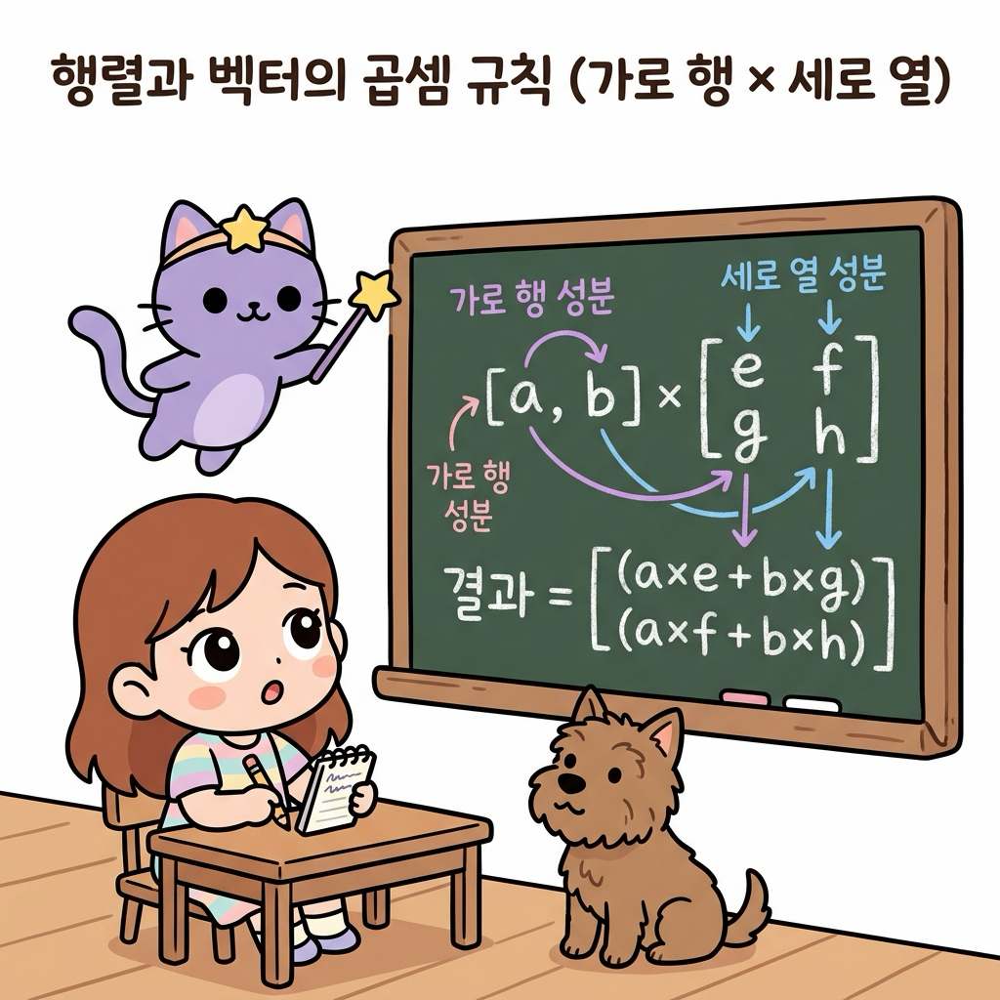

# 02.12 행동과 상태 전이를 묶는 행렬의 기초

> 이 장에서는 복잡한 다중 상태 전이 확률을 사각형 격자 상자에 담아내는 **행렬(Matrix)**과 **벡터(Vector)**의 정의를 배우고, **행렬-벡터 곱셈 연산 메커니즘**을 마스터하여 마르코프 체인(Markov Chain)과 강화학습 상태 전이 모델의 강력한 선형대수적 표현력을 체득합니다.


---

## 02.12.1 상태들의 지도를 한 상자에 담는 행렬의 연금술

강화학습의 격자 세상이나 마르코프 의사결정 과정(MDP)에서 환경의 방(상태)이 10개, 100개로 늘어나면, 각 상태 사이의 조건부 전이 확률을 수식으로 하나하나 나열하기가 불가능해집니다.

"지니! 에이전트가 탐험할 수 있는 방이 10개로 늘어나니까, 방마다 어디로 미끄러질지 적어놓은 화살표와 확률 숫자들이 너무 복잡하게 엉켜버렸어! 이걸 깔끔하게 가방 하나에 쏙 정리하는 마법 상자는 없을까?"

도로시가 방마다 복잡하게 얽혀 있는 전이 확률 지도책을 넘기며 한숨을 폭 쉬었습니다. 토토도 지도 위에 털썩 주저앉아 곤란한 표정을 지었습니다. 지니가 허공에서 반짝이는 격자 모양의 요술 가방을 꺼내 보였습니다.


**그림 02-12-1** 수많은 상태 사이의 전이 확률들을 바둑판 모양의 칸(가로 행, 세로 열)에 일목요연하게 정리하는 행렬 상자의 개념을 살펴보는 지니와 도로시, 토토

"도로시! 수학에는 수많은 숫자 데이터를 사각형 바둑판 칸에 질서정연하게 배열하여 단 한 줄의 식으로 연산하는 아주 강력한 도구가 있단다. 바로 **행렬(Matrix)**과 **벡터(Vector)**야. 복잡한 수백 개의 전이 확률을 이 상자 안에 넣어두면, 단 한 번의 곱셈으로 미래의 모든 상태 확률 분포를 깔끔하게 계산해낼 수 있지!"

---

### 2.12.1.1 행렬과 벡터의 구조

* **행렬(Matrix)**: 수나 문자를 직사각형 모양으로 배열하여 괄호(대괄호)로 묶은 것입니다.
  - **행(Row, 가로줄)**: 행렬의 가로 방향 줄
  - **열(Column, 세로줄)**: 행렬의 세로 방향 줄
  - *M*개의 행과 *N*개의 열을 가진 행렬을 **_M × N_ 행렬**이라 부릅니다.
* **벡터(Vector)**: 단 한 줄로만 이루어진 특수한 행렬입니다.
  - **행 벡터(Row Vector)**: 가로로 1줄만 있는 $1 \times N$ 벡터 (예: 현재 상태 확률 분포)
  - **열 벡터(Column Vector)**: 세로로 1줄만 있는 $M \times 1$ 벡터

---

## 02.12.2 행렬과 벡터의 곱셈 연산 메커니즘

행렬 곱셈은 앞 벡터(또는 행렬)의 **가로줄(행)** 성분들과 뒤 행렬의 **세로줄(열)** 성분들을 순서대로 짝지어 곱한 뒤, 그 결과들을 모두 더하여 합산(내적)하는 규칙을 따릅니다.


**그림 02-12-2** 행 벡터의 가로 행 성분과 전이 행렬의 세로 열 성분을 차례대로 짝지어 곱한 뒤 모두 더해주는 행렬-벡터 곱셈의 연산 메커니즘

$$
\mathbf{x} \mathbf{P} = \begin{bmatrix} a & b \end{bmatrix} \begin{bmatrix} e & f \\ g & h \end{bmatrix} = \begin{bmatrix} (a \times e + b \times g) & (a \times f + b \times h) \end{bmatrix}
$$

* **곱셈의 성립 조건**: 앞 행렬의 **열 개수**와 뒤 행렬의 **행 개수**가 반드시 일치해야 합니다. ($1 \times 2$ 벡터 $\times$ $2 \times 2$ 행렬 ➔ $1 \times 2$ 결과 벡터)

---

## 02.12.3 마르코프 체인과 상태 전이 확률 행렬

강화학습의 핵심 뼈대인 마르코프 체인(Markov Chain)에서 상태 전이 확률 행렬을 통해 미래 확률을 예측하는 실전 과정을 살펴봅니다.

### 2.12.3.1 날씨 상태 전이 모델
어느 마법 마을의 날씨 상태가 **[맑음, 비]** 2가지만 존재한다고 가정합니다.

1. **상태 전이 확률 행렬 $\mathbf{P}$**:
$$
\mathbf{P} = \begin{bmatrix} 0.7 & 0.3 \\ 0.4 & 0.6 \end{bmatrix}
$$
   - 1행: 오늘 맑음일 때 ➔ 내일 맑을 확률 0.7, 내일 비 올 확률 0.3
   - 2행: 오늘 비일 때 ➔ 내일 맑을 확률 0.4, 내일 비 올 확률 0.6
   - **중요 성질**: 각 행의 원소들의 합은 항상 **1.0(100%)**입니다.

2. **오늘의 날씨 확률분포 벡터 $\mathbf{x}_0$**:
$$
\mathbf{x}_0 = \begin{bmatrix} 0.6 & 0.4 \end{bmatrix} \quad (\text{오늘 맑을 확률 } 60\%, \text{비 올 확률 } 40\%)
$$


**그림 02-12-3** 오늘의 확률분포 벡터(x₀)와 전이 확률 행렬(P)을 단 한 번 곱하여 내일의 날씨 확률분포(맑음 58%, 비 42%)를 도출하는 마르코프 체인 연산

---

### 2.12.3.2 1단계 및 다단계 상태 전이 계산

내일 날씨의 확률분포 $\mathbf{x}_1$은 행렬 곱셈 한 번으로 가뿐히 계산됩니다.

$$
\mathbf{x}_1 = \mathbf{x}_0 \mathbf{P} = \begin{bmatrix} 0.6 & 0.4 \end{bmatrix} \begin{bmatrix} 0.7 & 0.3 \\ 0.4 & 0.6 \end{bmatrix}
$$

* **내일 맑을 확률 (1번째 원소)**:
$$
0.6 \times 0.7 + 0.4 \times 0.4 = 0.42 + 0.16 = \mathbf{0.58}\ (58\%)
$$
* **내일 비 올 확률 (2번째 원소)**:
$$
0.6 \times 0.3 + 0.4 \times 0.6 = 0.18 + 0.24 = \mathbf{0.42}\ (42\%)
$$
* **내일 날씨 벡터**: $\mathbf{x}_1 = \begin{bmatrix} 0.58 & 0.42 \end{bmatrix}$

"와! 모레 날씨 $\mathbf{x}_2$를 구하고 싶으면 $\mathbf{x}_1 \mathbf{P} = \mathbf{x}_0 \mathbf{P}^2$로 행렬만 거듭제곱하면 되네! 수많은 단계의 미래 상태도 행렬의 거듭제곱으로 단숨에 풀리는구나!"

도로시가 감탄하며 노트를 정리했습니다.

---

## 02.12.4 파이썬 NumPy로 구현하는 상태 전이 시뮬레이터

파이썬의 선형대수 표준 라이브러리인 `numpy`를 활용하여 상태 전이 행렬의 곱셈과 장기적 정상 상태(Stationary Distribution) 수렴을 확인합니다.

```python
import numpy as np

# 1. 오늘 날씨 상태 확률분포 벡터 x0 (맑음 60%, 비 40%)
x0 = np.array([0.6, 0.4])

# 2. 상태 전이 확률 행렬 P
# 행 0: 오늘 맑음 -> [내일 맑음 0.7, 내일 비 0.3]
# 행 1: 오늘 비     -> [내일 맑음 0.4, 내일 비 0.6]
P = np.array([
    [0.7, 0.3],
    [0.4, 0.6]
])

print("=== 마르코프 체인 상태 전이 계산 ===")
print("오늘 날씨 분포 (x0):", x0)

# 1일 후 내일 날씨 x1 = x0 @ P
x1 = np.dot(x0, P)
print(f"1일 후 날씨 분포 (x1): 맑음 {x1[0]:.4f}, 비 {x1[1]:.4f}")

# 2일 후 모레 날씨 x2 = x1 @ P = x0 @ P^2
x2 = np.dot(x1, P)
print(f"2일 후 날씨 분포 (x2): 맑음 {x2[0]:.4f}, 비 {x2[1]:.4f}")

# 10일 후 장기 정상 상태 분포 x10
x_current = x0.copy()
for day in range(1, 11):
    x_current = np.dot(x_current, P)

print(f"\n10일 후 수렴 분포 (x10): 맑음 {x_current[0]:.4f}, 비 {x_current[1]:.4f}")
print(f"이론적 정상 분포 (4/7, 3/7): 맑음 {4/7:.4f}, 비 {3/7:.4f}")
```

```text
[실행 결과]
=== 마르코프 체인 상태 전이 계산 ===
오늘 날씨 분포 (x0): [0.6 0.4]
1일 후 날씨 분포 (x1): 맑음 0.5800, 비 0.4200
2일 후 날씨 분포 (x2): 0.5740, 비 0.4260

10일 후 수렴 분포 (x10): 맑음 0.5714, 비 0.4286
이론적 정상 분포 (4/7, 3/7): 맑음 0.5714, 비 0.4286
```

> **💡 코드 해석**: 날이 지날수록 날씨 확률 분포는 초기 조건(맑음 60%)과 상관없이 시스템 고유의 고정점인 **정상 상태 분포($\approx [0.5714, 0.4286]$)**로 수렴합니다. 이는 강화학습에서 정책(Policy)이 수렴할 때의 장기 정상 상태 분석에 핵심적으로 활용됩니다.

---

## 02.12.5 실전 예제

학습한 내용을 바탕으로 다음 문제를 직접 해결해 봅시다.


### 2.12.5.1 문제 1 (2×2 행렬-벡터 곱셈 계산)

> 현재 에이전트의 위치 확률분포 벡터 $\mathbf{x} = \begin{bmatrix} 0.5 & 0.5 \end{bmatrix}$ 와 이동 전이 행렬 $\mathbf{P} = \begin{bmatrix} 0.8 & 0.2 \\ 0.3 & 0.7 \end{bmatrix}$ 의 행렬 곱 $\mathbf{x} \mathbf{P}$를 계산하시오.
>
> **풀이**:
> 가로 행 성분과 세로 열 성분의 내적을 전개합니다:
> 1. 결과의 1번째 원소 (다음 상태가 1번 방일 확률):
$$
0.5 \times 0.8 + 0.5 \times 0.3 = 0.40 + 0.15 = \mathbf{0.55}
$$
> 2. 결과의 2번째 원소 (다음 상태가 2번 방일 확률):
$$
0.5 \times 0.2 + 0.5 \times 0.7 = 0.10 + 0.35 = \mathbf{0.45}
$$
>
> **정답**: $\begin{bmatrix} 0.55 & 0.45 \end{bmatrix}$

---

### 2.12.5.2 문제 2 (2단계 후 상태 전이 확률 계산)

> 문제 1의 시스템에서 2단계 후의 상태 확률분포 벡터 $\mathbf{x}_2$를 구하시오.
>
> **풀이**:
> 1단계 결과 벡터 $\mathbf{x}_1 = \begin{bmatrix} 0.55 & 0.45 \end{bmatrix}$ 에 전이 행렬 $\mathbf{P}$를 한 번 더 곱합니다:
> 1. 1번째 원소:
$$
0.55 \times 0.8 + 0.45 \times 0.3 = 0.44 + 0.135 = \mathbf{0.575}
$$
> 2. 2번째 원소:
$$
0.55 \times 0.2 + 0.45 \times 0.7 = 0.11 + 0.315 = \mathbf{0.425}
$$
>**정답**: $\begin{bmatrix} 0.575 & 0.425 \end{bmatrix}$


---


## 02.12.6 핵심 요약


**그림 02-12-4** 행렬의 가로 행과 세로 열 구조, 가로×세로 행렬 곱셈 연산법, 마르코프 체인의 상태 전이 방정식 $\mathbf{x}_1 = \mathbf{x}_0 \mathbf{P}$를 완벽히 마스터한 도로시와 지니, 토토


1. **행렬과 벡터**: 행렬은 수치를 가로(행)와 세로(열)로 배열한 직사각형 상자이며, 상태 확률 분포는 1줄짜리 **행 벡터**로 표현한다.
2. **행렬 곱셈 규칙**: 앞 행렬의 **가로(행)** 성분과 뒤 행렬의 **세로(열)** 성분을 순서대로 곱해 모두 더해주는 내적 방식을 따른다.
3. **상태 전이 방정식**: 현재 확률분포 $\mathbf{x}_0$에 전이 확률 행렬 $\mathbf{P}$를 곱하면 다음 상태의 확률분포 **$\mathbf{x}_1 = \mathbf{x}_0 \mathbf{P}$**가 단 한 줄로 도출된다.
4. **강화학습과의 연계**: 수많은 복잡한 상태 전이와 보상 구조를 선형대수의 행렬 연산으로 추상화하여 대규모 환경에서도 고속 벡터 연산을 가능하게 한다.
