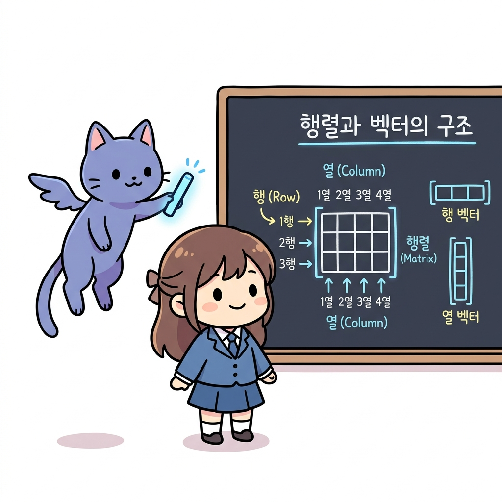
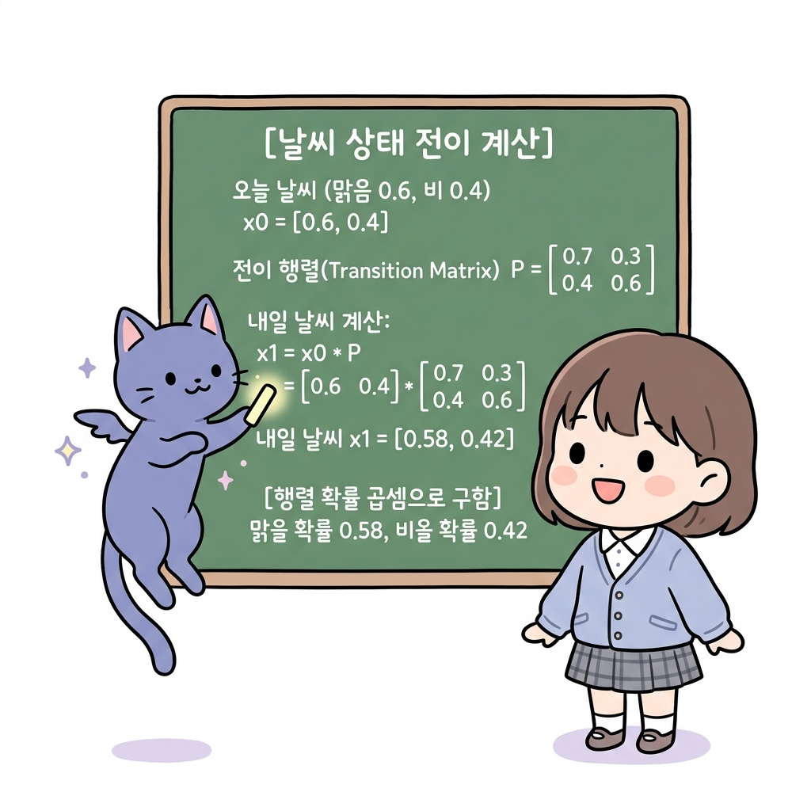
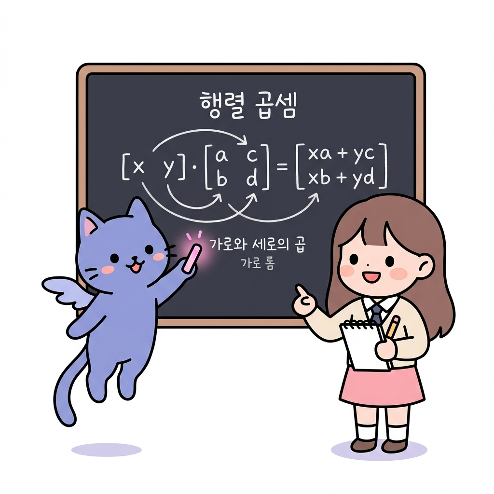

# 02.12 행동과 상태 전이를 묶는 행렬의 기초

> 이 장에서는 숫자들을 사각형 바둑판 모양으로 배열한 **행렬(Matrix)**과 한 줄로 세운 **벡터(Vector)**의 정의를 배우고, 행렬과 벡터의 곱셈 규칙을 마스터하여 마르코프 체인과 상태 전이를 완벽하게 표현하는 힘을 기릅니다.

---

## 02.12.1 상태들의 지도를 한 상자에 담는 행렬의 연금술

**그림 02-12-1** 가로줄(행)과 세로줄(열)이 있는 격자 마법 상자(행렬)를 열어, 확률 벡터와의 곱셈 규칙을 신나게 그려 설명해 주는 지니와 도로시

마르코프 과정이나 강화학습 격자판에서 상태들의 개수가 10개, 100개로 늘어나면 수많은 조건부 확률 식들을 일일이 받아 적기 벅찹니다. 숫자들을 바둑판 칸막이에 담아 한꺼번에 요리하는 **행렬**과 **벡터**를 사용하면, 복잡한 전이 시스템을 단 한 줄의 깔끔한 곱셈 식으로 압축할 수 있습니다. 지니의 행렬 곱셈 칠판 가이드를 보며 선형대수의 기초 징검다리를 가뿐히 건너봅시다!

---

### 1. 학습 목표
- 행렬(Matrix)과 벡터(Vector)의 정의와 행(Row), 열(Column)의 개념을 안다.
- 행렬과 벡터의 곱셈(Matrix-Vector Multiplication) 연산 규칙을 이해하고 손으로 계산할 수 있다.
- 상태 확률분포 벡터와 전이 확률 행렬을 사용해 다음 단계의 확률 분포를 유도할 수 있다.

---

### 2. 핵심 개념

#### (1) 행렬(Matrix)과 벡터(Vector)의 구조
- **행렬**: 수나 문자를 가로(행, Row)와 세로(열, Column)의 직사각형 모양으로 나열하고 괄호로 묶은 것입니다.
  - 가로 방향 줄을 **행(Row)**, 세로 방향 줄을 **열(Column)**이라고 부릅니다.
  - *예시*: 아래는 2개의 행과 2개의 열로 이루어진 2×2 행렬입니다.
    **P** = [ *p*11  *p*12 ; *p*21  *p*22 ]
- **벡터**: 행렬에서 행이나 열이 단 한 줄만 있는 특수한 행렬입니다.
  - 가로로 한 줄이면 **행 벡터 (Row Vector)**, 세로로 한 줄이면 **열 벡터 (Column Vector)**라고 부릅니다.
  - *강화학습 연계*: 현재 에이전트가 서 있을 수 있는 각 상태의 확률을 담은 1×*N* 행 벡터를 **상태 확률분포 벡터**라고 합니다. (예: 현재 맑음일 확률 0.6, 비일 확률 0.4 ➔ **x** = [0.6  0.4])

**그림 02-12-2** 수식 지도에서 가로(행)와 세로(열)를 격자판으로 배치한 행렬과 한 줄짜리 벡터의 기하학적 구조

#### (2) 행렬과 벡터의 곱셈 규칙 (Multiplication Rule)
앞 행렬의 **가로줄(행)**과 뒤 벡터의 **세로줄(열)**의 원소들을 순서대로 짝을 지어 곱한 뒤, 그 결과들을 모두 더합니다.
- **공식 (2×2 행렬과 2×1 열 벡터의 곱)**:
  [ *a*  *b* ; *c*  *d* ] * [ *x* ; *y* ] = [ *a**x* + *b**y* ; *c**x* + *d**y* ]
- **공식 (1×2 행 벡터와 2×2 행렬의 곱)**:
  [ *x*  *y* ] * [ *a*  *b* ; *c*  *d* ] = [ *x**a* + *y**c*  *x**b* + *y**d* ]

**그림 02-12-3** 가로줄 성분과 세로줄 성분을 순차 짝지어 곱하여 단계별로 누적 합산하는 행렬 곱셈의 정석 규칙

#### (3) 마르코프 체인 상태 전이 계산의 실전 사례
마르코프 체인의 날씨 예제 전이 행렬 **P**가 다음과 같고:
**P** = [ 0.7  0.3 ; 0.4  0.6 ]
오늘 날씨 확률분포 벡터 **x**0 = [ 0.6  0.4 ] (맑음 확률 60%, 비 확률 40%) 일 때,
**내일 날씨의 확률분포 벡터 x1**은 다음과 같이 행렬 곱셈 한 번으로 끝납니다:
**x**1 = **x**0 * **P**
**x**1 = [ 0.6  0.4 ] * [ 0.7  0.3 ; 0.4  0.6 ]
- 1번째 원소(내일 맑을 확률):
  0.6 * 0.7 + 0.4 * 0.4 = 0.42 + 0.16 = **0.58**
- 2번째 원소(내일 비가 올 확률):
  0.6 * 0.3 + 0.4 * 0.6 = 0.18 + 0.24 = **0.42**
결과 벡터: **x**1 = [ 0.58  0.42 ]
- *해설*: 오늘 날씨의 기댓값을 행렬 연산으로 한 번에 통과시켜 내일 날씨 확률(맑음 58%, 비 42%)을 얻어냈습니다.

**그림 02-12-4** 오늘의 기댓값 벡터와 전이 확률 행렬을 선형 결합하여 내일의 기댓값 벡터를 연산하는 상태 전이의 실전 사례

---

### 3. 시각 자료: 행렬 곱셈의 연산 흐름 매칭 구조도

**그림 02-12-5** 앞 행 벡터의 열과 뒤 행렬의 행들이 교차 매칭 곱셈되어 결과 벡터를 형성하는 선형대수 연산 흐름도

---

### 4. 실전 예제

#### 예제 1 (행렬 곱셈)
> **문제**: 다음 상태 확률분포 벡터 **x** = [ 0.5  0.5 ] 와 상태 전이 확률 행렬 **P** = [ 0.8  0.2 ; 0.3  0.7 ] 의 곱 **x * P**를 계산하시오.
>
> **풀이**:
> 행렬과 벡터의 곱셈을 전개합니다:
> - 결과의 1번째 원소:
>   0.5 * 0.8 + 0.5 * 0.3 = 0.40 + 0.15 = 0.55
> - 결과의 2번째 원소:
>   0.5 * 0.2 + 0.5 * 0.7 = 0.10 + 0.35 = 0.45
>
> 따라서 곱의 결과 벡터는 [ 0.55  0.45 ] 입니다.
> **정답**: [ 0.55  0.45 ]

---

### 5. 핵심 요약
1. **행렬**은 가로줄(행)과 세로줄(열)을 배열한 수치 표이며, **벡터**는 행이나 열이 1개인 단순화된 형태이다.
2. 행렬 곱셈은 가로와 세로의 성분들을 각각 짝을 맞추어 곱해준 뒤 모두 합산하여 결과를 얻는다.
3. 선형대수의 행렬 곱셈 식을 활용하면, 강화학습의 대규모 전이 확률과 확률분포 예측을 단 하나의 간결한 연산 식으로 깔끔하게 정리해낼 수 있다.
