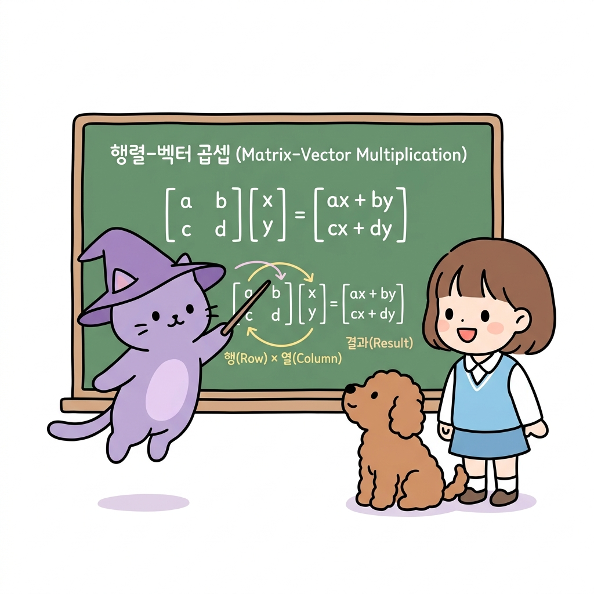
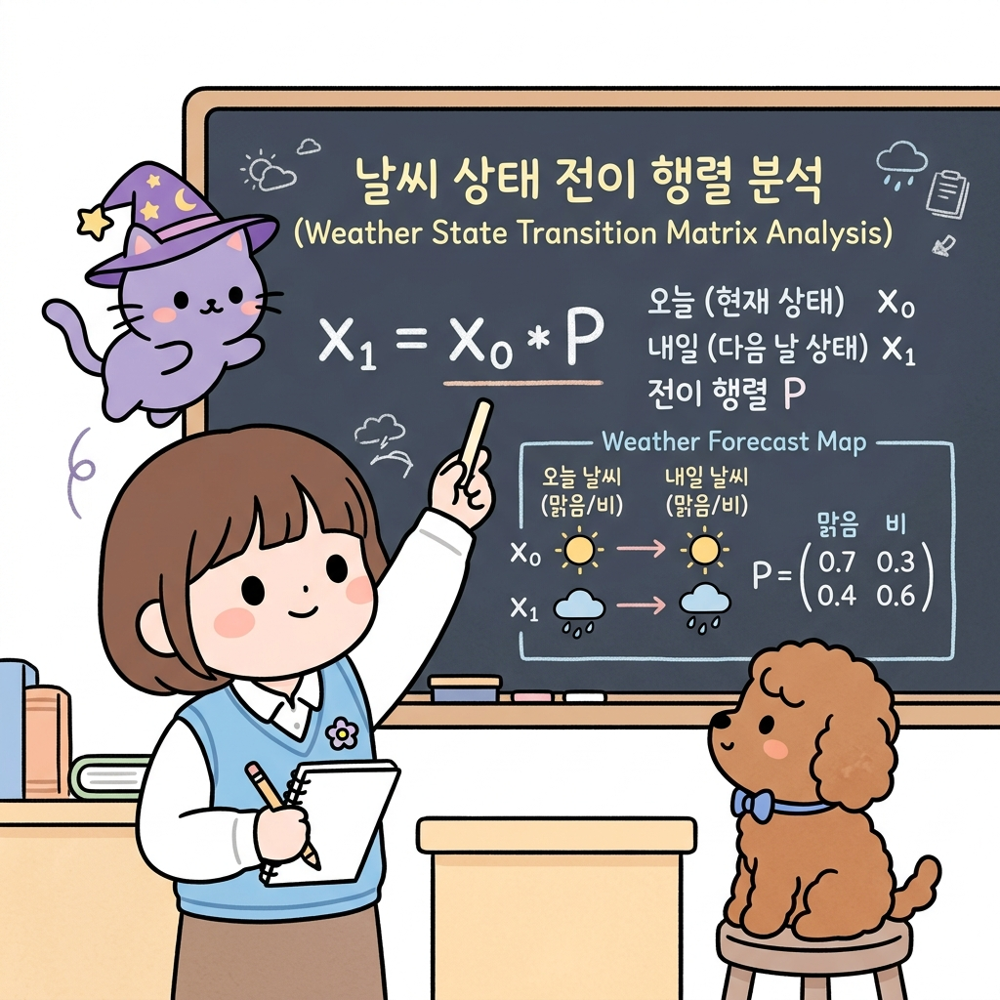

# 02.12 행동과 상태 전이를 묶는 행렬의 기초

> 이 장에서는 숫자들을 사각형 바둑판 모양으로 배열한 **행렬(Matrix)**과 한 줄로 세운 **벡터(Vector)**의 정의를 배우고, 행렬과 벡터의 곱셈 규칙을 마스터하여 마르코프 체인과 상태 전이를 완벽하게 표현하는 힘을 기릅니다.

---

## 02.12.1 상태들의 지도를 한 상자에 담는 행렬의 연금술

마르코프 과정이나 강화학습 격자판에서 상태들의 개수가 10개, 100개로 늘어나면 수많은 조건부 확률 식들을 일일이 적기 벅찹니다. 

"지니! 에이전트가 갈 수 있는 방의 개수가 점점 많아지니까, 각 방 사이의 전이 확률을 수식으로 하나하나 나열해서 적는 게 너무 귀찮고 복잡해! 이걸 깔끔하게 정리하는 신비한 수학 상자는 없을까?"

도로시가 방마다 적혀 있는 복잡한 확률 지도책을 한 장씩 넘기며 한숨을 폭 쉬었습니다. 토토는 지도 위에 발을 얹은 채 귀를 쫑긋 세웠습니다. 지니는 격자 모양으로 칸막이가 나뉘어 있는 신비로운 수식 가방을 꺼내 보였습니다.

"도로시! 걱정 마. 수학에는 수많은 숫자 데이터를 바둑판 모양의 칸에 일목요연하게 정리해 넣어 한 번에 계산하는 아주 강력한 마법 가방이 있단다. 바로 **행렬(Matrix)**과 **벡터(Vector)**라는 도구야. 복잡하게 얽혀 있는 전이 확률을 이 상자 안에 넣어 곱해주면, 단 한 줄의 깔끔한 곱셈 식으로 요약되지!"

**그림 02-12-1** 수치들을 바둑판 모양의 칸에 정리하여 배열하는 행렬의 격자 구조(가로줄인 행과 세로줄인 열)를 공부하는 지니와 도로시, 그리고 격자 칸 안에 앉아 있는 토토

"아! 바둑판 격자의 가로줄은 **행(Row)**, 세로줄은 **열(Column)**이라고 부르고, 수치들을 깔끔하게 채워서 가방처럼 들고 다니는 거구나!"

도로시가 격자 칸을 가리키며 기쁘게 소리쳤습니다.

---

### 1. 학습 목표
- 행렬(Matrix)과 벡터(Vector)의 정의와 행(Row), 열(Column)의 개념을 안다.
- 행렬과 벡터의 곱셈(Matrix-Vector Multiplication) 연산 규칙을 이해하고 손으로 계산할 수 있다.
- 상태 확률분포 벡터와 전이 확률 행렬을 사용해 다음 단계의 확률 분포를 유도할 수 있다.

---

### 2. 핵심 개념

#### (1) 행렬(Matrix)과 벡터(Vector)의 구조
* **행렬**: 수나 문자를 직사각형 모양으로 나열하여 괄호로 묶은 것입니다.
* **벡터**: 가로로 단 한 줄만 나열된 **행 벡터(Row Vector)**나, 세로로 단 한 줄만 나열된 **열 벡터(Column Vector)**를 의미합니다.
  * *강화학습 연계*: 현재 에이전트가 서 있을 수 있는 각 상태의 확률을 담은 1×*N* 행 벡터를 **상태 확률분포 벡터**라고 합니다. (예: 현재 맑음일 확률 0.6, 비일 확률 0.4 ➔ **x** = [0.6  0.4])

---

#### (2) 행렬과 벡터의 곱셈 규칙 (Multiplication Rule)
행렬 곱셈은 앞 행렬의 **가로줄(행)** 성분들과 뒤 벡터(혹은 행렬)의 **세로줄(열)** 성분들을 순서대로 짝지어 곱한 뒤, 그 결과들을 모두 더하여 합산합니다.

**그림 02-12-2** 행렬과 벡터의 곱셈을 할 때 가로 행 성분과 세로 열 성분을 각각 곱해 다 더해주는 연산 메커니즘을 설명하는 지니와 도로시, 토토

---

#### (3) 마르코프 체인 상태 전이 계산의 실전 사례
날씨 예측 시스템에서 날씨 전이 확률 행렬 **P**가 다음과 같고:
**P** = [ 0.7  0.3 ; 0.4  0.6 ] (맑은 날 다음 날 맑을 확률 70%/비올 확률 30%, 비 온 날 다음 날 맑을 확률 40%/비올 확률 60%)

오늘 날씨의 확률분포 벡터 **x**0 = [ 0.6  0.4 ] (오늘 맑을 확률 60%, 비 확률 40%) 일 때,
**내일 날씨의 확률분포 벡터 x1**은 다음과 같이 행렬 곱셈 한 번으로 가뿐히 계산됩니다.

**x**1 = **x**0 × **P**
**x**1 = [ 0.6  0.4 ] × [ 0.7  0.3 ; 0.4  0.6 ]

* 내일 맑음일 확률 (1번째 성분) = 0.6 × 0.7 + 0.4 × 0.4 = 0.42 + 0.16 = **0.58**
* 내일 비일 확률 (2번째 성분) = 0.6 × 0.3 + 0.4 × 0.6 = 0.18 + 0.24 = **0.42**
* 결과 벡터: **x**1 = [ 0.58  0.42 ] (내일 맑을 확률 58%, 비 올 확률 42%)

**그림 02-12-3** 오늘의 확률 분포 벡터와 날씨의 전이 확률 행렬을 곱하여 내일의 최종 확률 기댓값 분포를 정확하고 우아하게 구해내는 선형대수 활용 과정

"와! 오늘의 날씨 확률과 내일로 갈 전이 확률 행렬을 단 한 번 곱했을 뿐인데, 내일 날씨의 확률 기댓값이 완벽히 풀렸어!"

도로시와 토토가 기뻐하며 노트에 필기를 마쳤습니다.

---

## 02.12.2 실전 예제

### 문제 1 (행렬 곱셈 계산)
> 다음 상태 확률분포 벡터 **x** = [ 0.5  0.5 ] 와 상태 전이 확률 행렬 **P** = [ 0.8  0.2 ; 0.3  0.7 ] 의 곱 **x × P**를 계산하시오.
>
> **풀이**:
> 행렬과 벡터의 곱셈을 전개합니다:
> - 결과의 1번째 원소 = 0.5 × 0.8 + 0.5 × 0.3 = 0.40 + 0.15 = 0.55
> - 결과의 2번째 원소 = 0.5 × 0.2 + 0.5 × 0.7 = 0.10 + 0.35 = 0.45
>
> 따라서 결과 벡터는 [ 0.55  0.45 ] 입니다.
>
> **정답**: [ 0.55  0.45 ]

---

## 02.12.3 핵심 요약

1. **행렬**은 가로(행)와 세로(열)로 배치한 직사각형 수치 배열이며, **벡터**는 행이나 열이 1줄뿐인 특수한 형태이다.
2. 행렬 곱셈은 앞 행렬의 **가로(행) 성분**과 뒤 벡터/행렬의 **세로(열) 성분**을 차례대로 짝을 지어 곱해 모두 더해주는 방식이다.
3. 선형대수의 행렬 곱셈을 활용하면, 강화학습의 거대한 격자 상태 전이 확률들을 수백 줄의 나열 없이 단 한 줄의 **_x1 = x0 × P_** 식으로 요약 표기할 수 있다.
