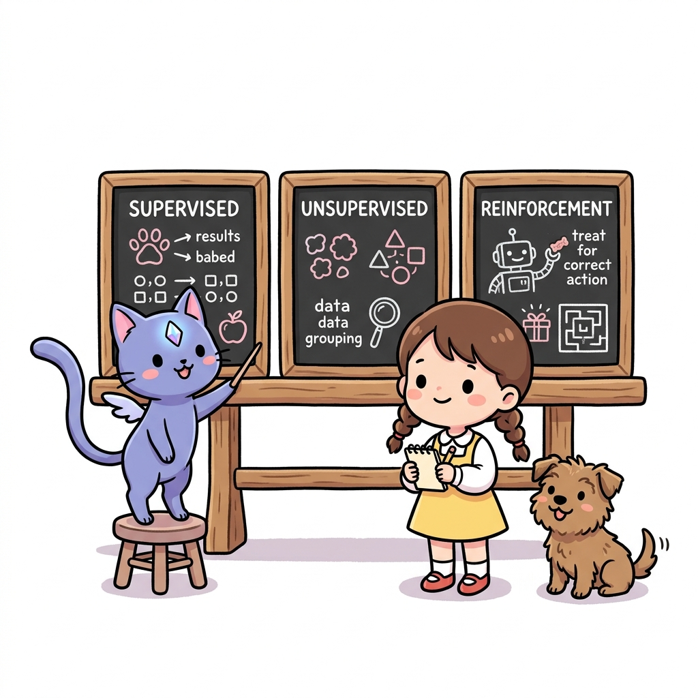
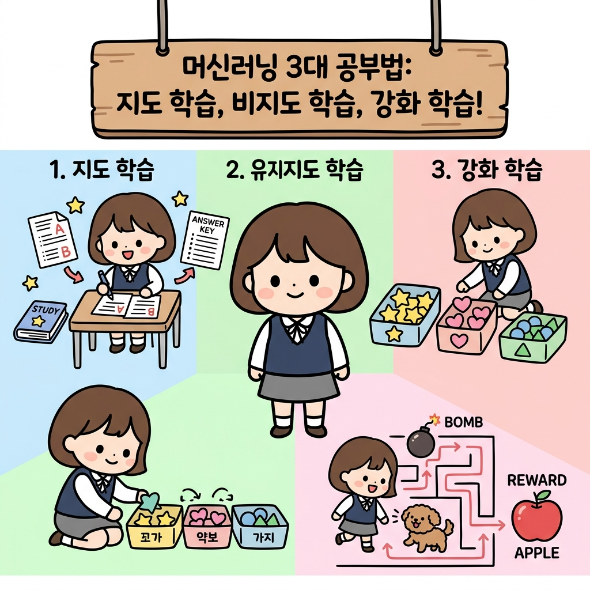
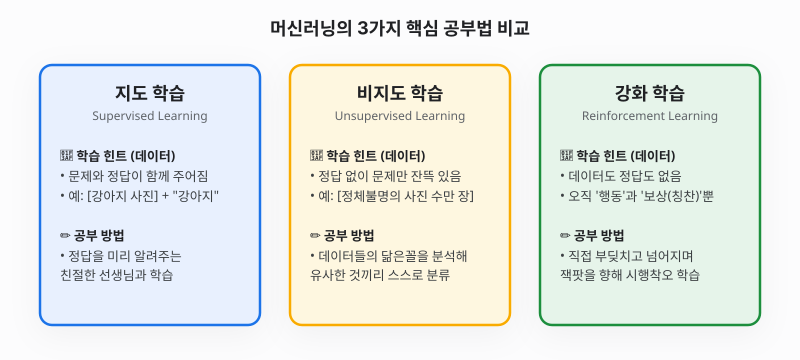
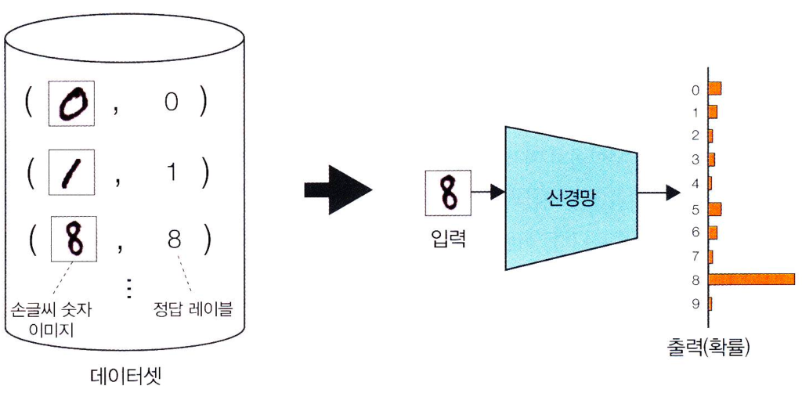
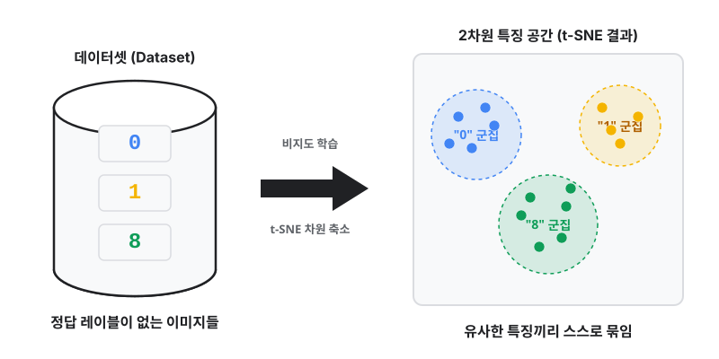
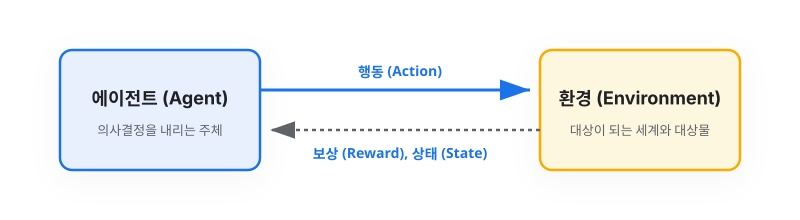
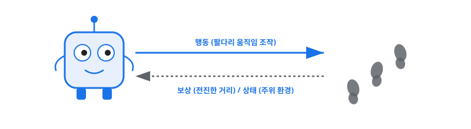

# 3.1 머신러닝 분류와 강화 학습

**그림 03-1** 머신러닝의 3가지 공부 방법인 지도 학습, 비지도 학습, 강화 학습의 차이를 칠판에 설명해주는 지니와 도로시

머신러닝(Machine Learning)은 기계가 스스로 규칙을 배우는 기술입니다. 지니가 칠판 가득 요약해 준 것처럼 머신러닝은 크게 교과서 정답을 가르치는 **지도 학습**, 스스로 패턴을 묶어내는 **비지도 학습**, 그리고 보물 상자를 열어보며 스스로 배우는 **강화 학습**의 3가지 공부법으로 나뉩니다. 이 3대 학습 분류와 강화 학습의 독창적인 본질을 함께 탐구해볼까요?

---

머신러닝(Machine Learning)은 이름 그대로 **기계(Machine)를 학습(Learning)시키는 기술**입니다. 

우리가 컴퓨터 프로그램으로 어떤 규칙을 하나하나 직접 설계해 명령을 내리는 기존의 방식과 달리, 머신러닝은 컴퓨터에 데이터를 던져주고 **"컴퓨터야, 네가 스스로 이 데이터 속에 있는 숨겨진 규칙이나 패턴을 찾아봐!"**라고 요구하는 공부법입니다.

이러한 머신러닝은 데이터를 다루는 방식과 목표에 따라 크게 세 가지 핵심 줄기로 구분할 수 있습니다. 바로 **지도 학습, 비지도 학습, 강화 학습**입니다.

---

## 3.1.1 머신러닝이란 무엇일까요

쉽게 생각해서 컴퓨터가 시험공부를 하는 다양한 방식이라고 볼 수 있습니다.

1. **지도 학습 (Supervised Learning)**: 기출문제와 해설지(정답)를 함께 보며 공부하는 정답 중심 학습입니다.
2. **비지도 학습 (Unsupervised Learning)**: 아무 해설지도 없는 수많은 관찰 대상들 속에서 닮은꼴 패턴을 스스로 찾아내는 짝짓기 학습입니다.
3. **강화 학습 (Reinforcement Learning)**: 문제집 대신 가상 세계에 직접 뛰어들어 장애물에 부딪치고 보상을 얻으며 최적의 행동 노하우를 깨우치는 실전형 학습입니다.

---

## 3.1.2 지도 학습: 정답 선생님이 있는 학습

**지도 학습**은 머신러닝에서 가장 널리 쓰이는 기법입니다. 공부할 때 문제(입력)와 그 문제의 정답(출력)이 세트로 묶인 교재가 주어집니다.

* **예시**: 손글씨 숫자 이미지를 보고 컴퓨터가 이것이 어떤 숫자인지 맞히게 훈련하는 예시가 있습니다.
  - **입력**: 손글씨 숫자 '8' 이미지
  - **정답**: "이것은 숫자 8이다"라는 레이블(정답 해설)

컴퓨터는 이러한 정답 데이터를 보고 자기가 예측한 답과 비교해가며 훈련합니다.

**그림 3-1** 지도 학습의 예(손글씨 숫자 '8' 학습)

이처럼 **정답(레이블)**이 항상 함께 주어진다는 것이 지도 학습의 가장 큰 특징입니다. 이 정답은 대개 우리 인간 선생님들이 미리 하나씩 마킹해서 컴퓨터에게 넘겨줍니다.

> **NOTE_** 정답을 붙이는 과정은 엄청난 노동력이 필요합니다. 1400만 장이 넘는 사진 데이터셋(ImageNet)을 사람 혼자서 정답을 매긴다면 꼬박 **20년**이 넘게 걸릴 만큼 시간이 많이 걸리는 작업입니다.

---

## 3.1.3 비지도 학습: 정답 없이 끼리끼리 묶는 학습

**비지도 학습**에서는 컴퓨터에게 정답(해설지)을 전혀 주지 않고 오직 데이터만 던져줍니다. "이 사진이 뭔지 정답은 안 알려줄 테니, 네가 알아서 비슷한 성질끼리 모아 봐"라고 명령하는 것이죠.

비지도 학습은 데이터 속에 숨어 있는 구조나 패턴을 파악하여 그룹을 나누는 **군집화(Clustering)**나, 너무 복잡한 데이터를 간단하게 표현해 주는 **차원 축소** 등에 유용하게 활용됩니다.

**그림 3-2** 비지도 학습의 예(t-SNE를 이용한 차원 축소)

> [!NOTE]
> **t-SNE(티스니)란 무엇인가요?**
> * **역할**: 고해상도 이미지처럼 컴퓨터가 다루는 고차원 데이터를, 우리가 눈으로 보고 이해할 수 있는 2차원 평면 지도로 찌그러뜨려서 표현해 주는(차원 축소) 기법입니다.
> * **핵심 원리**: 서로 닮은 데이터(예: 동그랗게 생긴 숫자 '0' 이미지들)는 평면 상에서도 한곳에 옹기종기 뭉치도록 유도하고, 다르게 생긴 데이터는 멀찍이 떨어지게 만듭니다. 정답을 미리 알려주지 않아도 자동으로 비슷한 특징끼리 뭉친 지도를 그려 주는 신비한 지도 제작 도구입니다.

---

## 3.1.4 강화 학습: 스스로 부딪히며 배우는 시행착오 학습

이 책의 주인공인 **강화 학습**은 앞서 배운 두 기법과는 전혀 다르게 공부합니다. 에이전트(기계/배우는 주체)가 자신이 놓인 환경과 실시간으로 주거니 받거니 상호작용하며 자가 학습을 수행합니다.

**그림 3-3** 강화 학습의 메커니즘

* **에이전트(Agent)**: 행동을 취하는 주체입니다. 로봇이나 자율주행 차량, 슬롯머신 앞에 선 게임 플레이어 등이 해당합니다.
* **환경(Environment)**: 에이전트가 놓인 가상 또는 실제 공간입니다.
* **상태(State)**: 에이전트가 매 순간 관찰하는 주위 상황 정보입니다.
* **행동(Action)**: 에이전트가 선택하여 실행하는 조작 움직임입니다.
* **보상(Reward)**: 행동을 한 뒤에 환경이 에이전트에게 전달해 주는 피드백(보상/페널티 점수)입니다.

에이전트는 매번 행동을 해보며 "아! 이 행동을 하니까 보상이 크게 들어오고, 저 행동을 하니까 점수가 깎이는구나!"라는 사실을 깨닫고, **누적 보상의 총합을 최대화**하도록 공부합니다.

가장 대표적인 예시로 로봇이 걷는 법을 배우는 **로봇 보행 문제**가 있습니다.

**그림 3-4** 로봇 보행 문제에서의 상호작용

로봇에게 걷는 방법을 가르쳐줄 완벽한 인간 선생님을 구하기란 매우 어렵습니다. (각 관절의 모터 각도를 0.01초 단위로 완벽하게 텍스트로 적어줄 정답 해설지가 존재하지 않기 때문입니다.)

로봇은 일단 임의로 다리를 구부려 봅니다. 넘어지면 마이너스 보상을 받고, 1cm라도 앞으로 전진하면 플러스 보상(전진 거리)을 얻습니다. 로봇은 이 무수한 **시행착오** 경험 데이터를 스스로 수집하고 업데이트해가며 자전거 균형을 잡듯 걷는 행동 패턴을 자연스럽게 익힙니다.

---

## 3.1.5 지도 학습과 강화 학습의 차이점

* **지도 학습의 힌트**: 문제에 대한 **'정답'**을 직접 제공받습니다. 즉, 문제 해결 시점마다 "네 행동의 정답은 이것이다"라고 말해 주는 완벽한 선생님이 있습니다.
* **강화 학습의 힌트**: 정답이 아니라 단순한 점수 피드백인 **'보상'**만 얻습니다. 내가 방금 내린 결정이 우주에서 가장 완벽한 해답(최적 행동)이었는지 가르쳐주지 않고, 오직 "이 행동으로 인해 점수 몇 점을 획득했다"는 사실만 돌려받습니다. 따라서 에이전트는 더 나은 정답이 어딘가에 있지 않을까 끊임없이 탐색해 나가는 재미가 있습니다.

---

## 3.1.6 오늘 공부한 핵심 요약

1. **머신러닝의 세 줄기**: 머신러닝은 데이터를 주어 컴퓨터가 규칙을 배우게 하는 것이며, 제공하는 힌트의 유무에 따라 **지도 학습**(문제+정답), **비지도 학습**(정답 없는 데이터), **강화 학습**(행동+보상 상호작용)으로 분류됩니다.
2. **비지도 학습과 t-SNE**: 정답이 없는 데이터에서 데이터의 2차원 특징 지도를 그려 묶어주는 기법으로, 닮은 데이터끼리 옹기종기 뭉치게 군집화합니다.
3. **강화 학습의 고유성**: 사전에 만들어진 데이터셋을 일방적으로 외우는 공부가 아닙니다. **에이전트**가 **환경**과 실시간으로 소통하며 얻는 **보상**을 극대화하기 위해 직접 부딪히고 실패하며 깨닫는 **시행착오 학습**입니다.
