# 3.2 밴디트 문제

이제부터는 강화 학습에서 다루는 구체적인 문제들을 예시를 통하여 살펴보겠습니다. 처음이니 가장 간단하면서도 강화 학습의 본질을 고스란히 품고 있는 **밴디트 문제**bandit problem에 대해서 알아 보도록 하겠습니다. 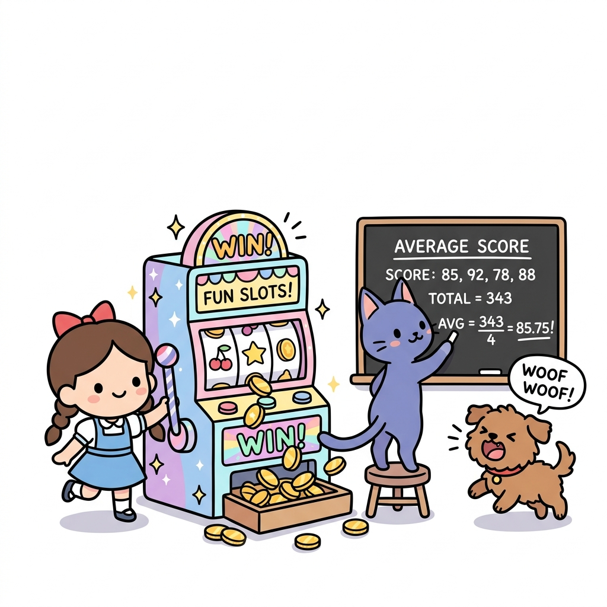

**그림 03-2** 슬롯머신 레버를 직접 당기며 점수 기댓값을 확인해 나가는 도로시와 칠판에 누적 평균 연산을 풀어주는 지니

지니가 칠판에 적어주는 동적 당첨 기댓값과 도로시의 실시간 기계 탐색 비유를 통해, 밴디트의 **기본 보상 구조**를 명쾌하게 이해해봅시다!

이 문제를 함께 해결해 가면서 강화 학습이 **어떻게 문제를 바라보고** 수식화하는지 명확하게 이해하게 될 것입니다.

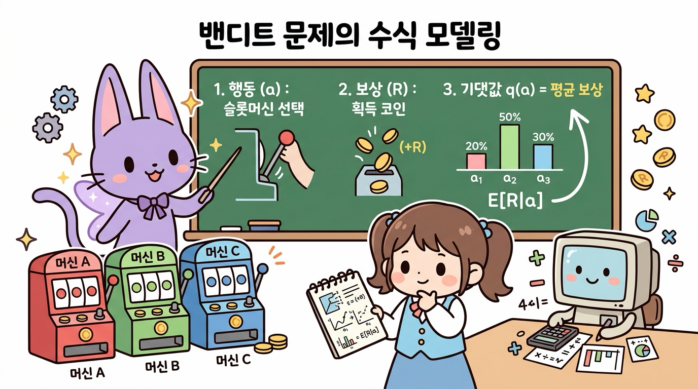

---

## 3.2.1 밴디트 문제란 무엇일까요

**밴디트**bandit는 오락실이나 카지노에서 흔히 볼 수 있는 **'슬롯머신'**의 또 다른 이름입니다. 

슬롯머신 옆에 달린 손잡이(레버)를 당기면 내부 릴이 무작위로 돌아가다가 멈추며, 멈춰 선 그림 조합에 따라 플레이어가 획득하는 코인의 개수가 정해집니다.

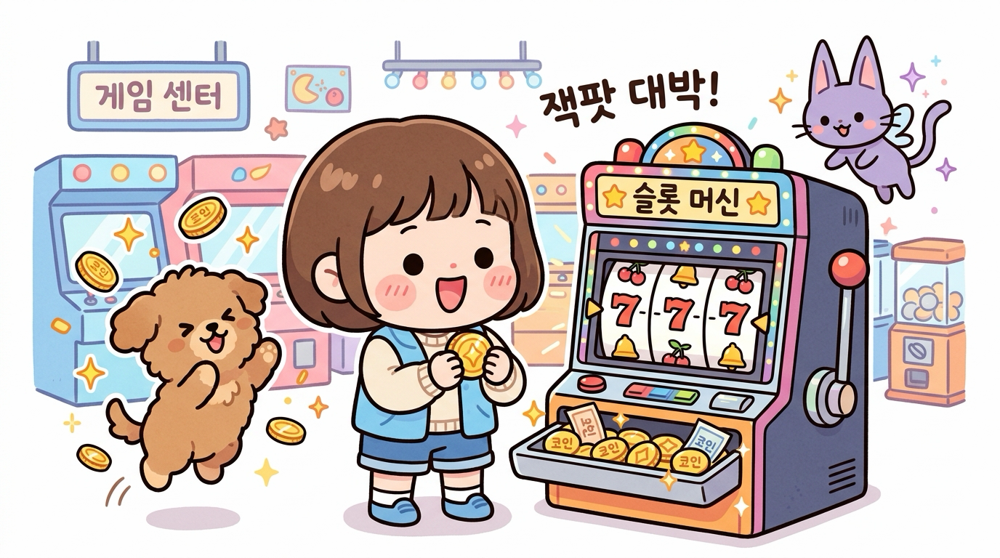

---

### 밴디트의 정의와 유래

밴디트bandit의 원래 의미는 영어로 **'도적'** 혹은 **'산적'**입니다. 

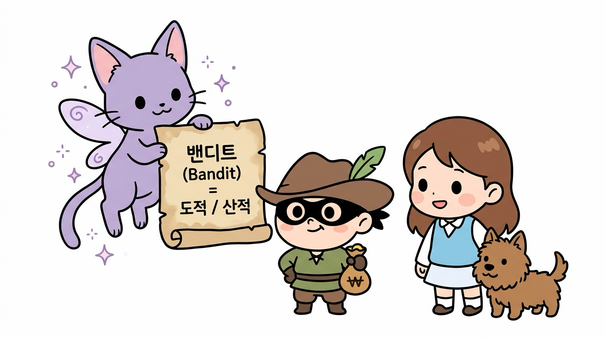

---

#### 외팔이 도적
그런데 도박꾼들 사이에서 슬롯머신을 **'외팔이 도적one-armed bandit'**이라고 부르기 시작했습니다. 손잡이가 옆에 단 하나만 달려 있어 '외팔이' 같고, 한 번 빠지면 돈을 도둑맞은 것처럼 전부 잃게 된다고 해서 붙은 재미있는 별명입니다.

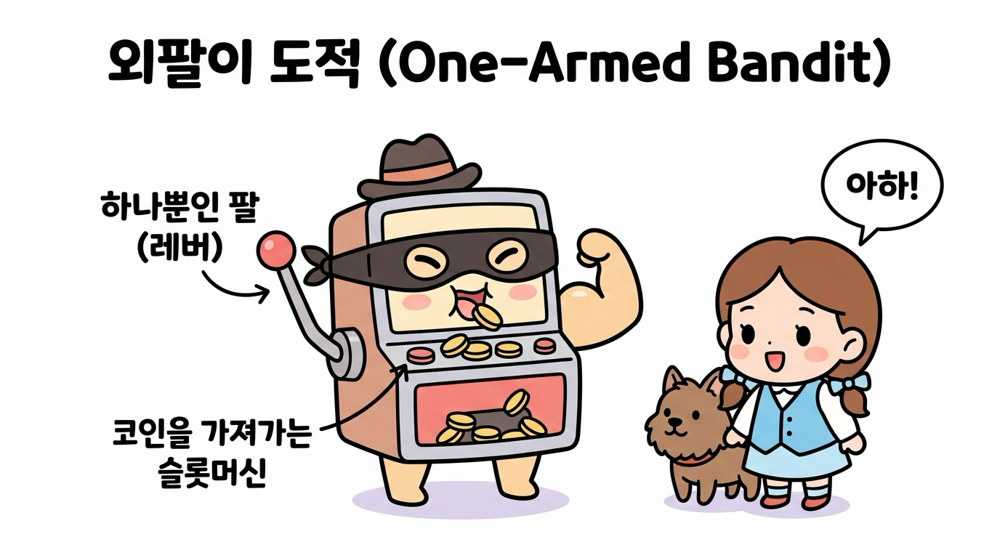

---

#### 멀티-암드 밴디트

강화 학습에서 다루는 진짜 문제는 **멀티-암드 밴디트 문제**multi-armed bandit problem라고 부릅니다. 직역하면 '팔이 여러 개 달린 도적'이라는 뜻이죠. 

이는 한마디로 아래 그림과 같이 **여러 대의 슬롯머신이 일렬로 놓여 있는 상황**을 의미합니다.

**그림 3-5** 멀티-암드 밴디트는 슬롯머신이 여러 대인 문제와 같다.

##### 왜 슬롯머신이 여러 대(멀티 암드)인 상황을 다룰까요?
* **단일 슬롯머신과의 차이**: 슬롯머신이 1대뿐이라면 고민할 필요 없이 그 레버만 당기면 됩니다.
* **불확실성과 선택의 딜레마**: 하지만 서로 다른 당첨 확률을 가진 여러 대의 슬롯머신이 놓여 있고, **어떤 기계가 돈을 잘 주는지 사전에 모르는 상황**이라면 우리는 매 순간 "어떤 슬롯머신의 레버를 당겨야 할까?"라는 **선택의 기로**에 서게 됩니다.

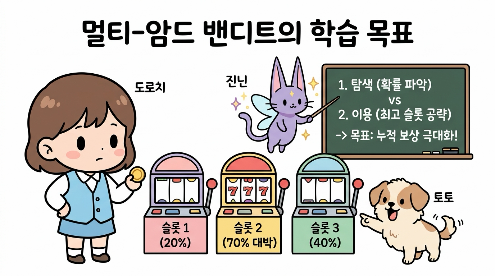

##### 앞으로 우리가 학습할 핵심 목표

1. **탐색(Exploration)과 이용(Exploitation)의 균형**:
   - **탐색**: 각 슬롯머신의 당첨 확률을 알아내기 위해 여러 기계를 **골고루** 당겨보는 행위
   - **이용**: 지금까지 확인된 정보 중 가장 승률이 높았던 최고의 기계를 **집중적**으로 당기는 행위
2. **누적 보상(Total Reward)의 극대화**:
   - 제한된 기회(코인 개수) 안에서 최소한의 시행착오로 대박 슬롯머신을 빠르게 찾아내어, **최종적으로 얻는 전체 코인의 총합을 최대로 만드는 최적의 전략(알고리즘)**을 수립하는 것이 밴디트 문제의 궁극적인 목표입니다.

---

## 3.2.2 초보자를 위한 확률 기초 다지기 (주사위 비유)

수학이나 확률을 배워본 적이 없어도 괜찮습니다! 

우리가 매일 접할 수 있는 **주사위 던지기**를 가지고 확률의 가장 핵심적인 두 가지 개념인 **독립사건**과 **조건부 확률**을 완벽하게 마스터해 보겠습니다.

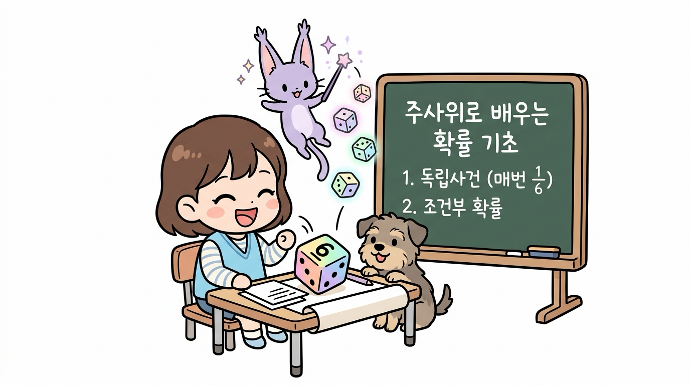

---

### 1. 주사위로 독립사건 이해하기

우리가 주사위를 한 번 던졌을 때 숫자 **6**이 나올 확률은 얼마일까요? 

#### 전체 눈이 6개이므로 당연히 **1/6 (약 16.6%)**입니다.

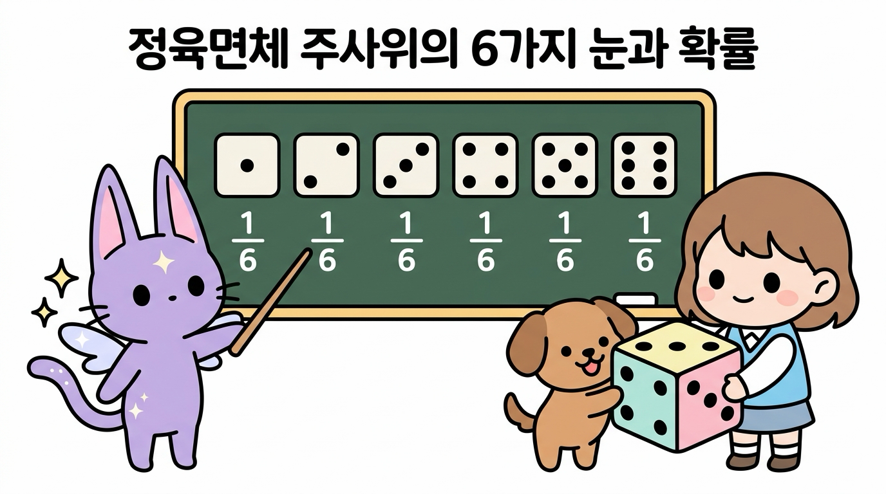

---

#### 방금 주사위를 던져서 아주 운 좋게 **6**이 나왔다고 해봅시다. 

다음 판에 다시 주사위를 던졌을 때 또다시 **6**이 나올 확률은 이전보다 떨어지거나 올라갈까요? 

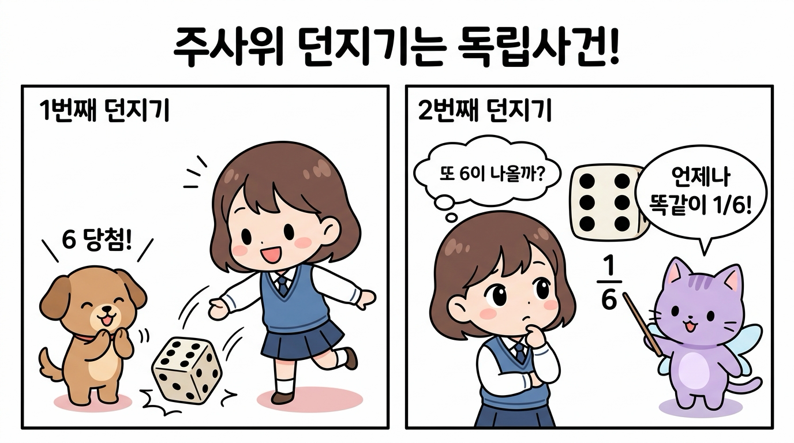

정답은 **"그대로 1/6"**입니다. 이전에 대박이 터졌든 꽝이 나왔든 간에, 주사위를 새로 굴릴 때마다 과거의 기억은 깨끗이 잊혀지고 매번 동일한 확률(1/6)로 처음부터 다시 굴려집니다. 

---

#### 독립사건

**"이전에 무슨 결과가 나왔든지 간에, 지금 일어나는 결과에는 0.0001%도 영향을 주지 않고 매번 리셋되는 독립적인 사건"**을 **독립사건(Independent Events)**이라고 부릅니다.

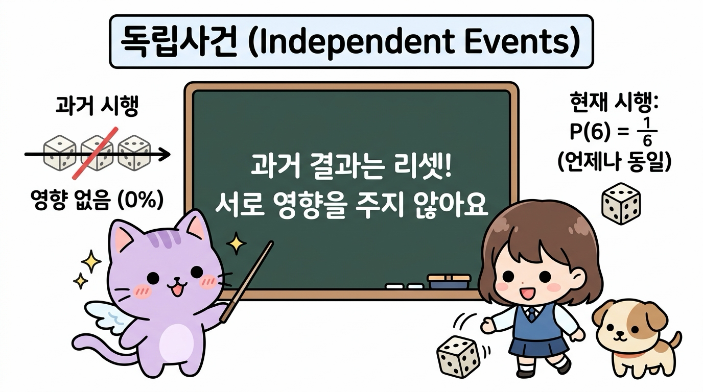

---

#### 확률의 총합은 항상 1입니다

주사위를 던졌을 때 나올 수 있는 눈은 {1, 2, 3, 4, 5, 6} 총 6가지입니다. 각각의 눈이 나올 확률은 전부 **1/6**로 동일합니다. 

이 모든 확률을 전부 더해보면 어떻게 될까요?

$$
\frac{1}{6} + \frac{1}{6} + \frac{1}{6} + \frac{1}{6} + \frac{1}{6} + \frac{1}{6} = \frac{6}{6} = 1
$$

합이 정확히 **1 (백분율로는 100%)**이 됩니다. 

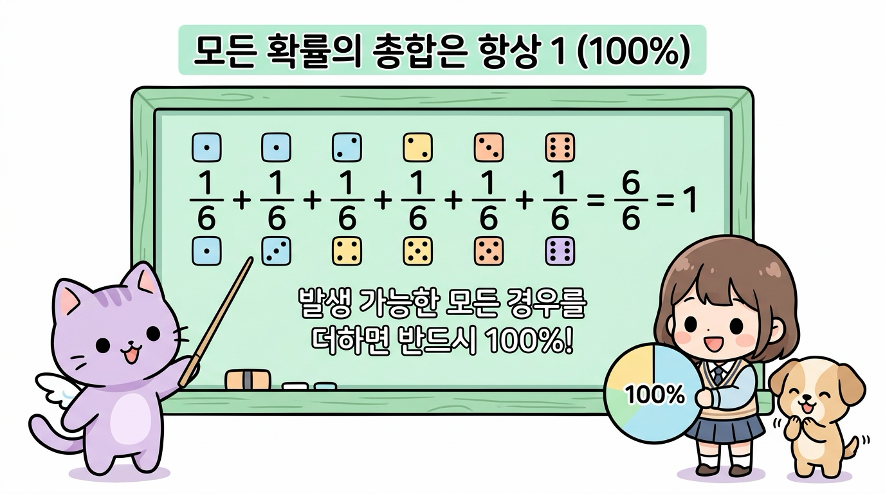

주사위를 던지면 1부터 6까지의 눈 중 **어느 하나는 반드시(100% 확률로) 나오기 때문**입니다. 이처럼 어떤 실행에서 **발생 가능한 모든 개별 사건의 확률을 다 더하면, 그 합은 언제나 예외 없이 정확히 1(100%)**이 됩니다.

---

### 2. 주사위로 조건부 확률과 칸막이 기호 '|' 이해하기

이번에는 주사위를 굴린 뒤 손으로 컵을 덮어 가렸습니다. 친구가 컵 안을 살짝 보더니 힌트를 줍니다.
> **"어! 굴려진 주사위 눈이 '짝수'네!"**

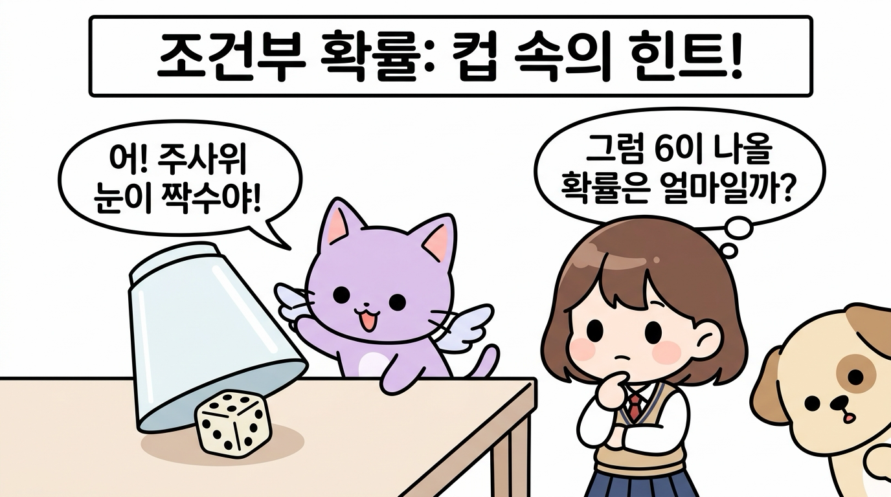

---

#### 이 말을 들은 상태에서, 주사위 눈이 **6**일 확률은 얼마일까요?

친구가 힌트를 주기 전에는 전체 6가지 눈 중에서 6이 나와야 하므로 확률이 1/6이었습니다. 하지만 **"짝수가 나왔다"는 새로운 조건**을 알게 되는 순간, 전체 세상이 홀수(1, 3, 5)는 싹 제외되고 오직 **짝수 집합 {2, 4, 6}**이라는 3가지 가능성으로 좁아집니다!

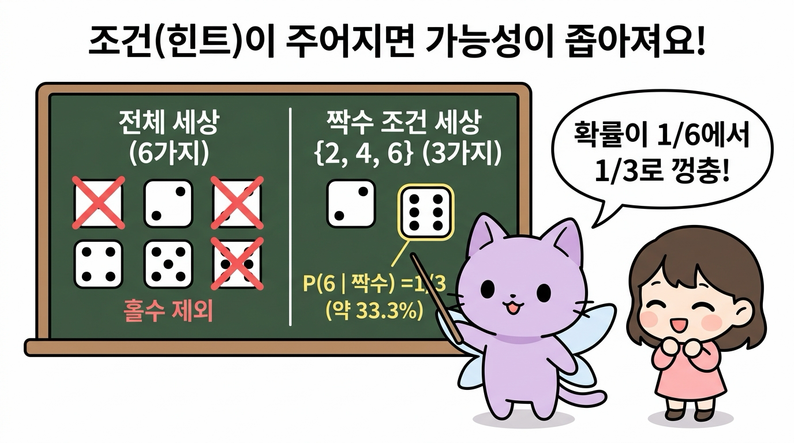

그 좁아진 3가지 가능성 중에서 우리가 알고 싶어 하는 목표 눈인 **6**은 단 1개뿐입니다. 

따라서 확률은 **1/3 (약 33.3%)**로 껑충 뛰게 됩니다.

---

#### 조건부확율

이처럼 **"어떤 선행 조건(힌트)이 주어졌을 때, 다른 사건이 일어날 확률"**을 **조건부 확률(Conditional Probability)**이라고 합니다. 

**그림 3-6** 주사위 비유를 통한 조건부 확률의 필터링 원리

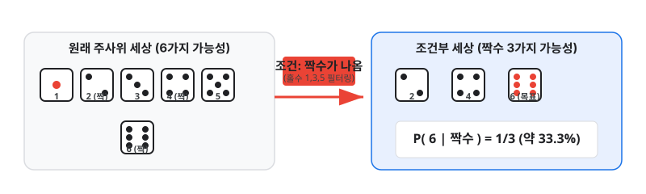

---

#### 수학적 표현

수학에서는 이를 표현하기 위해 수직선 기호 **`|`**를 사용하여 다음과 같이 표기합니다.
$$
P(B \mid A)
$$

여기서 쓰이는 수직선 기호 `|` (수학에서는 '바/bar' 혹은 'given'이라고 읽습니다)는 일종의 **'조건을 나누는 칸막이(벽)'**라고 생각하면 됩니다.

* **오른쪽 영역 (A)**: 이미 알고 있거나 확정된 **'선행 조건 (힌트)'**입니다. (예: "짝수가 나왔다")
* **왼쪽 영역 (B)**: 그 조건 안에서 우리가 **'진짜 관심 있게 구하고자 하는 결과 사건'**입니다. (예: "눈이 6이다")

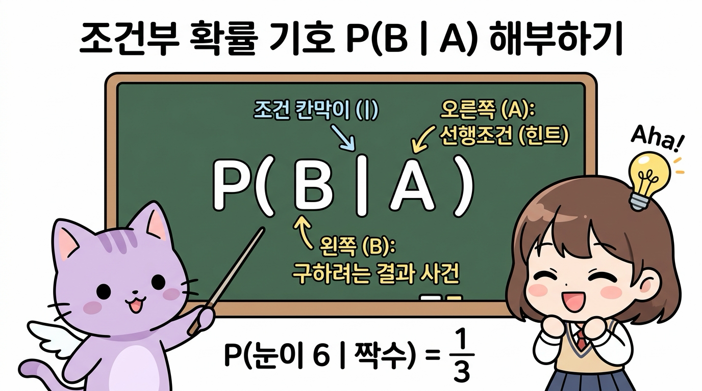

---

#### 확률 기호 P의 유래

수학에서 확률을 나타낼 때 사용하는 대표적인 대문자 기호 **P**는 **'확률'**을 뜻하는 영어 단어 **Probability (프로바빌리티)**의 첫 글자에서 유래했습니다. 

이 단어는 라틴어 **probabilitas (프로바빌리타스)**에 뿌리를 두고 있으며, 본래 **'검증할 수 있음'**, **'그럴듯함(개연성)'**이라는 의미를 지니고 있었습니다. 

즉, 어떤 사건이 실제로 일어날 법한 정도(개연성)를 0부터 1 사이의 숫자로 정밀하게 계량화한 척도가 바로 **확률 *P***입니다. 

앞으로 강화학습 수식에서 *P*(·)를 마주칠 때마다 **"해당 행동이나 보상이 발생할 가능성의 크기"**로 이해하면 쉽습니다.

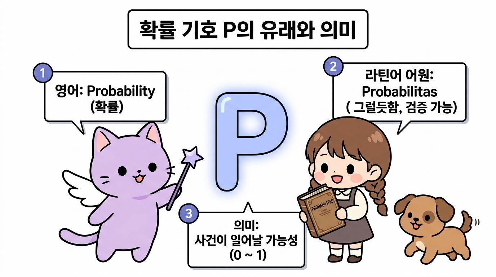

---

## 3.2.3 밴디트 문제 해결을 위한 확률 적용

이제 방금 배운 주사위 확률 개념(독립사건, 조건부 확률)을 **우리가 해결하려는 밴디트 문제(슬롯머신)**에 그대로 적용해 보겠습니다.

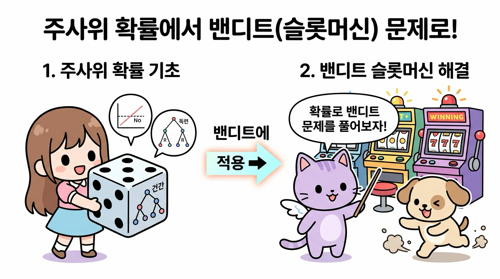

---

### 1. 슬롯머신과 독립사건

오락실이나 카지노의 슬롯머신은 주사위와 마찬가지로 철저히 **독립사건**으로 동작합니다. 

#### [질문] 연속으로 꽝이 나오면 다음 판 잭팟 확률이 높아질까?

만약 어떤 사람이 "이 슬롯머신에서 방금 10판 연속으로 꽝이 나왔으니까, 이번 11번째 판에는 잭팟이 터질 확률이 엄청 높아졌을 거야!"라고 굳게 믿는다면 과연 그럴까요?

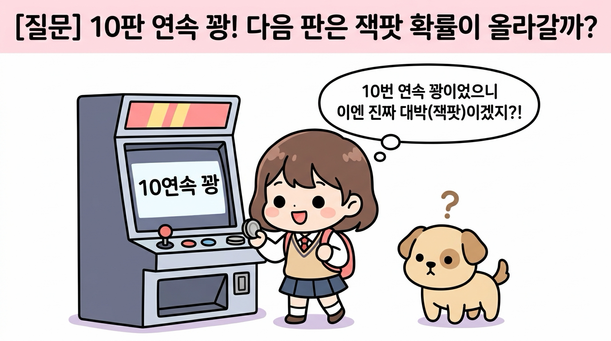

#### [답변] 아니요! 슬롯머신은 이전 결과를 기억하지 못합니다

정답은 **"전혀 그렇지 않다(확률은 그대로)"**입니다. 이를 통계학과 심리학에서는 **'도박사의 오류(Gambler's Fallacy)'**라고 부릅니다.

과거에 10판 연속으로 돈을 잃었든 100판 연속으로 꽝이 나왔든 간에, 슬롯머신은 내부에 과거의 기억이 전혀 남아있지 않습니다. 손잡이를 새로 당길 때마다 매번 완전히 리셋된 독립적인 시행이 시작되며, 잭팟이 터질 확률은 **항상 처음과 동일한 고정 확률**로 유지됩니다.

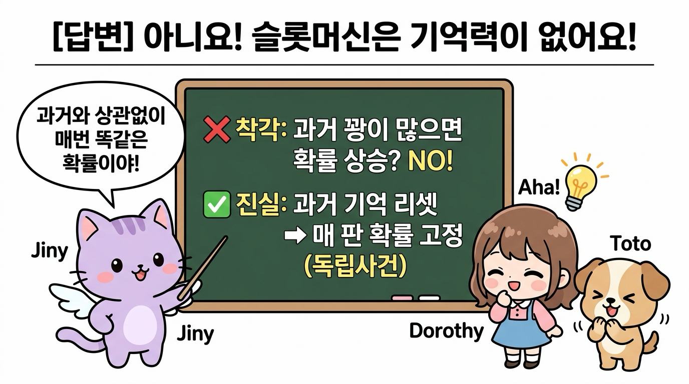

---

### 2. 슬롯머신과 조건부 확률

우리가 일렬로 늘어선 여러 대의 슬롯머신 앞에 서 있을 때는 어떠할까요?

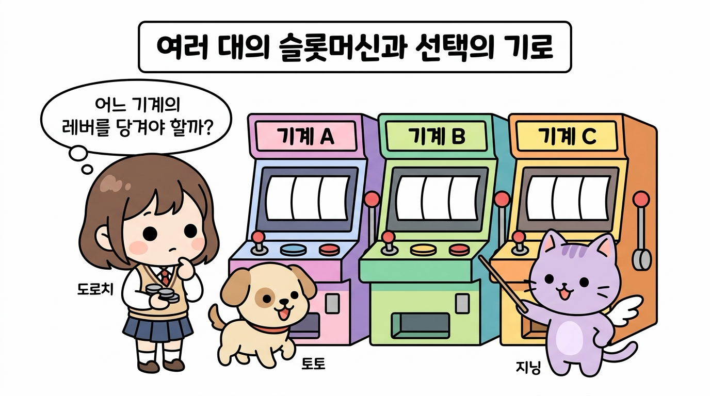

 **"내가 어떤 기계를 선택하는가(행동 *A*)"**는 주사위 비유에서 '짝수가 나왔다'와 같은 **'선행 조건'**이 됩니다.

---

그리고 그 기계에서 **"코인을 몇 개 얻을 것인가(보상 *R*)"**는 조건 하에 일어나는 **'결과 사건'**입니다.

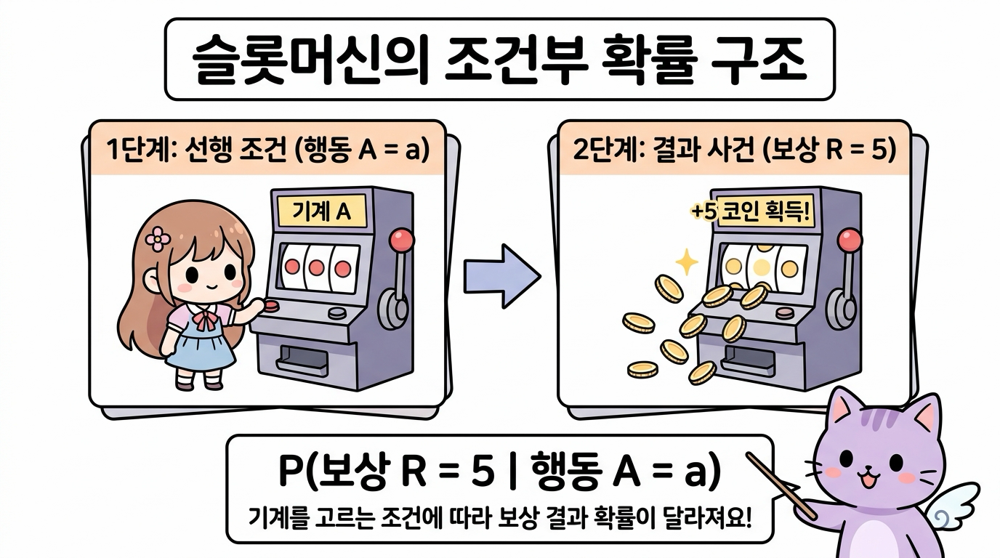

---

#### 수학적 표현

예를 들어, "내가 **슬롯머신 a**를 선택하여 손잡이를 당겼을 때(조건), 

보상으로 **코인 5개**를 얻을 조건부 확률"은 수학 기호로 다음과 같이 아주 세련되게 표현할 수 있습니다.

$$
P(R = 5 \mid A = a)
$$

* **읽는 방법**: "행동 *A*가 *a*일 때(조건), 보상 *R*이 5가 될 조건부 확률"

**그림 3-8** 조건부 확률의 칸막이 기호 `|` 이해하기

---

#### 트리 다이어그램

이러한 선택 조건에 따른 보상 획득 구조를 트리 다이어그램으로 펼쳐보면 다음과 같습니다.

**그림 3-9** 밴디트 문제에서의 조건부 확률 트리

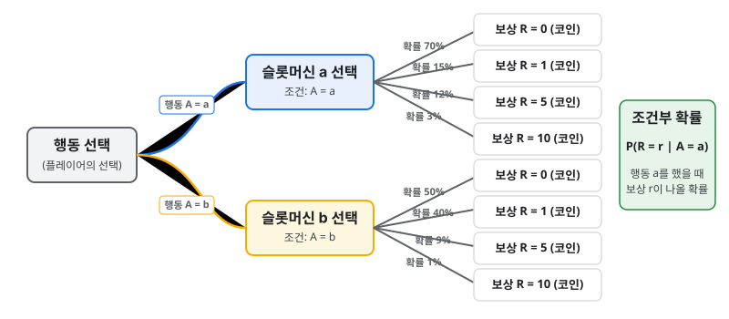

에이전트(플레이어)는 슬롯머신마다 각 보상 액수(*R* = 0, 1, 5, 10)가 나올 조건부 확률 분포가 서로 다르다는 사실을 인지하고, 어떤 기계를 당겨야 평균 보상이 가장 높을지 조건부 **기댓값(가치)**을 비교하게 됩니다.

---

## 3.2.4 [수학공부] 확률변수, 확률분포, 그리고 기댓값

슬롯머신이 코인을 뱉어내는 규칙을 본격적으로 비교하기 전에, 앞으로 계속해서 마주하게 될 세 가지 핵심 확률 용어인 **확률변수**, **확률분포**, 그리고 **기댓값**에 대해 깊이 알아봅시다.

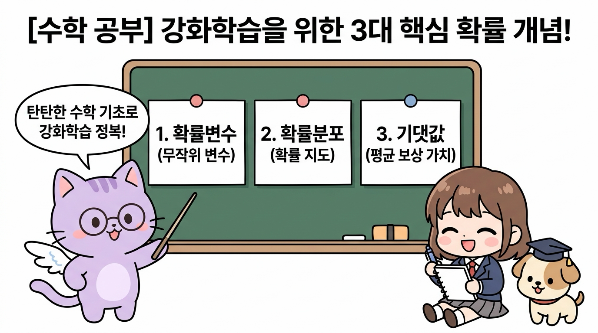

---

### 1. 확률변수 (Random Variable) - "값이 무작위로 결정되는 특별한 변수"

수학에서 확률변수는 어떤 값이 들어갈지 사전에 알 수 없기 때문에 관례상 **대문자(예: *X*, *R*, *A*)**로 표기합니다. 

마치 프로그래밍에서 변수를 먼저 선언(`let X;`)해 두고, 실행 시점에 결정된 구체적인 리터럴 값을 변수에 대입(`X = 6;`)하는 것과 같습니다. 

* **대문자 (*X*, *R*)**: 어떤 값이 들어올지 모르는 **확률변수(Variable)** 상자 자체를 뜻합니다.
* **소문자 또는 구체적 숫자 (*x*, *r* = 5)**: 실험이나 행동의 결과로 실제로 측정되어 변수에 담긴 **구체적인 실현값(Literal Value)**을 뜻합니다.

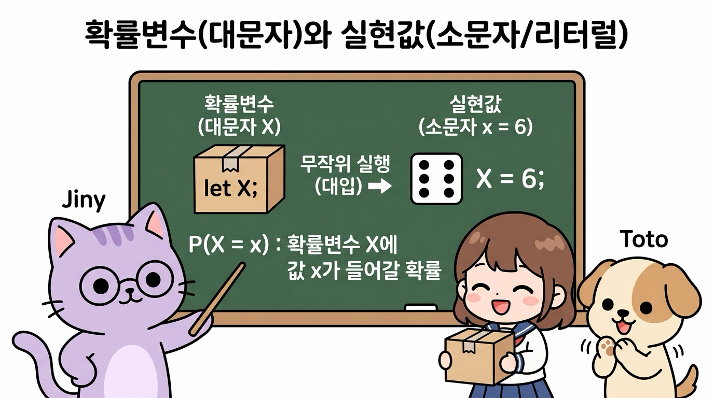

따라서 수학이나 강화학습 수식에서 *P*(*X* = *x*)나 *P*(*R* = 5)라는 표현을 보면, **"확률변수 상자 *X*에 특정 리터럴 값 *x*(또는 보상 5)가 대입되어 나타날 확률"**로 이해하면 아주 직관적입니다.

#### 확률변수와 가능한 결과 집합(그룹)

확률변수에 들어갈 수 있는 실현값은 무한정 아무 값이나 들어오는 것이 아니라, **"발생 가능한 후보 결과들의 모임인 집합(Set / 표본공간)"** 안에서만 선택됩니다. 

수학에서는 이 후보군 그룹을 중괄호 `{ }`로 묶어 표현하며, 기호 **`∈`**는 **"해당 집합 그룹의 원소로 속해 있다"**는 뜻을 나타냅니다.

* **주사위 집합 그룹**: 주사위를 굴렸을 때 나올 수 있는 눈의 집합 {1, 2, 3, 4, 5, 6} 중 하나가 선택됩니다.
  $$
  x \in \{1, 2, 3, 4, 5, 6\}
  $$
* **슬롯머신 보상 집합 그룹**: 슬롯머신이 지급할 수 있는 코인 보상의 집합 {0, 1, 5, 10} 중 하나가 선택됩니다.
  $$
  r \in \{0, 1, 5, 10\}
  $$

프로그래밍에 비유하자면, `const PossibleRewards = [0, 1, 5, 10];`이라는 **후보 배열(집합 그룹)**이 사전에 정의되어 있고, 슬롯머신 레버를 당길 때마다 이 배열 안의 원소 중 하나가 무작위로 선택되어 변수 *R*에 할당(`R = r;`)되는 것과 완전히 동일합니다.

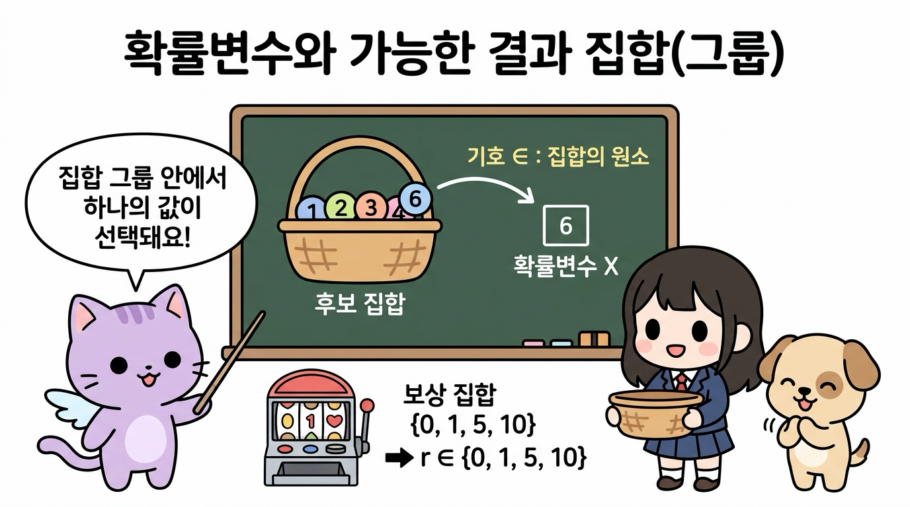

---

### 2. 확률분포 (Probability Distribution) - "확률이 각각 어떻게 흩어져(분포해) 있는지 알려주는 지도"

확률변수 *X*가 가질 수 있는 모든 가능한 값들에 대해, 각각의 결과가 **몇 퍼센트(%) 확률로 나타나는지 그 구체적인 비율을 표나 그림으로 일목요연하게 펼쳐놓은 청사진**을 **확률분포(Probability Distribution)**라고 합니다.

마치 지도(Map)를 보면 어느 지역에 무엇이 있는지 한눈에 알 수 있듯이, 확률분포를 확인하면 어떤 결과가 자주 발생하고 어떤 결과가 드물게 터지는지 그 전체적인 확률 지형을 명확하게 파악할 수 있습니다.

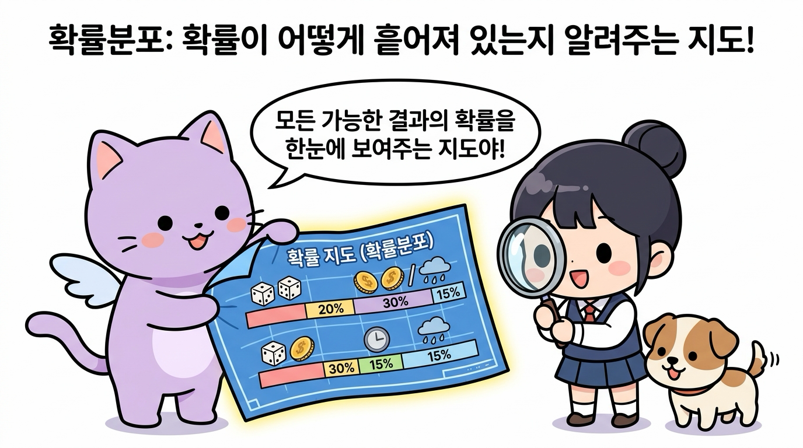

#### 확률분포의 구체적 예시

**1. 주사위 눈의 확률분포 (균등분포)**
일반적인 6면체 주사위를 던질 때 나오는 눈 *X*는 모든 눈(1~6)이 동일하게 **1/6 (약 16.6%)**의 균등한 확률을 가집니다.

| *X*의 값 (주사위 눈) | 1 | 2 | 3 | 4 | 5 | 6 |
| :--- | :---: | :---: | :---: | :---: | :---: | :---: |
| **발생 확률** | 1/6 | 1/6 | 1/6 | 1/6 | 1/6 | 1/6 |

**2. 슬롯머신의 보상 확률분포 (불균등분포)**
반면 오락실 슬롯머신은 보상 액수마다 터질 확률이 서로 다릅니다. 예를 들어 꽝(0개)은 70%로 자주 터지지만, 대박 잭팟(10개)은 2%로 아주 드물게 발생합니다.

| *R*의 값 (코인 보상) | 0개 (꽝) | 1개 | 5개 | 10개 (잭팟) |
| :--- | :---: | :---: | :---: | :---: |
| **발생 확률** | 70% (0.70) | 20% (0.20) | 8% (0.08) | 2% (0.02) |

중요한 점은 주사위든 슬롯머신이든 **"모든 발생 가능한 확률을 전부 더하면 항상 100% (1)"**가 된다는 점입니다. 

강화학습 에이전트는 바로 이 슬롯머신별 보상 확률분포의 차이를 탐색을 통해 파악해 나가게 됩니다.

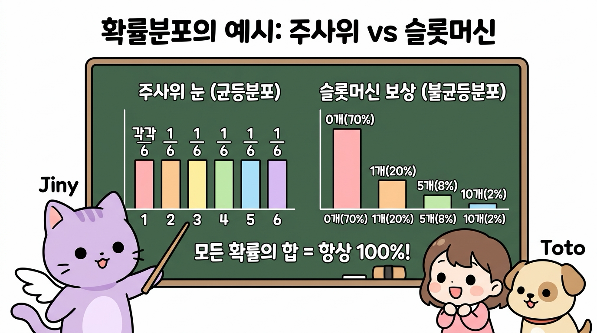

---

### 3. 기댓값 (Expected Value) - "무한히 반복했을 때 평균적으로 얻을 수 있는 값"

**기댓값(Expected Value, 보통 𝔼[*X*] 또는 E[*X*]로 표기)**은 확률변수가 가질 수 있는 여러 무작위 결과들을 수없이 반복해서 실행했을 때, **"평균적으로 얻을 수 있을 것으로 기대되는 진짜 수학적 가치"**를 뜻합니다.

단 한 번의 시행에서는 운에 따라 대박이 터지거나 꽝이 나올 수 있지만, 시행 횟수가 수백 번, 수천 번으로 늘어날수록 평균 획득 보상은 결국 이 기댓값으로 수렴하게 됩니다.

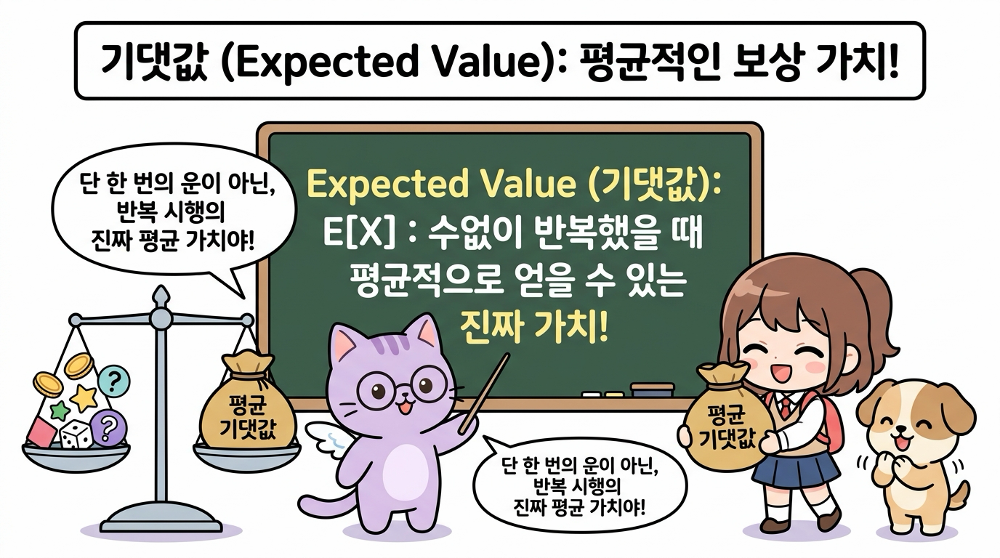

#### 기댓값의 계산 원리와 예시

기댓값을 구하는 공식은 아주 직관적입니다. **"나올 수 있는 각각의 실현값에 그 값이 발생할 확률을 곱한 뒤, 이를 전부 더하는 것"**입니다.

$$
\mathbb{E}[X] = \sum (\text{값} \times \text{확률})
$$

이해를 돕기 위해 **추첨 이벤트(룰렛 돌리기)**를 예로 들어보겠습니다.

* **1등 당첨 금액**: 1,000원 (확률 10%, 즉 0.10) → 1,000 × 0.10 = 100원
* **2등 당첨 금액**: 500원 (확률 20%, 즉 0.20) → 500 × 0.20 = 100원
* **꽝일 때 금액**: 0원 (확률 70%, 즉 0.70) → 0 × 0.70 = 0원

이 이벤트에 참여했을 때 한 판당 평균적으로 기대할 수 있는 기댓값은 다음과 같이 계산됩니다.

$$
\text{기댓값 } \mathbb{E}[X] = (1,000 \times 0.10) + (500 \times 0.20) + (0 \times 0.70) = 100 + 100 + 0 = 200\text{원}
$$

즉, 이 이벤트의 기댓값은 **200원**입니다. 단 한 번만 뽑았을 때는 200원이라는 금액을 정확히 받을 수 없지만(1,000원, 500원, 0원 중 하나만 받으므로), 이 이벤트를 수없이 반복해서 플레이한다면 한 판당 평균 200원씩 가져가게 됨을 수학적으로 보장합니다.

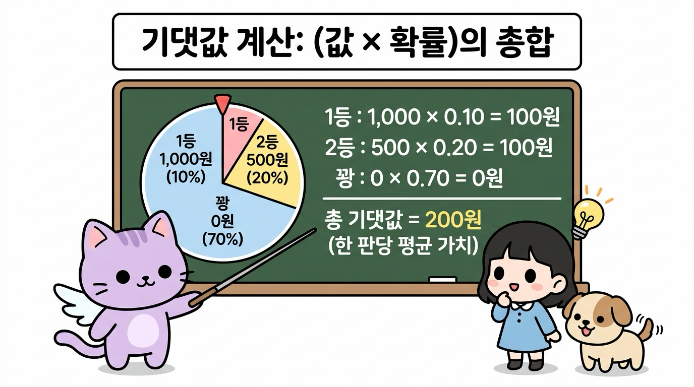

강화학습 에이전트 역시 각 슬롯머신(행동)을 반복 플레이했을 때 보상의 기댓값이 가장 높은 최적의 기계를 찾아내도록 학습하게 됩니다.

---

## 3.2.5 좋은 슬롯머신이란 무엇일까요

슬롯머신마다 내부에 설정된 코인 잭팟 확률분포가 다릅니다. 

당연히 우리는 승률이 좋고 코인을 많이 주는 슬롯머신을 고르고 싶을 것입니다. 이를 앞서 배운 확률 도구를 사용해 객관적으로 가려내 보겠습니다.

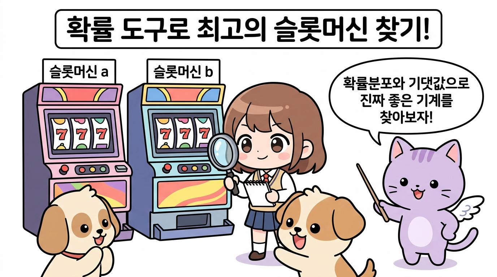

---

### 1. 두 슬롯머신의 확률분포 비교

예를 들어 두 대의 슬롯머신 **a**와 **b**가 있고, 각각의 보상과 확률분포가 아래 표처럼 서로 다르게 설정되어 있다고 가정해 봅시다.

#### 슬롯머신 a의 확률분포표 (고액 잭팟형)

| 얻을 수 있는 동전 개수 (*R*) | 0개 (꽝) | 1개 | 5개 | 10개 (잭팟) |
|---|:---:|:---:|:---:|:---:|
| **발생 확률** | 0.70 (70%) | 0.15 (15%) | 0.12 (12%) | 0.03 (3%) |

#### 슬롯머신 b의 확률분포표 (소액 안정형)

| 얻을 수 있는 동전 개수 (*R*) | 0개 (꽝) | 1개 | 5개 | 10개 (잭팟) |
|---|:---:|:---:|:---:|:---:|
| **발생 확률** | 0.50 (50%) | 0.40 (40%) | 0.09 (9%) | 0.01 (1%) |

* **슬롯머신 a의 특징**: 꽝 확률이 70%로 높지만, 5개(12%)와 10개(3%) 같은 고액 보상이 터질 확률이 상대적으로 높습니다.
* **슬롯머신 b의 특징**: 꽝 확률이 50%로 낮고 동전 1개(40%)가 자주 나오지만, 5개(9%)나 10개(1%) 같은 고액 대박 확률은 낮습니다.

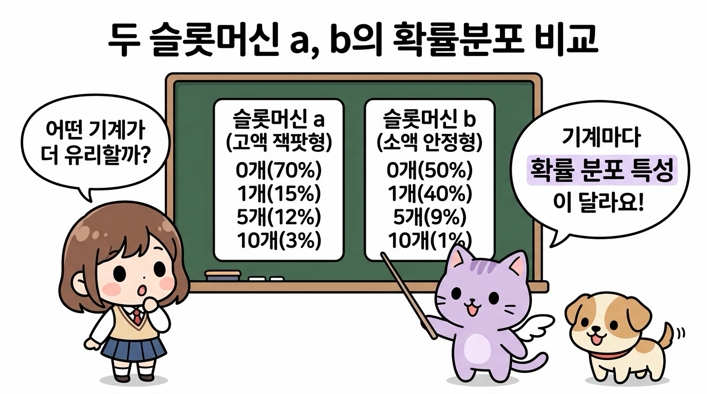

#### 각 슬롯머신의 확률 총합 검증

보통 실제 환경에서는 이 내부 확률분포표를 사전에 알 수 없지만, 만약 알 수 있다면 어떤 기계를 선택해야 장기적으로 코인을 가장 많이 모을 수 있을까요? 

여기서도 앞서 배운 **"확률의 총합은 항상 1(100%)"**이라는 대원칙이 완벽하게 성립합니다.

$$
\text{슬롯머신 a: } 0.70 + 0.15 + 0.12 + 0.03 = 1.00 \ (100\%)
$$
$$
\text{슬롯머신 b: } 0.50 + 0.40 + 0.09 + 0.01 = 1.00 \ (100\%)
$$

주사위를 던졌을 때 1~6 눈 중 하나가 반드시 나오듯, 슬롯머신의 레버를 당기면 코인 0개, 1개, 5개, 10개 중 **어느 하나의 결과는 100% 확률로 반드시 발생하기 때문**에 개별 확률의 총합은 언제나 예외 없이 **정확히 1 (100%)**이 됩니다.

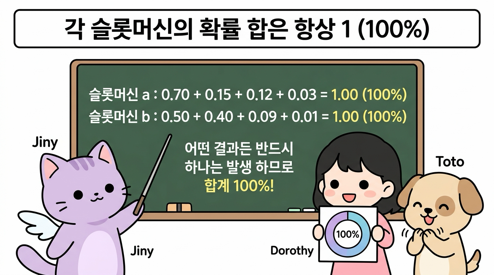

---

### 2. 두 슬롯머신의 기댓값 비교와 선택

어떤 슬롯머신이 더 좋은 기계일까요? 

* 슬롯머신 **b**는 꽝 확률이 50%로 낮아서(당첨 확률 50%) 얼핏 보면 더 자주 따는 좋은 기계처럼 보입니다.
* 반면 슬롯머신 **a**는 꽝 확률이 70%나 되어 언뜻 보면 손해를 많이 볼 것 같습니다.

하지만 사람의 직관이나 일시적인 승률에 현혹되지 않고, **장기적으로 플레이했을 때 진짜 더 많은 코인을 벌어다 주는 기계**를 객관적이고 수학적으로 가려내는 기준이 바로 **기댓값**expectation value입니다.

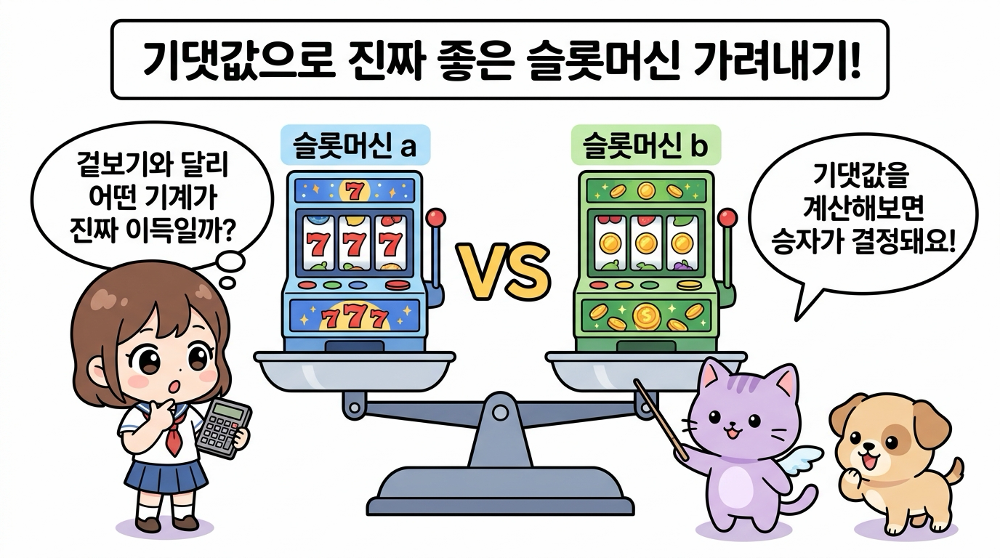

앞서 배운 기댓값 공식(모든 가능한 결과에 각각의 발생 확률을 곱하여 모두 더한 값)을 적용해 두 기계의 기댓값을 정밀하게 계산해 보겠습니다.

$$
\text{슬롯머신 a의 기댓값 } \mathbb{E}[X_a] = (0 \times 0.70) + (1 \times 0.15) + (5 \times 0.12) + (10 \times 0.03) = 1.05 \text{ 코인}
$$

$$
\text{슬롯머신 b의 기댓값 } \mathbb{E}[X_b] = (0 \times 0.50) + (1 \times 0.40) + (5 \times 0.09) + (10 \times 0.01) = 0.95 \text{ 코인}
$$

* **수학적 계산 결과**: 
  * 슬롯머신 a를 플레이하면 레버를 한 번 당길 때마다 평균적으로 **1.05개**의 코인을 기대할 수 있습니다.
  * 슬롯머신 b를 플레이하면 레버를 한 번 당길 때마다 평균적으로 **0.95개**의 코인을 기대할 수 있습니다.
* **합리적 의사결정**: 
  * 비록 슬롯머신 b가 자잘하게 자주 당첨되는 느낌을 주더라도, 대박 보상 확률이 더 높은 **슬롯머신 a가 장기적으로 판당 0.10개씩 더 많은 코인을 안겨주는 우수한 기계**입니다.
  * 따라서 장기적인 수익을 극대화하려면 망설임 없이 **슬롯머신 a를 선택**해야 합니다.

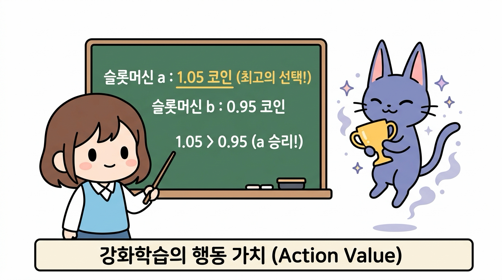

> **NOTE_ 행동 가치(Action Value)와의 연결**
> 강화 학습에서는 특정 행동(*A = a*)을 취했을 때 얻게 될 보상(*R*)의 기댓값을 특별히 **행동 가치**action value 또는 **가치**value라고 부르며, 수식으로는 보통 *Q*(*a*) 또는 *q**(*a*)로 표기합니다.
>
> $$
> Q(a) = \mathbb{E}[R \mid A = a]
> $$
>
> 강화 학습 에이전트의 궁극적인 목표는 각 행동의 가치를 스스로 학습하여, **행동 가치(기댓값)가 가장 높은 최적의 행동을 선택**하는 것입니다.

---

## 3.2.6 강화 학습 용어로 정리하는 밴디트 메커니즘

지금까지 살펴본 슬롯머신 문제를 강화 학습 학계의 공식 표준 프레임워크로 체계화해 보겠습니다. 밴디트 문제는 복잡한 강화 학습의 핵심 원리를 가장 단순하고 명확하게 축약해 놓은 **'강화 학습의 기본 모델'**입니다.

강화 학습의 4대 핵심 구성 요소는 다음과 같이 매핑됩니다.

* **에이전트 (Agent)**: 어떤 슬롯머신을 당길지 스스로 고민하고 의사결정을 내려 행동을 실행하는 주체인 **플레이어 (또는 AI 알고리즘)**입니다.
* **환경 (Environment)**: 에이전트를 둘러싼 외부 세계이자 상호작용의 대상인 **슬롯머신 기계들**입니다.
* **행동 (Action, *A* 또는 *A**t*)**: 에이전트가 매 시점(*t*)마다 선택할 수 있는 대안으로, 여러 기계 중 하나를 골라 레버를 당기는 **선택**입니다. (예: 슬롯머신 a 선택 또는 b 선택)
* **보상 (Reward, *R* 또는 *R**t*)**: 행동을 취한 즉시 환경(슬롯머신)으로부터 주어지는 결과이자 수치적 피드백인 **획득 코인 개수**입니다. (예: 코인 0개, 1개, 5개, 10개)

**그림 3-12** 밴디트 문제와 강화학습 상호작용 루프

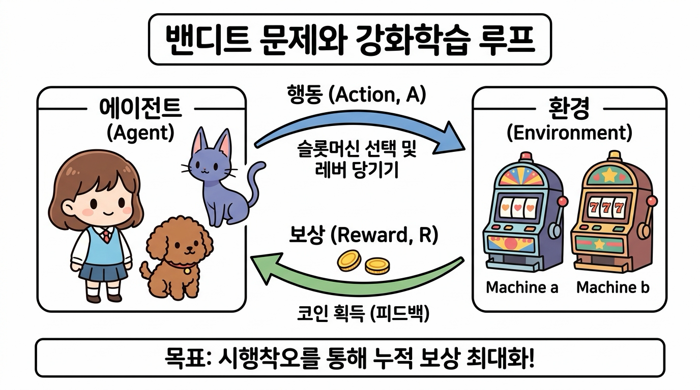

---

### 밴디트 문제와 강화 학습의 핵심 연결점

1. **시행착오를 통한 학습 (Trial and Error)**: 
   에이전트는 각 슬롯머신의 내부 확률이나 진짜 기댓값을 사전에 전혀 알지 못합니다. 오직 직접 레버를 당겨보고(행동), 나오는 코인(보상)을 관찰하는 **시행착오(Trial and Error)** 과정을 거치며 어떤 기계가 좋은지 스스로 학습해 나갑니다.
2. **누적 보상의 최대화 (Maximizing Cumulative Reward)**: 
   강화 학습의 궁극적인 목표는 한두 번의 일시적인 운에 기대는 것이 아니라, 여러 번의 기회 동안 얻을 수 있는 **전체 코인의 총합(누적 보상)을 극대화**하는 최적의 의사결정 전략을 찾아내는 것입니다.

> **NOTE_ 상태(State)가 없는 단일 상태(Stateless) 문제**
> 일반적인 강화 학습(자율주행, 체스, 로봇 보행 등)에서는 행동을 취할 때마다 주변 상황인 **상태(State, *S*)**가 끊임없이 변화합니다. (예: 로봇이 발을 내딛으면 로봇의 위치와 균형 상태가 바뀜)
> 하지만 기본 밴디트 문제에서는 슬롯머신의 확률 설정이 도중에 바뀌지 않으며 판마다 상황이 독립적으로 유지되므로, **상태의 변화를 고려할 필요가 없는 가장 순수한 형태의 단일 상태(Stateless) 강화 학습**입니다. (상태가 계속 변화하는 순차적 의사결정 문제는 다음 장부터 본격적으로 다룹니다.)

---

## 3.2.7 수학 기호와 읽는 방법 총정리

수학 공식에 지레겁먹을 필요 없습니다. 아래 표를 보며 하나씩 한국어로 소리 내어 읽어보면 쉽게 친숙해질 수 있습니다.

| 기호 | 수학적 의미 | 한글로 읽는 방법 | 쉬운 해설 |
|---|---|---|---|
| ***R*** | 보상 (Reward) | **알(R)** | 슬롯머신에서 튀어나오는 코인의 개수입니다. |
| ***R**t*** | *t*번째 시점의 보상 | **알 티(R sub t)** | *t*번째 판을 돌렸을 때 획득한 코인의 개수입니다. |
| ***A*** | 행동 (Action) | **에이(A)** | 내가 취한 선택(a 기계 선택 혹은 b 선택)입니다. |
| **𝔼[*R*]** | 보상 *R*의 기댓값 | **익스펙테이션 알** (또는 보상 R의 기댓값) | 수없이 많이 플레이했을 때 예상되는 평균 코인 개수입니다. |
| **𝔼[*R* \| *A* = *a*]** | 행동이 *a*일 때 보상 *R*의 조건부 기댓값 | **익스펙테이션 알 바 에이 콜론 에이** | **"슬롯머신 a를 골라서 당겼을 때"** 얻을 것으로 예상되는 평균 코인 갯수입니다. |
| ***q*(*A*)** | 행동 *A*의 참 가치 | **큐 에이 (q of A)** | 하늘만이 알고 있는 기계의 실제 기댓값(진짜 가치)입니다. |
| ***Q*(*A*)** | 행동 *A*의 추정 가치 | **대문자 큐 에이** | 플레이어가 실제로 돌려보면서 "이 기계는 평균 이 정도 주는 것 같네" 하고 추측하는 가치입니다. |

---

### 행동 가치 공식

행동 *A*를 취했을 때 우리가 얻게 될 행동 가치 *q*(*A*)는 다음과 같이 수학적으로 표기할 수 있습니다.

$$
q(A) = \mathbb{E}[R \mid A]
$$

처음 보면 복잡해 보이지만, 공식을 구성하는 4개의 기호를 하나씩 분해하여 살펴보면 매우 직관적이고 쉬운 의미를 담고 있습니다.

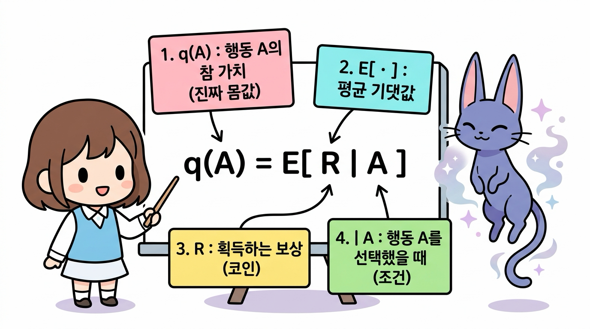

#### 기호별 4단계 상세 분해

1. **1단계. *q*(*A*) : 행동 *A*의 '참 가치(True Value)'**
   - 소문자 *q*는 세상의 진리처럼 존재하는 **진짜 정답 가치(참 가치)**를 뜻합니다.
   - 괄호 안의 *A*는 에이전트의 **행동(Action)**을 나타냅니다. 예를 들어 슬롯머신 a를 골라 레버를 당기는 행동입니다.
   - 즉, *q*(*A*)는 **"행동 *A*가 지닌 본질적인 진짜 몸값"**을 의미합니다.

2. **2단계. 𝔼[ · ] : 수많은 시행의 '평균 기댓값(Expected Value)'**
   - 대문자 𝔼는 기댓값(Expectation)의 기호로, 그 행동을 수없이 많이 반복했을 때 수렴하게 될 **장기적인 평균값**을 계산하겠다는 뜻입니다.

3. **3단계. *R* : 에이전트가 돌려받는 '보상(Reward)'**
   - 레버를 당겼을 때 슬롯머신이 뱉어내는 코인 개수(0개, 1개, 5개, 10개)입니다. 
   - 결과가 매번 확률에 따라 결정되므로 **확률변수**입니다.

4. **4단계. `|` *A* : '행동 *A*를 선택했을 때'라는 조건부 기호**
   - 칸막이 기호 `|` 뒤에 *A*가 붙어, **"수많은 행동 중 오직 특정 기계(행동 *A*)를 골라 레버를 당겼을 때"**라는 전제 조건을 한정합니다.

> **💡 한 줄로 읽는 행동 가치 공식**
> **"행동 *A*(슬롯머신 a 플레이)를 선택했을 때(`| A`), 얻게 될 보상 *R*들의 평균 기댓값(𝔼)이 곧 그 행동의 참 가치 *q*(*A*)이다!"**

---

### '보상(Reward)'과 '가치(Value)'의 결정적 차이

강화 학습을 배울 때 가장 많이 혼동하는 두 개념이 바로 **보상**과 **가치**입니다.

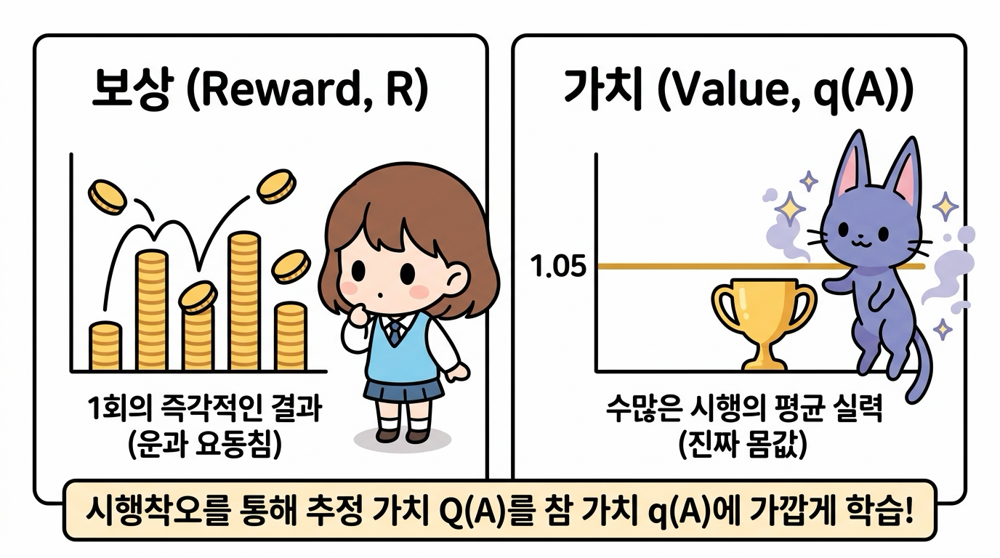

* **보상 (Reward, *R*)**: 어떤 행동을 딱 한 번 했을 때 즉시 돌려받는 **1회성 결과**입니다. 운에 따라 코인이 10개 쏟아지기도 하고 0개 꽝이 나오기도 하여 매 판 심하게 요동칩니다. (일시적인 행운과 불운)
* **가치 (Value, *q*(*A*))**: 그 행동을 수백, 수천 번 반복했을 때 기대할 수 있는 **행동 자체의 진짜 실력(평균 몸값)**입니다. 예를 들어 슬롯머신 a의 한 판당 평균 코인 획득량이 1.05개라면, 슬롯머신 a를 고르는 행동의 진짜 가치는 언제나 흔들림 없이 **1.05**입니다.

> **NOTE_ 추정 가치 *Q*(*A*)와 참 가치 *q*(*A*)**
> 에이전트는 하늘만이 알고 있는 실제 참 가치 *q*(*A*)를 처음에는 전혀 알 수 없습니다.
> 따라서 슬롯머신을 직접 여러 번 당겨보는 **시행착오(Trial and Error)**를 거치며 얻은 보상들을 바탕으로 자신만의 **추정 가치 *Q*(*A*)**를 계속 계산하고 업데이트합니다.
> 
> **시행 횟수가 늘어날수록 추정 가치 *Q*(*A*)는 진짜 참 가치 *q*(*A*)에 완벽하게 수렴**하게 되며, 에이전트는 이를 통해 가장 가치가 높은 최고의 슬롯머신을 확신을 가지고 선택할 수 있게 됩니다.

---

## 3.2.8 오늘 공부한 핵심 요약

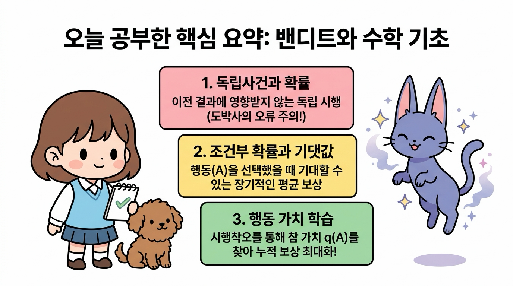

1. **독립사건과 고정 확률**: 슬롯머신은 이전 판의 결과가 다음 판에 영향을 주지 않는 **독립사건**으로 동작합니다. 따라서 "직전에 꽝이었으니 이번엔 터지겠지" 같은 직관은 수학적으로 명백한 오류(도박사의 오류)입니다.
2. **조건부 확률과 기댓값**: 내가 어떤 기계를 선택했는가(*A* = *a*)라는 조건 하에 주어지는 보상의 조건부 확률 구조를 통해, 각 기계의 장기적인 평균 보상 수준인 **기댓값(행동 가치)**을 정밀하게 계산하고 비교할 수 있습니다.
3. **행동 가치 학습의 목표**: 강화 학습 에이전트의 궁극적인 목표는 각 기계의 보상 기댓값인 참 가치 *q*(*A*) = 𝔼[*R* | *A*]를 직접 플레이해보는 시행착오를 통해 스스로 추정(*Q*(*A*))해 내고, **누적 보상을 최대로 만들어 줄 최고의 슬롯머신을 찾아내는 것**입니다.
