# 3.3 밴디트 알고리즘

가장 우수한 결과를 내는 기계를 믿고 선택하는 **활용(Exploitation)**과, 더 나은 대박 기계가 숨어있을까 봐 새로운 행동을 도전해보는 **탐색(Exploration)**의 적절한 조화법을 알아봅니다.


**그림 03-3** 마법의 입체 엡실론(ε) 주사위를 쥐고서 최적의 길(활용)과 새로운 모험(탐색) 사이에서 저울질하는 도로시와 마법 고양이 지니
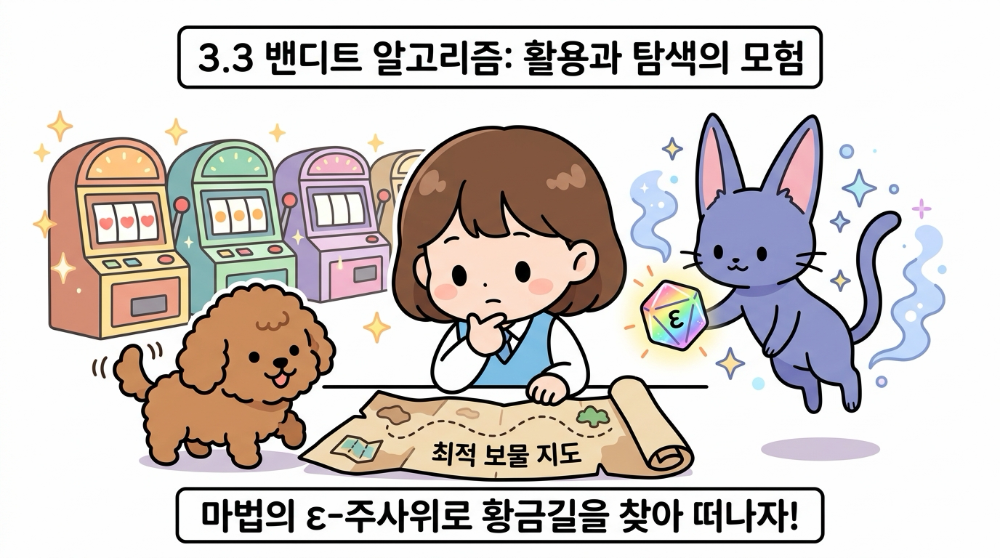

마법 고양이 지니가 선물해준 마법의 엡실론(ε) 주사위를 굴리며 최적의 보상 길을 찾아가는 **ε-탐욕(Epsilon-Greedy) 알고리즘**의 비결을 이번 절에서 정복해 봅시다!


---


## 3.3.1 가치 추정의 원리

밴디트 문제에서 플레이어는 슬롯머신 속에 감춰진 '진짜 가치(보상 **기댓값**)'를 직접 들여다볼 수 없습니다.

```
• 만약 각 슬롯머신의 진짜 가치(보상 기댓값)를 안다면? 
  → 플레이어는 망설임 없이 가장 좋은 슬롯머신만 계속 고르면 됩니다.
• 하지만 플레이어는 각 슬롯머신의 진짜 가치를 결코 알 수 없습니다.
• 따라서 플레이어는 직접 플레이해보며 각 슬롯머신의 가치를 '추정'해야 합니다!
```

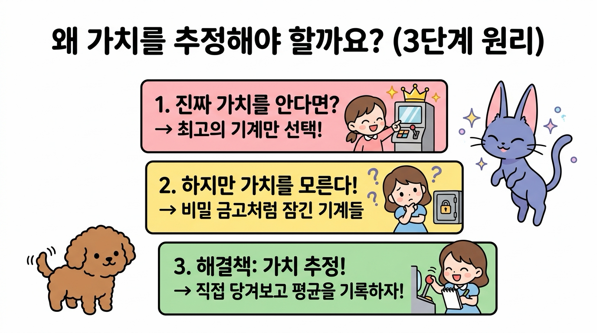


---


### 1. 왜 진짜 가치를 두고 '추정'할 수밖에 없을까요?

슬롯머신 앞에 선 도로시가 고개를 갸우뚱하며 수첩을 들고 고민에 빠집니다.

> 👧 **도로시**: "지니야, 슬롯머신마다 평균적으로 코인을 몇 개씩 주는지 '진짜 가치'를 알 수 있다면 제일 좋은 기계만 골라 당길 텐데... 기계 속이 굳게 닫혀 있어서 안 보여!"
>
> 🐱 **지니**: "맞아, 도로시! 슬롯머신의 내부는 튼튼한 강철 금고로 잠긴 **블랙박스(Black Box)**와 같단다. 우리가 눈으로 확인할 수 있는 건 레버를 당겼을 때 튀어나오는 '그 판의 코인 개수(일시적 보상)'뿐이지!"

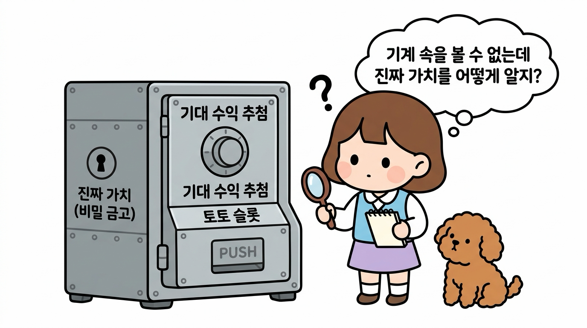

우리가 진짜 가치를 직접 보지 못하고 **'추정'**할 수밖에 없는 본질적인 이유는 다음과 같습니다.

1. **기계의 내부는 '블랙박스'입니다**: 
   슬롯머신 안에 프로그래밍된 참된 **확률**과 진짜 **기댓값**(참 가치 *q*)은 비밀 금고처럼 숨겨져 있어 직접 읽어낼 수 없습니다.
2. **보상은 매 판 운에 의해 요동칩니다 (확률적 노이즈)**:
   참 가치가 1.05인 아주 우수한 슬롯머신이라도 어떤 판에는 꽝(0개)이 나오고, 참 가치가 0.95인 기계에서도 우연히 대박(10개)이 터질 수 있습니다. 단 한두 번의 결과만으로는 기계의 참모습을 결코 알 수 없습니다.


---


### 2. 플레이 횟수를 늘려야 하는 이유 (큰 수의 법칙)

그렇다면 어떻게 해야 블랙박스 속 진짜 가치를 알아낼 수 있을까요? 마법 고양이 지니가 칠판을 띄우며 명쾌하게 설명해 줍니다.

> 🐱 **지니**: "비결은 바로 통계학의 가장 위대한 마법, **'큰 수의 법칙(Law of Large Numbers)'**에 있단다! 동전을 딱 두 번 던져서 앞면이 2번 나왔다고 앞면 확률이 100%일까?"
>
> 👧 **도로시**: "아니지! 1,000번, 10,000번 던지다 보면 결국 50%에 가까워지잖아!"
>
> 🐱 **지니**: "빙고! 슬롯머신도 마찬가지야. 많이 당겨서 얻은 코인들의 평균(표본 평균)을 구하면, 일시적인 행운과 불운(노이즈)이 상쇄되면서 기계의 '진짜 가치'가 저절로 모습을 드러내게 된단다!"

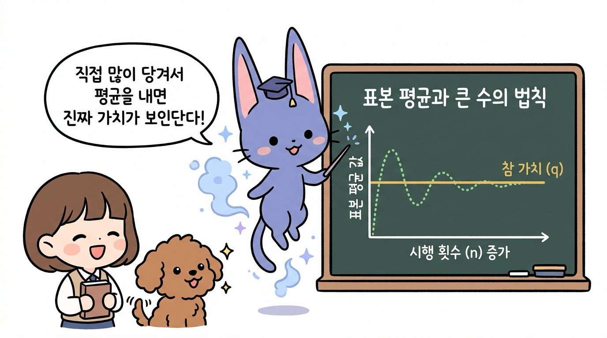

* **노이즈의 상쇄**: 플레이 횟수(*n*)가 적을 때는 우연이라는 왜곡(노이즈)이 심하지만, 횟수를 늘릴수록 평균값은 오차 없이 기계의 참 가치(*q*)로 정확하게 수렴합니다.
* **표본 평균(Sample Mean)**: 슬롯머신을 실제로 플레이하여 얻은 보상들의 평균값을 표본 평균이라고 부르며, 이것이 곧 우리가 구하고자 하는 **가치 추정치(*Q*)**가 됩니다.


---


## 3.3.2 표본 평균 구하기와 증분 공식 유도

이제 표본 평균을 수학 공식으로 정의하고, 컴퓨터로 계산할 때 발생하는 심각한 계산량 및 메모리 한계와 이를 마법처럼 해결하는 **증분 공식(Incremental Formula)**의 강력한 원리를 단계별로 살펴보겠습니다.

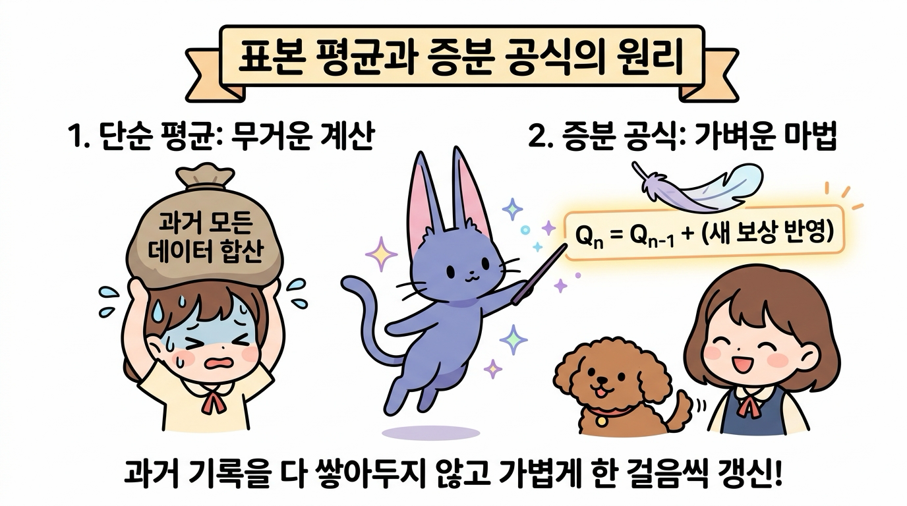

---


### 1. 단순 표본 평균의 개념과 수식, 파이썬 구현

#### ① 단순 표본 평균의 기본 개념
슬롯머신 한 대에 집중하여 레버를 계속 당기는 상황을 상상해 봅시다. 매 판 튀어나오는 코인(*R*<sub>1</sub>, *R*<sub>2</sub>, ..., *R*<sub>*n*</sub>)들을 투명한 상자에 모아두고, 지금까지 플레이한 총 횟수(*n*)로 공평하게 나누어 주는 것이 바로 **표본 평균(Sample Mean)**입니다.

> 👧 **도로시**: "지니야, 슬롯머신을 여러 번 돌렸을 때 지금까지 얻은 보상들을 어떻게 하나로 요약해서 기계의 가치로 삼는 거야?"
>
> 🐱 **지니**: "간단해, 도로시! 매 판 얻은 코인들을 전부 모아 상자에 담은 뒤, 플레이한 횟수(*n*)만큼 똑같이 나누어 '한 판당 평균 코인 수'를 구하면 된단다!"

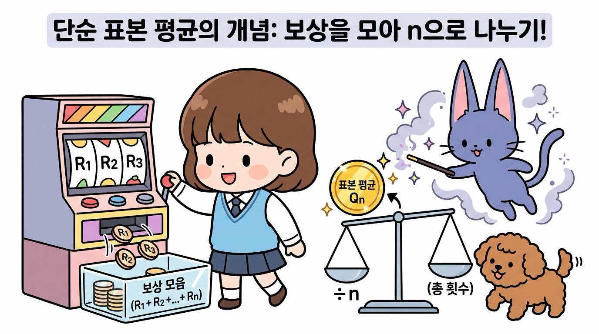

#### ② 단순 표본 평균의 수식적 정의
어떤 하나의 슬롯머신(행동)만을 총 *n*번 수행했을 때, *n*번째 행동 가치 추정치 *Q*<sub>*n*</sub>은 다음과 같은 산술평균 공식으로 수학적으로 정의됩니다.

$$
Q_n = \frac{R_1 + R_2 + \dots + R_n}{n} = \frac{1}{n} \sum_{i=1}^{n} R_i
$$
<div style="text-align: right; color: #888; font-size: 0.9em;">[식 3.1 단순 표본 평균 공식]</div>

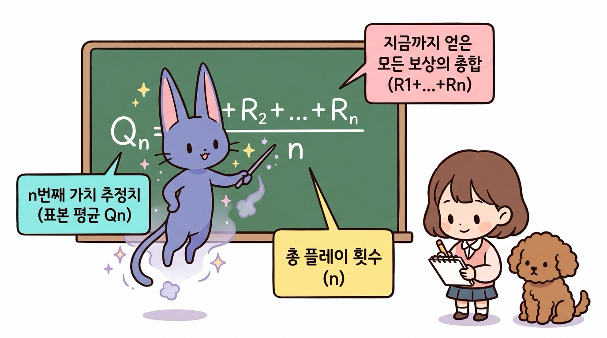

* **분자 (*R*<sub>1</sub> + *R*<sub>2</sub> + ... + *R*<sub>*n*</sub>)**: 1회부터 *n*회까지 플레이하며 실제로 획득한 **모든 보상의 총합**입니다.
* **분모 (*n*)**: 지금까지 레버를 당긴 **총 플레이(시도) 횟수**입니다.
* **결과 (*Q*<sub>*n*</sub>)**: *n*번의 시도를 거쳐 추정한 **해당 슬롯머신의 표본 평균 가치**입니다.

#### ③ 파이썬 단순 구현 코드
[식 3.1]을 파이썬 코드로 직관적으로 구현해 보겠습니다. 10번 플레이하면서 매 판 얻은 보상을 리스트에 추가하고, 내장 함수 `sum()`을 이용해 표본 평균을 계산합니다.

```python
import numpy as np

np.random.seed(0)  # 일관된 실험 결과를 위한 난수 시드 고정
rewards = []       # 과거 보상들을 저장할 리스트

for n in range(1, 11):  # 1부터 10까지 10번 플레이
    reward = np.random.rand()  # 0.0 이상 1.0 미만의 무작위 보상 발생 (시뮬레이션)
    rewards.append(reward)     # 새 보상을 리스트의 맨 뒤에 추가
    Q = sum(rewards) / n       # [식 3.1] 모든 보상의 합을 현재 판수 n으로 나눔
    print(f"판수 {n:2d}: 최신 보상 = {reward:.4f} → 표본 평균 Q = {Q:.4f}")
```

**실행 결과**
```text
판수  1: 최신 보상 = 0.5488 → 표본 평균 Q = 0.5488
판수  2: 최신 보상 = 0.7152 → 표본 평균 Q = 0.6320
판수  3: 최신 보상 = 0.6028 → 표본 평균 Q = 0.6223
판수  4: 최신 보상 = 0.5449 → 표본 평균 Q = 0.6029
판수  5: 최신 보상 = 0.4237 → 표본 평균 Q = 0.5671
...
판수 10: 최신 보상 = 0.3834 → 표본 평균 Q = 0.6158
```

#### ④ 파이썬 코드 실행 흐름 다이어그램
위 파이썬 루프가 매 판 어떻게 실행되는지 시각적인 흐름도로 살펴보겠습니다.

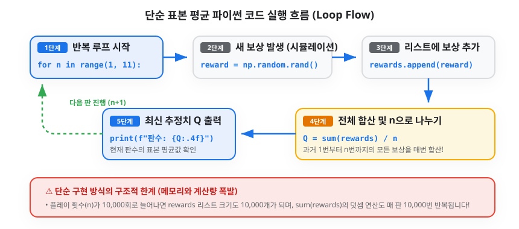

---


### 2. 단순 구현의 한계: 메모리와 계산량의 폭발

하지만 이 단순한 방식에는 심각한 문제가 숨어 있습니다. 도로시가 끝없이 쌓인 수첩을 보며 진땀을 흘립니다.

> 👧 **도로시**: "으악, 지니야! 10,000판을 돌리면 10,000개의 코인 기록을 수첩에 다 적어두고, 매 판마다 10,000개를 처음부터 끝까지 다 더해야 해? 수첩도 모자라고 계산하다가 머리가 터질 것 같아!"
>
> 🐶 **토토**: "낑낑! (계산기에서 연기가 나요!)"


* **메모리 낭비**: 플레이 횟수(*n*)가 늘어날수록 과거의 모든 보상을 저장하기 위한 메모리가 끝없이 증가합니다 (*O*(*n*) 공간 복잡도).
* **계산량 폭발**: 매 판마다 `sum(rewards)`로 *n*개의 숫자를 처음부터 다시 더해야 하므로, 총 계산량이 *O*(*n*<sup>2</sup>)으로 폭증하여 속도가 급격히 느려집니다.
* 

---


### 3. 지니의 마법 해결책: 증분 공식(Incremental Formula) 유도

지니가 마법 지팡이를 휘두르며 도로시를 안심시킵니다.

> 🐱 **지니**: "걱정 마, 도로시! 과거의 10,000개 기록을 전부 기억할 필요가 전혀 없단다. **'직전 판까지의 평균(*Q*<sub>*n-1*</sub>)'**과 **'방금 새로 얻은 보상(*R*<sub>*n*</sub>)'** 딱 2개만 있으면 새로운 평균(*Q*<sub>*n*</sub>)을 순식간에 계산할 수 있는 마법의 공식이 있거든!"

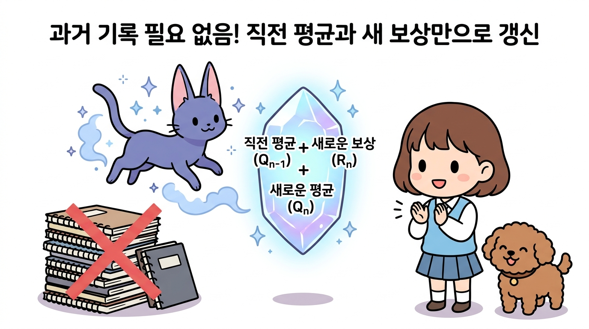

---

수식이 유도되는 과정을 3단계로 차근차근 살펴보겠습니다.

#### 1단계: 직전 평균 *Q*<sub>*n-1*</sub>에서 과거 보상 총합 유도하기
*n* - 1번째 시점까지의 표본 평균 정의는 다음과 같습니다.

$$
Q_{n-1} = \frac{R_1 + R_2 + \dots + R_{n-1}}{n-1}
$$

양변에 (*n* - 1)을 곱하면, 과거에 얻었던 1번째부터 *n* - 1번째까지의 모든 보상 총합을 '직전 평균' 하나로 묶어낼 수 있습니다.

$$
R_1 + R_2 + \dots + R_{n-1} = (n-1)Q_{n-1}
$$
<div style="text-align: right; color: #888; font-size: 0.9em;">[식 3.2 과거 보상들의 총합]</div>

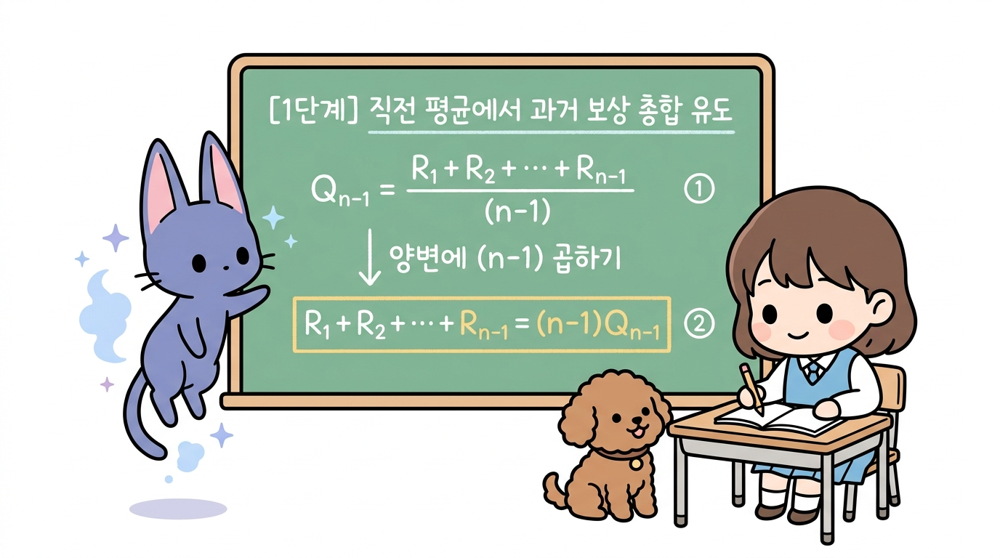

---

#### 2단계: *Q*<sub>*n*</sub> 식에 대입하여 두 부분으로 분해하기
*n*번째 표본 평균 식에서 과거 보상들의 합 부분을 방금 구한 [식 3.2]로 쏙 바꿔 대입합니다.

$$
Q_n = \frac{R_1 + \dots + R_{n-1} + R_n}{n}
$$

$$
= \frac{(n-1)Q_{n-1} + R_n}{n}
$$
<div style="text-align: right; color: #888; font-size: 0.9em;">[식 3.3 대입 식]</div>

이제 분수를 '과거 평균 덩어리'와 '새 보상 덩어리' 둘로 분해해 줍니다.

$$
= \frac{n-1}{n}Q_{n-1} + \frac{1}{n}R_n
$$

$$
= \left(1 - \frac{1}{n}\right)Q_{n-1} + \frac{1}{n}R_n
$$
<div style="text-align: right; color: #888; font-size: 0.9em;">[식 3.4 분해 식]</div>

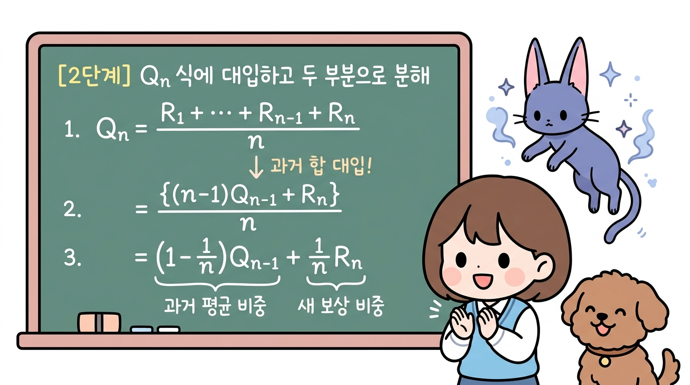

---

#### 3단계: 최종 증분 공식 완성 (오차와 갱신 구조)
[식 3.4]의 괄호를 풀고 *Q*<sub>*n-1*</sub>을 기준으로 예쁘게 묶어주면 기적처럼 아름다운 공식이 완성됩니다!

$$
Q_n = Q_{n-1} - \frac{1}{n}Q_{n-1} + \frac{1}{n}R_n
$$

$$
Q_n = Q_{n-1} + \frac{1}{n}(R_n - Q_{n-1})
$$
<div style="text-align: right; color: #888; font-size: 0.9em;">[식 3.5 증분 갱신 공식]</div>

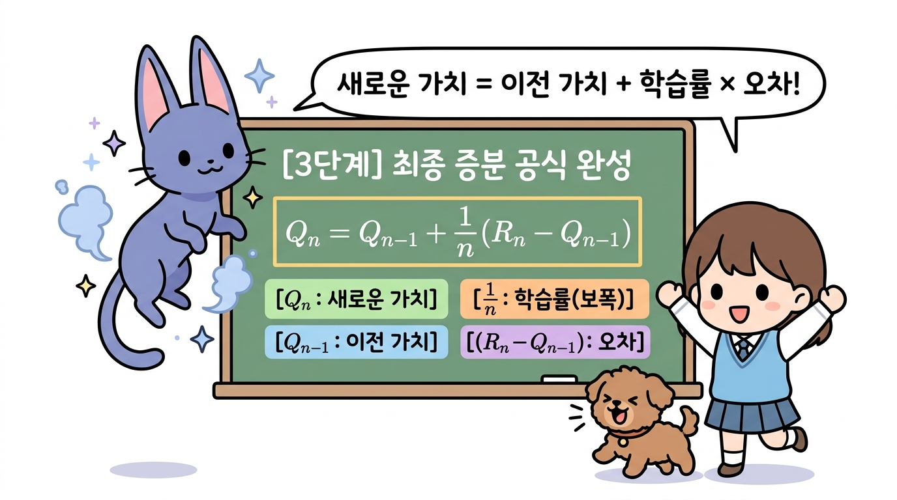

---


### 4. 증분 공식의 구조와 기하학적 의미

수식을 가만히 관찰하던 도로시의 눈이 번쩍 뜨입니다.

> 👧 **도로시**: "지니야! 수식을 가만히 뜯어보니까, 내가 지금 서 있는 자리(*Q*<sub>*n-1*</sub>)에서 방금 들어온 새로운 보상(*R*<sub>*n*</sub>)이라는 목적지를 향해 한 걸음 걸어가는 느낌이야!"
>
> 🐱 **지니**: "정확해, 도로시! 바로 그게 증분 공식에 담긴 놀라운 **'기하학적 의미(Geometric Meaning)'**란다! 이 수식은 단순한 평균 계산법을 넘어, 앞으로 우리가 배울 **모든 강화 학습 알고리즘(TD 학습, Q-러닝 등)을 관통하는 만능 갱신 뼈대**란다!"
>
> 🐶 **토토**: "멍멍! (목표 사과를 향해 꼬리를 흔들며 발걸음을 옮겨요!)"

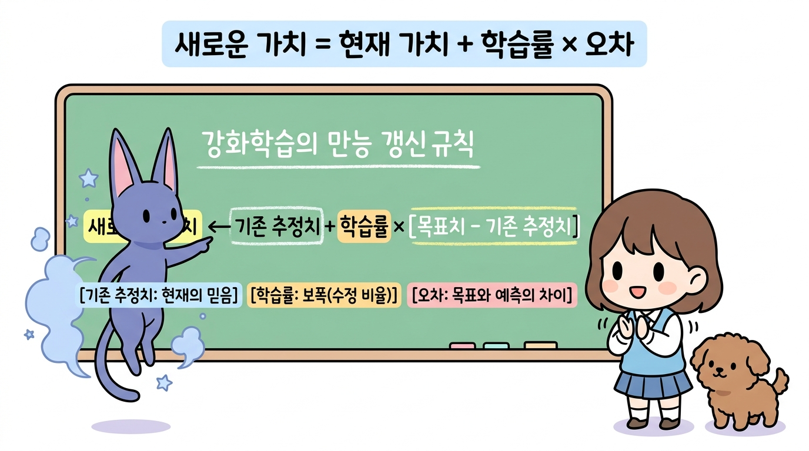

#### ① 강화 학습의 만능 갱신 뼈대 (Universal Update Rule)
증분 공식 [식 3.5]를 일반적인 언어로 풀어서 쓰면 다음과 같은 형태가 됩니다.

$$
\text{새로운 추정치} \leftarrow \text{기존 추정치} + \text{학습률} \times \left[ \text{목표치} - \text{기존 추정치} \right]
$$
<div style="text-align: right; color: #888; font-size: 0.9em;">[식 3.6 강화 학습 일반 갱신 형태]</div>

이 식을 구성하는 세 가지 핵심 요소는 다음과 같습니다:

1. **기존 추정치 (*Q*<sub>*n-1*</sub>)**:
   - 에이전트가 지금까지의 경험을 바탕으로 믿고 있던 **현재의 기준 가치(출발점)**입니다.
2. **오차 (Error, *R*<sub>*n*</sub> - *Q*<sub>*n-1*</sub>)**:
   - "실제로 들어온 목표치(*R*<sub>*n*</sub>)"와 "내가 기대했던 기존 추정치(*Q*<sub>*n-1*</sub>)" 사이의 **예측 빗나감(오차)**입니다.
   - 앞으로 가치를 수정해야 할 **'방향'과 '거리'**를 가리킵니다.
   - **실제 보상이 더 좋을 때 (*R*<sub>*n*</sub> > *Q*<sub>*n-1*</sub>)**: 양(+)의 오차가 발생하여 가치를 위로 올려줍니다.
   - **실제 보상이 더 나쁠 때 (*R*<sub>*n*</sub> < *Q*<sub>*n-1*</sub>)**: 음(-)의 오차가 발생하여 가치를 아래로 깎아내립니다.
3. **학습률 (Learning Rate / Step-size, 1/*n*)**:
   - 발생한 오차를 새로운 가치에 얼마만큼의 비율로 반영할 것인지를 정하는 **보폭(Step-size)**입니다.

---

#### ② 수직선 상의 이동: 기하학적 의미

증분 공식을 수직선 상의 이동으로 바라보면 훨씬 더 직관적으로 이해할 수 있습니다.

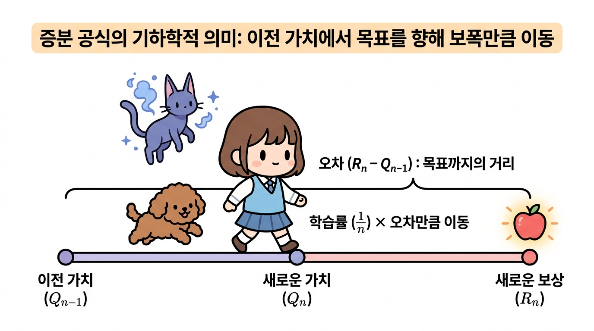

* **출발점**: 현재 나의 믿음인 **이전 가치 *Q*<sub>*n-1*</sub>**에 서 있습니다.
* **목표점**: 방금 실제로 관측된 **새로운 보상 *R*<sub>*n*</sub>**이 목표 지점입니다.
* **이동 거리**: 둘 사이의 간격인 **오차 (*R*<sub>*n*</sub> - *Q*<sub>*n-1*</sub>)**만큼 떨어져 있습니다.
* **한 걸음 전진**: 목표 지점까지 한 번에 순간이동하지 않고, **학습률 1/*n*의 비율만큼 보폭을 내딛어 새로운 가치 *Q*<sub>*n*</sub>에 도달**합니다.

> **💡 보폭(학습률 1/*n*)이 자동으로 조절되는 원리**
> * **초반 (*n*이 작을 때, 예: *n* = 2)**: 학습률 1/*n* = 50%로 매우 큽니다. 아직 경험이 적으므로 새로운 보상을 성큼성큼 큰 걸음으로 적극 수용합니다.
> * **후반 (*n*이 클 때, 예: *n* = 100)**: 학습률 1/*n* = 1%로 매우 작아집니다. 이미 100번의 충분한 경험이 쌓였으므로, 한두 번의 운이나 노이즈에 휘둘리지 않고 아주 미세하게 징검다리를 건너듯 **진짜 참 가치(*q*)로 안정적으로 수렴**합니다.

---


### 5. 파이썬 증분 구현 코드

도로시가 과거의 무거운 수첩을 내려놓고 가벼운 미소를 짓습니다.

> 👧 **도로시**: "지니야! 과거 10,000개 기록을 저장하던 `rewards` 리스트를 싹 버리고, 오직 `Q` 변수 딱 하나만 사용해서 코드를 작성해 볼게!"
>
> 🐱 **지니**: "완벽해, 도로시! 매 판마다 리스트를 처음부터 다시 더하는 `sum()` 함수도 전혀 필요 없단다. 증분 공식 `Q += (reward - Q) / n` 단 한 줄이면 번개처럼 빠른 속도로 평균이 갱신된단다!"

#### ① 파이썬 증분 구현 코드
[식 3.5]를 적용하여 과거 보상 리스트 없이 단일 변수 `Q`만으로 구현한 파이썬 코드입니다.

```python
import numpy as np

np.random.seed(0)  # 이전 단순 구현과 완벽한 비교를 위해 동일한 시드 설정
Q = 0.0            # 과거 보상 리스트 없이, 단 하나의 가치 추정치 변수만 초기화

for n in range(1, 11):  # 1부터 10까지 10번 플레이
    reward = np.random.rand()  # 슬롯머신 레버를 당겨 얻은 새 보상 (R_n)
    
    # [식 3.5] 증분 공식 적용: Q_n = Q_{n-1} + (R_n - Q_{n-1}) / n
    Q += (reward - Q) / n
    print(f"판수 {n:2d}: 최신 보상 = {reward:.4f} → 증분 갱신된 가치 Q = {Q:.4f}")
```

**실행 결과**
```text
판수  1: 최신 보상 = 0.5488 → 증분 갱신된 가치 Q = 0.5488
판수  2: 최신 보상 = 0.7152 → 증분 갱신된 가치 Q = 0.6320
판수  3: 최신 보상 = 0.6028 → 증분 갱신된 가치 Q = 0.6223
판수  4: 최신 보상 = 0.5449 → 증분 갱신된 가치 Q = 0.6029
판수  5: 최신 보상 = 0.4237 → 증분 갱신된 가치 Q = 0.5671
판수  6: 최신 보상 = 0.6459 → 증분 갱신된 가치 Q = 0.5802
판수  7: 최신 보상 = 0.4376 → 증분 갱신된 가치 Q = 0.5598
판수  8: 최신 보상 = 0.8918 → 증분 갱신된 가치 Q = 0.6013
판수  9: 최신 보상 = 0.9637 → 증분 갱신된 가치 Q = 0.6416
판수 10: 최신 보상 = 0.3834 → 증분 갱신된 가치 Q = 0.6158
```

> **✨ 결과 비교**: 앞서 작성했던 단순 구현 코드의 결과와 **단 0.0001의 오차도 없이 100% 동일한 값**을 출력합니다! 수학적으로 완전히 같은 산술평균을 구하면서도, 컴퓨터 자원은 기적처럼 가볍게 사용합니다.

---

#### ② 증분 구현 파이썬 코드의 실행 흐름
컴퓨터 메모리 내부에서 단 하나의 변수 `Q`가 어떻게 즉시 갱신되며 루프를 순환하는지 단계별 흐름도를 확인해 봅시다.

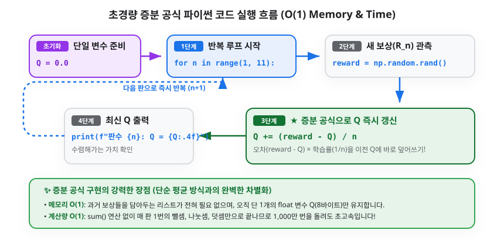

---

#### ③ 코드 핵심 연산 분해 및 복잡도 혁신

* **`Q += (reward - Q) / n`의 작동 원리**:
  1. **우변의 `Q`**: 직전 판까지의 가치 추정치인 *Q*<sub>*n-1*</sub>을 의미합니다.
  2. **`(reward - Q)`**: 방금 얻은 실제 보상과 예상치의 차이인 **오차(Error)**입니다.
  3. **`/ n`**: 오차에 현재 판수의 학습률 **1/*n***을 곱해줍니다.
  4. **`+=` 연산**: 계산된 미세 수정값을 기존 `Q`에 즉시 누적 덮어써서 새로운 추정치 *Q*<sub>*n*</sub>을 완성합니다.

| 비교 항목 | ① 단순 표본 평균 구현 (`sum`) | ② 증분 공식 구현 (`Q +=`) | 개선 효과 |
| :--- | :--- | :--- | :--- |
| **필요 메모리 (공간 복잡도)** | *O*(*n*) (과거 모든 보상 리스트 저장) | **단 *O*(1)** (단 1개의 float 변수 `Q`) | **무한대 플레이 가능 (메모리 절약 99.9%)** |
| **계산량 (시간 복잡도)** | 매 판 *O*(*n*) 덧셈 $\rightarrow$ 총 *O*(*n*<sup>2</sup>) | **매 판 단 1회의 연산 *O*(1)** | **1,000만 판을 돌려도 속도 저하 제로** |

---


## 3.3.3 에이전트의 행동 정책과 딜레마

가치를 추정하는 효율적인 방법을 알았으니, 이제 플레이어(도로시)가 여러 대의 슬롯머신 중에서 **"어떤 기계를 선택하여 레버를 당길 것인가?"**라는 의사결정 전략(정책)을 세워야 합니다.


### 1. 탐욕 정책(Greedy Policy)과 그 함정

도로시가 기발한 아이디어가 떠올랐다는 듯 외칩니다.

> 👧 **도로시**: "지니야! 지금까지 플레이해 본 결과 중에서 평균 점수(*Q*)가 가장 높은 최고의 슬롯머신 하나만 골라서 계속 당기면 무조건 대박이겠지? 이걸 **탐욕 정책(Greedy Policy)**이라고 부르자!"
>
> 🐱 **지니**: "잠깐, 도로시! 멈춰! 탐욕 정책에는 아주 무서운 함정이 도사리고 있단다!"

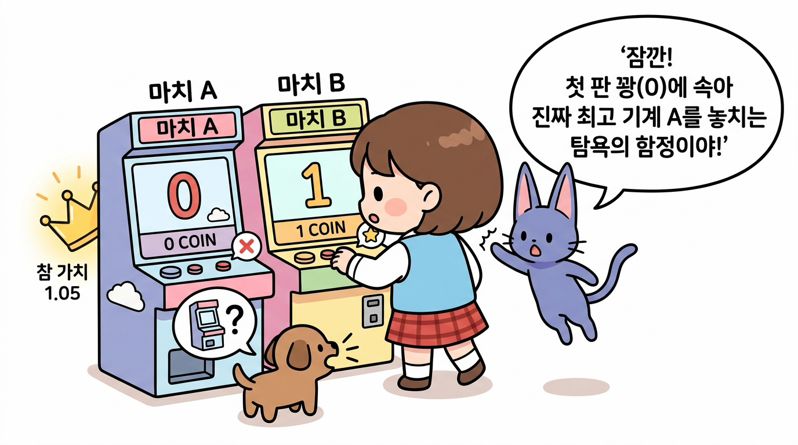

#### ⚠️ 탐욕 정책의 치명적인 함정 (조기 수렴의 오류)
* 상황을 가정해 봅시다:
  * **슬롯머신 A**: 진짜 참 가치가 **1.05**인 최고의 기계 (하지만 꽝 확률 70%)
  * **슬롯머신 B**: 진짜 참 가치가 **0.95**인 평범한 기계 (하지만 당첨률 50%)
* 도로시가 두 기계를 딱 한 번씩 시험 삼아 당겨보았습니다:
  * 슬롯머신 A를 당겼더니 하필 첫 판에 꽝이 나와 **0점**을 얻었습니다 (*Q*(*A*) = 0).
  * 슬롯머신 B를 당겼더니 운 좋게 **1점**을 얻었습니다 (*Q*(*B*) = 1).
* **탐욕 정책의 비극**: 
  * 탐욕 정책은 현재 추정치만 보고 *Q*(*B*) > *Q*(*A*)이므로 이후 영원히 **슬롯머신 B만 선택**합니다.
  * 사실은 슬롯머신 A가 훨씬 더 좋은 기계인데도, 단 한 번의 불운 때문에 A를 영원히 외면하게 되는 **'성급한 확신(조기 수렴)의 함정'**에 빠지게 됩니다!


---


### 2. 활용(Exploitation)과 탐색(Exploration)의 딜레마

초기의 불완전한 추정치만 믿고 탐욕스럽게 행동하면 진짜 최고의 보물을 영원히 놓칠 수 있습니다. 따라서 에이전트에게는 두 가지 상반된 행동이 필요합니다.


* **활용 (Exploitation)**: 
  - 지금까지의 경험상 가장 좋았던 기계를 믿고 선택하는 행동입니다. (현재의 이익 극대화)
  - *비유*: 늘 가던 익숙하고 맛있는 **단골 맛집**에 방문하기.
* **탐색 (Exploration)**: 
  - 가치 추정치의 정확도를 높이기 위해, 다른 기계들을 호기심을 갖고 시도해보는 행동입니다. (미래의 잠재력 발굴)
  - *비유*: 아직 가보지 않은 완전히 새로운 **신상 맛집**에 모험해 보기.

> **⚖️ 활용-탐색의 상충관계(Trade-off)**
> * 활용만 하면? → 새로운 대박 기회를 평생 발견하지 못합니다.
> * 탐색만 하면? → 꽝이 많은 나쁜 기계들을 계속 당기느라 코인을 낭비합니다.
> * **강화 학습의 핵심 과제**: "언제 익숙한 것을 활용하고, 언제 새로운 것을 탐색할 것인가?"


---


### 3. 지니의 마법 주사위: ε-탐욕(Epsilon-Greedy) 정책

이 어려운 딜레마를 가장 우아하고 단순하게 해결하기 위해, 지니가 도로시에게 마법의 주사위를 건넵니다.

> 🐱 **지니**: "도로시, 이 딜레마를 해결하기 위해 지니가 **마법의 엡실론(ε) 주사위**를 선물할게! 
> 평소 90%의 확률로는 지금까지 제일 좋았던 기계를 당기고(활용), 가끔 10%(ε = 0.1)의 확률로는 호기심을 발휘해 다른 기계들을 골고루 둘러보는(탐색) 거야!"
>
> 👧 **도로시**: "와! 90%는 안전하게 코인을 벌면서도, 10%의 모험으로 진짜 숨은 보물 기계를 찾아낼 수 있겠구나!"

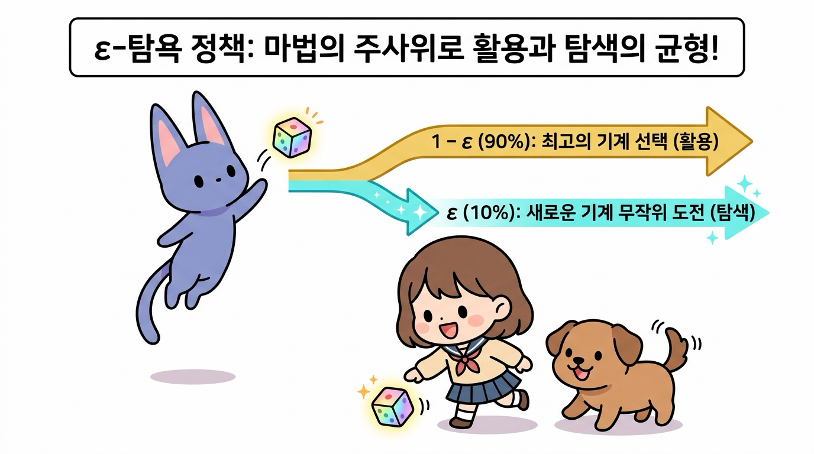

#### ε-탐욕 정책의 작동 규칙 (ε = 0.1인 경우)
1. **1 - ε의 확률 (90%) → 활용(Exploitation)**:
   - 지금까지 추정된 가치 *Q*가 가장 높은 최고의 슬롯머신을 선택합니다.
2. **ε의 확률 (10%) → 탐색(Exploration)**:
   - 모든 슬롯머신 중 하나를 무작위(Random)로 선택하여 새로운 경험을 쌓습니다.

이렇게 하면 대부분의 상황에서는 최고의 기계로 안전하게 코인을 쓸어 담으면서도, 가끔씩 이루어지는 탐색 덕분에 첫 판에 꽝이 났던 진짜 최고 기계(A)의 진가를 끝내 발견해 낼 수 있습니다.


---


## 3.3.4 오늘 공부한 핵심 요약

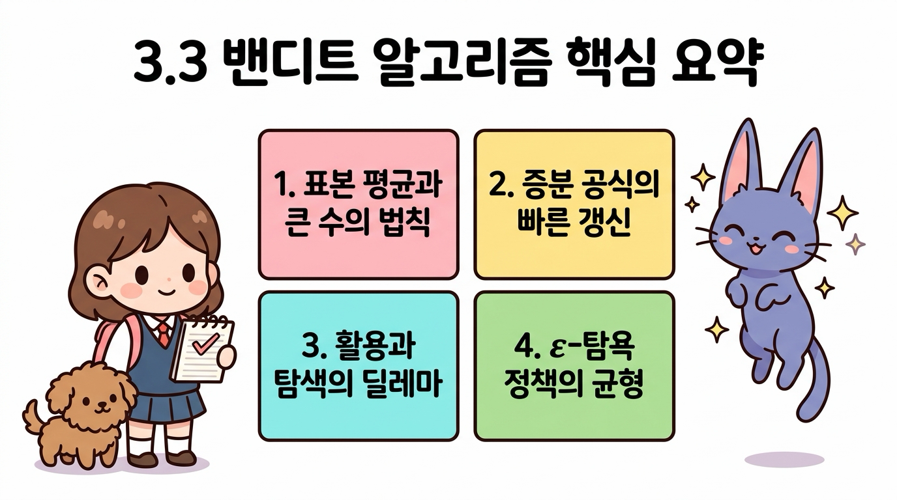

1. **표본 평균과 큰 수의 법칙**: 슬롯머신의 내부 가치는 볼 수 없는 블랙박스이지만, 플레이 횟수(*n*)를 늘려 표본 평균을 구하면 참 가치(*q*)로 정확히 수렴합니다.
2. **증분 공식의 가벼운 갱신**: 과거의 모든 데이터를 저장할 필요 없이, 직전 평균 *Q*<sub>*n-1*</sub>과 새 보상 *R*<sub>*n*</sub>만으로 *Q*<sub>*n*</sub> = *Q*<sub>*n-1*</sub> + 1/*n*(*R*<sub>*n*</sub> - *Q*<sub>*n-1*</sub>)을 통해 초경량으로 가치를 갱신합니다.
3. **활용과 탐색의 딜레마**: 눈앞의 최고만 쫓는 탐욕 정책은 조기 수렴의 함정에 빠지므로, 안전한 '활용'과 호기심 어린 '탐색' 사이의 조화가 필수적입니다.
4. **ε-탐욕 정책의 황금 균형**: 1 - ε의 확률로 활용하고 ε의 확률로 탐색하여, 안정적인 수익과 새로운 대박 발견이라는 두 마리 토끼를 모두 잡는 표준 알고리즘입니다.
