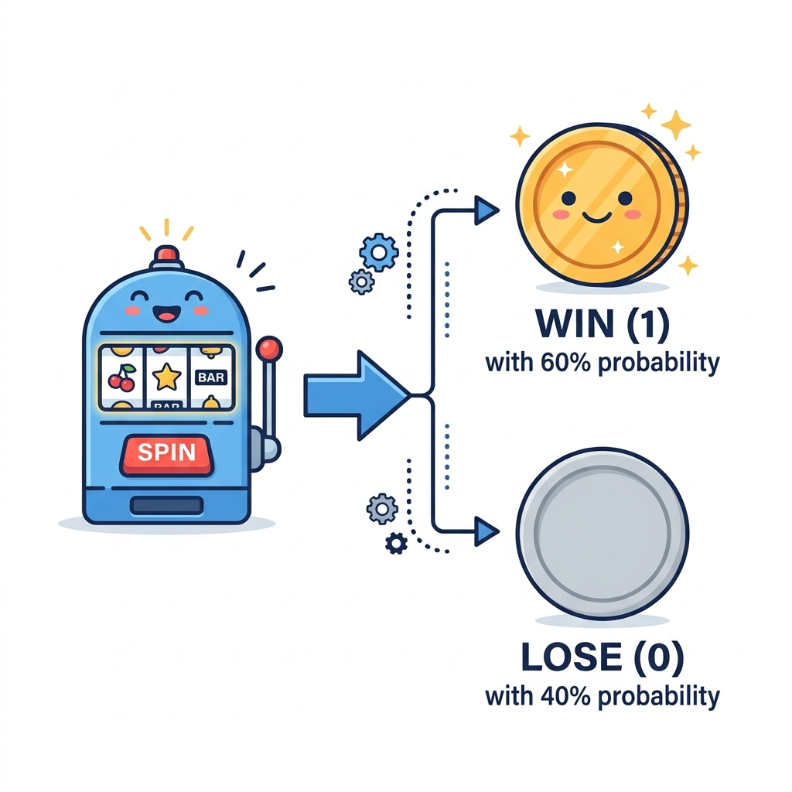
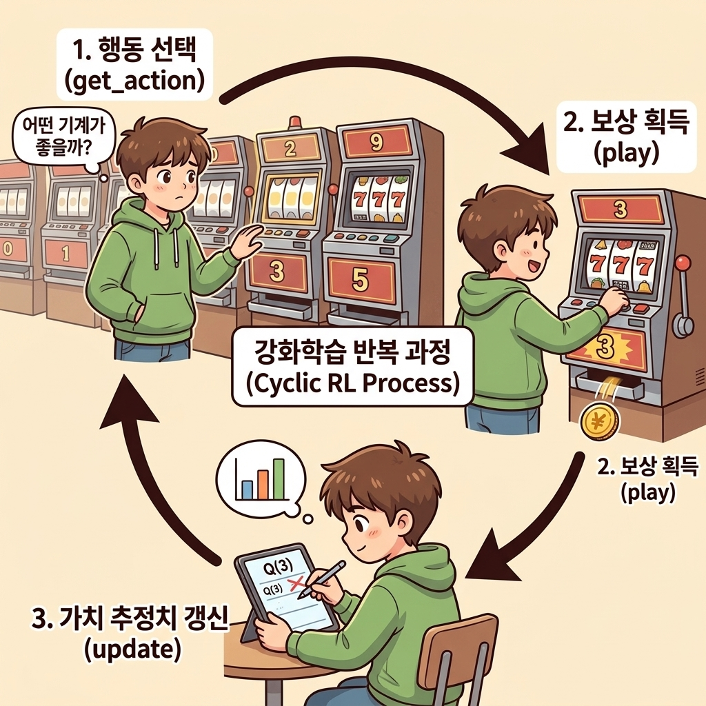
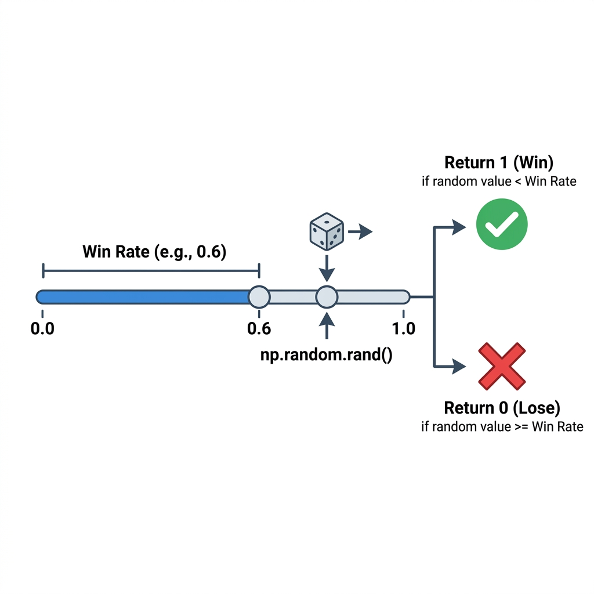
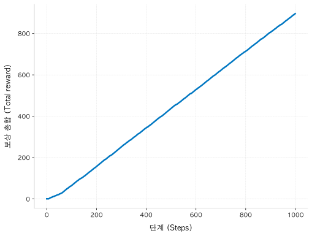
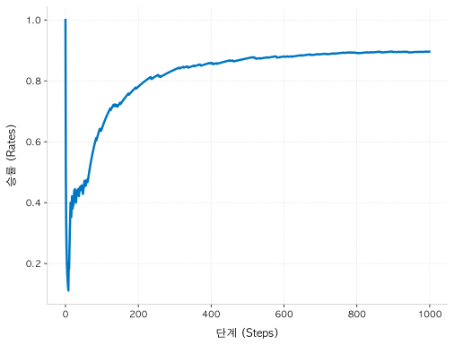
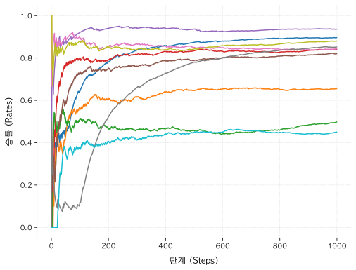
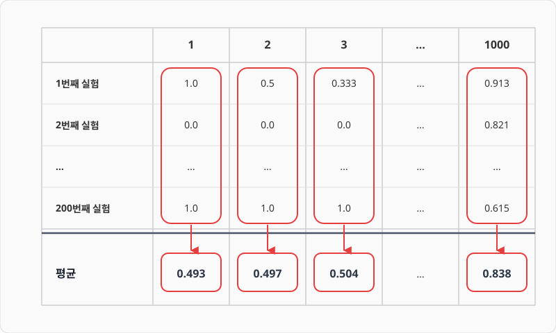
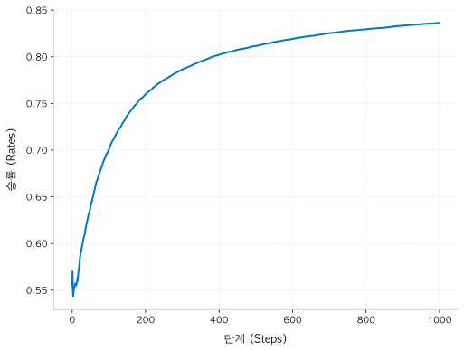
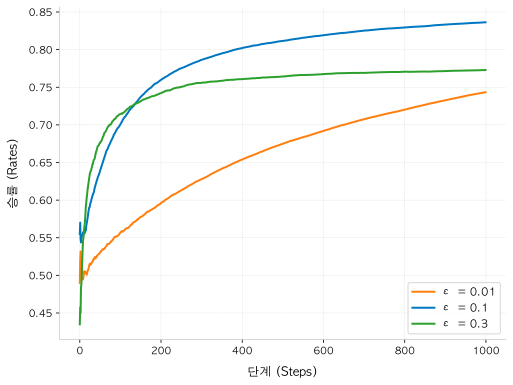

# 3.4 밴디트 알고리즘 구현

**그림 03-4** 마법 컴퓨터 스크린의 파이썬 코드 홀로그램을 보며 밴디트 알고리즘을 열심히 코딩하는 도로시와 지니


이론으로 공부한 밴디트 솔루션을 실제 파이썬 코드로 이식해 봅니다. 지니가 띄워준 신비한 홀로그램 스크린 코드 구조를 보며, `Agent` 클래스와 `Bandit` 클래스가 상호 연결되는 완벽한 루프의 코딩 실습을 3.4장에서 자신 있게 완수해봅시다!

---

밴디트 문제를 푸는 알고리즘을 코드로 구현할 차례입니다. 


## 3.4.1 구현조건

여기서는 조건을 단순화하여 슬롯머신이 반환하는 코인을 최대 1개로 제한하겠습니다. 


즉, 슬롯머신을 플레이하면 승리(1)와 패배(0) 중 하나를 보상으로 얻습니다. 그리고 슬롯머신에는 승리 확률(코인 1개를 내어줄 확률)이 설정되어 있다고 가정합니다. 


예를 들어 승률이 0.6으로 설정되어 있다면, 60%의 확률로 코인 1개를 주고 40%의 확률로 0개를 줍니다. 그러면 슬롯머신의 가치(슬롯머신이 돌려주는 코인의 기댓값)는 0.6입니다. 승률이 그대로 슬롯머신의 가치가 되는 것이죠.


**그림 3-17** 밴디트 구현 조건 예시 (승리 시 1, 패배 시 0)




슬롯머신은 총 10대이고, 플레이어는 각각의 승률이 어떻게 설정되어 있는지 알 수 없습니다.


---


## 3.4.2 경험에 의한 슬롯머신 찾기

 따라서 실제 플레이한 경험을 토대로 승률이 높은 슬롯머신을 찾아야 합니다.


에이전트(플레이어)와 밴디트(환경)가 어떻게 맞물려 돌아가는지 전체적인 학습 루프를 도식화한 그림입니다. 




행동 선택(get_action), 실제 플레이를 통한 보상 획득(play), 보상을 통한 가치 추정치 갱신(update) 순으로 이루어지는 순환적인 강화학습 과정을 거치게 됩니다.


---


## 3.4.3 슬롯머신 구현

슬롯머신부터 구현해보죠. 승률은 무작위로 설정하겠습니다. 


### 3.4.3.1 Bandit 클래스 구조 설계

저는 다음과 같이 Bandit 클래스 하나에 슬롯머신 10대가 존재하도록 구현했습니다.

**소스 코드: [bandit.py](file:///Users/hojin9/dev/jinysite/강화학습/03_밴디트_문제/3_4_밴디트_알고리즘_구현/bandit.py)**
```python
import numpy as np

class Bandit:
    def __init__(self, arms=10):  # arms = 슬롯머신 대수
        self.rates = np.random.rand(arms)  # 슬롯머신 각각의 승률 설정(무작위)


    def play(self, arm):
        rate = self.rates[arm]
        if rate > np.random.rand():
            return 1
        else:
            return 0
```


### 3.4.3.2 무작위 승률 설정 동작 원리

`__init__()` 메서드에서 초기화 매개변수로 arms를 받아 설정합니다. 


arms는 '팔의 개수'를 의미하며 이 문제에서는 '슬롯머신의 대수'에 해당합니다. 기본값은 10대로 설정했습니다. 그런 다음 각 머신의 승률을 무작위로 설정합니다.


> **NOTE_** `np.random.rand()`는 0.0 이상 1.0 미만의 무작위 수를 생성합니다. 이때 무작위 수는 균등하게 분포되도록 만들어집니다. 0.0 이상 1.0 미만 범위에서 무작위 수가 치우침 없이 골고루 생성된다는 뜻입니다. 또한 `np.random.rand(10)`처럼 인수로 10을 넘기면 0.0 이상 1.0 미만의 무작위 수를 10개 생성합니다. 이렇게 하면 슬롯머신 10대의 승률이 각각 0에서 1 사이로 무작위로 설정됩니다.


### 3.4.3.3 play 메서드를 통한 보상 판단

다음으로 `play(self, arm)` 메서드를 봅시다. 


매개변수 `arm`은 몇 번째 팔(슬롯머신)을 플레이할지를 지정합니다. 본문 코드를 보면 `arm`번째 머신의 승률을 가져온 후 `np.random.rand()`로 0.0~1.0 미만의 무작위 수를 하나 생성합니다. 


이 무작위 수와 `arm`번째 슬롯머신의 승률을 비교하여, 승률이 무작위 수보다 크면 보상으로 1을 반환하고 그렇지 않으면 0을 반환합니다.

**그림 3-18** play 메서드의 확률적 보상 판단 원리




### 3.4.3.4 단일 슬롯머신 테스트 실행

이제 Bandit 클래스를 이용하여 슬롯머신을 가지고 놀아봅시다.

```python
bandit = Bandit()

for i in range(3):
    print(bandit.play(0))
```

**출력 결과**
```
1
0
0
```


0번째 슬롯머신을 3회 연속으로 플레이하여 얻은 코인 개수를 출력했습니다(출력 결과는 실행할 때마다 달라집니다).


이상으로 슬롯머신 구현이 끝났습니다. 

다음은 에이전트(플레이어) 차례입니다.


---


## 3.4.4 에이전트 구현

3.4.2절에서 표본 평균을 구하는 효율적인 구현 방법, 즉 증분 구현을 배웠습니다. 


### 3.4.4.1 단일 슬롯머신 가치 추정 복습

이번 절에서는 복습도 할 겸 0번째 슬롯머신에만 집중하여 해당 슬롯머신의 가치를 추정해보겠습니다. 


코드는 다음과 같습니다.

```python
bandit = Bandit()
Q = 0

for n in range(1, 11):  # 10번 반복
    reward = bandit.play(0)  # 0번째 슬롯머신 플레이
    Q += (reward - Q) / n  # 가치 추정치 갱신
    print(Q)
```


이 코드는 0번째 슬롯머신을 10번 연속으로 플레이하고 보상을 받을 때마다 슬롯머신의 가치 추정치를 갱신합니다. 


여기까지가 지난 절의 복습입니다. 


### 3.4.4.2 전체 슬롯머신(10대) 가치 추정 확장

이제 10대의 슬롯머신 각각의 가치 추정치를 구해보겠습니다.

```python
bandit = Bandit()
Qs = np.zeros(10)  # 각 슬롯머신의 가치 추정치
ns = np.zeros(10)  # 각 슬롯머신의 플레이 횟수

for n in range(10):
    action = np.random.randint(0, 10)  # 무작위 행동(임의의 슬롯머신 선택)
    reward = bandit.play(action)
    
    ns[action] += 1  # action번째 슬롯머신을 플레이한 횟수 증가
    Qs[action] += (reward - Qs[action]) / ns[action]
    print(Qs)
```


이번에는 원소 10개짜리 1차원 배열인 Qs와 ns 변수를 새롭게 준비했습니다(`np.zeros()` 함수로 원소를 모두 0으로 초기화). 


그리고 ns의 각 원소에는 해당 슬롯머신을 플레이한 횟수를 저장합니다. 이렇게 하여 슬롯머신 각각의 가치를 추정할 수 있습니다.


### 3.4.4.3 Agent 클래스 설계 및 구현

지금까지 익힌 지식을 활용하여 Agent 클래스를 구현하겠습니다. 

Agent 클래스는 ε-탐욕 정책을 따라 행동을 선택하도록 할 것입니다.


**소스 코드: [bandit.py](file:///Users/hojin9/dev/jinysite/강화학습/03_밴디트_문제/3_4_밴디트_알고리즘_구현/bandit.py)**

```python
class Agent:
    def __init__(self, epsilon, action_size=10):
        self.epsilon = epsilon  # 무작위로 행동할 확률(탐색 확률)
        self.Qs = np.zeros(action_size)
        self.ns = np.zeros(action_size)

    def update(self, action, reward):  # 슬롯머신의 가치 추정
        self.ns[action] += 1
        self.Qs[action] += (reward - self.Qs[action]) / self.ns[action]

    def get_action(self):  # 행동 선택(ε-탐욕 정책)
        if np.random.rand() < self.epsilon:
            return np.random.randint(0, len(self.Qs))  # 무작위 행동 선택
        return np.argmax(self.Qs)  # 탐욕 행동 선택
```


### 3.4.4.4 Agent 핵심 메서드 동작 원리

초기화 매개변수 epsilon은 ε-탐욕 정책에 따라 무작위로 행동할 확률입니다. 


예를 들어 epsilon=0.1이면 10%의 확률로 무작위하게 행동합니다. action_size는 에이전트가 선택할 수 있는 행동의 가지 수입니다. 지금 문제에서는 슬롯머신의 대수를 뜻합니다.


슬롯머신의 가치 추정은 `update()` 메서드가 담당합니다. 이 메서드의 코드는 앞서 설명한 코드와 거의 같습니다.


마지막으로 `get_action()`은 ε-탐욕 정책으로 행동을 선택하는 메서드입니다. `self.epsilon`의 확률로 무작위 행동을 선택하고, 그 외에는 가치 추정치가 가장 큰 행동을 선택합니다. 참고로 `np.argmax(self.Qs)`는 배열 `self.Qs`에서 값이 가장 큰 원소의 인덱스를 가져옵니다.


여기까지가 Agent 클래스를 구현하는 방법입니다.


---


## 3.4.5 실행해보기

이제 Bandit 클래스와 Agent 클래스를 이용하여 행동을 취해봅시다.


### 3.4.5.1 상호작용 루프 구현 및 실행

 행동을 1000번 수행하여 보상을 얼마나 얻는지 보겠습니다.

**소스 코드: [bandit.py](file:///Users/hojin9/dev/jinysite/강화학습/03_밴디트_문제/3_4_밴디트_알고리즘_구현/bandit.py)**

```python
import matplotlib.pyplot as plt  # matplotlib 임포트

steps = 1000
epsilon = 0.1

bandit = Bandit()
agent = Agent(epsilon)
total_reward = 0
total_rewards = []  # 보상 합
rates = []  # 승률

for step in range(steps):
    action = agent.get_action()  # 1 행동 선택
    reward = bandit.play(action)  # 2 실제로 플레이하고 보상을 받음
    agent.update(action, reward)  # 3 행동과 보상을 통해 학습
    total_reward += reward

    total_rewards.append(total_reward)  # 현재까지의 보상 합 저장
    rates.append(total_reward / (step + 1))  # 현재까지의 승률 저장

print(total_reward)

# 그래프 그리기: 단계별 보상 총합(그림 3-19)
plt.ylabel('Total reward')
plt.xlabel('Steps')
plt.plot(total_rewards)
plt.show()

# 그래프 그리기: 단계별 승률(그림 3-20)
plt.ylabel('Rates')
plt.xlabel('Steps')
plt.plot(rates)
plt.show()
```

**출력 결과**
```
859
```


### 3.4.5.2 에이전트와 환경의 상호작용 3단계

먼저 `for` 루프 내부에 주목해보죠. 


이 영역은 **에이전트(Agent)**와 **환경(Bandit/Environment)**이 끊임없이 신호를 주고받으며 학습을 고도화하는 **'상호작용 루프(Interaction Loop)'**입니다. 


루프 내부는 다음의 3단계로 구성됩니다:

1. **`1` 행동 선택 (`agent.get_action()`)**: 
   - 에이전트가 ε-탐욕 정책을 통해 현재 가장 최선으로 보이는 머신을 당길지(활용), 혹은 새로운 머신을 탐구할지(탐색) 선택하여 최종 행동(`action`)을 결정합니다.
2. **`2` 환경의 반응 (`bandit.play(action)`)**: 
   - 지정된 행동에 맞추어 환경(슬롯머신)이 미리 내장되어 있는 확률(승률)에 따라 주사위를 굴리고, 그 결과로 코인 `1`개 혹은 `0`개의 보상(`reward`)을 반환합니다.
3. **`3` 가치 추정치 갱신 및 학습 (`agent.update(action, reward)`)**: 
   - 에이전트는 방금 획득한 보상 정보와 해당 행동의 시도 횟수를 반영해, 증분 수식을 거쳐 해당 머신의 가치 추정치(`Qs`)를 한 단계 갱신합니다.
   
   

이 3단계 과정을 1000번 반복 수행하며 각 시점의 보상 총합(`total_rewards`)과 누적 평균 승률(`rates`)을 실시간으로 추적하여 학습 추이를 평가합니다.


이 코드를 실행하니 최종적으로 얻은 보상의 총합은 859가 되었습니다(결과는 실행할 때마다 달라집니다). 1000번의 플레이 중 859번 '승리'했다는 뜻입니다. 


### 3.4.5.3 단계별 보상 총합 결과 분석

참고로 이때 total_rewards의 추이를 그려보니 [그림 3-19]와 같은 결과가 나왔습니다.


**그림 3-19** 단계에 따른 보상 총합



그래프에서 볼 수 있듯이 단계가 늘어날 때마다 보상의 총합이 꾸준히 증가합니다. 


다만 증가 방식의 특징, 예컨대 단계 증가와 보상 증가의 정밀한 관계 같은 정보는 이 그래프만으로는 알아내기 어렵습니다.


### 3.4.5.4 단계별 승률 결과 분석

앞의 코드가 생성한 두 번째 그래프인 [그림 3-20]을 살펴보죠. 

세로축은 승률입니다.


**그림 3-20** 단계별 승률



이 그래프를 보면 100단계에서의 승률은 약 0.4입니다. 


이를 기준으로 단계를 거듭할수록 승률이 높아지고 있습니다. 초반에 승률이 빠르게 상승하고 500단계를 넘어선 이후에도 완만하게 상승 추세를 이어가고 있습니다. 최종 승률은 0.8이 넘었습니다. 


우리가 구현한 ε-탐욕 정책의 학습이 제대로 이루어지고 있는 것으로 보입니다.


---


## 3.4.6 알고리즘의 평균적인 특성

방금 구현한 코드는 실행할 때마다 결과가 달라집니다. 


### 3.4.6.1 10회 실행을 통한 결과의 무작위성 관찰

예를 들어 [그림 3-20]의 그래프는 실행할 때마다 모양이 크게 달라집니다. 시험 삼아 같은 코드를 10번 실행하고 그 결과를 하나의 그래프로 그려보니 [그림 3-21]와 같았습니다.


**그림 3-21** 10번의 결과를 한꺼번에 그려보기



이처럼 실험 때마다 결과가 다른 이유는 코드에 `무작위성`이 포함되어 있기 때문입니다.


 먼저 슬롯머신 10대 각각의 승률을 무작위로 설정했습니다. 그리고 에이전트가 활용한 ε-탐욕 정책에서도 행동을 무작위로 선택했죠. 이러한 무작위성 때문에 매번 결과가 달라질 수 있습니다.


> **NOTE_** 지금의 무작위성은 코드에서 '시드<sup>seed</sup>'가 바뀌기 때문에 생겨납니다. `np.random.seed(0)` 식으로 시드를 고정하면 항상 똑같은 결과를 얻을 수 있습니다.


### 3.4.6.2 알고리즘 평가를 위한 평균 성능 검증의 중요성

강화 학습 알고리즘을 비교할 때 (대부분의 경우) 무작위성 때문에 한 번의 실험만으로 판단하는 건 큰 의미가 없습니다. 


그보다는 알고리즘의 '평균적인 우수성'을 평가해야 합니다. 

같은 실험을 여러 번 반복하여 결과를 평균하는 식으로 알고리즘의 평균적인 우수성을 알 수 있습니다.


### 3.4.6.3 다중 실행 시뮬레이션 구현 (200회 반복)

그래서 슬롯머신을 1000번 플레이하는 실험을 총 200번 반복하여 평균을 내보겠습니다.


**소스 코드: [bandit_avg.py](file:///Users/hojin9/dev/jinysite/강화학습/03_밴디트_문제/3_4_밴디트_알고리즘_구현/bandit_avg.py)**
```python
runs = 200
steps = 1000
epsilon = 0.1
all_rates = np.zeros((runs, steps))  # (200, 1000) 형상 배열

for run in range(runs):  # 200번 실험
    bandit = Bandit()
    agent = Agent(epsilon)
    total_reward = 0
    rates = []

    for step in range(steps):
        action = agent.get_action()
        reward = bandit.play(action)
        agent.update(action, reward)
        total_reward += reward
        rates.append(total_reward / (step + 1))

    all_rates[run] = rates  # 1 보상 결과 기록

avg_rates = np.average(all_rates, axis=0)  # 2 각 단계의 평균 저장

# 그래프 그리기: 단계별 승률(200번 실험 후 평균)
plt.ylabel('Rates')
plt.xlabel('Steps')
plt.plot(avg_rates)
plt.show()
```


### 3.4.6.4 200회 평균 승률 그래프 분석

똑같은 실험을 200번 수행하고 all_rates에 각 실험의 결과를 저장했습니다. 


구체적으로 **1**에서 원소 1000개짜리 배열인 rates를 all_rates의 해당 위치에 저장합니다. 그런 다음 **2**에서 axis=0으로 지정하면 단계별 평균을 계산합니다. 


[그림 3-22]을 보면 계산 과정이 더 명확하게 이해될 것입니다.

**그림 3-22** 단계별 평균 구하기




앞의 코드를 실행하면 다음 그래프를 얻을 수 있습니다.

**그림 3-23** 단계별 승률(200번 실험 후 평균)



알고리즘을 평가할 때는 이처럼 평균을 이용해야 합니다. 


[그림 3-23]의 그래프를 보면 이번 알고리즘(ε-탐욕 정책)의 특징이 더 잘 드러납니다. 승률이 처음에는 0.5 정도로 시작해서 단계를 거듭할수록 빠르게 높아지고 600단계 정도에 이르러 거의 최대를 찍습니다. 최종적으로 약 0.83을 기록했습니다.


### 3.4.6.5 ε(탐색 확률) 변경에 따른 균형 제어와 성능 비교

참고로 이 결과는 ε-탐욕 정책에서 ε = 0.1로 설정한 결과입니다. 


ε값을 변경하면 결과도 달라집니다. 실제로 값을 바꿔보죠. ε을 각각 0.01, 0.1, 0.3으로 설정해 실험해보니 결과가 다음과 같았습니다.


**그림 3-24** ε-탐욕 정책의 ε값을 바꾼 결과



그림 3-24와 같이 ε의 값에 따라 승률이 달라집니다. 


결과를 보면 ε = 0.3이면 승률은 빠르게 상승하지만 400단계를 넘어가면서 상승세가 급격히 꺾입니다. 30%라는 높은 확률로 탐색을 시도하기 때문에 최적의 머신을 선택하는 '활용의 비율이 너무 낮기 때문'으로 짐작됩니다. 즉, 탐색을 너무 많이 했다고 볼 수 있습니다.


다음은 ε = 0.01인 경우를 보죠(1% 확률로 탐색). 보상은 꾸준히 상승하지만 상승 속도는 세 가지 중 가장 느립니다. 탐색 비율이 너무 작아서 최적의 머신을 찾을 확률이 낮았기 때문으로 보입니다.


마지막으로 ε = 0.1입니다. 보다시피 결과가 가장 좋습니다. 즉, 탐색 비율을 10%로 할 때의 '활용과 탐색의 균형'이 세 가지 중 가장 좋았다고 할 수 있습니다.


이처럼 ε의 값으로 '활용과 탐색의 균형'을 조절할 수 있습니다. 

물론 최적의 ε값은 문제에 따라 달라집니다. 


예를 들어 단계 수가 100일 때는 시도한 세 가지 ε 중 ε = 0.3일 때의 결과가 가장 좋았습니다. 이번처럼 ε의 값을 다양하게 시도해보면 최적의 ε값을 찾을 수 있을 것입니다.


 지금까지 ε-탐욕 정책을 구현해보았습니다.


---


## 3.4.7 정리 및 요약

이번 절에서는 앞서 배운 밴디트 알고리즘 이론을 바탕으로 객체 지향적인 파이썬 코드 구현과 성능 평가를 진행했습니다. 


요약은 다음과 같습니다.


1. **객체 지향 모델링**: 10대의 슬롯머신(환경)을 `Bandit` 클래스로, 에이전트(플레이어)의 ε-탐욕 정책을 `Agent` 클래스로 코딩하여 강화학습의 문제 영역과 행동 주체를 명확히 객체로 분리하여 구현했습니다.
2. **에이전트-환경 상호작용 루프**: 행동 선택(`get_action()`) → 실제로 레버를 당겨 보상 획득(`play()`) → 보상을 바탕으로 한 가치 추정치 업데이트(`update()`) 순서로 순환하는 강화학습 상호작용 과정을 구현했습니다.
3. **평균 검증의 필요성**: 무작위성(무작위 슬롯머신 설정, ε 확률에 따른 무작위 행동) 때문에 단 1회의 실험 결과는 신뢰하기 어렵습니다. 알고리즘의 우수성을 공정하게 평가하기 위해 **200회 반복 실험 후의 평균 승률 추이**를 활용하는 평가 표준을 확립했습니다.
4. **활용과 탐색의 균형 조율**: 하이퍼파라미터인 탐색 확률 ε의 값에 따라 학습 곡선이 크게 달라집니다.
   - $ε = 0.3$: 빠른 초반 탐색으로 정보를 얻지만, 활용의 비율이 낮아 최종 승률이 수렴 한계에 봉착합니다 (과도한 탐색).
   - $ε = 0.01$: 학습 진행 속도가 너무 더디어 최적의 행동을 찾는 데 시간이 너무 오래 걸립니다 (부족한 탐색).
   - $ε = 0.1$: 세 조건 중 활용과 탐색의 최상의 균형점을 달성하여 가장 우수한 누적 성과를 거두었습니다.
