# 3.4 밴디트 알고리즘 구현

밴디트 문제를 푸는 알고리즘을 코드로 구현할 차례입니다. 이론으로 공부한 밴디트 솔루션을 실제 파이썬 코드로 이식해 봅니다. 


> 👧 **도로시**: "지니야! 3.3장에서 배운 **증분 공식**과 **ε-탐욕 정책**을 내 손으로 직접 파이썬 코드로 만들어보고 싶어! 어디서부터 시작하면 좋을까?"
>
> 🐱 **지니**: "좋은 자세야, 도로시! 강화 학습은 **'환경(Environment)'**과 **'에이전트(Agent)'**라는 두 주체가 끊임없이 대화하며 발전하는 학문이란다. 슬롯머신 10대를 담당하는 `Bandit` 클래스와 똑똑한 플레이어인 `Agent` 클래스를 객체 지향으로 멋지게 분리해서 코딩해 보자!"
>
> 🐶 **토토**: "멍멍! (노트북 옆에서 꼬리를 흔들며 코딩을 응원해요!)"


**그림 03-4** 마법 컴퓨터 스크린의 파이썬 코드 홀로그램을 보며 밴디트 알고리즘을 열심히 코딩하는 도로시와 지니


지니가 띄워준 신비한 홀로그램 스크린 코드 구조를 보며, `Agent` 클래스와 `Bandit` 클래스가 상호 연결되는 완벽한 루프의 코딩 실습을 3.4장에서 자신 있게 완수해봅시다!


---


## 3.4.1 구현조건

#### 조건 단순화
원활한 실습을 위해서 먼저 조건을 단순화하도록 하겠습니다. 

먼저, 슬롯머신이 반환하는 코인을 최대 1개로 제한합니다. 즉, 슬롯머신을 플레이하면 승리(1)와 패배(0) 중 하나를 보상으로 얻습니다. 

그리고 슬롯머신에는 승리 확률(코인 1개를 내어줄 확률)이 설정되어 있다고 가정합니다. 

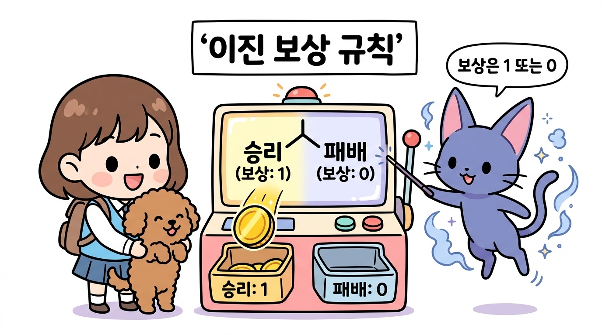

> 🐱 **지니**: "도로시, 우리는 문제를 아주 단순하고 직관적으로 만들기 위해 슬롯머신의 보상을 **오직 1개(승리) 또는 0개(패배)**로만 정했단다. 이것을 **'이진 보상(Binary Reward)'** 규칙이라고 해!"
>
> 👧 **도로시**: "레버를 당겼을 때 코인이 1개 나오거나 아예 안 나오는 두 가지 경우밖에 없으니, 계산하기가 훨씬 명확하겠어!"
>
> 🐶 **토토**: "멍멍! (동전이 짤랑 나오는 모습을 보며 신나게 짖어요!)"


---


#### 예를들어

승률이 0.6으로 설정되어 있다면, 60%의 확률로 코인 1개를 주고 40%의 확률로 0개를 줍니다. 

그러면 슬롯머신의 가치(슬롯머신이 돌려주는 코인의 기댓값)는 0.6입니다. 

$$
\mathbb{E}[R] = (1 \times 0.6) + (0 \times 0.4) = 0.6
$$

승률이 그대로 슬롯머신의 가치가 되는 것이죠.

> 👧 **도로시**: "아하! 동전을 넣고 당겼을 때 1원 아니면 0원만 나오니까, 슬롯머신의 승률이 0.6이면 기댓값도 1 × 0.6 + 0 × 0.4 = 0.6이 되는 거구나!"
>
> 🐱 **지니**: "맞아! 보상이 1 또는 0인 이진 보상 환경에서는 **'승률' 자체가 곧 해당 기계의 '참 가치 *q*'**가 된단다. 하지만 카지노의 10대 슬롯머신 중 어느 기계의 승률이 높은지는 비밀에 싸여 있지!"


**그림 3-17** 밴디트 구현 조건 예시 (승리 시 1, 패배 시 0)


---


## 3.4.2 경험에 의한 슬롯머신 찾기

슬롯머신은 총 10대이고, 플레이어는 각각의 승률이 어떻게 설정되어 있는지 알 수 없습니다.

따라서 실제 플레이한 경험을 토대로 승률이 높은 슬롯머신을 찾아야 합니다.

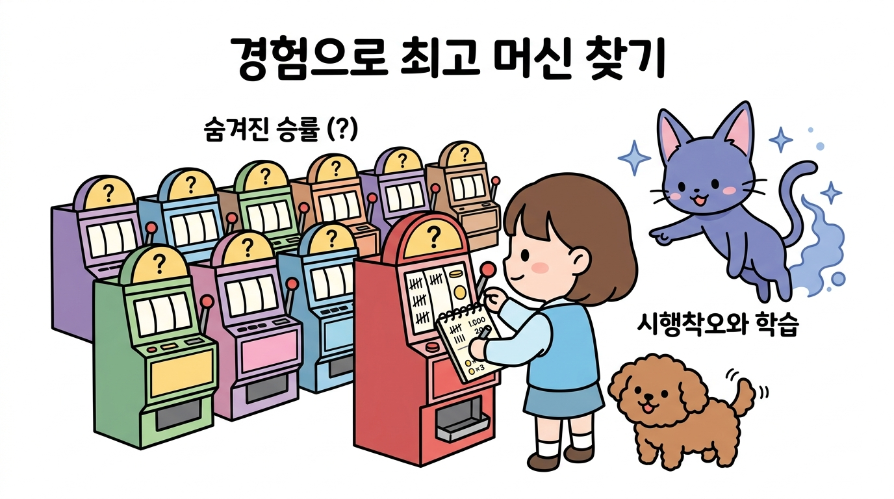

> 👧 **도로시**: "10대의 슬롯머신 중에서 어느 기계가 승률이 높은지 겉으로는 전혀 알 수가 없어! 기계마다 직접 레버를 당겨보고 결과를 기록해 봐야겠어!"
>
> 🐱 **지니**: "그렇지! 사전에 확률을 모르는 블랙박스 상태에서는 **'직접 겪은 시행착오와 플레이 경험(Trial and Error)'**만이 최고의 머신을 찾는 유일한 열쇠란다!"
>
> 🐶 **토토**: "멍멍! (노트북 옆에서 꼬리를 흔들며 응원해요!)"


---


다음은 에이전트(플레이어)와 밴디트(환경)가 어떻게 맞물려 돌아가는지 전체적인 학습 루프를 도식화한 그림입니다. 


> 🐱 **지니**: "도로시, 강화 학습의 심장은 바로 이 **'상호작용 루프(Interaction Loop)'**란다. 에이전트가 행동을 고르면, 환경이 보상을 돌려주고, 에이전트는 그 보상을 보고 똑똑해지는 3단계 사이클이지!"
>
> 👧 **도로시**: "행동 선택(`get_action`) → 보상 획득(`play`) → 가치 갱신(`update`)이 계속 쳇바퀴처럼 돌아가는 거네!"


**행동 선택**(get_action), 실제 플레이를 통한 **보상 획득**(play), 보상을 통한 **가치 추정치 갱신**(update) 순으로 이루어지는 순환적인 강화학습 과정을 거치게 됩니다.


---


## 3.4.3 슬롯머신 구현

그럼 직접 코드를 작성하여 슬롯머신을  구현해 보도록 합니다.

단, 승률은 무작위로 설정하겠습니다. 

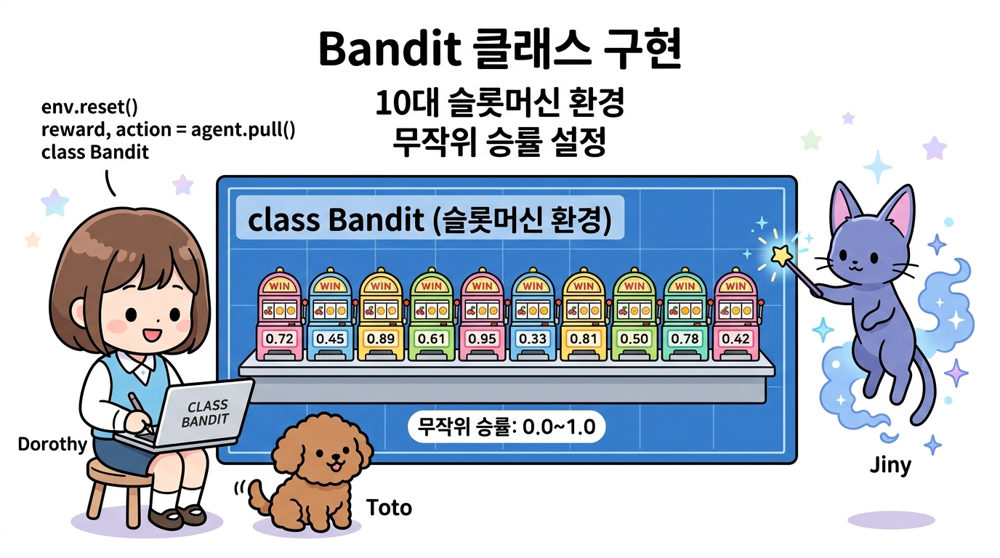

> 👧 **도로시**: "지니야! 슬롯머신 10대를 파이썬 코드로 묶으려면 `Bandit`이라는 클래스를 만들면 되는 거지?"
>
> 🐱 **지니**: "맞아! `Bandit` 클래스 안에 10대의 슬롯머신을 담고, 각 머신의 승률을 `0.0`부터 `1.0` 사이의 무작위 실수로 설정해 주면 완벽한 밴디트 환경이 완성된단다!"
>
> 🐶 **토토**: "멍멍! (노트북 옆에서 도로시의 파이썬 코딩을 응원해요!)"


---


### 3.4.3.1 Bandit 클래스 구조 설계

저는 다음과 같이 Bandit 클래스 하나에 슬롯머신 10대가 존재하도록 구현했습니다.

**소스 코드: [bandit1.py](./bandit1.py)**
```python
import numpy as np

class Bandit:
    def __init__(self, arms=10):  # arms = 슬롯머신 대수 (매직 메서드)
        self.rates = np.random.rand(arms)  # 슬롯머신 각각의 승률 설정(무작위)

    def play(self, arm):  # 슬롯머신 플레이 동작 메서드
        rate = self.rates[arm]
        if rate > np.random.rand():
            return 1
        else:
            return 0
```

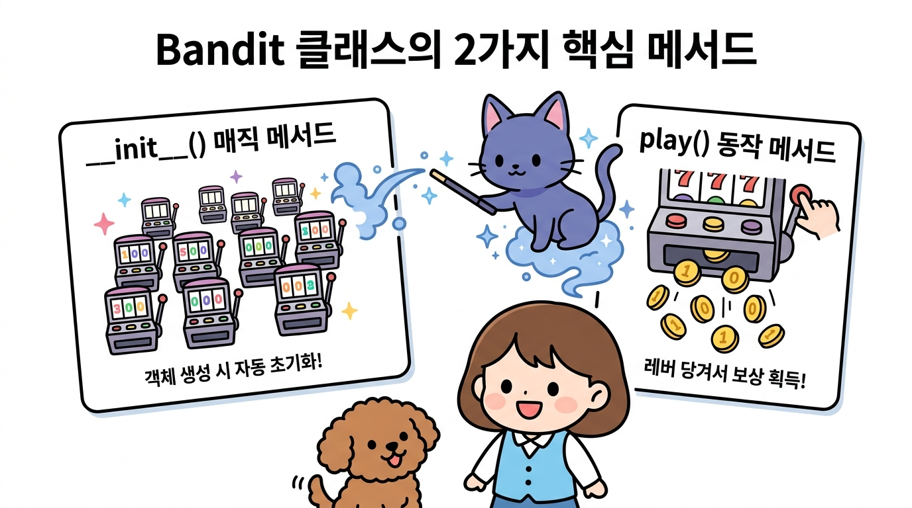

> 🐱 **지니**: "도로시, `Bandit` 클래스는 딱 **2가지 핵심 메서드**만 기억하면 돼!"
>
> 1. **`__init__()` (매직 메서드)**: 객체를 만들 때 파이썬이 자동으로 딱 1번 실행해 주는 생성자야. 10대 슬롯머신의 비밀 승률(`self.rates`)을 무작위로 세팅해 둔단다.
> 2. **`play()` (동작 메서드)**: 레버를 당길 때마다 호출되어, 승리(1) 또는 패배(0)의 코인 보상을 돌려주는 게임 진행 메서드야!
>
> 👧 **도로시**: "아하! `__init__`은 기계 세팅, `play`는 레버 당기기! 그림으로 보니까 역할이 한눈에 쏙 들어와!"
>
> 🐶 **토토**: "멍멍! (꼬리를 흔들며 신나게 공감해요!)"


---


### 3.4.3.2 무작위 승률 설정 동작 원리


#### 1. 파이썬 매직 메서드 `__init__()`의 역할과 동작 원리

`__init__()` 메서드는 파이썬에서 매우 특별한 역할을 담당하는 **매직 메서드(Magic Method / Dunder Method)**입니다.

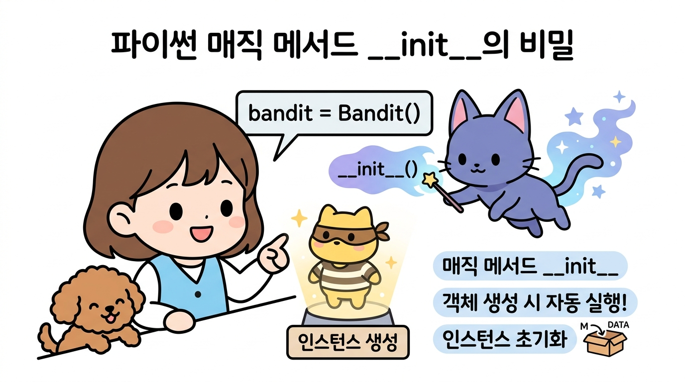

> 🐱 **지니**: "도로시, 우리가 파이썬에서 `bandit = Bandit()`이라고 코드를 실행하면, 백그라운드에서 파이썬이 자동으로 `__init__()` 메서드를 딱 한 번 불러준단다!"
>
> 👧 **도로시**: "내가 `bandit.__init__()`이라고 직접 호출하지 않아도 자동으로 실행되는 거네? 그래서 이름이 '매직(Magic)'이구나!"
>
> 🐱 **지니**: "맞아! 객체가 처음 세상에 태어날 때(인스턴스화될 때) 필요한 기억 공간을 초기화하고 기본 속성들을 세팅해 주는 아주 든든한 **생성자(Constructor)** 역할을 수행한단다."
>
> 🐶 **토토**: "멍멍! (마법 같은 자동 실행에 감탄해요!)"


---


#### 2. 매개변수 `arms`와 객체 생성 시 매개변수 전달 개념

`__init__()` 메서드에서 초기화 매개변수로 arms를 받아 들일 수 있도록 설정합니다. 

arms는 '팔의 개수'를 의미하며 이 문제에서는 '슬롯머신의 대수'에 해당합니다. 기본값은 10대로 설정했습니다. 

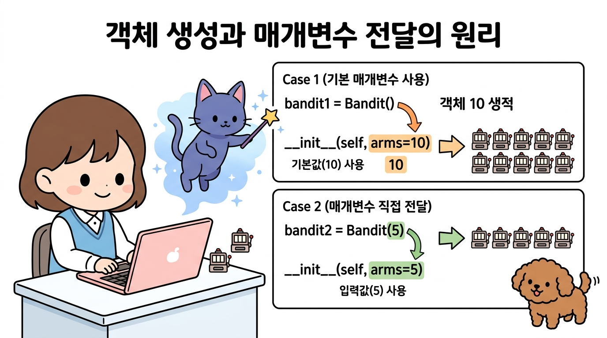

> 🐱 **지니**: "도로시, `def __init__(self, arms=10):` 코드에서 `arms=10`은 **'기본 매개변수(Default Argument)'**란다!"
>
> 1. **기본값 사용 (`bandit = Bandit()`)**: 괄호 안에 아무런 값을 넣지 않으면 기본값인 **10대**의 슬롯머신 환경이 자동으로 생성돼.
> 2. **사용자 정의값 전달 (`bandit = Bandit(5)`)**: 괄호 안에 `5`를 전달하면 `arms`에 5가 대입되어 **5대**의 슬롯머신 환경으로 유연하게 바뀐단다!
>
> 👧 **도로시**: "와! 객체를 만들 때 괄호 안에 원하는 머신 대수를 넣기만 하면 내 마음대로 슬롯머신 환경의 크기를 조절할 수 있구나!"
>
> 🐶 **토토**: "멍멍! (유연한 객체 지향 설계에 감탄해요!)"


---


#### 3. 무작위 승률 설정과 `np.random.rand()`

그런 다음 각 머신의 승률을 무작위로 설정합니다.

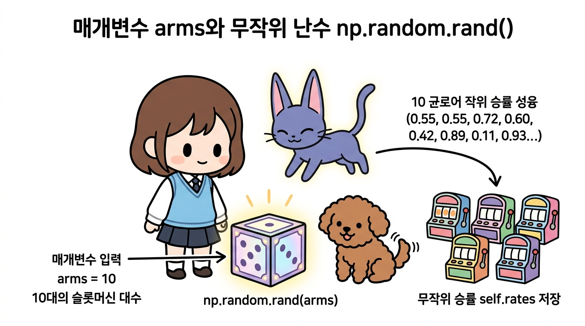


> 👧 **도로시**: "`np.random.rand(10)`을 부르면 [0.55, 0.72, 0.60, ...]처럼 0.0~1.0 사이의 10개 실수가 골고루 뽑혀서 `self.rates`에 쏙 들어가는 거구나!"
>
> 🐱 **지니**: "그렇지! 이렇게 설정된 10개의 무작위 승률은 에이전트에게는 철저히 감춰진 **'비밀 참 가치 *q*'**가 되어, 본격적인 밴디트 게임의 무대를 완성한단다!"


> **NOTE_** `np.random.rand()`는 0.0 이상 1.0 미만의 무작위 수를 생성합니다. 이때 무작위 수는 균등하게 분포되도록 만들어집니다. 0.0 이상 1.0 미만 범위에서 무작위 수가 치우침 없이 골고루 생성된다는 뜻입니다. 또한 `np.random.rand(10)`처럼 인수로 10을 넘기면 0.0 이상 1.0 미만의 무작위 수를 10개 생성합니다. 이렇게 하면 슬롯머신 10대의 승률이 각각 0에서 1 사이로 무작위로 설정됩니다.


---


### 3.4.3.3 play 메서드를 통한 보상 판단

파이썬 클래스 내부의 메서드는 크게 두 가지로 나뉩니다.

 앞서 살펴본 `__init__()`처럼 언어 차원에서 특수 기능을 위해 기본 제공하는 **매직 메서드(Magic Method)**와, 개발자가 프로그램 목적에 맞게 직접 설계하여 동작시키는 **사용자 정의 일반 메서드(Custom Instance Method)**입니다.

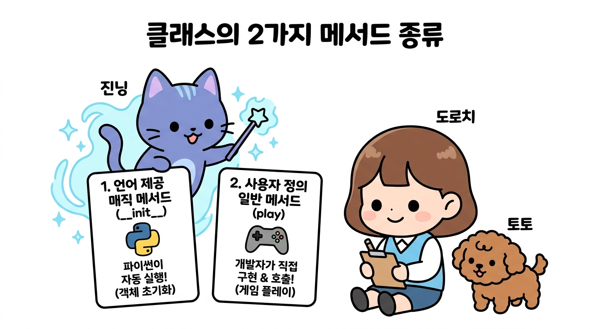

> 🐱 **지니**: "도로시, 파이썬 클래스 속 메서드는 크게 2가지로 분류할 수 있단다!"
>
> 1. **언어 제공 매직 메서드 (`__init__`)**: `bandit = Bandit()` 처럼 객체가 생성될 때 파이썬이 **알아서 자동으로 호출**해 주는 메서드야.
> 2. **사용자 정의 일반 메서드 (`play`)**: 슬롯머신 레버를 당기기 위해 우리가 **직접 이름을 짓고 구현**하여 필요할 때마다 **직접 호출**하는 메서드란다!
>
> 👧 **도로시**: "아하! `__init__`은 파이썬이 알아서 실행해 주는 매직이고, `play`는 내가 게임할 때마다 직접 부르는 나만의 일반 메서드구나!"
>
> 🐶 **토토**: "멍멍! (명쾌한 구분에 꼬리를 흔들어요!)"


---


#### 1. `play()` 메서드의 3단계 코드 실행 원리

그럼 우리가 작성한 `play(self, arm)` 메서드의 소스코드를 한 줄씩 단계적으로 살펴봅시다.

```python
    def play(self, arm):
        rate = self.rates[arm]
        if rate > np.random.rand():
            return 1
        else:
            return 0
```

`play()` 메서드는 다음의 **3단계 과정**을 거쳐 보상을 계산하고 반환합니다.

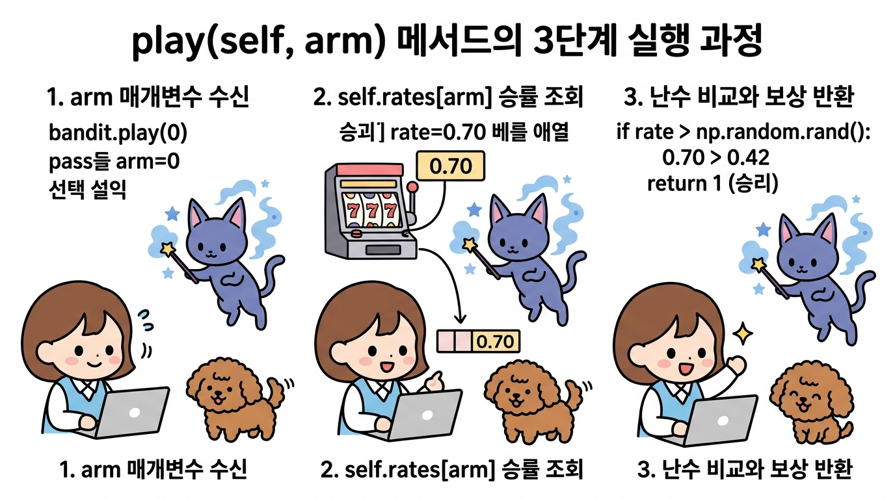

1. **1단계: `arm` 매개변수로 플레이할 슬롯머신 지정받기**
   - `def play(self, arm):`
   - 매개변수 `arm`은 몇 번째 팔(슬롯머신)을 플레이할지를 지정합니다. 예를 들어 `bandit.play(0)`을 호출하면 `arm = 0`이 전달되어 0번째 슬롯머신을 선택합니다.
2. **2단계: `self.rates[arm]`에서 해당 슬롯머신의 승률 읽어오기**
   - `rate = self.rates[arm]`
   - `__init__`에서 미리 생성해 둔 10대 슬롯머신의 승률 배열 `self.rates`에서 `arm`번째 머신의 실제 승률(예: 0.70)을 가져와 `rate` 변수에 저장합니다.
3. **3단계: 무작위 난수 생성 및 조건문 비교를 통한 보상 반환**
   - `if rate > np.random.rand(): return 1 else: return 0`
   - `np.random.rand()`로 0.0~1.0 미만의 무작위 수를 하나 생성합니다. 이 무작위 수와 `arm`번째 슬롯머신의 승률을 비교하여, 승률이 무작위 수보다 크면 보상으로 1(승리)을 반환하고 그렇지 않으면 0(패배)을 반환합니다.

> 🐱 **지니**: "도로시, 코드 세 줄이 각각 '어떤 머신을(arm)', '그 머신의 승률을 꺼내서(rate)', '난수 주사위와 겨뤄서 보상을 돌려주는(if-else)' 3단계로 완벽히 맞아떨어지지?"
>
> 👧 **도로시**: "와! 코드를 한 줄씩 뜯어보니까 `play()` 함수가 어떻게 확률대로 코인을 주는지 정말 명확하게 이해돼!"
>
> 🐶 **토토**: "멍멍! (코드가 너무 쉬워졌어요!)"


---


#### 2. 확률적 판정의 수직선 원리

**그림 3-18** play 메서드의 확률적 보상 판단 원리


> 🐱 **지니**: "도로시, 왜 `rate > np.random.rand()` 조건문이 정확히 승률만큼의 확률을 만들어낼까?"
>
> 👧 **도로시**: "0.0부터 1.0까지 균등한 수직선에서 난수를 뽑았을 때, 난수가 `0.7`보다 작게 떨어질 확률은 정확히 70%니까 그렇구나! 70% 구간에 들어오면 코인 1개를 획득하는 거지!"
>
> 🐶 **토토**: "멍! (똑똑한 설명에 감탄해요!)"


---


### 3.4.3.4 단일 슬롯머신 테스트 실행

이제 앞서 [`bandit1.py`](./bandit1.py)에서 구현한 `Bandit` 클래스를 이용하여 슬롯머신을 직접 실행해 보도록 하겠습니다. 그러기 위해서는 실습 코드를 추가로 작성해 주어야 합니다.

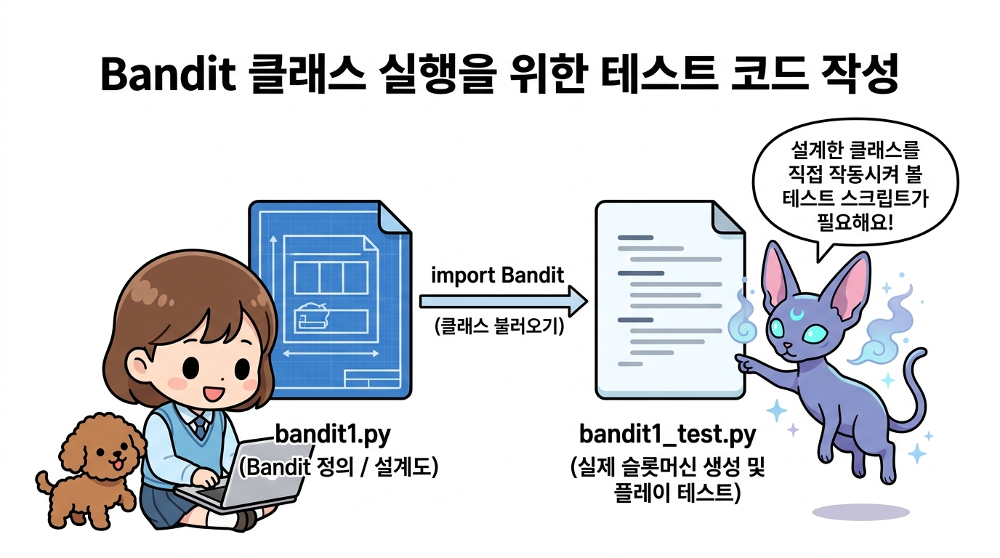


---


독립적으로 실행하고 테스트해 볼 수 있는 테스트 스크립트 코드는 다음과 같습니다. 

Bandit1의 코드를 가지고 와서 객체를 생성하고, 이를 실행합니다.

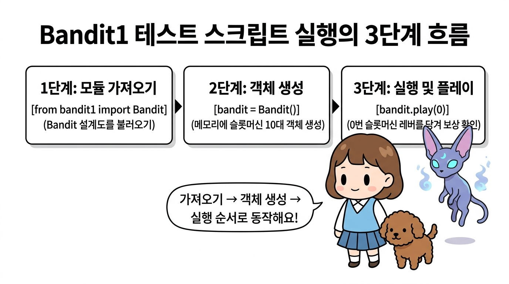

---


**소스 코드: [bandit1_test.py](./bandit1_test.py)**

```python
from bandit1 import Bandit

# 1. 10대 슬롯머신 환경 객체 생성
bandit = Bandit()

# 2. 0번째 슬롯머신(arm=0)을 3회 연속으로 플레이
for i in range(3):
    print(bandit.play(0))
```

**출력 결과**
```text
1
0
0
```

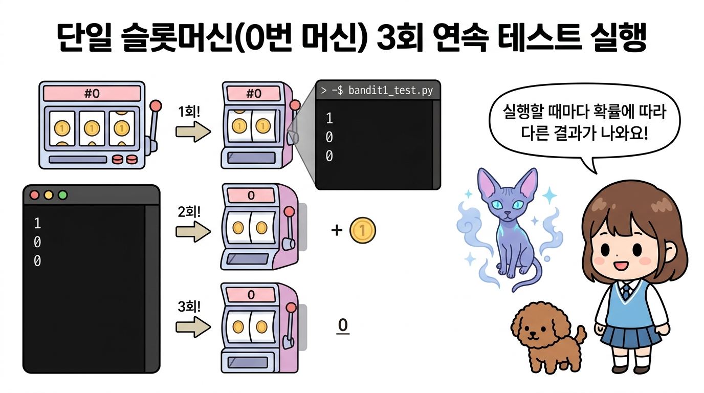

0번째 슬롯머신을 3회 연속으로 플레이하여 얻은 코인 개수를 출력했습니다(출력 결과는 실행할 때마다 달라집니다).


---


#### 코드 실행 과정 살펴보기
1. **`bandit = Bandit()`**: 슬롯머신 10대를 가진 카지노 환경 객체를 만듭니다. 이때 `__init__()` 매직 메서드가 자동 호출되어 10대 머신 각각의 무작위 실제 승률(`self.rates`)이 은밀히 배정됩니다.
2. **`bandit.play(0)`**: 0번째 슬롯머신의 레버를 당깁니다. `play()` 메서드 내부에서 0번 머신의 실제 승률과 새롭게 뽑은 난수를 비교하여 이기면 `1`(코인 획득), 지면 `0`(꽝)을 반환합니다.
3. **`for i in range(3):`**: 0번째 슬롯머신을 3번 연속으로 당겨 각각의 보상 결과를 터미널 화면에 출력합니다.

> 🐱 **지니**: "도로시, 화면에 출력된 `1, 0, 0`은 슬롯머신을 실행할 때마다 매번 다르게 나올 수 있단다!"
>
> 👧 **도로시**: "맞아! 슬롯머신의 승률이 70%로 고정되어 있더라도, 레버를 당길 때마다 무작위 난수 주사위를 굴리기 때문에 어떤 날은 `1, 1, 1`이 나올 수도 있고 어떤 날은 `0, 0, 1`이 나올 수도 있는 거지!"
>
> 🐶 **토토**: "멍멍! (확률 게임의 짜릿함이 그대로 느껴져요!)"

이상으로 슬롯머신 구현이 끝났습니다. 


---


## 3.4.4 에이전트 구현

이번에는 에이전트(플레이어)를 만들어볼 차례입니다.

앞서 구현한 `Bandit` 클래스가 카지노의 **환경(Environment, 슬롯머신들)**이었다면, 이제 이 환경과 상호작용하며 최선의 보상을 획득하기 위해 스스로 판단하고 학습하는 주체인 **에이전트(Agent, 플레이어)**를 구현해야 합니다.

3.4.2절에서 표본 평균을 구하는 효율적인 구현 방법, 즉 증분 구현을 배웠습니다. 에이전트는 레버를 당기는 **행동(Action)**을 하고, 그 결과로 얻은 **보상(Reward)**을 바탕으로 각 슬롯머신의 가치 추정치(*Q*)를 메모리 낭비 없이 실시간으로 갱신해 나갑니다.

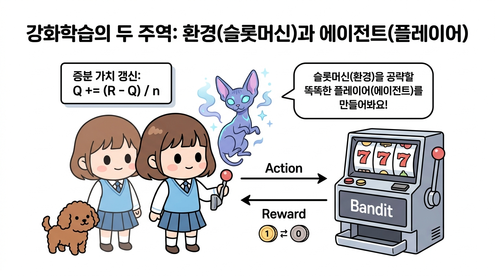

> 🐱 **지니**: "도로시, 앞서 만든 `Bandit`이 슬롯머신 '환경'이었다면, 이제 그 환경을 공략하여 가장 돈을 많이 주는 최고의 슬롯머신을 찾아내는 똑똑한 플레이어인 '에이전트(Agent)'를 만들 차례란다!"
>
> 👧 **도로시**: "아하! 에이전트는 우리가 앞서 배운 'ε-탐욕 정책'으로 머신을 고르고, 결과가 나오면 '증분 갱신 공식'으로 각 머신의 가치를 기억하고 업데이트하는 거구나!"
>
> 🐶 **토토**: "멍멍! (에이전트의 멋진 활약이 기대돼요!)" 


---


### 3.4.4.1 단일 슬롯머신 가치 추정 복습

이번 절에서는 복습도 할 겸 0번째 슬롯머신에만 집중하여 해당 슬롯머신의 가치를 추정해보겠습니다. 


앞서 3.4.2절에서 유도한 **증분 갱신(Incremental Update) 수식**은 다음과 같습니다.

$$
Q_n = Q_{n-1} + \frac{1}{n} (R_n - Q_{n-1})
$$

이 복잡해 보이는 수학 수식을 파이썬 코드로 변환하면 놀랍게도 단 한 줄인 `Q += (reward - Q) / n`이 됩니다.

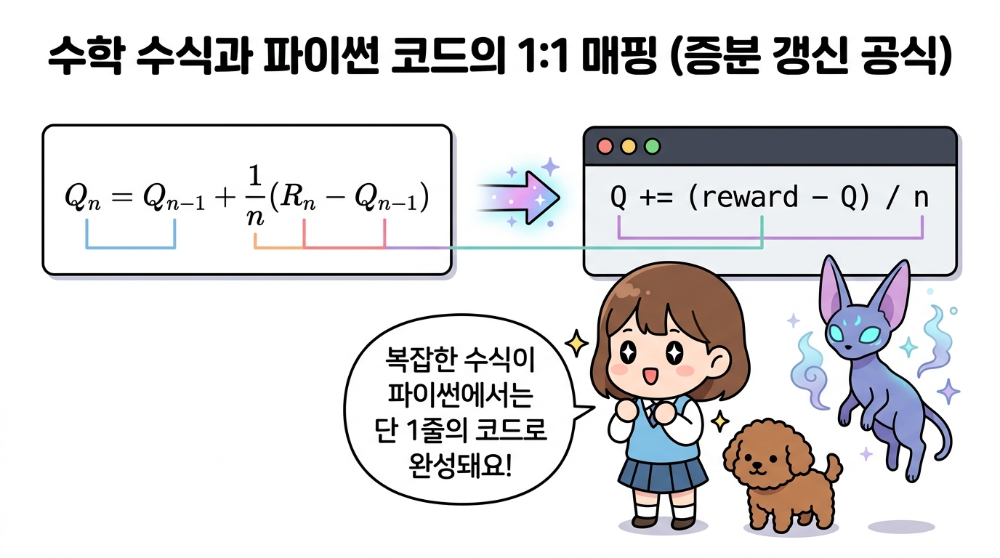

> 🐱 **지니**: "도로시, 수학 공식에서 좌변의 새로운 가치 *Q<sub>n</sub>*과 우변의 이전 가치 *Q<sub>n-1</sub>*이 파이썬에서는 복합 대입 연산자 `+=` 하나로 깔끔하게 합쳐진단다!"
>
> 👧 **도로시**: "와! 1/*n*은 `/ n`이 되고, 오차 항인 (*R<sub>n</sub>* - *Q<sub>n-1</sub>*)은 `(reward - Q)`로 1:1 매핑되니까 수학 공식보다 파이썬 코드가 훨씬 직관적이고 쉬워 보여!"
>
> 🐶 **토토**: "멍멍! (코드가 너무 간결해서 한눈에 쏙 들어와요!)"


---


직접 실행하고 동작을 확인해 볼 수 있는 파이썬 예제 코드는 다음과 같습니다.

**소스 코드: [bandit_single_val.py](./bandit_single_val.py)**

```python
from bandit1 import Bandit

bandit = Bandit()
Q = 0  # 0번째 슬롯머신의 가치 추정치 초기화

for n in range(1, 11):  # 10번 반복 (n = 1, 2, ..., 10)
    reward = bandit.play(0)  # 0번째 슬롯머신 플레이
    Q += (reward - Q) / n  # 증분 방식으로 가치 추정치 갱신
    print(f"{n:2d}번째 시도 | 보상: {reward} | 갱신된 가치 추정치 Q: {Q:.4f}")
```

**출력 결과 (예시)**
```text
 1번째 시도 | 보상: 0 | 갱신된 가치 추정치 Q: 0.0000
 2번째 시도 | 보상: 1 | 갱신된 가치 추정치 Q: 0.5000
 3번째 시도 | 보상: 1 | 갱신된 가치 추정치 Q: 0.6667
 4번째 시도 | 보상: 1 | 갱신된 가치 추정치 Q: 0.7500
 5번째 시도 | 보상: 0 | 갱신된 가치 추정치 Q: 0.6000
 6번째 시도 | 보상: 0 | 갱신된 가치 추정치 Q: 0.5000
 7번째 시도 | 보상: 0 | 갱신된 가치 추정치 Q: 0.4286
 8번째 시도 | 보상: 0 | 갱신된 가치 추정치 Q: 0.3750
 9번째 시도 | 보상: 0 | 갱신된 가치 추정치 Q: 0.3333
10번째 시도 | 보상: 0 | 갱신된 가치 추정치 Q: 0.3000
```

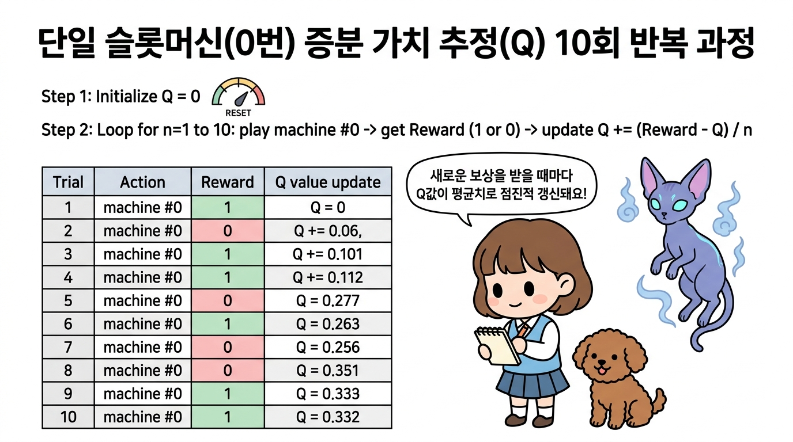

이 코드는 0번째 슬롯머신을 10번 연속으로 플레이하고 보상을 받을 때마다 슬롯머신의 가치 추정치를 **갱신**합니다. 


---


#### 코드 동작 단계별 상세 분석
1. **가치 추정치 초기화 (`Q = 0`)**: 슬롯머신에 대한 사전 정보가 전혀 없으므로 초기 가치 추정치를 `0`으로 설정합니다.
2. **슬롯머신 플레이 및 보상 관측 (`reward = bandit.play(0)`)**: 0번 머신을 당겨 코인을 얻으면 `1`, 얻지 못하면 `0`을 받습니다.
3. **증분 가치 갱신 (`Q += (reward - Q) / n`)**: 앞서 유도했던 증분 공식인 *Q<sub>n</sub>* = *Q<sub>n-1</sub>* + (1 / *n*)(*R<sub>n</sub>* - *Q<sub>n-1</sub>*)을 코드로 그대로 구현한 것입니다. 매 시행마다 오차(`reward - Q`)를 시행 횟수 `n`으로 나누어 기존 `Q`에 누적 더함으로써, 과거의 모든 보상 기록을 배열에 일일이 저장하지 않고도 정확한 표본 평균을 실시간으로 계산합니다.

> 🐱 **지니**: "도로시, `Q += (reward - Q) / n` 한 줄이 실행될 때마다 `Q`가 과거 모든 보상의 평균값으로 정확히 계산되는 마법을 눈으로 확인했지?"
>
> 👧 **도로시**: "응! 1회부터 10회까지 보상이 들어올 때마다 `Q`값이 부드럽게 조정되면서 0번 머신의 평균 승률에 점점 가까워지는 게 보여!"
>
> 🐶 **토토**: "멍멍! (과거 데이터를 다 저장하지 않아도 돼서 메모리가 아주 가벼워요!)"


여기까지가 지난 절의 복습입니다. 


---


### 3.4.4.2 전체 슬롯머신(10대) 가치 추정 확장

이제 10대의 슬롯머신 각각의 가치 추정치를 구해보겠습니다.

앞선 절에서는 0번째 슬롯머신 1대만을 대상으로 단일 변수 `Q`와 `n`을 사용했지만, 이제는 **10대의 슬롯머신 전체**를 다루어야 합니다. 

따라서 각 머신의 가치와 플레이 횟수를 개별적으로 관리할 수 있도록 **1차원 넘파이 배열**로 확장합니다.


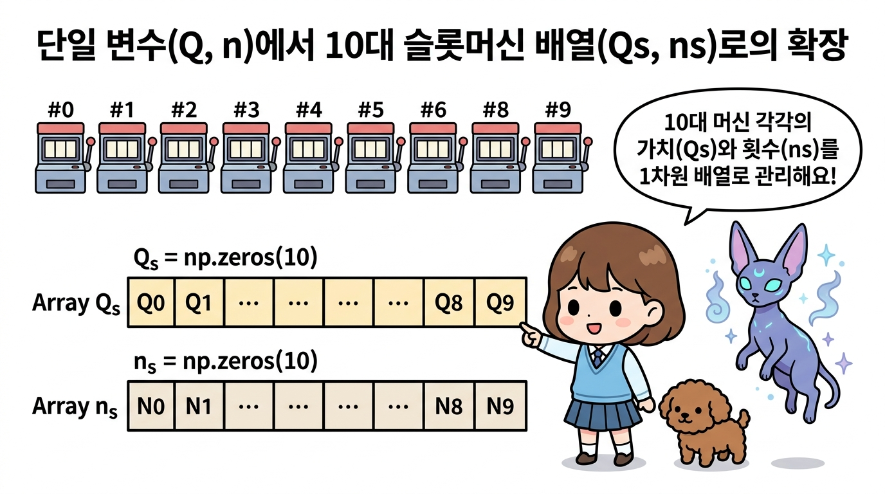


---


10대의 슬롯머신 각각에 대해 무작위로 레버를 당기며 가치 추정치를 갱신하는 전체 실습 코드는 다음과 같습니다.

**소스 코드: [bandit_multi_val.py](./bandit_multi_val.py)**

```python
import numpy as np
from bandit1 import Bandit

# 1. 10대 슬롯머신 환경 객체 생성
bandit = Bandit()

# 2. 10대 머신의 가치 추정치(Qs)와 플레이 횟수(ns)를 0으로 초기화
Qs = np.zeros(10)  # 각 슬롯머신의 가치 추정치 배열 (1차원 배열)
ns = np.zeros(10)  # 각 슬롯머신의 플레이 횟수 기록 배열

# 3. 10번 동안 무작위로 슬롯머신을 골라 플레이하고 증분 갱신
for n in range(10):
    action = np.random.randint(0, 10)  # 무작위 행동 (0~9번 머신 중 임의 선택)
    reward = bandit.play(action)       # 선택된 슬롯머신 플레이
    
    ns[action] += 1  # action번째 슬롯머신의 누적 플레이 횟수 증가
    # action번째 슬롯머신의 가치 추정치만 증분 갱신
    Qs[action] += (reward - Qs[action]) / ns[action]
    print(f"시행 {n+1:2d}회 | 선택 머신: #{action} | 보상: {reward} -> Qs: {np.round(Qs, 2)}")
```

**출력 결과 (예시)**
```text
시행  1회 | 선택 머신: #9 | 보상: 0 -> Qs: [0. 0. 0. 0. 0. 0. 0. 0. 0. 0.]
시행  2회 | 선택 머신: #0 | 보상: 1 -> Qs: [1. 0. 0. 0. 0. 0. 0. 0. 0. 0.]
시행  3회 | 선택 머신: #7 | 보상: 0 -> Qs: [1. 0. 0. 0. 0. 0. 0. 0. 0. 0.]
시행  4회 | 선택 머신: #9 | 보상: 0 -> Qs: [1. 0. 0. 0. 0. 0. 0. 0. 0. 0.]
시행  5회 | 선택 머신: #6 | 보상: 1 -> Qs: [1. 0. 0. 0. 0. 0. 1. 0. 0. 0.]
시행  6회 | 선택 머신: #4 | 보상: 1 -> Qs: [1. 0. 0. 0. 1. 0. 1. 0. 0. 0.]
시행  7회 | 선택 머신: #4 | 보상: 1 -> Qs: [1. 0. 0. 0. 1. 0. 1. 0. 0. 0.]
시행  8회 | 선택 머신: #1 | 보상: 0 -> Qs: [1. 0. 0. 0. 1. 0. 1. 0. 0. 0.]
시행  9회 | 선택 머신: #1 | 보상: 1 -> Qs: [1.  0.5 0.  0.  1.  0.  1.  0.  0.  0. ]
시행 10회 | 선택 머신: #1 | 보상: 1 -> Qs: [1.   0.67 0.   0.   1.   0.   1.   0.   0.   0.  ]
```

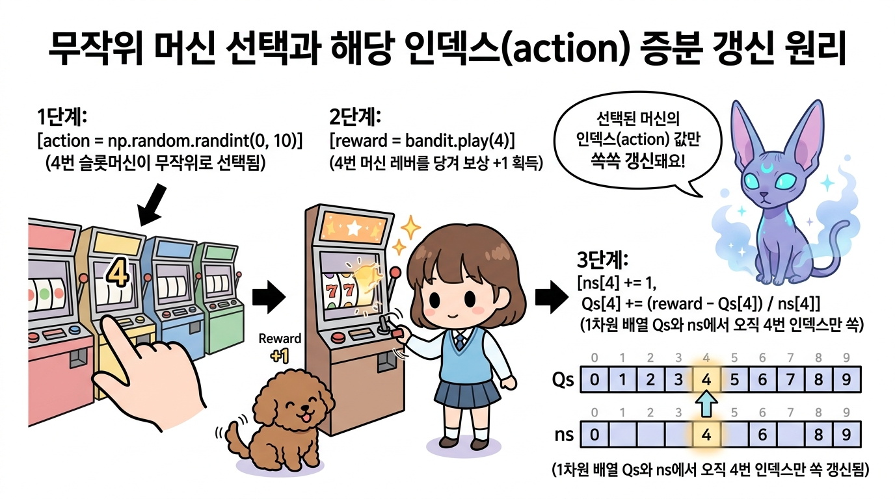

이번에는 원소 10개짜리 1차원 배열인 Qs와 ns 변수를 새롭게 준비했습니다(`np.zeros()` 함수로 원소를 모두 0으로 초기화). 

그리고 ns의 각 원소에는 해당 슬롯머신을 플레이한 횟수를 저장합니다. 이렇게 하여 슬롯머신 각각의 가치를 추정할 수 있습니다.


---


#### 코드 동작 원리 상세 분석
1. **`Qs = np.zeros(10)` & `ns = np.zeros(10)`**: 슬롯머신이 10대이므로 크기 10인 배열 2개를 준비하여 모든 슬롯머신의 초기 가치 추정치와 플레이 횟수를 `0.0`과 `0`으로 설정합니다.
2. **`action = np.random.randint(0, 10)`**: 0 이상 10 미만(0~9)의 정수 난수를 하나 뽑아 이번에 플레이할 슬롯머신 번호(`action`)를 정합니다.
3. **`ns[action] += 1`**: 선택된 슬롯머신의 플레이 횟수만 1 증가시킵니다.
4. **`Qs[action] += (reward - Qs[action]) / ns[action]`**: 인덱스 슬라이싱(`[action]`)을 활용하여 선택된 슬롯머신의 가치 추정치만 핀포인트로 증분 갱신합니다. 선택되지 않은 나머지 9개 슬롯머신의 값은 그대로 보존됩니다.

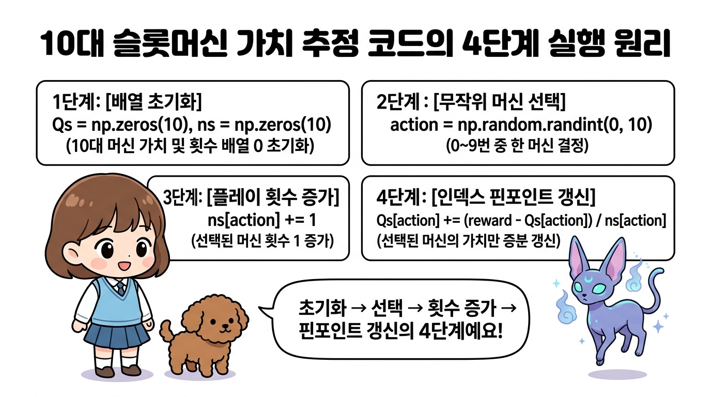

> 🐱 **지니**: "도로시, `[action]` 인덱스를 사용하니까 10대의 슬롯머신 중 내가 실제로 당긴 머신의 가치와 횟수만 쏙쏙 골라서 갱신할 수 있지?"
>
> 👧 **도로시**: "맞아! 단일 머신일 때의 수식 `Q += (reward - Q) / n`에서 `Q`와 `n` 뒤에 `[action]`만 붙여주니 10대 머신 전체로 손쉽게 확장되는구나!"
>
> 🐶 **토토**: "멍멍! (배열 인덱스를 활용하니 코드가 정말 깔끔해요!)"


---


### 3.4.4.3 Agent 클래스 설계 및 구현

#### 1. 에이전트 클래스(Agent Class)와 밴디트(Bandit)의 상호작용 관계

지금까지 익힌 지식을 활용하여 `Agent` 클래스를 구현하겠습니다. 

앞서 구현한 `Bandit` 클래스가 카지노의 **환경(Environment)**이었다면, 이제 새롭게 구현할 `Agent` 클래스는 그 환경 안에서 플레이하는 **플레이어(Player)**에 해당합니다. 

두 클래스는 다음과 같은 순환적인 상호작용 루프(Interaction Loop)를 통해 끊임없이 소통합니다.

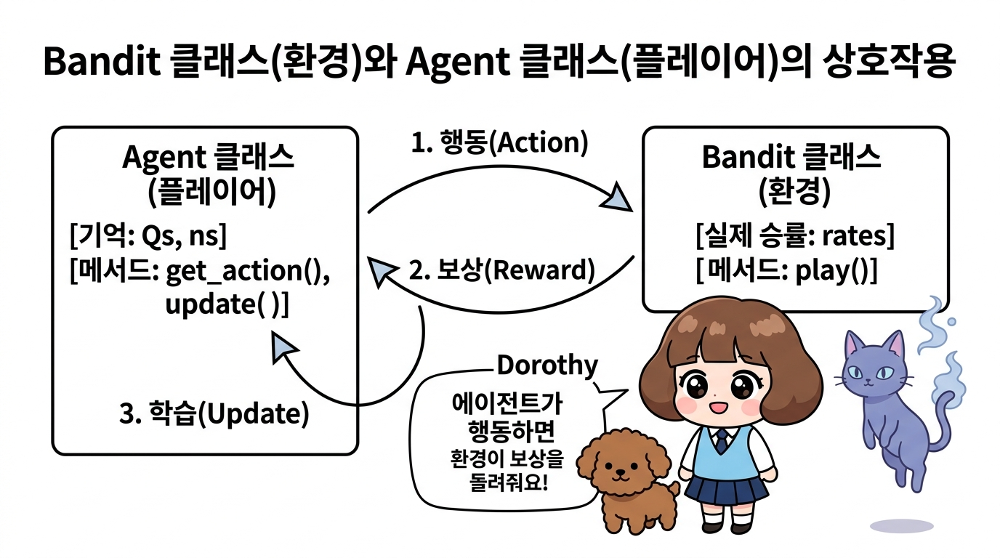

1. **행동 선택(Action)**: `Agent`가 ε-탐욕 정책(`get_action()`)에 따라 10대 슬롯머신 중 하나를 선택하여 `Bandit`에게 전달합니다.
2. **보상 반환(Reward)**: `Bandit`은 선택된 슬롯머신의 실제 승률에 따라 레버를 동작시키고(`play(action)`), 결과 보상(`1` 또는 `0`)을 `Agent`에게 돌려줍니다.
3. **경험 학습(Update)**: `Agent`는 돌려받은 보상을 바탕으로 자신의 내부 기억(`Qs[action]`)을 증분 공식으로 최신화(`update(action, reward)`)합니다.

> 🐱 **지니**: "도로시, `Bandit`이 문제를 내는 '출제자(환경)'라면, `Agent`는 문제를 풀고 경험을 쌓아가는 '응시자(학습자)'라고 볼 수 있단다!"
>
> 👧 **도로시**: "아하! `Agent`가 레버를 고르면 `Bandit`이 코인을 주고, 그 코인을 보고 `Agent`가 머신별 점수표를 업데이트하면서 점점 똑똑해지는 거구나!"
>
> 🐶 **토토**: "멍멍! (둘이 쿵짝이 잘 맞는 찰떡궁합이에요!)"


---


#### 2. Agent 클래스의 내부 구조와 ε-탐욕 정책

Agent 클래스는 ε-탐욕 정책을 따라 행동을 선택하도록 할 것입니다.

`Agent` 클래스는 크게 **3가지 기억 속성**과 **2가지 핵심 동작 메서드**로 구성됩니다.

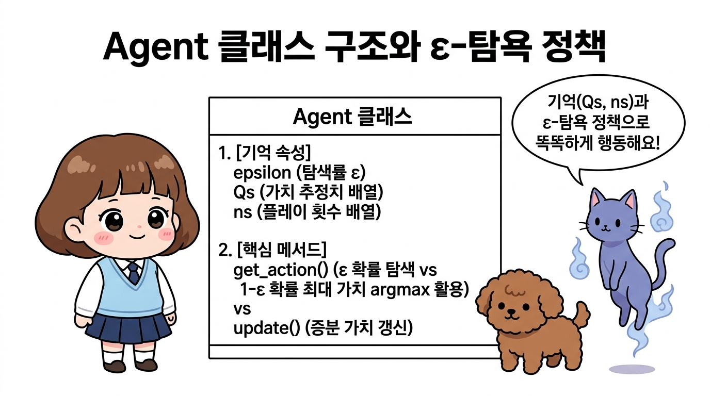

1. **기억 속성 (Memory Attributes)**:
   - `self.epsilon`: 무작위로 새로운 슬롯머신을 탐색(Exploration)할 확률 ε입니다.
   - `self.Qs`: 10대 슬롯머신 각각의 가치 추정치 배열(`np.zeros(action_size)`)로, 플레이어가 각 머신에 대해 파악하고 있는 현재 기대 보상입니다.
   - `self.ns`: 10대 슬롯머신 각각의 누적 플레이 횟수 배열(`np.zeros(action_size)`)로, 증분 갱신 공식의 분모(단계 크기 1/*n*)로 활용됩니다.

2. **핵심 메서드 (Core Methods)**:
   - **`get_action()`**: **ε-탐욕 정책**을 통해 행동을 결정합니다. ε 확률로 무작위 슬롯머신을 고르고(탐색), 1 - ε 확률로는 현재까지의 가치 추정치 `Qs` 중 최댓값을 가진 머신(`np.argmax(Qs)`)을 선택(활용)합니다.
   - **`update(action, reward)`**: 선택한 슬롯머신(`action`)과 그 결과로 얻은 보상(`reward`)을 전달받아 `ns` 횟수를 늘리고 `Qs` 가치 추정치를 증분 공식으로 갱신합니다.

> 🐱 **지니**: "도로시, `Agent` 클래스는 두 개의 기억 장치(`Qs`, `ns`)와 두 개의 핵심 뇌(`get_action`, `update`)를 가지고 있단다. 기억 장치는 지금까지 얻은 경험을 저장하고, 뇌는 ε-탐욕 정책으로 행동을 결정하고 새 보상을 학습하지!"
>
> 👧 **도로시**: "와! ε 확률로 가끔 엉뚱한 머신도 탐색해 보고, 평소에는 제일 잘 나오는 머신을 공략하는 똑똑한 에이전트 설계도구나!"
>
> 🐶 **토토**: "멍멍! (객체 지향으로 묶으니 구조가 한눈에 쏙 들어와요!)"


---


**소스 코드: [agent.py](./agent.py)**

```python
import numpy as np

class Agent:
    def __init__(self, epsilon, action_size=10):
        self.epsilon = epsilon           # 무작위로 행동할 확률 (탐색 확률 ε)
        self.Qs = np.zeros(action_size)  # 각 슬롯머신의 가치 추정치 배열 (초기값: 모두 0.0)
        self.ns = np.zeros(action_size)  # 각 슬롯머신의 누적 플레이 횟수 배열 (초기값: 모두 0)

    def update(self, action, reward):
        # 1. action번째 슬롯머신의 플레이 횟수 1 증가
        self.ns[action] += 1
        # 2. 증분 공식으로 action번째 슬롯머신의 가치 추정치 갱신
        self.Qs[action] += (reward - self.Qs[action]) / self.ns[action]

    def get_action(self):
        # 1. ε의 확률로 무작위 탐색 (새로운 슬롯머신 시도)
        if np.random.rand() < self.epsilon:
            return np.random.randint(0, len(self.Qs))
        
        # 2. (1 - ε)의 확률로 탐욕적 활용 (현재 최고 가치 추정 머신 선택)
        return np.argmax(self.Qs)
```


---


### 3.4.4.4 Agent 3가지 핵심 메서드 동작 원리

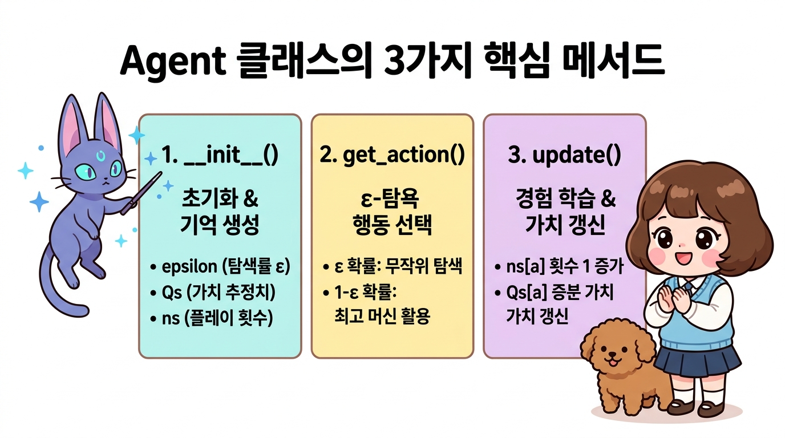

`Agent` 클래스는 강화학습의 3대 핵심 역할(기억 생성, 행동 결정, 경험 학습)을 담당하는 3개의 메서드로 구성되어 있습니다.

#### 1. `__init__(self, epsilon, action_size=10)`: 초기화 및 기억 장치 설정
* **`self.epsilon`**: ε-탐욕 정책에 따라 무작위로 행동할 확률(탐색률 *ε*)입니다. 예를 들어 `epsilon=0.1`이면 10%의 확률로 새로운 슬롯머신을 탐색합니다.
* **`action_size`**: 에이전트가 선택할 수 있는 행동의 총 개수입니다. 여기서는 슬롯머신의 대수(10대)를 뜻합니다.
* **`self.Qs`**: 10대 슬롯머신의 가치 추정치를 저장하는 1차원 배열(`np.zeros(action_size)`)로, 초기값은 모두 `0.0`입니다.
* **`self.ns`**: 10대 슬롯머신의 누적 플레이 횟수를 저장하는 1차원 배열(`np.zeros(action_size)`)로, 초기값은 모두 `0`입니다.

#### 2. `get_action(self)`: ε-탐욕 정책 기반 행동 선택
* **탐색(Exploration, *ε* 확률)**: `np.random.rand() < self.epsilon` 조건이 참이면 `np.random.randint(0, len(self.Qs))`를 통해 10대의 머신 중 하나를 무작위로 골라 새로운 기회를 모색합니다.
* **활용(Exploitation, 1 - *ε* 확률)**: 조건이 거짓이면 `np.argmax(self.Qs)`를 실행하여 지금까지 추정한 가치(`self.Qs`)가 가장 큰 머신의 번호(인덱스)를 선택합니다.

#### 3. `update(self, action, reward)`: 경험 학습 및 증분 가치 갱신
* **시행 횟수 증가**: `self.ns[action] += 1`로 플레이한 머신의 플레이 횟수를 1 늘립니다.
* **가치 추정치 갱신**: 증분 공식에 따라 오차(`reward - self.Qs[action]`)를 횟수(`self.ns[action]`)로 나누어 기존 가치 `self.Qs[action]`에 더해 갱신합니다.

> 🐱 **지니**: "`__init__`으로 기억 장치를 만들고, `get_action`으로 행동을 결정하고, `update`로 경험을 학습하는 이 3단계 사이클이 바로 인공지능 에이전트의 완전한 뇌 구조란다!"
>
> 👧 **도로시**: "와! 3개의 메서드가 각자 자기 역할을 맡아서 [기억 -> 행동 -> 학습]으로 물 흐르듯 이어지니까 코드가 훨씬 이해하기 쉬워요!"
>
> 🐶 **토토**: "멍멍! (3가지 메서드가 한눈에 쏙 들어와요!)"

여기까지가 Agent 클래스를 구현하는 방법입니다.


---


## 3.4.5 실행해보기

이제 Bandit 클래스와 Agent 클래스를 이용하여 행동을 취해봅시다.

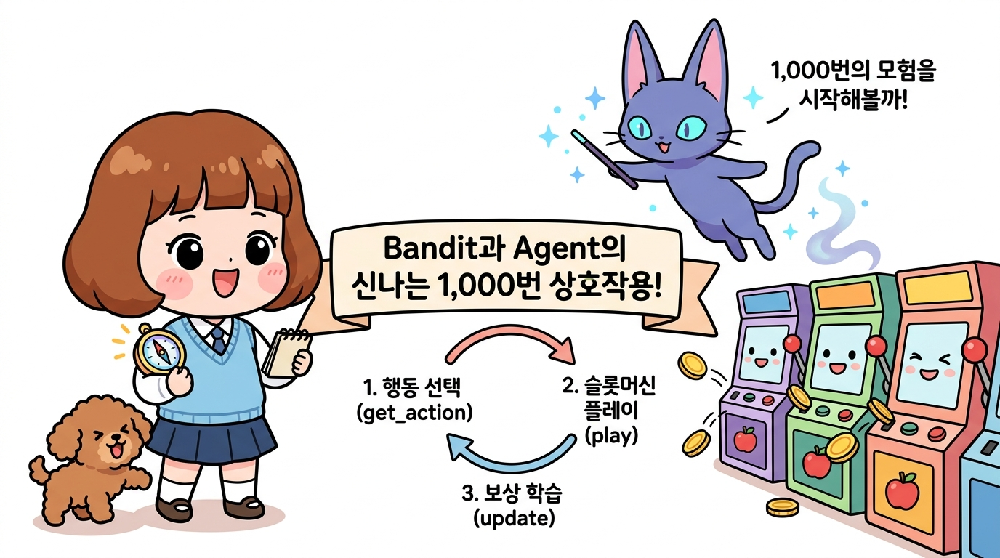

> 🐱 **지니**: "도로시, 환경인 `Bandit`과 똑똑한 학습자 `Agent`가 드디어 모두 준비되었단다! 이제 두 객체를 연결해 1,000번의 상호작용 모험을 돌려볼 시간이야!"
>
> 👧 **도로시**: "와! 에이전트가 행동(`get_action`)을 선택하면 슬롯머신이 보상(`play`)을 주고, 그 결과를 보고 가치 지도를 갱신(`update`)하는 3단계 루프가 1,000번 반복되는 거군요!"
>
> 🐶 **토토**: "멍멍! (1,000번 동안 얼마나 많은 보상을 얻을 수 있을지 두근거려요!)"


---


### 3.4.5.1 상호작용 루프 구현 및 실행

행동을 1000번 수행하여 보상을 얼마나 얻는지 보겠습니다.

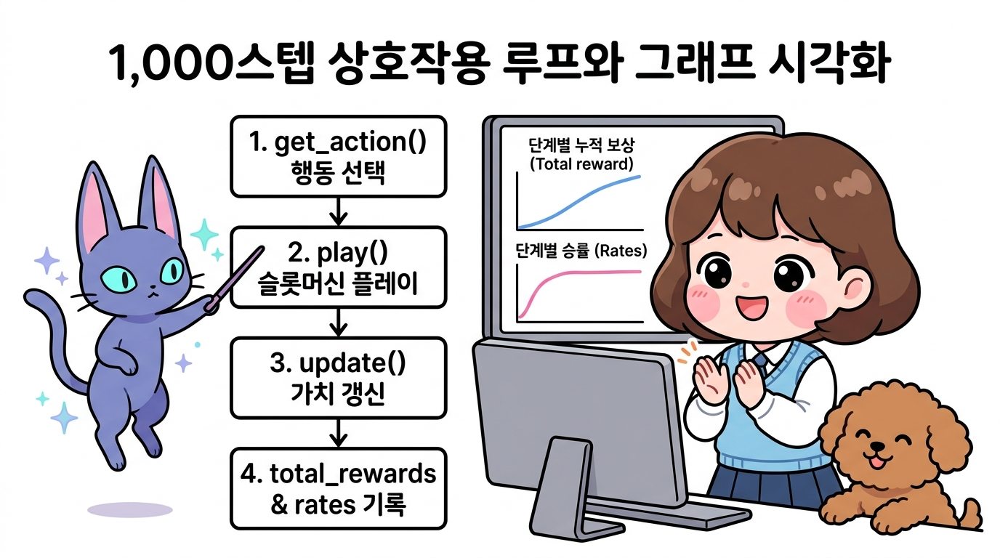

**소스 코드: [bandit_play.py](./bandit_play.py)**

```python
import matplotlib.pyplot as plt
import numpy as np
from bandit1 import Bandit
from agent import Agent

# 1. 시뮬레이션 설정 (하이퍼파라미터)
steps = 1000      # 총 플레이 횟수 (1,000단계)
epsilon = 0.1     # 탐색률 ε (10% 확률로 무작위 탐색, 90% 확률로 최고 머신 활용)

# 2. 환경(Bandit: 10대 슬롯머신)과 에이전트(Agent) 인스턴스 생성
bandit = Bandit()       # 승률이 무작위로 숨겨진 슬롯머신 환경
agent = Agent(epsilon)  # ε-탐욕 정책 기반 강화학습 에이전트

total_reward = 0        # 전체 누적 보상 합계
total_rewards = []      # 각 스텝별 누적 보상 기록 리스트 (그림 3-19)
rates = []              # 각 스텝별 평균 승률 기록 리스트 (그림 3-20)

# 3. 1,000스텝 상호작용 루프 실행
for step in range(steps):
    # [1단계] 행동 선택: 에이전트가 ε-탐욕 정책에 따라 슬롯머신(0~9) 번호 선택
    action = agent.get_action()
    
    # [2단계] 환경 반응: 선택한 슬롯머신의 레버를 당겨 보상(1: 당첨, 0: 꽝) 획득
    reward = bandit.play(action)
    
    # [3단계] 경험 학습: 획득한 보상으로 에이전트의 가치 추정치(Qs) 증분 갱신
    agent.update(action, reward)
    
    # [4단계] 통계 기록: 누적 보상 합산 및 현재까지의 승률 계산
    total_reward += reward
    total_rewards.append(total_reward)          # 현재까지의 누적 보상 저장
    rates.append(total_reward / (step + 1))      # 현재까지의 승률 저장 (누적 보상 / 현재 스텝)

# 1,000회 플레이 후 총 누적 보상 출력
print(total_reward)

# 4. 그래프 그리기: 단계별 보상 총합(그림 3-19)
plt.ylabel('Total reward')
plt.xlabel('Steps')
plt.plot(total_rewards)
plt.show()

# 5. 그래프 그리기: 단계별 승률(그림 3-20)
plt.ylabel('Rates')
plt.xlabel('Steps')
plt.plot(rates)
plt.show()
```

**출력 결과**
```
859
```

> 🐱 **지니**: "도로시, 1,000번 동안 에이전트가 열심히 탐색하고 학습한 덕분에 무려 850점 이상의 높은 보상을 얻었단다!"
>
> 👧 **도로시**: "와! `total_rewards`는 계속 위로 쭉쭉 뻗어 올라가고, `rates`는 초반에 탐색을 거치더니 가장 승률이 좋은 머신의 승률 근처로 쑥 올라가네요!"
>
> 🐶 **토토**: "멍멍! (코드 흐름이 4단계로 한눈에 정리되어 정말 쉬워요!)"


### 3.4.5.2 에이전트와 환경의 상호작용 3단계

먼저 `for` 루프 내부에 주목해보죠. 

이 영역은 **에이전트(Agent)**와 **환경(Bandit/Environment)**이 끊임없이 신호를 주고받으며 학습을 고도화하는 **'상호작용 루프(Interaction Loop)'**입니다. 


루프 내부는 다음의 3단계로 구성됩니다:


---

#### 1단계: 행동 선택 (`action = agent.get_action()`)

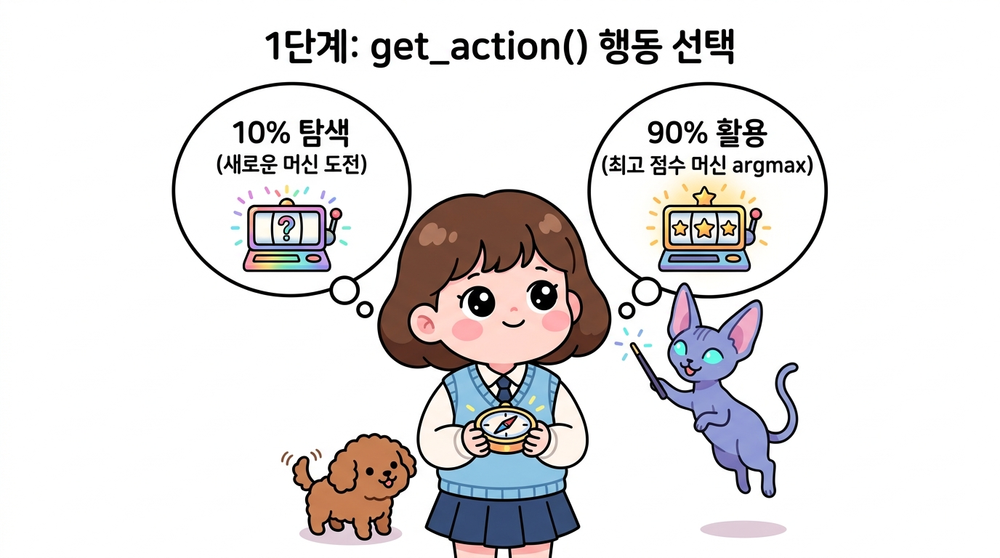

* **원리 및 역할**: 에이전트가 ε-탐욕 정책에 따라 현재 시점에서 **어떤 슬롯머신**을 당길지 결정합니다.
* **동작 방식**: 
  - *ε* (예: 10%)의 확률로 무작위 탐색(Exploration)을 수행하여 새로운 슬롯머신에 도전합니다.
  - 1 - *ε* (예: 90%)의 확률로 탐욕적 활용(Exploitation)을 수행하여 현재까지 가치 추정치(`self.Qs`)가 가장 높은 머신(`np.argmax`)을 선택합니다.
* **결과**: 선택된 머신의 인덱스 번호(`action`: 0~9 중 하나)가 반환됩니다.

> 🐱 **지니**: "도로시, 주사위를 던져 10%는 새로운 가능성을 찾고, 90%는 최고 머신을 공략하는 지혜로운 결정 단계란다!"
>
> 👧 **도로시**: "상황에 안주하지 않고 가끔 새로운 길을 탐험하는 균형 감각이 핵심이군요!"


---


#### 2단계: 환경의 반응 및 보상 획득 (`reward = bandit.play(action)`)


* **원리 및 역할**: 에이전트가 선택한 슬롯머신의 레버를 실제로 당겨 환경(슬롯머신)으로부터 **결과(보상)를 얻습니다.**
* **동작 방식**: 
  - 슬롯머신 환경(`Bandit`)은 해당 머신에 숨겨진 고유 승률(`rates[action]`)을 기반으로 난수를 발생시킵니다.
  - 승리하면 `1`(황금 코인/사과 당첨), 실패하면 `0`(꽝)의 보상(`reward`)을 에이전트에게 전달합니다.
* **결과**: 즉각적인 보상 값(`reward`: 1 또는 0)이 에이전트에게 주어집니다.

> 🐱 **지니**: "슬롯머신은 자신의 속마음(승률)을 직접 알려주지 않고, 오직 '당첨(1)'과 '꽝(0)'이라는 결과로만 답해준단다!"
>
> 👧 **도로시**: "와! 레버를 당길 때마다 황금 사과가 터져 나오길 기대하는 짜릿한 순간이에요!"


---


#### 3단계: 가치 추정치 갱신 및 학습 (`agent.update(action, reward)`)

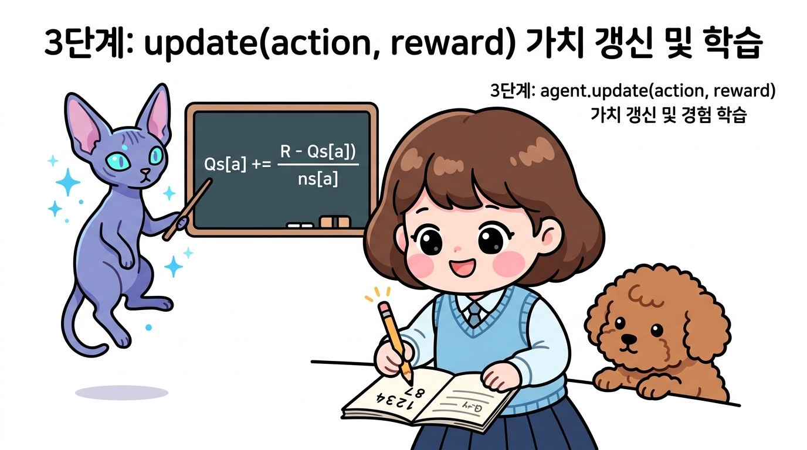

* **원리 및 역할**: 방금 얻은 보상 경험을 바탕으로 **에이전트의 뇌(가치 추정치 배열 `Qs`)**를 증분 방식으로 똑똑하게 업데이트합니다.
* **동작 방식**: 
  - 해당 머신의 누적 플레이 횟수를 1 증가시킵니다 (`self.ns[action] += 1`).
  - 증분 갱신 공식 *Q*(*a*) ← *Q*(*a*) + (1 / *N*(*a*)) × (*R* - *Q*(*a*))에 따라 오차를 반영하여 해당 머신의 가치 추정치를 실시간으로 보정합니다:
    `self.Qs[action] += (reward - self.Qs[action]) / self.ns[action]`
* **결과**: 다음 단계에서 더 정확하고 유리한 판단을 내릴 수 있도록 가치 추정치(`self.Qs[action]`)가 최신 경험으로 갱신됩니다.

> 🐱 **지니**: "경험이 쌓일수록 1/*n*의 크기가 줄어들면서 점수가 안정적으로 진짜 승률에 수렴하게 된단다!"
>
> 👧 **도로시**: "기록하고, 계산하고, 수정하면서 슬롯머신의 비밀 승률을 밝혀내는 진정한 학습의 과정이네요!"
>
> 🐶 **토토**: "멍멍! (행동하고 -> 보상받고 -> 똑똑해지는 완벽한 3박자예요!)"


---


이 3단계 과정을 1000번 반복 수행하며 각 시점의 보상 총합(`total_rewards`)과 누적 평균 승률(`rates`)을 실시간으로 추적하여 학습 추이를 평가합니다.

이 코드를 실행하니 최종적으로 얻은 보상의 총합은 859가 되었습니다(결과는 실행할 때마다 달라집니다). 1000번의 플레이 중 859번 '승리'했다는 뜻입니다. 


#### 859점 획득이 갖는 놀라운 의미
* **무작위 선택과의 비교**: 만약 에이전트가 학습하지 않고 아무 머신이나 무작위로 계속 골랐다면, 10대 머신의 평균 승률(약 50% 가정 시)에 수렴하여 대략 **500점 안팎**에 머물렀을 것입니다.
* **ε-탐욕 학습의 위력**: 에이전트는 초반 몇 차례의 탐색(10% 확률)을 통해 10대 중 가장 승률이 높은 최고 머신(승률 약 85~90%)을 빠르게 감지해 냈고, 이후 90%의 시행에서 그 최고 머신을 집중적으로 공략(활용)했기 때문에 무려 **859점(승률 85.9%)**이라는 압도적인 고득점을 달성할 수 있었습니다.

> 🐱 **지니**: "도로시, 10대의 슬롯머신 중 어떤 녀석이 대박 머신인지 전혀 모른 채 시작했는데도, 스스로 탐색하고 학습해서 859점이라는 엄청난 보상을 모아냈단다!"
>
> 👧 **도로시**: "와! 무작위로 당겼을 때(약 500점)보다 훨씬 많은 황금 코인과 사과를 획득했어요! ε-탐욕 알고리즘이 진짜 똑똑하게 작동하는 걸 눈으로 확인하니 신기해요!"
>
> 🐶 **토토**: "멍멍! (보물상자가 넘쳐나요! 대단해요 도로시!)" 


---


### 3.4.5.3 단계별 보상 총합 결과 분석

참고로 이때 total_rewards의 추이를 그려보니 [그림 3-19]와 같은 결과가 나왔습니다.

**그림 3-19** 단계에 따른 보상 총합


그래프에서 볼 수 있듯이 단계가 늘어날 때마다 보상의 총합이 꾸준히 증가합니다. 


---


다만 증가 방식의 특징, 예컨대 단계 증가와 보상 증가의 **정밀한 관계** 같은 정보는 이 그래프만으로는 알아내기 어렵습니다.

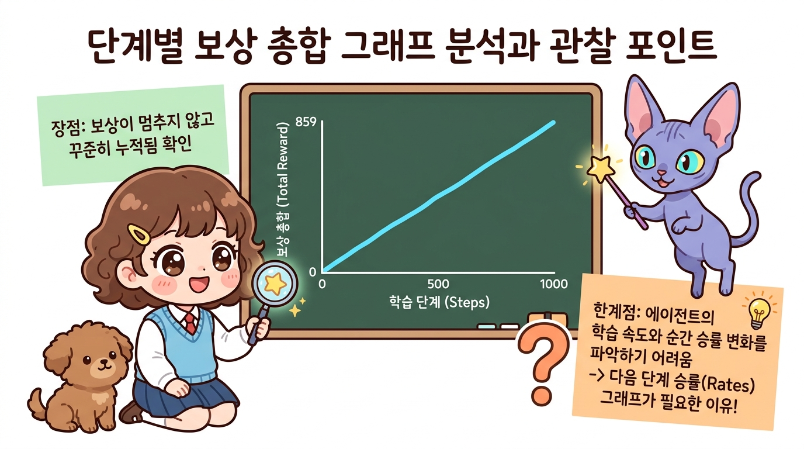

#### 보상 총합 그래프의 특징과 한계점 분석
1. **확인할 수 있는 장점**:
   - 가로축(Steps)이 0에서 1,000으로 진행됨에 따라 세로축(Total reward)이 859까지 꾸준히 우상향합니다.
   - 이는 에이전트가 보상을 멈추지 않고 안정적으로 획득하고 있음을 분명하게 보여줍니다.

2. **누적 그래프가 갖는 한계점**:
   - 그래프가 전반적으로 완만한 직선(Linear) 형태를 띠고 있어, **"에이전트가 초반 몇 번의 탐색을 거쳤는지"**, **"언제부터 최적의 슬롯머신을 본격적으로 공략하기 시작했는지"**와 같은 학습의 세부적인 질적 변화를 파악하기 어렵습니다.
   - 즉, 누적 보상 총합만으로는 에이전트의 **순간적인 승률 변화나 학습 속도(수렴 시점)**를 정밀하게 평가하기에 한계가 있습니다.

> 🐱 **지니**: "도로시, 누적 보상 그래프는 '총 얼마나 벌었는가'는 잘 보여주지만, '점점 실력이 늘고 있는가'를 세밀하게 들여다보기엔 조금 부족하단다."
>
> 👧 **도로시**: "맞아요! 돋보기로 들여다봐도 그냥 쭉 뻗은 직선처럼 보여서, 내가 언제 최고의 머신을 찾아냈는지 정확한 시점을 알기 어려워요!"
>
> 🐶 **토토**: "멍멍! (그래서 다음 그래프인 '단계별 승률'이 꼭 필요한 거군요!)"


---


### 3.4.5.4 단계별 승률 결과 분석

앞의 코드가 생성한 두 번째 그래프인 [그림 3-20]을 살펴보죠. 

세로축은 승률입니다.

**그림 3-20** 단계별 승률


이 그래프를 보면 100단계에서의 승률은 약 0.4입니다. 

이를 기준으로 단계를 거듭할수록 승률이 높아지고 있습니다. 초반에 승률이 빠르게 상승하고 500단계를 넘어선 이후에도 완만하게 상승 추세를 이어가고 있습니다. 최종 승률은 0.8이 넘었습니다. 


---


우리가 구현한 ε-탐욕 정책의 학습이 제대로 이루어지고 있는 것으로 보입니다.

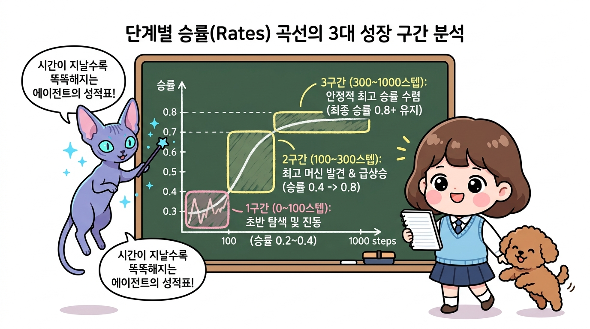

#### 승률 곡선(Learning Curve)의 3대 성장 구간 상세 분석

1. **1구간: 초반 탐색 및 진동 구간 (0 ~ 100 단계, 승률 약 0.2 ~ 0.4)**
   - 10대의 슬롯머신에 대한 사전 정보가 전혀 없기 때문에 에이전트가 주사위를 굴리며 여러 머신을 골고루 찔러봅니다(탐색).
   - 이때는 꽝(0)도 많이 겪기 때문에 승률이 낮고 불안정하게 출렁입니다.

2. **2구간: 급격한 학습 및 상승 구간 (100 ~ 300 단계, 승률 0.4 → 0.8 급상승)**
   - 몇 차례의 경험이 쌓이면서 10대 중 승률이 가장 높은 머신의 가치 추정치(`self.Qs`)가 다른 머신들보다 확연히 높아집니다.
   - 에이전트가 (1 - *ε*)의 높은 확률로 이 최고 머신을 집중 공략(활용)하기 시작하면서 승률이 가파르게 치솟습니다.

3. **3구간: 안정적 수렴 및 유지 구간 (300 ~ 1,000 단계, 최종 승률 0.8+ 유지)**
   - 최고 승률 머신에 대한 확신을 바탕으로 500단계를 넘어 1,000단계까지 0.8 이상의 고승률을 든든하게 유지합니다.
   - 탐색 확률 *ε* = 0.1 때문에 가끔(10%) 다른 머신을 시험해보지만, 90%는 검증된 최고 머신을 당기므로 꾸준한 고수익을 확보합니다.

> 🐱 **지니**: "도로시, 승률 그래프의 S자 모양 상승 곡선이야말로 '에이전트가 경험을 통해 점점 똑똑해졌다'는 가장 명확한 증거란다!"
>
> 👧 **도로시**: "와! 100단계 전에는 주춤하다가, 최고 머신을 알아낸 뒤 0.8 넘게 쑥 치솟는 모습이 마치 내가 시험공부를 마스터하는 과정 같아요!"
>
> 🐶 **토토**: "멍멍! (ε-탐욕 에이전트의 실력이 눈에 띄게 성장했어요!)"


---


## 3.4.6 알고리즘의 평균적인 특성

방금 구현한 코드는 실행할 때마다 결과가 달라집니다. 


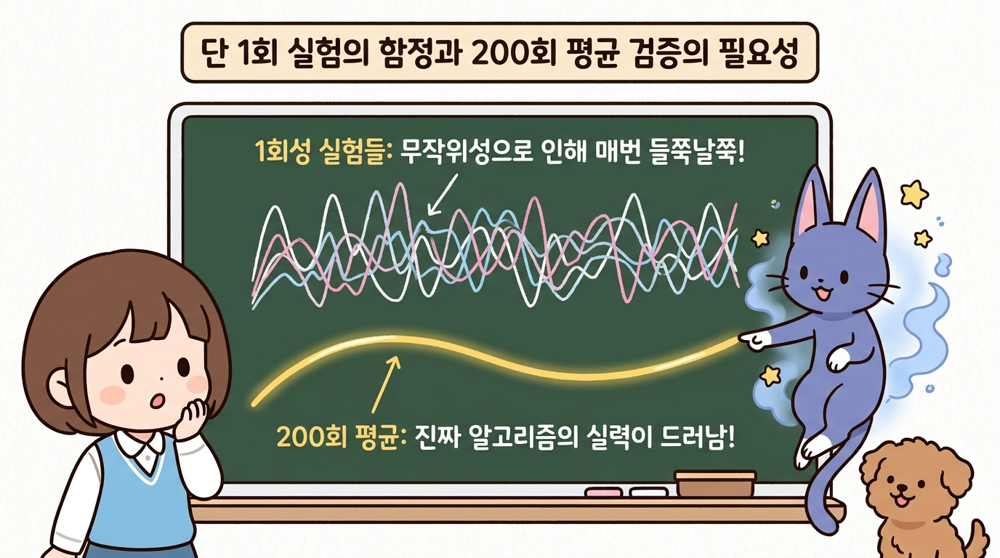

> 👧 **도로시**: "어라? 1회차에서는 승률이 0.85까지 쭉쭉 올라갔는데, 2회차에서는 0.6에서 헤매고 있어! 왜 실행할 때마다 결과가 이렇게 들쭉날쭉할까?"
>
> 🐱 **지니**: "강화 학습에는 두 가지 큰 무작위성이 있기 때문이야! 첫째, 슬롯머신들의 승률 배치가 매 실험마다 다르고, 둘째, 에이전트의 ε-탐색과 슬롯머신의 당첨 주사위에도 확률이 개입하거든. 그래서 단 한 번의 실험만 보고 '이 알고리즘이 최고야!'라고 결론을 내리면 큰 함정에 빠진단다!"


---


### 3.4.6.1 10회 실행을 통한 결과의 무작위성 관찰

예를 들어 [그림 3-20]의 그래프는 실행할 때마다 모양이 크게 달라집니다. 시험 삼아 같은 코드를 10번 실행하고 그 결과를 하나의 그래프로 그려보니 [그림 3-21]와 같았습니다.


**그림 3-21** 10번의 결과를 한꺼번에 그려보기


이처럼 실험 때마다 결과가 다른 이유는 코드에 `무작위성`이 포함되어 있기 때문입니다.


#### 무작위성의 2가지 원인과 시드(Seed)

먼저 슬롯머신 10대 각각의 승률을 무작위로 설정했습니다. 그리고 에이전트가 활용한 ε-탐욕 정책에서도 행동을 무작위로 선택했죠. 이러한 **무작위성** 때문에 **매번 결과가 달라질 수 있습니다.**

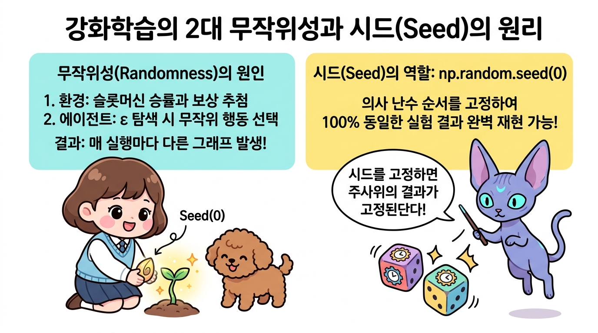

1. **환경의 무작위성 (Environment Randomness)**:
   - `Bandit` 객체가 생성될 때 10대 슬롯머신의 고유 승률(`self.rates`)이 `np.random.rand(10)`으로 매번 다르게 무작위 배정됩니다.
   - 슬롯머신을 플레이할 때도 확률적 주사위(`rate > np.random.rand()`)에 의해 보상(1 또는 0)이 결정됩니다.

2. **에이전트 정책의 무작위성 (Policy Randomness)**:
   - `Agent`의 `get_action()` 메서드에서 탐색 확률 *ε* (10%)에 당첨될 때마다 `np.random.randint(0, 10)`으로 임의의 슬롯머신을 무작위 선택합니다.

> 🐱 **지니**: "도로시, 강화학습 세상에는 '환경의 우연'과 '에이전트의 모험'이라는 2가지 무작위성이 공존한단다. 그래서 단 한 번의 실행 결과만 보고 알고리즘 전체를 평가하면 큰 오판을 할 수 있지!"
>
> 👧 **도로시**: "아하! 마치 마법 주사위를 굴리는 것과 같군요! `np.random.seed(0)`으로 주사위의 미래를 똑같이 고정할 수도 있지만, 알고리즘의 진짜 실력을 평가하려면 여러 번 실험해서 평균을 내보는 게 제일 확실하겠네요!"
>
> 🐶 **토토**: "멍멍! (다음 절에서 200번 평균을 내보는 이유가 바로 이거였군요!)"


> **NOTE_ 난수 시드(Seed)의 마법**  
> 지금의 무작위성은 코드 실행 시마다 컴퓨터의 '시드<sup>seed</sup>'가 바뀌기 때문에 생겨납니다. 컴퓨터의 난수는 가짜 난수인 **의사 난수(Pseudo-random number)**이므로, 코드 맨 위에 `np.random.seed(0)`과 같이 시드 번호를 고정하면 주사위 눈금 순서가 일정해져 언제 실행하든 **100% 동일한 실험 결과**를 완벽하게 재현할 수 있습니다.


---


### 3.4.6.2 알고리즘 평가를 위한 평균 성능 검증의 중요성

강화 학습 알고리즘을 비교할 때 (대부분의 경우) 무작위성 때문에 한 번의 실험만으로 판단하는 건 큰 의미가 없습니다. 

그보다는 알고리즘의 '평균적인 우수성'을 평가해야 합니다. 

같은 실험을 여러 번 반복하여 결과를 평균하는 식으로 알고리즘의 평균적인 우수성을 알 수 있습니다.

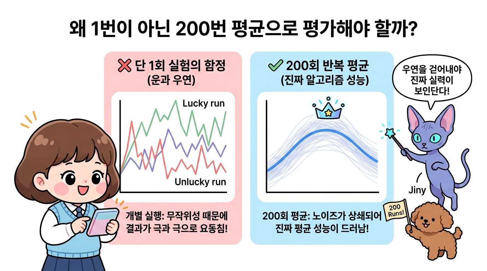

#### 왜 1회가 아닌 '200회 반복 평균'이 필수적일까요?

1. **단 1회 실험의 함정 (운과 우연의 개입)**:
   - 특정 한 번의 실행에서는 우연히 초반 10스텝 만에 최고 승률 머신을 뽑아 승률이 90% 이상으로 치솟는 **'운 좋은 판(Lucky run)'**이 나올 수 있습니다.
   - 반대로, 초반 200스텝 동안 꽝만 계속 나와 최고 머신을 늦게 발견하는 **'운 나쁜 판(Unlucky run)'**도 발생합니다.
   - 즉, 단 한 번의 실행 결과는 알고리즘의 진짜 실력이 아니라 **단순한 우연(Noise)**일 수 있습니다.

2. **다중 반복과 평균의 힘 (대수의 법칙)**:
   - 200회처럼 여러 번 독립된 환경에서 동일한 실험을 반복한 뒤 각 스텝별 승률을 평균내면, 개별 시행의 들쭉날쭉한 무작위 노이즈가 서로 상쇄됩니다.
   - 그 결과, 알고리즘이 가진 **'진정한 학습 속도와 평균 기대 승률'**이 매끄러운 곡선으로 투명하게 드러납니다.

> 🐱 **지니**: "도로시, 주사위를 1번 던져서 6이 나왔다고 '이 주사위는 항상 6만 나온다'고 단정할 수 없는 것과 같단다. 수백 번 굴려 평균을 내봐야 진짜 확률을 알 수 있지!"
>
> 👧 **도로시**: "맞아요! 우연한 행운이나 불운에 속지 않고 알고리즘의 진짜 실력을 증명하려면 200번 평균 실험이 꼭 필요하네요!"
>
> 🐶 **토토**: "멍멍! (공정한 평가를 위해 200번 실험을 준비해봐요!)"


---


### 3.4.6.3 다중 실행 시뮬레이션 구현 (200회 반복)

그래서 슬롯머신을 1000번 플레이하는 실험을 총 200번 반복하여 평균을 내보겠습니다.

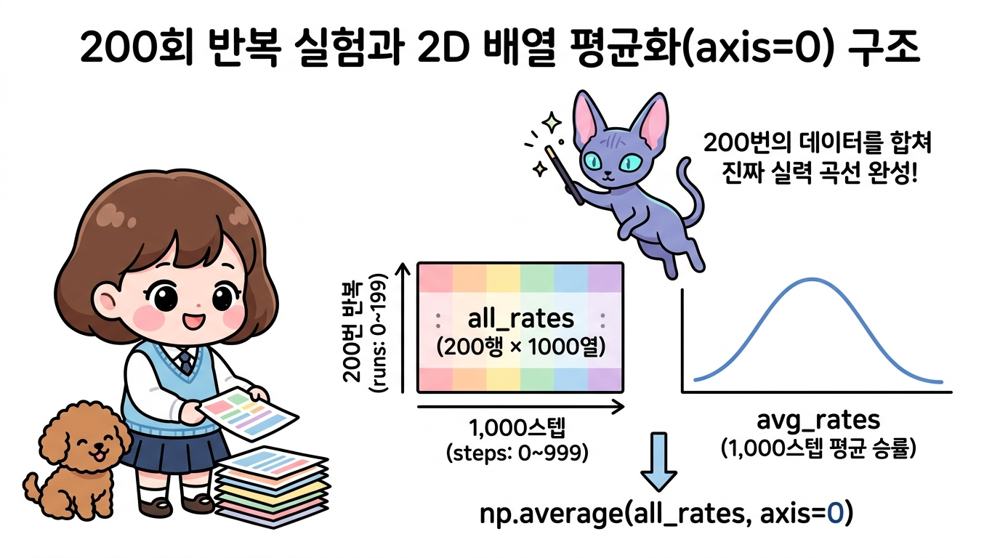

**소스 코드: [bandit_avg.py](./bandit_avg.py)**

```python
import platform
import numpy as np
import matplotlib.pyplot as plt
from bandit1 import Bandit
from agent import Agent

# 1. 한글 폰트 설정 (OS별 호환성 보장)
system_name = platform.system()
if system_name == 'Darwin':          # Mac OS
    plt.rc('font', family='AppleGothic')
elif system_name == 'Windows':       # Windows OS
    plt.rc('font', family='Malgun Gothic')
elif system_name == 'Linux':         # Linux OS
    plt.rc('font', family='NanumGothic')

plt.rcParams['axes.unicode_minus'] = False  # 마이너스 기호 깨짐 방지

# 2. 시뮬레이션 파라미터 설정
runs = 200      # 총 실험 반복 횟수 (200회)
steps = 1000    # 1회 실험당 플레이 횟수 (1,000단계)
epsilon = 0.1   # 탐색률 ε (10% 확률로 무작위 탐색)

# 3. 200번 실험의 1,000스텝 승률을 저장할 2차원 넘파이 배열 생성 (200행 × 1000열)
all_rates = np.zeros((runs, steps))

# 4. 200번 독립적인 시뮬레이션 반복 실행 (외부 루프)
for run in range(runs):
    bandit = Bandit()       # 매 실험마다 무작위 승률을 가진 새로운 슬롯머신 환경 생성
    agent = Agent(epsilon)  # 매 실험마다 초기 상태의 새로운 에이전트 생성
    total_reward = 0        # 1회 실험의 누적 보상
    rates = []              # 1회 실험의 단계별 승률 리스트

    # 1,000스텝 상호작용 루프 (내부 루프)
    for step in range(steps):
        action = agent.get_action()   # 1. 행동 선택 (ε-탐욕)
        reward = bandit.play(action)  # 2. 보상 획득
        agent.update(action, reward)  # 3. 가치 추정치(Qs) 증분 갱신
        total_reward += reward
        rates.append(total_reward / (step + 1))  # 현재 스텝까지의 승률 계산

    # 1회 실험의 1,000개 승률 데이터를 2차원 배열의 run번째 행에 저장
    all_rates[run] = rates

# 5. 200개 실험 결과의 열(axis=0) 방향 평균 계산 -> 1,000스텝의 평균 승률 1D 배열 생성
avg_rates = np.average(all_rates, axis=0)

# 6. 그래프 그리기: 단계별 승률(200번 실험 후 평균)
plt.figure(figsize=(7, 4.5))
plt.ylabel('Rates (승률)')
plt.xlabel('Steps (시행 횟수)')
plt.title('단계별 승률 (200번 실험 후 평균)')
plt.plot(avg_rates, color='#4A90E2', linewidth=2)
plt.grid(True, linestyle='--', alpha=0.5)
plt.tight_layout()
plt.show()
```

> 🐱 **지니**: "도로시, 200번의 독립된 실험을 돌려 (200, 1000) 크기의 거대한 데이터 시트를 만들고, `axis=0`으로 세로 평균을 구하면 개별 시행의 운과 불운이 완벽하게 지워진단다!"
>
> 👧 **도로시**: "와! 2중 for 루프 안에서 매번 새로운 `Bandit()`과 `Agent()`를 만들어서 200번 완전히 독립적으로 테스트하니까 정말 공정한 통계가 완성되네요!"
>
> 🐶 **토토**: "멍멍! (코드에 주석이 상세해서 2차원 배열과 axis=0 평균화 원리가 한눈에 이해돼요!)"


---


### 3.4.6.4 200회 평균 승률 그래프 분석

똑같은 실험을 200번 수행하고 all_rates에 각 실험의 결과를 저장했습니다. 

구체적으로 **1**에서 원소 1000개짜리 배열인 rates를 all_rates의 해당 위치에 저장합니다. 

그런 다음 **2**에서 axis=0으로 지정하면 단계별 평균을 계산합니다. 

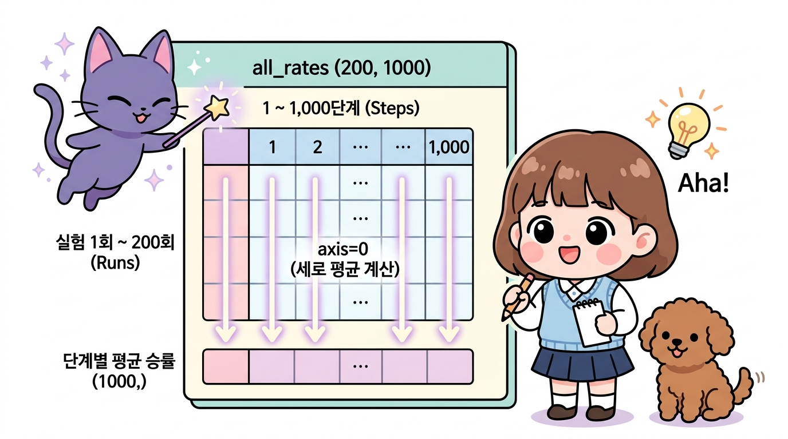


> 🐱 **지니**: "`all_rates`는 가로 1,000칸(단계별 승률), 세로 200줄(실험 횟수)을 가진 `(200, 1000)` 크기의 2차원 행렬이란다. 여기서 `np.average(all_rates, axis=0)`을 실행하면 세로 방향(열 기준)으로 200개의 데이터를 싹 더해 200으로 나누어, 1단계부터 1,000단계까지의 **'200회 평균 승률' 1차원 배열(1000,)**이 완성되는 거지!"
>
> 👧 **도로시**: "와! 세로 방향으로 200번의 독립적인 실험 데이터를 평균 내니까, 운이 좋아서 일찍 대박이 났거나 운이 나빠 헤맸던 개별 실험의 노이즈가 깔끔하게 사라지는군요!"


---


[그림 3-22]을 보면 계산 과정이 더 명확하게 이해될 것입니다.

**그림 3-22** 단계별 평균 구하기


> 
>

---


#### 📊 200회 평균 승률 곡선이 그리는 3대 학습 단계

앞의 코드를 실행하면 다음 그래프를 얻을 수 있습니다.

**그림 3-23** 단계별 승률(200번 실험 후 평균)


알고리즘을 평가할 때는 이처럼 평균을 이용해야 합니다. 

[그림 3-23]의 그래프를 보면 이번 알고리즘(ε-탐욕 정책)의 특징이 더 잘 드러납니다. 


승률이 처음에는 0.5 정도로 시작해서 단계를 거듭할수록 빠르게 높아지고 600단계 정도에 이르러 거의 최대를 찍습니다. 최종적으로 약 0.83을 기록했습니다.


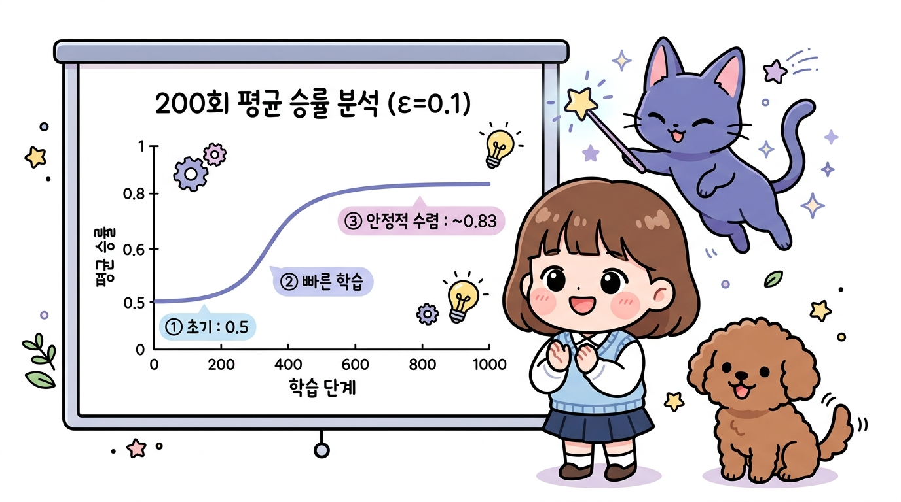

이 매끄러운 200회 평균 승률 곡선은 강화학습 에이전트의 성장 과정을 **3개의 핵심 구간**으로 선명하게 보여줍니다.


---


#### 🔍 구간별 상세 분석: 에이전트는 어떻게 똑똑해지는가?

| 학습 구간 | 단계 (Step) | 평균 승률 | 에이전트의 내부 행동 및 상태 변화 |
| :--- | :--- | :--- | :--- |
| **① 초기 탐색 단계** | 0 ~ 100단계 | **약 0.5 (50%)** | • 모든 슬롯머신의 가치 추정치 *Q*가 0으로 동일<br>• 10개 머신을 골고루 당겨보며 탐색<br>• 10개 머신의 실제 승률 평균(0.0~1.0의 균등분포 평균 = 0.5) 부근에서 출발 |
| **② 빠른 학습 단계** | 100 ~ 600단계 | **0.50 ➔ 0.83 급상승** | • 슬롯머신별 보상 경험이 쌓이며 *Q* 가치 추정치 정밀화<br>• 보상 확률이 가장 높은 **'1등 슬롯머신'**을 성공적으로 발견<br>• 90%(1 - *ε*)의 확률로 1등 머신을 집중적으로 당김(활용 극대화) |
| **③ 수렴 및 안정화 단계** | 600 ~ 1000단계 | **약 0.83 (83%) 수렴** | • 1등 머신 판별이 완료되어 승률 곡선이 안정적인 고원(Plateau) 형성<br>• *ε* = 0.1(10%) 탐색 정책으로 인해 약 0.83~0.84의 이론적 최적선에 완벽 수렴 |


---


#### 💡 왜 최종 승률은 1.0(100%)이나 1등 머신 승률이 아닌 약 0.83일까요?

> 👧 **도로시**: "지니님! 600단계 이후에는 에이전트가 1등 머신을 확실히 찾았을 텐데, 왜 승률이 1등 머신의 승률(~0.88)에 도달하지 않고 약 0.83에 멈추나요?"
>
> 🐱 **지니**: "아주 날카로운 질문이야 도로시! 그 이유는 바로 우리가 설정한 **탐색 확률 *ε* = 0.1 (10%)** 때문이란다!"

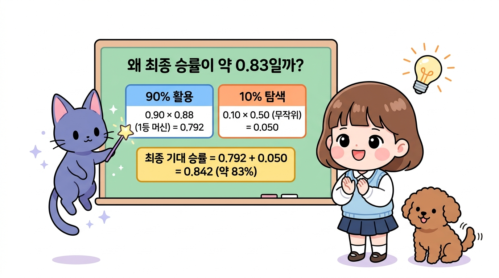

에이전트는 1등 머신을 알아낸 뒤에도 *ε*-탐욕 정책의 규칙에 따라 다음과 같이 행동합니다.

1. **90%의 확률 (1 - *ε* = 0.90)로 최선 행동(활용)**: 
   - 가치 *Q*가 가장 높은 1등 머신을 선택합니다. (1등 머신의 평균 승률은 약 **0.88**)
2. **10%의 확률 (*ε* = 0.10)로 무작위 행동(탐색)**: 
   - 승률이 0.1이든 0.8이든 상관없이 10개 머신 중 하나를 무작위로 고릅니다. (10개 머신의 전체 평균 승률은 약 **0.50**)


---


따라서 에이전트가 1등 머신을 100% 완벽히 찾아낸 상태에서의 **이론적 기대 승률**은 다음과 같이 계산됩니다.

$$
\text{최종 기대 승률} = (0.90 \times 0.88) + (0.10 \times 0.50) = 0.792 + 0.050 = 0.842 \approx 0.83
$$

이처럼 시뮬레이션 결과로 얻은 **0.83**이라는 숫자는 에이전트의 '학습 부족' 때문이 아니라, **탐색(*ε*=0.1)과 활용(1-*ε*=0.9)의 균형에 따른 정확한 수학적 수렴값**입니다.


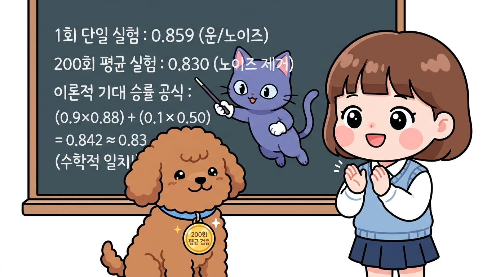

> 🐶 **토토**: "멍멍! (1회 실험에서는 운에 따라 0.859도 나오고 0.60도 나왔지만, 200번 평균을 내니 이론적 기대치인 0.83에 정확하게 수렴하는 게 정말 신기해요!)"


---


### 3.4.6.5 ε(탐색 확률) 변경에 따른 균형 제어와 성능 비교

참고로 이 결과는 ε-탐욕 정책에서 ε = 0.1로 설정한 결과입니다. 

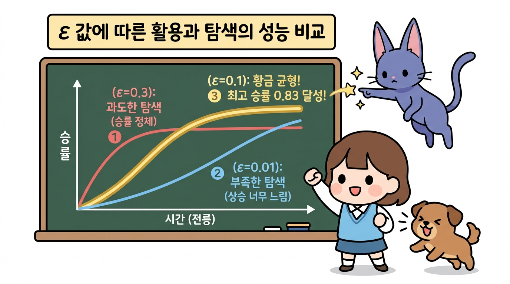

---


#### ε-탐욕 변경

ε값을 변경하면 결과도 달라집니다. 

실제로 값을 바꿔보죠. ε을 각각 0.01, 0.1, 0.3으로 설정해 실험해보니 결과가 다음과 같았습니다.


**그림 3-24** ε-탐욕 정책의 ε값을 바꾼 결과


그림 3-24와 같이 ε의 값에 따라 승률이 달라집니다. 


결과를 보면 ε = 0.3이면 승률은 빠르게 상승하지만 400단계를 넘어가면서 상승세가 급격히 꺾입니다. 

30%라는 높은 확률로 탐색을 시도하기 때문에 최적의 머신을 선택하는 '활용의 비율이 너무 낮기 때문'으로 짐작됩니다. 즉, 탐색을 너무 많이 했다고 볼 수 있습니다.


---


다음은 ε = 0.01인 경우를 보죠(1% 확률로 탐색). 보상은 꾸준히 상승하지만 상승 속도는 세 가지 중 가장 느립니다. 

탐색 비율이 너무 작아서 최적의 머신을 찾을 확률이 낮았기 때문으로 보입니다.


---


마지막으로 ε = 0.1입니다. 보다시피 결과가 가장 좋습니다. 즉, 탐색 비율을 10%로 할 때의 '활용과 탐색의 균형'이 세 가지 중 가장 좋았다고 할 수 있습니다.


---


| 탐색 확률 | 장점 및 특징 | 단점 및 한계 | 최종 평가 |
| :--- | :--- | :--- | :--- |
| **ε = 0.3 (30% 탐색)** | 초반에 다양한 머신을 빠르게 찔러보아 **초반 상승 속도가 가장 빠름**. | 최고의 머신을 찾은 후에도 **30%나 엉뚱한 머신을 탐색하느라 승률이 0.7 부근에서 조기 정체**됨. | **과도한 탐색 (낭비 발생)** |
| **ε = 0.01 (1% 탐색)** | 99% 확률로 최고 머신을 활용하므로 **안정적**. | 탐색 비율이 1%로 너무 작아 **진짜 최고 머신을 발견하는 속도가 세 가지 중 가장 느림**. | **부족한 탐색 (거북이 학습)** |
| **★ ε = 0.1 (10% 탐색)** | 적절한 호기심(10%)으로 최고 머신을 신속히 찾고, 90%의 안전한 활용으로 **최종 승률 0.83 이상 달성**. | 가장 우수한 성능의 황금 균형점 달성. | **최적의 황금 균형 (Best!)** |


---


#### ε 균형 조절

이처럼 ε의 값으로 '활용과 탐색의 균형'을 조절할 수 있습니다. 

물론 최적의 ε값은 문제에 따라 달라집니다. 

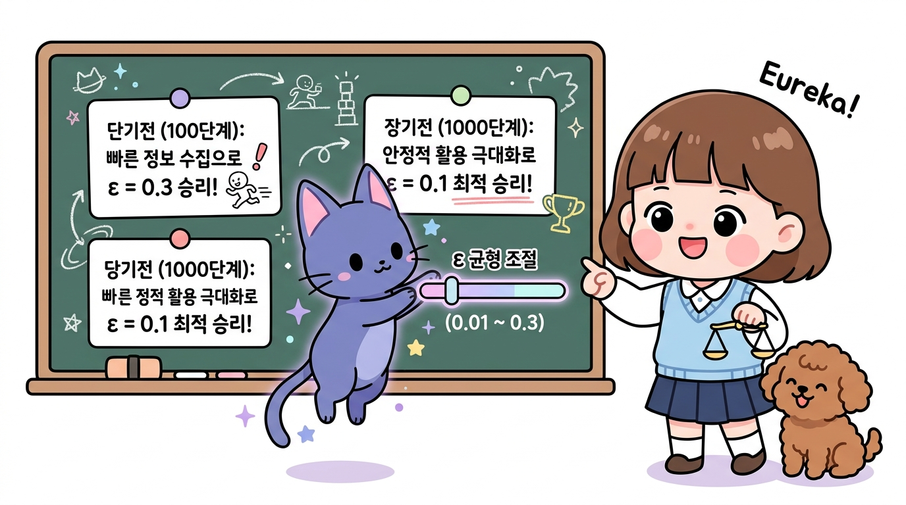

예를 들어 단계 수가 100일 때는 시도한 세 가지 ε 중 ε = 0.3일 때의 결과가 가장 좋았습니다. 

이번처럼 ε의 값을 다양하게 시도해보면 최적의 ε값을 찾을 수 있을 것입니다.


---


#### ⚖️ 문제 상황과 시행 횟수(Horizon)에 따른 최적의 ε 선택 기준

강화학습에서 *ε*과 같은 핵심 설정값을 **하이퍼파라미터(Hyperparameter)**라고 부르며, 이를 문제 환경에 맞게 최적화하는 과정을 **튜닝(Tuning)**이라고 합니다.

| 상황 구분 | 게임/시행 단계 수 (Steps) | 추천 탐색 확률 (*ε*) | 이유 및 핵심 전략 |
| :--- | :--- | :--- | :--- |
| **단기전** | **100단계 이하** (시간이 촉박함) | **ε = 0.3 ~ 0.5** (높은 탐색) | • 초반에 빠르게 여러 머신을 찔러보아 좋은 머신을 번개처럼 찾아내야 함<br>• 탐색에 주저하면 좋은 머신을 발견조차 못 하고 시간이 끝남 |
| **장기전** | **1,000단계 이상** (시간이 넉넉함) | **ε = 0.05 ~ 0.1** (적절한 탐색) | • 충분한 시간이 있으므로 차분히 최고 머신을 탐색<br>• 최고 머신을 찾은 후 90~95%의 긴 시간 동안 최고 머신만 집중 활용(Exploitation)하여 누적 점수를 극대화 |
| **실전 고급 전략** | **시간에 따른 점진적 변화** | **감쇠 ε-탐욕 (Decaying ε)** | • **초반**: *ε* = 0.5 (호기심 가득하게 탐색)<br>• **후반**: *ε* ➔ 0.01 (탐색을 점차 줄이고 1등 머신만 확정 활용) |

> 👧 **도로시**: "아하! 시험 시간이 10분밖에 없을 땐(단기전: 100단계) 빠르게 여러 문제를 훑어보는 *ε*=0.3이 유리하지만, 시험 시간이 1시간일 땐(장기전: 1000단계) 차분히 좋은 문제를 집중 공략하는 *ε*=0.1이 최고 점수를 내는 거군요!"
>
> 🐱 **지니**: "정확해 도로시! 강화학습에서는 '무조건 하나의 만능 정답 *ε*'이 존재하는 것이 아니라, **환경의 복잡도와 주어진 기회(단계 수)에 맞춰 최적의 균형점 *ε*을 찾는 실험적 탐색**이 핵심이란다!"
>
> 🐶 **토토**: "멍멍! (상황에 맞춰 마법 가방의 균형을 조절하는 법을 배웠어요!)"


지금까지 ε-탐욕 정책을 구현해보았습니다.


---


## 3.4.7 정리 및 요약

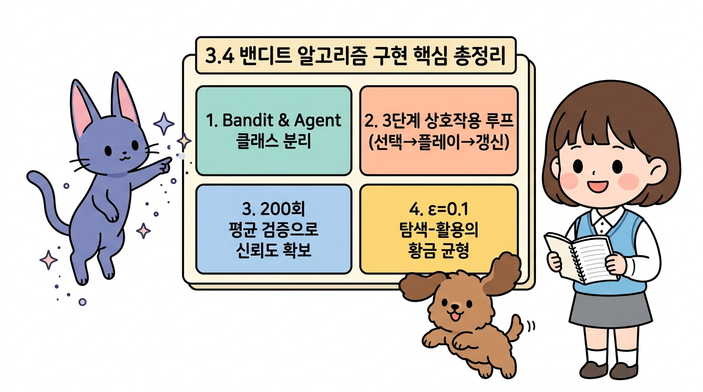

> 👧 **도로시**: "지니야! 오늘 슬롯머신 환경과 에이전트를 내 손으로 직접 구현하고, 200회 평균 실험까지 해보니까 강화 학습의 흐름이 정말 선명해졌어!"
>
> 🐱 **지니**: "훌륭해, 도로시! 이론을 코드로 옮기고, 객관적인 몬테카를로 평균 검증으로 알고리즘의 특성을 파악하는 것이야말로 진정한 강화 학습 엔지니어의 핵심 역량이란다!"
>
> 🐶 **토토**: "멍멍! 와프! (도로시와 지니 주위를 신나게 빙글빙글 돌아요!)"

이번 절에서는 앞서 배운 밴디트 알고리즘 이론을 바탕으로 객체 지향적인 파이썬 코드 구현과 성능 평가를 진행했습니다. 


요약은 다음과 같습니다.


1. **객체 지향 모델링**: 10대의 슬롯머신(환경)을 `Bandit` 클래스로, 에이전트(플레이어)의 ε-탐욕 정책을 `Agent` 클래스로 코딩하여 강화학습의 문제 영역과 행동 주체를 명확히 객체로 분리하여 구현했습니다.
2. **에이전트-환경 상호작용 루프**: 행동 선택(`get_action()`) → 실제로 레버를 당겨 보상 획득(`play()`) → 보상을 바탕으로 한 가치 추정치 업데이트(`update()`) 순서로 순환하는 강화학습 상호작용 과정을 구현했습니다.
3. **평균 검증의 필요성**: 무작위성(무작위 슬롯머신 설정, ε 확률에 따른 무작위 행동) 때문에 단 1회의 실험 결과는 신뢰하기 어렵습니다. 알고리즘의 우수성을 공정하게 평가하기 위해 **200회 반복 실험 후의 평균 승률 추이**를 활용하는 평가 표준을 확립했습니다.
4. **활용과 탐색의 균형 조율**: 하이퍼파라미터인 탐색 확률 ε의 값에 따라 학습 곡선이 크게 달라집니다.
   - **ε = 0.3**: 빠른 초반 탐색으로 정보를 얻지만, 활용의 비율이 낮아 최종 승률이 수렴 한계에 봉착합니다 (과도한 탐색).
   - **ε = 0.01**: 학습 진행 속도가 너무 더디어 최적의 행동을 찾는 데 시간이 너무 오래 걸립니다 (부족한 탐색).
   - **ε = 0.1**: 세 조건 중 활용과 탐색의 최상의 균형점을 달성하여 가장 우수한 누적 성과를 거두었습니다.
