# 3.5 비정상 문제

시간이 흘러도 슬롯머신의 당첨 확률이 변하지 않는 기존의 **정상(Stationary)** 문제와 달리, 현실의 기계들은 시시각각 당첨 확률이 출렁이며 변합니다. 

이를 **비정상(Non-stationary)** 환경 문제라고 부르죠. 


지니가 지적하는 요동치는 확률 곡선 분포 그림 비유를 통해, 시시각각 급변하는 환경에서 에이전트가 어떻게 살아남아 보상을 최대화할 수 있는지 3.5장에서 깊이 있게 학습해봅시다!


---


### ⚖️ 정상 문제 vs 비정상 문제 비교

정상 문제와 비정상 문제의 차이를 직관적으로 비교한 그림입니다. 


> 🐱 **지니**: "도로시, 어제까지 1등이었던 슬롯머신이 오늘은 꼴등으로 바뀌고, 꼴등이었던 머신이 갑자기 대박 머신으로 바뀐다면 에이전트는 어떻게 대처해야 할까?"
>
> 👧 **도로시**: "와! 예전의 오래된 기억만 믿고 있으면 안 되겠네요! 최근에 얻은 새로운 보상을 더 민감하게 관찰하고 판단해야겠어요!"
>
> 🐶 **토토**: "멍멍! (어제 사과가 열렸던 나무만 고집하면 굶을 수도 있다는 뜻이에요!)"


| 비교 항목 | 정상(Stationary) 환경 | 비정상(Non-stationary) 환경 |
| :--- | :--- | :--- |
| **보상 확률 분포** | 시간이 지나도 **영구적으로 고정**됨 | 시간에 따라 **시시각각 동적으로 출렁이며 변화**함 |
| **최적의 행동** | 한 번 찾은 1등 슬롯머신이 영원히 1등 | 1등 슬롯머신이 수시로 바뀌므로 지속적인 적응 필요 |
| **데이터 중요도** | 과거 데이터와 최신 데이터가 **동등하게 중요** | 과거 데이터는 잊고 **최신 데이터에 더 큰 가중치** 부여 |
| **대표 알고리즘** | 단순 표본 평균(Sample Average: 1/*n*) | 고정 학습률 기반 지수 이동 평균(EMA: *α*) |


---


## 3.5.1 정상 문제와 비정상 문제의 정의

지금까지 다룬 밴디트 문제는 분류상 **정상 문제**<sup>stationary problem</sup>에 속합니다.

> **정상 문제**란 보상의 확률 분포가 변하지 않는 문제입니다. 

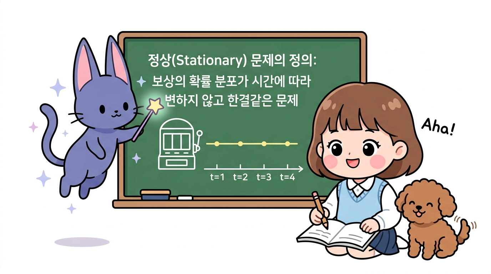

> 🐱 **지니**: "정상(Stationary, 靜常)이라는 단어는 '고요할 정(靜)'에 '항상 상(常)'을 써서 **시간이 흘러도 상태가 고요하게 항상 일정하다**는 뜻이야. 즉, 1번째 판이든 10,000번째 판이든 각 슬롯머신의 당첨 확률 분포는 절대로 변하지 않고 한결같이 유지된단다."
>
> 👧 **도로시**: "아하! 슬롯머신 1번의 승률이 0.8이라면, 어제 당겨도 0.8, 오늘 당겨도 0.8, 1년 뒤에 당겨도 0.8이라는 뜻이군요! 그래서 과거의 플레이 기록이 쌓일수록 기계의 진짜 가치를 완벽하게 알아낼 수 있었던 거네요!"
>
> 🐶 **토토**: "멍멍! (동전 던지기에서 앞면이 나올 확률이 100번을 던지든 1,000번을 던지든 항상 50%로 똑같은 것과 같아요!)"

#### 📌 정상(Stationary) 문제의 핵심 특징 3가지

1. **시간 불변성 (Time-Invariant)**
   - 시간 *t* 가 흐르거나 에이전트가 어떤 행동을 취하더라도 보상 확률 *P*(*R<sub>t</sub>* = *r* | *A<sub>t</sub>* = *a*) 는 영구히 고정됩니다.
2. **모든 과거 데이터의 동등한 가치**
   - 1,000스텝 전에 얻은 보상과 방금 1스텝 전에 얻은 보상의 가치가 완전히 동일하며, 오래된 데이터라고 해서 버릴 이유가 전혀 없습니다.
3. **큰 수의 법칙에 따른 완벽한 수렴**
   - 시도를 거듭하여 표본 수 *n* 이 무한히 커질수록, 표본 평균은 실제 보상 확률(참값)에 100% 수렴하게 됩니다.


---


### 3.5.1.1 정상 문제(Stationary Problem)의 개념과 구현

밴디트 문제 맥락에서 말해보면 슬롯머신에 설정된 승률(슬롯머신의 가치)은 줄곧 **고정**된 채였습니다. 

슬롯머신의 속성은 한번 설정되면 에이전트가 플레이하는 동안 **절대 변하지 않습니다.** 


앞 절까지 설명한 밴디트 문제가 정상 문제라는 사실은 Bandit 클래스의 다음 코드를 보면 알 수 있습니다.

```python
class Bandit:
    def __init__(self, arms=10):
        # 1. 인스턴스 생성 시 10개 머신의 승률을 딱 한 번 무작위로 생성하여 고정
        self.rates = np.random.rand(arms)

    def play(self, arm):
        # 2. 고정된 승률을 '읽기만' 할 뿐, self.rates 값을 절대 수정하지 않음
        rate = self.rates[arm]
        if rate > np.random.rand():
            return 1
        else:
            return 0
```

이와 같이 `self.rates`는 객체 생성 시 초기화된 후 절대 변경되지 않습니다. 

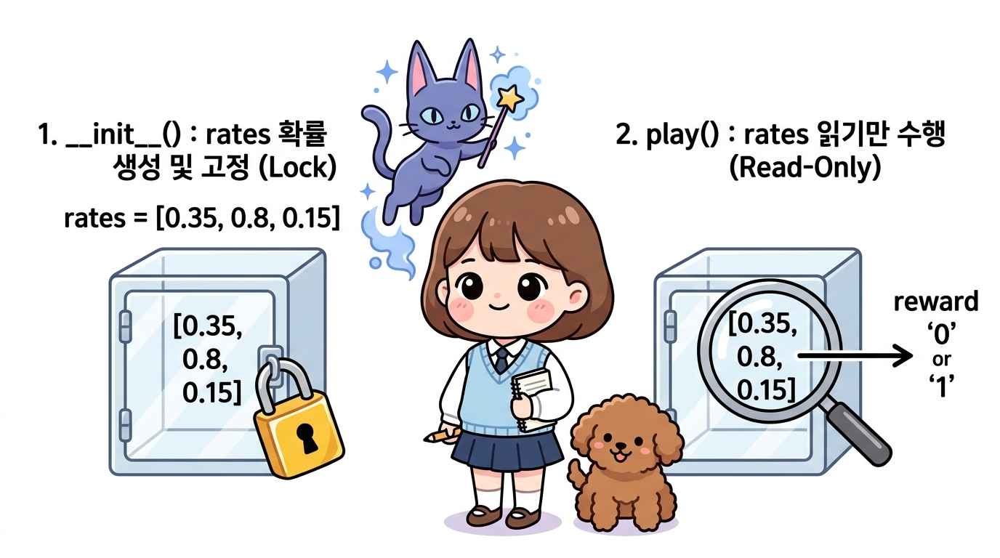

> 🐱 **지니**: "이 코드가 왜 '정상 문제'를 만드는지 파이썬 객체 지향 관점에서 두 가지 결정적인 이유를 정리해볼까?
> 1. **객체 생성 시 `__init__()` 매직 메서드 1회 실행**: `bandit = Bandit(10)`으로 객체를 생성할 때, 파이썬의 매직 메서드인 `__init__()`이 **단 한 번만 실행**되어 `self.rates`에 10개 머신의 당첨 확률(`rates`)을 생성하고 자물쇠로 굳게 잠그듯 메모리에 고정(Lock)해 둔단다.
> 2. **`play()` 메서드의 읽기 전용(Read-Only) 동작**: 에이전트가 1,000번, 10,000번 `play(arm)`을 호출하더라도, `rate = self.rates[arm]` 문장은 고정된 승률 배열을 **오직 읽기(Read-Only)만** 할 뿐 `self.rates` 값을 수정하지 않는단다!"
>
> 👧 **도로시**: "아하! 객체를 생성할 때 매직 메서드 `__init__`으로 딱 한 번만 확률 `rates`가 정해져서 영구히 고정되고, 게임을 진행하는 `play()`에서는 그 고정된 `rates`를 돋보기로 읽기만 하니까 슬롯머신의 확률이 절대 변하지 않는 '정상 문제'가 되는 거군요!"
>
> 🐶 **토토**: "멍멍! (보관함에 보관된 뼈다귀의 개수를 확인만 하고 아무도 손대지 않는 것과 같아요!)"


---


이 설정으로 Bandit 클래스를 정상 문제로 만들었습니다.

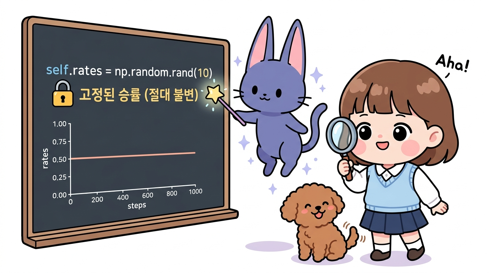

> **정상(stationary; 定常)**은 '일정하여 늘 한결같다'라는 뜻입니다.


---


#### 🔍 이전 절의 코드들이 '정상(Stationary) 문제'였던 3가지 핵심 이유

1. **승률 배열 `self.rates`의 영구 불변성**:
   - `__init__()`에서 생성된 10개의 확률값은 1,000단계를 돌든 200번의 반복 실험을 돌든 프로그램이 끝날 때까지 **단 한 번도 변경되지 않고 자물쇠로 잠겨 있듯 고정**되어 있었습니다.
2. **`play()` 메서드의 읽기 전용(Read-only) 특성**:
   - 에이전트가 레버를 당겨 `play(arm)`을 수천 번 호출해도, 승률을 조회만 할 뿐 승률 자체를 바꾸는 코드가 일절 없었습니다.
3. **표본 평균(1/*n*) 갱신 공식과의 완벽한 궁합**:
   - 슬롯머신의 실제 승률이 영구 불변하기 때문에, 과거의 모든 보상을 공평하게 1/*n*로 누적하여 평균 내는 표본 평균 방식이 **대수의 법칙에 따라 진짜 참값(승률)으로 완벽하게 수렴**할 수 있었습니다.

> 👧 **도로시**: "아하! 우리가 3.4절에서 만들었던 `Bandit` 클래스는 `self.rates`를 생성자에서 딱 한 번 만들고 자물쇠로 굳게 잠가두었기 때문에 '정상 문제'였던 거군요!"
>
> 🐱 **지니**: "정답이야 도로시! 환경이 변하지 않고 늘 한결같다면, 과거의 모든 데이터를 소중히 모아 1/*n*로 평균 내는 것이 가장 지혜로운 전략이란다!"
>
> 🐶 **토토**: "멍멍! (숨겨진 보물 상자의 위치가 절대 바뀌지 않는 평화로운 보물섬이었어요!)"


---


### 3.5.1.2 비정상 문제(Non-stationary Problem)의 개념과 구현

그렇다면 `self.rates`가 플레이할 때마다 달라지면 어떻게 될까요? 


다음 코드를 살펴봅시다.

**소스 코드: [non_stationary.py](./non_stationary.py)**

```python
class NonStatBandit:
    def __init__(self, arms=10):
        self.arms = arms
        self.rates = np.random.rand(arms)

    def play(self, arm):
        rate = self.rates[arm]
        # 핵심 변경점: 레버를 당길 때마다 10개 머신 전체 승률에 작은 무작위 노이즈 추가
        self.rates += 0.1 * np.random.randn(self.arms)
        if rate > np.random.rand():
            return 1
        else:
            return 0
```

NonStatBandit 클래스는 Bandit 클래스에 코드를 한 줄 추가하여 플레이할 때마다 `self.rates`에 작은 **노이즈를 추가**하도록 했습니다. 

> 💡 참고로 `np.random.randn()`은 평균 0, 표준편차 1의 정규분포에서 무작위 수를 생성합니다. 여기에 `0.1`을 곱해 매 스텝마다 슬롯머신의 승률이 조금씩 출렁이도록 만듭니다.


---


#### 1️⃣ 코드 동작 메커니즘: 매 스텝 승률에 노이즈가 더해지는 원리

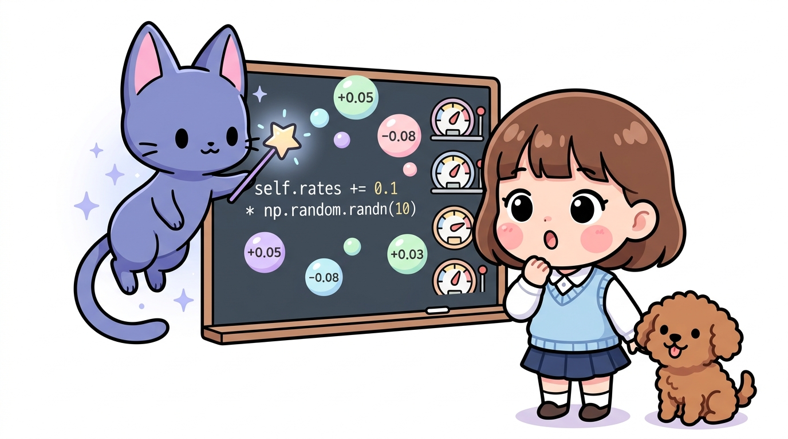

`NonStatBandit`의 핵심은 `play()` 메서드 안에서 실행되는 `self.rates += 0.1 * np.random.randn(self.arms)` 단 한 줄에 있습니다.

1. **전체 슬롯머신의 동시 변동**:
   - 에이전트가 특정 슬롯머신(예: 3번 머신)을 하나만 선택해 당기더라도, **10대 슬롯머신 전체(`self.arms`)의 승률 배열에 각각 독립적인 미세 난수(노이즈)**가 더해집니다.
2. **랜덤 워크(Random Walk) 현상**:
   - 어떤 머신은 승률이 `+0.05` 오르고, 어떤 머신은 `-0.08` 떨어지는 등 매 스텝마다 승률이 주가나 날씨처럼 끊임없이 출렁이며 이동합니다.

> 👧 **도로시**: "와! `self.rates`에 `+=` 연산자로 정규분포 난수를 계속 더해주니까, 슬롯머신의 승률 게이지 바늘이 살아 움직이는 생물처럼 시시각각 위아래로 흔들리네요!"
>
> 🐱 **지니**: "맞아 도로시! 바로 이 한 줄의 코드가 정적인 슬롯머신을 '살아 숨 쉬며 급변하는 현실 세계의 환경'으로 탈바꿈시키는 마법의 열쇠란다!"


---


#### 2️⃣ 비정상 환경의 핵심 위기: 1등 머신의 실시간 역전 현상

이 코드의 효과로 플레이할 때마다 슬롯머신의 **가치(승률)가 달라집니다.** 

이처럼 **보상의 확률 분포가 변하도록** 설정된 문제를 **비정상 문제**<sup>non-stationary problem</sup>라고 합니다. 


비정상 문제 환경에서는 다음과 같은 **치명적인 변화**가 발생합니다.

* **1등 머신의 잦은 교체 (Rank Shifting)**:
  - 100번째 스텝에서는 머신 A가 승률 85%로 1등이었지만, 500번째 스텝에서는 승률이 떨어져 꼴등이 되고 머신 B가 승률 90%로 대역전 1등이 될 수 있습니다.
* **표본 평균 에이전트의 치명적 함정**:
  - 만약 에이전트가 3.4절에서 배운 단순 표본 평균(1/*n*) 방식만 고집한다면, 과거 머신 A가 대박을 냈던 오랜 기억(높은 *Q*값)에 눈이 멀어 **이미 꼴등으로 추락한 머신 A의 레버만 바보처럼 계속 당기게 됩니다.**
* **새로운 적응 전략의 필요성**:
  - 따라서 비정상 세상에서는 "오래된 옛날 기억은 과감히 잊어버리고, **가장 최근에 획득한 따끈따끈한 보상에 더 높은 가중치를 두는 새로운 가치 갱신 전략**"이 반드시 필요합니다!

> 🐶 **토토**: "멍멍! (어제 1등이었던 가게만 고집하다간 오늘 맛없는 음식을 먹게 돼요! 최신 맛집 트렌드를 재빠르게 반영해야 해요!)"


이와 같은 비정상 문제는 어떻게 풀어야 하는지 이제부터 알아보겠습니다.


---


## 3.5.2 비정상 문제 해결을 위한 이론적 접근

먼저 복습부터 하겠습니다. 

앞 절에서는 슬롯머신의 **가치를 추정**하기 위해 **표본 평균**을 계산했습니다. 

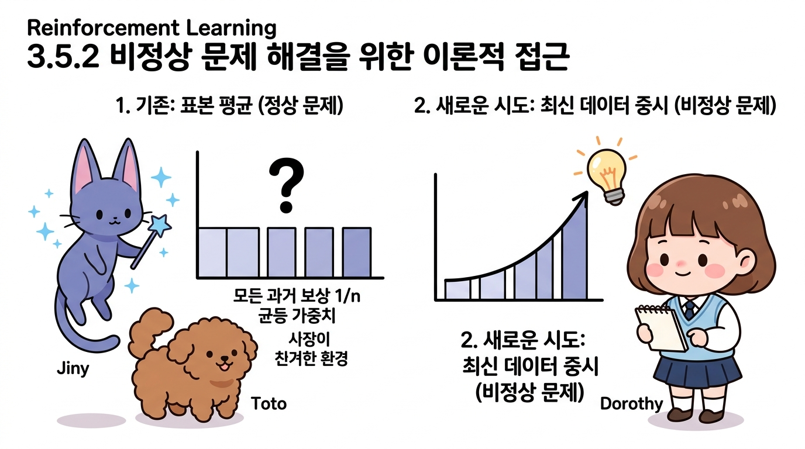

> 🐱 **지니**: "도로시, 승률이 영구히 고정되어 있던 '정상 문제'에서는 과거의 모든 경험을 똑같이 1/*n* 로 공평하게 모으는 **표본 평균**이 최고의 무기였어. 하지만 승률이 시시각각 출렁이는 '비정상 문제'에서는 어떻게 해야 할까?"
>
> 👧 **도로시**: "환경이 계속 변하고 있으니 과거의 낡은 보상에 얽매이지 않고, **최근에 얻은 새로운 보상에 더 큰 힘(가중치)을 실어주는 완전히 새로운 시도**가 필요해요!"
>
> 🐶 **토토**: "멍멍! (어제 찾았던 보물 지도보다 방금 맡은 신선한 냄새를 따라가야 보상을 얻을 수 있어요!)"


#### 💡 왜 비정상 문제에서는 새로운 접근 방식이 필요할까요?
* **정상 문제 (표본 평균 방식)**: 참값(승률)이 변하지 않으므로, 과거 데이터와 최신 데이터를 1/*n* 로 똑같이 취급하여 평균을 낼수록 진짜 가치에 완벽히 수렴합니다.
* **비정상 문제 (새로운 가중치 전략 필요)**: 참값(승률)이 계속 요동치므로, 먼 과거의 낡은 데이터는 점차 잊고 **가장 최근에 얻은 보상에 높은 가중치를 주는 지수적 갱신 방식**이 필수적입니다.


---


### 3.5.2.1 표본 평균 방식의 한계와 고정 가중치

실제 얻은 보상을 *R*<sub>1</sub>, *R*<sub>2</sub>, ..., *R*<sub>*n*</sub>이라 하면 표본 평균은 다음 식으로 표현됩니다.

$$
\begin{aligned}
Q_n &= \frac{R_1 + R_2 + \dots + R_n}{n} \\
&= \frac{1}{n} R_1 + \frac{1}{n} R_2 + \dots + \frac{1}{n} R_n
\end{aligned}
$$

이 식에서처럼 표본 평균은 획득한 보상의 `평균`으로 구할 수 있습니다. 

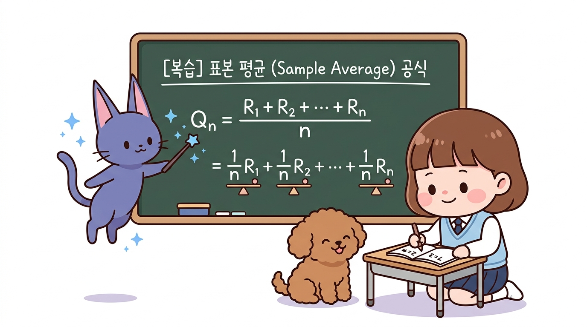

> 🐱 **지니**: "우리가 3.2절부터 3.4절까지 줄곧 사용해 온 **표본 평균(Sample Average)** 공식을 다시 한 번 복습해볼까? 에이전트가 슬롯머신을 당겨 얻은 모든 보상들을 총합한 뒤, 플레이한 횟수 *n* 으로 나누는 가장 기초적이고 직관적인 가치 추정 방식이란다."
>
> 👧 **도로시**: "아하! 식을 오른쪽처럼 곱셈 형태로 풀어서 보면, 첫 번째 보상 *R*<sub>1</sub>부터 마지막 *R*<sub>*n*</sub>까지 **모든 보상 앞에 똑같이 1/*n* 이라는 가중치**가 곱해져 있네요! 즉, 5번 플레이했다면 모든 과거 보상이 공평하게 1/5(20%)씩 지분을 나누어 갖는 셈이에요!"
>
> 🐶 **토토**: "멍멍! (과거의 모든 뼈다귀 조각이 저울 위에서 똑같은 무게 1/*n* 로 균형을 이루고 있어요!)"


---


#### 📊 1. 모든 과거 보상에 부여되는 '1/n 균등 가중치'

여기서 주목할 점은 모든 보상 앞에 1/*n*이 붙어 있다는 것입니다. 

이 1/*n*을 각 보상에 대한 '가중치'로 볼 수 있습니다. 

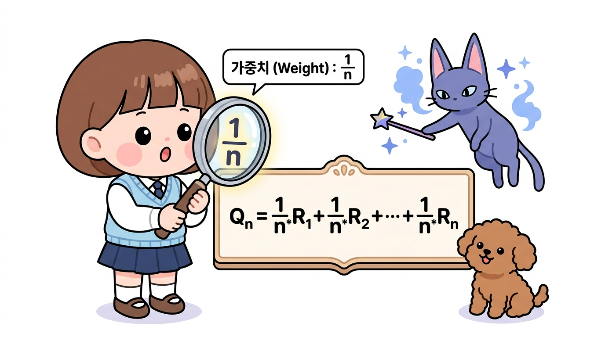

> 👧 **도로시**: "(돋보기로 수식을 유심히 들여다보며) 지니님! 수식을 자세히 보니 정말로 *R*<sub>1</sub>부터 *R*<sub>*n*</sub>까지 모든 보상 앞에 똑같이 1/*n* 이라는 분수가 찰싹 달라붙어 있어요! 이 1/*n* 이 바로 각 보상의 중요도를 결정하는 **가중치(Weight)**라는 거군요!"
>
> 🐱 **지니**: "맞아 도로시! 가중치란 **해당 데이터가 전체 계산 결과에 얼마만큼의 비중(영향력)을 미치는가**를 뜻한단다. 모든 보상 앞에 똑같은 1/*n* 이 붙어 있다는 것은, 가장 처음 얻은 보상이든 방금 얻은 최신 보상이든 **차별 없이 완전히 동등한 자격**으로 평가받고 있다는 증거야!"
>
> 🐶 **토토**: "멍멍! (모든 뼈다귀 조각 앞에 똑같은 크기의 이름표 1/*n* 이 붙어 있는 것과 같아요!)"


---


여기서 "플레이 횟수 *n*이 늘어날수록 1/*n*의 크기는 1/2 → 1/3 → 1/4 → ... 형태로 점점 줄어들지 않나?"라는 의문이 생길 수 있습니다. 

실제로 플레이 횟수가 늘어남에 따라 개별 보상에 할당되는 가중치 1/*n*의 크기는 줄어듭니다. 

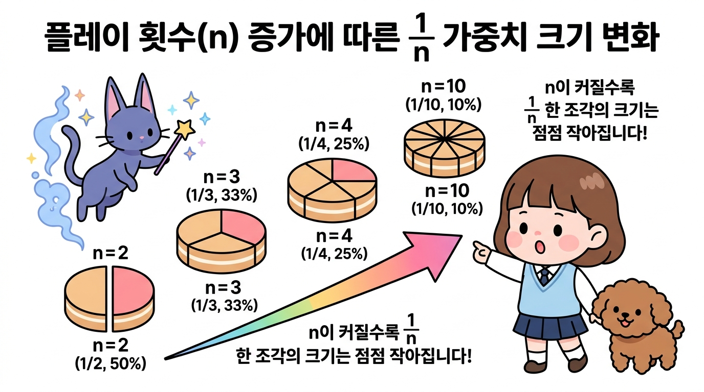

> 👧 **도로시**: "케이크 1판(총 가중치 100%)을 나누어 먹는 사람 수(*n*)가 늘어나는 것과 똑같네요!
> * *n* = 2일 때: 1조각 = **1/2 (50%)**
> * *n* = 3일 때: 1조각 = **1/3 (약 33.3%)**
> * *n* = 4일 때: 1조각 = **1/4 (25%)**
> * *n* = 10일 때: 1조각 = **1/10 (10%)**
> * *n* = 1,000일 때: 1조각 = **1/1000 (0.1%)**
> 
> 플레이 횟수 *n* 이 쌓일수록 각 보상 하나하나가 전체 평균에 미치는 영향력(1/*n*)은 점점 더 작고 얇아져요!"
>
> 🐱 **지니**: "정답이야 도로시! 게임을 1,000번 플레이했다면 방금 얻은 최신 보상조차 전체 평균에 고작 0.1%의 힘밖에 실어주지 못하게 된단다."
>
> 🐶 **토토**: "멍멍! (나눠 먹을 친구가 많아질수록 뼈다귀 한 조각의 크기가 작아지는 원리에요!)"


---


하지만 어느 한 `시점` *n*을 기준으로 보면, 과거에 받았던 모든 보상들(*R*<sub>1</sub>, *R*<sub>2</sub>, ..., *R*<sub>*n*</sub>)이 가지는 가중치는 모두 1/*n*로 균등합니다. 

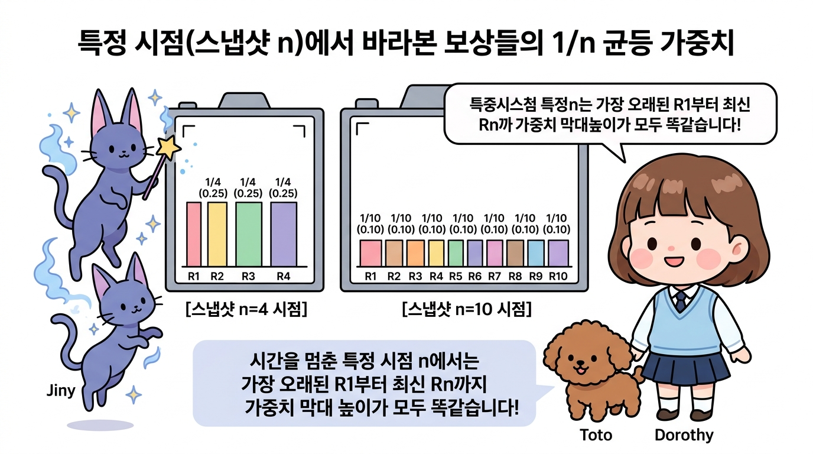

> 🐱 **지니**: "도로시, '시간의 흐름'과 '특정 시점의 정지 화면(스냅샷)'을 구분해서 생각하면 아주 명쾌해진단다!
> 1. **시간이 흐르는 동안 (동적 관점)**: 플레이 횟수 *n* 이 늘어날수록 개별 가중치(1/*n*)의 크기는 0.5 → 0.33 → 0.25 → 0.1 처럼 점점 줄어들어.
> 2. **특정 시점 *n* 에서 멈췄을 때 (스냅샷 관점)**: 게임을 4번째(*n*=4) 플레이한 그 순간에 서서 계산식을 보면, 1번째 보상(*R*<sub>1</sub>)부터 4번째 보상(*R*<sub>4</sub>)까지 4개의 보상 모두가 **정확히 똑같이 1/4(0.25, 25%)의 막대 높이**를 가지게 되지!"
>
> 👧 **도로시**: "아하! 동영상을 일시 정지(Pause)하고 그 시점의 계산식을 살펴보는 거군요! *n*=10 시점에서는 10개 보상 모두가 1/10(0.1)로 똑같고, *n*=1,000 시점에서는 1,000개 보상 모두가 1/1000(0.001)로 완전히 똑같은 높이의 평평한 수평선을 이루네요!"
>
> 🐶 **토토**: "멍멍! (어느 순간 사진을 찰칵 찍어봐도, 그 사진 속 모든 뼈다귀들은 똑같은 크기로 나눠져 있어요!)"


---


그림으로는 [그림 3-25]처럼 나타낼 수 있습니다.

**그림 3-25** 각 보상에 대한 가중치(표본 평균의 경우)


[그림 3-25]는 특정 시점 *n*(예를 들어 *n*=2)을 기준으로 가중치를 나타낸 하나의 예시입니다. 


---


그래프 세로축의 0.5는 단지 이해를 돕기 위해 임의의 작은 *n* 값을 설정한 예시값일 뿐입니다. 

중요한 사실은 그림과 같이 시점 *n*이 `고정`되어 있을 때 모든 보상에 똑같은 가중치가 부여된다는 점입니다. 

새로 얻은 보상이든 오래전에 얻은 보상이든 모두 동등하게 취급한다는 뜻입니다. 만약 *n*=10이 되면 모든 막대의 높이가 일제히 0.1로 낮아지지만, 여전히 모든 막대의 높이는 서로 동일합니다.


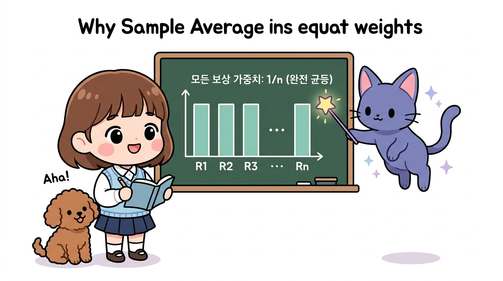

> 👧 **도로시**: "결국 표본 평균은 특정 시점 *n* 에서 가장 오래된 옛날 기억(*R*<sub>1</sub>)이나 방금 얻은 최신 기억(*R*<sub>*n*</sub>)이나 아무런 차별 없이 **완벽하게 똑같은 1/*n* 의 비중**으로 대우한다는 뜻이군요!"


---


#### ⚠️ 2. 비정상 환경에서 1/n 방식의 치명적 한계: '과거의 족쇄와 둔감화'

그런데 이 가중치는 **비정상 문제**에는 적합하지 않습니다. 


비정상 문제에서는 시간이 흐르면 환경(슬롯머신)이 변하기 때문에 **과거 데이터(보상)의 중요도**는 점점 낮아져야 합니다. 

반대로 새로 얻은 보상의 가중치는 점점 커져야 하겠죠.

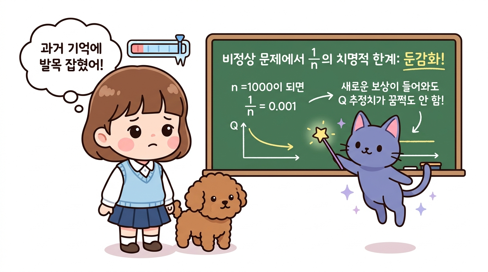

---


표본 평균을 효율적으로 구해야 하는 이유는 앞에서 설명했습니다. 


다음의 갱신식을 활용하면 **표본 평균**을 **효율적**으로 구할 수 있습니다.

$$
Q_n = Q_{n-1} + \frac{1}{n}(R_n - Q_{n-1})
$$

[식 3.5]

[식 3.5]와 같이 행동 가치 추정치 *Q*<sub>*n*</sub>을 증분 방식(순차적)으로 갱신할 수 있습니다.


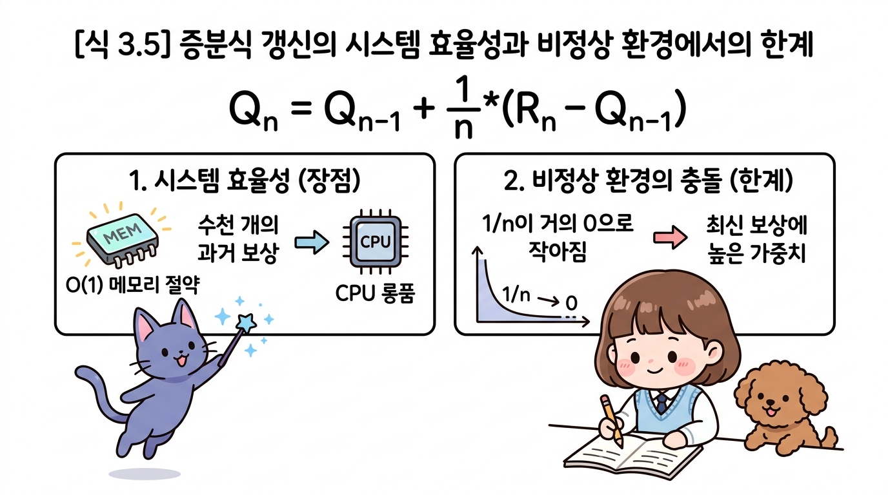


---


#### ⚙️ 1. [식 3.5]가 제공했던 뛰어난 시스템 효율성 (정상 문제에서의 성공)

* **과거 데이터 무저장 (*O*(1) 메모리 절약)**:
  - 3.3절에서 유도했던 증분 공식은 과거 수천, 수만 번의 보상 데이터(*R*<sub>1</sub>, *R*<sub>2</sub>, ...)를 일일이 배열에 누적 보관할 필요가 없습니다.
  - 오직 직전 가치 추정치 *Q*<sub>*n*-1</sub> 하나와 현재 보상 *R*<sub>*n*</sub>만 메모리에 유지하면 되므로, **시스템의 메모리 부하를 *O*(1)로 획기적으로 절감**합니다.
* **CPU 연산 부하 최소화**:
  - 매 스텝마다 모든 과거 데이터를 처음부터 전수 합산하여 나누는 비효율 없이, 오차 (*R*<sub>*n*</sub> - *Q*<sub>*n*-1</sub>)에 1/*n*을 곱해 더하는 가벼운 사칙연산만으로 **표본 평균을 즉각적이고 효과적으로 계산**할 수 있었습니다.


#### ⚠️ 2. 비정상 문제에서 발생하는 치명적 모순: '가중치 차등 부여 불가'
* **표본 평균(1/*n* 균등 가중치) 태생의 한계**:
  - [식 3.5]의 목적은 어디까지나 "모든 과거 보상을 똑같이 1/*n* 로 나누어 갖는 표본 평균"을 빠르고 가볍게 계산하는 것입니다.
* **최신 보상 가중치 부여 실패**:
  - 비정상 환경에서는 **오래된 보상은 잊고 최근에 얻은 새로운 보상에 더 큰 가중치**를 부여해야 합니다.
  - 하지만 [식 3.5]는 플레이 횟수 *n* 이 1,000번, 10,000번으로 커질수록 최신 보상의 반영 비율인 **1/*n* 이 0으로 소멸(1/*n* ➔ 0)**해버려 최신 보상의 변화를 전혀 받아들이지 못하고 마비(동결)됩니다.

> 👧 **도로시**: "아하! 3.3절에서 배운 [식 3.5]는 과거 데이터를 일일이 저장하지 않아 시스템 부하를 크게 줄여주는 훌륭한 계산식이었지만, 그 본질이 '모든 보상을 똑같이 1/*n* 로 취급하는 표본 평균'에 묶여 있었기 때문에 최신 데이터에 가중치를 주어야 하는 비정상 문제에는 맞지 않았던 거군요!"
>
> 🐱 **지니**: "정확하게 짚었어 도로시! 가볍고 효율적인 '증분 갱신 프레임워크'는 그대로 유지하되, 0으로 줄어드는 **1/*n* 가중치 자리만 최신 보상을 중시하는 새로운 도구**로 바꿔 끼워야 한단다!"
>
> 🐶 **토토**: "멍멍! (가벼운 배낭 구조는 그대로 쓰고, 배낭 속 낡은 1/*n* 지도만 최신 나침반으로 바꾸면 돼요!)"


---

### 3.5.2.2 고정값 α 기반 증분 갱신식 제안

이제부터 본론입니다. 수식을 좀더 개선해 보도록 합니다. 

[식 3.5]에서 가중치인 1/*n*을 α라는 **고정값**으로 바꿉니다. 

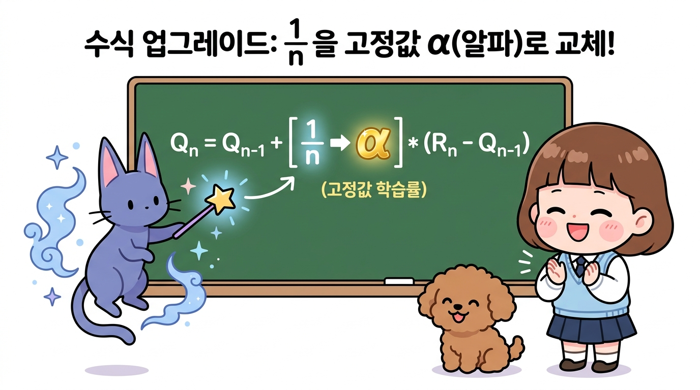

> 🐱 **지니**: "도로시, 기존 증분 갱신의 가볍고 빠른 장점은 그대로 살리면서, 0으로 줄어들던 1/*n* 자리에 언제나 일정한 고정값 **α(알파, 학습률)**를 쏙 끼워 넣는 마법이야! 이렇게 하면 게임을 1,000번, 10,000번 플레이한 뒤에도 에이전트가 최신 보상의 변화를 둔감하게 놓치지 않고 민첩하게 반응할 수 있단다."
>
> 👧 **도로시**: "와! 1/*n* 대신 고정 상수 α를 사용하니까, 플레이 횟수 *n* 이 아무리 많이 쌓여도 귀를 닫지 않고 언제나 최신 보상에 일정한 감도로 귀를 쫑긋 세우게 되는군요!"
>
> 🐶 **토토**: "멍멍! (시간이 지나도 녹슬지 않는 황금 나침반 α를 장착했어요!)"


---


여기서 α는 시행 횟수 *n*이 아무리 늘어나도 변하지 않고 항상 일정하게 유지되는 고정된 **상수(학습률)**입니다.

(0 < *α* < 1)

수식으로는 다음과 같습니다.

$$
Q_n = Q_{n-1} + \alpha(R_n - Q_{n-1})
$$

[식 3.6]

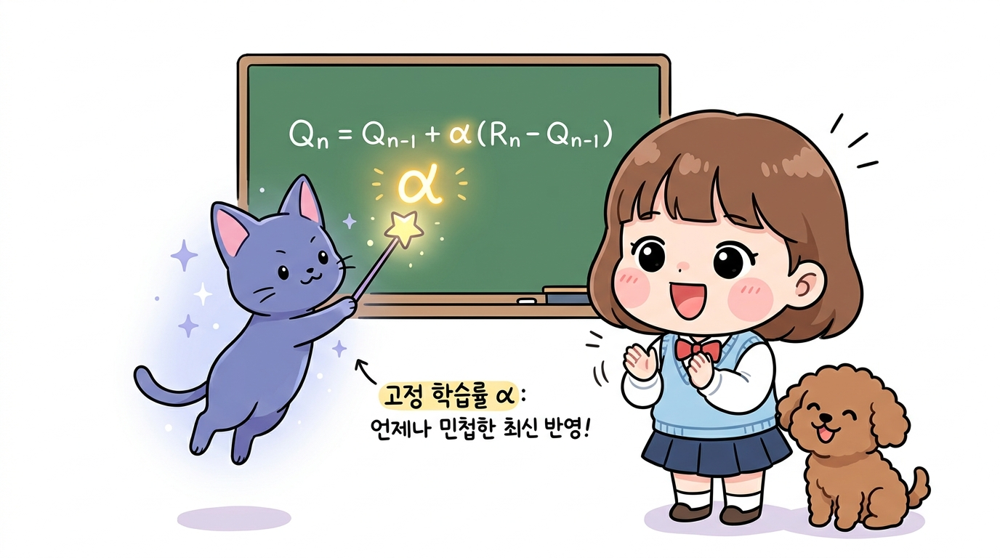


---


[식 3.6]을 적용해 행동 가치 추정치를 갱신하면 각 **보상의 가중치**는 어떻게 될까요? 


답부터 보여드리면 [그림 3-26]처럼 됩니다.

**그림 3-26** 각 보상에 대한 가중치(고정값 α로 갱신한 경우)


고정값 α로 갱신하면 [그림 3-26]과 같이 오래전에 받은 보상일수록 가중치가 **기하급수적으로 감쇠**합니다. 


여기서 그래프의 가로축은 시간의 순서대로 **왼쪽이 가장 오래전에 얻은 보상(과거), 오른쪽이 가장 최근에 얻은 보상(현재)**을 나타냅니다. 


따라서 과거로 거슬러 올라갈수록(왼쪽으로 갈수록) (1 - *α*)가 계속해서 거듭 곱해지기 때문에 가중치 막대의 높이가 0에 가깝게 작아집니다. 반대로 최근에 가까워질수록(오른쪽으로 갈수록) 감쇠가 덜 적용되어 막대 높이가 점점 커지며, 가**장 최근인 현재 시점의 보상 *R*<sub>*n*</sub>에서 최대 가중치인 α를 갖게 됩니다.**


---


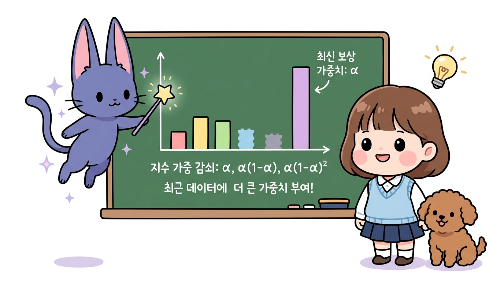


이처럼 시간의 흐름(오른쪽 방향)에 따라 **가중치가 상승하는 형태**를 띠게 되며, 오래된 과거의 데이터보다 최근의 새로운 데이터를 더 강하게 반영하여 비정상 문제에 대응할 수 있게 해줍니다.


---


### 3.5.2.3 지수 이동 평균(EMA) 수식 유도

그런데 [식 3.6]처럼 고정된 값 α로 갱신하면 [그림 3-26]와 같은 기하급수적인 가중치가 만들어지는 이유는 무엇일까요? 

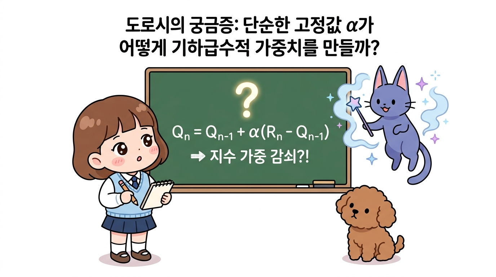

> 👧 **도로시**: "(고개를 갸우뚱하며) 지니님! 우리는 단순히 1/*n* 대신 고정된 상수 α 하나를 넣었을 뿐인데, 수식 어디에도 거듭제곱(지수) 기호가 안 보이잖아요? 그런데 왜 과거로 갈수록 가중치가 기하급수적으로 스르륵 줄어들고 최신 보상만 크게 살아남는 [그림 3-26] 같은 마법의 그래프가 나오는 건가요? 수식 속에 어떤 비밀이 숨겨져 있는 건가요?"
>
> 🐱 **지니**: "후후, 도로시의 호기심 가득한 관찰력이 정말 대단하구나! 겉보기에는 단순한 1차식 같지만, 과거의 *Q* 값들을 양파 껍질 벗기듯 하나씩 거슬러 올라가 대입해보면 놀라운 지수적 곱셈의 비밀이 펼쳐진단다! 지금부터 나와 함께 마법의 수식을 단계별로 풀어볼까?"
>
> 🐶 **토토**: "멍멍! (비밀의 수학 암호를 풀러 갈 시간이에요! 얼른 열어봐요!)"


---


#### 수식으로 이유를 설명해보겠습니다.

먼저 식을 다음과 같이 전개합니다.

$$
\begin{aligned}
Q_n &= Q_{n-1} + \alpha(R_n - Q_{n-1}) \\
&= \alpha R_n + Q_{n-1} - \alpha Q_{n-1} \\
&= \alpha R_n + (1 - \alpha) Q_{n-1}
\end{aligned}
$$

[식 3.7]

*Q*<sub>*n*</sub>과 *Q*<sub>*n-1*</sub>의 관계가 명확해지도록 식을 변형했습니다. 


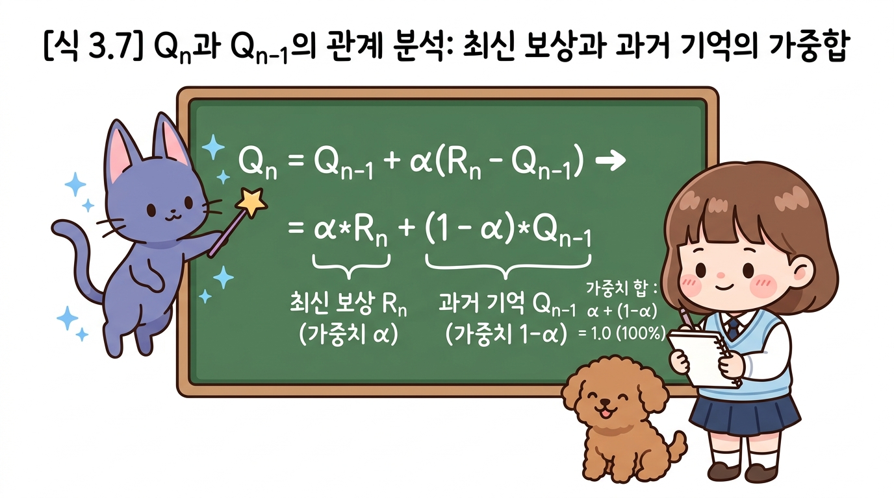

#### 🔍 [식 3.7]이 명확하게 보여주는 핵심 관계 2가지

1. **최신 보상(*R*<sub>*n*</sub>)과 과거 기억(*Q*<sub>*n*-1</sub>)의 가중합 (Weighted Sum)**
   - 현재 시점의 가치 추정치 *Q*<sub>*n*</sub>은 **방금 얻은 새로운 보상 *R*<sub>*n*</sub>(가중치 *α*)**과 **이전까지 축적된 과거의 총체적 기억 *Q*<sub>*n*-1</sub>(가중치 1 - *α*)**의 합으로 정확히 양분됩니다.
2. **가중치의 합은 언제나 완벽한 1.0 (100%)**
   - 두 가중치를 더하면 *α* + (1 - *α*) = 1.0 이 되므로, 전체 가치 추정치의 총합 비중 100%를 최신 경험과 과거 기억이 나누어 갖는 **가중 평균(내분점)** 구조를 가집니다.

> 🐱 **지니**: "괄호를 풀어서 *Q*<sub>*n*-1</sub>끼리 묶어주니 수식의 숨겨진 의미가 한눈에 들어오지? 현재 가치 *Q*<sub>*n*</sub>은 **새로운 최신 보상 *R*<sub>*n*</sub>을 *α*만큼 받아들이고**, **과거의 기억 *Q*<sub>*n*-1</sub>을 (1 - *α*)만큼 물려받는** 아름다운 균형식이야!"
>
> 👧 **도로시**: "와! 만약 *α* = 0.1(10%)이라면, 방금 얻은 최신 보상을 10% 반영하고 이전까지의 경험을 90% 보존하면서 자연스럽게 가치를 갱신하는 거였군요!"
>
> 🐶 **토토**: "멍멍! (새로 주운 뼈다귀 10%와 보관함의 뼈다귀 90%를 황금 비율로 섞는 비법이에요!)"


---


#### 다음 수식 개선 (*n*을 하나 뒤로 미루면)

이어서 [식 3.7]의 *n*을 하나 뒤로 미루면, 즉 *n*에 *n* - 1을 대입하면 다음 식을 얻을 수 있습니다.

$$
Q_{n-1} = \alpha R_{n-1} + (1 - \alpha) Q_{n-2}
$$

[식 3.8]

[식 3.8]은 *Q*<sub>*n-1*</sub>과 *Q*<sub>*n-2*</sub>의 관계를 보여줍니다.

 

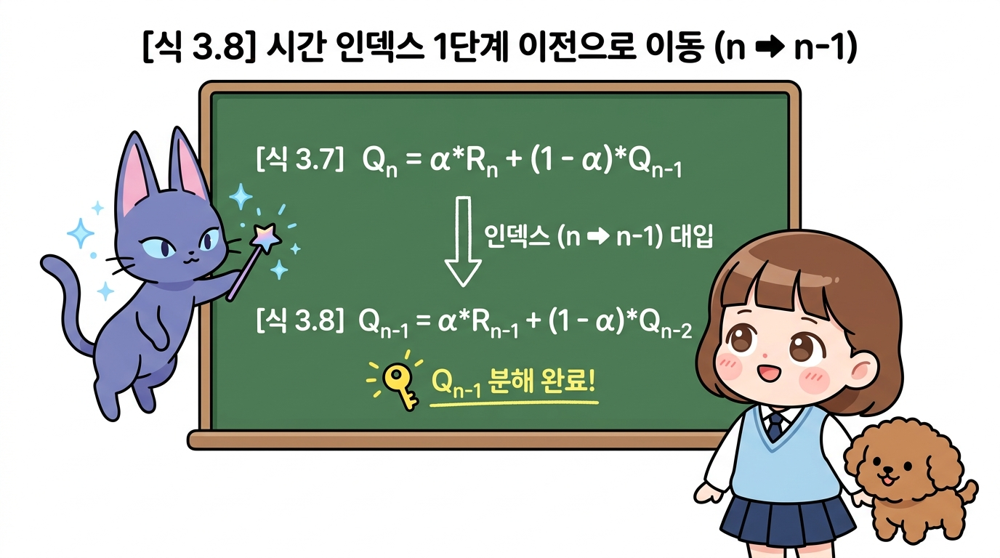

> 🐱 **지니**: "모든 시간 단계에는 똑같은 수학적 갱신 규칙이 적용된단다! [식 3.7]의 모든 *n* 을 (*n* - 1)로 한 단계 뒤로 물려주면, 직전 가치 *Q*<sub>*n*-1</sub> 속에 **어떤 보상(*R*<sub>*n*-1</sub>)과 더 이전 기억(*Q*<sub>*n*-2</sub>)**이 숨어 있는지 명확하게 분해할 수 있어."
>
> 👧 **도로시**: "와! 시간을 한 칸 뒤로 돌려서 *Q*<sub>*n*-1</sub>의 속을 들여다본 거군요! 이제 이 [식 3.8]을 원래의 [식 3.7] 속 *Q*<sub>*n*-1</sub> 자리에 쏙 대입하기만 하면 연쇄적으로 과거의 보상들이 줄줄이 모습을 드러내겠네요!"
>
> 🐶 **토토**: "멍멍! (러시아 인형 마트료시카의 첫 번째 뚜껑을 연 것과 같아요!)"


---


이제 [식 3.8]의 *Q*<sub>*n-1*</sub>을 [식 3.7]에 대입해보죠.

$$
\begin{aligned}
Q_n &= \alpha R_n + (1 - \alpha) Q_{n-1}  & \text{--- [식 3.7]} \\
&= \alpha R_n + (1 - \alpha) \{ \alpha R_{n-1} + (1 - \alpha) Q_{n-2} \} & \text{--- [식 3.8]을 대입} \\
&= \alpha R_n + \alpha(1 - \alpha) R_{n-1} + (1 - \alpha)^2 Q_{n-2}
\end{aligned}
$$

[식 3.9]

> 💡 중괄호 `{ }` 부분이 [식 3.8]을 [식 3.7]에 대입하여 전개한 부분입니다.

[식 3.9]를 보면 *R*<sub>*n*</sub>의 가중치는 α이고, *R*<sub>*n-1*</sub>의 가중치는 α(1 - α)가 됩니다. 


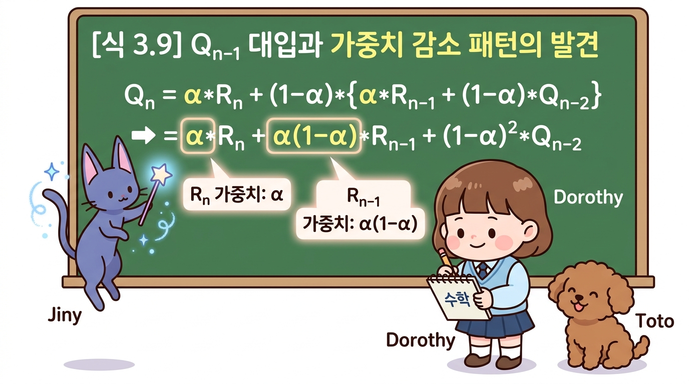

#### 💡 [식 3.9]에서 발견한 지수 감쇠의 첫 번째 규칙
* **최신 보상(*R*<sub>*n*</sub>)의 가중치**: ***α***
* **1단계 전 보상(*R*<sub>*n*-1</sub>)의 가중치**: ***α*(1 - *α*)**
* **가중치의 자연스러운 감소**:
  - 0 < *α* < 1 이므로 항상 (1 - *α*) < 1 입니다.
  - 따라서 *α*(1 - *α*)는 *α*보다 항상 작아지며, 과거로 1스텝 물러설 때마다 가중치가 **(1 - *α*)배만큼 감소**합니다.
  - 예를 들어 *α* = 0.1 이라면, 최신 보상 *R*<sub>*n*</sub>은 10%(0.10)가 반영되지만 한 단계 전 보상 *R*<sub>*n*-1</sub>은 9%(0.09)로 비중이 줄어듭니다!

> 🐱 **지니**: "도로시, 대입을 한 번 거쳤을 뿐인데 놀라운 규칙이 드러났지? 최신 보상 *R*<sub>*n*</sub>은 온전한 *α*의 힘을 받지만, 과거 보상 *R*<sub>*n*-1</sub>에는 (1 - *α*)가 한 번 더 곱해져서 비중이 살짝 줄어들었단다!"
>
> 👧 **도로시**: "와! 과거로 갈수록 (1 - *α*)가 곱해지면서 자연스럽게 오래된 기억의 힘이 옅어지는 원리군요! 그렇다면 계속해서 더 이전의 *Q* 값들을 대입하면 어떻게 될지 너무 기대돼요!"
>
> 🐶 **토토**: "멍멍! (어제 먹은 뼈다귀의 기억보다 방금 냄새 맡은 뼈다귀가 더 생생하게 느껴져요!)"


---


이어서 지금까지의 과정을 [식 3.9]의 *Q*<sub>*n-2*</sub>에 적용해보겠습니다.

$$
Q_n = \alpha R_n + \alpha(1 - \alpha) R_{n-1} + \alpha(1 - \alpha)^2 R_{n-2} + (1 - \alpha)^3 Q_{n-3}
$$

이상의 전개를 *n*번 반복하면 다음 식이 만들어집니다.

$$
Q_n = \alpha R_n + \alpha(1 - \alpha) R_{n-1} + \alpha(1 - \alpha)^2 R_{n-2} + \dots + \alpha(1 - \alpha)^{n-1} R_1 + (1 - \alpha)^n Q_0
$$

[식 3.10]

[식 3.10]을 살펴보면 가중치가 다음과 같이 기하급수적으로 감소함을 알 수 있습니다.

* **최신 보상 *R*<sub>*n*</sub>의 가중치**: α
* **직전 보상 *R*<sub>*n-1*</sub>의 가중치**: α(1 - α)
* **2단계 전 보상 *R*<sub>*n-2*</sub>의 가중치**: α(1 - α)<sup>2</sup>
* **3단계 전 보상 *R*<sub>*n-3*</sub>의 가중치**: α(1 - α)<sup>3</sup>
* **…**
* **첫 번째 보상 *R*<sub>1</sub>의 가중치**: α(1 - α)<sup>*n*-1</sup>
* **초깃값 *Q*<sub>0</sub>의 가중치**: (1 - α)<sup>*n*</sup>

이처럼 지수적으로 감소하기 때문에 [식 3.10]의 계산을 **지수 이동 평균**<sup>exponential moving average, EMA</sup> 또는 **지수 가중 이동 평균**<sup>exponential weighted moving average</sup>이라고 합니다.


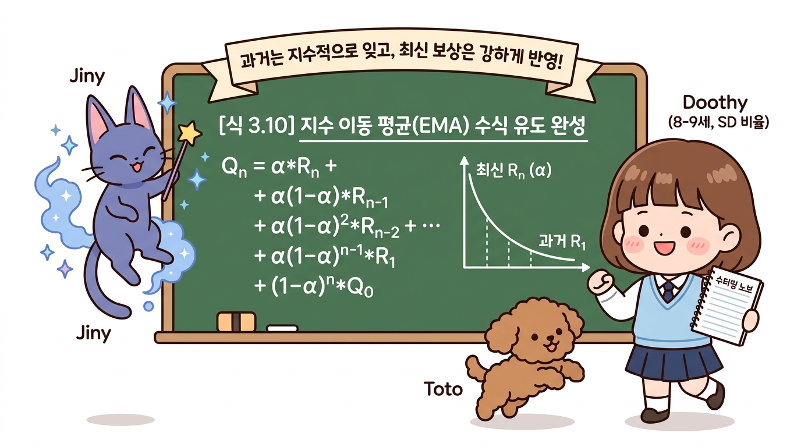

#### [식 3.10] 지수 이동 평균의 3가지 핵심 특징

##### 1. 가중치의 합은 완벽하게 1.0 (정규 가중 평균)
모든 보상들의 가중치와 초깃값의 가중치를 모두 합하면 정확히 1이 됩니다.

$$
\sum_{i=1}^n \alpha(1 - \alpha)^{n-i} + (1 - \alpha)^n = \alpha \frac{1 - (1 - \alpha)^n}{1 - (1 - \alpha)} + (1 - \alpha)^n = 1 - (1 - \alpha)^n + (1 - \alpha)^n = 1
$$

따라서 어떤 경우에도 왜곡 없이 완전한 '가중 평균'의 수학적 조건을 만족합니다.

##### 2. 기하급수적 기억 감쇠 (Exponential Forgetting)
* 0 < *α* < 1 이므로, 공비 (1 - *α*) 역시 0보다 크고 1보다 작습니다.
* 따라서 스텝이 과거로 1단계씩 멀어질 때마다 가중치가 (1 - *α*) 배율로 줄어들어, 오래된 과거 보상의 영향력은 자연스럽게 0에 수렴하며 잊혀집니다.

##### 3. 초경량 *O*(1) 연산과 메모리로 지수 가중치 구현
* 과거의 모든 보상 기록(*R*<sub>1</sub>, *R*<sub>2</sub>, ..., *R*<sub>*n*</sub>)을 리스트에 다 보관하고 지수 곱을 일일이 계산할 필요가 전혀 없습니다.
* 단지 매 시점 최신 보상 *R*<sub>*n*</sub>과 이전 추정치 *Q*<sub>*n*-1</sub> 하나만 가지고 *Q*<sub>*n*</sub> = *Q*<sub>*n*-1</sub> + *α*(*R*<sub>*n*</sub> - *Q*<sub>*n*-1</sub>)을 계산하는 것만으로, 이 정교한 지수 가중 이동 평균이 매 스텝 완벽히 달성됩니다!

> 🐱 **지니**: "도로시, 드디어 [식 3.10]의 완전한 모습을 만났구나! 단지 갱신 수식에서 1/*n*을 고정값 *α*로 바꿨을 뿐인데, 매 스텝마다 최신 보상은 *α*만큼 강하게 새기고 오래된 과거 보상들은 (1 - *α*)씩 부드럽게 지수 감쇠시켜 잊어버리는 놀라운 마법이 완성된 거야!"
>
> 👧 **도로시**: "와! 과거의 모든 보상 데이터를 메모리에 다 쌓아둘 필요도 없이, 단 하나의 수식 *Q*<sub>*n*</sub> = *Q*<sub>*n*-1</sub> + *α*(*R*<sub>*n*</sub> - *Q*<sub>*n*-1</sub>)으로 이 멋진 지수 감쇠 곡선이 자동으로 계산된다니 정말 경이로워요! 이제 슬롯머신의 확률이 중간에 확 바뀌어도 최신 보상을 빠르게 따라잡을 수 있겠어요!"
>
> 🐶 **토토**: "멍멍! (오래된 기억은 스르륵 지우고, 방금 찾은 맛있는 간식 냄새에 집중하는 똑똑한 탐색법이에요!)"


---


### 3.5.2.4 초깃값 설정에 따른 학습 편향(Bias) 영향

[식 3.10]에서 주의할 점은 *Q*<sub>*n*</sub>을 구하는 데 *Q*<sub>0</sub>의 값이 사용되었다는 것입니다. 


*Q*<sub>0</sub>은 행동 가치의 초깃값으로, 우리가 설정하는 값입니다. 따라서 *Q*<sub>*n*</sub>의 값은 우리가 설정한 초깃값에 영향을 받습니다. 


다시 말해 우리가 설정한 값에 따라 학습 결과에 편향<sup>bias</sup>이 생깁니다. 반면 표본 평균의 경우 이러한 편향이 생기지 않습니다. 표본 평균은 첫 번째 보상을 받으면 사용자가 부여한 초깃값은 '사라진다'고 할 수 있습니다.

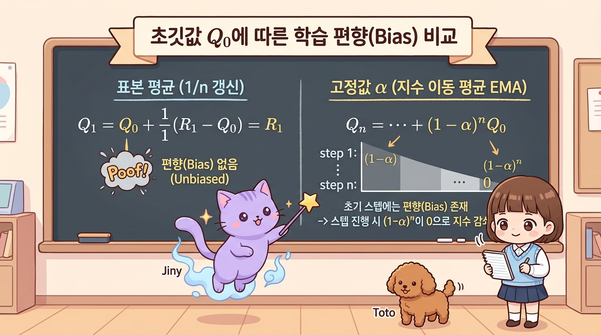


---


#### 표본 평균 vs 고정값 α (EMA)의 초깃값 영향 비교

| 구분 | 표본 평균 (1/*n* 갱신) | 고정값 *α* (지수 이동 평균, EMA) |
| :--- | :--- | :--- |
| **1단계 갱신 결과** | *Q*<sub>1</sub> = *Q*<sub>0</sub> + 1/1(*R*<sub>1</sub> - *Q*<sub>0</sub>) = *R*<sub>1</sub> | *Q*<sub>1</sub> = *αR*<sub>1</sub> + (1 - *α*)*Q*<sub>0</sub> |
| **초깃값 *Q*<sub>0</sub> 영향력** | 첫 번째 보상 *R*<sub>1</sub>을 받는 즉시 **100% 소멸** (편향 없음) | (1 - *α*)<sup>*n*</sup> 비율로 **서서히 지수 감쇠** |
| **초기 스텝의 편향(Bias)** | 전혀 없음 (초깃값과 무관하게 첫 보상으로 직행) | 초기 몇 스텝 동안 초깃값 설정에 따른 **편향 잔존** |
| **시간 경과 후 (*n* 증가)** | 과거의 모든 데이터가 균등하게 누적 | (1 - *α*)<sup>*n*</sup> → 0 이 되어 **편향 소멸 및 최신 트렌드 반영** |

> 🐱 **지니**: "고정값 α 방식에서는 초기 가치 *Q*<sub>0</sub>의 영향력이 (1 - *α*)<sup>*n*</sup>의 비율로 서서히 지수 감쇠하면서 잊혀지지만, 초반 몇 번의 스텝 동안에는 초깃값 설정에 따른 편향(Bias)이 남아있단다!"
>
> 👧 **도로시**: "하지만 단계 수 *n*이 커질수록 (1 - *α*)<sup>*n*</sup>은 0에 가까워지니까, 시간이 흐르면 결국 실제 보상들의 최신 트렌드만 정확하게 남게 되는군요!"
>
> 🐶 **토토**: "멍멍! (처음엔 주인이 알려준 시작 냄새(초깃값)를 기억하지만, 산책을 오래 할수록 방금 맡은 신선한 간식 냄새를 따라가는 것과 같아요!)"


---


## 3.5.3 비정상 문제 해결을 위한 에이전트 구현 및 평가

비정상인 밴디트 문제를 실제로 풀어보죠. 


> 👧 **도로시**: "지니! 우리가 유도한 지수 이동 평균(EMA)의 수학적 원리가 정말 든든해요. 이제 고정값 *α*를 사용하는 똑똑한 `AlphaAgent`를 파이썬 코드로 직접 만들어서, 확률이 시시각각 출렁이는 비정상 슬롯머신 문제를 정복해 봐요!"
>
> 🐱 **지니**: "좋은 자신감이야, 도로시! 기존 `Agent` 클래스에서 가치 갱신 공식의 스텝 크기만 1/*n*에서 고정값 *α*로 바꾸면 강력한 `AlphaAgent`가 완성된단다. 바로 코드로 확인해 볼까?"
>
> 🐶 **토토**: "멍멍! (출격 준비 완료! 움직이는 타깃을 향해 출발해요!)"


---


### 3.5.3.1 AlphaAgent 클래스 구현

이를 위해 해야 할 일은 추정치를 고정값 α로 갱신하는 것뿐입니다. 

값이 고정된 변수 alpha로 추정치를 갱신하는 에이전트를 AlphaAgent 클래스로 다음과 같이 구현합니다.

**소스 코드: [non_stationary.py](./non_stationary.py)**

```python
class AlphaAgent:
    def __init__(self, epsilon, alpha, actions=10):
        self.epsilon = epsilon
        self.Qs = np.zeros(actions)
        self.alpha = alpha  # 고정값 α

    def update(self, action, reward):
        # α로 갱신: Q_n = Q_{n-1} + α * (R_n - Q_{n-1})
        self.Qs[action] += (reward - self.Qs[action]) * self.alpha

    def get_action(self):
        if np.random.rand() < self.epsilon:
            return np.random.randint(0, len(self.Qs))
        return np.argmax(self.Qs)
```

코드는 매우 간단합니다. 


추정치를 계산할 때 (1/*n*로 나누는 대신) `self.alpha`를 곱하면 됩니다. 


3.4.2절의 Agent 클래스와 비교해보세요.

---


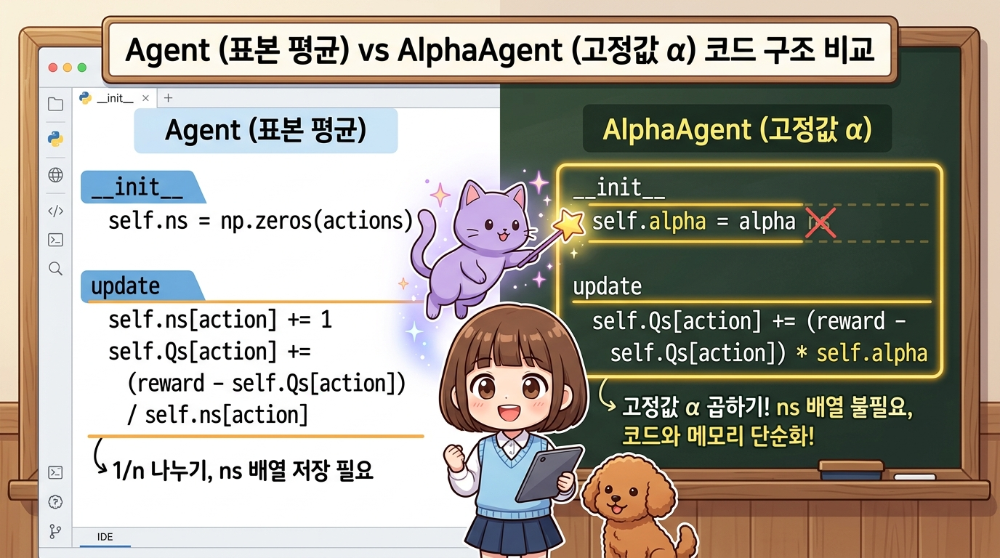

#### 💡 Agent vs AlphaAgent 코드 구조의 2가지 핵심 차이점

1. **`self.ns` (행동 횟수 카운팅 배열)의 완전한 제거**:
   - 기존 `Agent`는 1/*n*을 계산하기 위해 각 머신을 몇 번 당겼는지 `self.ns = np.zeros(actions)`로 일일이 기록하고 갱신해야 했습니다.
   - 반면 `AlphaAgent`는 항상 고정된 `self.alpha`를 사용하므로, 방문 횟수를 카운트할 필요가 전혀 없어 메모리와 코드가 훨씬 가볍고 단순해졌습니다!

2. **가치 갱신(`update`) 연산의 직관적 변화**:
   - `Agent`: `self.Qs[action] += (reward - self.Qs[action]) / self.ns[action]`
   - `AlphaAgent`: `self.Qs[action] += (reward - self.Qs[action]) * self.alpha`
   - 나눗셈(/) 연산 대신 고정값 곱셈(*)을 수행하여 연산 효율을 높이고, 최신 보상을 언제나 일정한 비율(*α*)로 가치 추정치에 반영합니다.

> 🐱 **지니**: "도로시, 코드의 변화를 살펴보렴! 복잡한 행동 횟수 카운팅(`self.ns`)이 싹 사라지고, `update` 메서드에서 단지 `self.alpha`를 곱해주는 것만으로 우리가 수학에서 유도했던 지수 감쇠 가중치가 완벽하게 동작한단다!"
>
> 👧 **도로시**: "와! 코드가 복잡해질 줄 알았는데 오히려 `self.ns` 배열도 없어지고 훨씬 더 심플해졌어요! 이제 이 `AlphaAgent`로 비정상 슬롯머신을 직접 돌려보고 싶어요!"
>
> 🐶 **토토**: "멍멍! (코드가 가벼워지니 발걸음도 훨씬 가볍고 신나요!)"


---


### 3.5.3.2 표본 평균 에이전트와의 성능 비교 및 분석

이제 AlphaAgent 클래스를 사용하여 비정상 문제인 NonStatBandit 클래스를 실행해보겠습니다. 

결과는 [그림 3-27]과 같습니다.

**그림 3-27** 표본 평균과 고정값 α에 의한 갱신 비교


그래프에서 alpha const update가 고정값인 alpha로 갱신했을 때의 결과입니다. 

매개변수는 alpha=0.8로 설정했습니다. 또한 비교해보기 위해 추정치를 표본 평균으로 갱신하는 경우도 sample average로 함께 표시했습니다. 


---


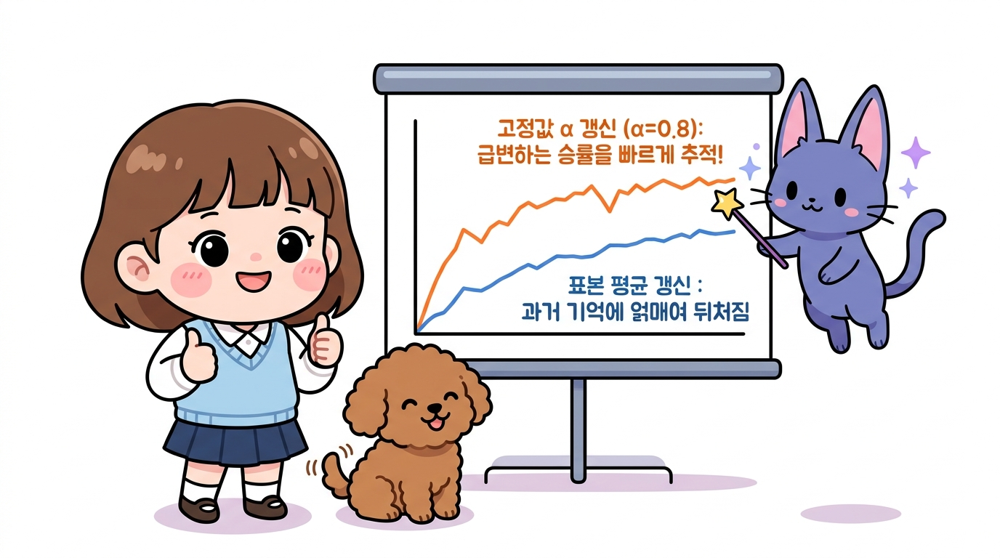


둘을 비교해보면 시간이 지날수록 고정값 α로 갱신할 때의 결과가 더 좋아짐을 알 수 있습니다. 한편, 표본 평균 방식은 처음에는 잘 작동하지만 시간이 지날수록 격차가 벌어집니다. 시간의 변화에 잘 대응하지 못하는 모습입니다. 

이를 통해 이번 비정상 문제에서는 고정값 α로 갱신하는 방식이 적합하다는 사실을 알 수 있습니다.


---


#### 🔍 표본 평균 vs 고정값 α 방식의 격차 원인 분석

| 에이전트 방식 | 비정상 환경에서의 동작 특징 | 문제점 및 성과 차이 |
| :--- | :--- | :--- |
| **표본 평균 에이전트 (Sample Average)** | • 오래된 과거 보상과 최신 보상을 **1/*n*로 동일하게 취급**<br>• *n*이 커질수록 1/*n*이 너무 작아져 최신 보상이 들어와도 *Q* 가치 추정치가 거의 움직이지 않음 | • 과거의 1등 머신 기억에 갇혀 **새롭게 1등으로 부상한 머신을 인지하지 못함** (정체 및 성적 하락) |
| **고정값 α 에이전트 (AlphaAgent, α=0.8)** | • 과거 보상은 **(1 - α) 배율로 기하급수적 망각**<br>• 최신 보상에 **항상 80%의 높은 가중치 부여** | • 머신의 승률이 출렁여도 **실시간으로 새로운 1등 머신을 재빠르게 포착하고 갈아탐** (압도적 고승률 유지) |


---


## 3.5.4 정리 및 요약

이번 절에서는 환경 자체가 동적으로 움직이는 비정상 문제를 해결하는 방식을 배웠습니다. 

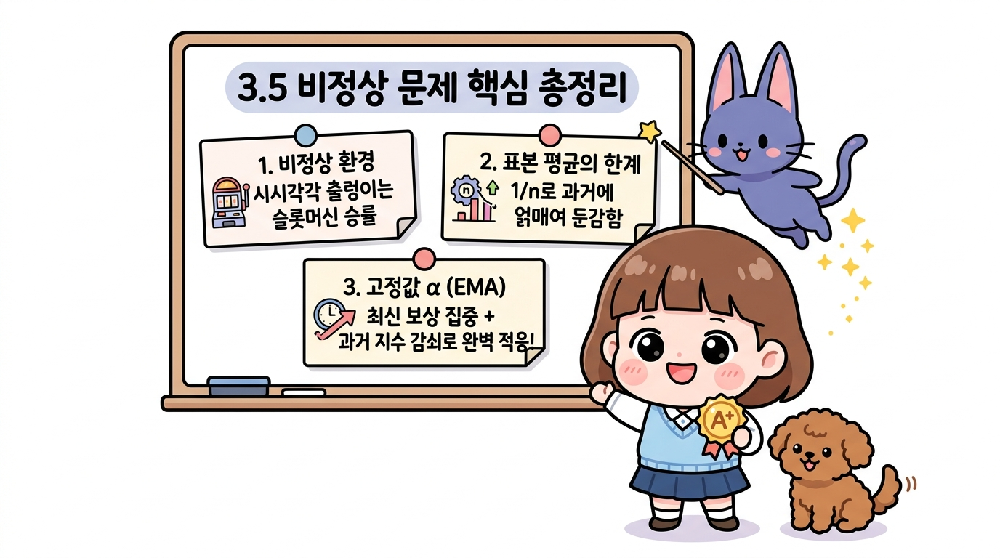

> 👧 **도로시**: "지니야! 정적인 세상에서는 과거의 모든 경험을 공평하게 모으는 '표본 평균'이 정답이지만, 끊임없이 변하는 비정상 세상에서는 '오래된 과거를 지우고 최신 트렌드에 집중하는 고정값 α'가 최고의 지혜라는 걸 배웠어!"
>
> 🐱 **지니**: "완벽해 도로시! 앞으로 우리가 탐험할 복잡한 강화학습 세상(MDP, Q-learning, 딥러닝)은 대부분 에이전트의 정책이 바뀌면서 환경의 피드백도 계속 변하는 '비정상적 특성'을 띤단다. 그래서 바로 이 고정 학습률 α 방식이 강화학습 전반의 표준 공식으로 쓰이게 되는 거지!"
>
> 🐶 **토토**: "멍멍! 와프! (비정상 문제도 완벽하게 정복했어요!)"


---


### 📝 핵심 요약

1. **정상과 비정상 문제의 핵심 차이**: 정상(Stationary) 문제에서는 슬롯머신의 승률(가치)이 고정적이지만, 비정상(Non-stationary) 문제에서는 매 시도마다 승률에 노이즈가 추가되어 최적의 기계가 수시로 바뀝니다.
2. **표본 평균의 한계**: 표본 평균 방식은 모든 과거 데이터에 1/*n*의 동일한 가중치를 부여합니다. 이는 과거의 슬롯머신 상태 정보가 최신 상태 정보와 똑같은 중요도로 다루어지기 때문에 동적인 비정상 환경에 기민하게 대처하지 못합니다.
3. **고정 학습률 α와 지수 이동 평균(EMA)**: 가중치 1/*n*을 고정값 α로 치환한 공식(*Q*<sub>*n*</sub> = *Q*<sub>*n-1*</sub> + α(*R*<sub>*n*</sub> - *Q*<sub>*n-1*</sub>))을 사용하면, 최신 보상일수록 더 큰 가중치를 부여하고 과거의 데이터 가중치는 기하급수적으로 감쇠시키는 지수 이동 평균(Exponential Moving Average)을 유도할 수 있습니다.
4. **초깃값 편향(Initial Bias)**: 지수 가중 갱신 방식은 첫 행동 이후에도 사용자가 설정한 초깃값 *Q*<sub>0</sub>의 잔재가 (1 - α)<sup>*n*</sup> *Q*<sub>0</sub> 만큼 남아 학습에 일부 편향을 남깁니다. 반면 표본 평균은 첫 보상을 받는 순간 초깃값 영향이 즉시 소멸합니다.
5. **학습 성과 확인**: 비정상 밴디트 시뮬레이션 결과, 고정값 α 방식(`alpha const update`)이 시간이 흐름에 따라 변화하는 승률 환경에 기민하게 반응하여 표본 평균 방식(`sample average`)에 비해 장기적으로 월등히 높은 평균 승률 성과를 보여주었습니다.

