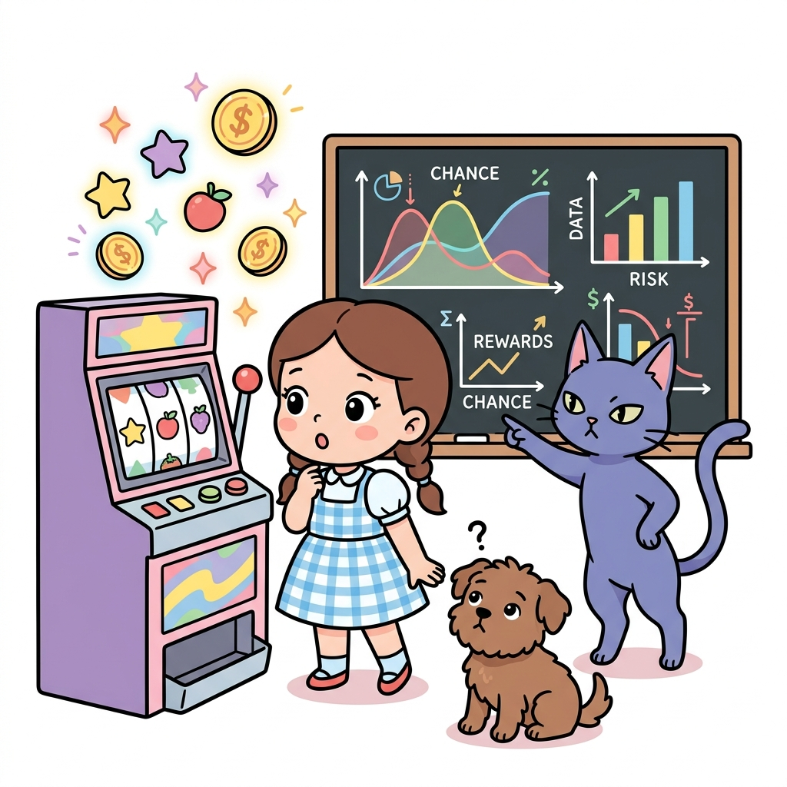
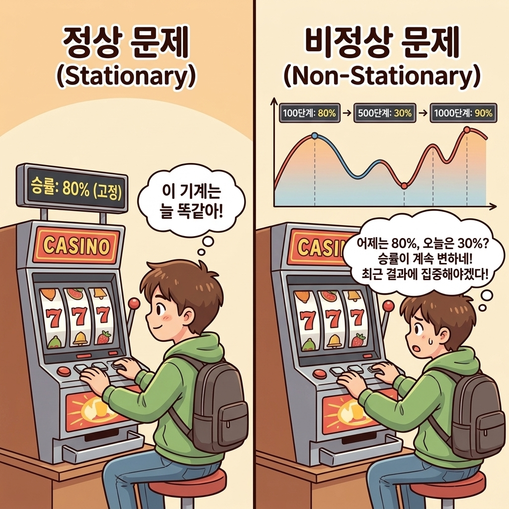
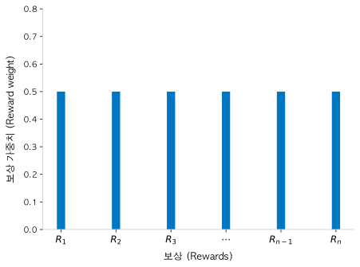
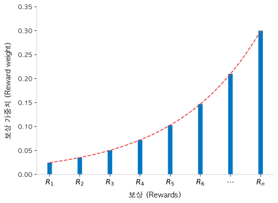
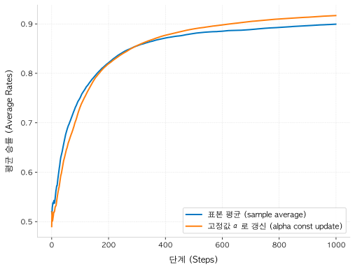

# 3.5 비정상 문제

**그림 03-5** 시간이 흐르며 보상 확률이 살아 움직이듯 요동치는 비정상 상태를 칠판 판서로 공부하는 지니와 도로시


시간이 흘러도 슬롯머신의 당첨 확률이 변하지 않는 기존의 **정상(Stationary)** 문제와 달리, 현실의 기계들은 시시각각 당첨 확률이 출렁이며 변합니다. 이를 **비정상(Non-stationary)** 환경 문제라고 부르죠. 지니가 지적하는 요동치는 확률 곡선 분포 그림 비유를 통해, 시시각각 급변하는 환경에서 에이전트가 어떻게 살아남아 보상을 최대화할 수 있는지 3.5장에서 깊이 있게 학습해봅시다!

---

정상 문제와 비정상 문제의 차이를 직관적으로 비교한 그림입니다. 





- **정상 문제(Stationary)**: 슬롯머신의 승률(가치)이 고정되어 있어 한 번 찾아낸 최적의 선택이 시간이 지나도 변하지 않습니다.
- **비정상 문제(Non-stationary)**: 기계의 내부 구조나 외부 요인에 의해 승률이 동적으로 변동합니다. 따라서 과거의 관측치보다 '가장 최근에 획득한 보상'을 기반으로 판단하는 전략이 필요합니다.


---


## 3.5.1 정상 문제와 비정상 문제의 정의

지금까지 다룬 밴디트 문제는 분류상 **정상 문제**<sup>stationary problem</sup>에 속합니다.

> 정상 문제란 보상의 확률 분포가 변하지 않는 문제입니다. 


### 3.5.1 정상 문제(Stationary Problem)의 개념과 구현

밴디트 문제 맥락에서 말해보면 슬롯머신에 설정된 승률(슬롯머신의 가치)은 줄곧 고정된 채였습니다. 즉, 슬롯머신의 속성은 한번 설정되면 에이전트가 플레이하는 동안 절대 변하지 않습니다. 


앞 절까지 설명한 밴디트 문제가 정상 문제라는 사실은 Bandit 클래스의 다음 코드를 보면 알 수 있습니다.

```python
class Bandit:
    def __init__(self, arms=10):
        self.rates = np.random.rand(arms)  # 한번 설정하면 변하지 않음

    def play(self, arm):
        rate = self.rates[arm]
        if rate > np.random.rand():
            return 1
        else:
            return 0
```

이와 같이 `self.rates`는 초기화 후 변경되지 않습니다. 

이 설정으로 Bandit 클래스를 정상 문제로 만들었습니다.

>  정상(stationary; 定常)은 '일정하여 늘 한결같다'라는 뜻입니다.


### 3.5.2 비정상 문제(Non-stationary Problem)의 개념과 구현

그렇다면 `self.rates`가 플레이할 때마다 달라지면 어떻게 될까요? 

다음 코드를 살펴봅시다.


**소스 코드: [non_stationary.py](file:///Users/hojin9/dev/jinysite/강화학습/03_밴디트_문제/3_5_비정상_문제/non_stationary.py)**

```python
class NonStatBandit:
    def __init__(self, arms=10):
        self.arms = arms
        self.rates = np.random.rand(arms)

    def play(self, arm):
        rate = self.rates[arm]
        self.rates += 0.1 * np.random.randn(self.arms)  # 노이즈 추가
        if rate > np.random.rand():
            return 1
        else:
            return 0
```


NonStatBandit 클래스는 Bandit 클래스에 코드를 한 줄 추가하여 플레이할 때마다 `self.rates`에 작은 노이즈를 추가하도록 했습니다. 

> 참고로 `np.random.randn()`은 평균 0, 표준편차 1의 정규분포에서 무작위 수를 생성합니다. 


이 코드의 효과로 플레이할 때마다 슬롯머신의 가치(승률)가 달라집니다. 

이처럼 보상의 확률 분포가 변하도록 설정된 문제를 **비정상 문제**<sup>non-stationary problem</sup>라고 합니다. 


이와 같은 비정상 문제는 어떻게 풀어야 하는지 이제부터 알아보겠습니다.


---


## 3.5.2 비정상 문제 해결을 위한 이론적 접근

먼저 복습부터 하겠습니다. 

앞 절에서는 슬롯머신의 가치를 추정하기 위해 표본 평균을 계산했습니다. 


### 3.5.3.1 표본 평균 방식의 한계와 고정 가중치

실제 얻은 보상을 *R*<sub>1</sub>, *R*<sub>2</sub>, ..., *R*<sub>*n*</sub>이라 하면 표본 평균은 다음 식으로 표현됩니다.

$$
\begin{aligned}
Q_n &= \frac{R_1 + R_2 + \dots + R_n}{n} \\
&= \frac{1}{n} R_1 + \frac{1}{n} R_2 + \dots + \frac{1}{n} R_n
\end{aligned}
$$

이 식에서처럼 표본 평균은 획득한 보상의 `평균`으로 구할 수 있습니다. 


여기서 주목할 점은 모든 보상 앞에 1/*n*이 붙어 있다는 것입니다. 이 1/*n*을 각 보상에 대한 '가중치'로 볼 수 있습니다. 


여기서 "플레이 횟수 *n*이 늘어날수록 1/*n*의 크기는 1/2 → 1/3 → 1/4 → ... 형태로 점점 줄어들지 않나?"라는 의문이 생길 수 있습니다. 실제로 플레이 횟수가 늘어남에 따라 개별 보상에 할당되는 가중치 1/*n*의 크기는 줄어듭니다. 


하지만 어느 한 `시점` *n*을 기준으로 보면, 과거에 받았던 모든 보상들(*R*<sub>1</sub>, *R*<sub>2</sub>, ..., *R*<sub>*n*</sub>)이 가지는 가중치는 모두 1/*n*로 균등합니다. 


그림으로는 [그림 3-25]처럼 나타낼 수 있습니다.

**그림 3-25** 각 보상에 대한 가중치(표본 평균의 경우)

[그림 3-25]는 특정 시점 *n*(예를 들어 *n*=2)을 기준으로 가중치를 나타낸 하나의 예시입니다.  그래프 세로축의 0.5는 단지 이해를 돕기 위해 임의의 작은 *n* 값을 설정한 예시값일 뿐입니다. 


중요한 사실은 그림과 같이 시점 *n*이 `고정`되어 있을 때 모든 보상에 똑같은 가중치가 부여된다는 점입니다. 새로 얻은 보상이든 오래전에 얻은 보상이든 모두 동등하게 취급한다는 뜻입니다. 만약 *n*=10이 되면 모든 막대의 높이가 일제히 0.1로 낮아지지만, 여전히 모든 막대의 높이는 서로 동일합니다.


그런데 이 가중치는 비정상 문제에는 적합하지 않습니다. 

비정상 문제에서는 시간이 흐르면 환경(슬롯머신)이 변하기 때문에 과거 데이터(보상)의 중요도는 점점 낮아져야 합니다. 반대로 새로 얻은 보상의 가중치는 점점 커져야 하겠죠.


표본 평균을 효율적으로 구해야 하는 이유는 앞에서 설명했습니다. 

다음의 갱신식을 활용하면 표본 평균을 효율적으로 구할 수 있습니다.
$$
Q_n = Q_{n-1} + \frac{1}{n}(R_n - Q_{n-1})
$$

[식 3.5]


[식 3.5]와 같이 행동 가치 추정치 *Q*<sub>*n*</sub>을 증분 방식(순차적)으로 갱신할 수 있습니다.


### 3.5.3.2 고정값 α 기반 증분 갱신식 제안

이제부터 본론입니다. 


[식 3.5]에서 가중치인 1/*n*을 α라는 고정값으로 바꿉니다. 여기서 α는 시행 횟수 *n*이 아무리 늘어나도 변하지 않고 항상 일정하게 유지되는 고정된 상수(상률)입니다.

(0 < *α* < 1)


수식으로는 다음과 같습니다.
$$
Q_n = Q_{n-1} + \alpha(R_n - Q_{n-1})
$$

[식 3.6]


[식 3.6]을 적용해 행동 가치 추정치를 갱신하면 각 보상의 가중치는 어떻게 될까요? 

답부터 보여드리면 [그림 3-26]처럼 됩니다.


**그림 3-26** 각 보상에 대한 가중치(고정값 α로 갱신한 경우)



고정값 α로 갱신하면 [그림 3-26]과 같이 오래전에 받은 보상일수록 가중치가 기하급수적으로 감쇠합니다. 


여기서 그래프의 가로축은 시간의 순서대로 **왼쪽이 가장 오래전에 얻은 보상(과거), 오른쪽이 가장 최근에 얻은 보상(현재)**을 나타냅니다. 


따라서 과거로 거슬러 올라갈수록(왼쪽으로 갈수록) (1 - *α*)가 계속해서 거듭 곱해지기 때문에 가중치 막대의 높이가 0에 가깝게 작아집니다. 반대로 최근에 가까워질수록(오른쪽으로 갈수록) 감쇠가 덜 적용되어 막대 높이가 점점 커지며, 가장 최근인 현재 시점의 보상 *R*<sub>*n*</sub>에서 최대 가중치인 α를 갖게 됩니다.


이처럼 시간의 흐름(오른쪽 방향)에 따라 가중치가 상승하는 형태를 띠게 되며, 오래된 과거의 데이터보다 최근의 새로운 데이터를 더 강하게 반영하여 비정상 문제에 대응할 수 있게 해줍니다.


#### 3.5.3.3 지수 이동 평균(EMA) 수식 유도

그런데 [식 3.6]처럼 고정된 값 α로 갱신하면 [그림 3-26]와 같은 기하급수적인 가중치가 만들어지는 이유는 무엇일까요? 


수식으로 이유를 설명해보겠습니다.

 먼저 식을 다음과 같이 전개합니다.
$$
\begin{aligned}
Q_n &= Q_{n-1} + \alpha(R_n - Q_{n-1}) \\
&= \alpha R_n + Q_{n-1} - \alpha Q_{n-1} \\
&= \alpha R_n + (1 - \alpha) Q_{n-1}
\end{aligned}
$$

[식 3.7]

*Q*<sub>*n*</sub>과 *Q*<sub>*n-1*</sub>의 관계가 명확해지도록 식을 변형했습니다. 


이어서 [식 3.7]의 *n*을 하나 뒤로 미루면, 즉 *n*에 *n* - 1을 대입하면 다음 식을 얻을 수 있습니다.
$$
Q_{n-1} = \alpha R_{n-1} + (1 - \alpha) Q_{n-2}
$$

[식 3.8]

[식 3.8]은 *Q*<sub>*n-1*</sub>과 *Q*<sub>*n-2*</sub>의 관계를 보여줍니다. 


이제 [식 3.8]의 *Q*<sub>*n-1*</sub>을 [식 3.7]에 대입해보죠.
$$
\begin{aligned}
Q_n &= \alpha R_n + (1 - \alpha) Q_{n-1}  & \text{--- [식 3.7]} \\
&= \alpha R_n + (1 - \alpha) \{ \alpha R_{n-1} + (1 - \alpha) Q_{n-2} \} & \text{--- [식 3.8]을 대입} \\
&= \alpha R_n + \alpha(1 - \alpha) R_{n-1} + (1 - \alpha)^2 Q_{n-2}
\end{aligned}
$$

[식 3.9]

> {} 부분이 식을 대입하여 계산 합니다.


[식 3.9]를 보면 *R*<sub>*n*</sub>의 가중치는 α이고, *R*<sub>*n-1*</sub>의 가중치는 α(1 - α)가 됩니다. 

이어서 지금까지의 과정을 [식 3.9]의 *Q*<sub>*n-2*</sub>에 적용해보겠습니다.
$$
Q_n = \alpha R_n + \alpha(1 - \alpha) R_{n-1} + \alpha(1 - \alpha)^2 R_{n-2} + (1 - \alpha)^3 Q_{n-3}
$$


이상의 전개를 *n*번 반복하면 다음 식이 만들어집니다.
$$
Q_n = \alpha R_n + \alpha(1 - \alpha) R_{n-1} + \dots + \alpha(1 - \alpha)^{n-1} R_1 + (1 - \alpha)^n Q_0
$$

[식 3.10]


[식 3.10]을 살펴보면 가중치가 다음과 같이 기하급수적으로 감소함을 알 수 있습니다.

• *R*<sub>*n*</sub>의 가중치 = α
• *R*<sub>*n-1*</sub>의 가중치 = α(1 - α)
• *R*<sub>*n-2*</sub>의 가중치 = α(1 - α)<sup>2</sup>
• *R*<sub>*n-3*</sub>의 가중치 = α(1 - α)<sup>3</sup>
• …


이처럼 지수적으로 감소하기 때문에 [식 3.10]의 계산을 **지수 이동 평균**<sup>exponential moving average</sup> 또는 **지수 가중 이동 평균**<sup>exponential weighted moving average</sup>이라고 합니다.


### 3.5.3.4 초깃값 설정에 따른 학습 편향(Bias) 영향

[식 3.10]에서 주의할 점은 *Q*<sub>*n*</sub>을 구하는 데 *Q*<sub>0</sub>의 값이 사용되었다는 것입니다. 


*Q*<sub>0</sub>은 행동 가치의 초깃값으로, 우리가 설정하는 값입니다. 따라서 *Q*<sub>*n*</sub>의 값은 우리가 설정한 초깃값에 영향을 받습니다. 


다시 말해 우리가 설정한 값에 따라 학습 결과에 편향<sup>bias</sup>이 생깁니다. 반면 표본 평균의 경우 이러한 편향이 생기지 않습니다. 표본 평균은 첫 번째 보상을 받으면 사용자가 부여한 초깃값은 '사라진다'고 할 수 있습니다.


---


## 3.5.3 비정상 문제 해결을 위한 에이전트 구현 및 평가

비정상인 밴디트 문제를 실제로 풀어보죠. 


### 3.5.3.1 AlphaAgent 클래스 구현

이를 위해 해야 할 일은 추정치를 고정값 α로 갱신하는 것뿐입니다. 값이 고정된 변수 alpha로 추정치를 갱신하는 에이전트를 AlphaAgent 클래스로 다음과 같이 구현합니다.


**소스 코드: [non_stationary.py](file:///Users/hojin9/dev/jinysite/강화학습/03_밴디트_문제/3_5_비정상_문제/non_stationary.py)**
```python
class AlphaAgent:
    def __init__(self, epsilon, alpha, actions=10):
        self.epsilon = epsilon
        self.Qs = np.zeros(actions)
        self.alpha = alpha  # 고정값 α

    def update(self, action, reward):
        # α로 갱신
        self.Qs[action] += (reward - self.Qs[action]) * self.alpha

    def get_action(self):
        if np.random.rand() < self.epsilon:
            return np.random.randint(0, len(self.Qs))
        return np.argmax(self.Qs)
```

코드는 매우 간단합니다. 


추정치를 계산할 때 (1/*n*로 나누는 대신) `self.alpha`를 곱하면 됩니다. 

3.4.2절 of Agent 클래스와 비교해보세요.


### 3.5.3.2 표본 평균 에이전트와의 성능 비교 및 분석

이제 AlphaAgent 클래스를 사용하여 비정상 문제인 NonStatBandit 클래스를 실행해보겠습니다. 


결과는 [그림 3-27]과 같습니다.

**그림 3-27** 표본 평균과 고정값 α에 의한 갱신 비교



그래프에서 alpha const update가 고정값인 alpha로 갱신했을 때의 결과입니다. 

매개변수는 alpha=0.8로 설정했습니다. 또한 비교해보기 위해 추정치를 표본 평균으로 갱신하는 경우도 sample average로 함께 표시했습니다. 


둘을 비교해보면 시간이 지날수록 고정값 α로 갱신할 때의 결과가 더 좋아짐을 알 수 있습니다. 한편, 표본 평균 방식은 처음에는 잘 작동하지만 시간이 지날수록 격차가 벌어집니다. 시간의 변화에 잘 대응하지 못하는 모습입니다. 


이를 통해 이번 비정상 문제에서는 고정값 α로 갱신하는 방식이 적합하다는 사실을 알 수 있습니다.


---


## 3.5.4 정리 및 요약

이번 절에서는 환경 자체가 동적으로 움직이는 비정상 문제를 해결하는 방식을 배웠습니다. 


핵심 요약은 다음과 같습니다.

1. **정상과 비정상 문제의 핵심 차이**: 정상(Stationary) 문제에서는 슬롯머신의 승률(가치)이 고정적이지만, 비정상(Non-stationary) 문제에서는 매 시도마다 승률에 노이즈가 추가되어 최적의 기계가 수시로 바뀝니다.
2. **표본 평균의 한계**: 표본 평균 방식은 모든 과거 데이터에 1/*n*의 동일한 가중치를 부여합니다. 이는 과거의 슬롯머신 상태 정보가 최신 상태 정보와 똑같은 중요도로 다루어지기 때문에 동적인 비정상 환경에 기민하게 대처하지 못합니다.
3. **고정 학습률 α와 지수 이동 평균(EMA)**: 가중치 1/*n*을 고정값 α로 치환한 공식(*Q*<sub>*n*</sub> = *Q*<sub>*n-1*</sub> + α(*R*<sub>*n*</sub> - *Q*<sub>*n-1*</sub>))을 사용하면, 최신 보상일수록 더 큰 가중치를 부여하고 과거의 데이터 가중치는 기하급수적으로 감쇠시키는 지수 이동 평균(Exponential Moving Average)을 유도할 수 있습니다.
4. **초깃값 편향(Initial Bias)**: 지수 가중 갱신 방식은 첫 행동 이후에도 사용자가 설정한 초깃값 *Q*<sub>0</sub>의 잔재가 (1 - α)<sup>*n*</sup> *Q*<sub>0</sub> 만큼 남아 학습에 일부 편향을 남깁니다. 반면 표본 평균은 첫 보상을 받는 순간 초깃값 영향이 즉시 소멸합니다.
5. **학습 성과 확인**: 비정상 밴디트 시뮬레이션 결과, 고정값 α 방식(`alpha const update`)이 시간이 흐름에 따라 변화하는 승률 환경에 기민하게 반응하여 표본 평균 방식(`sample average`)에 비해 장기적으로 월등히 높은 평균 승률 성과를 보여주었습니다.
