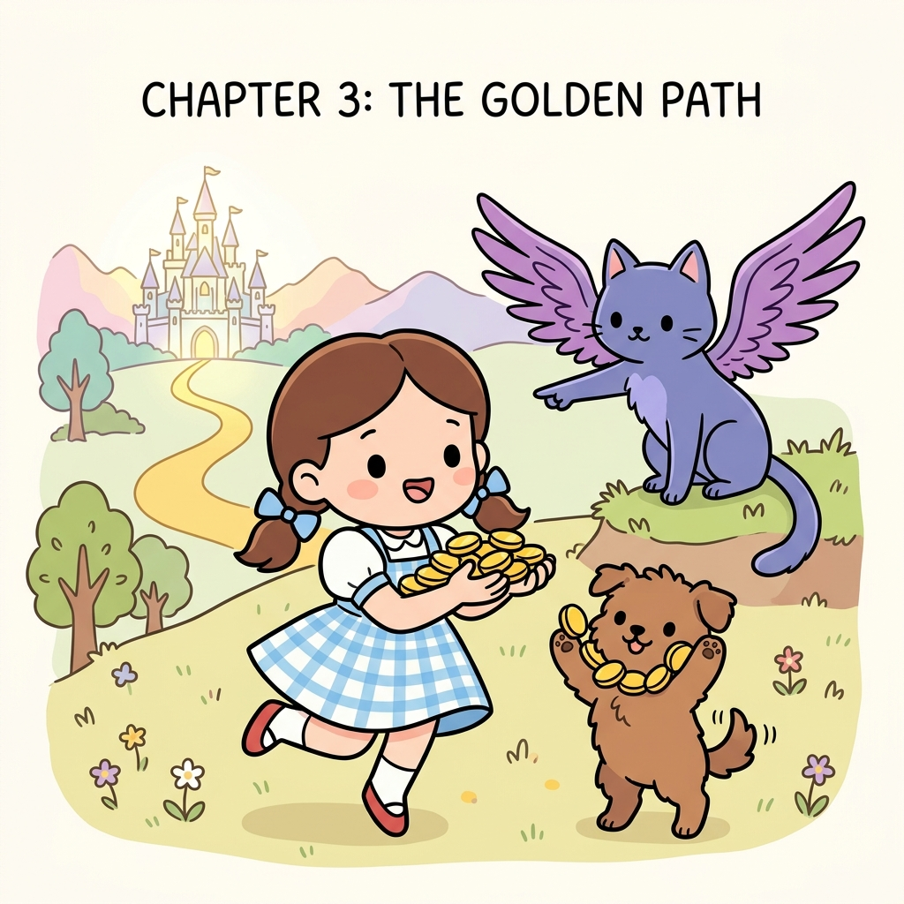

# 3.6 정리

**그림 03-6** 밴디트 단원의 잭팟 보상을 가득 거머쥐고, 지니의 안내에 따라 저 멀리 마법의 새로운 성(마르코프 환경)으로 모험을 떠나는 도로시와 토토

3강 밴디트 문제를 모두 정복하고 다음의 거대한 세계인 4강 마르코프 환경으로 떠나는 정리를 마주합니다. 지니의 보랏빛 날개짓을 따라 더 넓은 세상으로 가벼운 발걸음을 떼며 3장의 핵심 골격들을 다같이 한 번 더 정리해볼까요?

---

  

    🎧
    대화 음성 듣기 (도로시, 토토 & 지니)
  

  

    <button type="button" class="btn-audio-play" style="background: #0284c7; color: #ffffff; border: none; border-radius: 16px; padding: 5px 13px; font-size: 0.82rem; font-weight: 600; cursor: pointer; display: inline-flex; align-items: center; gap: 4px; box-shadow: 0 1px 2px rgba(2,132,199,0.3);">
      ▶️ 재생
    </button>
    <button type="button" class="btn-audio-stop" style="background: #e2e8f0; color: #475569; border: none; border-radius: 16px; padding: 5px 11px; font-size: 0.82rem; font-weight: 600; cursor: pointer; display: inline-flex; align-items: center; gap: 4px;">
      ⏹️ 정지
    </button>
  

  <audio src="./audio/dialogue_3_6_scene1.mp3" preload="none"></audio>

> 👧 **도로시**: "지니야! 우리가 슬롯머신 10대에서 엡실론 탐욕 주사위로 탐색과 활용의 균형을 맞추고, 표본 평균과 지수 이동 평균까지 직접 파이썬으로 구현해서 3장을 마스터했어!"
>
> 🐶 **토토**: "멍멍! 나도 이제 환경이 변해도 지수 이동 평균으로 과거를 잊고 새 보상을 쫓아갈 수 있어! 멍멍!"
>
> 🐱 **지니**: "둘 다 정말 자랑스러워! 밴디트 문제를 통해 강화학습의 에이전트와 환경, 보상의 상호작용 원리를 완벽하게 꿰뚫었으니, 이제 다음 4장 마르코프 세상으로 당당하게 떠나보자꾸나!"

 

이번 장에서는 먼저 강화 학습의 기초를 알아보았습니다. 강화 학습은 머신러닝의 한 분야지만 '지도 학습'이나 '비지도 학습'과는 분명한 차이가 있습니다. 

#### 바로 환경과 에이전트의 상호작용이 이루어진다는 점입니다. 

에이전트는 자신의 행동에 대해 보상을 얻고 보상의 총합을 극대화하는 행동 패턴을 익히는 것을 목표로 삼습니다.

이어서 밴디트 문제를 다루었습니다.

 밴디트 문제를 풀기 위한 알고리즘은 '여러 선택지 중에서 최선의 선택을 고르는 문제'에 적용할 수 있습니다. 이번 장에서는 슬롯머신을 예로 들었지만 그 외에도 다양한 문제에 활용할 수 있습니다. 예를 들어 매출에 기여하는 웹 디자인을 선택하는 문제나 효능이 가장 좋은 약을 선택하는 문제 등에도 밴디트 알고리즘을 활용할 수 있습니다.

#### 밴디트 문제 그리고 강화 학습에서는 '활용과 탐색의 균형'을 맞추는 일이 중요합니다. 

이번 장에서는 이를 구현하기 위한 알고리즘으로 ε-탐욕 정책을 배웠습니다. ε-탐욕 정책은 지금까지 얻은 경험을 '활용'하는 동시에 (가끔은) 탐욕스럽지 않은 행동도 시도하는 식으로 더 나은 행동이 없는지 '탐색'합니다. 이 정책을 적용해 밴디트 문제를 효율적으로 해결할 수 있었습니다. 참고로 밴디트 알고리즘으로는 ε-탐욕 정책 외에도 다양한 방법이 제안되고 있습니다. 

대표적인 방법으로는 UCBUpper Confidence Bound 알고리즘[2], 그레이디언트 밴디트 알고리즘[3] 등이 있습니다.

#### 또한 '평균'에 대해서도 배웠습니다. 

이번 장에 등장한 평균은 두 가지입니다. 하나는 균일한 가중치를 사용하는 '표본 평균'이고 다른 하나는 새로 얻은 데이터일수록 큰 가중치를 부여하는 '지수 이동 평균'입니다. 행동 가치의 추정치는 '표본 평균' 또는 '지수 이동 평균'을 사용하여 계산할 수 있습니다. 어떤 방식을 사용할지는 문제의 성격에 따라 결정됩니다. 

정상 문제에는 표본 평균을, 비정상 문제에는 지수 이동 평균을 사용합니다. 또한 두 평균은 다음과 같이 증분 방식(순차적)으로 계산할 수 있습니다.

• **표본 평균**: *Q**n* = *Q**n-1* + 1/*n*(*R**n* - *Q**n-1*)
• **지수 이동 평균**: *Q**n* = *Q**n-1* + α(*R**n* - *Q**n-1*)

이와 같이 표본 평균은 1/*n*로, 지수 이동 평균은 고정값 α로 갱신합니다.

  

    🎧
    대화 음성 듣기 (도로시 & 지니)
  

  

    <button type="button" class="btn-audio-play" style="background: #0284c7; color: #ffffff; border: none; border-radius: 16px; padding: 5px 13px; font-size: 0.82rem; font-weight: 600; cursor: pointer; display: inline-flex; align-items: center; gap: 4px; box-shadow: 0 1px 2px rgba(2,132,199,0.3);">
      ▶️ 재생
    </button>
    <button type="button" class="btn-audio-stop" style="background: #e2e8f0; color: #475569; border: none; border-radius: 16px; padding: 5px 11px; font-size: 0.82rem; font-weight: 600; cursor: pointer; display: inline-flex; align-items: center; gap: 4px;">
      ⏹️ 정지
    </button>
  

  <audio src="./audio/dialogue_3_6_scene2.mp3" preload="none"></audio>

> 👧 **도로시**: "지니야! 밴디트 문제는 슬롯머신 레버를 한 번 당기면 게임이 끝나는 단판 승부였잖아? 4장 마르코프 세상에서는 뭐가 달라지는 거야?"
>
> 🐱 **지니**: "단판 승부를 넘어, 내 행동이 다음 상태로 이어지고 또 다음 상태로 사슬처럼 연결되는 '연속적인 상태 변화'의 세계로 들어간단다! 훨씬 흥미진진한 모험이 기다리고 있지!"

 
