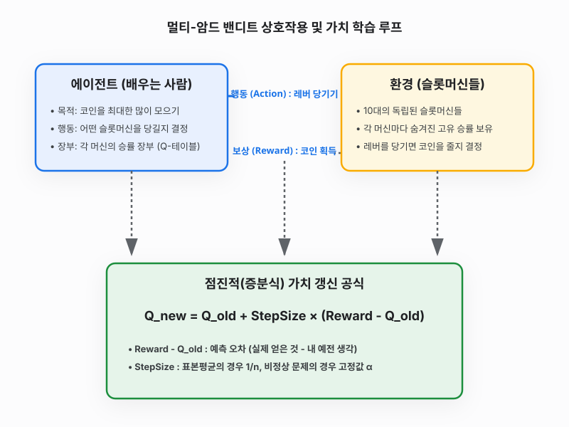

# 3강 밴디트 문제

**그림 03-0** 세 대의 서로 다른 마법 슬롯머신(HAPPINESS, LUCK, CHANCE) 앞에서 어떤 레버를 당길지 신중히 고민하는 도로시와 돋보기로 레버의 당첨 이력을 계산해주는 지니

강화학습을 관통하는 가장 위대한 딜레마는 **"가장 점수를 잘 주던 잭팟 기계를 계속 당길 것인가(활용), 아니면 더 잘 줄지도 모르는 다른 기계를 탐험해 볼 것인가(탐색)"**입니다. 요정 고양이 지니가 준비한 3대의 마법 슬롯머신 밴디트 문제 속에서 어떻게 하면 최적의 균형을 찾을 수 있을지 그 수학적 비밀을 풀어봅시다!

---

사람은 아무런 규칙을 알려주는 선생님이 없어도 스스로 계단을 오르고, 수저를 쥐고, 자전거 균형을 잡는 법을 배울 수 있습니다. 머리를 부딪쳐 아파보기도 하고, 중심을 잘 잡아 시원하게 바람을 가르는 짜릿한 기쁨을 직접 겪어보면서 말이죠. 이처럼 환경과 직접 부딪히며 스스로 더 똑똑한 규칙을 학습해 나가는 인공지능 분야를 **강화 학습**이라고 부릅니다.

이번 3강에서는 강화 학습의 가장 아름답고 단순한 형태인 **밴디트 문제(슬롯머신 문제)**를 통해, 컴퓨터가 어떻게 직접 부딪히며 최고의 잭팟 기계를 찾아내는지 그 원리를 탐구해 봅니다.

---

## 밴디트 문제를 위한 수학적 기초 (사전 준비)

밴디트 문제의 핵심은 **"수많은 행동 후보군 중에서 어떤 행동이 가장 큰 평균 보상을 돌려주는가?"**를 수학적으로 계산하고 예측하는 것입니다. 본 단원의 알고리즘을 코드로 직접 구현하고 이해하기 위해 꼭 알고 넘어가야 할 3가지 수학 기초 개념을 먼저 간단히 짚고 가겠습니다.

### 1. 확률(*p*)과 기댓값(*E*)
- **확률 (*p*)**: 어떤 무작위 사건이 일어날 가능성을 `0`과 `1` 사이의 숫자로 나타낸 것입니다. 예컨대 승률이 30%인 슬롯머신은 이길 확률 *p* = 0.3 이고, 질 확률은 1 - *p* = 0.7 이 됩니다.
- **기댓값 (Expected Value)**: 어떤 무작위 시행을 무한히 반복했을 때 기대할 수 있는 **평균적인 획득량**입니다. 수식으로는 각 결과값(*x*)에 그 결과가 일어날 확률(*P*)을 곱하여 모두 더한 값으로 정의합니다.
  
  $$E[X] = \sum_{x} x \cdot P(X = x)$$

> [!NOTE]
> **기댓값 기호 E 읽기**
> - **기호 및 약어**: 기대하다라는 뜻의 영어 단어 **Expectation**의 앞 글자인 대문자 **E**를 씁니다.
> - **읽는 방법**: 한국어로는 단순히 **'기댓값'** 또는 **'기대치'**라고 읽으며, 영어식으로는 **'이'** 또는 **'익스펙테이션'**이라고 읽습니다. 예컨대 *E*[*X*]는 "이 엑스" 혹은 "익스펙테이션 엑스"라고 발음합니다.

### 2. 참 가치(참값)와 표본 평균(추정값)
- **참 가치 (*q*&#42;(*a*))**: 슬롯머신 기계 내부에 프로그래밍되어 있는 진짜 평균 승률(참값)입니다. 강철 금고 안에 잠겨 있어 우리는 이를 직접 들여다볼 수 없습니다.
- **표본 평균 (*Q**n*)**: 우리가 직접 기계를 *n*번 당겨서 얻은 보상들의 평균(추정값)입니다. 
- **큰 수의 법칙 (Law of Large Numbers)**: 시행 횟수 *n*이 커지면 커질수록, 우리가 수집한 표본 평균 *Q**n*은 진짜 참 가치 *q*&#42;(*a*)에 완벽하게 수렴하게 된다는 통계학 법칙입니다. 우리는 이를 믿고 데이터를 열심히 수집합니다.

### 3. 메모리를 절약하는 평균 공식 (증분 갱신 공식)
평균을 구하기 위해 과거에 얻은 수만 개의 보상 데이터를 컴퓨터 메모리에 전부 다 저장해 두는 것은 매우 비효율적입니다. 그래서 강화학습에서는 **직전 단계의 평균값(*Q**n-1*)에 이번에 얻은 신선한 데이터(*R**n*) 하나만을 얹어 실시간으로 평균을 구하는** 똑똑한 수학 공식을 사용합니다.

$$Q_n = Q_{n-1} + \frac{1}{n} \left( R_n - Q_{n-1} \right)$$

이 공식의 아름다운 작동 원리를 흐름도로 살펴보면 아래와 같습니다.

- **예측 오차 (*R**n* - *Q**n-1*)**: 방금 얻은 실제 보상(*R**n*)과 이전까지 내렸던 예상치(*Q**n-1*)의 차이(오차)입니다.
- **가중치 (1/*n*)**: 새로운 오차를 현재 평균에 얼마나 반영할지를 결정하는 비율(시간 간격 파라미터)입니다.

이 공식을 이용하면 컴퓨터는 단 두 개의 숫자(*Q**n-1*과 *n*)만 메모리에 들고 있으면서도 완벽하게 최신 평균을 실시간으로 갱신할 수 있습니다!

---

## 밴디트의 정의와 유래

강화 학습에서 가장 기본이 되는 모델인 '밴디트'라는 명칭은 어디서 온 것일까요? 

### 단어의 원래 뜻

'밴디트(Bandit)'는 원래 영어로 **'도적' 또는 '산적'**을 의미하는 단어입니다.

### 외팔이 도적

카지노에 있는 슬롯머신 기계는 한쪽에 기다란 레버(손잡이)가 하나 달려 있습니다. 이 기계는 작동할 때마다 사람들의 돈을 마치 도둑처럼 훔쳐 가듯 다 잃게 만든다고 해서 도박꾼들 사이에서 **'외팔이 도적(One-armed Bandit)'**이라는 별명으로 불렸습니다.

### 멀티-암드 밴디트

우리가 이번 장에서 집중적으로 연구할 문제는 **'멀티-암드 밴디트(Multi-armed Bandit)'**, 즉 '여러 대의 슬롯머신 기계들 중에서 어떤 녀석이 잭팟을 가장 자주 주는지 알아내어 최대한 많은 돈을 벌어내는 기법'을 의미합니다. 이것이 강화 학습 역사의 첫 장을 장식하는 모델의 시작점입니다.

---

## 직관적으로 이해하는 강화 학습

친구들과 오락실에 갔다고 상상해 봅시다. 여기 세 종류의 알록달록한 슬롯머신 기계가 놓여 있습니다. 각 기계마다 코인이 당첨될 확률(승률)이 완전히 다르게 맞춰져 있습니다. 어떤 기계는 10% 확률로 코인을 주지만, 어떤 대박 기계는 80% 확률로 코인을 퍼줍니다.

하지만 기계 겉면에는 아무런 힌트도 적혀 있지 않습니다. 여러분에게 주어진 기회는 딱 100번뿐입니다. 여러분은 어떻게 해야 가장 많은 코인을 획득해 오락실 최고의 챔피언이 될 수 있을까요?

1. 처음에는 세 기계를 **골고루 당겨보며**(탐색) 어떤 기계가 대박 기계인지 알아내야 합니다.
2. 어느 정도 기계들의 승률을 눈치챘다면, 그중 가장 코인이 잘 나오던 기계만 **집중적으로 당겨야**(활용) 많은 돈을 획득할 수 있습니다.

이처럼 무작위로 동작하는 대상에 대처하여 **"모험을 떠날 것인가(탐색)"** 아니면 **"기존 맛집에 안주할 것인가(활용)"** 사이에서 현명한 줄타기를 조율하는 것이 밴디트 알고리즘의 핵심 원리입니다.

---

## 상세 개념 및 동작 루프

에이전트(컴퓨터)가 슬롯머신 환경과 버튼을 누르며 피드백을 수집하고, 수학 공식을 사용해 머릿속 장부(Q-테이블)를 점진적으로 업데이트하는 데이터 흐름도입니다.

---

## 학습 목표

이 단원을 열심히 공부하고 나면 아래 세 가지 물음에 스스로 답할 수 있게 됩니다!

1. **지도 학습, 비지도 학습, 강화 학습**의 차이를 명확한 비유로 설명할 수 있다.
2. 밴디트 문제에서 발생하는 **탐색(Exploration)과 활용(Exploitation)의 충돌 문제**가 왜 생기는지 설명할 수 있다.
3. 데이터 전체를 들고 있지 않고도 매번 보상이 들어올 때마다 실시간으로 평균 점수를 업데이트하는 **증분식 공식**의 구조를 이해한다.

---

## 학습 목차

- [3.1 머신러닝 분류와 강화 학습](./3_1_머신러닝_분류와_강화_학습/index.html)
  - 컴퓨터를 훈련시키는 머신러닝의 세 가지 대표 줄기(지도/비지도/강화학습)의 정의와 특징을 비교합니다. 칭찬 스티커(보상)를 통해 로봇이 걷는 법을 배우는 메커니즘을 알아봅니다.
- [3.2 밴디트 문제](./3_2_밴디트_문제/index.html)
  - 외팔이 도적이라 불리는 슬롯머신 문제를 강화 학습 용어(에이전트, 환경, 상태, 행동, 보상)로 정확하게 매핑하여 수학적 기댓값(행동 가치)으로 정의합니다.
- [3.3 밴디트 알고리즘](./3_3_밴디트_알고리즘/index.html)
  - 아는 맛만 먹는 활용과 새 맛집을 개척하는 탐색 사이의 딜레마를 90%의 똑똑함과 10%의 무작위성으로 풀어내는 기발한 $\epsilon$-탐욕 알고리즘을 배웁니다.
- [3.4 밴디트 알고리즘 구현](./3_4_밴디트_알고리즘_구현/index.html)
  - 10대의 가상 슬롯머신을 파이썬 코드로 만들어 보고, 에이전트 클래스를 직접 조립해 200번의 독립 시뮬레이션을 돌려 평균 승률의 우수성을 눈으로 확인합니다.
- [3.5 비정상 문제](./3_5_비정상_문제/index.html)
  - 슬롯머신의 승률이 플레이 도중 지진처럼 수시로 삐걱거리며 달라지는 까다로운 환경에 맞서, 옛 기억은 잊어버리고 최신 보상을 중시하는 지수 이동 평균 수식을 유도합니다.
- [3.6 정리](./3_6_정리/index.html)
  - 3강에서 다룬 표본 평균 및 지수 이동 평균 증분 갱신 공식의 차이점 및 활용/탐색 균형의 중요성을 한눈에 깔끔히 요약하여 마칩니다.

---

## 학습 정리

1. **강화 학습**: 정답을 알려주는 선생님이 없는 환경에서 에이전트가 상태를 관찰하고 행동을 취하며 얻는 누적 보상의 합을 극대화하기 위해 배우는 시행착오 기법입니다.
2. **탐색과 활용의 딜레마**: 이미 검증된 최고 기계만 당기면 더 큰 잭팟 기계를 영영 못 찾을 수 있고(탐색 필요), 매번 탐험만 하면 돈을 쓸어 담을 수 없습니다(활용 필요). 이를 $\epsilon$-탐욕 방식으로 조율합니다.
3. **증분식 평균 공식**: $Q_n = Q_{n-1} + \text{가중치}(R_n - Q_{n-1})$ 공식을 쓰면 이전 메모리를 낭비하지 않고 오차를 바탕으로 실시간 학습이 가능합니다. 정상 문제에서는 가중치로 $\frac{1}{n}$을, 기계 설정이 수시로 변하는 비정상 문제에서는 고정 상수 $\alpha$를 씁니다.
