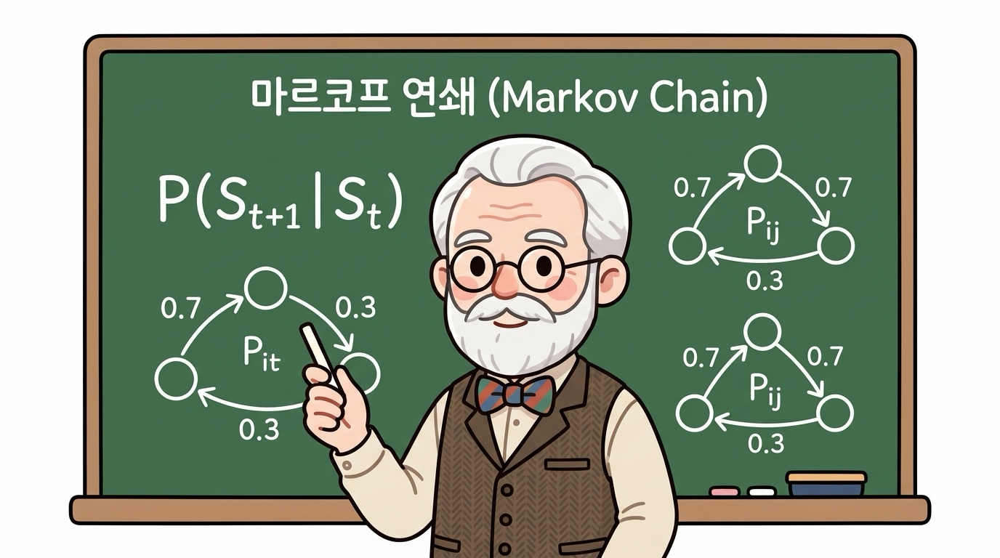
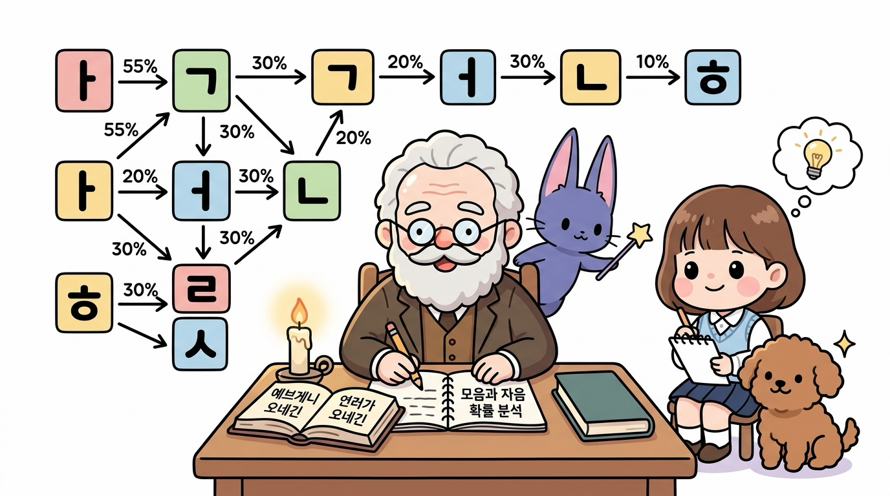
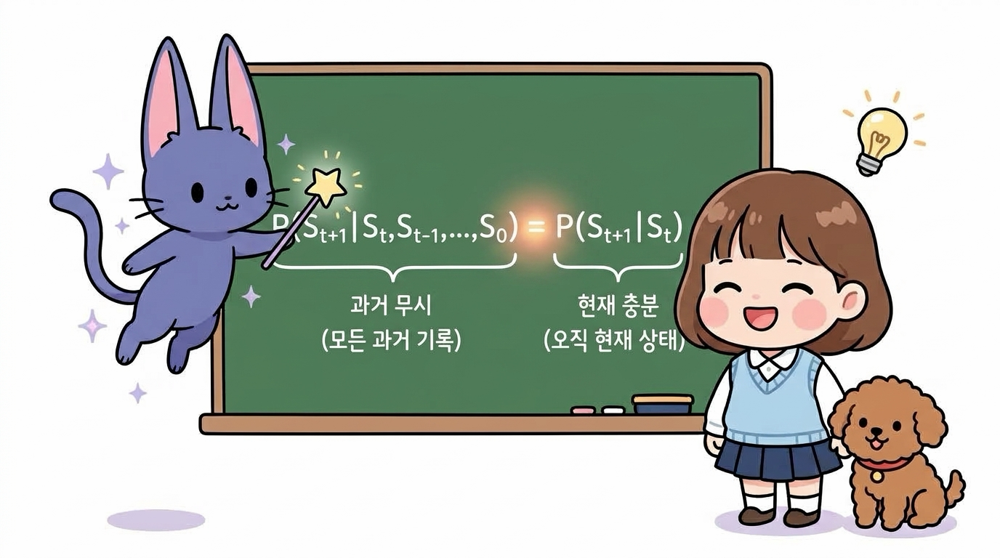
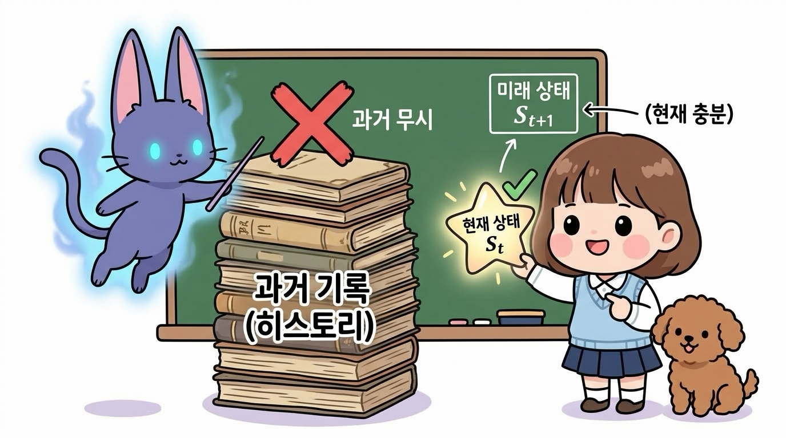
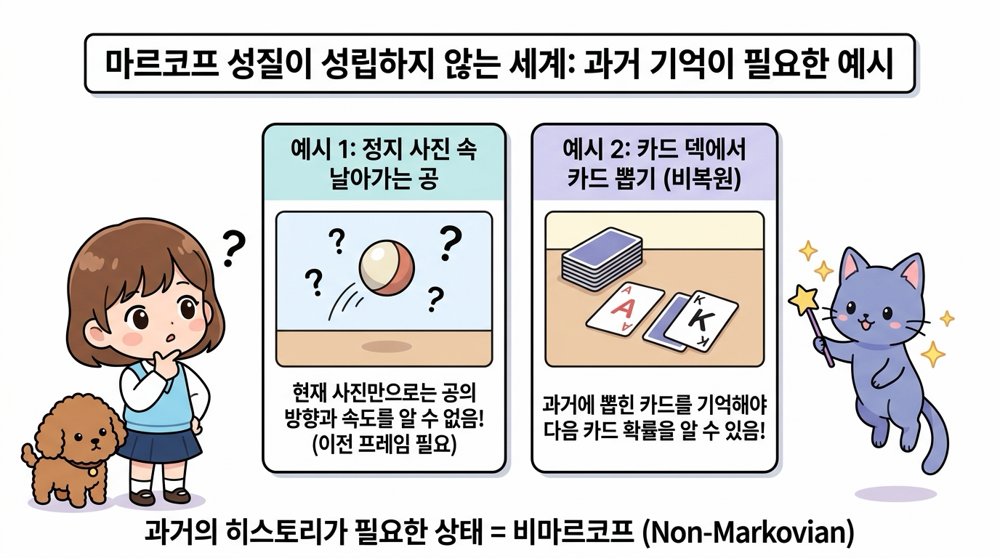
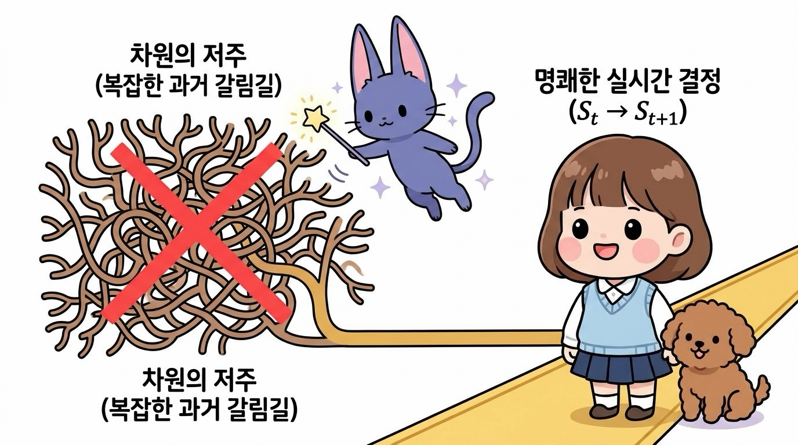
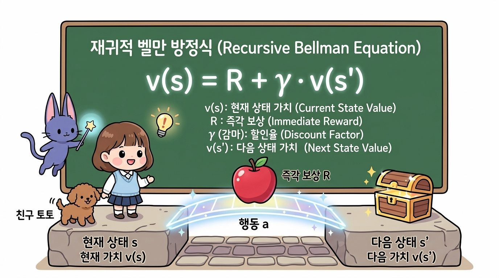

# 04.1 마르코프 인물소개와 마르코프 성질

러시아의 위대한 수학자 안드레이 마르코프의 생애와 그가 정립한 **마르코프 성질(Markov Property)**의 기원을 배웁니다. 

소설 속 글자 전이 관계를 연구하던 그의 놀라운 발견을 도로시, 토토와 함께 흥미진진하게 추적해보아요!

**그림 04-1** 마법의 글자책에서 떠오르는 자음과 모음을 관찰하며 마르코프 이론의 기원을 배우는 지니와 도로시, 토토

---

### 04.1.1 역사 속의 마르코프: 러시아 문학과 수학의 만남

'마르코프 결정 과정(MDP)'의 **마르코프(Markov)**는 러시아의 저명한 수학자인 **안드레이 마르코프**Andrey Markov, 1856~1922의 이름에서 유래되었습니다.

**그림 04-2** 러시아의 위대한 수학자 안드레이 마르코프 (Andrey Markov, 1856~1922)

19세기 후반 당시 수학계는 동전 던지기나 주사위 굴리기처럼 "모든 무작위 사건은 서로 아무런 영향을 주지 않는 독립적인 사건(독립시행)"이라는 믿음이 지배적이었습니다. 심지어 일부 학자들은 인간의 자유의지와 신학적 목적론을 수학적으로 합리화하기 위해 독립성만을 지나치게 강조하기도 했습니다.

하지만 체비쇼프(Chebyshev)의 뛰어난 제자였던 마르코프는 현실 세계의 수많은 현상들이 앞선 사건과 긴밀하게 연결되어 있다고 보았습니다. 문장 속 글자들의 배열이나 날씨의 흐름처럼 **"이전 상태가 다음 상태에 직접적인 영향을 주는 종속적인 무작위 과정"**에서도 엄밀한 확률 법칙이 작동할 수 있음을 증명하고자 했습니다.

마르코프는 자신의 가설을 증명하기 위해 컴퓨터조차 없던 1913년, 러시아의 대문호 알렉산드르 푸시킨의 운문 소설 *《예브게니 오네긴(Eugene Onegin)》* 제1장을 펼쳤습니다. 그리고 촛불 아래에서 자음 11,600자와 모음 8,400개, 총 **20,000자**를 손으로 하나하나 전수 조사하며 모음 뒤에 자음이 올 확률과 모음이 다시 올 확률을 일일이 계산했습니다.

**그림 04-3** 푸시킨의 소설 《예브게니 오네긴》의 20,000 글자를 분석하여 자모음 전이 확률을 도출하는 안드레이 마르코프

그 결과, 과거의 복잡한 문장 맥락을 전부 몰라도 **"오직 바로 직전 글자가 모음이냐 자음이냐"**에 따라 다음 글자의 출현 확률이 정교하게 결정된다는 사실을 밝혀냈습니다. 

이것이 바로 이전의 한 상태가 다음 상태의 확률을 결정하는 모델인 **'마르코프 체인(Markov Chain)'**의 탄생 순간이자, 현대 데이터 과학 및 자연어 처리(NLP)의 위대한 첫걸음이었습니다.

---

### 04.1.2 마르코프 성질(Markov Property)이란 무엇인가요?

이처럼 **"과거의 긴 히스토리와 상관없이, 오직 현재 상태(<i>S</i><i>t</i>)만이 미래 상태(<i>S</i><i>t</i>+1)를 결정한다"**는 가정을 **마르코프 성질(Markov Property)**이라고 부릅니다.

**그림 04-4** 마르코프 성질의 본질: 지나온 과거 상태에 얽매이지 않고 오직 '현재 상태(<i>S</i><i>t</i>)'만이 '미래 상태(<i>S</i><i>t</i>+1)'를 결정하는 발판의 마법

도로시가 모험을 떠날 때, 1번째 칸부터 99번째 칸까지 어떤 길을 굽이굽이 걸어왔는지는 중요하지 않습니다. 오직 지금 발을 딛고 서 있는 **100번째 돌판(<i>S</i><i>t</i>)**이 어디인가에 따라 다음에 내디딜 **101번째 돌판(<i>S</i><i>t</i>+1)**의 운명이 결정됩니다.

  

    🎧
    대화 음성 듣기 (지니 & 도로시)
  

  

    <button type="button" class="btn-audio-play" style="background: #0284c7; color: #ffffff; border: none; border-radius: 16px; padding: 5px 13px; font-size: 0.82rem; font-weight: 600; cursor: pointer; display: inline-flex; align-items: center; gap: 4px; box-shadow: 0 1px 2px rgba(2,132,199,0.3);">
      ▶️ 재생
    </button>
    <button type="button" class="btn-audio-stop" style="background: #e2e8f0; color: #475569; border: none; border-radius: 16px; padding: 5px 11px; font-size: 0.82rem; font-weight: 600; cursor: pointer; display: inline-flex; align-items: center; gap: 4px;">
      ⏹️ 정지
    </button>
  

  <audio src="./audio/dialogue_4_1_scene1.mp3" preload="none"></audio>

> 🧞‍♂️ **지니의 마법 노트: 왜 마르코프 성질이 강화학습의 구원자일까요?**
> 
> "도로시, 만약 우리가 100번째 칸에 도착했을 때 지나온 1번부터 99번 칸까지의 모든 발자국을 전부 적은 거대한 장부를 매번 들여다보아야 한다면 어떨까? 얼마 못 가 배낭이 너무 무거워져서 한 걸음도 뗄 수 없게 될 거야!
> 
> 하지만 마르코프 성질이 성립하는 세상에서는 **'현재 상태(<i>S</i><i>t</i>)' 안에 미래를 결정하는 데 필요한 모든 핵심 정보가 이미 농축**되어 있단다. 그래서 무거운 과거 장부는 구름 속으로 잊어버리고, 오직 지금 서 있는 발판만 보고도 빛나는 황금 사과를 향해 가장 빠르고 가볍게 달려갈 수 있는 거지!"

---

### 04.1.3 수식으로 만나는 마르코프 성질

마르코프 성질은 조건부 확률을 통해 다음과 같이 명쾌하게 정의할 수 있습니다:

> ### <i>P</i>(<i>S</i><i>t</i>+1 | <i>S</i><i>t</i>, <i>S</i><i>t</i>−1, ..., <i>S</i>0) = <i>P</i>(<i>S</i><i>t</i>+1 | <i>S</i><i>t</i>)

**그림 04-5** 마르코프 성질 조건부 확률 수식의 구조: 과거 무시(좌변)와 현재 충분(우변)의 일치

이 수식의 좌변과 우변이 담고 있는 의미를 하나씩 쪼개어 살펴봅시다.

* **좌변 <i>P</i>(<i>S</i><i>t</i>+1 | <i>S</i><i>t</i>, <i>S</i><i>t</i>−1, ..., <i>S</i>0) [과거 무시]**: 
  - 처음 출발지(<i>S</i>0)부터 현재(<i>S</i><i>t</i>)까지 거쳐온 모든 역사적 상태 기록(히스토리 장부)을 전부 다 펼쳐놓고 미래 상태(<i>S</i><i>t</i>+1)를 예측하는 확률입니다.

* **우변 <i>P</i>(<i>S</i><i>t</i>+1 | <i>S</i><i>t</i>) [현재 충분]**: 
  - 과거의 장부는 싹 덮어두고, 오직 현재 서 있는 상태(<i>S</i><i>t</i>) 하나만을 조건으로 주었을 때 미래 상태(<i>S</i><i>t</i>+1)가 될 확률입니다.

* **등호 `=` 의 수학적 의의**: 
  - 두 확률이 정확히 같다는 것은, **미래(<i>S</i><i>t</i>+1)를 예측하고 최적의 결정을 내리기 위해 과거의 모든 기록(<i>S</i>0 ~ <i>S</i><i>t</i>−1)을 기억할 필요가 전혀 없다**는 것을 증명합니다. 오직 '현재 상태(<i>S</i><i>t</i>)' 하나만으로도 완전히 충분(Sufficient)합니다!

**그림 04-6** 과거의 무거운 기록 장부(과거 무시) 대신 오직 현재 상태 카드 한 장(현재 충분)으로 미래를 예측하는 마르코프 성질

---

### 04.1.4 마르코프 성질이 아닌 것들의 예시 (비마르코프 과정)

도로시가 수식을 가만히 들여다보더니 호기심 가득한 눈으로 질문했습니다.

  

    🎧
    대화 음성 듣기 (도로시 & 지니)
  

  

    <button type="button" class="btn-audio-play" style="background: #0284c7; color: #ffffff; border: none; border-radius: 16px; padding: 5px 13px; font-size: 0.82rem; font-weight: 600; cursor: pointer; display: inline-flex; align-items: center; gap: 4px; box-shadow: 0 1px 2px rgba(2,132,199,0.3);">
      ▶️ 재생
    </button>
    <button type="button" class="btn-audio-stop" style="background: #e2e8f0; color: #475569; border: none; border-radius: 16px; padding: 5px 11px; font-size: 0.82rem; font-weight: 600; cursor: pointer; display: inline-flex; align-items: center; gap: 4px;">
      ⏹️ 정지
    </button>
  

  <audio src="./audio/dialogue_4_1_scene2.mp3" preload="none"></audio>

> 👧 **도로시의 궁금증**:
> 
> "지니! 그럼 세상의 모든 일들이 다 마르코프 성질을 만족하는 거야? 
> 
> 과거에 일어났던 일들을 꼭 기억해야만 미래를 알 수 있는 상황은 없어?"
>
> 🧞‍♂️ **지니의 명쾌한 해설**:
> 
> "아주 날카로운 질문이야, 도로시! 현실 세계에는 **'현재 상태'만으로는 부족하고, 과거의 지나온 기록(히스토리)을 반드시 알아야만 하는 비마르코프(Non-Markovian)** 현상들이 아주 많단다!"

**그림 04-7** 현재 상태만으로는 미래를 온전히 알 수 없어 과거 히스토리가 **반드시 필요한** 비마르코프(Non-Markovian) 과정의 대표적 예시

대표적인 **비마르코프(Non-Markovian)** 예시들을 살펴봅시다:

#### 🎾 1. 정지 사진 속 날아가는 공 (속도와 방향의 결핍)
* **상황**: 허공에 떠 있는 테니스공의 **단 한 장의 정지 사진(단일 프레임)**만 보고 1초 뒤 공의 위치를 맞혀야 합니다.
* **문제점**: 사진 속 공의 현재 위치(*x*, *y*)만 알고서는 공이 왼쪽으로 날아가는지, 오른쪽으로 떨어지는지, 속도가 얼마나 빠른지 전혀 알 수 없습니다.
* **비마르코프인 이유**: 바로 직전 프레임들(과거 궤적 히스토리)을 비교해 보아야만 속도와 방향을 계산할 수 있기 때문입니다.
* **💡 강화학습의 해결 비법 (Frame Stacking)**: 딥마인드의 아타리 게임(벽돌깨기, 퐁) AI는 단 1장의 게임 화면 대신 **연속된 4장의 프레임(Frame Stacking)**을 한 묶음으로 묶어 에이전트에게 '현재 상태'로 전달함으로써 마르코프 성질을 만족시켰습니다!

#### 🃏 2. 카드 덱에서 카드 뽑기 (비복원 추출)
* **상황**: 52장의 트럼프 카드 덱에서 한 장씩 카드를 뽑는 블랙잭이나 포커 게임입니다.
* **문제점**: 지금 테이블 위에 놓인 카드만 보아서는 다음에 에이스(A) 카드가 나올 확률을 알 수 없습니다.
* **비마르코프인 이유**: 이전에 에이스 카드가 이미 4장 다 뽑혀 나갔다면 다음 에이스 확률은 0%이고, 한 장도 안 뽑혔다면 확률이 높아집니다. 즉 **'과거에 어떤 카드가 이미 소비되었는가'**라는 과거 히스토리가 미래 확률을 직접 바꿉니다.

#### 📈 3. 주식 시장과 부분 관측 환경 (POMDP)
* **상황**: 오늘의 주가 숫자 하나만 보고 내일 주가가 오를지 내릴지 예측하는 상황입니다.
* **문제점**: 현재 가격뿐만 아니라 지난 일주일간의 가격 변동 추세(이동평균선), 거래량 변화, 최근 뉴스 등 방대한 과거의 흐름이 미래에 영향을 줍니다.
* **강화학습에서의 확장**: 이처럼 에이전트가 환경의 전체 상태를 완벽히 보지 못하는 현실 세계의 문제들을 **부분 관측 마르코프 결정 과정(POMDP, Partially Observable MDP)**이라고 부르며, 순환 신경망(RNN/LSTM)이나 트랜스포머 등을 활용해 과거 기억을 요약하여 다룹니다.

---

### 04.1.5 강화학습에서 마르코프 성질이 주는 축복

하지만 만약 우리가 다루는 환경이 **마르코프 성질**을 만족하거나, 상태 정의를 잘 정제하여 마르코프화할 수 있다면 강화학습 알고리즘은 엄청난 축복과 강력한 힘을 얻게 됩니다:

1. **메모리 절약과 계산 효율성**: 
   - 에이전트가 지나온 수천, 수만 번의 스텝 히스토리를 메모리에 쌓아둘 필요가 없으므로 계산 복잡도가 획기적으로 줄어듭니다.

**그림 04-8** 과거 히스토리 누적 없이 가벼운 메모리로 초고속 실시간 계산을 가능케 하는 마르코프 성질

2. **차원의 저주(Curse of Dimensionality) 극복**: 
   - 시간의 흐름에 따라 기하급수적으로 늘어나는 과거 경로의 가짓수를 고려하지 않아도 되므로, 실시간 의사결정이 가능해집니다.

**그림 04-9** 기하급수적으로 폭발하는 과거 경로 갈림길(차원의 저주)을 제거하고 명쾌한 실시간 결정을 내리는 원리

3. **재귀적 벨만 방정식(Bellman Equation)의 성립**: 
   - 6강에서 배우게 될 벨만 방정식처럼 현재 가치와 다음 가치를 우아한 재귀식으로 연결할 수 있는 기반이 바로 이 마르코프 성질에서 출발합니다.

**그림 04-10** 현재 상태 가치와 즉각 보상, 다음 상태 가치를 연결하는 재귀적 벨만 방정식의 수학적 기초

---

## 04.1.6 이번 절의 핵심 요약

**그림 04-11** 도로시, 토토, 지니와 함께 완성하는 마르코프 성질 완전 정복

- **안드레이 마르코프의 역사적 발견**
  - 러시아 문학 《예브게니 오네긴》의 자모음 20,000자를 전수 분석하여, 이전 사건이 다음 사건에 영향을 주는 '종속적 무작위 확률 과정(마르코프 체인)'을 수학사 최초로 증명하였습니다.

- **마르코프 성질(Markov Property)의 정의**
  - 미래 상태(<i>S</i><i>t</i>+1)는 과거의 복잡한 지나온 경로 히스토리와 상관없이, 오직 **현재 상태(<i>S</i><i>t</i>)**에 의해서만 결정된다는 핵심 가정입니다.

- **조건부 확률 수식의 본질: 과거 무시와 현재 충분**
  - <i>P</i>(<i>S</i><i>t</i>+1 | <i>S</i><i>t</i>, ..., <i>S</i>0) = <i>P</i>(<i>S</i><i>t</i>+1 | <i>S</i><i>t</i>)
  - 과거의 긴 장부를 모두 펼쳐놓고 예측한 확률(좌변)과 오직 현재 상태 하나만 보고 예측한 확률(우변)이 완전히 일치합니다.

- **비마르코프(Non-Markovian)와 현실 세계의 극복**
  - 단일 정지 사진 속 공의 속도/방향 부재, 카드 덱 비복원 추출 등 과거 기억이 필수적인 환경이 존재하며, 강화학습에서는 **프레임 스태킹(Frame Stacking)**이나 **POMDP 모델링**을 통해 이를 슬기롭게 극복합니다.

- **강화학습 에이전트를 위한 실질적 혜택**
  - 무한한 과거 메모리를 저장하지 않아도 되므로 메모리를 획기적으로 절약하고, 차원의 저주를 피해 실시간으로 신속하고 최적화된 행동 결정을 내릴 수 있습니다.

이제 마르코프 성질의 기초를 튼튼하게 다졌으니, 다음 [**04.2 마르코프 체인(Markov Chain)**](../4_2_마르코프_체인/index.html)으로 넘어가 날씨 예제를 통해 상태들이 어떻게 확률적으로 꼬리를 물고 변화하는지 본격적으로 탐험해 봅시다!
