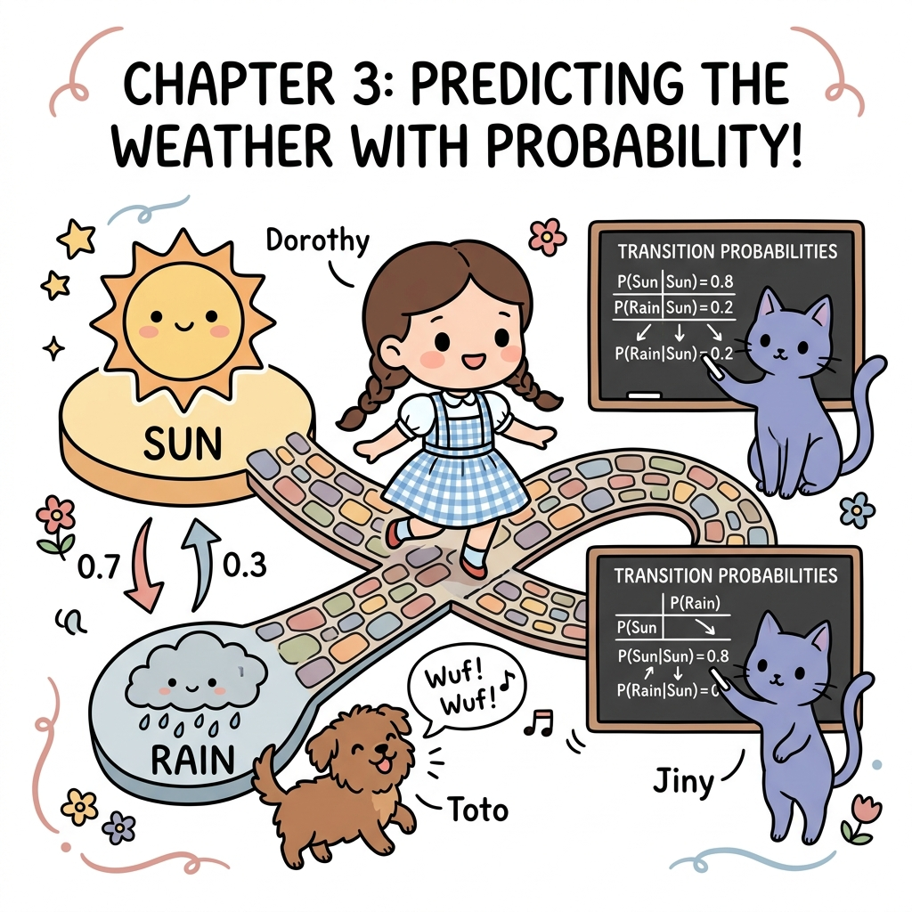
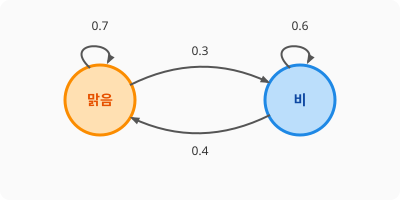

# 04.2 마르코프 체인 (Markov Chain)

**그림 04-2** 맑음(Sun)과 흐림(Rain) 플랫폼 사이의 순환 전이 확률 경로를 직접 밟으며 학습하는 도로시와 지니

시간에 따라 상태가 확률적으로 변화하는 것을 모델링한 **마르코프 체인(Markov Chain)**을 공부합니다. 오늘 날씨를 기반으로 내일 날씨를 예측하듯, 상태 간 전이 관계를 도식화하여 표현하는 요령을 도로시와 함께 밝게 풀어봅시다!

---

---

### 04.2.1 마르코프 체인의 기초 개념

우리는 앞 장에서 마르코프 성질(Markov Property)을 배웠습니다. 그렇다면 마르코프 성질을 만족하면서 시간이 지남에 따라 상태가 확률적으로 변화하는 무작위 프로세스를 무엇이라 부를까요? 

이를 바로 **마르코프 체인(Markov Chain)** 또는 **마르코프 사슬**이라고 부릅니다.

마르코프 체인은 상태들의 집합이 유한하고, 시간의 흐름이 불연속적인 이산 타임 스텝(*t* = 0, 1, 2, ...) 단위로 끊어지는 가장 단순하고도 강력한 확률 모델입니다.

---

### 04.2.2 날씨 예제로 이해하는 상태 전이

하루 단위로 관측되는 날씨 시스템을 예로 들어봅시다. 

이 시스템은 오직 두 가지 상태인 **'맑음'**과 **'비'**만을 가집니다:

- *S* = {맑음, 비}

오늘 날씨(*S**t*)에 따른 내일 날씨(*S**t*+1)의 확률 분포가 다음과 같다고 가정해 봅시다:

1. **오늘 맑으면**: 내일도 맑을 확률이 0.7, 내일 비가 올 확률이 0.3입니다.
2. **오늘 비가 오면**: 내일 맑을 확률이 0.4, 내일도 비가 올 확률이 0.6입니다.

이를 도식으로 나타내면 아래의 **상태 전이도(State Transition Diagram)**가 됩니다.

**그림 04-1** 날씨 마르코프 체인의 상태 전이도

---

### 04.2.3 상태 전이 확률 행렬 (State Transition Probability Matrix)

이러한 상태 전이 확률을 수식으로 표기할 때는 *P*(*S**t*+1 = *j* | *S**t* = *i*)를 뜻하는 기호 *p**ij*를 사용합니다. 

예를 들어 오늘 맑음(*S**t* = 1)에서 내일 비(*S**t*+1 = 2)로 갈 확률은 다음과 같습니다:
$$
p_{12} = P(S_{t+1} = 2 \mid S_t = 1) = 0.3
$$

이 모든 전이 확률 *p**ij*를 한눈에 볼 수 있도록 바둑판 모양의 행렬로 묶어 정리한 것을 **상태 전이 확률 행렬(State Transition Probability Matrix)**이라고 하며, 대문자 **\*P\***로 표기합니다:
$$
P = \begin{pmatrix}
p_{11} & p_{12} \\
p_{21} & p_{22}
\end{pmatrix}
= \begin{pmatrix}
0.7 & 0.3 \\
0.4 & 0.6
\end{pmatrix}
$$

- 행(가로줄): 현재 상태 ($i$)
- 열(세로줄): 다음 상태 ($j$)
- **성질**: 각 행의 확률 합은 언제나 정확히 1.0 (100%)이 되어야 합니다. 왜냐하면 어떤 상태에 있든 다음 상태 중 반드시 하나로는 이동해야 하기 때문입니다 (0.7 + 0.3 = 1.0, 0.4 + 0.6 = 1.0).
