# 04.2 마르코프 체인 (Markov Chain)

시간에 따라 상태가 확률적으로 변화하는 과정을 모델링한 **마르코프 체인(Markov Chain)**을 공부합니다. 

오늘 날씨를 기반으로 내일과 모레의 날씨를 예측하듯, 상태 간 전이 관계를 도식화하고 행렬로 표현하는 원리를 도로시, 토토와 함께 신나게 탐험해보아요!

**그림 04-2-1** 맑음(Sun)과 비(Rain) 플랫폼 사이의 순환 전이 확률 경로를 직접 밟으며 학습하는 도로시와 토토, 지니

---

### 04.2.1 마르코프 체인이란 무엇인가요?

우리는 앞서 4.1절에서 **"미래는 오직 현재에 의해서만 결정된다"**는 **마르코프 성질(Markov Property)**을 배웠습니다. 

그렇다면 이 마르코프 성질을 만족하면서, 시간이 흐름에 따라 여러 상태 사이를 **확률적**으로 퐁당퐁당 이동하는 전체적인 시스템(**확률 과정**)을 무엇이라 부를까요?

**그림 04-2-2** "오늘 날씨만 알면 내일과 모레 날씨도 사슬처럼 줄줄이 알아맞힐 수 있을까?" 궁금해하는 도로시와 토토

도로시가 달력과 작은 노란 우산을 들고 갸우뚱하며 질문했습니다.

> 👧 **도로시의 궁금증**: 
> 
> "지니! 어제 마르코프 성질을 배울 때 과거의 복잡한 지나온 길은 다 잊어도 된다고 했잖아. 
> 
> 그럼 오늘 날씨가 '맑음'이라는 것만 알면, 내일 날씨뿐만 아니라 모레나 글피 날씨도 사슬처럼 줄줄이 이어서 확률을 계산할 수 있는 거야?"

---

토토도 귀를 쫑긋 세우며 달력 위를 콩콩 짚었습니다.

지니가 빙그레 미소를 지으며 마법 지팡이로 허공에 반짝이는 황금 사슬을 그려 보였습니다.

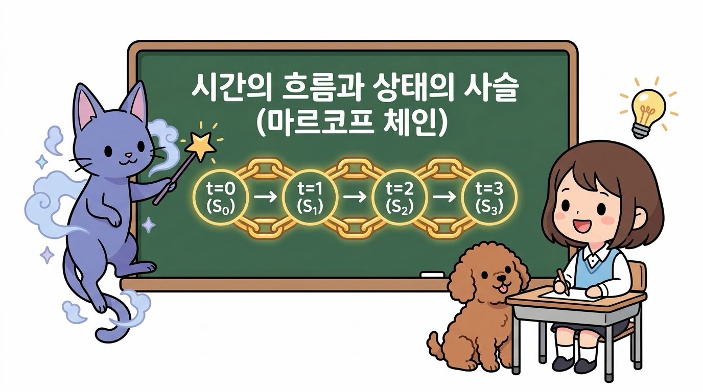

**그림 04-2-3** 시간의 흐름(Time Steps)에 따라 상태들이 사슬처럼 꼬리를 물고 이어지는 마르코프 체인의 기본 구조

> 🧞‍♂️ **지니의 마법 노트: 상태들이 사슬처럼 엮인 세상!**
> 
> "맞아, 도로시! 바로 그것을 수학에서는 **마르코프 체인(Markov Chain, 마르코프 사슬)**이라고 부른단다. 
> 
> 시간의 흐름을 째깍째깍 불연속적인 타임 스텝(<i>t</i> = 0, 1, 2, 3, ...)으로 나누고, 상태(State)들이 마르코프 성질을 지키며 확률적으로 다음 상태로 넘어가는 연결 고리를 의미하지!"

---

#### 핵심구성 요소

마르코프 체인의 핵심 구성 요소는 다음과 같습니다:

1. **유한한 상태 공간 (State Space, <i>S</i>)**: 에이전트나 환경이 놓일 수 있는 모든 가능한 상태들의 집합입니다.
2. **이산 타임 스텝 (Discrete Time Steps, <i>t</i>)**: 하루, 1초, 1스텝처럼 일정한 단위로 끊어지는 시간의 흐름입니다.
3. **마르코프 성질**: 내일의 상태(<i>S</i><i>t</i>+1)는 오직 오늘의 상태(<i>S</i><i>t</i>)에 의해서만 확률적으로 결정됩니다.

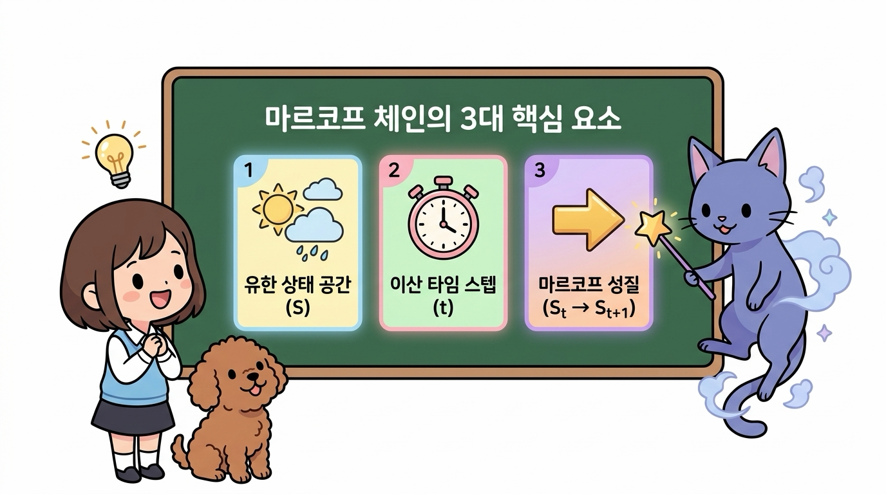

**그림 04-2-4** 마르코프 체인을 이루는 3대 핵심 기둥: 유한 상태 공간, 이산 타임 스텝, 마르코프 성질

---

### 04.2.2 날씨 예제로 이해하는 상태 전이 (State Transition)

가장 직관적인 **날씨 시스템**을 예로 들어 마르코프 체인의 작동 원리를 살펴봅시다.

#### 상태집합

이 가상 마을의 날씨 시스템은 오직 두 가지 상태만을 가집니다:

* **상태 집합**: <i>S</i> = { 1: 맑음, 2: 비 }

**그림 04-2-5** 날씨 시스템이 가질 수 있는 두 가지 기본 상태(상태 공간 S): 맑음과 비

---

#### 확률규칙

오늘 날씨(<i>S</i><i>t</i>)가 무엇이냐에 따라 내일 날씨(<i>S</i><i>t</i>+1)가 될 확률 규칙이 다음과 같다고 해봅시다:

* **오늘 맑으면(<i>S</i><i>t</i> = 1)**:
  - 내일도 계속 **맑을** 확률: **0.7 (70%)**
  - 내일 날씨가 **비**로 바뀔 확률: **0.3 (30%)**
* **오늘 비가 오면(<i>S</i><i>t</i> = 2)**:
  - 내일 날씨가 **맑음**으로 갤 확률: **0.4 (40%)**
  - 내일도 계속 **비**가 올 확률: **0.6 (60%)**

----

#### 상태전이

이처럼 하나의 상태에서 다른 상태(또는 자기 자신)로 시간이 지나 이동하는 과정을 **상태 전이(State Transition)**라고 부릅니다. 

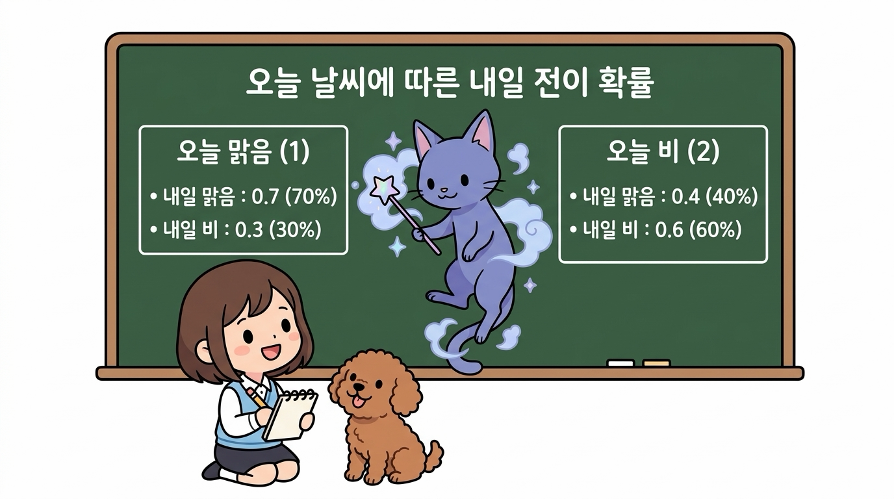

**그림 04-2-6** 오늘 날씨(현재 상태)에 따라 결정되는 내일 날씨(다음 상태)의 4가지 전이 확률 케이스

---

#### 상태전이도

이 전이 관계를 동그란 노드(Node)와 방향 화살표로 시각화한 그림을 **상태 전이도(State Transition Diagram)**라고 합니다.

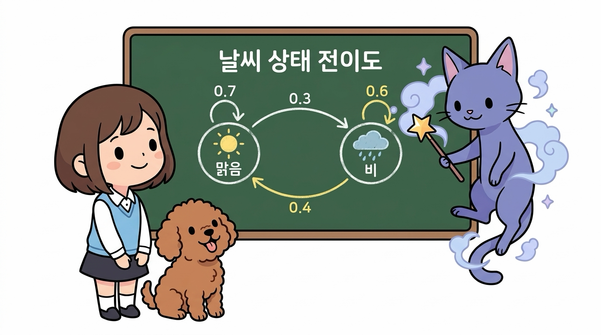

**그림 04-2-7** 맑음과 비 두 상태 사이의 이동 확률을 화살표와 수치로 나타낸 날씨 상태 전이도

* **자기 자신으로 돌아오는 화살표 (Self-Loop)**: 상태가 다음 날에도 유지될 확률을 나타냅니다 (맑음→맑음: 0.7, 비→비: 0.6).
* **서로를 향하는 화살표 (Transition Arrow)**: 상태가 다른 상태로 바뀔 확률을 나타냅니다 (맑음→비: 0.3, 비→맑음: 0.4).

---

### 04.2.3 상태 전이 확률과 기호 표기 (<i>p</i><i>ij</i>)

상태 전이를 수학적으로 다룰 때는 조건부 확률 기호 대신 간결한 **전이 확률 기호 <i>p</i><i>ij</i>**를 즐겨 사용합니다.

**그림 04-2-8** "<i>p</i>12와 <i>p</i>21 중에 누가 출발 상태이고 누가 도착 상태일까?" 고민하는 도로시와 토토

수학 기호를 처음 접한 도로시가 연습장에 펜을 대고 고개를 갸우뚱했습니다.

----

> 👧 **도로시의 질문**: 
> 
> "지니! <i>p</i>12랑 <i>p</i>21은 아래 숫자가 반대잖아. 
> 
> 맑음(1)에서 비(2)로 가는 확률은 12야, 아니면 21이야? 앞 숫자가 출발지야, 아니면 도착지야?"

지니가 마법 칠판에 큰 글씨로 화살표를 그리며 명쾌하게 설명해 주었습니다.

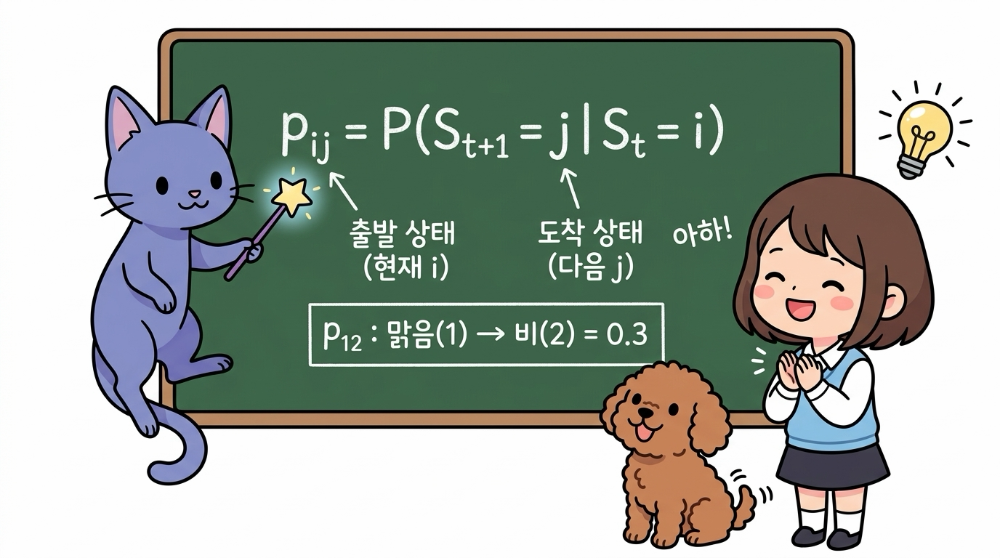

**그림 04-2-9** 출발 상태(현재 <i>i</i>)에서 도착 상태(다음 <i>j</i>)로 가는 규칙 <i>p</i><i>ij</i>를 가르쳐주는 지니와 이해한 도로시

> 🧞‍♂️ **지니의 명쾌한 규칙: 왼쪽(<i>i</i>)에서 오른쪽(<i>j</i>)으로!**
> 
> "도로시, 기호 <b><i>p</i><i>ij</i></b>에서 **첫 번째 첨자 <i>i</i>는 '현재 출발하는 상태'**이고, **두 번째 첨자 <i>j</i>는 '다음에 도착할 상태'**를 뜻한단다!
> 
> 즉, '상태 <i>i</i>에서 출발하여 상태 <i>j</i>에 도착할 확률'인 셈이지!"

----

수식으로 표현하면 다음과 같이 조건부 확률과 정확히 일치합니다:

> ### <i>p</i><i>ij</i> = <i>P</i>( <i>S</i><i>t</i>+1 = <i>j</i> | <i>S</i><i>t</i> = <i>i</i> )

우리 날씨 예제의 4가지 전이 확률을 기호로 정리하면 다음과 같습니다:

* **<i>p</i>11** = <i>P</i>(<i>S</i><i>t</i>+1 = 맑음 | <i>S</i><i>t</i> = 맑음) = **0.7**
* **<i>p</i>12** = <i>P</i>(<i>S</i><i>t</i>+1 = 비 | <i>S</i><i>t</i> = 맑음) = **0.3**
* **<i>p</i>21** = <i>P</i>(<i>S</i><i>t</i>+1 = 맑음 | <i>S</i><i>t</i> = 비) = **0.4**
* **<i>p</i>22** = <i>P</i>(<i>S</i><i>t</i>+1 = 비 | <i>S</i><i>t</i> = 비) = **0.6**

---

### 04.2.4 상태 전이 확률 행렬 (State Transition Probability Matrix)

이 모든 전이 확률 <i>p</i><i>ij</i>들을 바둑판 모양의 2차원 표로 정갈하게 묶은 것을 **상태 전이 확률 행렬(State Transition Probability Matrix)**이라고 부르며, 대문자 **<i>P</i>**로 나타냅니다.

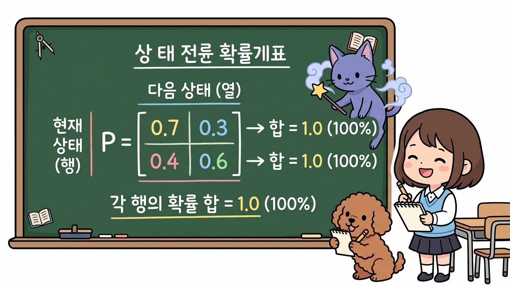

**그림 04-2-10** 행(현재 상태 <i>i</i>)과 열(다음 상태 <i>j</i>)로 구성되며, 각 행의 합이 정확히 1.0(100%)이 되는 상태 전이 확률 행렬 <i>P</i>

----

행렬 표기:

| 현재 \ 다음 | 1 (맑음) | 2 (비) | **행의 합 (Row Sum)** |
| :---: | :---: | :---: | :---: |
| **1 (맑음)** | 0.7 | 0.3 | **0.7 + 0.3 = 1.0 (100%)** |
| **2 (비)** | 0.4 | 0.6 | **0.4 + 0.6 = 1.0 (100%)** |

수학적 행렬 표기:

<i>P</i> = 
[ [ 0.7, 0.3 ], 
  [ 0.4, 0.6 ] ]

---

#### 💡 상태 전이 확률 행렬의 절대 원칙: "각 행의 합은 항상 1.0이다!"

행렬 <i>P</i>를 관찰해 보면 아주 중요한 수학적 법칙을 발견할 수 있습니다:

1. **가로줄(행, Row) = 현재 상태 <i>i</i>**: 오늘 내가 서 있는 출발 지점입니다.
2. **세로줄(열, Column) = 다음 상태 <i>j</i>**: 내일 내가 도달할 도착 지점입니다.
3. **각 행의 합 = 1.0**: 오늘 맑든 비가 오든, 내일은 **'맑거나' 혹은 '비가 오거나'** 둘 중 하나로 100% 결정되어야 하기 때문에 가로줄의 모든 확률을 더하면 언제나 정확히 1.0(100%)이 됩니다.

> **∑<i>j</i> <i>p</i><i>ij</i> = 1.0 (모든 <i>i</i>에 대하여)**

---

### 04.2.5 한 걸음 더: 2일 뒤(모레) 날씨 예측하기 (행렬 거듭제곱의 마법)

마르코프 체인의 진정한 위력은 **"먼 미래의 상태 확률을 아주 쉽게 계산할 수 있다"**는 점에 있습니다!

---

#### 미래의 확률

만약 **"오늘 날씨가 맑을 때, 2일 뒤(모레) 날씨도 맑을 확률"**은 어떻게 구할 수 있을까요?

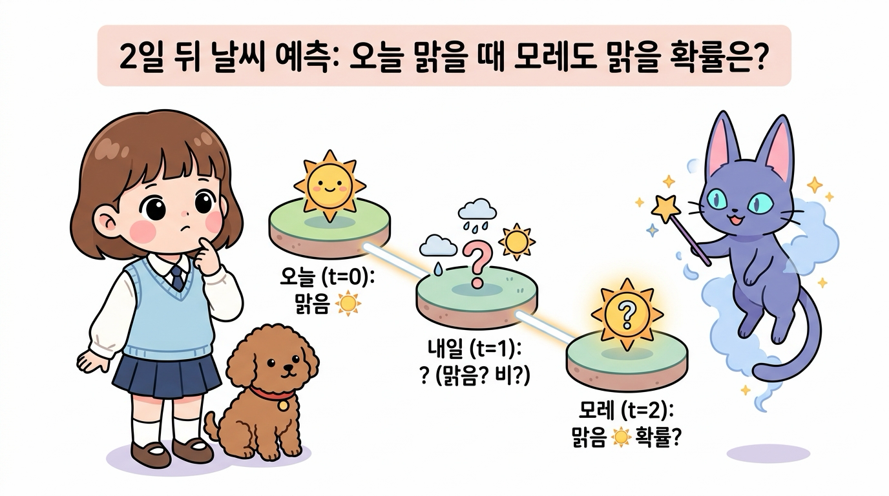

**그림 04-2-11** 오늘 맑음에서 시작하여 내일을 거쳐 2일 뒤(모레) 날씨도 맑을 확률을 어떻게 구할 수 있을지 호기심을 갖는 도로시와 토토, 그리고 지니

---

#### 2가지 경로의 확률 계산 (확률 가지치기)

오늘(맑음)에서 모레(맑음)로 가는 길은 중간 날(내일)의 날씨에 따라 딱 **2가지 경로**가 존재합니다:

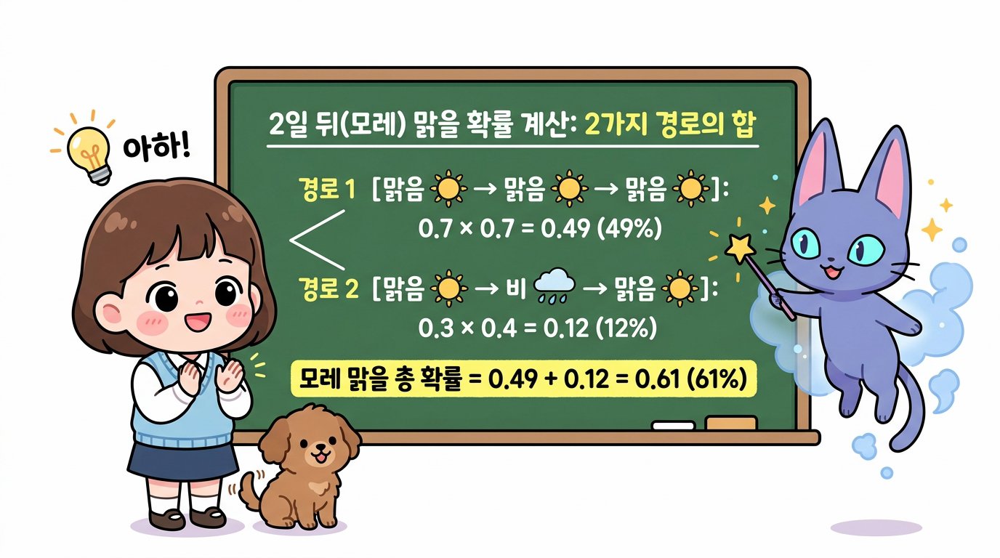

**그림 04-2-12** 오늘 맑음에서 내일의 두 갈래 길(맑음, 비)을 거쳐 모레 맑음이 될 확률(61%)을 각각 곱하고 더하여 계산하는 2스텝 확률 가지치기 원리

1. **경로 1 [맑음 → 맑음 → 맑음]**:
   - 오늘 맑음에서 내일 맑을 확률(0.7) × 내일 맑음에서 모레 맑을 확률(0.7)
   - = 0.7 × 0.7 = **0.49 (49%)**

2. **경로 2 [맑음 → 비 → 맑음]**:
   - 오늘 맑음에서 내일 비 올 확률(0.3) × 내일 비에서 모레 맑을 확률(0.4)
   - = 0.3 × 0.4 = **0.12 (12%)**

두 경로는 서로 겹치지 않는 독립적인 경우이므로, 두 확률을 더해주면 모레 맑을 총 확률이 완벽하게 계산됩니다:

> ### **모레 맑을 확률 = 0.49 + 0.12 = 0.61 (61%)**

---

#### 🔮 행렬 거듭제곱의 마법 (P²과 Pⁿ)

도로시가 계산식을 보며 감탄하자, 지니가 빙그레 웃으며 마법 지팡이를 휘둘렀습니다.

> 🧞‍♂️ **지니의 마법 팁: 일일이 가지치기 계산할 필요가 없단다!**
> 
> "도로시, 모든 출발 상태와 도착 상태에 대해 매번 손으로 갈래길을 다 그리면 너무 복잡하겠지? 
> 
> 놀랍게도 상태 전이 행렬 <i>P</i>를 자기 자신과 곱하기만 하면(<i>P</i>2 = <i>P</i> × <i>P</i>), 2일 뒤 발생할 수 있는 **모든 4가지 경우의 전이 확률이 단 한 번에 마법처럼 계산**된단다!"

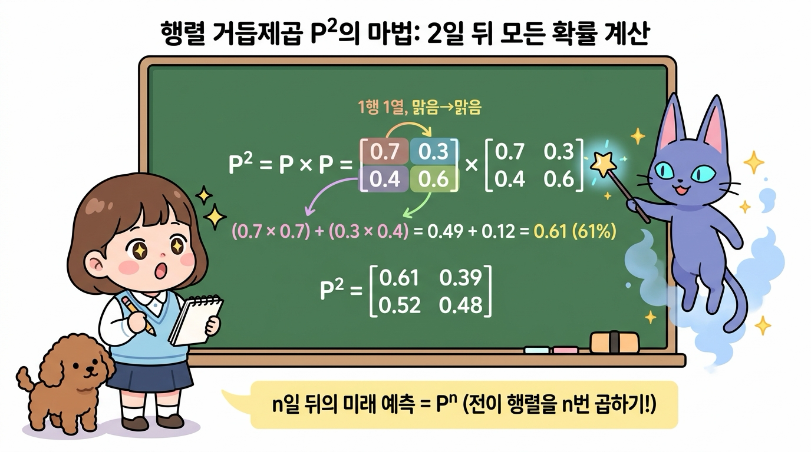

**그림 04-2-13** 전이 행렬을 두 번 곱하는 행렬 거듭제곱(<i>P</i>2)으로 2일 뒤의 모든 전이 확률을 한 번에 구하고, <i>n</i>스텝 미래 예측(<i>P</i><i>n</i>)으로 확장하는 원리

행렬 곱셈(Matrix Multiplication)의 원리를 살펴보면, 방금 우리가 계산한 수식과 완전히 일치함을 알 수 있습니다:

1. **(1행 1열) 원소: [오늘 맑음 → 모레 맑음]**
   - (행렬 <i>P</i>의 1행: [0.7, 0.3]) × (행렬 <i>P</i>의 1열: [0.7, 0.4]T)
   - = (0.7 × 0.7) + (0.3 × 0.4) = 0.49 + 0.12 = **0.61 (61%)**

2. **(1행 2열) 원소: [오늘 맑음 → 모레 비]**
   - (행렬 <i>P</i>의 1행: [0.7, 0.3]) × (행렬 <i>P</i>의 2열: [0.3, 0.6]T)
   - = (0.7 × 0.3) + (0.3 × 0.6) = 0.21 + 0.18 = **0.39 (39%)**

3. **(2행 1열) 원소: [오늘 비 → 모레 맑음]**
   - (행렬 <i>P</i>의 2행: [0.4, 0.6]) × (행렬 <i>P</i>의 1열: [0.7, 0.4]T)
   - = (0.4 × 0.7) + (0.6 × 0.4) = 0.28 + 0.24 = **0.52 (52%)**

4. **(2행 2열) 원소: [오늘 비 → 모레 비]**
   - (행렬 <i>P</i>의 2행: [0.4, 0.6]) × (행렬 <i>P</i>의 2열: [0.3, 0.6]T)
   - = (0.4 × 0.3) + (0.6 × 0.6) = 0.12 + 0.36 = **0.48 (48%)**

완성된 2일 뒤 상태 전이 행렬 <i>P</i>2는 다음과 같습니다:

<i>P</i>2 = 
[ [ 0.61, 0.39 ], 
  [ 0.52, 0.48 ] ]

> **💡 확인 포인트**: <i>P</i>2 역시 각 행의 합이 **0.61 + 0.39 = 1.0**, **0.52 + 0.48 = 1.0**으로 100% 확률 보존 법칙을 완벽히 만족합니다!

#### 🚀 n일 뒤의 미래 예측 (Pⁿ)

이 원리는 3일 뒤, 10일 뒤, 100일 뒤의 먼 미래에도 그대로 확장됩니다:

* **3일 뒤 날씨 전이 행렬**: <i>P</i>3 = <i>P</i> × <i>P</i> × <i>P</i>
* **<i>n</i>일 뒤 날씨 전이 행렬**: <i>P</i><i>n</i> = <i>P</i>를 <i>n</i>번 거듭제곱

즉, 아무리 먼 미래라도 **상태 전이 행렬을 <i>n</i>번 거듭제곱(<i>P</i><i>n</i>)**하기만 하면 컴퓨터가 순식간에 미래의 모든 확률 지도를 완벽하게 계산해 냅니다!

---

### 04.2.6 강화학습에서의 의의: 환경의 자연스러운 흐름과 MDP로의 확장

강화학습에서 우리가 배운 **마르코프 체인**은 어떤 결정적인 역할을 할까요?

#### 🌍 1. 환경의 자연스러운 물리 법칙 (환경 모델의 기초)

마르코프 체인은 에이전트(도로시)의 의지나 행동 개입 없이, **바람이 불고 비가 오듯 자연적으로 흘러가는 환경의 동역학(Physics of the World)**을 수학적으로 모델링한 것입니다.

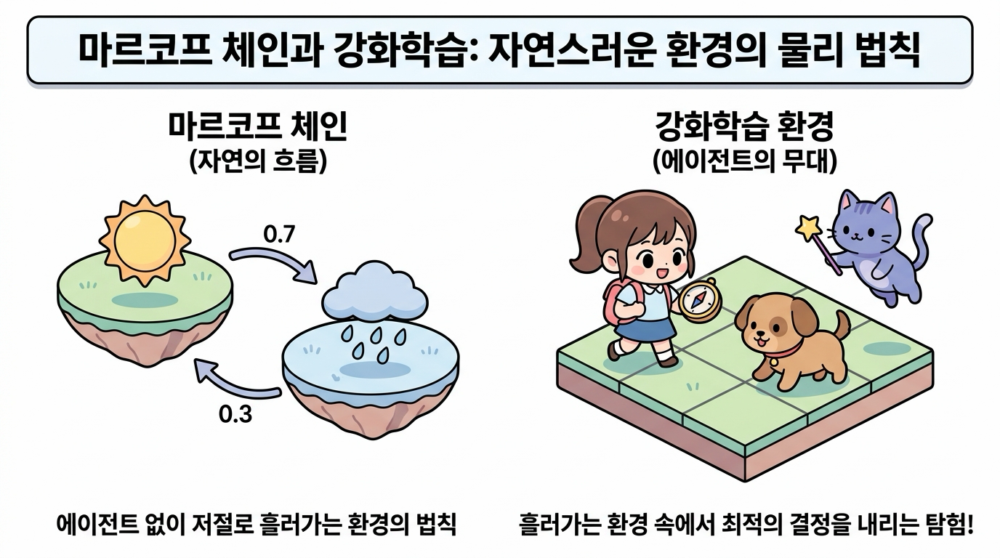

**그림 04-2-14** 에이전트의 개입 없이 스스로 흘러가는 자연의 물리 법칙(마르코프 체인)과 그 위에서 최적의 결정을 내리는 탐험의 무대(강화학습 환경)

* **수동적 환경 (마르코프 체인)**: 상태들이 오직 확률 규칙에 따라 저절로 흘러갑니다. 관찰자는 날씨가 맑아지거나 비가 오는 것을 그저 바라볼 뿐입니다.
* **능동적 무대 (강화학습 환경)**: 도로시가 발을 디디는 격자 세상(Grid World)의 바닥 타일, 미끄러운 얼음판, 움직이는 장애물 등 **환경 자체의 고유한 상태 변화 법칙**이 바로 마르코프 체인으로 구성됩니다.

---

#### 🧩 2. 마르코프 체인에서 마르코프 결정 과정(MDP)으로의 확장

우리가 다음 장들에서 본격적으로 정복하게 될 **마르코프 결정 과정(MDP, Markov Decision Process)**은 이 마르코프 체인의 뼈대 위에 두 가지 핵심 요소를 얹은 완성형 시스템입니다:

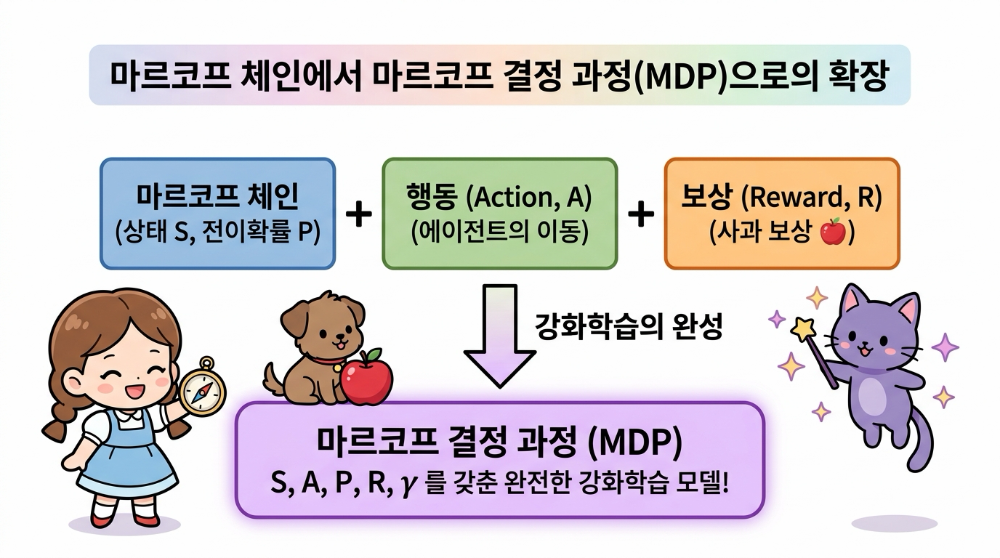

**그림 04-2-15** 마르코프 체인의 상태(S)와 전이확률(P) 위에 에이전트의 행동(A)과 보상(R)을 결합하여 완성되는 마르코프 결정 과정(MDP)

> ### **마르코프 체인 (<i>S</i>, <i>P</i>) + 행동(<i>A</i>) + 보상(<i>R</i>) + 할인율(<i>γ</i>) = 마르코프 결정 과정 (MDP)**

1. **행동(Action, <i>A</i>)의 추가**:
   - 마르코프 체인에서는 상태가 환경의 규칙에 의해서만 변했지만, 강화학습에서는 **도로시가 내리는 발걸음(상·하·좌·우 이동 등)**에 따라 다음 상태로 갈 확률이 달라집니다.
2. **보상(Reward, <i>R</i>)의 추가**:
   - 특정 상태에 도달하거나 행동을 취했을 때 지니가 건네는 **달콤한 사과(+10)나 함정(-10)** 같은 즉각적인 피드백 신호가 부여됩니다.
3. **최적의 정책(Policy, <i>π</i>) 학습**:
   - 이제 도로시는 단순히 미래 확률을 내다보는 것에 그치지 않고, **"어느 길로 가야 가장 많은 보상 사과를 얻을 수 있을까?"**를 스스로 학습하며 최적의 정책(<i>π</i>*)을 찾아내게 됩니다.

따라서 마르코프 체인의 상태 전이와 행렬 표현을 확실하게 이해하는 것이야말로, 강화학습의 최고봉인 **MDP와 벨만 방정식(Bellman Equation)**으로 올라가는 가장 튼튼한 디딤돌이 됩니다!

---

## 🧭 이번 절의 핵심 요약

**그림 04-2-16** 도로시, 토토, 지니와 함께 완성하는 마르코프 체인 완전 정복

- **마르코프 체인(Markov Chain)의 정의**
  - 마르코프 성질을 만족하면서, 이산 타임 스텝(<i>t</i> = 0, 1, 2, ...)에 따라 상태들이 확률적으로 전이하는 시스템 모델입니다.

- **마르코프 체인의 3대 핵심 요소**
  - 유한 상태 공간(<i>S</i>), 이산 타임 스텝(<i>t</i>), 마르코프 성질(<i>S</i><i>t</i> &rarr; <i>S</i><i>t</i>+1).

- **상태 전이도(State Transition Diagram)**
  - 각 상태를 노드(동그라미)로, 상태 간 이동 확률을 방향 화살표로 표현하여 시스템의 동적 흐름을 직관적으로 시각화한 지도입니다.

- **전이 확률 기호 <i>p</i><i>ij</i>의 규칙**
  - <i>p</i><i>ij</i> = <i>P</i>(<i>S</i><i>t</i>+1 = <i>j</i> | <i>S</i><i>t</i> = <i>i</i>)
  - 첫 번째 첨자 <i>i</i>는 **출발 상태(현재)**를, 두 번째 첨자 <i>j</i>는 **도착 상태(다음)**를 나타냅니다.

- **상태 전이 확률 행렬(<i>P</i>)의 핵심 성질**
  - 가로줄(행)은 현재 상태, 세로줄(열)은 다음 상태를 의미합니다.
  - 모든 행의 합은 반드시 **1.0 (100%)**이어야 합니다 (∑<i>j</i> <i>p</i><i>ij</i> = 1.0).

- **<i>n</i>스텝 미래 예측과 행렬 곱**
  - 2일 뒤, 3일 뒤의 상태 전이 확률은 전이 행렬의 거듭제곱(<i>P</i>2, <i>P</i>3, ...)을 통해 수학적으로 손쉽게 계산할 수 있습니다.

이제 마르코프 체인과 상태 전이 행렬을 완벽하게 마스터했으니, 다음 [**04.3 마르코프 과정 (Markov Process)**](../4_3_마르코프_과정/index.html)으로 넘어가 상태 공간과 전이 행렬의 수학적 튜플 정의와 궤적(Trajectory)의 개념을 정복해 봅시다!
