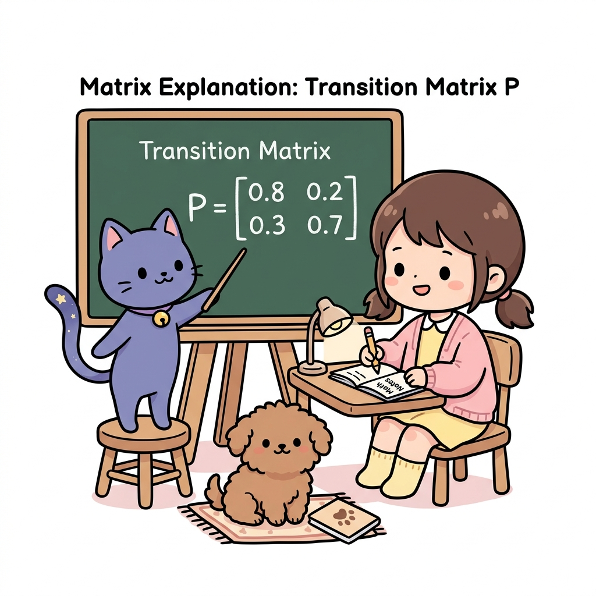
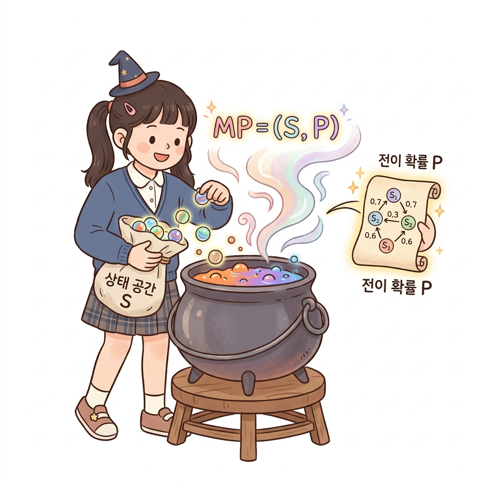
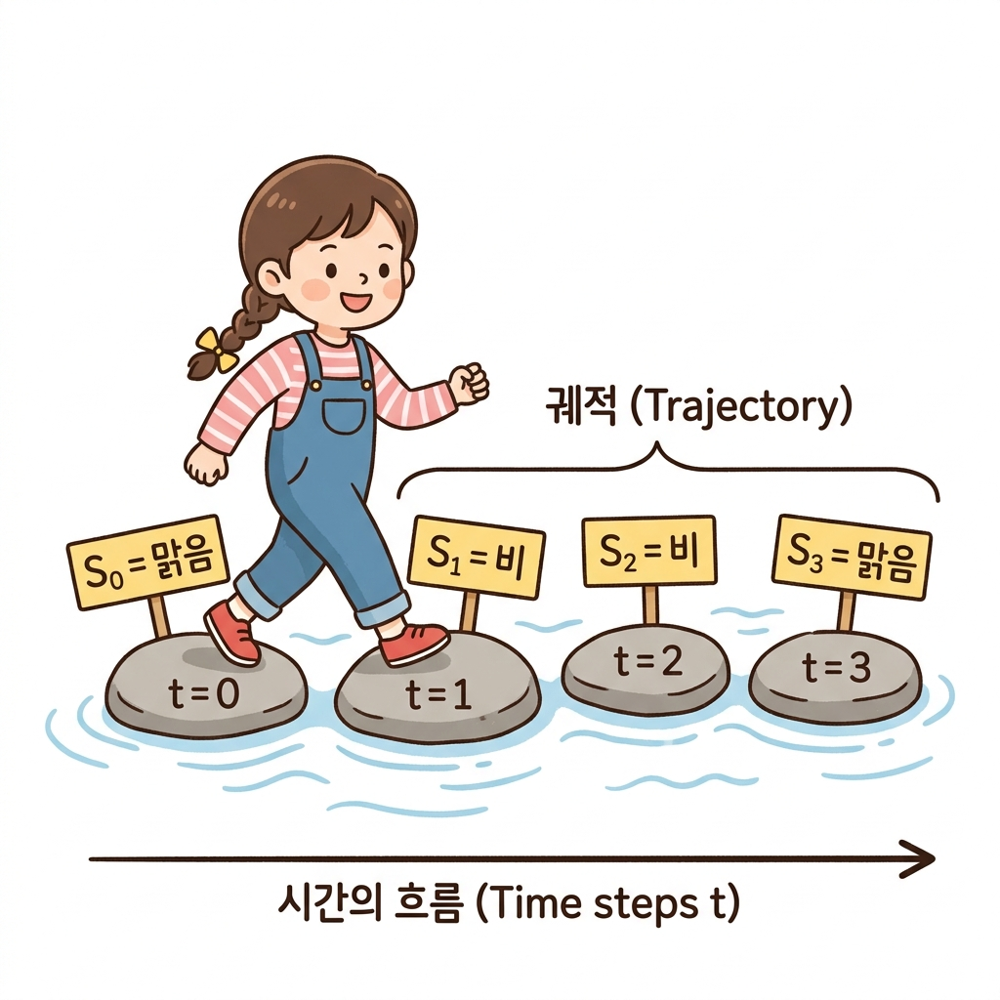
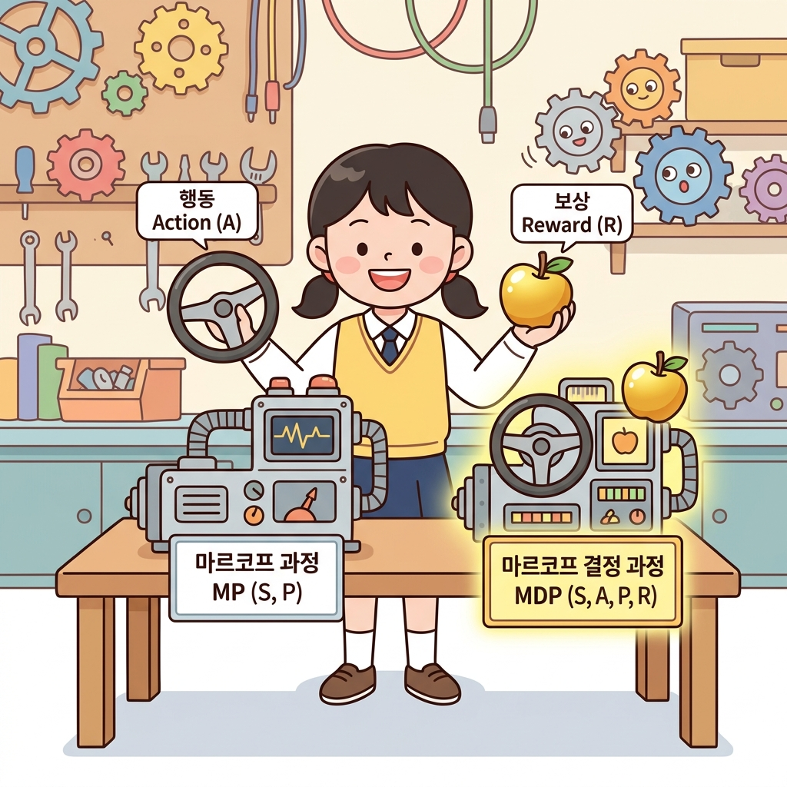

# 04.3 마르코프 과정 (Markov Process)

**그림 04-3** 상태 공간과 상태 전이 확률 행렬 P의 칠판 연산을 도로시에게 가르치는 요정 지니

마르코프 성질을 띤 무작위 상태 변화 프로세스 자체를 일컫는 **마르코프 과정(Markov Process)**을 배웁니다. 상태들의 집합인 $S$와 이들 간의 확률 지표를 담은 상태 전이 확률 행렬 $P$의 기호 정의와 계산 방법을 지니의 칠판 설명을 토대로 확실히 학습해봅시다!

---

### 04.3.1 마르코프 과정의 정의

**마르코프 과정(Markov Process)**은 마르코프 성질을 가진 무작위 상태 변화 프로세스 그 자체를 의미하는 수학적 모델입니다. 수학적으로 마르코프 과정은 다음의 두 가지 요소로 이루어진 튜플로 정의할 수 있습니다:
$$
\text{MP} = (S, P)
$$

- ***S***: 에이전트가 존재할 수 있는 모든 상태들의 유한한 집합 (상태 공간, State Space)
- ***P***: 상태 *s*에서 다음 상태 *s'*로 이동할 확률을 규정하는 상태 전이 확률 행렬 (State Transition Probability Matrix)

---

### 04.3.2 상태의 시퀀스: 궤적 (Trajectory)

마르코프 과정은 시간의 흐름에 따라 여러 상태를 거쳐 가게 됩니다. 예를 들어 타임 스텝 *t* = 0에서의 상태 *S*0부터 시작하여 *S*1, *S*2, *S*3, ... 순으로 계속해서 상태가 변화합니다.

이렇게 에이전트가 지나간 상태들의 역사(순서)를 **궤적(Trajectory)** 또는 **시퀀스(Sequence)**라고 부릅니다.

우리가 4.2절에서 다룬 날씨 마르코프 체인을 통해 날씨 궤적을 무작위로 생성해 보면 다음과 같은 히스토리가 발생할 수 있습니다:

**그림 04-2** 날씨 마르코프 과정의 시간적 궤적 예시

- ***t* = 0**: 오늘 날씨 *S*0 = 맑음으로 시작합니다.
- ***t* = 1**: 0.3의 확률을 뚫고 내일 날씨 *S*1 = 비가 되었습니다.
- ***t* = 2**: 0.6의 확률로 모레 날씨 *S*2 = 비가 계속 유지되었습니다.
- ***t* = 3**: 0.4의 확률로 글피 날씨 *S*3 = 맑음으로 복귀했습니다.

이 무작위 과정의 궤적 [맑음, 비, 비, 맑음]이 나타날 확률은 단순 확률 곱셈을 통해 다음과 같이 계산할 수 있습니다:
$$
P(S_0=\text{맑음}, S_1=\text{비}, S_2=\text{비}, S_3=\text{맑음}) = 1.0 \times 0.3 \times 0.6 \times 0.4 = 0.072 \quad (7.2\%)
$$

---

### 04.3.3 마르코프 과정과 강화 학습의 연관성

강화 학습의 뼈대인 **마르코프 결정 과정(MDP)**은 이 마르코프 과정에 **두 가지 핵심적인 요소**를 추가한 것입니다:
1. 에이전트가 주체적으로 개입할 수 있는 **행동(Action, A)**
2. 에이전트가 잘했는지 못했는지 평가할 수 있는 **보상(Reward, R)**

따라서, 우리가 마르코프 과정(MP)의 성질과 전이 확률을 정확하게 이해해야만, 에이전트가 개입했을 때 상태가 어떻게 바뀌고 보상을 어떻게 극대화할 수 있는지(MDP)를 탄탄하게 논리적으로 쌓아 올릴 수 있습니다.

